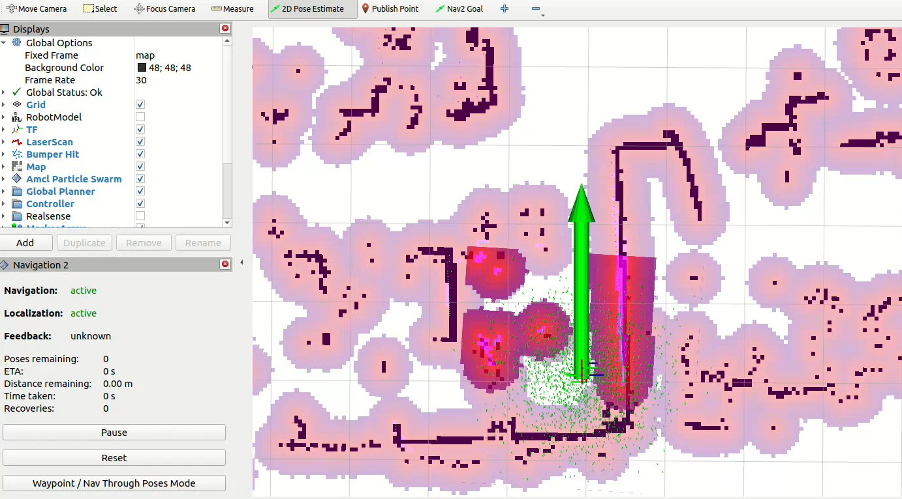
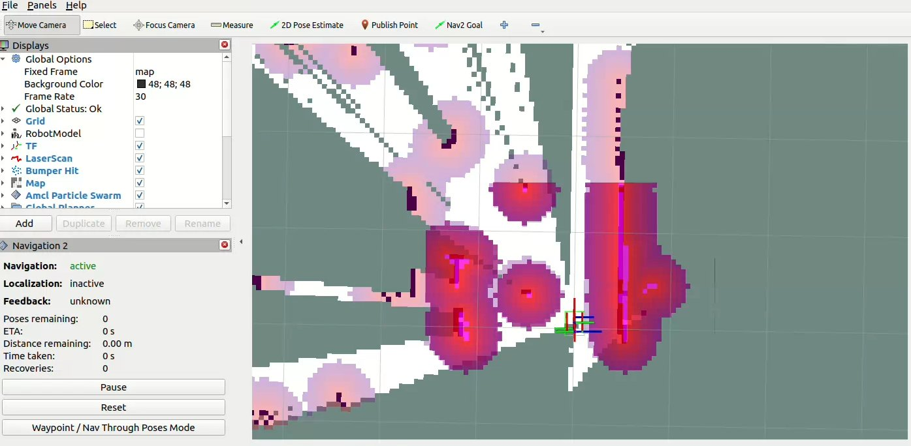

# 5.4.5 Navigation2

## 简介
navigation2项目是适配于ROS2的机器人导航框架，力求以安全的方式让移动机器人从A点移动到B点，集成了机器人导航所需的位姿定位、行为决策、路径规划、避障控制等多个模块。

Github 地址：https://github.com/ros-navigation/navigation2

本示例演示在仿真环境与实车运行两种场景下实现navigation2导航。

## 仿真导航

本小节基于仿真机器人小车模型，使用navigation2进行建图，并通过Gazebo与rviz观察机器人小车导航效果。

其中navigation2导航算法运行在SpaceMiT RISC-V系列板子上，仿真机器人小车模型、Gazebo仿真环境、rviz可视化运行在与板子同一网段的PC上。

### 准备工作
（1）SpaceMiT板子烧录 bianbu desktop 24.04 系统镜像，安装 Bianbu Robot SDK 。

（2）PC端安装ros-humble、Bianbu Robot SDK。

### 使用介绍

#### **启动仿真环境**

在PC端打开终端，输入以下命令安装机器人小车模型与Gazebo仿真环境。

```shell
sudo apt install ros-humble-gazebo*
sudo apt install ros-humble-turtlebot3
sudo apt install ros-humble-turtlebot3-gazebo
sudo apt install ros-humble-turtlebot3-bringup
sudo apt install ros-humble-turtlebot3-simulations
```

安装完毕后，输入以下命令加载机器人模型，并启动Gazebo仿真环境。

```shell
source /opt/ros/humble/setup.bash
source /usr/share/gazebo/setup.sh
export TURTLEBOT3_MODEL=burger
ros2 launch turtlebot3_gazebo turtlebot3_world.launch.py
```

成功启动后，仿真环境如下图所示：


#### **启动navigation2导航**

接下来在SpaceMit板子上启动navigation2，实现机器人自主导航。

输入以下命令在SpaceMit板子上安装navigation2

```shell
sudo apt install ros-humble-navigation2
sudo apt install ros-humble-nav2-bringup
```

安装完毕后，在终端输入以下命令启动navigation2

```shell
source /opt/bros/humble/setup.bash
ros2 launch nav2_bringup bringup_launch.py use_sim_time:=True map:=/opt/ros/humble/share/nav2_bringup/maps/turtlebot3_world.yaml
```

#### **PC端可视化**

PC端打开一个新终端，输入以下命令启动rviz可视化运行。

```shell
source /opt/ros/humble/setup.bash
source ~/ros2_demo_ws/install/setup.bash
ros2 launch br_visualization display_navigation.launch.py
rviz2
```


此时我们只能看到一个空旷的环境地图，是因为还没有设置机器人的初始位置。在rviz2中点击```2D Pose Estimate```设置机器人的初始位置和方向：


设置完毕后，可以观察到rviz加载出了机器人相关坐标系与代价地图信息：


通过rviz设置导航目的地，点击```2D Nav Goal```设置目标点：


可以观察到机器人小车导航运行状态如下：


## 实车导航

本小节建立在使用[SLAM](5.4.4_SLAM_Mapping.md)构建并保存好环境地图后，在搭载了SpaceMiT RISC-V的实际机器人小车上启动并实现navigation2自主导航，并通过PC端可视化。

### 准备工作
（1）SpaceMiT板子烧录 bianbu desktop 24.04 系统镜像，安装 Bianbu Robot SDK 。

（2）PC端安装ros-humble、Bianbu Robot SDK。

（3）按照[SLAM](5.4.4_SLAM_Mapping.md)构建并保存好环境地图文件

### 使用介绍

#### **安装navigation2**

```shell
sudo apt install ros-humble-navigation2
sudo apt install ros-humble-nav2-bringup
```

#### **启动navigation2导航**

按照以下命令，即可一键启动实车机器人模型参数配置文件与navigation2导航算法。

```shell
source /opt/bros/humble/setup.bash
ros2 launch br_navigation nav2.launch.py
```

#### **PC端可视化**

PC端打开一个新终端，输入以下命令启动rviz可视化运行。

```shell
ros2 launch br_visualization display_navigation.launch.py
```


启动文件已配置机器人初始位置为SLAM建图原点，也可以再次点击```2D Pose Estimate```调整机器人位姿



点击```2D Nav Goal```设置导航目标点，可在PC端rviz2中监控导航状态


## 同时slam+navigation2

如果没有事先建立地图，也可以运行以下命令，即可实现在未知地图环境中同时运行slam+navigation2，在导航过程中自动更新地图。

```shell
ros2 launch br_navigation nav2_for_slam.launch.py
```



点击```2D Nav Goal```，即可在未知环境中进行navigation2导航与SLAM建图。


