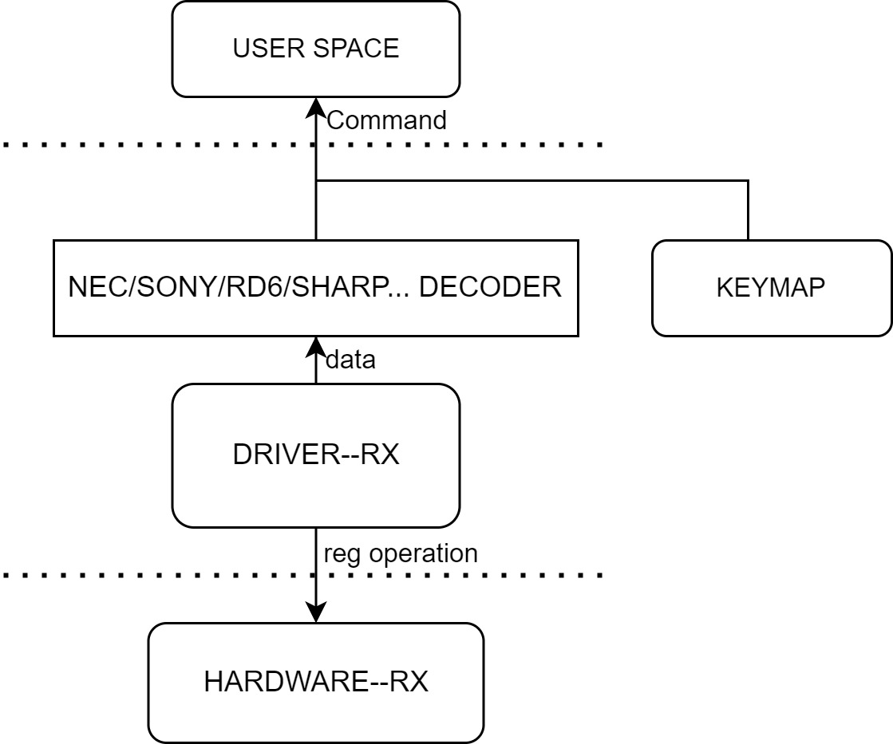

# IR-RX

Introduction to IR configuration and debugging methods

## Module Introduction  

The main function of the infrared receiving module is to receive infrared signals.  

### Function Introduction  


On the k1 platform, an external infrared receiver (demodulator) receives the demodulated electrical signal, which is decoded and reported as an event by the driver and the kernel IR framework.

### Source Code Structure Introduction

The IR-RX controller driver code is under the drivers/media/rc directory:  

```  
drivers/media/rc  
|--rc-ir-raw.c            # Kernel ir framework interface code
|--ir-nec-decoder.c       # Kernel ir signal decoding code
|--ir-spacemit.c          # k1 ir driver  
```  

## Key Features  

| Feature |
| :-----|
| Configurable noise threshold |
| 32Bytes RX FIFO size |

## Configuration Introduction

Mainly includes driver enable configuration and dts configuration

### CONFIG Configuration

CONFIG_IR_SPACEMIT=y

```
Symbol: IR_SPACEMIT [=y]
Device Drivers
    -> Remote Controller support (RC_CORE [=y])
  -> Remote Controller devices (RC_DEVICES [=y])
   -> SPACEMIT IR remote Recriver control (IR_SPACEMIT [=y])
```

### dts配置

#### pinctrl

可查看linux仓库的arch/riscv/boot/dts/spacemit/k1-x_pinctrl.dtsi，参考已配置好的pwm节点配置，如下：

```dts
 pinctrl_ir_rx_1: ir_rx_1_grp {
  pinctrl-single,pins = <
   K1X_PADCONF(GPIO_79, MUX_MODE1, (EDGE_NONE | PULL_UP | PAD_3V_DS4))     /* ir_rx */
  >;
 };
```

#### dtsi配置示例

dtsi中配置IR控制器基地址和时钟复位资源，正常情况无需改动

```dts
 ircrx: irc-rx@d4017f00 {
  compatible = "spacemit,k1x-irc";
  reg = <0x0 0xd4017f00 0x0 0x100>;
  interrupts = <69>;
  interrupt-parent = <&intc>;
  clocks = <&ccu CLK_IR>;
  resets = <&reset RESET_IR>;
  clock-frequency = <102400000>;
  status = "disabled";
 };
```

#### dts配置示例

dts完整配置，如下所示

```dts
 &ircrx {
  pinctrl-names = "default";
  pinctrl-0 = <&pinctrl_ir_rx_1>;
  status = "okay";
 };
```

## 接口描述

### API介绍

常用：

```
int ir_raw_event_store_with_filter(struct rc_dev *dev, struct ir_raw_event *ev)
驱动中调用ir框架实现的接口在中断回调函数中完成信号的存储解码和事件上报。
```

## 测试介绍

可基于k1平台外接红外解调器，连接到上述ir配置的pin上，通过遥控器向解调器发送信号，并在应用层接收码值。

## FAQ
