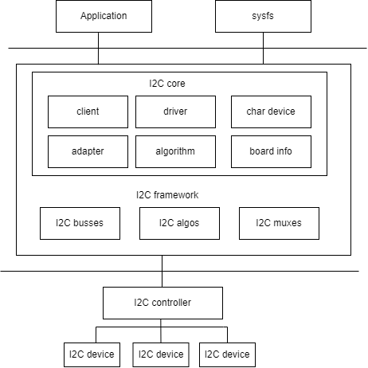

# I2C

Introduction to the functions and usage of I2C.

## Module Introduction

The I2C bus is a two-wire serial bus used to connect microcontrollers and their peripherals. It is mostly used for master-slave communication between the main controller and slave devices, suitable for scenarios with small data volumes and short transmission distances. Each device has its own unique address, and I2C is half-duplex, meaning only one master can communicate at any given time.

### Function Introduction

  
The I2C architecture in Linux is shown above and is divided into three layers:  

1. User space, including all applications that use I2C devices;  
2. Kernel, i.e., the driver part;  
3. Hardware, referring to the actual physical devices, including the I2C controller and I2C peripherals.  

In the Linux kernel, the I2C driver mainly implements:

- The I2C framework provides a way to "access I2C slave devices". Since these slave devices are controlled by the I2C controller, this is mainly achieved by the I2C controller driver.
- Inside the I2C framework, there are four modules: I2C core, I2C busses, I2C algos, and I2C muxes.
- I2C core uses two submodules, I2C adapter and I2C algorithm, to abstract the functions of the I2C controller.
- I2C busses is a collection of all I2C controller drivers, located in the drivers/i2c/busses/ directory, such as i2c-k1.c.
- I2C algos contains some common I2C algorithms. An algorithm refers to the communication method of the I2C protocol, used to implement I2C read/write instructions.

### Source Code Structure Introduction

The controller driver code is under the drivers/i2c/ directory:

```
drivers/i2c/
|-- i2c-core-of.c       # Core file of the I2C subsystem, provides related interface functions
|-- i2c-boardinfo.c          
|-- i2c-core-base.c
|-- i2c-core-slave.c
|-- i2c-core-smbus.c
|-- i2c-dev.c           # Device-related file of the I2C subsystem, used to register related device files
|-- busses/i2c-k1x.c    # I2C controller driver code for the k1 platform 
```

## Key Features

### Features

| Feature | Description |
| :-----| :----|
| Supports 9 groups of I2C  | Supports 9 groups of I2C interfaces |
| Supports DMA | Supports DMA data transmission in host mode |
| Supports three speed modes: 100k / 400k/ 1.5M | Supports three speed modes, configurable via dts |
| Supports bus arbitration | Supports bus arbitration in multi-master mode |

## Configuration

Mainly includes driver enable configuration and dts configuration

### CONFIG Configuration

CONFIG_I2C and CONFIG_I2C_SPACEMIT_K1X are set to Y by default
```
Device Drivers
        I2C support               
                I2C support (I2C [=y]) 
                        I2C Hardware Bus support
                               Spacemit k1x I2C adapter (I2C_SPACEMIT_K1X [=y]) 
```

CONFIG_I2C_SLAVE is for the I2C slave device mode, for example, support for

```
Device Drivers
        I2C support               
                I2C support (I2C [=y]) 
                        I2C slave support (I2C_SLAVE [=y])
```

CONFIG_I2C_CHARDEV is for the I2C character device

```
Device Drivers
        I2C support               
                I2C support (I2C [=y]) 
                        I2C device interface (I2C_CHARDEV [=y])
```

### dts Configuration

The i2c bus configuration is as follows:

| Configuration                   | Description         |
| ---------------------- | ------------ |
| spacemit,i2c-fast-mode | 400K speed mode |
| spacemit,i2c-high-mode | 1.5M speed mode |
| spacemit,dma-disable   | Disable DMA transmission  |

The default bus speed is 100K. To switch speed modes, add the corresponding configuration in the dts;

For example, to switch to fast mode, configure as follows:

```c
i2c6: i2c@d4018800 {
        spacemit,i2c-fast-mode;
};
```

The "spacemit,dma-disable" configuration means not to use DMA transmission. To enable DMA transmission, simply remove this configuration in the dts;

Taking i2c6 as an example, to disable DMA transmission, the configuration in k1-x.dtsi is as follows：

```c
i2c6: i2c@d4018800 {
        spacemit,dma-disable;
};
```

#### pinctrl

Check the development board schematic to find the pin group used by the i2c controller.

Taking i2c6 as an example, if the schematic uses gpio56/57 as SCL/SDA, and the configuration can use the pinctrl\_i2c6\_2 group already defined in k1-x\_pinctrl.dtsi, the dts configuration is as follows.

```c
&i2c6 {
        pinctrl-names = "default";
        pinctrl-0 = <&pinctrl_i2c6_2>;
};
```

#### i2c Device Configuration

Take the touchscreen device as an example to analyze how to configure the i2c device in dts.

##### Device Type

Confirm the device type and the driver in use.

Set the compatible configuration of the touchscreen device to "goodix,gt9xx".

##### Device Address

Confirm the i2c communication address of the device - 7 bit.

Refer to the schematic to find the touchscreen device address is 0x5d, configure as follows.

```sql
gt9xx@5d {
        compatible = "goodix,gt9xx";
        reg = <0x5d>;
}
```

##### Communication Frequency

Confirm the device communication frequency.

The touchscreen communication frequency supports 100K. Choose to mount it on the i2c bus6, remove the "spacemit,i2c-fast-mode" and "spacemit,i2c-high-mode" configurations, and use the default rate of 100K.

##### Device Control Signals

Query the control signals used by the device in the schematic.

The reset / irq signals of the touchscreen are gpio 114/58, respectively. The irq-flags configuration is set as required for the interrupt trigger mode, for example: 2 for falling edge trigger, configured as follows.

```sql
gt9xx@5d {
        reset-gpios = <&gpio 114 GPIO_ACTIVE_HIGH>;
        irq-gpios = <&gpio 58 GPIO_ACTIVE_HIGH>;
        irq-flags = <2>;
};
```

##### Device dts

The touchscreen device address is 0x5d, gpio 114/58 are reset/irq signals, falling edge trigger interrupt, communication frequency is 100K, configure the corresponding parameters for the touchscreen.

The device dts configuration is as follows:

```c
gt9xx@5d {
                compatible = "goodix,gt9xx";
                reg = <0x5d>;
                reset-gpios = <&gpio 114 GPIO_ACTIVE_HIGH>;
                irq-gpios = <&gpio 58 GPIO_ACTIVE_HIGH>;
                irq-flags = <2>;
                touchscreen-max-id = <11>;
                touchscreen-size-x = <1200>;
                touchscreen-size-y = <1920>;
                touchscreen-max-w = <512>;
                touchscreen-max-p = <512>;
 };
```

#### dts Example

Based on the above information, i2c6 is connected to the i2c touchscreen device, the dts configuration is as follows.

```c
&i2c6 {
        pinctrl-names = "default";
        pinctrl-0 = <&pinctrl_i2c6_2>;
        status = "okay";

        gt9xx@5d {
                compatible = "goodix,gt9xx";
                reg = <0x5d>;
                reset-gpios = <&gpio 114 GPIO_ACTIVE_HIGH>;
                irq-gpios = <&gpio 58 GPIO_ACTIVE_HIGH>;
                irq-flags = <2>;
                touchscreen-max-id = <11>;
                touchscreen-size-x = <1200>;
                touchscreen-size-y = <1920>;
                touchscreen-max-w = <512>;
                touchscreen-max-p = <512>;
      };
};
```

## Interface Introduction

### API Introduction

Kernel space: The read and write communication of I2C uses the standard Linux interface. Please refer to the Documentation/i2c/writing-clients.rst document under the kernel directory for detailed information on sending and receiving.  
User space: Access all devices on the bus through the "/dev/i2c-%d" node. The demo example is a simple read and write access to the i2c device. For details, refer to the Documentation/i2c/dev-interface.rst document.

### Demo Example

```
#include <stdio.h>
#include <stdlib.h>
#include <stdint.h>
#include <unistd.h>
#include <sys/ioctl.h>
#include <fcntl.h>
#include <linux/i2c-dev.h>

#define I2C_DEV_FILE "/dev/i2c-1"  // I2C device file path, usually /dev/i2c-1
#define DEVICE_ADDR 0x68          // I2C device address, example 0x68<modify according to actual device>

// Write data to I2C device
int write_to_i2c(int file, uint8_t reg, uint8_t value) {
    uint8_t buffer[2];
    buffer[0] = reg;     // Register address
    buffer[1] = value;   // Value to be written

    if (write(file, buffer, 2) != 2) {
        perror("I2C write failed");
        return -1;
    }
    return 0;
}

// Read data from I2C device
int read_from_i2c(int file, uint8_t reg, uint8_t *data, size_t len) {
    if (write(file, &reg, 1) != 1) {
        perror("I2C write register failed");
        return -1;
    }

    if (read(file, data, len) != len) {
        perror("I2C read failed");
        return -1;
    }
    return 0;
}

int main() {
    int file;
    uint8_t data[2];  // Used to store the read data

    // Open I2C device file
    if ((file = open(I2C_DEV_FILE, O_RDWR)) < 0) {
        perror("Failed to open I2C bus");
        exit(1);
    }

    // Set the address of the I2C slave device
    if (ioctl(file, I2C_SLAVE, DEVICE_ADDR) < 0) {
        perror("Failed to acquire bus access and/or talk to slave");
        close(file);
        exit(1);
    }

    if (write_to_i2c(file, 0x6B, 0x00) < 0) {
        close(file);
        exit(1);
    }
    printf("Write 0x00 to register 0x6B\n");

    if (read_from_i2c(file, 0x75, data, 1) < 0) {
        close(file);
        exit(1);
    }
    printf("Read data 0x%02x from register 0x75\n", data[0]);

    // Close I2C device file
    close(file);

    return 0;
}
```

## Debug Introduction

### sysfs

### debugfs

## Testing Introduction

The I2C tool is an open-source tool that can be downloaded for cross-compilation. [Code download address](https://mirrors.edge.kernel.org/pub/software/utils/i2c-tools/)
After compilation, tools like i2cdetect, i2cdump, i2cset, i2cget will be generated, which can be used directly via command line:

- i2cdetect: Used to list i2c bus and all devices on it
- i2cdump: Displays the value of all registers on the i2c device
- i2cset: Reads the value of a specific register on the i2c device
- i2cget: Writes a value to a specific register on the i2c device

## FAQ
### 1. i2c Transmission Timeout Issue  
Abnormal log as follows：
```c
[  126.800897] i2c-spacemit-k1x d401d800.i2c: msg completion timeout
[  126.816937] i2c-spacemit-k1x d401d800.i2c: bus reset, send clk: 0
[  126.830458] i2c-spacemit-k1x d401d800.i2c: i2c transfer retry 1, ret -110 mode 0 err 0x0
...
```
Troubleshooting steps: 
1. Check the i2c hardware resistors. If there is a slave on the sda line, a bypass capacitor is needed. It is recommended to replace the pull-up resistor on the sda with a 1k resistor；
2. Check the i2c pinctrl drive capability. Increase the pinctrl drive capability of the corresponding i2c port to PAD_1V8_DS2；
```c
	pinctrl_i2c1: i2c1_grp {
		pinctrl-single,pins =<
			K1X_PADCONF(GPIO_56, MUX_MODE1, (EDGE_NONE | PULL_UP | PAD_1V8_DS2))	/* i2c1_scl */
			K1X_PADCONF(GPIO_57, MUX_MODE1, (EDGE_NONE | PULL_UP | PAD_1V8_DS2))	/* i2c1_sda */
		>;
	};
```