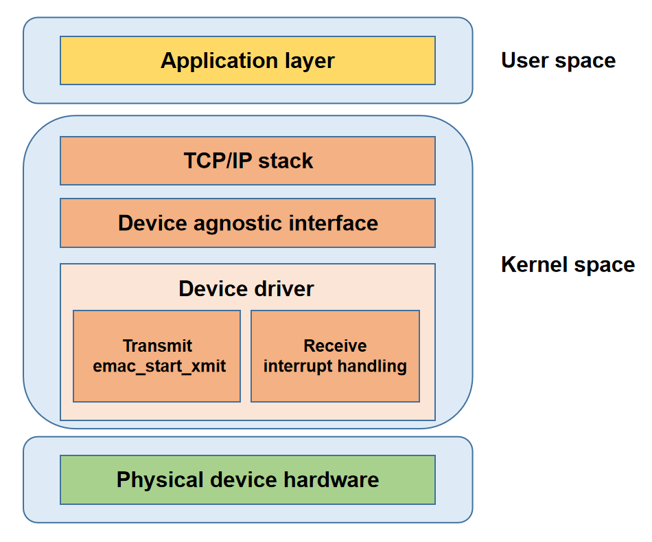

# GMAC

Introduction to the functions and usage of GMAC.

## Module Introduction

The GMAC (Gigabit Media Access Controller) module is a controller used to support gigabit Ethernet communication, responsible for sending and receiving data frames and managing network traffic.

### Function Introduction

   
Application Layer: Provides application services for users.  
Protocol Stack Layer: Implements network protocols and provides system call interfaces for the application layer.  
Network Device Abstraction Layer: Shields driver implementation details and provides a unified interface for the protocol stack.  
Network Device Driver Layer: Implements data transmission and device management.  
Physical Layer: Network hardware devices.

### Source Code Structure Introduction

The gmac driver code is under drivers\net\ethernet\spacemit:

```
drivers\net\ethernet\spacemit
|-- emac-ptp.c          # Provides PTP protocol support
|-- k1x-emac.c          # k1 gmac driver code
|-- k1x-emac.h          # k1 gmac driver header file
```

## Key Features

### Features

| Feature | Description |
| :-----| :----|
| Supports 10/100/1000M Ethernet | Compatible with multi-rate Ethernet connections |
| Supports DMA | Efficient data transfer reduces CPU load |
| Supports NAPI | Improves interrupt handling efficiency and reduces CPU overhead |
| Interrupt coalescing mechanism | Merges interrupts to improve high-load performance |
| Supports RGMII/RMII | Adapts to multiple application scenarios |
| Supports PTP | Achieves sub-microsecond time synchronization between devices |
| Supports power management | Supports suspend/resume for low power requirements |

### Performance Parameters

|  | Single NIC simplex | Single NIC duplex | Dual NIC simplex | Dual NIC duplex |
| :---: | :---: | :---: | :---: | :---: |
| TX rate (MB/s) | 942 | 930 | 942 | 797 |
| RX rate (MB/s) | 941 | 940 | 941 | 881 |  
Note: Bandwidth fluctuates in duplex scenarios    

### Performance Testing
#### Test Environment
Test hardware: one k1-deb1 board; one PC, model: HP ProBook 450 15.6 inch G10 Notebook PC, system: Ubuntu 22.04.4 LTS    

Network topology: k1-deb1 eth0 port is directly connected to the PC Ethernet port; k1-deb1 eth1 port is directly connected to the PC via a 2.5G USB-to-Ethernet adapter  

IP settings: Set the IPs of the directly connected ports to the same subnet, and start two iperf servers on the PC
```
# Set IP for the PC
ifconfig <ethernet-interface> 192.168.1.100 netmask 255.255.255.0
ifconfig <usb-ethernet-interface> 192.168.2.100 netmask 255.255.255.0

# Set IP for the k1-deb1 net device
ifconfig eth0 192.168.1.200 netmask 255.255.255.0
ifconfig eth1 192.168.2.200 netmask 255.255.255.0

# Start iperf3 server on the PC
iperf3 -s -B 192.168.1.100 -A 10 -D
iperf3 -s -B 192.168.2.100 -A 11 -D
```
#### Performance Optimization
To maximize network throughput, before testing, bind and allocate the k1-deb1 board network port interrupts to CPUs to fully utilize multi-core resources.

Step 1: Use the following command to check the current interrupt allocation and confirm the interrupt numbers for the two NICs:
 ```
cat /proc/interrupts | grep eth*
 85:      11041    2332003          0          0          0          0          0          0  SiFive PLIC 131 Edge      eth0
 86:        234          0     409744          0          0          0          0          0  SiFive PLIC 133 Edge      eth1
 ```
Step 2: Bind the NIC hardware interrupts to different CPU cores, e.g., bind eth0 to CPU1 and eth1 to CPU2
```
echo 02 > /proc/irq/85/smp_affinity
echo 04 > /proc/irq/86/smp_affinity
```
Step 3: Enable RPS (Receive Packet Steering) for software interrupt load balancing on the receive side. For example, the following commands allow CPU4 to process received packets on eth0 and CPU5 to process received packets on eth1, fully utilizing multi-core advantages.
```
echo 10 > /sys/devices/platform/soc/cac80000.ethernet/net/eth0/queues/rx-0/rps_cpus
echo 4096 > /sys/devices/platform/soc/cac80000.ethernet/net/eth0/queues/rx-0/rps_flow_cnt

echo 20 > /sys/devices/platform/soc/cac81000.ethernet/net/eth1/queues/rx-0/rps_cpus
echo 4096 > /sys/devices/platform/soc/cac81000.ethernet/net/eth1/queues/rx-0/rps_flow_cnt
 ```

#### Single NIC Test
Use eth0 for single NIC testing and bind the current iperf3 process to CPU6

##### Simplex/TX

```
iperf3 -c 192.168.1.100 -B 192.168.1.200 -t 100 -A 6
```

##### Simplex/RX

```
iperf3 -c 192.168.1.100 -B 192.168.1.200 -t 100 -A 6 -R
```

##### Duplex

```
iperf3 -c 192.168.1.100 -B 192.168.1.200 -t 100 -A 6 --bidir
```

#### Dual NIC Test
In dual NIC testing, bind the two iperf3 processes to CPU6 and CPU7 respectively
##### Simplex/TX

```
# Bind CPU6 for the first test, bind CPU7 for the second test
iperf3 -c 192.168.2.100 -B 192.168.2.200 -t 100 -A 6 > 1.txt &
iperf3 -c 192.168.1.100 -B 192.168.1.200 -t 100 -A 7 > 2.txt &

# View the test results
cat 1.txt
cat 2.txt
```

##### Simplex/RX

```
iperf3 -c 192.168.2.100 -B 192.168.2.200 -t 100 -A 6 -R > 1.txt &
iperf3 -c 192.168.1.100 -B 192.168.1.200 -t 100 -A 7 -R > 2.txt &

cat 1.txt
cat 2.txt
```

##### Duplex

```
iperf3 -c 192.168.2.100 -B 192.168.2.200 -t 100 -A 6 --bidir > 1.txt &
iperf3 -c 192.168.1.100 -B 192.168.1.200 -t 100 -A 7 --bidir > 2.txt &

cat 1.txt
cat 2.txt
```

## Configuration Introduction

Mainly includes driver enable configuration and dts configuration

### CONFIG Configuration

NET_VENDOR_SPACEMIT: If you are using a Spacemit type Ethernet chip, set this option to Y

```
config NET_VENDOR_SPACEMIT
        bool "Spacemit devices"
        default y
        depends on SOC_SPACEMIT
        help
          If you have a network (Ethernet) chipset belonging to this class,
          say Y.

          Note that the answer to this question does not directly affect
          the kernel: saying N will just cause the configurator to skip all
          the questions regarding Spacemit chipsets. If you say Y, you will
          be asked for your specific chipset/driver in the following questions.
     
```

K1X_EMAC: Enable Spacemit GMAC driver

```
config K1X_EMAC
        bool "k1-x Emac Driver"
        depends on SOC_SPACEMIT_K1X
        select PHYLIB
        help
          This Driver support Spacemit k1-x Ethernet MAC
          Say Y to enable support for the Spacemit Ethernet.

```

### dts Configuration

gmac dts configuration requires determining the pin group used by the Ethernet, phy reset gpio, phy model, and address. tx phase and rx phase generally use default values.

#### pinctrl

Check the development board schematic to find the pin group used by gmac.

Assuming eth0 uses GPIO00~GPIO14, GPIO45 pin group, and the configuration can use pinctrl_gmac0 group configuration in k1-x_pinctrl.dtsi.

The eth0 configuration in the scheme dts uses gmac0 pinctrl as follows

```c
&eth0 {
    pinctrl-names = "default";
    pinctrl-0 = <&pinctrl_gmac0>;
};
```

#### gpio

Check the development board schematic to find the Ethernet phy reset signal gpio, assuming eth0 phy reset gpio is gpio 110.

The eth0 configuration in the scheme dts uses gpio 110 as follows.

```c
&eth0 {
    emac,reset-gpio = <&gpio 110 0>;
}
```

#### phy Configuration

##### phy Identification

Check the development board schematic to confirm the model and phy id of the Ethernet phy.

For example, the Ethernet phy RTL8821F-CG has a phy id of 001c.c916.

Phy id information can be found in the phy spec or obtained from the phy manufacturer.

##### phy Address

Check the development board schematic to confirm the address of the Ethernet phy, assuming it is 1.

##### phy Configuration

Configure the phy based on the phy identification id and phy address obtained.

The eth0 configuration in the scheme dts is as follows

```c
&eth0 {
    ...
    mdio-bus {
                #address-cells = <0x1>;
                #size-cells = <0x0>;
                rgmii0: phy@0 {
                        compatible = "ethernet-phy-id001c.c916";
                        device_type = "ethernet-phy";
                        reg = <0x1>;
                        phy-mode = "rgmii";
                };
    };
};
```

#### tx phase and rx phase

Tx-phase default value is 90, rx-phase is 73.

The tx-phase and rx-phase may need to be adjusted for different boards. If the eth0 port can be up but cannot obtain an IP address, it is necessary to contact the relevant personnel to adjust the tx-phase and rx-phase.

```c
&eth0 {
    tx-phase = <90>;
    rx-phase = <73>;
};
```

#### dts Configuration

Comprehensive development board Ethernet hardware information, configured as follows.

```c
&eth0 {
        pinctrl-names = "default";
        pinctrl-0 = <&pinctrl_gmac0>;

        emac,reset-gpio = <&gpio 110 0>;
        emac,reset-active-low;
        emac,reset-delays-us = <0 10000 100000>;

        /* store forward mode */
        tx-threshold = <1518>;
        rx-threshold = <12>;
        tx-ring-num = <128>;
        rx-ring-num = <128>;
        dma-burst-len = <5>;

        ref-clock-from-phy;

        clk-tuning-enable;
        clk-tuning-by-delayline;
        tx-phase = <90>;
        rx-phase = <73>;

        phy-handle = <&rgmii0>;

        status = "okay";

        mdio-bus {
                #address-cells = <0x1>;
                #size-cells = <0x0>;
                rgmii0: phy@0 {
                        compatible = "ethernet-phy-id001c.c916";
                        device_type = "ethernet-phy";
                        reg = <0x1>;
                        phy-mode = "rgmii";
                };
        };
};
```

## Interface Introduction

### API Introduction

#### emac_ioctl

`emac_ioctl` is used to access `PHY` (Physical Layer) device registers and configure hardware timestamp functions, with the following command meanings:  
`SIOCGMIIPHY`: Get `PHY` device address.  
`SIOCGMIIREG`: Read specified `PHY` register.  
`SIOCSMIIREG`: Write to specified `PHY` register.  
`SIOCSHWTSTAMP`: Configure the device's hardware timestamp.  

```c
static int emac_ioctl(struct net_device *ndev, struct ifreq *rq, int cmd)
{
 int ret = -EOPNOTSUPP;

 if (!netif_running(ndev))
  return -EINVAL;

 switch (cmd) {
 case SIOCGMIIPHY:
 case SIOCGMIIREG:
 case SIOCSMIIREG:
  if (!ndev->phydev)
   return -EINVAL;
  ret = phy_mii_ioctl(ndev->phydev, rq, cmd);
  break;
 case SIOCSHWTSTAMP:
  ret = emac_hwtstamp_ioctl(ndev, rq);
  break;
 default:
  break;
 }

 return ret;
}
```

#### emac_get_link_ksettings

`emac_get_link_ksettings` function is used to obtain link information such as speed, duplex mode, and auto-negotiation status of the network device. This function is called when the user uses the `ethtool <INTERFACE>` command:

```
# ethtool eth0
Settings for eth0:
        Supported ports: [ TP MII ]
        Supported link modes:   10baseT/Half 10baseT/Full
                                100baseT/Half 100baseT/Full
                                1000baseT/Full
        Supported pause frame use: Symmetric Receive-only
        Supports auto-negotiation: Yes
        Supported FEC modes: Not reported
        Advertised link modes:  10baseT/Half 10baseT/Full
                                100baseT/Half 100baseT/Full
                                1000baseT/Full
        Advertised pause frame use: No
        Advertised auto-negotiation: Yes
        Advertised FEC modes: Not reported
        Speed: Unknown!
        Duplex: Unknown! (255)
        Port: Twisted Pair
        PHYAD: 1
        Transceiver: external
        Auto-negotiation: on
        MDI-X: Unknown
        Link detected: no
```

`emac_get_link_ksettings` function implementation is as follows:

```c
static int emac_get_link_ksettings(struct net_device *ndev,
     struct ethtool_link_ksettings *cmd)
{
 if (!ndev->phydev)
                return -ENODEV;
        /* Call phy driver interface to get physical layer link information */
 phy_ethtool_ksettings_get(ndev->phydev, cmd); 
 return 0;
}
```

#### emac_set_link_ksettings

`emac_set_link_ksettings` function is used to set the link configuration of the network device, such as speed, duplex mode, and auto-negotiation status. This interface is called when the user executes the following command:

```
#Set link speed to 1000M, full duplex, enable auto-negotiation
ethtool -s eth0 speed 1000 duplex full autoneg on
```

`emac_set_link_ksettings` implementation is as follows:

```c
static int emac_set_link_ksettings(struct net_device *ndev,
     const struct ethtool_link_ksettings *cmd)
{
 if (!ndev->phydev)
                return -ENODEV;
        /* Call phy driver interface to set physical layer link configuration */
 return phy_ethtool_ksettings_set(ndev->phydev, cmd);
}
```

#### emac_get_ethtool_stats

`emac_get_ethtool_stats` is used to obtain GMAC statistics, with all statistical items as follows:

```c
struct emac_hw_stats {
    u32 tx_ok_pkts;                // 成功发送的有效数据包数量
    u32 tx_total_pkts;             // 总共尝试发送的数据包数量，包括成功和失败的包
    u32 tx_ok_bytes;               // 成功发送的总字节数
    u32 tx_err_pkts;               // 发送时发生错误的数据包数量
    u32 tx_singleclsn_pkts;        // 发生单次冲突后成功发送的数据包数量
    u32 tx_multiclsn_pkts;         // 发生多次冲突后成功发送的数据包数量
    u32 tx_lateclsn_pkts;          // 发生晚期冲突（发送过程中检测到）后丢弃的数据包数量
    u32 tx_excessclsn_pkts;        // 由于过多冲突导致发送失败的数据包数量
    u32 tx_unicast_pkts;           // 成功发送的单播数据包数量
    u32 tx_multicast_pkts;         // 成功发送的多播数据包数量
    u32 tx_broadcast_pkts;         // 成功发送的广播数据包数量
    u32 tx_pause_pkts;             // 发送的控制数据包数量（如流量控制的暂停帧）
    u32 rx_ok_pkts;                // 成功接收的有效数据包数量
    u32 rx_total_pkts;             // 总共接收到的数据包数量，包括成功和失败的包
    u32 rx_crc_err_pkts;           // 接收时检测到CRC错误的数据包数量
    u32 rx_align_err_pkts;         // 接收时检测到对齐错误的数据包数量
    u32 rx_err_total_pkts;         // 总共发生错误的接收数据包数量
    u32 rx_ok_bytes;               // 成功接收的总字节数
    u32 rx_total_bytes;            // 总共接收到的字节数，包括成功和失败的数据包
    u32 rx_unicast_pkts;           // 成功接收的单播数据包数量
    u32 rx_multicast_pkts;         // 成功接收的多播数据包数量
    u32 rx_broadcast_pkts;         // 成功接收的广播数据包数量
    u32 rx_pause_pkts;             // 接收到的控制数据包数量（如流量控制的暂停帧）
    u32 rx_len_err_pkts;           // 由于长度错误导致接收失败的数据包数量
    u32 rx_len_undersize_pkts;     // 接收到的过短的数据包数量（小于最小以太网帧长度）
    u32 rx_len_oversize_pkts;      // 接收到的过长的数据包数量（超过最大以太网帧长度）
    u32 rx_len_fragment_pkts;      // 接收到的片段化的数据包数量（数据包不完整）
    u32 rx_len_jabber_pkts;        // 接收到的杂波数据包数量（超长且包含错误）
    u32 rx_64_pkts;                // 接收到的长度为64字节的数据包数量
    u32 rx_65_127_pkts;            // 接收到的长度在65至127字节之间的数据包数量
    u32 rx_128_255_pkts;           // 接收到的长度在128至255字节之间的数据包数量
    u32 rx_256_511_pkts;           // 接收到的长度在256至511字节之间的数据包数量
    u32 rx_512_1023_pkts;          // 接收到的长度在512至1023字节之间的数据包数量
    u32 rx_1024_1518_pkts;         // 接收到的长度在1024至1518字节之间的数据包数量
    u32 rx_1519_plus_pkts;         // 接收到的长度大于1518字节的数据包数量
    u32 rx_drp_fifo_full_pkts;     // 由于接收FIFO已满而丢弃的数据包数量
    u32 rx_truncate_fifo_full_pkts;// 由于接收FIFO已满而被截断的数据包数量
    //必须放在最后
    spinlock_t stats_lock;         // 用于保护上述统计数据访问的自旋锁，防止数据竞争
};
```

When the user uses the following command, this function will be called:

```
# ethtool -S eth0
NIC statistics:
     tx_ok_pkts: 219
     tx_total_pkts: 219
     tx_ok_bytes: 20102
     tx_err_pkts: 0
     tx_singleclsn_pkts: 0
     tx_multiclsn_pkts: 0
     tx_lateclsn_pkts: 0
     tx_excessclsn_pkts: 0
     tx_unicast_pkts: 4
     tx_multicast_pkts: 187
     tx_broadcast_pkts: 28
     tx_pause_pkts: 0
     rx_ok_pkts: 209
     rx_total_pkts: 209
     rx_crc_err_pkts: 0
     rx_align_err_pkts: 0
     rx_err_total_pkts: 0
     rx_ok_bytes: 18368
     rx_total_bytes: 18368
     rx_unicast_pkts: 3
     rx_multicast_pkts: 175
     rx_broadcast_pkts: 31
     rx_pause_pkts: 0
     rx_len_err_pkts: 0
     rx_len_undersize_pkts: 0
     rx_len_oversize_pkts: 0
     rx_len_fragment_pkts: 0
     rx_len_jabber_pkts: 0
     rx_64_pkts: 17
     rx_65_127_pkts: 177
     rx_128_255_pkts: 0
     rx_256_511_pkts: 15
     rx_512_1023_pkts: 0
     rx_1024_1518_pkts: 0
     rx_1519_plus_pkts: 0
     rx_drp_fifo_full_pkts: 0
     rx_truncate_fifo_full_pkts: 0
```

The function implementation is as follows:

```c
static void emac_get_ethtool_stats(struct net_device *dev,
                                   struct ethtool_stats *stats, u64 *data)
{
        struct emac_priv *priv = netdev_priv(dev);
        struct emac_hw_stats *hwstats = priv->hw_stats;
        u32 *data_src;
        u64 *data_dst;
        int i;

        /* 确保网络设备存在且正在运行 */
        if (netif_running(dev) && netif_device_present(dev)) {
                if (spin_trylock_bh(&hwstats->stats_lock)) {
                        emac_stats_update(priv);  // 更新统计信息
                        spin_unlock_bh(&hwstats->stats_lock);
                }
        }

        data_dst = data; 

        /* 遍历 ethtool 统计项数组，将硬件统计数据复制到目标数据数组中 */
        for (i = 0; i < ARRAY_SIZE(emac_ethtool_stats); i++) {
                data_src = (u32 *)hwstats + emac_ethtool_stats[i].offset;
                *data_dst++ = (u64)(*data_src);
        }
}
```

#### emac_get_ts_info

`emac_get_ts_info` 函数用于提供网络设备的时间戳信息，当用户使用如下命令时该函数被调用：

```
# ethtool --show-time-stamping eth0
Time stamping parameters for eth0:
Capabilities:
        hardware-transmit     (SOF_TIMESTAMPING_TX_HARDWARE)
        software-transmit     (SOF_TIMESTAMPING_TX_SOFTWARE)
        hardware-receive      (SOF_TIMESTAMPING_RX_HARDWARE)
        software-receive      (SOF_TIMESTAMPING_RX_SOFTWARE)
        software-system-clock (SOF_TIMESTAMPING_SOFTWARE)
        hardware-raw-clock    (SOF_TIMESTAMPING_RAW_HARDWARE)
PTP Hardware Clock: 0
Hardware Transmit Timestamp Modes:
        off                   (HWTSTAMP_TX_OFF)
        on                    (HWTSTAMP_TX_ON)
Hardware Receive Filter Modes:
        none                  (HWTSTAMP_FILTER_NONE)
        all                   (HWTSTAMP_FILTER_ALL)
        ptpv1-l4-event        (HWTSTAMP_FILTER_PTP_V1_L4_EVENT)
        ptpv1-l4-sync         (HWTSTAMP_FILTER_PTP_V1_L4_SYNC)
        ptpv1-l4-delay-req    (HWTSTAMP_FILTER_PTP_V1_L4_DELAY_REQ)
        ptpv2-l4-event        (HWTSTAMP_FILTER_PTP_V2_L4_EVENT)
        ptpv2-l4-sync         (HWTSTAMP_FILTER_PTP_V2_L4_SYNC)
        ptpv2-l4-delay-req    (HWTSTAMP_FILTER_PTP_V2_L4_DELAY_REQ)
        ptpv2-event           (HWTSTAMP_FILTER_PTP_V2_EVENT)
        ptpv2-sync            (HWTSTAMP_FILTER_PTP_V2_SYNC)
        ptpv2-delay-req       (HWTSTAMP_FILTER_PTP_V2_DELAY_REQ)
```

`emac_get_ts_info` 函数实现如下：

```c
static int emac_get_ts_info(struct net_device *dev,
                              struct ethtool_ts_info *info)
{
        struct emac_priv *priv = netdev_priv(dev); 
        if (priv->ptp_support) {

                /* 设置支持的时间戳选项，包括硬件和软件的时间戳 */
                info->so_timestamping = SOF_TIMESTAMPING_TX_SOFTWARE |
                                        SOF_TIMESTAMPING_TX_HARDWARE |
                                        SOF_TIMESTAMPING_RX_SOFTWARE |
                                        SOF_TIMESTAMPING_RX_HARDWARE |
                                        SOF_TIMESTAMPING_SOFTWARE |
                                        SOF_TIMESTAMPING_RAW_HARDWARE;

                if (priv->ptp_clock)
                        info->phc_index = ptp_clock_index(priv->ptp_clock);

                /* 设置支持的传输时间戳类型 */
                info->tx_types = (1 << HWTSTAMP_TX_OFF) | (1 << HWTSTAMP_TX_ON);

                /* 设置支持的时间戳过滤器 */
                info->rx_filters = ((1 << HWTSTAMP_FILTER_NONE) |
                                    (1 << HWTSTAMP_FILTER_PTP_V1_L4_EVENT) |
                                    (1 << HWTSTAMP_FILTER_PTP_V1_L4_SYNC) |
                                    (1 << HWTSTAMP_FILTER_PTP_V1_L4_DELAY_REQ) |
                                    (1 << HWTSTAMP_FILTER_PTP_V2_L4_EVENT) |
                                    (1 << HWTSTAMP_FILTER_PTP_V2_L4_SYNC) |
                                    (1 << HWTSTAMP_FILTER_PTP_V2_L4_DELAY_REQ) |
                                    (1 << HWTSTAMP_FILTER_PTP_V2_EVENT) |
                                    (1 << HWTSTAMP_FILTER_PTP_V2_SYNC) |
                                    (1 << HWTSTAMP_FILTER_PTP_V2_DELAY_REQ) |
                                    (1 << HWTSTAMP_FILTER_ALL));
                return 0;
        } else
                /* 如果不支持PTP，则调用ethtool的默认处理函数 */
                return ethtool_op_get_ts_info(dev, info);
}

```

## Debug介绍

### debugfs

```
#用于便捷地查询或修改gmac的接口、tx phase、rx phase配置
/sys/kernel/debug/cac80000.ethernet # cat clk_tuning
Emac MII Interface : RGMII
Current rx phase : 73
Current tx phase : 60
```

## 测试介绍

查看网络接口信息

```c
ifconfig -a
```

打开网络设备

```c
ifconfig <INTERFACE> up
```

关闭网络设备

```c
ifconfig <INTERFACE> down
```

测试和另一台主机的连通性，假设其IP地址为192.168.0.1

```c
ping 192.168.0.1 
```

采用DHCP协议分配IP地址

```c
udhcpc
```

## FAQ
