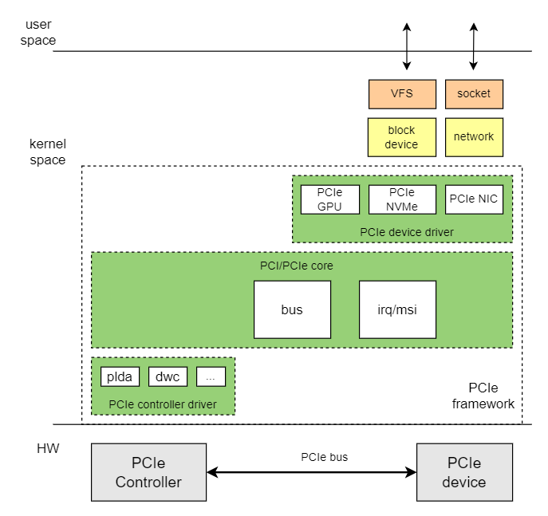

# PCIe

Introduction to the functions and usage of PCIe.

## Module Introduction

PCIe is a high-speed serial computer expansion bus standard. It uses high-speed serial point-to-point dual-channel high-bandwidth transmission, and each connected device has exclusive channel bandwidth. k1 has a total of 3 PCIe controllers, supporting various external PCIe interface devices, including nvme ssd, sata, and wifi, etc.
PCIe0 and USB3 controllers share one phy hardware and cannot be used simultaneously. In most application scenarios, USB3 is used, so PCIe0 is rarely used.

### Function Introduction



The Linux PCIe subsystem framework includes three parts: PCIe core, PCIe controller driver, and PCIe device driver. The main functions of each part are as follows:  
1. PCIe Core

- Enumeration, resource allocation, and interrupts for the PCIe bus
- Adding and removing PCIe devices
- Registering and deregistering PCIe device drivers  

2. PCIe Controller Driver

- Operates the PCIe host controller  

3. PCIe Device Driver

- PCIe device drivers, such as GPU, NIC, and NVMe, etc.

### Source Code Structure Introduction

The controller driver code is under drivers/pci/controller/dwc:

```
|-- pcie-designware.c           # dwc pcie common driver code
|-- pcie-designware-host.c      # dwc pcie host driver code
|-- pcie-k1x.c                  # k1x pcie controller driver
```

## Key Features

### Features

| Feature | Description |
| :-----| :----|
| Supported Modes | RC mode supported |
| Supported Protocols and Lanes | gen2x1, gen2x2 supported |
| Supported Devices | NVMe ssd, PCIe to sata, PCIe network cards, and PCIe graphics cards supported |

### Performance Parameters

| SSD Model | Sequential Read (MB/s) | Sequential Write (MB/s)  |
| :-----| :----| :----: |
| LRC20Z500GCB | 829 | 812 |  

Testing Methods

```
# Read test
fio --name read --eta-newline=5s --filename=/dev/nvme0n1 --rw=read --size=2g --io_size=10g --blocksize=1024k --ioengine=libaio --fsync=10000 --iodepth=32 --direct=1 --numjobs=1 --runtime=60 --group_reporting  

# Write test
fio --name write --eta-newline=5s --filename=/dev/nvme0n1 --rw=write --size=2g
 --io_size=60g --blocksize=1024k --ioengine=libaio --fsync=10000 --iodepth=32 --
direct=1 --numjobs=1 --runtime=60 --group_reporting  
```

## Configuration Introduction

Mainly includes driver enable configuration and dts configuration

### CONFIG Configuration

CONFIG_PCI  Provides support for PCI and PCIe bus protocols, this option is Y by default

```
Device Drivers
    PCI support (PCI [=y])
```

PCI_K1X_HOST Provides support for K1 PCIe controller driver, this option is Y by default

```
Device Drivers
    PCI support (PCI [=y])
        PCI controller drivers
            DesignWare-based PCIe controllers
                Spacemit K1X PCIe Controller - Host Mode (PCI_K1X_HOST [=y])
```

### DTS Configuration

#### Configuration Space Allocation

The configuration space allocation for each controller is as follows.

1. PCIe0  
mem space size  240MB  
io  space size  1MB
2. PCIe1  
mem space size  240MB  
io  space size  1MB
3. PCIe2  
mem prefetchable space size  256MB  
mem non-prefetchable space size  112MB
io  space size  1MB

##### Detailed Explanation of Configuration Space

Taking the PCIe2 controller as an example, the address space allocation of the PCIe controller is explained.
PCIe2 allocates address space from 0xa00000000 to 0xb80000000, size 0x18000000 (384MB).
The mem, IO, and config spaces can be modified as needed, as long as they remain within the range of 0xa00000000 to 0xb80000000, and the three parts do not overlap.

Current configuration in k1-x.dts

```c
pcie2_rc: pcie@ca800000 {
        ...
        reg = <0x0 0xca800000 0x0 0x00001000>, /* dbi */
              ...
              <0x0 0xb7000000 0x0 0x00002000>, /* config space */
              ...
        #address-cells = <3>;
 #size-cells = <2>;
 ranges = <0x01000000 0x0 0xb7002000 0 0xb7002000 0x0 0x100000>,    
             <0x42000000 0x0 0xa0000000 0 0xa0000000 0x0 0x10000000>, 
             <0x02000000 0x0 0xb0000000 0 0xb0000000 0x0 0x7000000>;
        ...
}
```

The meanings are as follows

- mem space  

```
  <0x42000000 0x0 0xa0000000 0 0xa0000000 0x0 0x10000000>   
  mem prefetchable space size 256MB  
  <0x02000000 0x0 0xb0000000 0 0xb0000000 0x0 0x7000000>  
  mem non-prefetchable space size 112MB  
```

- IO  space  

```
  <0x01000000 0x0 0xb7002000 0 0xb7002000 0x0 0x100000>  
  size 1MB  
```

- config space  

```
  <0x0 0xb7000000 0x0 0x00002000>  
  size 8kB  
```

#### pinctrl

Refer to the schematic diagram of the solution to find the pin group used by pcie. Refer to the pinctrl section to determine the pin group used by pcie.

Assuming that pcie2 can directly use the pinctrl_pcie2_4 defined in k1-x_pinctrl.dtsi.

dts configuration

The pcie_rc in the solution dts is described as follows.

```c
&pcie2_rc {
        pinctrl-names = "default";
        pinctrl-0 = <&pinctrl_pcie2_4>;
        status = "okay";
};
```

#### Complete PCIe DTS

The dts for the pcie2_rc mode controller is as follows

```
pcie2_rc: pcie@ca800000 {
   compatible = "k1x,dwc-pcie";
   reg = <0x0 0xca800000 0x0 0x00001000>, /* dbi */
         <0x0 0xcab00000 0x0 0x0001ff24>, /* atu registers */
         <0x0 0xb7000000 0x0 0x00002000>, /* config space */
         <0x0 0xd4282bdc 0x0 0x00000008>, /* k1x soc config addr */
         <0x0 0xc0d20000 0x0 0x00001000>, /* phy ahb */
         <0x0 0xc0d10000 0x0 0x00001000>, /* phy addr */
         <0x0 0xd4282bcc 0x0 0x00000008>, /* conf0 addr */
         <0x0 0xc0b10000 0x0 0x00001000>; /* phy0 addr */
   reg-names = "dbi", "atu", "config", "k1x_conf", "phy_ahb", "phy_addr", "conf0_addr", "phy0_addr";

   k1x,pcie-port = <2>;
   clocks = <&ccu CLK_PCIE2>;
   clock-names = "pcie-clk";
   resets = <&reset RESET_PCIE2>;
   reset-names = "pcie-reset";
   power-domains = <&power K1X_PMU_BUS_PWR_DOMAIN>;

   bus-range = <0x00 0xff>;
   max-link-speed = <2>;
   num-lanes = <2>;
   num-viewport = <8>;
   device_type = "pci";
   #address-cells = <3>;
   #size-cells = <2>;
   ranges = <0x01000000 0x0 0xb7002000 0 0xb7002000 0x0 0x100000>,
     <0x42000000 0x0 0xa0000000 0 0xa0000000 0x0 0x10000000>,
     <0x02000000 0x0 0xb1000000 0 0xb1000000 0x0 0x07000000>;
   interconnects = <&dram_range2>;
   interconnect-names = "dma-mem";

   interrupts = <143>, <147>;
   interrupt-parent = <&intc>;
   #interrupt-cells = <1>;
   interrupt-map-mask = <0 0 0 0x7>;
   interrupt-map = <0000 0 0 1 &pcie2_intc 1>, /* int_a */
     <0000 0 0 2 &pcie2_intc 2>, /* int_b */
     <0000 0 0 3 &pcie2_intc 3>, /* int_c */
     <0000 0 0 4 &pcie2_intc 4>; /* int_d */
   linux,pci-domain = <2>;

   pcie2_intc: interrupt-controller@0 {
    interrupt-controller;
    reg = <0 0 0 0 0>;
    #address-cells = <0>;
    #interrupt-cells = <1>;
   };

      pinctrl-names = "default";
     pinctrl-0 = <&pinctrl_pcie2_4>;
 
      status = "okay";
};
```

## Interface Introduction

### API Introduction

Register PCI device driver

```
/* Proper probing supporting hot-pluggable devices */
int __must_check __pci_register_driver(struct pci_driver *, struct module *,
                       const char *mod_name);

/* pci_register_driver() must be a macro so KBUILD_MODNAME can be expanded */
#define pci_register_driver(driver)     \
    __pci_register_driver(driver, THIS_MODULE, KBUILD_MODNAME)
```

Unregister PCI device driver

```
void pci_unregister_driver(struct pci_driver *dev);
```

## Debug Introduction

### sysfs

/sys/bus/pci  View the device and driver information of the system spi bus

```
|-- devices                 // Devices on the pci bus
|-- drivers                 // Device drivers registered on the pci bus
|-- drivers_autoprobe
|-- drivers_probe
|-- rescan
|-- resource_alignment
|-- slots
`-- uevent
```

## Test Introduction

1. View PCI bus topology information

```
#lspci
0001:00:00.0 PCI bridge: Device 201f:0001 (rev 01)
0001:01:00.0 Network controller: Realtek Semiconductor Co., Ltd. RTL8852BE PCIe 802.11ax Wireless Network Controller
0002:00:00.0 PCI bridge: Device 201f:0001 (rev 01)
0002:01:00.0 Non-Volatile memory controller: Silicon Motion, Inc. SM2263EN/SM2263XT (DRAM-less) NVMe SSD Controllers (rev 03)  
```
  
2. View detailed information of PCI device  
The following shows the detailed information of the 0001:01:00.0 device

```
lspci -vvvs 0001:01:00.0

```

3. NVMe SSD read test

```
fio --name read --eta-newline=5s --filename=/dev/nvme0n1 --rw=read --size=2g --io_size=10g --blocksize=1024k --ioengine=libaio --fsync=10000 --iodepth=32 --direct=1 --numjobs=1 --runtime=60 --group_reporting
```

4. NVMe SSD write test

```
fio --name write --eta-newline=5s --filename=/dev/nvme0n1 --rw=write --size=2g --io_size=60g --blocksize=1024k --ioengine=libaio --fsync=10000 --iodepth=32 --direct=1 --numjobs=1 --runtime=60 --group_reporting
```

## FAQ
