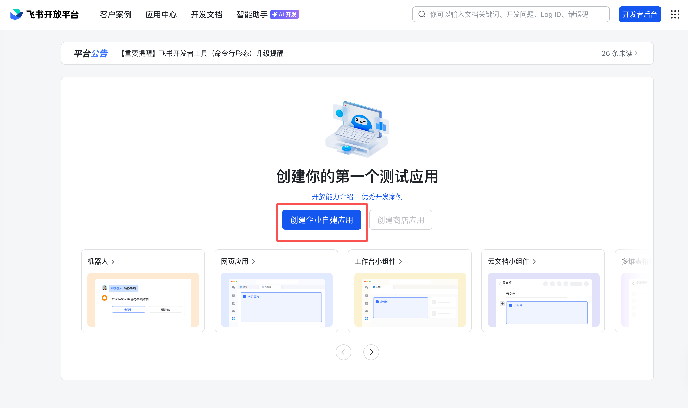
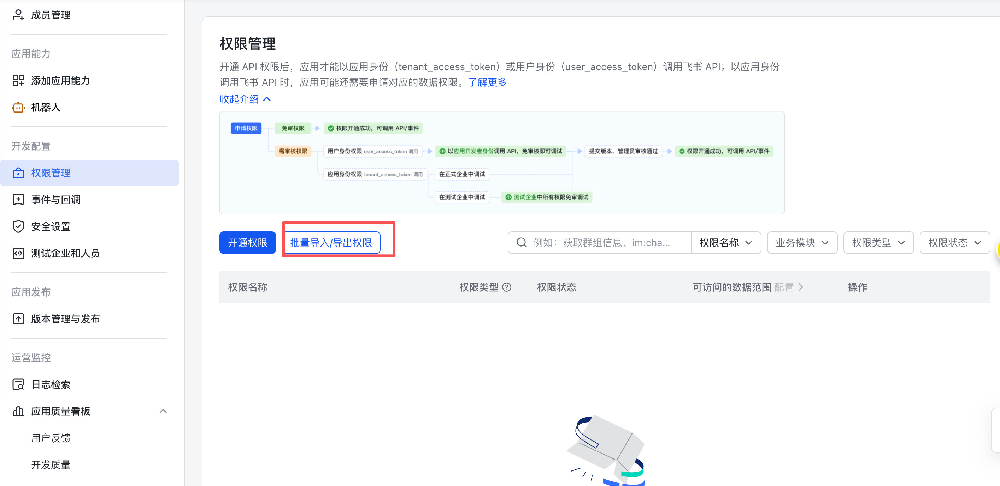
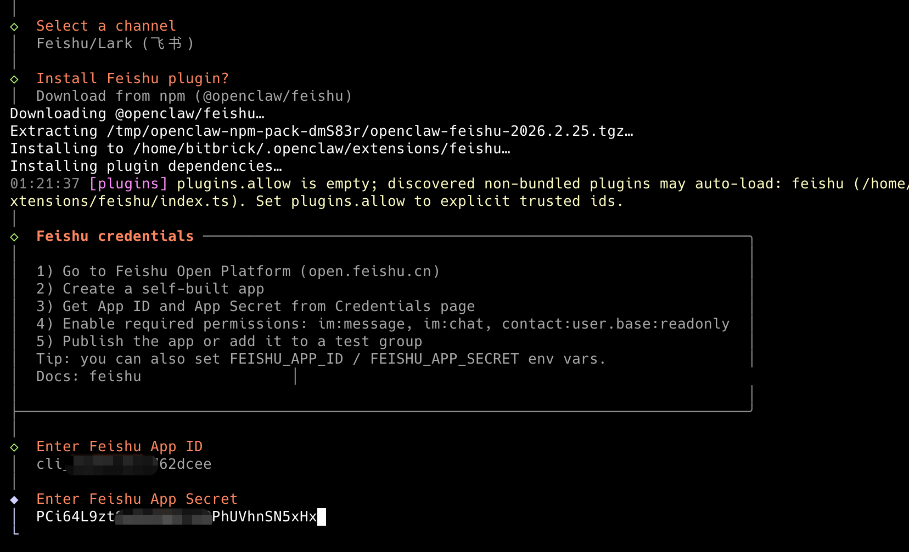
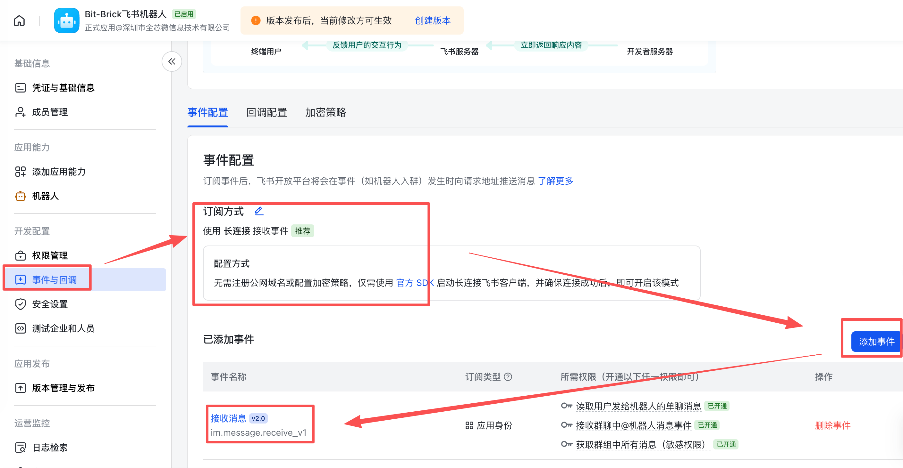
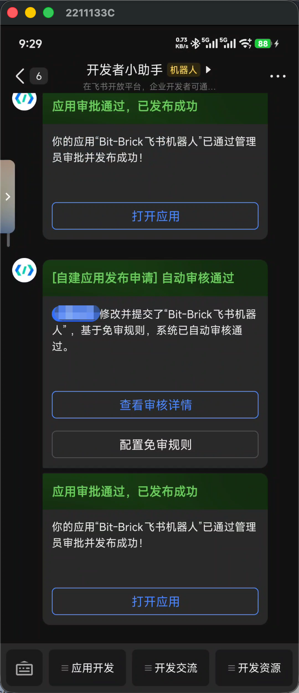

# OpenClaw Feishu Channel Configuration

Reference: https://docs.openclaw.ai/zh-CN/channels/feishu

The OpenClaw Feishu channel allows you to interact with OpenClaw through Feishu using natural language. Once configured, you can send messages to OpenClaw in Feishu, and OpenClaw will understand your intent and execute the corresponding operations.

## Configuration Steps

### 1. Create Feishu Application

1. Visit the [Feishu Developer Platform](https://open.feishu.cn/) and register/login to your account
2. Go to the [Developer Console](https://open.feishu.cn/app) to create a new application




### 2. Add Robot and Permissions

**Add Robot**: Select **Add Application Ability** → **Add by Capability** → **Bot** → **Add**


**Configure Permissions**: On the Permissions Management page, select **Batch Import/Export Permissions** → **Import Permissions**, copy the following permissions list to the text box, and click **Import Permissions**



```
{
	"scopes": {
		"tenant": [
			"aily:file:read",
			"aily:file:write",
			"application:application.app_message_stats.overview:readonly",
			"application:application:self_manage",
			"application:bot.menu:write",
			"cardkit:card:write",
			"contact:user.employee_id:readonly",
			"corehr:file:download",
			"docs:document.content:read",
			"event:ip_list",
			"im:chat",
			"im:chat.access_event.bot_p2p_chat:read",
			"im:chat.members:bot_access",
			"im:message",
			"im:message.group_at_msg:readonly",
			"im:message.group_msg",
			"im:message.p2p_msg:readonly",
			"im:message:readonly",
			"im:message:send_as_bot",
			"im:resource",
			"sheets:spreadsheet",
			"wiki:wiki:readonly"
		],
		"user": ["aily:file:read", "aily:file:write", "im:chat.access_event.bot_p2p_chat:read"]
	}
}
```


### 3. Create and Publish Initial Version

Create and publish an initial version (you can fill in any content), which is necessary before configuring event subscriptions.


### 4. Configure OpenClaw Feishu Channel

1. Go to the Feishu bot's **Credentials and Basic Information** page and copy the **Application Credentials**


2. Run the OpenClaw configuration command and follow these steps:

```
openclaw configure
```

- Select **Local**
- Select **Channels**
- Select **Configure/link**
- Select **Feishu/Lark**
- Select **Download from npm** for npm installation
- Enter the Feishu application's **App ID** and **App Secret**



3. Continue configuration with the following selections:
   - Select **Feishu (feishu.cn) - China** (China site)
   - Select **Open** - Respond in all groups (requires mentioning the bot)
   - Select **Finished** (complete channel selection)
   - Select **Yes** to configure DM access policy
   - Select **Pairing** (recommended)
   - Select **Continue** (complete)


### 5. Configure Event Subscription

Configure the following on the **Event Subscription** page in the Feishu backend:

1. Select **Use Long Connection to Receive Events** (WebSocket mode)
2. Add event: **im.message.receive_v1** (for receiving messages)

> **Note**: If the gateway is not running or the channel is not added, the long connection settings will fail to save.



### 6. Publish New Version

On the **Version Management and Publishing** page in the Feishu backend:

1. Select **Create Version**
2. Fill in the **Version Number** and **Description**
3. Click **Save**, then **Confirm Release**


You will receive an application update notification in Feishu. Click **Open App** to enter the chat interface.



### 7. Pairing and Verification

1. Open the chat interface and send any message. The bot will reply with a pairing code


2. Run the OpenClaw pairing command on the command line and enter the pairing code you received


3. Send a message to the bot in the chat interface to test and verify that the integration is successful


!