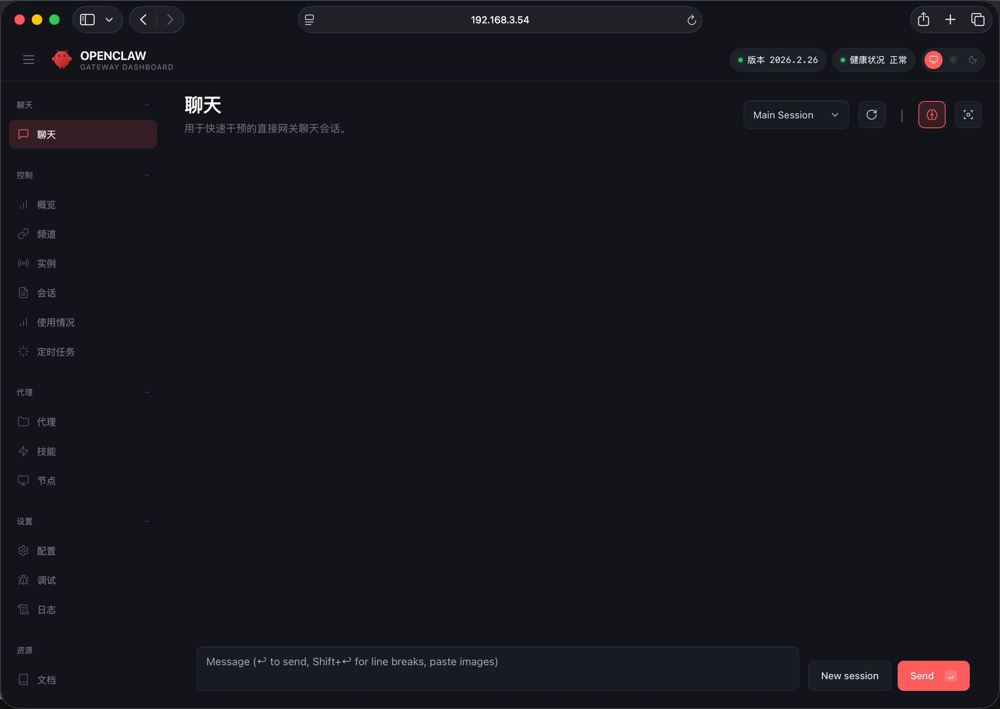

# Installing OpenClaw

## Run Installation Script

The official `OpenClaw` provides a script-based installation method:

> Note: This step requires the development board to have internet access.


```
curl -fsSL https://openclaw.ai/install.sh | bash
```

Result:


```
 🦞 OpenClaw Installer
  If it works, it's automation; if it breaks, it's a "learning opportunity."

✓ Detected: linux

Install plan
OS: linux
Install method: npm
Requested version: latest

[1/3] Preparing environment
· Node.js not found, installing it now
· Installing Node.js via NodeSource
· Installing Linux build tools (make/g++/cmake/python3)
✓ Build tools installed
✓ Node.js v22 installed
· Active Node.js: v22.22.0 (/usr/bin/node)
· Active npm: 10.9.4 (/usr/bin/npm)

[2/3] Installing OpenClaw
✓ Git already installed
· Configuring npm for user-local installs
✓ npm configured for user installs
· Installing OpenClaw v2026.2.26
! npm install failed for openclaw@latest
  Command: env SHARP_IGNORE_GLOBAL_LIBVIPS=1 npm --loglevel error --silent --no-fund --no-audit install -g openclaw@latest
  Installer log: /tmp/tmp.AcFXhctNd1
! npm install failed; showing last log lines
! npm install failed; retrying
✓ OpenClaw npm package installed
✓ OpenClaw installed

[3/3] Finalizing setup

! PATH missing npm global bin dir: /home/bitbrick/.npm-global/bin
  This can make openclaw show as "command not found" in new terminals.
  Fix (zsh: ~/.zshrc, bash: ~/.bashrc):
    export PATH="/home/bitbrick/.npm-global/bin:$PATH"

🦞 OpenClaw installed successfully (2026.2.26)!
Cozy. I've already read your calendar. We need to talk.

· Starting setup


🦞 OpenClaw 2026.2.26 (bc50708) — Because Siri wasn't answering at 3AM.
```


After installation completes, you will enter the onboarding interface:

```
Starting setup


🦞 OpenClaw 2026.2.26 (bc50708) — Because Siri wasn't answering at 3AM.


▄▄▄▄▄▄▄▄▄▄▄▄▄▄▄▄▄▄▄▄▄▄▄▄▄▄▄▄▄▄▄▄▄▄▄▄▄▄▄▄▄▄▄▄▄▄▄▄▄▄▄▄
██░▄▄▄░██░▄▄░██░▄▄▄██░▀██░██░▄▄▀██░████░▄▄▀██░███░██
██░███░██░▀▀░██░▄▄▄██░█░█░██░█████░████░▀▀░██░█░█░██
██░▀▀▀░██░█████░▀▀▀██░██▄░██░▀▀▄██░▀▀░█░██░██▄▀▄▀▄██
▀▀▀▀▀▀▀▀▀▀▀▀▀▀▀▀▀▀▀▀▀▀▀▀▀▀▀▀▀▀▀▀▀▀▀▀▀▀▀▀▀▀▀▀▀▀▀▀▀▀▀▀
                  🦞 OPENCLAW 🦞                    
 
┌  OpenClaw onboarding
│
◇  Security ─────────────────────────────────────────────────────────────────────────────────╮
│                                                                                            │
│  Security warning — please read.                                                           │
│                                                                                            │
│  OpenClaw is a hobby project and still in beta. Expect sharp edges.                        │
│  By default, OpenClaw is a personal agent: one trusted operator boundary.                  │
│  This bot can read files and run actions if tools are enabled.                             │
│  A bad prompt can trick it into doing unsafe things.                                       │
│                                                                                            │
│  OpenClaw is not a hostile multi-tenant boundary by default.                               │
│  If multiple users can message one tool-enabled agent, they share that delegated tool      │
│  authority.                                                                                │
│                                                                                            │
│  If you’re not comfortable with security hardening and access control, don’t run           │
│  OpenClaw.                                                                                 │
│  Ask someone experienced to help before enabling tools or exposing it to the internet.     │
│                                                                                            │
│  Recommended baseline:                                                                     │
│  - Pairing/allowlists + mention gating.                                                    │
│  - Multi-user/shared inbox: split trust boundaries (separate gateway/credentials, ideally  │
│    separate OS users/hosts).                                                               │
│  - Sandbox + least-privilege tools.                                                        │
│  - Shared inboxes: isolate DM sessions (`session.dmScope: per-channel-peer`) and keep      │
│    tool access minimal.                                                                    │
│  - Keep secrets out of the agent’s reachable filesystem.                                   │
│  - Use the strongest available model for any bot with tools or untrusted inboxes.          │
│                                                                                            │
│  Run regularly:                                                                            │
│  openclaw security audit --deep                                                            │
│  openclaw security audit --fix                                                             │
│                                                                                            │
│  Must read: https://docs.openclaw.ai/gateway/security                                      │
│                                                                                            │
├────────────────────────────────────────────────────────────────────────────────────────────╯
│
◆  I understand this is personal-by-default and shared/multi-user use requires lock-down. Continue?
│  ● Yes / ○ No
└

```


## Basic Configuration

In the onboarding interface, we need to perform some basic configuration to make `OpenClaw` work properly. Other settings can be changed later.

## Operating Instructions

Navigation on the onboarding page primarily uses the keyboard: **arrow keys to select**, **spacebar to check**, and **Enter to confirm**.

### Agree to Risk Notice

Select `Yes` and press Enter to confirm.


```
◆  I understand this is powerful and inherently risky. Continue?
│  ● Yes / ○ No
└
```


### Select QuickStart Mode

Select `QuickStart` and press Enter to confirm.


```
◆  Onboarding mode
│  ● QuickStart (Configure details later via openclaw configure.)
│  ○ Manual
└
```

### Select Model

You can skip model configuration here. Refer to the [OpenClaw Model API Configuration](./model_config.md) document for detailed setup. Select `Skip for now` and press Enter to confirm.


```
◆  Model/auth provider
│  ○ OpenAI
│  ○ Anthropic
│  ○ Chutes
│  ○ vLLM
│  ○ MiniMax
│  ○ Moonshot AI (Kimi K2.5)
│  ○ Google
│  ○ xAI (Grok)
│  ○ Mistral AI
│  ○ Volcano Engine
│  ○ BytePlus
│  ○ OpenRouter
│  ○ Kilo Gateway
│  ○ Qwen
│  ○ Z.AI
│  ○ Qianfan
│  ○ Copilot
│  ○ Vercel AI Gateway
│  ○ OpenCode Zen
│  ○ Xiaomi
│  ○ Synthetic
│  ○ Together AI
│  ○ Hugging Face
│  ○ Venice AI
│  ○ LiteLLM
│  ○ Cloudflare AI Gateway
│  ○ Custom Provider
│  ● Skip for now
```


Filter model providers - Select all providers:


```
Filter models by provider
│  ● All providers
│  ○ amazon-bedrock
│  ○ anthropic
│  ○ azure-openai-responses
│  ○ cerebras
│  ○ github-copilot
│  ○ google
│  ○ google-antigravity
│  ○ google-gemini-cli
│  ○ google-vertex
│  ○ groq
│  ○ huggingface
│  ○ kimi-coding
│  ○ minimax
│  ○ minimax-cn
│  ○ mistral
│  ○ openai
│  ○ openai-codex
│  ○ opencode
│  ○ openrouter
│  ○ vercel-ai-gateway
│  ○ xai
│  ○ zai
```


For the default model, you can keep it unchanged. It can be modified in detailed configuration later:


```
◆  Default model
│  ● Keep current (default: anthropic/claude-opus-4-6)
└
```


### Channel Configuration

> In OpenClaw, a channel is a bridge connecting users and AI assistants. Configuring channels allows users to interact with OpenClaw (send messages) through familiar communication platforms.

You can skip channel configuration here. Refer to the [OpenClaw Feishu Channel Configuration](./channel_feishu.md) document for detailed setup. Select `Skip for now` and press Enter to confirm.


```
◆  Select channel (QuickStart)
│  ○ Telegram (Bot API)
│  ○ WhatsApp (QR link)
│  ○ Discord (Bot API)
│  ○ IRC (Server + Nick)
│  ○ Google Chat (Chat API)
│  ○ Slack (Socket Mode)
│  ○ Signal (signal-cli)
│  ○ iMessage (imsg)
│  ○ Feishu/Lark (飞书)
│  ○ Nostr (NIP-04 DMs)
│  ○ Microsoft Teams (Bot Framework)
│  ○ Mattermost (plugin)
│  ○ Nextcloud Talk (self-hosted)
│  ○ Matrix (plugin)
│  ○ BlueBubbles (macOS app)
│  ○ LINE (Messaging API)
│  ○ Zalo (Bot API)
│  ○ Zalo (Personal Account)
│  ○ Synology Chat (Webhook)
│  ○ Tlon (Urbit)
│  ● Skip for now (You can add channels later via `openclaw channels add`)
```


### Configure Skills

Select `Yes` to configure. You can choose the `Skills` you need or skip. Later, you can let `OpenClaw` configure its own `Skills` through conversation without manual intervention:


```
Configure skills now? (recommended)
│  Yes
│
◆  Install missing skill dependencies
│  ◻ Skip for now (Continue without installing dependencies)
│  ◻ 🔐 1password
│  ◻ 📰 blogwatcher
│  ◻ 🫐 blucli
│  ◻ 📸 camsnap
│  ◻ 🧩 clawhub
│  ◻ 🎛️ eightctl
│  ◻ ♊️ gemini
│  ◻ 🧲 gifgrep
│  ◻ 🐙 github
│  ◻ 🎮 gog
│  ◻ 📍 goplaces
│  ◻ 📧 himalaya
│  ◻ 📦 mcporter
│  ◻ 🍌 nano-banana-pro
│  ◻ 📄 nano-pdf
│  ◻ 💎 obsidian
│  ◻ 🎙️ openai-whisper
│  ◻ 💡 openhue
│  ◻ 🧿 oracle
│  ◻ 🛵 ordercli
│  ◻ 🗣️ sag
│  ◻ 🌊 songsee
│  ◻ 🔊 sonoscli
│  ◻ 🧾 summarize
│  ◻ 📱 wacli
│  ◻ 𝕏 xurl
└
```


### Configure API Keys

Select `No` for all:


```
 Set GOOGLE_PLACES_API_KEY for goplaces?
│  No
│
◇  Set GEMINI_API_KEY for nano-banana-pro?
│  No
│
◇  Set NOTION_API_KEY for notion?
│  No
│
◇  Set OPENAI_API_KEY for openai-image-gen?
│  No
│
◇  Set OPENAI_API_KEY for openai-whisper-api?
│  No
│
◇  Set ELEVENLABS_API_KEY for sag?
│  No
│

```


### Configure Hooks

Select all configurations with spacebar, then press Enter to confirm:


```
◇  Hooks ──────────────────────────────────────────────────────────────────╮
│                                                                          │
│  Hooks let you automate actions when agent commands are issued.          │
│  Example: Save session context to memory when you issue /new or /reset.  │
│                                                                          │
│  Learn more: https://docs.openclaw.ai/automation/hooks                   │
│                                                                          │
├──────────────────────────────────────────────────────────────────────────╯
│
◆  Enable hooks?
│  ◻ Skip for now
│  ◼ 🚀 boot-md (Run BOOT.md on gateway startup)
│  ◼ 📎 bootstrap-extra-files (Inject additional workspace bootstrap files via glob/path patterns)
│  ◼ 📝 command-logger (Log all command events to a centralized audit file)
│  ◼ 💾 session-memory (Save session context to memory when /new or /reset command is issued)
```


### Complete Installation

```
◇  Systemd ────────────────────────────────────────────────────────────────────────────────╮
│                                                                                          │
│  Linux installs use a systemd user service by default. Without lingering, systemd stops  │
│  the user session on logout/idle and kills the Gateway.                                  │
│  Enabling lingering now (may require sudo; writes /var/lib/systemd/linger).              │
│                                                                                          │
├──────────────────────────────────────────────────────────────────────────────────────────╯
│
◇  Systemd ─────────────────────────────────╮
│                                           │
│  Enabled systemd lingering for bitbrick.  │
│                                           │
├───────────────────────────────────────────╯
│
◇  Gateway service runtime ────────────────────────────────────────────╮
│                                                                      │
│  QuickStart uses Node for the Gateway service (stable + supported).  │
│                                                                      │
├──────────────────────────────────────────────────────────────────────╯
│
◒  Installing Gateway service….
Installed systemd service: /home/bitbrick/.config/systemd/user/openclaw-gateway.service
◇  Gateway service installed.
│
◇  
Agents: main (default)
Heartbeat interval: 30m (main)
Session store (main): /home/bitbrick/.openclaw/agents/main/sessions/sessions.json (0 entries)
│
◇  Optional apps ────────────────────────╮
│                                        │
│  Add nodes for extra features:         │
│  - macOS app (system + notifications)  │
│  - iOS app (camera/canvas)             │
│  - Android app (camera/canvas)         │
│                                        │
├────────────────────────────────────────╯
│
◇  Control UI ─────────────────────────────────────────────────────────────────────╮
│                                                                                  │
│  Web UI: http://127.0.0.1:18789/                                                 │
│  Web UI (with token):                                                            │
│  http://127.0.0.1:18789/#token=d26f9eae39cfaf6ec8f481acf8ef8182a70b6f48541b148a  │
│  Gateway WS: ws://127.0.0.1:18789                                                │
│  Gateway: reachable                                                              │
│  Docs: https://docs.openclaw.ai/web/control-ui                                   │
│                                                                                  │
├──────────────────────────────────────────────────────────────────────────────────╯
│
◇  Start TUI (best option!) ─────────────────────────────────╮
│                                                            │
│  This is the defining action that makes your agent you.    │
│  Please take your time.                                    │
│  The more you tell it, the better the experience will be.  │
│  We will send: "Wake up, my friend!"                       │
│                                                            │
├────────────────────────────────────────────────────────────╯
│
◇  Token ─────────────────────────────────────────────────────────────────────────────────╮
│                                                                                         │
│  Gateway token: shared auth for the Gateway + Control UI.                               │
│  Stored in: ~/.openclaw/openclaw.json (gateway.auth.token) or OPENCLAW_GATEWAY_TOKEN.   │
│  View token: openclaw config get gateway.auth.token                                     │
│  Generate token: openclaw doctor --generate-gateway-token                               │
│  Web UI stores a copy in this browser's localStorage (openclaw.control.settings.v1).    │
│  Open the dashboard anytime: openclaw dashboard --no-open                               │
│  If prompted: paste the token into Control UI settings (or use the tokenized dashboard  │
│  URL).                                                                                  │
│                                                                                         │
├─────────────────────────────────────────────────────────────────────────────────────────╯
│
◆  How do you want to hatch your bot?
│  ○ Hatch in TUI (recommended)
│  ○ Open the Web UI
│  ● Do this later
└
```


## Access Web UI

To access `OpenClaw`'s web interface, we need to configure two settings to enable access within the local network:

> If the `openclaw` command is not available, first run `source ~/.bashrc` to load environment variables.
>
> You can use `openclaw help` to view the usage instructions for the `openclaw` command.


```
# 1. 设定网络访问模式为 LAN
openclaw config set gateway.bind lan

# 2. 设定HTTP访问降级为 true，允许不安全的HTTP访问（如果不设置这个参数，默认是禁止HTTP访问的）
openclaw config set gateway.controlUi.allowInsecureAuth true
openclaw config set gateway.controlUi.dangerouslyDisableDeviceAuth true
openclaw config set gateway.controlUi.dangerouslyAllowHostHeaderOriginFallback true

# 3. 重启 OpenClaw gateway 使配置生效
openclaw gateway restart
```

```
openclaw config set gateway.bind lan

🦞 OpenClaw 2026.2.26 (bc50708) — Less clicking, more shipping, fewer "where did that file go" moments.

Config overwrite: /home/bitbrick/.openclaw/openclaw.json (sha256 b06c46ae724c004b20c13f6732880f404385b83d4c8f4b02ef9a903b1b47e416 -> ce0ec749b920af4242ccee42363283dcd766ea207c551db33202329cede7036e, backup=/home/bitbrick/.openclaw/openclaw.json.bak)
Updated gateway.bind. Restart the gateway to apply.


openclaw config set gateway.controlUi.allowInsecureAuth true

🦞 OpenClaw 2026.2.26 (bc50708) — I'll butter your workflow like a lobster roll: messy, delicious, effective.

Config overwrite: /home/bitbrick/.openclaw/openclaw.json (sha256 cde7ca8e2611dcca9d10dcdb7e5a40a4d1a1cf215d4c091010e0d8035365c2fb -> cfe634c0ae210236015c26c1f86fa1332b6f24efff91f7313a61d87cff0f399e, backup=/home/bitbrick/.openclaw/openclaw.json.bak)
Updated gateway.controlUi.allowInsecureAuth. Restart the gateway to apply.

openclaw config set gateway.controlUi.dangerouslyDisableDeviceAuth true

🦞 OpenClaw 2026.2.26 (bc50708) — I'm like tmux: confusing at first, then suddenly you can't live without me.

Config overwrite: /home/bitbrick/.openclaw/openclaw.json (sha256 cfe634c0ae210236015c26c1f86fa1332b6f24efff91f7313a61d87cff0f399e -> 3224dd49453850d100f209f2f2da40da2a45acd627ef34bf8354424a72adb005, backup=/home/bitbrick/.openclaw/openclaw.json.bak)
Updated gateway.controlUi.dangerouslyDisableDeviceAuth. Restart the gateway to apply.
openclaw config set gateway.controlUi.dangerouslyAllowHostHeaderOriginFallback true

🦞 OpenClaw 2026.2.26 (bc50708) — Less middlemen, more messages.

Config overwrite: /home/bitbrick/.openclaw/openclaw.json (sha256 3224dd49453850d100f209f2f2da40da2a45acd627ef34bf8354424a72adb005 -> 51ee85ae2267767649ba4800e7202d06181206ac649daf29164049634609b36a, backup=/home/bitbrick/.openclaw/openclaw.json.bak)
Updated gateway.controlUi.dangerouslyAllowHostHeaderOriginFallback. Restart the gateway to apply.


openclaw gateway restart

🦞 OpenClaw 2026.2.26 (bc50708) — Your .env is showing; don't worry, I'll pretend I didn't see it.

Restarted systemd service: openclaw-gateway.service
```


Use the following command to view the `OpenClaw` web UI access address and `Dashboard URL`:


```

openclaw dashboard

🦞 OpenClaw 2026.2.26 (bc50708) — Works on Android. Crazy concept, we know.

Dashboard URL: http://127.0.0.1:18789/#token=d26f9eae39cfaf6ec8f481acf8ef8182a70b6f48541b148a
Copy to clipboard unavailable.
```


The access URL is typically `http://<board-ip>:18789/#token=<token>`. Enter this address in your browser to access `OpenClaw`'s web interface:

> - Use the `ifconfig` command to find `<board-ip>`. Replace `127.0.0.1` with this IP to access from within the local network.
> - `<token>` is an access token that verifies user permissions and ensures only authorized users can access `OpenClaw`'s web interface. The token changes each time you install or reset `OpenClaw`, so you need to use the latest token. The access URL obtained from the `openclaw dashboard` command includes the latest token, so you can use it directly to access the web interface.


```
http://192.168.3.54:18789/#token=af94e258639978672caef32fd1366c4466b1c100eceae38e
```




