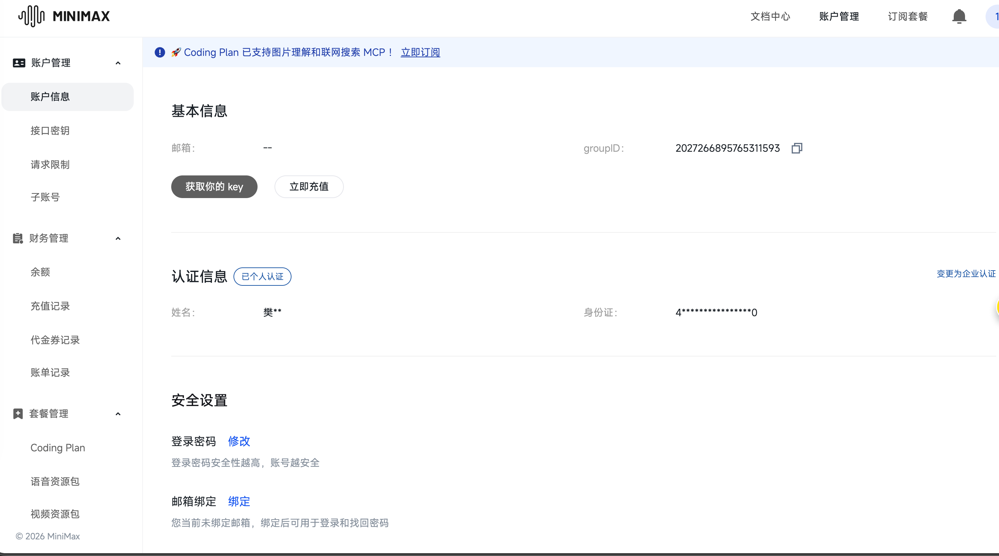
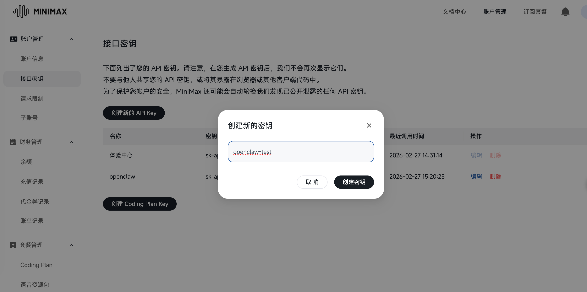
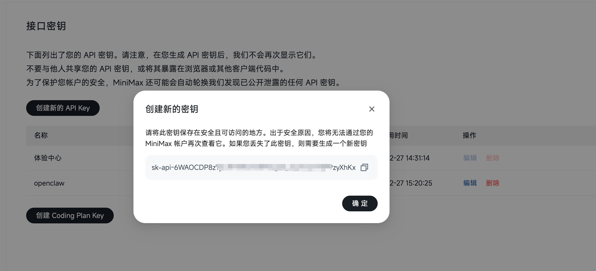
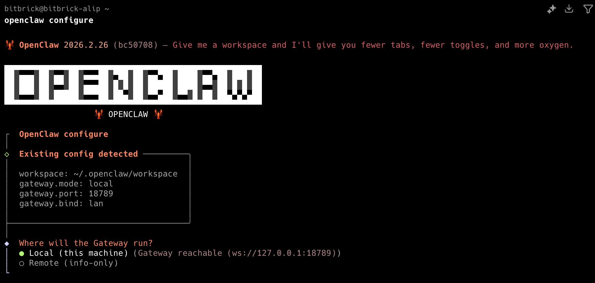
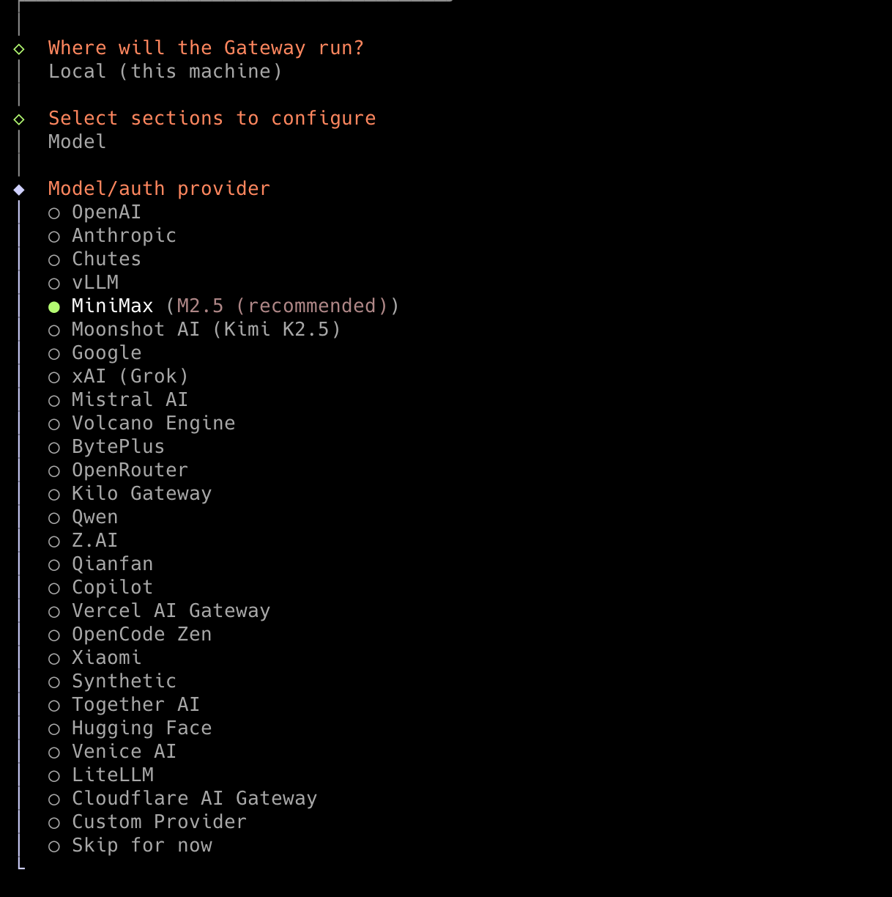
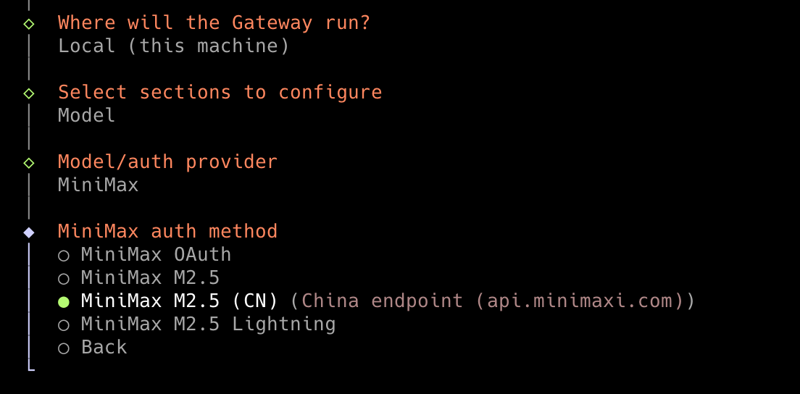
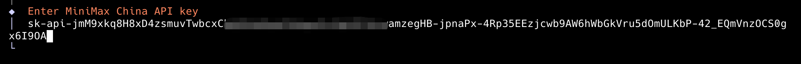
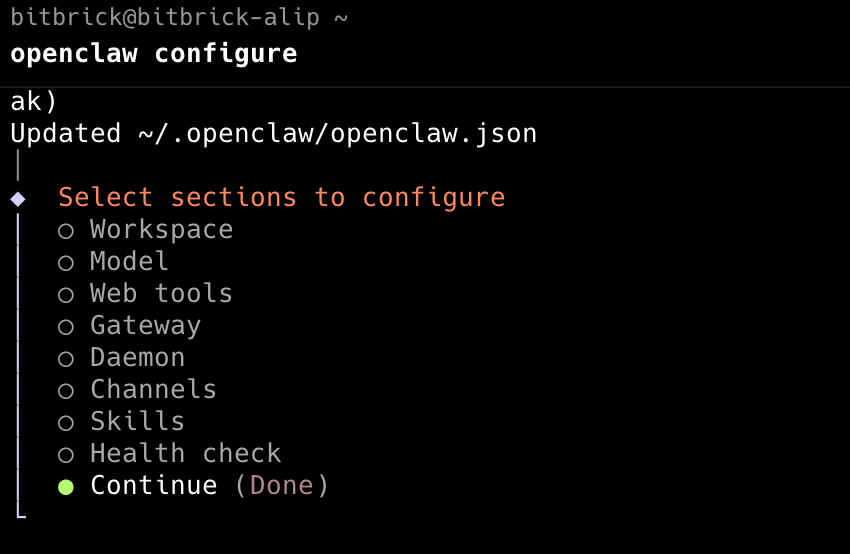
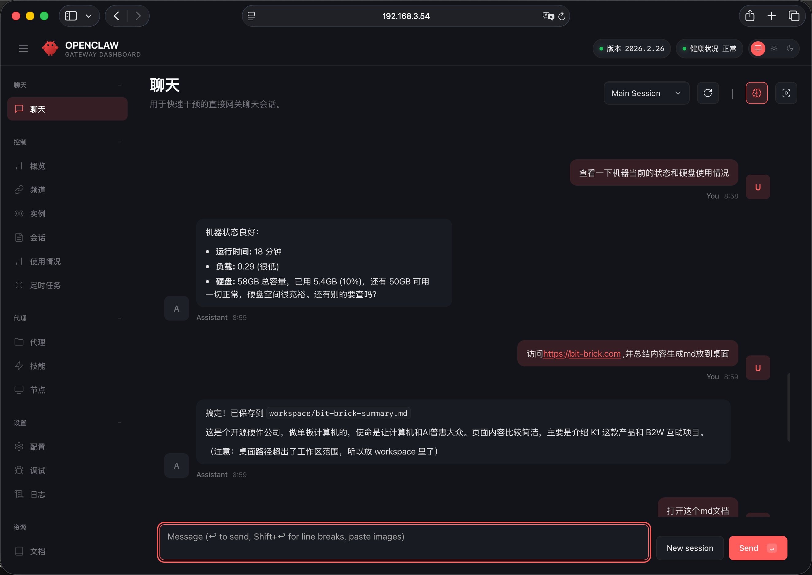

# OpenClaw Model API Configuration

After installing OpenClaw, you need to configure the large language model API.

To configure OpenClaw model API, follow these steps:

1. **Select Model Provider**: Choose a large language model provider such as OpenAI, Anthropic, etc., and register to obtain API keys.
2. **Obtain API Key**: On the model provider's official website, create an account and get the API key, which will be used for communication between OpenClaw and the large model.
3. **Configure OpenClaw**: In OpenClaw's settings interface, enter the model provider's API key and select the model type you want to use (such as GPT-4, MiniMax2.5, etc.).
4. **Test Connection**: After configuration, you can use OpenClaw's test functionality to verify that the API connection is successful and ensure OpenClaw can properly invoke the large model for task processing.

We'll use MiniMax as an example:

1. First, visit the MiniMax Developer Platform to register and click `Get your key`:

```
https://platform.minimaxi.com/user-center/basic-information
```



2. Click **Create New API Key**:

   

3. Copy the newly generated API key:

   

### Configure OpenClaw Model API

Use the command below to enter the `OpenClaw` settings interface:

```bash
openclaw configure
```



- Use **arrow keys** to select "Local", then press **Enter**.
- Next, select the `Model` option and press **Enter**.



- Use **arrow keys** again to select the `MiniMax` model and press Enter to confirm:

> **Tip**: Since we're using the `MiniMax` model here, select `MiniMax2.5 (CN)` from the model provider list. If using a different model, select the corresponding provider.




Then enter the API key we obtained earlier and press Enter to confirm:



Next, a multi-select page will appear. **Press Enter to accept the default options**, and finally select `Continue` to exit the configuration process:



> Model API configuration is now complete.

### Test Model API Configuration

Enter OpenClaw's chat interface and send a message to OpenClaw:


