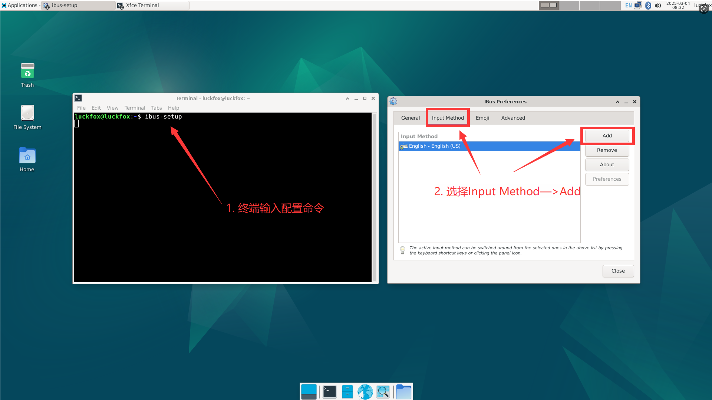
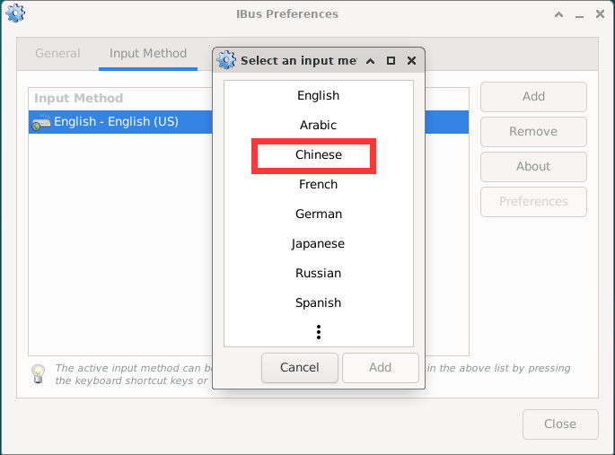

# System Configuration

## 1. Language Settings

1. Use Vim to edit the `/etc/locale.gen` file, comment out unwanted language environments and enable required language environments.

2. To switch from Chinese to English, perform the following operations in the file:

```bash
# Comment out the zh_CN.UTF-8 UTF-8 line
# Uncomment the en_US.UTF-8 UTF-8 line
```

3. Use the `dpkg-reconfigure` command to regenerate locale files non-interactively:

```bash
dpkg-reconfigure -f noninteractive locales
```

## 2. Auto-start Configuration

This section uses a GPIO program as an example for auto-start, with the absolute path being `/home/linaro/gpio.py`. Please modify corresponding locations according to your actual files and paths.

### 2.1 Desktop Auto-start

1. First, create a new `startup.sh` using the following command: (K1 Pro default in `/home/linaro`)

```bash
touch startup.sh
```

2. Open the `startup.sh` script file and enter the following content:

```bash
#!/bin/sh
sudo python3 gpio.py
```

3. Grant permissions to the `startup.sh` script file:

```bash
sudo chmod 777 startup.sh
```

4. Create auto-start file:

```bash
cd .config && mkdir autostart
cd autostart && sudo nano start.desktop
```

5. Enter the following content:

```ini
[Desktop Entry]
Type=Application
Exec=/home/linaro/startup.sh
```

6. Restart:

```bash
sudo reboot
```

### 2.2 Adding Auto-start in rc.local Script

1. Open `/etc/rc.local` script and add a line before `exit 0`:

```bash
sudo python3 /home/linaro/gpio.py &
```

2. Restart:

```bash
sudo reboot
```

### 2.3 System Manager Auto-start Settings

1. Create a new configuration file for the auto-start service at `/etc/systemd/system/gpio.service`, enter the following content:

```ini
[Unit]
Description=start oled

[Service]
Type=simple
Restart=always
RestartSec=5
ExecStart=/home/linaro/gpio.py

[Install]
WantedBy=multi-user.target
```

2. Enable a service to auto-start at system boot:

```bash
sudo systemctl enable gpio.service
```

3. Restart:

```bash
sudo systemctl restart gpio.service
```

4. Restart Omni3576:

```bash
sudo reboot
```

5. If you want to disable a service from auto-starting at system boot:

```bash
sudo systemctl disable gpio.service
```

## 3. Chinese Input Method Installation

1. Install desktop terminal software.

```bash
sudo apt update
sudo apt install xfce4-terminal
```

2. Install IBUS input method and related components.

```bash
sudo apt update
sudo apt install ibus-gtk ibus-gtk3 ibus ibus-libpinyin ibus-wayland at-spi2-core
```

3. Start IBUS input method background service.

```bash
ibus-daemon
```

4. Configure Chinese input method.

   - In the pop-up settings window:
    
    - Select Chinese -> Intelligent Pinyin
    
    
5. Restart the development board
   ```
   sudo reboot
   ```

   - Then **left-click the keyboard icon** in the top right corner, select **Chinese**.
    
6. Install `im-config` configuration tool and set IBUS as the default input method framework

```bash
sudo apt install im-config
im-config -n ibus
```