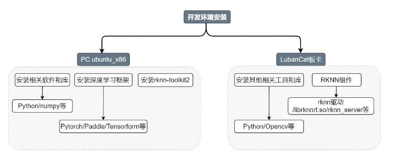
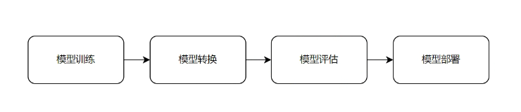

# Development Environment

## 1. RKNN Development Environment



On the PC side, the main tasks are model training and model conversion. You can choose:
- Windows system
- Ubuntu on a Windows virtual machine
- Docker Linux system
- Cloud servers, etc.

The PC side requires the installation of:
- Common software and libraries (e.g., PyCharm, Python, cross-compilers)
- Deep learning frameworks (PyTorch, TensorFlow, PaddlePaddle)
- It is recommended to use a virtual environment (Python virtual environment/Anaconda/Miniconda)

Board environment:
- System: Debian
- Pre-installed components: RKNN drivers and other related components
- Common software: Python, CMake, Make, GCC, OpenCV, etc.

Testing environment:
- PC side: WSL2 (used with PyCharm)
- Board system: Debian12

---

## 2. RKNN Development Process



Main steps:
1. **Model Training**
   - Select a model and dataset
   - Train using a deep learning framework
   - Refer to the [RKNN Operator Support List](https://github.com/airockchip/rknn-toolkit2/tree/master/doc)

2. **Model Conversion**
   - Convert the model to RKNN format

3. **Model Evaluation**
   - Use RKNN-Toolkit2 for quantization and performance analysis
   - Refer to the [RKNPU User Guide](https://github.com/airockchip/rknn-toolkit2/tree/master/doc)

4. **On-Board Inference**
   - Deploy the RKNN model to the board
   - Use [rknn-toolkit-lite2](https://github.com/airockchip/rknn-toolkit2/tree/master/rknn-toolkit-lite2)

---

## 3. Related Software Installation

### 3.1. Anaconda Installation
**Installation Steps**:
```bash
wget https://repo.anaconda.com/archive/Anaconda3-2023.07-2-Linux-x86_64.sh
bash Anaconda3-2023.07-2-Linux-x86_64.sh
source ~/.bashrc
```

**Common Commands**:
```bash
conda create -n env_name python=3.8   # Create environment
conda activate env_name               # Activate environment
conda deactivate                      # Deactivate environment
conda config --set auto_activate_base false  # Disable auto-activation
```

**Mirror Configuration**:
```bash
conda config --add channels https://mirrors.tuna.tsinghua.edu.cn/anaconda/pkgs/main
conda config --set show_channel_urls yes
```

---

### 3.2. RKNN-Toolkit2 Installation
**Installation Steps**:
```bash
conda create -n toolkit2_1.6 python=3.8
conda activate toolkit2_1.6
git clone https://github.com/airockchip/rknn-toolkit2
pip3 install -r packages/requirements_cp38-1.6.0.txt
pip3 install packages/rknn_toolkit2-1.6.0+81f21f4d-cp38-cp38-linux_x86_64.whl
```

**Verify Installation**:
```python
from rknn.api import RKNN
rknn = RKNN()  # Success if no errors occur
```

---

### 3.3. Jupyter Notebook Installation
**Installation Method**:
```bash
conda install jupyter notebook   # Using conda
# Or
pip3 install jupyter -i https://pypi.tuna.tsinghua.edu.cn/simple
```

---

### 3.4. Deep Learning Framework Installation

**PaddlePaddle Installation**:
```bash
# CPU Version
conda install paddlepaddle==2.5.1 --channel https://mirrors.tuna.tsinghua.edu.cn/anaconda/cloud/Paddle/

# GPU Version (requires CUDA)
conda install paddlepaddle-gpu==2.5.1 cudatoolkit=11.2 -c https://mirrors.tuna.tsinghua.edu.cn/anaconda/cloud/Paddle/
```

**TensorFlow Installation**:
```bash
# Create virtual environment
python3 -m venv .tensorflow_venv
source .tensorflow_venv/bin/activate
pip3 install tensorflow
```

**PyTorch Installation**:
```bash
conda create -n pytorch python=3.8
conda activate pytorch
pip3 install torch torchvision torchaudio
```

---

## 4. Reference Links
1. [CUDA Toolkit Archive](https://developer.nvidia.com/cuda-toolkit-archive)
2. [cuDNN Archive](https://developer.nvidia.com/rdp/cudnn-archive)
3. [Anaconda Mirror Configuration](https://mirrors.tuna.tsinghua.edu.cn/help/anaconda)
4. [PaddlePaddle Conda Installation Guide](https://www.paddlepaddle.org.cn/documentation/docs/zh/install/conda/linux-conda.html)
5. [TensorFlow Installation Guide](https://tensorflow.google.cn/install/pip?hl=zh-cn#conda)