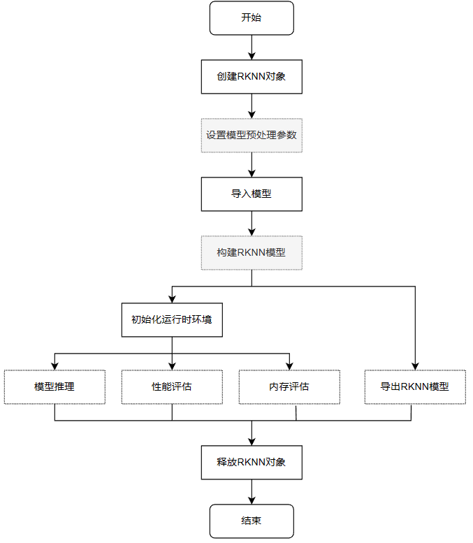

# RKNN Toolkit2

The RKNN Toolkit2 development kit (Python interface) runs on PC platforms (x86/arm64) and provides model conversion, quantization, model inference, performance and memory evaluation, quantization accuracy analysis, model encryption, and other functions. For more detailed function descriptions, please refer to the [《RKNN-Toolkit2 User Guide》](https://github.com/airockchip/rknn-toolkit2/tree/master/doc) in the RKNN-Toolkit2 project files.

This chapter will briefly introduce how to use RKNN-Toolkit2 for model conversion, model inference, performance evaluation, and other tests on a PC (Ubuntu system).

**Important**

Test environment: K1 Pro, with Debian image system, PC environment using Ubuntu 20.04. When writing this tutorial, RKNN-Toolkit2 version is 1.5.0, and the board NPU driver is 0.8.8.

## 1. Toolkit2 Installation

To install Toolkit2, you can use Python's package manager pip3 or directly use Docker to build the Toolkit2 environment. Related dependency libraries and Docker files can be obtained from Rockchip's official [RKNN-Toolkit2 project](https://github.com/airockchip/rknn-toolkit2) (the obtained RKNN-Toolkit2 files include RKNN Toolkit Lite2).

The following test uses Python's venv virtual environment to install Toolkit2. You can also refer to the previous development environment chapter to use [Anaconda](https://www.anaconda.com/download/) or [miniconda](https://docs.conda.io/en/latest/miniconda.html) to create the environment. Miniconda is a lightweight version of Anaconda.

```python
# Install Python tools, Ubuntu 20.04 comes with Python 3.8.10 by default
# For virtual environment, we choose to use python3.8-venv here, you can also install Anaconda/miniconda and use conda to manage environments
sudo apt update
sudo apt-get install python3-dev python3-pip python3.8-venv gcc

# Install related libraries and packages
sudo apt-get install libxslt1-dev zlib1g-dev libglib2.0 libsm6 \
libgl1-mesa-glx libprotobuf-dev gcc
```

Install RKNN-Toolkit2:

```python
# Create directory. Since the Ubuntu 20.04 being used for testing may have different package versions from those required for RKNN-Toolkit2,
# To avoid other issues, we use Python venv to isolate the environment.
mkdir project-Toolkit2 && cd project-Toolkit2
# toolkit2_1.5 is the environment name, can be modified as needed
python3 -m venv toolkit2_1.5

# Activate the environment
source toolkit2_1.5/bin/activate

# Pull the latest version from the official RKNN-Toolkit2 repository or get from the companion example (tutorial tested with toolkit2 version 1.5.0), or get from the companion network drive
git clone https://github.com/rockchip-linux/rknn-toolkit2.git
# Or git clone https://github.com/airockchip/rknn-toolkit2.git
#git clone https://gitee.com/LubanCat/lubancat_ai_manual_code.git
#cd lubancat_ai_manual_code/dev_env/rknn_toolkit2

# Configure pip source
pip3 config set global.index-url https://pypi.tuna.tsinghua.edu.cn/simple/

# Install dependencies according to rknn-toolkit2\doc\requirements_cp38-1.4.0.txt
pip3 install numpy
pip3 install -r doc/requirements_cp38-1.5.0.txt

# Install rknn_toolkit2
# Choose different whl files to install based on system Python version and architecture (latest version supports arm64 and x86):
pip3 install packages/rknn_toolkit2-1.5.0+1fa95b5c-cp38-cp38-linux_x86_64.whl
```

Check if installation was successful:

```python
(toolkit2_1.5) llh@YH-LONG:~$ python3
Python 3.8.17 (default, Jul  5 2023, 21:04:15)
[GCC 11.2.0] :: Anaconda, Inc. on linux
Type "help", "copyright", "credits" or "license" for more information.
>>> from rknn.api import RKNN
>>>
```

Type quit() or use Ctrl+D to exit.

## 2. RKNN Toolkit2 Interface Usage

This section familiarizes with the Toolkit-lite2 tool, which is used on the PC platform and provides Python interfaces to simplify model deployment and operation. Users can conveniently complete some functions through this tool:

• **Model Conversion**, the Toolkit-lite2 tool imports original Caffe, TensorFlow, TensorFlow Lite, ONNX, Pytorch, MXNet, and other models and converts them to RKNN models(), also supports importing RKNN models and then loading them for inference on the NPU platform.
• **Quantization Function**, supports quantizing floating-point models to fixed-point models, currently supports asymmetric quantization (asymmetric_quantized-8), and supports hybrid quantization function.
• **Model Inference**, can simulate NPU running RKNN model on PC and get inference results; or distribute RKNN model to specified NPU device for inference and get inference results.
• **Performance and Memory Evaluation**, connect to the board, distribute RKNN model to specified NPU device to run, then evaluate the performance and memory usage of the model running on actual device.
• **Quantization Accuracy Analysis**, this function will give the cosine distance between each layer's inference results after model quantization and floating-point model inference results, to analyze how quantization errors occur and provide ideas for improving quantization model accuracy.
• **Model Encryption Function**, encrypt the entire RKNN model using specified encryption level, because RKNN model decryption is completed in the NPU driver, when using encrypted models, they can be loaded just like normal RKNN models, and the NPU driver will automatically decrypt them.

Using Toolkit-lite2, you can run models on a PC through a simulator, then perform inference or model conversion operations; or run on a connected board NPU, transfer RKNN models to the NPU device to run, and then obtain inference results, performance information, etc., from the NPU device.

A simple flowchart for running models with Toolkit-lite2:



Simple description of the process:

• Create RKNN object, initialize RKNN environment
• Set model preprocessing parameters. If running on a PC through a simulator, you need to call the config interface to set model preprocessing parameters; if running on a connected board NPU and importing RKNN models, no configuration is needed.
• Import model. If running on a PC through a simulator, use load_caffe, load_tensorflow, etc., interfaces to import corresponding non-RKNN models; if running on a connected board NPU, use the load_rknn interface to import RKNN models.
• Build RKNN model. If running on a PC through a simulator, you need to call the build interface to build the RKNN model, then export the RKNN model or initialize the runtime environment for inference, etc.; if running on a connected board NPU, this step is not needed.
• Initialize runtime environment. If model inference or performance evaluation is required, you must first call init_runtime to initialize the runtime environment and specify the model's running platform (simulator or connected board hardware NPU).
• After initializing the runtime environment, you can call the inference interface for inference, use the eval_perf interface to evaluate model performance, or use the eval_memory interface to obtain the memory usage of the model running on the hardware platform (the model must run on the hardware platform).
• Finally, call the release interface to release the RKNN object.

When using load_rknn to import RKNN models, you cannot call accuracy_analysis for accuracy analysis. You need to import non-RKNN models and then set quantization when building the model.

For detailed interface descriptions, refer to the user manual in the doc/ directory of the RKNN-Toolkit2 project. For detailed usage examples, refer to the examples/functions directory in the RKNN-Toolkit2 project.

### 2.1. Model Conversion and Model Inference

This section demonstrates model conversion and inference through a simulator on a PC.

You can use the companion example or obtain it from the [RKNN-Toolkit2 project](https://github.com/airockchip/rknn-toolkit2) files in the example directory under onnx/yolov5.

In the already set up RKNN-Toolkit2 runtime environment, execute the following commands:

```python
# Switch to the companion example directory examples/onnx/yolov5 (using the tutorial companion example)
(toolkit2_1.5) llh@YH-LONG:~$ cd lubancat_ai_manual_code/dev_env/rknn-toolkit2/examples/conversion/yolov5
# Run test.py for model conversion and inference
(toolkit2_1.5) llh@YH-LONG:~/examples/conversion/yolov5$ python3 test.py
W __init__: rknn-toolkit2 version: 1.5.0+1fa95b5c
--> Config model
W config: 'target_platform' is None, use rk3566 as default, Please set according to the actual platform!
done
--> Loading model
Loading : 100%|████████████████████████████████████████████████| 124/124 [00:00<00:00, 16907.57it/s]
done
--> Building model
Analysing : 100%|███████████████████████████████████████████████| 142/142 [00:00<00:00, 5817.91it/s]
Quantizating : 100%|█████████████████████████████████████████████| 142/142 [00:00<00:00, 292.11it/s]
W build: The default input dtype of 'images' is changed from 'float32' to 'int8' in rknn model for performance!
                    Please take care of this change when deploy rknn model with Runtime API!
W build: The default output dtype of '269' is changed from 'float32' to 'int8' in rknn model for performance!
                    Please take care of this change when deploy rknn model with Runtime API!
W build: The default output dtype of '271' is changed from 'float32' to 'int8' in rknn model for performance!
                    Please take care of this change when deploy rknn model with Runtime API!
W build: The default output dtype of '273' is changed from 'float32' to 'int8' in rknn model for performance!
                    Please take care of this change when deploy rknn model with Runtime API!
done
--> Export rknn model
done
--> Init runtime environment
W init_runtime: Target is None, use simulator!
done
--> Running model
W inference: The 'data_format' has not been set and defaults is nhwc!
Analysing : 100%|███████████████████████████████████████████████| 146/146 [00:00<00:00, 5202.22it/s]
Preparing : 100%|███████████████████████████████████████████████| 146/146 [00:00<00:00, 1102.45it/s]
W inference: The dims of input(ndarray) shape (640, 640, 3) is wrong, expect dims is 4! Try expand dims to (1, 640, 640, 3)!
done
class: person, score: 0.8838784694671631
box coordinate left,top,right,down: [209.6862335205078, 243.11955797672272, 285.13685607910156, 507.7035621404648]
class: person, score: 0.8669421076774597
box coordinate left,top,right,down: [477.6677174568176, 241.00597953796387, 561.1506419181824, 523.3208637237549]
class: person, score: 0.826057493686676
box coordinate left,top,right,down: [110.24830067157745, 235.76190769672394, 231.76915538311005, 536.1012514829636]
class: person, score: 0.32633310556411743
box coordinate left,top,right,down: [80.75779604911804, 354.98213291168213, 121.49669003486633, 516.5315389633179]
class: bus , score: 0.6890695095062256
box coordinate left,top,right,down: [91.16828817129135, 134.78936767578125, 556.8909769654274, 460.78936767578125]
```

In the test.py main program:

```python
if __name__ == '__main__':

    # Create RKNN object
    rknn = RKNN(verbose=True)

    # Set model conversion parameters. Here you can specify the platform, add target_platform='rk3588' configuration, default is rk3566
    # mean_values sets the input mean, std_values sets the input normalization value
    print('--> Config model')
    rknn.config(mean_values=[[0, 0, 0]], std_values=[[255, 255, 255]])
    print('done')

    # Import onnx model, use model to specify the onnx model path
    print('--> Loading model')
    ret = rknn.load_onnx(model=ONNX_MODEL)
    if ret != 0:
        print('Load model failed!')
        exit(ret)
    print('done')

    # Build RKNN model. Here set do_quantization to true to enable quantization, dataset specifies the dataset used for quantization calibration
    print('--> Building model')
    ret = rknn.build(do_quantization=QUANTIZE_ON, dataset=DATASET)
    if ret != 0:
        print('Build model failed!')
        exit(ret)
    print('done')

    # Export RKNN model, use export_path to specify the export model path, here default is RKNN_MODEL
    print('--> Export rknn model')
    ret = rknn.export_rknn(RKNN_MODEL)
    if ret != 0:
        print('Export rknn model failed!')
        exit(ret)
    print('done')

    # Call init_runtime interface to initialize runtime environment, default is simulation on PC
    print('--> Init runtime environment')
    ret = rknn.init_runtime()
    # ret = rknn.init_runtime('rk3566')
    if ret != 0:
        print('Init runtime environment failed!')
        exit(ret)
    print('done')

    # Set output for model inference
    img = cv2.imread(IMG_PATH)
    # img, ratio, (dw, dh) = letterbox(img, new_shape=(IMG_SIZE, IMG_SIZE))
    img = cv2.cvtColor(img, cv2.COLOR_BGR2RGB)
    img = cv2.resize(img, (IMG_SIZE, IMG_SIZE))

    # Perform inference. If target is not set, the default is simulator. Then post-process the output data and save the results
    print('--> Running model')
    outputs = rknn.inference(inputs=[img])
    np.save('./onnx_yolov5_0.npy', outputs[0])
    np.save('./onnx_yolov5_1.npy', outputs[1])
    np.save('./onnx_yolov5_2.npy', outputs[2])
    print('done')

    # Omitted...
```

This example configures and imports the onnx model (yolov5s.onnx), quantizes the model, then exports the RKNN model (yolov5s.rknn). Subsequently, it initializes the runtime environment, uses the simulator for inference to obtain output data, post-processes the output data, and finally gets the result image:


### 2.2. Performance and Memory Evaluation

This section uses RKNN-Toolkit2 to run on a connected board NPU for performance and memory evaluation or inference.

RKNN Toolkit2 runs on a PC and connects to the NPU device via USB. RKNN Toolkit2 transfers the RKNN model to the NPU device to run, then retrieves inference results, performance information, etc., from the NPU device.

Before starting the example, the following operations are required:

1. **Connect the board**:
```python
# Execute the command on the board:
cat@lubancat:~$ ./adbd &
[1] 41260
cat@lubancat:~$ install_listener('tcp:5037','*smartsocket*')
using port=5555

# Install adb on PC
(toolkit2_1.5) llh@YH-LONG:~$ sudo apt install -y adb

# Start adb server
(toolkit2_1.5) llh@YH-LONG:~$ adb start-server

# Connect to the board. IP depends on the specific board, default port is 5555
(toolkit2_1.5) llh@YH-LONG:~$ adb connect 192.168.103.131
already connected to 192.168.103.131:5555

# View connected devices
(toolkit2_1.5) llh@YH-LONG:~$ adb devices
List of devices attached
192.168.103.131:5555    device
```

2. **Start rknn_server service**:
```python
# Execute restart_rknn.sh or directly execute rknn_server on the board
cat@lubancat:~$ rknn_server
start rknn server, version:1.5.0 (17e11b1 build: 2023-05-18 21:43:39)
I NPUTransfer: Starting NPU Transfer Server, Transfer version 2.1.0 (b5861e7@2020-11-23T11:50:51)
```

Next, obtain the companion example and test the example (test using RKNN model, use the RKNN model exported in the previous section):

```
(toolkit2_1.5) llh@YH-LONG:~$ cd lubancat_ai_manual_code/dev_env/rknn-toolkit2/examples/evaluation/yolov5
(toolkit2_1.5) llh@YH-LONG:~/rknn-toolkit2/examples/evaluation/yolov5$ python3 test.py
W __init__: rknn-toolkit2 version: 1.5.0+1fa95b5c
--> Loading model
done
--> Init runtime environment
W init_runtime: Flag perf_debug has been set, it will affect the performance of inference!
W init_runtime: Flag eval_mem has been set, it will affect the performance of inference!
I NPUTransfer: Starting NPU Transfer Client, Transfer version 2.1.0 (b5861e7@2020-11-23T11:50:36)
D RKNNAPI: ==============================================
D RKNNAPI: RKNN VERSION:
D RKNNAPI:   API: 1.5.0 (17e11b1 build: 2023-05-18 21:43:54)
D RKNNAPI:   DRV: rknn_server: 1.5.0 (17e11b1 build: 2023-05-18 21:43:39)
D RKNNAPI:   DRV: rknnrt: 1.5.0 (e6fe0c678@2023-05-25T08:09:20)
D RKNNAPI: ==============================================
D RKNNAPI: Input tensors:
D RKNNAPI:   index=0, name=images, n_dims=4, dims=[1, 640, 640, 3], n_elems=1228800, size=1228800, w_stride = 0, size_with_stride = 0, fmt=NHWC, type=INT8, qnt_type=AFFINE, zp=-128, scale=0.003922
D RKNNAPI: Output tensors:
D RKNNAPI:   index=0, name=269, n_dims=4, dims=[1, 255, 80, 80], n_elems=1632000, size=1632000, w_stride = 0, size_with_stride = 0, fmt=NCHW, type=INT8, qnt_type=AFFINE, zp=83, scale=0.093136
D RKNNAPI:   index=1, name=271, n_dims=4, dims=[1, 255, 40, 40], n_elems=408000, size=408000, w_stride = 0, size_with_stride = 0, fmt=NCHW, type=INT8, qnt_type=AFFINE, zp=48, scale=0.089854
D RKNNAPI:   index=2, name=273, n_dims=4, dims=[1, 255, 20, 20], n_elems=102000, size=102000, w_stride = 0, size_with_stride = 0, fmt=NCHW, type=INT8, qnt_type=AFFINE, zp=46, scale=0.078630
done
--> eval_perf
W eval_perf: The result of eval_perf is also saved to eval_perf.csv!
===================================================================================================================
                            Performance
        #### The performance result is just for debugging, ####
        #### may worse than actual performance!            ####
===================================================================================================================
ID   OpType           DataType Target InputShape                                   OutputShape            DDR Cycles     NPU Cycles     Total Cycles   Time(us)       MacUsage(%)    WorkLoad(0/1/2)-ImproveTherical        Task Number    Task Size      Regcmd Size    RW(KB)         FullName
1    InputOperator    UINT8    CPU    \                                            (1,3,640,640)          0              0              0              14             \              0.0%/0.0%/0.0% - Up:0.0%               0              0              0              4598.19        InputOperator:images
2    ConvRelu         UINT8    NPU    (1,3,640,640),(32,3,6,6),(32)                (1,32,320,320)         851599         345600         851599         4041           8.55           100.0%/0.0%/0.0% - Up:0.0%             68             67456          69632          4918.31        Conv:Conv_0
3    ConvRelu         INT8     NPU    (1,32,320,320),(64,32,3,3),(64)              (1,64,160,160)         416796         460800         460800         924            49.87          100.0%/0.0%/0.0% - Up:0.0%             42             41664          43008          2407.16        Conv:Conv_2
4    ConvRelu         INT8     NPU    (1,64,160,160),(32,64,1,1),(32)              (1,32,160,160)         277747         51200          277747         433            11.82          100.0%/0.0%/0.0% - Up:0.0%             17             16864          17408          1604.09        Conv:Conv_4
5    ConvRelu         INT8     NPU    (1,32,160,160),(32,32,1,1),(32)              (1,32,160,160)         421114         25600          421114         390            6.56           100.0%/0.0%/0.0% - Up:0.0%             10             9920           10240          2432.09        Conv:Conv_6
6    ConvReluAdd      INT8     NPU    (1,32,160,160),(32,32,3,3),(32),(1,32,160,160) (1,32,160,160)         416796         230400         416796         474            48.61          100.0%/0.0%/0.0% - Up:0.0%             10             9920           10240          2407.16        Conv:Conv_8
7    ConvRelu         INT8     NPU    (1,64,160,160),(32,64,1,1),(32)              (1,32,160,160)         554287         51200          554287         430            11.91          100.0%/0.0%/0.0% - Up:0.0%             22             17904          18688          3201.22        Conv:Conv_11
8    Concat           INT8     NPU    (1,32,160,160),(1,32,160,160)                (1,64,160,160)         555661         0              555661         638            \              100.0%/0.0%/0.0% - Up:0.0%             17             7664           8960           3209.16        Concat:Concat_13
9    ConvRelu         INT8     NPU    (1,64,160,160),(64,64,1,1),(64)              (1,64,160,160)         439662         102400         439662         645            15.88          100.0%/0.0%/0.0% - Up:0.0%             21             20832          21504          2539.22        Conv:Conv_14
10   ConvRelu         INT8     NPU    (1,64,160,160),(128,64,3,3),(128)            (1,128,80,80)          209700         460800         460800         817            56.40          100.0%/0.0%/0.0% - Up:0.0%             30             29760          30720          1211.09        Conv:Conv_16
11   ConvRelu         INT8     NPU    (1,128,80,80),(64,128,1,1),(64)              (1,64,80,80)           139569         51200          139569         277            18.48          100.0%/0.0%/0.0% - Up:0.0%             12             11904          12288          806.06         Conv:Conv_18
12   ConvRelu         INT8     NPU    (1,64,80,80),(64,64,1,1),(64)                (1,64,80,80)           216101         25600          216101         213            12.02          100.0%/0.0%/0.0% - Up:0.0%             9              8928           9216           1248.06        Conv:Conv_20
13   ConvReluAdd      INT8     NPU    (1,64,80,80),(64,64,3,3),(64),(1,64,80,80)   (1,64,80,80)           139569         230400         230400         347            66.40          100.0%/0.0%/0.0% - Up:0.0%             9              8928           9216           806.06         Conv:Conv_22
14   ConvRelu         INT8     NPU    (1,64,80,80),(64,64,1,1),(64)                (1,64,80,80)           216101         25600          216101         214            11.96          100.0%/0.0%/0.0% - Up:0.0%             9              8928           9216           1248.06        Conv:Conv_25
15   ConvReluAdd      INT8     NPU    (1,64,80,80),(64,64,3,3),(64),(1,64,80,80)   (1,64,80,80)           209700         230400         230400         349            66.02          100.0%/0.0%/0.0% - Up:0.0%             9              8928           9216           1211.09        Conv:Conv_27
16   ConvRelu         INT8     NPU    (1,128,80,80),(64,128,1,1),(64)              (1,64,80,80)           277249         51200          277249         276            18.55          100.0%/0.0%/0.0% - Up:0.0%             17             12944          13568          1601.22        Conv:Conv_30
17   Concat           INT8     NPU    (1,64,80,80),(1,64,80,80)                    (1,128,80,80)          280344         0              280344         372            \              100.0%/0.0%/0.0% - Up:0.0%             17             7664           8960           1619.09        Concat:Concat_32
18   ConvRelu         INT8     NPU    (1,128,80,80),(128,128,1,1),(128)            (1,128,80,80)          275014         102400         275014         365            28.05          100.0%/0.0%/0.0% - Up:0.0%             12             11904          12288          1588.31        Conv:Conv_33
19   ConvRelu         INT8     NPU    (1,128,80,80),(256,128,3,3),(256)            (1,256,40,40)          109787         460800         460800         684            67.37          100.0%/0.0%/0.0% - Up:0.0%             42             41664          43008          634.06         Conv:Conv_35
20   ConvRelu         INT8     NPU    (1,256,40,40),(128,256,1,1),(128)            (1,128,40,40)          72209          51200          72209          182            28.13          100.0%/0.0%/0.0% - Up:0.0%             9              8928           9216           417.03         Conv:Conv_37
21   ConvRelu         INT8     NPU    (1,128,40,40),(128,128,1,1),(128)            (1,128,40,40)          129002         25600          129002         136            18.82          100.0%/0.0%/0.0% - Up:0.0%             6              5952           6144           745.03         Conv:Conv_39
22   ConvReluAdd      INT8     NPU    (1,128,40,40),(128,128,3,3),(128),(1,128,40,40) (1,128,40,40)          72209          230400         230400         330            69.82          100.0%/0.0%/0.0% - Up:0.0%             6              5952           6144           417.03         Conv:Conv_41
23   ConvRelu         INT8     NPU    (1,128,40,40),(128,128,1,1),(128)            (1,128,40,40)          129002         25600          129002         133            19.25          100.0%/0.0%/0.0% - Up:0.0%             6              5952           6144           745.03         Conv:Conv_44
24   ConvReluAdd      INT8     NPU    (1,128,40,40),(128,128,3,3),(128),(1,128,40,40) (1,128,40,40)          72209          230400         230400         352            65.45          100.0%/0.0%/0.0% - Up:0.0%             6              5952           6144           417.03         Conv:Conv_46
25   ConvRelu         INT8     NPU    (1,128,40,40),(128,128,1,1),(128)            (1,128,40,40)          129002         25600          129002         214            11.96          100.0%/0.0%/0.0% - Up:0.0%             6              5952           6144           745.03         Conv:Conv_49
26   ConvReluAdd      INT8     NPU    (1,128,40,40),(128,128,3,3),(128),(1,128,40,40) (1,128,40,40)          109787         230400         230400         334            68.98          100.0%/0.0%/0.0% - Up:0.0%             6              5952           6144           634.06         Conv:Conv_51
27   ConvRelu         INT8     NPU    (1,256,40,40),(128,256,1,1),(128)            (1,128,40,40)          138730         51200          138730         179            28.60          100.0%/0.0%/0.0% - Up:0.0%             14             9968           10496          801.22         Conv:Conv_54
28   Concat           INT8     NPU    (1,128,40,40),(1,128,40,40)                  (1,256,40,40)          149958         0              149958         214            \              100.0%/0.0%/0.0% - Up:0.0%             17             7664           8960           866.06         Concat:Concat_56
29   ConvRelu         INT8     NPU    (1,256,40,40),(256,256,1,1),(256)            (1,256,40,40)          504912         102400         504912         235            43.57          100.0%/0.0%/0.0% - Up:0.0%             9              8928           9216           2916.06        Conv:Conv_57
30   ConvRelu         INT8     NPU    (1,256,40,40),(512,256,3,3),(512)            (1,512,20,20)          74287          460800         460800         747            61.69          100.0%/0.0%/0.0% - Up:0.0%             12             11904          12288          429.03         Conv:Conv_59
31   ConvRelu         INT8     NPU    (1,512,20,20),(256,512,1,1),(256)            (1,256,20,20)          45890          51200          51200          150            34.13          100.0%/0.0%/0.0% - Up:0.0%             6              5952           6144           265.03         Conv:Conv_61
32   ConvRelu         INT8     NPU    (1,256,20,20),(256,256,1,1),(256)            (1,256,20,20)          151857         25600          151857         101            25.35          100.0%/0.0%/0.0% - Up:0.0%             6              5952           6144           877.03         Conv:Conv_63
33   ConvReluAdd      INT8     NPU    (1,256,20,20),(256,256,3,3),(256),(1,256,20,20) (1,256,20,20)          74287          230400         230400         315            73.14          100.0%/0.0%/0.0% - Up:0.0%             6              5952           6144           429.03         Conv:Conv_65
34   ConvRelu         INT8     NPU    (1,512,20,20),(256,512,1,1),(256)            (1,256,20,20)          69471          51200          69471          148            34.59          100.0%/0.0%/0.0% - Up:0.0%             11             6992           7424           401.22         Conv:Conv_68
35   Concat           INT8     NPU    (1,256,20,20),(1,256,20,20)                  (1,512,20,20)          113764         0              113764         123            \              100.0%/0.0%/0.0% - Up:0.0%             17             7664           8960           657.03         Concat:Concat_70
36   ConvRelu         INT8     NPU    (1,512,20,20),(512,512,1,1),(512)            (1,512,20,20)          74287          102400         102400         206            49.71          100.0%/0.0%/0.0% - Up:0.0%             6              5952           6144           429.03         Conv:Conv_71
37   ConvRelu         INT8     NPU    (1,512,20,20),(256,512,1,1),(256)            (1,256,20,20)          58952          51200          58952          144            35.56          100.0%/0.0%/0.0% - Up:0.0%             11             6992           7424           340.47         Conv:Conv_73
38   MaxPool          INT8     NPU    (1,256,20,20)                                (1,256,20,20)          58952          0              58952          86             \              100.0%/0.0%/0.0% - Up:0.0%             2              416            512            340.47         MaxPool:MaxPool_75
39   MaxPool          INT8     NPU    (1,256,20,20)                                (1,256,20,20)          58952          0              58952          83             \              100.0%/0.0%/0.0% - Up:0.0%             2              416            512            340.47         MaxPool:MaxPool_76
40   MaxPool          INT8     NPU    (1,256,20,20)                                (1,256,20,20)          138941         0              138941         84             \              100.0%/0.0%/0.0% - Up:0.0%             2              416            512            802.44         MaxPool:MaxPool_77
41   Concat           INT8     NPU    (1,256,20,20),(1,256,20,20),(1,256,20,20),(1,256,20,20) (1,1024,20,20)         281551         0
281551         203            \              100.0%/0.0%/0.0% - Up:0.0%             29             14288          16640          1626.06        Concat:Concat_78
42   ConvRelu         INT8     NPU    (1,1024,20,20),(512,1024,1,1),(512)          (1,512,20,20)          74287          204800         204800         365            56.11          100.0%/0.0%/0.0% - Up:0.0%             12             11904          12288          429.03         Conv:Conv_79
43   ConvRelu         INT8     NPU    (1,512,20,20),(256,512,1,1),(256)            (1,256,20,20)          87446          51200          87446          147            34.83          100.0%/0.0%/0.0% - Up:0.0%             11             6992           7424           505.03         Conv:Conv_81
44   ConvTranspose    INT8     NPU    (1,256,20,20),(256,1,4,4),(256)              (1,256,40,40)          277249         6400           277249         170            3.76           100.0%/0.0%/0.0% - Up:0.0%             1              992            1024           1601.22        ConvTranspose:Resize_84_2deconv
45   Concat           INT8     NPU    (1,256,40,40),(1,256,40,40)                  (1,512,40,40)          184766         0              184766         458            \              100.0%/0.0%/0.0% - Up:0.0%             17             7664           8960           1067.09        Concat:Concat_85
46   ConvRelu         INT8     NPU    (1,512,40,40),(128,512,1,1),(128)            (1,128,40,40)          72209          102400         102400         362            28.29          100.0%/0.0%/0.0% - Up:0.0%             12             11904          12288          417.03         Conv:Conv_86
47   ConvRelu         INT8     NPU    (1,128,40,40),(128,128,1,1),(128)            (1,128,40,40)          94372          25600          94372          201            12.74          100.0%/0.0%/0.0% - Up:0.0%             6              5952           6144           545.03         Conv:Conv_88
48   ConvRelu         INT8     NPU    (1,128,40,40),(128,128,3,3),(128)            (1,128,40,40)          184766         230400         230400         392            58.78          100.0%/0.0%/0.0% - Up:0.0%             6              5952           6144           1067.09        Conv:Conv_90
49   ConvRelu         INT8     NPU    (1,512,40,40),(128,512,1,1),(128)            (1,128,40,40)          138730         102400         138730         356            28.76          100.0%/0.0%/0.0% - Up:0.0%             17             12944          13568          801.22         Conv:Conv_92
50   Concat           INT8     NPU    (1,128,40,40),(1,128,40,40)                  (1,256,40,40)          149958         0              

149958         277            \              100.0%/0.0%/0.0% - Up:0.0%             17             7664           8960           866.06         Concat:Concat_94
51   ConvRelu         INT8     NPU    (1,256,40,40),(256,256,1,1),(256)            (1,256,40,40)          109787         102400         109787         228            44.91          100.0%/0.0%/0.0% - Up:0.0%             9              8928           9216           634.06         Conv:Conv_95
52   ConvRelu         INT8     NPU    (1,256,40,40),(128,256,1,1),(128)            (1,128,40,40)          173674         51200          173674         168            30.48          100.0%/0.0%/0.0% - Up:0.0%             14             9968           10496          1003.03        Conv:Conv_97
53   ConvTranspose    INT8     NPU    (1,128,40,40),(128,1,4,4),(128)              (1,128,80,80)          554287         12800          554287         405            3.16           100.0%/0.0%/0.0% - Up:0.0%             1              992            1024           3201.22        ConvTranspose:Resize_100_2deconv
54   Concat           INT8     NPU    (1,128,80,80),(1,128,80,80)                  (1,256,80,80)          349961         0              349961         739            \              100.0%/0.0%/0.0% - Up:0.0%             17             7664           8960           2021.16        Concat:Concat_101
55   ConvRelu         INT8     NPU    (1,256,80,80),(64,256,1,1),(64)              (1,64,80,80)           139569         102400         139569         477            21.47          100.0%/0.0%/0.0% - Up:0.0%             21             20832          21504          806.06         Conv:Conv_102
56   ConvRelu         INT8     NPU    (1,64,80,80),(64,64,1,1),(64)                (1,64,80,80)           146841         25600          146841         282            9.08           100.0%/0.0%/0.0% - Up:0.0%             9              8928           9216           848.06         Conv:Conv_104
57   ConvRelu         INT8     NPU    (1,64,80,80),(64,64,3,3),(64)                (1,64,80,80)           349961         230400         349961         406            56.75          100.0%/0.0%/0.0% - Up:0.0%             9              8928           9216           2021.16        Conv:Conv_106
58   ConvRelu         INT8     NPU    (1,256,80,80),(64,256,1,1),(64)              (1,64,80,80)           277249         102400         277249         409            25.04          100.0%/0.0%/0.0% - Up:0.0%             26             21872          22784          1601.22        Conv:Conv_108
59   Concat           INT8     NPU    (1,64,80,80),(1,64,80,80)                    (1,128,80,80)          280344         0              280344         431            \              100.0%/0.0%/0.0% - Up:0.0%             17             7664           8960           1619.09        Concat:Concat_110
60   ConvRelu         INT8     NPU    (1,128,80,80),(128,128,1,1),(128)            (1,128,80,80)          421633         102400         421633         430            23.81          100.0%/0.0%/0.0% - Up:0.0%             12             11904          12288          2435.09        Conv:Conv_111
61   Conv             INT8     NPU    (1,128,80,80),(255,128,1,1),(255)            (1,255,80,80)          421444         204000         421444         645            31.63          100.0%/0.0%/0.0% - Up:0.0%             17             12944          13568          2434.00        Conv:Conv_141
62   OutputOperator   INT8     CPU    (1,255,80,80)                                \                      0              0              0              148            \              0.0%/0.0%/0.0% - Up:0.0%               0              0              0              1178.12        OutputOperator:269
63   ConvRelu         INT8     NPU    (1,128,80,80),(128,128,3,3),(128)            (1,128,40,40)          138730         230400         230400         486            47.41          100.0%/0.0%/0.0% - Up:0.0%             23             18896          19712          801.22         Conv:Conv_113
64   Concat           INT8     NPU    (1,128,40,40),(1,128,40,40)                  (1,256,40,40)          109787         0              109787         208            \              100.0%/0.0%/0.0% - Up:0.0%             17             7664           8960           634.06         Concat:Concat_115
65   ConvRelu         INT8     NPU    (1,256,40,40),(128,256,1,1),(128)            (1,128,40,40)          72209          51200          72209          165            31.03          100.0%/0.0%/0.0% - Up:0.0%             9              8928           9216           417.03         Conv:Conv_116
66   ConvRelu         INT8     NPU    (1,128,40,40),(128,128,1,1),(128)            (1,128,40,40)          94372          25600          94372          123            20.81          100.0%/0.0%/0.0% - Up:0.0%             6              5952           6144           545.03         Conv:Conv_118
67   ConvRelu         INT8     NPU    (1,128,40,40),(128,128,3,3),(128)            (1,128,40,40)          109787         230400         230400         315            73.14          100.0%/0.0%/0.0% - Up:0.0%             6              5952           6144           634.06         Conv:Conv_120
68   ConvRelu         INT8     NPU    (1,256,40,40),(128,256,1,1),(128)            (1,128,40,40)          138730         51200          138730         167            30.66          100.0%/0.0%/0.0% - Up:0.0%             14             9968           10496          801.22         Conv:Conv_122
69   Concat           INT8     NPU    (1,128,40,40),(1,128,40,40)                  (1,256,40,40)          149958         0              149958         202            \              100.0%/0.0%/0.0% - Up:0.0%             17             7664           8960           866.06         Concat:Concat_124
70   ConvRelu         INT8     NPU    (1,256,40,40),(256,256,1,1),(256)            (1,256,40,40)          149958         102400         149958         222            46.13          100.0%/0.0%/0.0% - Up:0.0%             9              8928           9216           866.06         Conv:Conv_125
71   Conv             INT8     NPU    (1,256,40,40),(255,256,1,1),(255)            (1,255,40,40)          149947         102000         149947         227            44.93          100.0%/0.0%/0.0% - Up:0.0%             14             9968           10496          866.00         Conv:Conv_143
72   OutputOperator   INT8     CPU    (1,255,40,40)                                \                      0              0              0              45             \              0.0%/0.0%/0.0% - Up:0.0%               0              0              0              1664.06        OutputOperator:271
73   ConvRelu         INT8     NPU    (1,256,40,40),(256,256,3,3),(256)            (1,256,20,20)          69471          230400         230400         398            57.89          100.0%/0.0%/0.0% - Up:0.0%             17             12944          13568          401.22         Conv:Conv_127
74   Concat           INT8     NPU    (1,256,20,20),(1,256,20,20)                  (1,512,20,20)          74287          0              74287          124            \              100.0%/0.0%/0.0% - Up:0.0%             17             7664           8960           429.03         Concat:Concat_129
75   ConvRelu         INT8     NPU    (1,512,20,20),(256,512,1,1),(256)            (1,256,20,20)          45890          51200          51200          145            35.31          100.0%/0.0%/0.0% - Up:0.0%             6              5952           6144           265.03         Conv:Conv_130
76   ConvRelu         INT8     NPU    (1,256,20,20),(256,256,1,1),(256)            (1,256,20,20)          134542         25600          134542         102            25.10          100.0%/0.0%/0.0% - Up:0.0%             6              5952           6144           777.03         Conv:Conv_132
77   ConvRelu         INT8     NPU    (1,256,20,20),(256,256,3,3),(256)            (1,256,20,20)          74287          230400         230400         319            72.23          100.0%/0.0%/0.0% - Up:0.0%             6              5952           6144           429.03         Conv:Conv_134
78   ConvRelu         INT8     NPU    (1,512,20,20),(256,512,1,1),(256)            (1,256,20,20)          69471          51200          69471          145            35.31          100.0%/0.0%/0.0% - Up:0.0%             11             6992           7424           401.22         Conv:Conv_136
79   Concat           INT8     NPU    (1,256,20,20),(1,256,20,20)                  (1,512,20,20)          113764         0              113764         123            \              100.0%/0.0%/0.0% - Up:0.0%             17             7664           8960           657.03         Concat:Concat_138
80   ConvRelu         INT8     NPU    (1,512,20,20),(512,512,1,1),(512)            (1,512,20,20)          74287          102400         102400         207            49.47          100.0%/0.0%/0.0% - Up:0.0%             6              5952           6144           429.03         Conv:Conv_139
81   Conv             INT8     NPU    (1,512,20,20),(255,512,1,1),(255)            (1,255,20,20)          74454          51000          74454          147            34.69          100.0%/0.0%/0.0% - Up:0.0%             11             6992           7424           430.00         Conv:Conv_145
82   OutputOperator   INT8     CPU    (1,255,20,20)                                \                      0              0              0              19             \              0.0%/0.0%/0.0% - Up:0.0%               0              0              0              100.00         OutputOperator:273
Total Operator Elapsed Time(us): 27987
Total Memory RW Amount(MB): 88.4914
Operator Time-Consuming Ranking:
OpType           Call Number     CPU Time(us)    NPU Time(us)    Total Time(us)    Time Ratio(%)
ConvRelu         50              0               19301           19301             68.96
Concat           13              0               4112            4112              14.69
ConvReluAdd      7               0               2501            2501              8.93
Conv             3               0               1019            1019              3.64
ConvTranspose    2               0               575             575               2.05
MaxPool          3               0               253             253               0.9
OutputOperator   3               212             0               212               0.75
InputOperator    1               14              0               14                0.05

===================================================================================================================

done
--> eval_memory
======================================================
            Memory Profile Info Dump
======================================================
NPU model memory detail(bytes):
    Total Weight Memory: 6.99 MiB
    Total Internal Tensor Memory: 5.86 MiB
    Total Memory: 18.16 MiB

INFO: When evaluating memory usage, we need consider
the size of model, current model size is: 8.11 MiB
======================================================

done
```

test.py main program:
```python
if __name__ == '__main__':
    # Create RKNN
    # If there are issues during testing, enable verbose=True to view debug information.
    #rknn = RKNN(verbose=True)
    rknn = RKNN()

    # Import RKNN model, path parameter specifies the rknn model path
    print('--> Loading model')
    ret = rknn.load_rknn(path=RKNN_MODEL)
    if ret != 0:
        print('Load model failed!')
        exit(ret)
    print('done')

    # Initialize runtime environment, specify the connected board NPU platform, device_id specifies the board device ID connected via adb
    # perf_debug enables debug mode during performance evaluation, eval_mem enters memory evaluation mode
    print('--> Init runtime environment')
    ret = rknn.init_runtime(target='rk3588', device_id='192.168.103.131:5555', perf_debug=True, eval_mem=True)
    if ret != 0:
        print('Init runtime environment failed!')
        exit(ret)
    print('done')

    # Evaluate model performance, default is_print is true, prints memory usage
    print('--> eval_perf')
    rknn.eval_perf()
    print('done')

    # Debug, evaluate model performance, default is_print is true, prints memory usage
    print('--> eval_memory')
    rknn.eval_memory()
    print('done')

    rknn.release()
```
The above program initializes the runtime environment for memory and performance evaluation. You can also perform inference on the NPU device. Refer to the previous section for inference on the PC simulator.

For more rknn-toolkit2 function test examples, refer to:
https://github.com/rockchip-linux/rknn-toolkit2/tree/master/examples/functions.

# 3. Board Information Viewing and Settings

## 3.1. For rk3576
1. Query and set NPU frequency
```
# View driver version
cat /sys/kernel/debug/rknpu/version

# View power status
cat /sys/kernel/debug/rknpu/power

# View NPU usage rate, requires root permissions
cat /sys/kernel/debug/rknpu/load

# View available NPU frequencies, then set frequency
cat /sys/class/devfreq/fdab0000.npu/available_frequencies

echo userspace > /sys/class/devfreq/fdab0000.npu/governor

echo 1000000000 > /sys/class/devfreq/fdab0000.npu/userspace/set_freq

# View current NPU working frequency
cat /sys/kernel/debug/rknpu/freq
```
3.3.3. Other NPU-related
```
# View librknnrt library version
strings /usr/lib/librknnrt.so | grep "librknnrt version"

# View rknn_server version
strings /usr/bin/rknn_server | grep build

# View NPU driver version
dmesg | grep -i rknpu

# Or
sudo cat /sys/kernel/debug/rknpu/version
```
Regarding NPU driver updates, you need to compile the kernel and then update the board kernel. The board can directly use commands to update or burn the latest image from the network drive.
```
sudo apt update

# Please update according to the actual board kernel version
sudo apt install linux-image-5.10.160

sudo apt install linux-image-5.10.198
```
3.4. Reference Links

https://github.com/airockchip/rknn-toolkit2

https://github.com/rockchip-linux/rknn-toolkit2

https://github.com/rockchip-linux/rknpu2