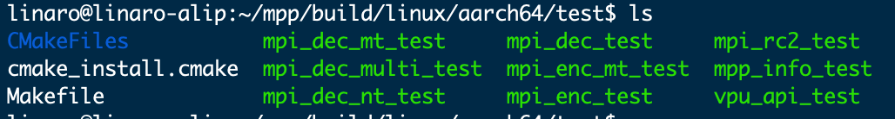

#   Video Codec - Based on MPP Library

##  1. MPP Introduction

The Media Process Platform (MPP) provided by Rockchip is a general-purpose media processing software platform for Rockchip chip series. This platform shields application software from complex underlying chip-related processing, aiming to shield differences between different chips and provide users with a unified Media Process Interface (MPI). MPP provides the following functionalities:

- **Video Decoding**  
  H.265 / H.264 / H.263 / VP9 / VP8 / MPEG-4 / MPEG-2 / MPEG-1 / VC1 / MJPEG / AV1

- **Video Encoding**  
  H.265 / H.264 / VP8 / MJPEG

- **Video Processing**  
  Video copy, scaling, color space conversion, field video deinterlacing

Below is the GitHub link to RK's official MPP documentation, including Chinese/English MPP development guides:  
[https://github.com/rockchip-linux/mpp/tree/develop/doc](https://github.com/rockchip-linux/mpp/tree/develop/doc)

##  2. Obtaining and Compiling RKMPP Library

###  2.1. Test Environment

- RK official MPP library address: [https://github.com/rockchip-linux/mpp](https://github.com/rockchip-linux/mpp)

###  2.2. Install Related Dependency Tools

```bash
sudo apt update
sudo apt install -y git cmake
```

###  2.3. Pull RK Official MPP Repository

```bash
git clone https://github.com/rockchip-linux/mpp.git
```

###  2.4. Compilation

1. Navigate to the corresponding compilation path for aarch64:

   ```bash
   cd mpp/build/linux/aarch64/
   ```

2. Modify the cross-compilation configuration file to specify the compilers gcc and g++ (usually default settings are fine):

   ```bash
   vim arm.linux.cross.cmake
   ```
<span style={{ 
  display: 'flex', 
  justifyContent: 'center',
  margin: '10px 0'
}}>

</span>

3. Run the bash script and compile (the compilation process takes about 4 minutes):

   ```bash
   ./make-Makefiles.bash
   make
   ```

4. After compilation, you will find many files in the directory.

<span style={{ 
  display: 'flex', 
  justifyContent: 'center',
  margin: '10px 0'
}}>

</span>
5. Navigate to the `test` directory, where you will find some test programs generated during compilation.

<span style={{ 
  display: 'flex', 
  justifyContent: 'center',
  margin: '10px 0'
}}>

</span>
   

##  3. Video Decoding

The decoder demo includes the `mpi_dec_test` series of programs, including single-threaded `mpi_dec_test` using `decode_put_packet` and `decode_get_frame` interfaces, multi-threaded `mpi_dec_mt_test`, and multi-instance `mpi_dec_multi_test`.

###  3.1. Test Environment

- Test Operating System: Debian 12

###  3.2. Command Parameters for `mpi_dec_test`

####  3.2.1. View Command Parameters for `mpi_dec_test` in Terminal

1. Open two terminals, and in one terminal, input the following command to monitor log output:

   ```bash
   sudo tail -f /var/log/syslog
   ```

2. Execute the `mpi_dec_test` test program in the other terminal:

   ```bash
   mpi_dec_test
   ```

3. After executing the test program, the log will print the following help documentation:

<span style={{ 
  display: 'flex', 
  justifyContent: 'center',
  margin: '10px 0'
}}>

</span>

####  3.2.2. Description of Command Parameters for `mpi_dec_test`

| Command Parameter | Description |
|-------------------|-------------|
| `-i`             | Input stream file. |
| `-o`             | Output image file. |
| `-w`             | Image width in pixels. |
| `-h`             | Image height in pixels. |
| `-t`             | Protocol type of the stream file. |
| `-f`             | Image color space format and memory layout, default is NV12. |
| `-n`             | Maximum number of decoded frames. If the stream is long during testing, only the first n frames can be output. |
| `-s`             | Number of MPP instances, default is 1. |
| `-v`             | Log options: `q` for silent flag; `f` for fps display flag. |
| `-slt`           | Output checksum file corresponding to the frame. |
| `-help`          | Open help documentation. |

**Tips**  
1. Among the command parameters of `mpi_dec_test`, the input file (`i`) and stream type (`t`) are mandatory configuration parameters, while other parameters such as output file (`o`), image width (`w`), image height (`h`), and number of decoded frames (`n`) are optional and can be configured according to different test requirements.
2. Among the command parameters of `mpi_dec_test`, the checksum file corresponding to the output frame (`slt`) converts the output frame data into the corresponding cyclic redundancy checksum (specific logic can be found in `utils/utils.c`). The size of the checksum file is often only a few kB. In the chip's slt test, converting the comparison of output frame files into the comparison of checksum files can significantly shorten the test cycle.

####  3.2.3. Explanation of Protocol Types Supported by MPP Decoding

MPP supports decoding types:  
MPEG2/4, H.263/4/5, VP8/9, and JPEG, etc. The number after id corresponds to the parameter value of different encoding formats.
<span style={{ 
  display: 'flex', 
  justifyContent: 'center',
  margin: '10px 0'
}}>

</span>

**Tips**  
1. The encoding formats (`t`) supported by the input files of the MPP library are MPEG2/4, H.263/4/5, VP8/9, and JPEG, etc. The number after id corresponds to the parameter value of different encoding formats. The parameter values come from the definition of OMX. It is worth noting that the parameter values of HEVC and AVS formats are significantly different from other formats.

###  3.3. Decoding Demo

Here, the decoding process of the video `test.mp4` is demonstrated as an example.

**Tips**  
The mp4 decoding process is mainly divided into two steps. The first step is to convert mp4 into a pure video type supported by the mpp library (e.g., h264), and the second step is to decode the converted video using the mpp library.

####  3.3.1. mp4 to h264

mp4 to h264 is implemented here using the FFmpeg tool. For other uses of the FFmpeg tool, refer to the corresponding chapter.

```bash
sudo apt update && sudo apt install -y ffmpeg # Install ffmpeg tool
ffmpeg -i test.mp4 -c:v libx264 01.h264
```

**Note**  
Here, `test.mp4` is the source file name to be converted, and `01.h264` is the output file name.

####  3.3.2. h264 Decoding

This step mainly decodes the `01.h264` file. Open two terminals, and in one terminal, input the following command to monitor log output:

```bash
sudo tail -f /var/log/syslog
```

Execute the decoding program in the other terminal:

```bash
mpi_dec_test -i 01.h264 -t 7 -n 60 -o 01.yuv
```

**Note**  
The above command decodes `01.h264` and saves it as `01.yuv`. Here, `-i` indicates the input file, `-t 7` indicates the protocol type of the input stream file is H.264, `-n 60` indicates decoding 60 frames, and `-o` indicates the output file.

Partial decoding log output is as follows:  
(This section omits log content)

##  4. Video Encoding

The encoder demo includes the `mpi_enc_test` series of programs, including single-threaded `mpi_enc_test` and multi-instance `mpi_enc_multi_test`.

###  4.1. Test Environment

- Test Operating System: Debian 12

###  4.2. Command Parameters for `mpi_enc_test`

####  4.2.1. View Command Parameters for `mpi_enc_test` in Terminal

1. Open two terminals, and in one terminal, input the following command to monitor log output:

   ```bash
   sudo tail -f /var/log/syslog
   ```

2. Execute the `mpi_enc_test` test program in the other terminal:

   ```bash
   mpi_enc_test
   ```

3. After executing the test program, the log will print the following help documentation:

<span style={{ 
  display: 'flex', 
  justifyContent: 'center',
  margin: '10px 0'
}}>

</span>

####  4.2.2. Description of Command Parameters for `mpi_enc_test`

| Command Parameter | Description |
|-------------------|-------------|
| `-i`             | Input image file. |
| `-o`             | Output stream file. |
| `-w`             | Image width in pixels. |
| `-h`             | Image height in pixels. |
| `-hstride`       | Distance between adjacent rows in the vertical direction, in bytes. |
| `-vstride`       | Interval between image components in rows, unit is 1. |
| `-f`             | Image color space format and memory layout, default is NV12. |
| `-t`             | Protocol type of the stream file. |
| `-tsrc`          | Source stream format, only used when testing overall codec performance. |
| `-n`             | Maximum number of decoded frames. If the stream is long during testing, only the first n frames can be output. |
| `-g`             | gop reference mode, corresponding to different TSVC streams. |
| `-rc`            | Bitrate control mode. 0:VBR; 1:CBR; 2:FIXQP; 3:AVBR. |
| `-bps`           | Bitrate constraint parameters. Command format: `bps_target:bps_min:bps_max`. |
| `-fps`           | Input/output frame rate control, default is 30. This command parameter only indicates the ratio between input frame rate and output frame rate, and is unrelated to actual frame rate. |
| `-qc`            | Quality control. |
| `-s`             | Number of MPP instances, default is 1. |
| `-v`             | Log options: `q` for silent flag; `f` for fps display flag. |
| `-ini`           | Additional encoding configuration file ini (not yet effective). |
| `-slt`           | Output checksum file corresponding to the stream. |

**Tips**  
1. Among the command parameters of `mpi_enc_test`, image width (`w`), image height (`h`), and stream type (`t`) are mandatory configuration parameters, while other parameters such as input file (`i`), output file (`o`), number of encoded frames (`n`), and color space format and memory layout (`f`) are optional. If no input file is specified, `mpi_enc_test` will generate a default color bar image for encoding.
2. The command parameters of `mpi_enc_test` provide a variety of bitrate control schemes. Users can control the bitrate of the output stream through bitrate control mode (`rc`) and bitrate constraint parameters (`bps`). Bitrate control mode (`rc`) includes variable bitrate mode (VBR), constant bitrate mode (CBR), qp correction bitrate mode (FIXQP), and adaptive bitrate mode (AVBR), with the default mode being VBR; bitrate constraint parameters (`bps`) provide reference for configuring bitrate boundaries within MPP.
3. Among the command parameters of `mpi_enc_test`, when the log option (`v`) is `q`, MPP daily logs are turned off; when the log option (`v`) is `f`, average frame rate and current frame rate are printed once per second.

####  4.2.3. Explanation of Protocol Types Supported by MPP Encoding

MPP supports encoding types:  
H.265 / H.264 / VP8 / MJPEG, etc. The number after id corresponds to the parameter value of different encoding formats.

**Tips**  
1. The encoding formats (`t`) supported by the input files of the MPP library are H.265 / H.264 / VP8 / MJPEG, etc. The number after id corresponds to the parameter value of different encoding formats.

####  4.2.4. Explanation of Image Color Space Format and Memory Layout

Image color space formats are divided into YUV and RGB categories. MPP supports various memory layouts (`f`), and the number after id corresponds to the parameter value of different memory layouts. It is worth noting that the parameter values of YUV and RGB formats are significantly different.

###  4.3. Encoding Demo

Here, the encoding process of the `01.yuv` file decoded above is demonstrated as an example.

**Tips**  
This mainly demonstrates how to encode a yuv file into h265 using the mpp library and how to convert h265 into mp4 using ffmpeg.

####  4.3.1. yuv Encoding to h265

Open two terminals, and in one terminal, input the following command to monitor log output:

```bash
sudo tail -f /var/log/syslog
```

Execute the encoding program in the other terminal:

```bash
mpi_enc_test -i 01.yuv -w 1920 -h 1080 -t 16777220 -o 01.h265 -n 20
```

**Note**  
The above command encodes `01.yuv` and saves it as `01.h265`. Here, `-i` indicates the input file, `-w 1920` specifies the pixel width as 1920, `-h 1080` specifies the pixel height as 1080, `-t 16777220` indicates the protocol type of the output stream file is H.265, `-n 60` indicates decoding 60 frames, and `-o` indicates the output file.

Partial encoding log output is as follows:  
<span style={{ 
  display: 'flex', 
  justifyContent: 'center',
  margin: '10px 0'
}}>

</span>

####  4.3.2. h265 to mp4

h265 to mp4 is implemented here using the FFmpeg tool.

```bash
sudo apt update && sudo apt install -y ffmpeg # Install ffmpeg tool
ffmpeg -i 01.h265 -c:v libx265 -c:a aac -f mp4 0101.mp4
```

**Note**  
Here, `01.h265` is the H.265 video file name to be converted, `0101.mp4` is the converted MP4 file name, `-c:v libx265` encodes the video into H.265 format, `-c:a aac` encodes the audio into AAC format, and `-f mp4` specifies the output format as MP4.

##  5. Utility Tools

MPP provides some unit test tools that can test the software and hardware platform as well as the MPP library itself:

- **`mpp_info_test`**  
  Used to read and print the version information of the MPP library. When reporting issues, you can attach the printed information.

- **`mpp_buffer_test`**  
  Used to test whether the kernel's memory allocator is functioning properly.

- **`mpp_mem_test`**  
  Used to test whether the C library's memory allocator is functioning properly.

- **`mpp_runtime_test`**  
  Used to test whether some software and hardware runtime environments are functioning properly.

- **`mpp_platform_test`**  
  Used to read and test whether the chip platform information is functioning properly.
