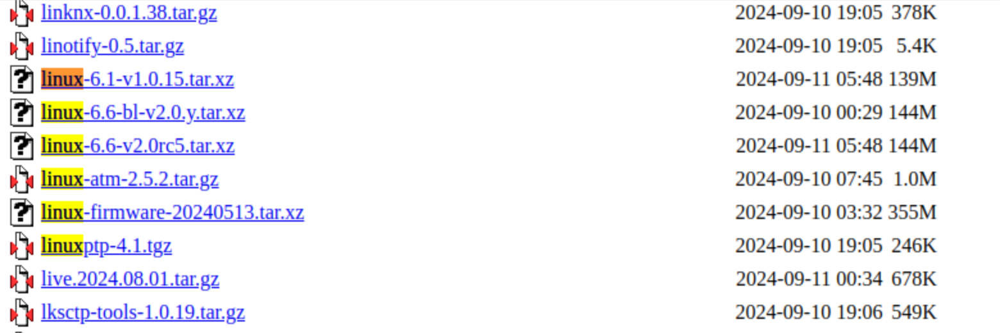

# Download and Build

The following document is based on Ubuntu 22.04.

## Environment Preparation

### Installing Dependencies

```sh
sudo apt install build-essential clang flex bison g++ gawk \
gcc-multilib g++-multilib gettext git libncurses-dev libssl-dev \
python3-distutils rsync unzip zlib1g-dev file wget jq device-tree-compiler 

```

## Download openwrt

The code repository has two branches:` bl-v1.0.y` and `bl-v2.0.y`, which correspond to `linux-6.1` and `linux-6.6`, respectively. The `bl-v2.0.y` branch will be primarily maintained going forward.

```sh
git clone https://gitee.com/bianbu-linux/openwrt.git -b bl-v2.0.y

```

## 拉取feeds

Use the following commands to run or update packages. Package updates will be downloaded from the OpenWRT official website, so ensure that your network is accessible. If there are any failures in downloading certain packages, you can re-run the commands:

```sh
cd openwrt
./scripts/feeds update -a 
./scripts/feeds install -f -p spacemit_openwrt_feeds -a
./scripts/feeds install -a
```

## Firmware Compilation

The optional parameter `V=s` in the compilation command provides detailed logs. Currently, there are two options for initiating the compilation process.

### SBC Solution

```sh
cp feeds/spacemit_openwrt_feeds/spacemit_k1_defconfig .config
make -j12 V=s
```

image would create at `bin/targets/spacemit/DEVICE_debX/*.zip`

### NAS Solution

```sh
cp feeds/spacemit_openwrt_feeds/spacemit_k1_nas_defconfig .config
make -j12 V=s
```

image would create at `bin/targets/spacemit/DEVICE_MUSE-N1/*.zip`

### Cleaning

* The full cleanup command will delete directories such as `bin, build_dir, staging_dir, feeds, dl`, as well as the `.config` file, returning the code repository to its original state.

```sh
make distclean
```

* The partial cleanup command will delete the build output directories such as `bin, build_dir, staging_dir`, but it will not remove the dl directory, the `.config` file, or other similar files.

```sh
make dirclean
```

## single package compilation

### build uboot

* compile

```sh
make package/boot/uboot-spacemit/compile V=s
```

* clean

```sh
make package/boot/uboot-spacemit/clean V=s
```

### build opensbi

* compile

```sh
make package/boot/opensbi-spacemit/compile V=s
```

* clean

```sh
make package/boot/opensbi-spacemit/clean V=s
```

### build linux

* compile

```sh
make target/linux/compile V=s
```

* clean

```sh
make target/linux/clean V=s
```

### build adb package

The compilation process for other packages is similar to the following method.

* compile

```sh
make package/utils/adb/compile V=s
```

* clean

```sh
make package/utils/adb/clean V=s
```

## Flashing

Firmware `*.zip`: Use the Titan Flasher tool to flash it to the onboard storage of the device. For instructions on using the flashing tool, see [flash tools](https://developer.spacemit.com/documentation?token=O6wlwlXcoiBZUikVNh2cczhin5d)

Firmware `*sdcard.img`: Can be written to the card using the `dd` command. The device can boot from the card once it is inserted and powered on.

## Supported Devices List

### SBC Solutions

* BPI-F3
* MUSE-Pi

### NAS Solutions

* MUSE-N1

## Soft Router Functionality

The soft router function is enabled by default on the board types in the supported devices list. When the system boots up, the WiFi AP mode is activated by default. Specifically:

For SBC solutions: The wired network card eth1 is the LAN port, and eth2 is the WAN port.

For NAS solutions: The 2.5G wired network card is the WAN port, and the other two Gigabit ports are LAN ports.

* Hotspot Name：openWRT-AP
* Hotspot Password：12345678
* WiFi Gateway：192.168.1.1

## FAQ

### Error with pthread_once during kernel compilation

When compiling OpenWRT based on Ubuntu 20.04, an error with "pthread_once" may occur. This can be resolved by modifying the `linux-*/certs/Makefile`.

```C
//openwrt/build_dir/target-riscv64_riscv64_musl_*/linux-spacemit_*/linux-6.1.15/certs/Makefile
# Change the last line to:
HOSTLDLIBS_extract-cert =  -lcrypto -pthread
```

### How to Update U-Boot/OpenSBI/Linux Versions

1.OpenWRT tracks the versions of the U-Boot/OpenSBI/Linux repositories hosted on `https://gitee.com/bianbu-linux`. OpenWRT periodically updates these repository versions.

2.If you need to manually update to the latest versions of U-Boot/OpenSBI/Linux, follow these steps:

* Confirm that the latest version tarball has been uploaded to`https://archive.spacemit.com/openwrt/dl/`，such as `linux-6.1-v1.0.15.tar.xz`



* Changing the Version Number in the Makefile

```diff
diff --git a/package/boot/opensbi-spacemit/Makefile b/package/boot/opensbi-spacemit/Makefile
index d4572af253..208d2fae6d 100644
--- a/package/boot/opensbi-spacemit/Makefile
+++ b/package/boot/opensbi-spacemit/Makefile
@@ -16,7 +16,7 @@ else
 PKG_NAME:=opensbi
 PKG_RELEASE:=1
 PKG_VERSION:=1.3
-PKG_SOURCE_VERSION:=1.0.5
+PKG_SOURCE_VERSION:=v1.0.15
 
 PKG_SOURCE:=$(PKG_NAME)-$(PKG_VERSION)-$(PKG_SOURCE_VERSION).tar.gz
 PKG_SOURCE_URL:=https://archive.spacemit.com/openwrt/dl/
diff --git a/package/boot/uboot-spacemit/Makefile b/package/boot/uboot-spacemit/Makefile
index 51e6e97fb7..c69173cfa8 100644
--- a/package/boot/uboot-spacemit/Makefile
+++ b/package/boot/uboot-spacemit/Makefile
@@ -18,7 +18,7 @@ else
 PKG_NAME:=uboot
 PKG_RELEASE:=1
 PKG_VERSION:=2022.10
-PKG_SOURCE_VERSION:=1.0.5
+PKG_SOURCE_VERSION:=v1.0.15
 
 PKG_SOURCE:=uboot-$(PKG_VERSION)-$(PKG_SOURCE_VERSION).tar.gz
 PKG_SOURCE_URL:=https://archive.spacemit.com/openwrt/dl/

diff --git a/target/linux/spacemit/Makefile b/target/linux/spacemit/Makefile
index ac230af366..148e5a79b8 100644
--- a/target/linux/spacemit/Makefile
+++ b/target/linux/spacemit/Makefile
@@ -20,7 +20,7 @@ CONFIG_EXTERNAL_KERNEL_TREE=$(TOPDIR)/../bsp-src/linux-6.1
 CONFIG_KERNEL_GIT_CLONE_URI=""
 else
 ## download tar.xz from url.
-LINUX_VERSION_CUSTOM:=linux-6.1-1.0.5
+LINUX_VERSION_CUSTOM:=linux-6.1-v1.0.15
 LINUX_SOURCE:=$(LINUX_VERSION_CUSTOM).tar.xz
 LINUX_KERNEL_HASH:=skip
 endif

```sh
* update kernel config

```sh
make kernel_menuconfig
```

* compile

There might be failures. If the compilation encounters errors, please correct them based on the error messages.

```sh
make -j12 V=s
```

### Change the Download Source to Spacemit

Spacemit maintains a set of pre-compiled packages that can be downloaded and installed by changing the source.

* Modify the software source address (based on device modifications):

`bl-v2.0.y` is a specific version tag. Please modify it according to your needs.
If using the SBC solution, change `DEVICE_MUSE-N1` to `DEVICE_debX`.

```sh
//vim /etc/opkg/distfeeds.conf

src/gz openwrt_base https://archive.spacemit.com/openwrt/releases/bl-v2.0.y/packages/riscv64_riscv64/base
src/gz openwrt_luci https://archive.spacemit.com/openwrt/releases/bl-v2.0.y/packages/riscv64_riscv64/luci
src/gz openwrt_packages https://archive.spacemit.com/openwrt/releases/bl-v2.0.y/packages/riscv64_riscv64/packages
src/gz openwrt_routing https://archive.spacemit.com/openwrt/releases/bl-v2.0.y/packages/riscv64_riscv64/routing
src/gz openwrt_telephony https://archive.spacemit.com/openwrt/releases/bl-v2.0.y/packages/riscv64_riscv64/telephony
src/gz openwrt_spacemit_packages https://archive.spacemit.com/openwrt/releases/bl-v2.0.y/targets/spacemit/DEVICE_MUSE-N1/packages

```
