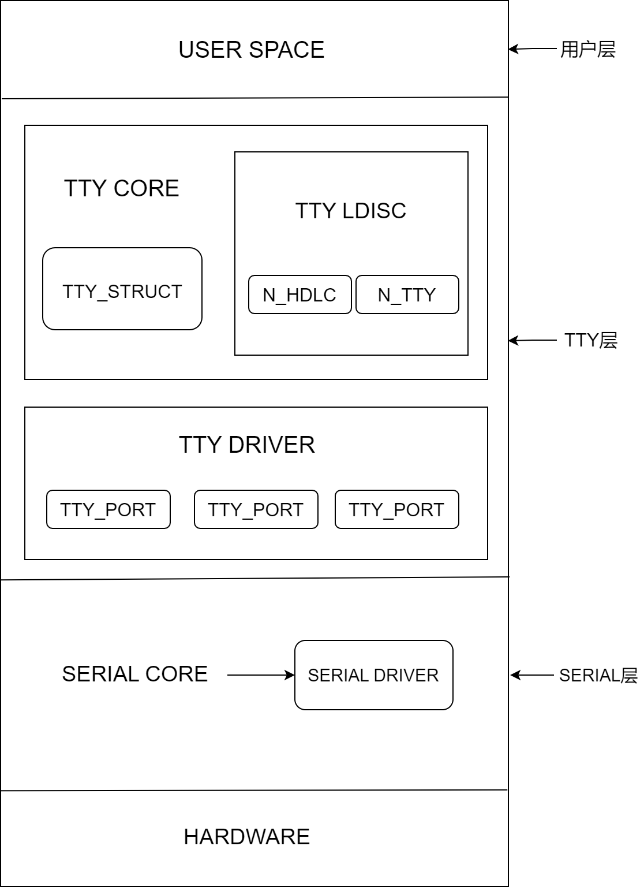

# UART

Introduction to UART configuration and debugging methods

## Module Introduction  

UART is a universal serial data bus used for asynchronous communication. This bus supports bidirectional communication and can achieve full-duplex transmission and reception.

### Function Introduction  


The kernel implements the console via uart, and some peripherals such as Bluetooth can communicate with the main controller via uart.
The k1 platform supports 9 configurable uart devices, which can be enabled and connected to peripherals as needed.

### Source Code Structure Introduction

The uart controller driver code is under the drivers/tty/serial directory:  

```  
drivers/tty/serial  
|--serial_core.c        # Kernel uart framework interface code
|--pxa_k1x.c        # k1 uart driver 
```  

## Key Features  

### Features

| Feature |
| :-----|
| Supports hardware flow control (uart2, uart3) |
| Supports DMA transfer mode |
| Supports interrupt mode |
| Supports RS485/RS232 serial protocols |
| Supports 64B RX/TX fifo |
| k1 platform supports 9 configurable uart devices |

### Performance Parameters

- The baud rate supports up to 3M

## Configuration Introduction

Mainly includes driver enable configuration and dts configuration

### CONFIG Configuration

CONFIG_SERIAL_PXA_SPACEMIT_K1X=y
This is the config configuration for the k1 uart driver

```
Symbol: SERIAL_PXA_SPACEMIT_K1X [=y]
Device Drivers
    -> Character devices
  -> Serial drivers
   -> PXA serial driver (<choice> [=y])
    -> Spacemit PXA driver suppor (SERIAL_PXA_SPACEMIT_K1X [=y])
```

### dts Configuration

Due to the similar usage and configuration methods of the 9 uart ports, uart2 is taken as an example here.

#### pinctrl

Refer to the configured uart node in arch/riscv/boot/dts/spacemit/k1-x_pinctrl.dtsi of the linux repository, as follows:

```dts
 pinctrl_uart2: uart2_grp {
  pinctrl-single,pins =<
   K1X_PADCONF(GPIO_21, MUX_MODE1, (EDGE_NONE | PULL_UP | PAD_1V8_DS2))    /* uart2_txd */
   K1X_PADCONF(GPIO_22, MUX_MODE1, (EDGE_NONE | PULL_UP | PAD_1V8_DS2))    /* uart2_rxd */
   K1X_PADCONF(GPIO_23, MUX_MODE1, (EDGE_NONE | PULL_UP | PAD_1V8_DS2))    /* uart2_cts_n */
   K1X_PADCONF(GPIO_24, MUX_MODE1, (EDGE_NONE | PULL_UP | PAD_1V8_DS2))    /* uart2_rts_n */
  >;
 };
```

#### dtsi Configuration Example

Configure the base address and clock reset resources of the uart controller in dtsi. Generally, no changes are required.

```dts
 uart2: uart@d4017100 {
  compatible = "spacemit,pxa-uart";
  reg = <0x0 0xd4017100 0x0 0x100>;
  interrupt-parent = <&intc>;
  interrupts = <44>;
  clocks = <&ccu CLK_UART2>, <&ccu CLK_SLOW_UART>;
  clock-names = "func", "gate";
  clk-fpga = <14750000>;
  resets = <&reset RESET_UART2>;
  /*dmas = <&pdma0 DMA_UART2_RX 1
    &pdma0 DMA_UART2_TX 1>;
  dma-names = "rx", "tx";*/
  power-domains = <&power K1X_PMU_BUS_PWR_DOMAIN>;
  clk,pm-runtime,no-sleep;
  cpuidle,pm-runtime,sleep;
  interconnects = <&dram_range4>;
  interconnect-names = "dma-mem";
  status = "disabled";
 }
```

#### dts Configuration Example

The complete dts configuration is as follows:

```dts
 &uart2 {
  pinctrl-names = "default";
  pinctrl-0 = <&pinctrl_uart2>;
  status = "okay";
 };
```

## Interface Introduction

### API Introduction

The k1 uart driver implements interfaces such as sending data, setting transmission mode, and configuring parity bits, and registers them into the uart framework.
Commonly used:

```
static void serial_pxa_start_tx(struct uart_port *port)
This interface enables uart transmission (interrupt mode)
static void serial_pxa_set_mctrl(struct uart_port *port, unsigned int mctrl)
This interface sets the uart transmission mode
static void serial_pxa_set_termios(struct uart_port *port, struct ktermios *termios,
                           const struct ktermios *old)
This interface sets attributes such as uart stop bits and parity bits
```

## Testing Introduction

UART testing can be completed by connecting the TX and RX signals of the device in a loopback mode.

```
Program implementation idea:
1. Taking uart3 as an example, after configuring and enabling uart3 in dts, first check whether /dev/ttyS2 exists. If it exists, uart3 is successfully loaded.
2. Open the ttyS3 node, set the baud rate, stop bits, parity bits, and other attributes.
3. Send data, the data is transferred from the TX FIFO to the RX FIFO through the external loopback. Read the information received by ttyS3, and compare it with the sent data. If they match, the uart function is considered正常.
```

## FAQ
