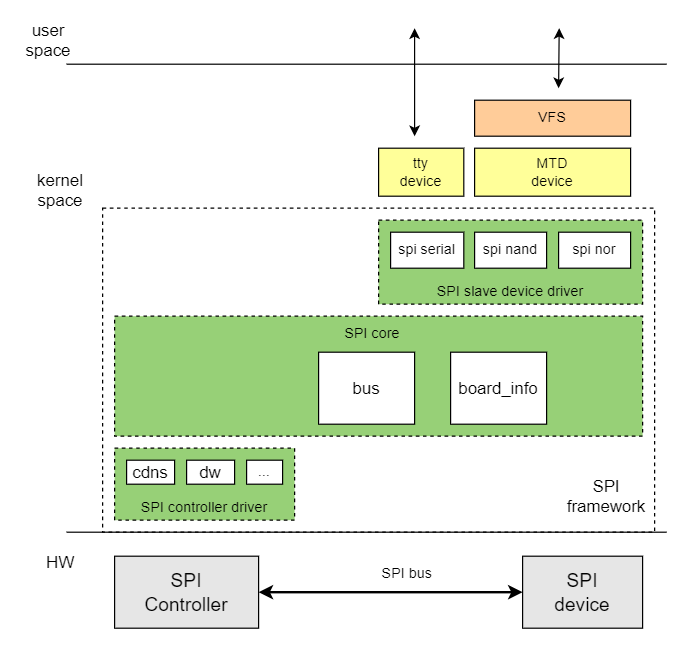

# QSPI

Introduction to the functions and usage of QSPI.

## Module Introduction

QSPI is a serial interface bus (spi) between soc and peripherals, supporting 4x mode. SPI has master and slave modes, usually connecting one master device and one or more slave devices. The master selects a slave device for communication and completes data exchange. The master provides the clock, and read/write operations are initiated by the master. The k1 qspi currently only supports master mode.

### Function Introduction

  

The Linux spi driver framework is divided into three parts: spi core, spi controller driver, and spi device driver.  
The main functions of spi core:

- spi bus and spi_master class registration  
- spi controller addition and removal  
- spi device addition and removal  
- spi device driver registration and deregistration  

spi controller driver:

- spi master controller driver, operates the spi master controller

spi device driver

- spi device driver

### Source Code Structure Introduction

The controller driver code is under the drivers/spi directory:  

```
|-- spi-k1x-qspi.c              # k1 qspi driver
```

## Key Features

### Features

| Feature | Description |
| :-----| :----|
| Communication protocol | Supports SSP/SPI/MicroWire/PSP protocols |
| Communication frequency | Maximum frequency 102MHz, minimum frequency 13.25MHz |
| Communication multiplier | x1/x2/x4 |
| Supported peripherals | Supports spi-nor and spi-nand |  

### Performance Parameters

#### Communication Frequency

The current qspi controller supports up to 102MHz. Supported communication frequency list:

| Max Frequency (MHz) | Divider (x)   | Actual Frequency |
| ------------------- | ------------- | --------------- |
| 409                 | 4, 5,6,7,8    | 409/x           |
| 307                 | 2,3,4,5,6,7,8 | 307/x           |
| 245                 | 3,4,5,6,7,8   | 245/x           |
| 223                 | 3,4,5,6,7,8   | 223/x           |
| 106                 | 2,3,4,5,6,7,8 | 106/x           |
| 495                 | 5,6,7,8       | 495/x           |
| 189                 | 2,3,4,5,6,7,8 | 189/x           |

#### Communication Multiplier

qspi communication multiplier supports x1/x2/x4.

Test method  
You can use an oscilloscope or logic analyzer to test the sck signal frequency

## Configuration Introduction

Mainly includes driver enable configuration and dts configuration

### CONFIG Configuration

CONFIG_SPI provides support for the SPI bus protocol. By default, this option is Y.
```
Device Drivers
        SPI support (SPI [=y])
```

CONFIG_SPI_MEM provides support for simplifying the operation of SPI interface memory devices. By default, this option is Y.
```
Device Drivers
        SPI support (SPI [=y])
                SPI memory extension (SPI_MEM [=y])
```

CONFIG_SPI_K1X_QSPI provides support for the K1 qspi controller driver. By default, this option is Y.
```
Device Drivers
        SPI support (SPI [=y])
                K1X QuadSPI Controller (SPI_K1X_QSPI [=y])

```

### dts Configuration

#### pinctrl

Check the schematic to find the pin group used by qspi. Refer to section 1.2.2 to determine the pin group used by qspi.

Assume qspi can directly use the pinctrl_qspi group defined in k1-x_pinctrl.dtsi.

#### spi Device Configuration

You need to confirm the spi device type, qspi and spi device communication frequency and multiplier.

##### Device Type

Confirm the type of spi device connected under qspi, whether it is spi-nor or spi-nand.

##### Communication Frequency

The maximum communication rate between the qspi controller and the spi device.  
See the frequency list in "Performance Parameters" ---> "Communication Frequency" for the supported communication frequencies of the current qspi controller.

##### Communication Multiplier

qspi communication multiplier supports x1/x2/x4.

##### spi Device dts

Take spi nor as an example, using the maximum communication frequency of 26.5MHz, and both transmission and reception use x4 communication.

The qspi controller defaults to a maximum communication frequency of 26.5MHz. If the maximum communication frequency is 26.5MHz, you do not need to configure "k1x,qspi-freq" in the dts.

```c
&qspi {
    k1x,qspi-freq = <26500000>;
 
    flash@0 {
                compatible = "jedec,spi-nor";
                reg = <0>;
                spi-max-frequency = <26500000>;
                spi-tx-bus-width = <4>;
                spi-rx-bus-width = <4>;
                m25p,fast-read;
                broken-flash-reset;
                status = "okay";
        };
};
```

#### dts Example

##### spi-nor

Based on the above information, qspi connects to spi-nor flash, with a maximum communication frequency of 26.5MHz, and uses x4 communication.

The dts configuration is as follows

```c
&qspi {
        pinctrl-names = "default";
        pinctrl-0 = <&pinctrl_qspi>;
        status = "okay";
        k1x,qspi-freq = <26500000>;

        flash@0 {
                compatible = "jedec,spi-nor";
                reg = <0>;
                spi-max-frequency = <26500000>;
                spi-tx-bus-width = <4>;
                spi-rx-bus-width = <4>;
                m25p,fast-read;
                broken-flash-reset;
                status = "okay";
        };
};
```

##### spi-nand

qspi connects to spi-nand flash, with a maximum communication frequency of 26.5MHz, and uses x4 communication.

The dts configuration can refer to spi-nor, just modify the flash device node.

```c
&qspi {
        pinctrl-names = "default";
        pinctrl-0 = <&pinctrl_qspi>;
        status = "okay";
        k1x,qspi-freq = <26500000>;

        spinand: spinand@0 {
                compatible = "spi-nand";
                spi-max-frequency = <26500000>;
                reg = <0>;
                spi-tx-bus-width = <4>;
                spi-rx-bus-width = <4>;
                status = "okay";
        };
};
```

## API Introduction

### API Introduction

Device driver registration and deregistration

```
int __spi_register_driver(struct module *owner, struct spi_driver *sdrv);  
void spi_unregister_driver(struct spi_driver *sdrv);
```

Data transfer API

- Initialize spi_message

```
void spi_message_init(struct spi_message *m);
```

- Add spi_transfer to the transfer list of spi_message

```
void spi_message_add_tail(struct spi_transfer *t, struct spi_message *m);
```

- Write data

```
int spi_write(struct spi_device *spi, const void *buf, size_t len);
```

- Read data

```
int spi_read(struct spi_device *spi, void *buf, size_t len);
```

- Synchronous transfer of spi_message

```
int spi_sync(struct spi_device *spi, struct spi_message *message);
```

## Debug Introduction

### sysfs

View system spi bus devices and driver information
/sys/bus/spi

```
|-- devices                 // Devices on the spi bus
|-- drivers                 // Device drivers registered on the spi bus
|-- drivers_autoprobe
|-- drivers_probe
`-- uevent
```

### debugfs

Used to view spi device information in the system
/sys/kernel/debug/spi-nor/spi4.0

```
|-- capabilities
`-- params
# cat capabilities
Supported read modes by the flash
 1S-1S-1S
  opcode        0x03
  mode cycles   0
  dummy cycles  0
 1S-1S-1S (fast read)
  opcode        0x0b
  mode cycles   0
  dummy cycles  8

Supported page program modes by the flash
 1S-1S-1S
  opcode        0x02
# cat params
name            w25q32
id              ef 40 16 00 00 00
size            4.00 MiB
write size      1
page size       256
address nbytes  3
flags           BROKEN_RESET | HAS_16BIT_SR

opcodes
 read           0x0b
  dummy cycles  8
 erase          0x20
 program        0x02
 8D extension   none

protocols
 read           1S-1S-1S
 write          1S-1S-1S
 register       1S-1S-1S

erase commands
 20 (4.00 KiB) [0]
 d8 (64.0 KiB) [1]
 c7 (4.00 MiB)

sector map
 region (in hex)   | erase mask | flags
 ------------------+------------+----------
 00000000-003fffff |     [01  ] |
```

## Test Introduction

### spi-nand/nor read/write speed test

Enable CONFIG_MTD_TESTS

```
Device Drivers
         Memory Technology Device (MTD) support (MTD [=y])
                MTD tests support (DANGEROUS) (MTD_TESTS [=m])   
```

Test command

```
insmod mtd_speedtest.ko dev=0   # 0 means the mtd device number of spi-nand/nor
```

## FAQ
