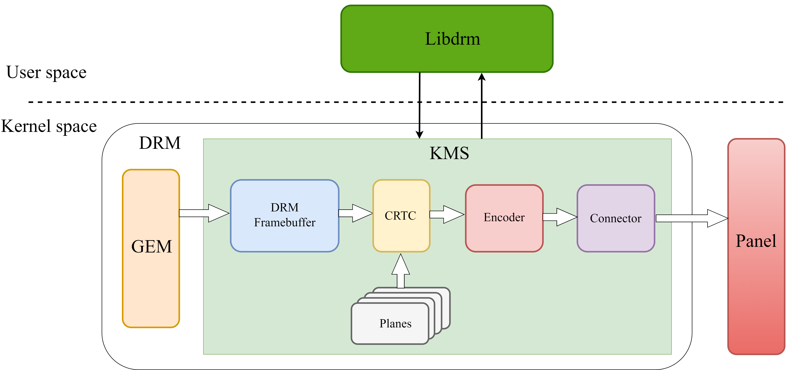
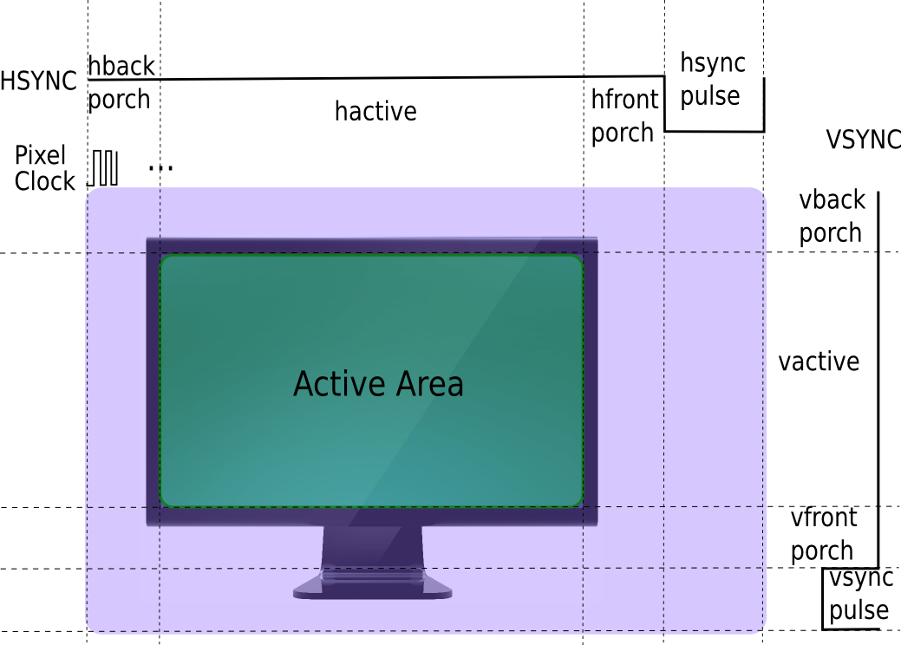

# Display

Introduction to the functions and usage of the spacemit platform Display module.

## Module Introduction

The spacemit platform Display module uses the DRM framework. DRM stands for Direct Rendering Manager, which is the mainstream display framework in Linux systems, adapted to the characteristics of current display hardware.

### Function Introduction



#### User Space Libdrm

The DRM framework provides a library in user space. Users or applications can call the library functions provided by libdrm in user space to access and manage display resources.

#### Kernel Space DRM driver

The DRM driver provides a series of IOCTL interfaces, which can be divided into two categories: Graphics Execution Manager (GEM) and Kernel Mode-Setting (KMS).

##### GEM

GEM mainly manages FrameBuffer, such as framebuffer allocation and release (Framebuffer managing), memory sharing objects, and memory synchronization mechanisms.

##### KMS

KMS is mainly responsible for managing display mode settings and image output. The KMS model consists of Framebuffer, CRTC, Planes, Encoder, and Connector.

###### Framebuffer

A memory area accessible by both the driver and the application layer, containing the display content of a single layer.

###### CRTC

Display controller, responsible for converting the image to be displayed into specific timing requirements at the hardware level, and also responsible for frame switching, power control, color adjustment, etc.

###### Plane

Layer. Each image has a Plane, and the attributes of the Plane control the display area, image flipping, color blending mode, etc. The image displayed by the CRTC is actually a combination of Framebuffer and Planes, resulting in multiple images being displayed together or separately.
There are three types of layers:

1) Primary plane, used to display background or image content;
2) Overlay plane, usually used for overlays, such as video layers;
3) Cursor plane, used to display the mouse cursor.

###### Encoder

Encoder, responsible for power management, video output format encapsulation, converting timing into signals required by the display, and displaying the image on different display devices, such as outputting video to HDMI interface, MIPI DSI interface, etc.

###### Connector

Connector, responsible for the connection of hardware display devices and obtaining screen parameters, such as HDMI, MIPI DSI, etc.

##### Panel

Display panel, responsible for converting the received image signal into a displayed image.

### Source Code Structure Introduction

spacemit platform DRM driver source code structure:

```
linux-6.6/drivers/gpu/drm$ tree spacemit
spacemit
|-- dphy
|   `-- spacemit_dphy_drv.c                     // mipi dsi dphy driver
|-- dpu                                         // dpu driver
|   |-- dpu_debug.c
|   |-- dpu_debug.h
|   |-- dpu_saturn.c
|   |-- dpu_saturn.h
|   |-- dpu_trace.h
|   |-- saturn_fbcmem.c
|   |-- saturn_fbcmem.h
|   `-- saturn_regs
|       |-- cmdlist.h
|       |-- cmps_x.h
|       |-- dma_top.h
|       |-- dpu_crg.h
|       |-- dpu_ctl.h
|       |-- dpu_intp.h
|       |-- dpu_top.h
|       |-- mmu.h
|       |-- outctrl_proc_x.h
|       |-- outctrl_top_x.h
|       |-- prepipe_layer_proc_x.h
|       |-- rdma_path_x.h
|       |-- reg_map.h
|       |-- scaler_x.h
|       `-- wb_top.h
|-- dsi                                         // mipi dsi driver
|   |-- spacemit_dptc_drv.c
|   |-- spacemit_dptc_drv.h
|   |-- spacemit_dsi_drv.c
|   `-- spacemit_dsi_hw.h
|-- Kconfig
|-- lt8911exb.c                                 // lt8911exb mipi dsi to eDP panel driver
|-- lt9711.c                                    // lt9711 mipi dsi to DP panel driver
|-- Makefile
|-- spacemit_bootloader.c
|-- spacemit_bootloader.h
|-- spacemit_cmdlist.c
|-- spacemit_cmdlist.h
|-- spacemit_dmmu.c
|-- spacemit_dmmu.h
|-- spacemit_dphy.c
|-- spacemit_dphy.h
|-- spacemit_dpu.c
|-- spacemit_dpu.h
|-- spacemit_dpu_reg.h
|-- spacemit_drm.c                             // DRM core driver
|-- spacemit_drm.h
|-- spacemit_dsi.c
|-- spacemit_dsi.h
|-- spacemit_gem.c                             // GEM driver
|-- spacemit_gem.h
|-- spacemit_hdmi.c                            // HDMI driver
|-- spacemit_hdmi.h
|-- spacemit_lib.c
|-- spacemit_lib.h
|-- spacemit_mipi_panel.c                      // panel driver
|-- spacemit_mipi_panel.h
|-- spacemit_planes.c
|-- spacemit_wb.c                              // write back driver
|-- spacemit_wb.h
`-- sysfs
    |-- sysfs_class.c                         
    |-- sysfs_display.h
    |-- sysfs_dphy.c
    |-- sysfs_dpu.c
    |-- sysfs_dsi.c
    `-- sysfs_mipi_panel.c
```

## Key Features

### Features

| Feature | Description |
| :-----| :----|
| Supports MIPI DSI | Supports MIPI DPHY v1.1, DPHY 4 lane, up to 1.2Gbps/lane |
| Supports HDMI | Supports HDMI 1.4a |

### Performance Parameters

| Screen Interface | Performance Specification |
| :-----| :----|
| MIPI DSI| 1920x1200@60FPS |
| HDMI | 1920x1080@60FPS |

**MIPI DSI screen frame rate test method:**

View Connectors:

```
# modetest -M spacemit -D /dev/dri/card1 -c
Connectors:
id      encoder status          name            size (mm)       modes   encoders
130     129     connected       DSI-1           142x228         1       129
  modes:
        index name refresh (Hz) hdisp hss hse htot vdisp vss vse vtot
  #0 1200x1920 60.05 1200 1250 1260 1300 1920 1940 1944 1960 153000 flags: phsync, pvsync; type: preferred, driver
  props:
        1 EDID:
                flags: immutable blob
                blobs:

                value:
        2 DPMS:
                flags: enum
                enums: On=0 Standby=1 Suspend=2 Off=3
                value: 0
        5 link-status:
                flags: enum
                enums: Good=0 Bad=1
                value: 0
        6 non-desktop:
                flags: immutable range
                values: 0 1
                value: 0
        4 TILE:
                flags: immutable blob
                blobs:

                value:
```

View Encoders:

```
# modetest -M spacemit -D /dev/dri/card1 -e
Encoders:
id      crtc    type    possible crtcs  possible clones
129     127     DSI     0x00000001      0x00000001
```

Test MIPI DSI screen frame rate:

```
# modetest -M spacemit -D /dev/dri/card1 -s 130@127:1200x1920 -v
setting mode 1200x1920-60.05Hz on connectors 130, crtc 127
freq: 60.55Hz
freq: 60.28Hz
freq: 60.28Hz
```

**HDMI screen frame rate test method:**

View Connectors:

```
# modetest -M spacemit -D /dev/dri/card2 -c
Connectors:
id      encoder status          name            size (mm)       modes   encoders
130     129     connected       HDMI-A-1        300x260         12      129
  modes:
        index name refresh (Hz) hdisp hss hse htot vdisp vss vse vtot
  #0 1920x1080 60.00 1920 2008 2052 2200 1080 1082 1087 1125 148500 flags: phsync, pvsync; type: preferred, driver
  #1 1920x1080 60.00 1920 2008 2052 2200 1080 1084 1089 1125 148500 flags: phsync, pvsync; type: driver
  #2 1920x1080 59.94 1920 2008 2052 2200 1080 1084 1089 1125 148352 flags: phsync, pvsync; type: driver
  #3 1600x900 60.00 1600 1624 1704 1800 900 901 904 1000 108000 flags: phsync, pvsync; type: driver
  #4 1280x1024 60.02 1280 1328 1440 1688 1024 1025 1028 1066 108000 flags: phsync, pvsync; type: driver
  #5 1152x864 59.97 1152 1216 1336 1520 864 865 868 895 81579 flags: nhsync, pvsync; type:
  #6 1280x720 60.00 1280 1390 1430 1650 720 725 730 750 74250 flags: phsync, pvsync; type: driver
  #7 1280x720 59.94 1280 1390 1430 1650 720 725 730 750 74176 flags: phsync, pvsync; type: driver
  #8 1024x768 60.00 1024 1048 1184 1344 768 771 777 806 65000 flags: nhsync, nvsync; type: driver
  #9 800x600 60.32 800 840 968 1056 600 601 605 628 40000 flags: phsync, pvsync; type: driver
  #10 640x480 60.00 640 656 752 800 480 490 492 525 25200 flags: nhsync, nvsync; type: driver
  #11 640x480 59.94 640 656 752 800 480 490 492 525 25175 flags: nhsync, nvsync; type: driver
  props:
        1 EDID:
                flags: immutable blob
                blobs:

                value:
                        00ffffffffffff005c73562501000000
                        321d0103801e1a783eee91a3544c9926
                        0f505421080071408180a9c0d1c00101
                        010101010101023a801871382d40582c
                        2500dd0c1100001e000000fc0048444d
                        490a2020202020202020000000ff000a
                        202020202020202020202020000000fd
                        003b3f1e5414000a20202020202001c5
                        02032ef1429004e200d5e305c0002309
                        7f078301000067030c0010001878e606
                        0501626200681a00000101304be6023a
                        801871382d40582c4500dd0c1100001e
                        00000000000000000000000000000000
                        00000000000000000000000000000000
                        00000000000000000000000000000000
                        00000000000000000000000000000000
                        000000000000000000000000000000f5
        2 DPMS:
                flags: enum
                enums: On=0 Standby=1 Suspend=2 Off=3
                value: 0
        5 link-status:
                flags: enum
                enums: Good=0 Bad=1
                value: 0
        6 non-desktop:
                flags: immutable range
                values: 0 1
                value: 0
        4 TILE:
                flags: immutable blob
                blobs:

                value:
```

View Encoders:

```
# modetest -M spacemit -D /dev/dri/card2 -e
Encoders:
id      crtc    type    possible crtcs  possible clones
129     127     TMDS    0x00000001      0x00000001
```

Test HDMI screen frame rate:

```
# modetest -M spacemit -D /dev/dri/card2 -s 130@127:1920x1080 -v
setting mode 1920x1080-60.00Hz on connectors 130, crtc 127
freq: 60.13Hz
freq: 60.00Hz
freq: 60.00Hz
```

## Configuration Introduction

Mainly includes Display driver enable configuration and dts configuration. The K1 chip supports 1 MIPI DSI hardware interface and 1 HDMI hardware interface.

### CONFIG Configuration

CONFIG_DRM_SPACEMIT: spacemit platform DRM driver configuration option. By default, this option is Y. The MIPI DSI driver or HDMI driver configuration depends on this option. You can configure the MIPI DSI driver and HDMI driver separately or both.

```
 Device Drivers  --->
  Graphics support  ---> 
   <*> DRM Support for Spacemit
   < >   MIPI Panel Support For Spacemit
   < >   HDMI Support For Spacemit
```

#### MIPI DSI CONFIG Configuration

CONFIG_SPACEMIT_MIPI_PANEL: spacemit platform MIPI DSI driver configuration option. Configure according to the specific scheme.

```
 Device Drivers  --->
  Graphics support  ---> 
   <*> DRM Support for Spacemit
   <*>   MIPI Panel Support For Spacemit
```

#### HDMI CONFIG Configuration

CONFIG_SPACEMIT_HDMI: spacemit platform HDMI driver configuration option. Configure according to the specific scheme.

```
 Device Drivers  --->
  Graphics support  ---> 
   <*> DRM Support for Spacemit
   <*>   HDMI Support For Spacemit
```

### dts Configuration

#### MIPI DSI

##### gpio

MIPI DSI panel gpio related configuration, including panel reset gpio configuration and panel power control gpio configuration.

Take k1-x_deb1 as an example:
gpio81 is configured as the panel reset pin, and gpio82 and gpio83 are configured as panel power control pins.

```c
// linux-6.6\arch\riscv\boot\dts\spacemit\k1-x_deb1.dts
&dsi2 {
        status = "okay";

        panel2: panel2@0 {
                status = "okay";
                compatible = "spacemit,mipi-panel2";
                reg = <0>;

                gpios-reset = <81>;     // panel reset gpio
                gpios-dc = <82 83>;     // panel power control gpio
        };
};
```

#### Power Configuration

MIPI DSI power configuration, including MIPI DSI 1.2v power control configuration.

Take k1-x_deb1 as an example:
Configure pmic ldo_5 as MIPI DSI 1.2v.

```c
// linux-6.6\arch\riscv\boot\dts\spacemit\k1-x_deb1.dts
&dpu_online2_dsi {
        status = "okay";

        dsi_1v2-supply = <&ldo_5>;      // Reference PMIC DLDO
        vin-supply-names = "dsi_1v2";   // Configure MIPI DSI 1.2v power
};
```

#### clock Configuration

MIPI DSI related clock configuration, including MIPI DSI DPU related clock configuration, reset configuration, and MIPI DSI DPHY related clock configuration. Pixel clock and bit clock are calculated from timing parameters. For calculation methods, see the display timing configuration section. The clock-frequency in display-timings is the pixel clock value, spacemit-dpu-bitclk in mipi dsi dpu and phy-bit-clock in mipi dsi dphy are the bit clock values. mipi dsi dpu escclk and mipi dsi dphy escclk are configured as 51200000 or 76800000 (for resolutions above 1920x1080, it is recommended to use 76800000). Other clock parameters use system defaults and do not need to be configured in the dts file.

Configure platform MIPI DSI DPU related clock and reset.

```c
// linux-6.6\arch\riscv\boot\dts\spacemit\k1-x-lcd.dtsi
&soc {
	display-subsystem-dsi {
		compatible = "spacemit,saturn-le";
		reg = <0 0xC0340000 0 0x2A000>;
		ports = <&dpu_online2_dsi>;
		interconnects = <&dram_range1>;
		interconnect-names = "dma-mem";
	};

	dpu_online2_dsi: port@c0340000 {
		compatible = "spacemit,dpu-online2";
		interrupt-parent = <&intc>;
		interrupts = <90>, <89>;
		interrupt-names = "ONLINE_IRQ", "OFFLINE_IRQ";
		clocks = <&ccu CLK_DPU_PXCLK>,          // mipi dsi dpu pxclk
			 <&ccu CLK_DPU_MCLK>,           // mipi dsi dpu mclk
			 <&ccu CLK_DPU_HCLK>,           // mipi dsi dpu hclk
			 <&ccu CLK_DPU_ESC>,            // mipi dsi dpu escclk
			 <&ccu CLK_DPU_BIT>;            // mipi dsi dpu bitclk
		clock-names = "pxclk", "mclk", "hclk", "escclk", "bitclk";
		resets = <&reset RESET_MIPI>,           // mipi dsi dpu dsi reset
			 <&reset RESET_LCD_MCLK>,       // mipi dsi dpu mclk reset
			 <&reset RESET_LCD>,            // mipi dsi dpu lcd reset
			 <&reset RESET_DSI_ESC>;        // mipi dsi dpu esc reset
		reset-names= "dsi_reset", "mclk_reset", "lcd_reset","esc_reset";
		power-domains = <&power K1X_PMU_LCD_PWR_DOMAIN>;
		pipeline-id = <ONLINE2>;
		ip = "spacemit-saturn";
		spacemit-dpu-min-mclk = <40960000>;
		type = <DSI>;
		clk,pm-runtime,no-sleep;
		status = "disabled";

		dpu_online2_dsi_out: endpoint@0 {
			remote-endpoint = <&dsi2_in>;
		};

		dpu_offline0_dsi_out: endpoint@1 {
			remote-endpoint = <&wb0_in>;
		};
	};
}
```

Configure scheme MIPI DSI DPU bitclk and escclk.
Take k1-x_deb1 as an example:

```c
// linux-6.6\arch\riscv\boot\dts\spacemit\k1-x_deb1.dts
&dpu_online2_dsi {
	status = "okay";

	spacemit-dpu-bitclk = <1000000000>;     // mipi dsi dpu bitclk
	spacemit-dpu-escclk = <76800000>;       // mipi dsi dpu escclk
};
```

Configure Panel model MIPI DSI DPHY bitclk and escclk.
Take MIPI DSI panel model lcd_gx09inx101_mipi as an example:

```c
// linux-6.6\arch\riscv\boot\dts\spacemit\lcd\lcd_gx09inx101_mipi.dtsi
/ { lcds: lcds {
	lcd_gx09inx101_mipi: lcd_gx09inx101_mipi {

		phy-bit-clock = <1000000000>;   // mipi dsi dphy bitclk
		phy-esc-clock = <76800000>;     // mipi dsi dphy escclk
	};

};};
```

#### display timing Configuration

Fill in the dpu timing configuration and mipi dsi timing configuration according to the timing information provided in the MIPI DSI panel specification. Pixel clock and bit clock are calculated from timing parameters.



##### display timing Parameter Description

**HFP:**
hfront porch (horizontal front porch): The blanking time before the horizontal sync signal, used for display device preparation.

**HBP:**
hback porch (horizontal back porch): The blanking time after the horizontal sync signal, used for display device reset and recovery.

**HSYNC:**
hsync pulse: The horizontal sync signal is used to synchronize the line scan of the display device, and the width of the horizontal sync pulse indicates the duration of the horizontal sync signal.

**VFP:**
vfront porch (vertical front porch): The blanking time before the vertical sync signal, used for display device preparation.

**VBP:**
vback porch (vertical back porch): The blanking time after the vertical sync signal, used for display device reset and recovery.

**VSYNC:**
vsync pulse: The vertical sync signal is used to synchronize the refresh rate of the display device, and the width of the vertical sync pulse indicates the duration of the vertical sync signal.

**HACTIVE:**
hactive (Horizontal display period): The number of pixels in the valid display area of a horizontal line.

**VACTIVE:**
vactive (Vertical display period): The number of lines in the valid display area of a vertical frame.

#### display timing Calculation Method

**FPS:**
Frame rate, the number of frames displayed per second.

**Bpp:**
Bit depth, the number of bits used per pixel.

**htotal:**
Total horizontal pixels.

Htotal = hactive + HFP + HSYNC pulse + HBP

**vtotal:**
Total vertical pixels

vtotal = vactive + VFP + VSYNC pulse + VBP

**Pixel clock:**
The frequency at which pixel data is transmitted or processed per second

Pixel clock calculation method:

pixel clock = htotal \* vtotal \* fps  = (hactive + hfp + hbp + hsync) \* (vactive + vfp + vbp + vsync) \* fps

**Bit clock:**
The data transmission clock per Lane during MIPI DSI data transmission

Bit clock calculation method:

bit clock =  ((htotal \* vtotal \* fps  \* bpp) / lane number) \* 1.1 =   (((hactive + hfp + hbp + hsync) \* (vactive + vfp + vbp + vsync) \* fps  \* bpp) / lane number) \* 1.1

**DSI clock:**
The actual clock signal of the MIPI DSI clock lane, using double-edge sampling, one clock can transmit two bits of data.

dsi clock = bit clock / 2

**Note:**
When calculating the MIPI DSI Bit clock on the spacemit platform, it needs to be multiplied by a factor of 1.1.

Take MIPI DSI panel model lcd_gx09inx101_mipi as an example:
Configure mipi dsi dpu timing and mipi dsi dphy timing.

pixel clock= (hactive + hfp + hbp + hsync) * (vactive + vfp + vbp + vsync) * fps = （1200 + 50 + 40 + 10）* (1920 + 20 + 16 + 4) * 60 = 152880000 HZ 

bit clock = (((hactive + hfp + hbp + hsync) * (vactive + vfp + vbp + vsync) * fps  * bpp) / lane number) * 1.1 = (（（1200 + 50 + 40 + 10）* (1920 + 20 + 16 + 4) * 60 * 24）/ 4) * 1.1 = 1009008000 HZ

Through display timing calculation, the pixel clock value is 152880000 HZ, the system can be configured as 153000000 HZ, the bit clock value is 1009008000 HZ, and the system can be configured as 1000000000 HZ.
In the dts file, clock-frequency is configured as 153000000, spacemit-dpu-bitclk and phy-bit-clock are configured as 1000000000.

```c
// linux-6.6\arch\riscv\boot\dts\spacemit\lcd\lcd_gx09inx101_mipi.dtsi
/ { lcds: lcds {
        lcd_gx09inx101_mipi: lcd_gx09inx101_mipi {

                // mipi dsi dphy timing configuration
                height = <1920>;              // mipi dsi dphy screen height
                width = <1200>;               // mipi dsi dphy screen width
                hfp = <50>;                   // mipi dsi dphy horizontal front porch
                hbp = <40>;                   // mipi dsi dphy horizontal back porch
                hsync = <10>;                 // mipi dsi dphy horizontal sync
                vfp = <20>;                   // mipi dsi dphy vertical front porch
                vbp = <16>;                   // mipi dsi dphy vertical back porch
                vsync = <4>;                  // mipi dsi dphy vertical sync
                fps = <60>;                   // mipi dsi dphy frame rate

                // mipi dsi dpu timing configuration
                display-timings {
                        timing0 {
                                clock-frequency = <153000000>;    // pixel clock
                                hactive = <1200>;                 // horizontal active pixels
                                hfront-porch = <50>;              // hfp
                                hback-porch = <40>;               // hbp
                                hsync-len = <10>;                 // hsync
                                vactive = <1920>;                 // vertical active pixels
                                vfront-porch = <20>;              // vfp
                                vback-porch = <16>;               // vbp
                                vsync-len = <4>;                  // vsync
                                vsync-active = <1>;               // vsync signal high level trigger
                                hsync-active = <1>;               // hsync signal high level trigger
                        };
                };
        };
};};
```

MIPI DSI panels that have completed functional debugging have their related dtsi files placed in the lcd directory.

```
linux-6.6/arch/riscv/boot/dts/spacemit/lcd$ tree
.
|-- lcd_gc9503v_mipi.dtsi
|-- lcd_gx09inx101_mipi.dtsi
|-- lcd_icnl9911c_mipi.dtsi
|-- lcd_icnl9951r_mipi.dtsi
|-- lcd_jd9365dah3_mipi.dtsi
|-- lcd_jd9365da_mipi_1280x800.dtsi
|-- lcd_lt8911_edp_1920x1080.dtsi
|-- lcd_lt8911_edp_1920x1200.dtsi
|-- lcd_lt9711_dp_1920x1080.dtsi
`-- lcd_orisetech_ota7290b_mipi.dtsi
```
##### Panel Configuration

To enable MIPI DSI Panel, you need to enable MIPI DSI dpu, MIPI DSI host, lcds, configure the panel and pwm backlight.

Take k1-x_deb1 as an example:
Enable dpu_online2_dsi, dsi2, lcds, configure the panel as model lcd_gx09inx101_mipi, and configure pwm backlight.

```c
// linux-6.6\arch\riscv\boot\dts\spacemit\k1-x_deb1.dts
&dpu_online2_dsi {
	status = "okay";                                       // Enable MIPI DSI dpu
};

&dsi2 {
	status = "okay";                                        // Enable MIPI DSI host
	panel2: panel2@0 {
		status = "okay";                                // Enable panel
		compatible = "spacemit,mipi-panel2";
		reg = <0>;

		gpios-reset = <81>;                             // Configure panel reset gpio
		gpios-dc = <82 83>;                             // Configure panel power control gpio
		id = <2>;                                       // Configure panel id
		delay-after-reset = <10>;                       // Configure panel reset delay time (unit: ms)
		force-attached = "lcd_gx09inx101_mipi";         // Configure panel model
	};

};

&lcds {
	status = "okay";                                          // Enable lcds
};

&pwm14 {
	status = "okay";                                        // Enable pwm
};

&pwm_bl {                                                       // Enable backlight
 	status = "okay";
};

```

##### dts Configuration Example

**MIPI DSI Panel Configuration Example:**

Take MIPI DSI panel model lcd_gx09inx101_mipi as an example:
Configure MIPI DSI panel.

```c
// linux-6.6\arch\riscv\boot\dts\spacemit\lcd\lcd_gx09inx101_mipi.dtsi
/ { lcds: lcds {
        lcd_gx09inx101_mipi: lcd_gx09inx101_mipi {
                dsi-work-mode = <1>;          // Configure mipi dsi work mode in panel: 1 DSI_MODE_VIDEO_BURST;
                dsi-lane-number = <4>;        // Configure mipi dsi lane number in panel
                dsi-color-format = "rgb888";  // Configure mipi dsi data format in panel
                width-mm = <142>;             // Configure screen active area in panel
                height-mm = <228>;            // Configure screen active area in panel
                use-dcs-write;                // Configure whether to use dcs command mode in panel

                // mipi dsi dphy timing configuration
                height = <1920>;              // Configure screen height in mipi dsi dphy
                width = <1200>;               // Configure screen width in mipi dsi dphy
                hfp = <50>;                   // Configure horizontal front porch in mipi dsi dphy
                hbp = <40>;                   // Configure horizontal back porch in mipi dsi dphy
                hsync = <10>;                 // Configure horizontal sync in mipi dsi dphy
                vfp = <20>;                   // Configure vertical front porch in mipi dsi dphy
                vbp = <16>;                   // Configure vertical back porch in mipi dsi dphy
                vsync = <4>;                  // Configure vertical sync in mipi dsi dphy
                fps = <60>;                   // Configure frame rate in mipi dsi dphy
                work-mode = <0>;              // Configure mipi dsi work mode in mipi dsi dphy: 0 SPACEMIT_DSI_MODE_VIDEO;
                rgb-mode = <3>;               // Configure mipi dsi data format in mipi dsi dphy: 3 DSI_INPUT_DATA_RGB_MODE_888;
                lane-number = <4>;            // Configure mipi dsi lane number in mipi dsi dphy
                phy-bit-clock = <1000000000>; // Configure mipi dsi dphy bit clock in mipi dsi dphy
                phy-esc-clock = <76800000>;   // Configure mipi dsi dphy esc clock in mipi dsi dphy
                split-enable = <0>;           // Configure mipi dsi split enable in mipi dsi dphy
                eotp-enable = <0>;            // Configure mipi dsi eotp enable in mipi dsi dphy
                burst-mode = <2>;             // Configure mipi dsi burst mode in mipi dsi dphy: 2 DSI_BURST_MODE_BURST;
                esd-check-enable = <0>;       // Configure esd check enable in panel

                // mipi dsi initialization command sequence
                /* DSI_CMD, DSI_MODE, timeout, len, cmd */
                initial-command = [
                        39 01 00 02 B0 01
                        39 01 00 02 C3 4F
                        39 01 00 02 C4 40
                        39 01 00 02 C5 40
                        39 01 00 02 C6 40
                        39 01 00 02 C7 40
                        39 01 00 02 C8 4D
                        39 01 00 02 C9 52
                        39 01 00 02 CA 51
                        39 01 00 02 CD 5D
                        39 01 00 02 CE 5B
                        39 01 00 02 CF 4B
                        39 01 00 02 D0 49
                        39 01 00 02 D1 47
                        39 01 00 02 D2 45
                        39 01 00 02 D3 41
                        39 01 00 02 D7 50
                        39 01 00 02 D8 40
                        39 01 00 02 D9 40
                        39 01 00 02 DA 40
                        39 01 00 02 DB 40
                        39 01 00 02 DC 4E
                        39 01 00 02 DD 52
                        39 01 00 02 DE 51
                        39 01 00 02 E1 5E
                        39 01 00 02 E2 5C
                        39 01 00 02 E3 4C
                        39 01 00 02 E4 4A
                        39 01 00 02 E5 48
                        39 01 00 02 E6 46
                        39 01 00 02 E7 42
                        39 01 00 02 B0 03
                        39 01 00 02 BE 03
                        39 01 00 02 CC 44
                        39 01 00 02 C8 07
                        39 01 00 02 C9 05
                        39 01 00 02 CA 42
                        39 01 00 02 CD 3E
                        39 01 00 02 CF 60
                        39 01 00 02 D2 04
                        39 01 00 02 D3 04
                        39 01 00 02 D4 01
                        39 01 00 02 D5 00
                        39 01 00 02 D6 03
                        39 01 00 02 D7 04
                        39 01 00 02 D9 01
                        39 01 00 02 DB 01
                        39 01 00 02 E4 F0
                        39 01 00 02 E5 0A
                        39 01 00 02 B0 00
                        39 01 00 02 BD 50
                        39 01 00 02 C2 08
                        39 01 00 02 C4 10
                        39 01 00 02 CC 00
                        // 39 01 00 02 B2 41 // BIST pattern
                        39 01 00 02 B0 02
                        39 01 00 02 C0 00
                        39 01 00 02 C1 0A
                        39 01 00 02 C2 20
                        39 01 00 02 C3 24
                        39 01 00 02 C4 23
                        39 01 00 02 C5 29
                        39 01 00 02 C6 23
                        39 01 00 02 C7 1C
                        39 01 00 02 C8 19
                        39 01 00 02 C9 17
                        39 01 00 02 CA 17
                        39 01 00 02 CB 18
                        39 01 00 02 CC 1A
                        39 01 00 02 CD 1E
                        39 01 00 02 CE 20
                        39 01 00 02 CF 23
                        39 01 00 02 D0 07
                        39 01 00 02 D1 00
                        39 01 00 02 D2 00
                        39 01 00 02 D3 0A
                        39 01 00 02 D4 13
                        39 01 00 02 D5 1C
                        39 01 00 02 D6 1A
                        39 01 00 02 D7 13
                        39 01 00 02 D8 17
                        39 01 00 02 D9 1C
                        39 01 00 02 DA 19
                        39 01 00 02 DB 17
                        39 01 00 02 DC 17
                        39 01 00 02 DD 18
                        39 01 00 02 DE 1A
                        39 01 00 02 DF 1E
                        39 01 00 02 E0 20
                        39 01 00 02 E1 23
                        39 01 00 02 E2 07
                        39 01 F0 01 11
                        39 01 28 01 29
                ];
                
                // mipi dsi sleep-in command sequence
                sleep-in-command = [
                        39 01 78 01 28
                        39 01 78 01 10
                ];
                
                // mipi dsi sleep-out command sequence
                sleep-out-command = [
                        39 01 96 01 11
                        39 01 32 01 29
                ];
                
                // mipi dsi read id command sequence
                read-id-command = [
                        37 01 00 01 05
                        14 01 00 05 fb fc fd fe ff
                ];

                // mipi dsi dpu timing configuration
                display-timings {
                        timing0 {
                                clock-frequency = <153000000>;    // pixel clock
                                hactive = <1200>;                 // horizontal active pixels
                                hfront-porch = <50>;              // hfp
                                hback-porch = <40>;               // hbp
                                hsync-len = <10>;                 // hsync
                                vactive = <1920>;                 // vertical active pixels
                                vfront-porch = <20>;              // vfp
                                vback-porch = <16>;               // vbp
                                vsync-len = <4>;                  // vsync
                                vsync-active = <1>;               // vsync signal high level trigger
                                hsync-active = <1>;               // hsync signal high level trigger
                        };
                };
        };
};};
```

**Scheme Configuration Example:**

Take k1-x_deb1 as an example:
Select MIPI DSI panel model lcd_gx09inx101_mipi and configure the scheme MIPI DSI panel.

```c
// linux-6.6\arch\riscv\boot\dts\spacemit\k1-x_deb1.dts
&dpu_online2_dsi {
	status = "okay";                                // Enable mipi dsi dpu
	memory-region = <&dpu_resv>;                    // Configure mipi dsi dpu reserved memory
	spacemit-dpu-bitclk = <1000000000>;             // mipi dsi dpu bitclk
	spacemit-dpu-escclk = <76800000>;               // mipi dsi dpu escclk
	dsi_1v2-supply = <&ldo_5>;                      // Reference PMIC DLDO
	vin-supply-names = "dsi_1v2";                   // Configure MIPI DSI 1.2v power

};

&dsi2 {
	status = "okay";                                // Enable mipi dsi host

	panel2: panel2@0 {
		status = "okay";                        // Enable panel
		compatible = "spacemit,mipi-panel2";
		reg = <0>;

		gpios-reset = <81>;                     // panel reset gpio
		gpios-dc = <82 83>;                     // panel power control gpio
		id = <2>;                               // Configure panel id
		delay-after-reset = <10>;               // Configure panel reset delay time (unit: ms)
		force-attached = "lcd_gx09inx101_mipi"; // Configure panel model
	};

};

&lcds {
	status = "okay";                                 // Enable lcds
};

&pwm14 {                                                // Configure pwm
	pinctrl-names = "default";
	pinctrl-0 = <&pinctrl_pwm14_1>;
	status = "okay";

};

&pwm_bl {                                               // Configure backlight
 	pwms = <&pwm14 2000>;
	brightness-levels = <
		0   40  40  40  40  40  40  40  40  40  40  40  40  40  40  40
		40  40  40  40  40  40  40  40  40  40  40  40  40  40  40  40
		40  40  40  40  40  40  40  40  40  41  42  43  44  45  46  47
		48  49  50  51  52  53  54  55  56  57  58  59  60  61  62  63
		64  65  66  67  68  69  70  71  72  73  74  75  76  77  78  79
		80  81  82  83  84  85  86  87  88  89  90  91  92  93  94  95
		96  97  98  99  100 101 102 103 104 105 106 107 108 109 110 111
		112 113 114 115 116 117 118 119 120 121 122 123 124 125 126 127
		128 129 130 131 132 133 134 135 136 137 138 139 140 141 142 143
		144 145 146 147 148 149 150 151 152 153 154 155 156 157 158 159
		160 161 162 163 164 165 166 167 168 169 170 171 172 173 174 175
		176 177 178 179 180 181 182 183 184 185 186 187 188 189 190 191
		192 193 194 195 196 197 198 199 200 201 202 203 204 205 206 207
		208 209 210 211 212 213 214 215 216 217 218 219 220 221 222 223
		224 225 226 227 228 229 230 231 232 233 234 235 236 237 238 239
		240 241 242 243 244 245 246 247 248 249 250 251 252 253 254 255
	>;
	default-brightness-level = <100>;

	status = "okay";
};

```

#### HDMI

#### pinctrl

Supports two sets of hdmi pinctrl: pinctrl_hdmi_0 and pinctrl_hdmi_1, only one group can be selected.

```c
// linux-6.6\arch\riscv\boot\dts\spacemit\k1-x_pinctrl.dtsi
pinctrl_hdmi_0: hdmi_0_grp {
        pinctrl-single,pins = <
                K1X_PADCONF(GPIO_86, MUX_MODE1, (EDGE_NONE | PULL_UP   | PAD_1V8_DS2)) /* hdmi_tx_hscl */
                K1X_PADCONF(GPIO_87, MUX_MODE1, (EDGE_NONE | PULL_UP   | PAD_1V8_DS2)) /* hdmi_tx_hsda */
                K1X_PADCONF(GPIO_88, MUX_MODE1, (EDGE_NONE | PULL_DOWN | PAD_1V8_DS2)) /* hdmi_tx_hcec */
                K1X_PADCONF(GPIO_89, MUX_MODE1, (EDGE_NONE | PULL_DOWN | PAD_1V8_DS2)) /* hdmi_tx_pdp */
        >;
};

pinctrl_hdmi_1: hdmi_1_grp {
        pinctrl-single,pins = <
                K1X_PADCONF(GPIO_59, MUX_MODE1, (EDGE_NONE | PULL_UP   | PAD_1V8_DS2)) /* hdmi_tx_hscl */
                K1X_PADCONF(GPIO_60, MUX_MODE1, (EDGE_NONE | PULL_UP   | PAD_1V8_DS2)) /* hdmi_tx_hsda */
                K1X_PADCONF(GPIO_61, MUX_MODE1, (EDGE_NONE | PULL_DOWN | PAD_1V8_DS2)) /* hdmi_tx_hcec */
                K1X_PADCONF(GPIO_62, MUX_MODE1, (EDGE_NONE | PULL_DOWN | PAD_1V8_DS2)) /* hdmi_tx_pdp */
        >;
};
```

#### clock Configuration

HDMI related clock configuration, including HDMI DPU related clock configuration, reset configuration, and HDMI related clock and reset configuration. Related clock parameters use system defaults and do not need to be configured in the dts file.

Configure platform HDMI DPU related clock and reset, and HDMI related clock and reset.

```c
// linux-6.6\arch\riscv\boot\dts\spacemit\k1-x-hdmi.dtsi
&soc {
        display-subsystem-hdmi {
                compatible = "spacemit,saturn-hdmi";
                reg = <0 0xc0440000 0 0x2A000>;
                ports = <&dpu_online2_hdmi>;
                interconnects = <&dram_range1>;
                interconnect-names = "dma-mem";
        };

        dpu_online2_hdmi: port@c0440000 {
                compatible = "spacemit,dpu-online2";
                interrupt-parent = <&intc>;
                interrupts = <139>, <138>;
                interrupt-names = "ONLINE_IRQ", "OFFLINE_IRQ";
                interconnects = <&dram_range1>;
                interconnect-names = "dma-mem";
                clocks = <&ccu CLK_HDMI>;                               // hdmi dpu hmclk
                clock-names = "hmclk";
                resets = <&reset RESET_HDMI>;                           // hdmi dpu reset
                reset-names= "hdmi_reset";
                power-domains = <&power K1X_PMU_HDMI_PWR_DOMAIN>;
                pipeline-id = <ONLINE2>;
                ip = "spacemit-saturn";
                type = <HDMI>;
                clk,pm-runtime,no-sleep;
                status = "disabled";

                dpu_online2_hdmi_out: endpoint@0 {
                        remote-endpoint = <&hdmi_in>;
                };
        };

        hdmi: hdmi@C0400500 {
                compatible = "spacemit,hdmi", "simple-bus";
                #address-cells = <2>;
                #size-cells = <2>;
                ranges;
                reg = <0 0xC0400500 0 0x200>;
                interrupt-parent = <&intc>;
                interrupts = <136>;
                clocks = <&ccu CLK_HDMI>;                               // hdmi hmclk
                clock-names = "hmclk";
                resets = <&reset RESET_HDMI>;                           // hdmi reset
                reset-names= "hdmi_reset";
                power-domains = <&power K1X_PMU_HDMI_PWR_DOMAIN>;
                clk,pm-runtime,no-sleep;
                status = "disabled";

                port {
                        #address-cells = <1>;
                        #size-cells = <0>;
                        hdmi_in: endpoint@0 {
                                reg = <0>;
                                remote-endpoint = <&dpu_online2_hdmi_out>;
                        };
                };
        };
};
```
#### dts Configuration Example

Take k1-x_deb1 as an example, HDMI is configured in the scheme.

```c
// linux-6.6\arch\riscv\boot\dts\spacemit\k1-x_deb1.dts
&dpu_online2_hdmi {
	memory-region = <&dpu_resv>;                    // Configure hdmi dpu reserved memory
	status = "okay";
};

&hdmi{
	pinctrl-names = "default";
	pinctrl-0 = <&pinctrl_hdmi_0>;
	status = "okay";
};
```

## API Introduction

### API Introduction

For an introduction to DRM driver APIs, please refer to the Linux kernel documentation [drm-kms](https://docs.kernel.org/gpu/drm-kms.html)

## Debug Introduction

### debugfs

**MIPI DSI debugfs node**

```
# cd /sys/kernel/debug/dri/1
# ls
DSI-1             crtc-0            gem_names         state
bridge_chains     dump              internal_clients
clients           framebuffer       name
```

**HDMI debugfs node**

```
# cd /sys/kernel/debug/dri/2
# ls
HDMI-A-1          crtc-0            gem_names         state
bridge_chains     dump              internal_clients
clients           framebuffer       name
```

**View framebuffer information**

```
# cd /sys/kernel/debug/dri/1
# cat framebuffer
framebuffer[132]:
        allocated by = weston
        refcount=2
        format=XR24 little-endian (0x34325258)
        modifier=0x0
        size=1200x1920
        layers:
                size[0]=1200x1920
                pitch[0]=4800
                offset[0]=0
                obj[0]:
                        name=0
                        refcount=3
                        start=0010119c
                        size=9216000
                        imported=no
framebuffer[135]:
        allocated by = weston
        refcount=1
        format=XR24 little-endian (0x34325258)
        modifier=0x0
        size=1200x1920
        layers:
                size[0]=1200x1920
                pitch[0]=4800
                offset[0]=0
                obj[0]:
                        name=0
                        refcount=3
                        start=001008d2
                        size=9216000
                        imported=no
framebuffer[134]:
        allocated by = weston
        refcount=1
        format=AR24 little-endian (0x34325241)
        modifier=0x0
        size=64x64
        layers:
                size[0]=64x64
                pitch[0]=256
                offset[0]=0
                obj[0]:
                        name=0
                        refcount=3
                        start=001008ce
                        size=16384
                        imported=no
framebuffer[133]:
        allocated by = weston
        refcount=1
        format=AR24 little-endian (0x34325241)
        modifier=0x0
        size=64x64
        layers:
                size[0]=64x64
                pitch[0]=256
                offset[0]=0
                obj[0]:
                        name=0
                        refcount=3
                        start=001008ca
                        size=16384
                        imported=no
framebuffer[131]:
        allocated by = [fbcon]
        refcount=1
        format=XR24 little-endian (0x34325258)
        modifier=0x0
        size=1200x1920
        layers:
                size[0]=1200x1920
                pitch[0]=4800
                offset[0]=0
                obj[0]:
                        name=0
                        refcount=2
                        start=00100000
                        size=9216000
                        imported=no
```

**Dump the currently displayed buffer**

```
# cd /sys/class/drm/card1-DSI-1
# cat dump
[  436.711209] [drm] framebuffer[135]
[  436.752130] [drm] dump framebuffer: /tmp/plane31_fb135_XR24_planes0_1200x1920.rgb
[  436.759796] [drm] framebuffer[134]
[  436.763663] [drm] dump framebuffer: /tmp/plane43_fb134_AR24_planes0_64x64.rgb
```

**View connection status**

```
# cd /sys/class/drm/card1-DSI-1
# cat status
connected
```

**View supported display modes**

```
# cd /sys/class/drm/card1-DSI-1
# cat modes
1200x1920
```

## Test Introduction

libdrm is a user-space library that provides APIs for interacting with DRM drivers. With libdrm, developers can communicate directly with DRM devices and perform various operations such as creating and managing framebuffers, setting display modes, handling layers, etc. modetest is a test tool that uses the libdrm library and is usually used to test and verify the functionality of DRM drivers.

Run DRM driver test cases using the modetest tool.


```
# modetest -M spacemit
Encoders:
id      crtc    type    possible crtcs  possible clones
129     127     DSI     0x00000001      0x00000001

Connectors:
id      encoder status          name            size (mm)       modes   encoders
130     129     connected       DSI-1           142x228         1       129
  modes:
        index name refresh (Hz) hdisp hss hse htot vdisp vss vse vtot
  #0 1200x1920 60.05 1200 1250 1260 1300 1920 1940 1944 1960 153000 flags: phsync, pvsync; type: preferred, driver
  props:
        1 EDID:
                flags: immutable blob
                blobs:

                value:
        2 DPMS:
                flags: enum
                enums: On=0 Standby=1 Suspend=2 Off=3
                value: 0
        5 link-status:
                flags: enum
                enums: Good=0 Bad=1
                value: 0
        6 non-desktop:
                flags: immutable range
                values: 0 1
                value: 0
        4 TILE:
                flags: immutable blob
                blobs:

                value:

CRTCs:
id      fb      pos     size
127     132     (0,0)   (1200x1920)
  #0 1200x1920 60.05 1200 1250 1260 1300 1920 1940 1944 1960 153000 flags: phsync, pvsync; type: preferred, driver
  props:
        24 VRR_ENABLED:
                flags: range
                values: 0 1
                value: 0

Planes:
id      crtc    fb      CRTC x,y        x,y     gamma size      possible crtcs
31      127     132     0,0             0,0     0               0x00000001
  formats: AB30 AR24 AB24 RA24 BA24 XR24 XB24 RX24 BX24 RG16 BG16 YU08 NV12 P010
  props:
        8 type:
                flags: immutable enum
                enums: Overlay=0 Primary=1 Cursor=2
                value: 1
        30 IN_FORMATS:
                flags: immutable blob
                blobs:

                value:
                        01000000000000000e00000018000000
                        01000000500000004142333041523234
                        41423234524132344241323458523234
                        58423234525832344258323452473136
                        42473136595530384e56313250303130
                        ff3f0000000000000000000000000000
                        0000000000000000
                in_formats blob decoded:
                         AB30:  LINEAR
                         AR24:  LINEAR
                         AB24:  LINEAR
                         RA24:  LINEAR
                         BA24:  LINEAR
                         XR24:  LINEAR
                         XB24:  LINEAR
                         RX24:  LINEAR
                         BX24:  LINEAR
                         RG16:  LINEAR
                         BG16:  LINEAR
                         YU08:  LINEAR
                         NV12:  LINEAR
                         P010:  LINEAR
        33 rotation:
                flags: bitmask
                values: rotate-0=0x1 rotate-90=0x2 rotate-180=0x4 rotate-270=0x8 reflect-x=0x10 reflect-y=0x20
                value: 1
        34 zpos:
                flags: immutable range
                values: 0 0
                value: 0
        35 alpha:
                flags: range
                values: 0 65535
                value: 65535
        36 pixel blend mode:
                flags: enum
                enums: None=2 Pre-multiplied=0 Coverage=1
                value: 0
        37 RDMA_ID:
                flags: range
                values: 0 18446744073709551615
                value: 0
        38 SOLID_COLOR:
                flags: range
                values: 0 18446744073709551615
                value: 0
        41 COLOR_ENCODING:
                flags: enum
                enums: ITU-R BT.601 YCbCr=0 ITU-R BT.709 YCbCr=1 ITU-R BT.2020 YCbCr=2
                value: 0
        42 COLOR_RANGE:
                flags: enum
                enums: YCbCr limited range=0 YCbCr full range=1
                value: 0
43      127     134     0,0             0,0     0               0x00000001
  formats: AB30 AR24 AB24 RA24 BA24 XR24 XB24 RX24 BX24 RG16 BG16 YU08 NV12 P010
  props:
        8 type:
                flags: immutable enum
                enums: Overlay=0 Primary=1 Cursor=2
                value: 2
        30 IN_FORMATS:
                flags: immutable blob
                blobs:

                value:
                        01000000000000000e00000018000000
                        01000000500000004142333041523234
                        41423234524132344241323458523234
                        58423234525832344258323452473136
                        42473136595530384e56313250303130
                        ff3f0000000000000000000000000000
                        0000000000000000
                in_formats blob decoded:
                         AB30:  LINEAR
                         AR24:  LINEAR
                         AB24:  LINEAR
                         RA24:  LINEAR
                         BA24:  LINEAR
                         XR24:  LINEAR
                         XB24:  LINEAR
                         RX24:  LINEAR
                         BX24:  LINEAR
                         RG16:  LINEAR
                         BG16:  LINEAR
                         YU08:  LINEAR
                         NV12:  LINEAR
                         P010:  LINEAR
        45 rotation:
                flags: bitmask
                values: rotate-0=0x1 rotate-90=0x2 rotate-180=0x4 rotate-270=0x8 reflect-x=0x10 reflect-y=0x20
                value: 1
        46 zpos:
                flags: immutable range
                values: 1 1
                value: 1
        47 alpha:
                flags: range
                values: 0 65535
                value: 65535
        48 pixel blend mode:
                flags: enum
                enums: None=2 Pre-multiplied=0 Coverage=1
                value: 0
        49 RDMA_ID:
                flags: range
                values: 0 18446744073709551615
                value: 1
        50 SOLID_COLOR:
                flags: range
                values: 0 18446744073709551615
                value: 0
        53 COLOR_ENCODING:
                flags: enum
                enums: ITU-R BT.601 YCbCr=0 ITU-R BT.709 YCbCr=1 ITU-R BT.2020 YCbCr=2
                value: 0
        54 COLOR_RANGE:
                flags: enum
                enums: YCbCr limited range=0 YCbCr full range=1
                value: 0
55      0       0       0,0             0,0     0               0x00000001
  formats: AB30 AR24 AB24 RA24 BA24 XR24 XB24 RX24 BX24 RG16 BG16 YU08 NV12 P010
  props:
        8 type:
                flags: immutable enum
                enums: Overlay=0 Primary=1 Cursor=2
                value: 0
        30 IN_FORMATS:
                flags: immutable blob
                blobs:

                value:
                        01000000000000000e00000018000000
                        01000000500000004142333041523234
                        41423234524132344241323458523234
                        58423234525832344258323452473136
                        42473136595530384e56313250303130
                        ff3f0000000000000000000000000000
                        0000000000000000
                in_formats blob decoded:
                         AB30:  LINEAR
                         AR24:  LINEAR
                         AB24:  LINEAR
                         RA24:  LINEAR
                         BA24:  LINEAR
                         XR24:  LINEAR
                         XB24:  LINEAR
                         RX24:  LINEAR
                         BX24:  LINEAR
                         RG16:  LINEAR
                         BG16:  LINEAR
                         YU08:  LINEAR
                         NV12:  LINEAR
                         P010:  LINEAR
        57 rotation:
                flags: bitmask
                values: rotate-0=0x1 rotate-90=0x2 rotate-180=0x4 rotate-270=0x8 reflect-x=0x10 reflect-y=0x20
                value: 1
        58 zpos:
                flags: immutable range
                values: 2 2
                value: 2
        59 alpha:
                flags: range
                values: 0 65535
                value: 65535
        60 pixel blend mode:
                flags: enum
                enums: None=2 Pre-multiplied=0 Coverage=1
                value: 0
        61 RDMA_ID:
                flags: range
                values: 0 18446744073709551615
                value: 4294967295
        62 SOLID_COLOR:
                flags: range
                values: 0 18446744073709551615
                value: 0
        65 COLOR_ENCODING:
                flags: enum
                enums: ITU-R BT.601 YCbCr=0 ITU-R BT.709 YCbCr=1 ITU-R BT.2020 YCbCr=2
                value: 0
        66 COLOR_RANGE:
                flags: enum
                enums: YCbCr limited range=0 YCbCr full range=1
                value: 0
67      0       0       0,0             0,0     0               0x00000001
  formats: AB30 AR24 AB24 RA24 BA24 XR24 XB24 RX24 BX24 RG16 BG16 YU08 NV12 P010
  props:
        8 type:
                flags: immutable enum
                enums: Overlay=0 Primary=1 Cursor=2
                value: 0
        30 IN_FORMATS:
                flags: immutable blob
                blobs:

                value:
                        01000000000000000e00000018000000
                        01000000500000004142333041523234
                        41423234524132344241323458523234
                        58423234525832344258323452473136
                        42473136595530384e56313250303130
                        ff3f0000000000000000000000000000
                        0000000000000000
                in_formats blob decoded:
                         AB30:  LINEAR
                         AR24:  LINEAR
                         AB24:  LINEAR
                         RA24:  LINEAR
                         BA24:  LINEAR
                         XR24:  LINEAR
                         XB24:  LINEAR
                         RX24:  LINEAR
                         BX24:  LINEAR
                         RG16:  LINEAR
                         BG16:  LINEAR
                         YU08:  LINEAR
                         NV12:  LINEAR
                         P010:  LINEAR
        69 rotation:
                flags: bitmask
                values: rotate-0=0x1 rotate-90=0x2 rotate-180=0x4 rotate-270=0x8 reflect-x=0x10 reflect-y=0x20
                value: 1
        70 zpos:
                flags: immutable range
                values: 3 3
                value: 3
        71 alpha:
                flags: range
                values: 0 65535
                value: 65535
        72 pixel blend mode:
                flags: enum
                enums: None=2 Pre-multiplied=0 Coverage=1
                value: 0
        73 RDMA_ID:
                flags: range
                values: 0 18446744073709551615
                value: 4294967295
        74 SOLID_COLOR:
                flags: range
                values: 0 18446744073709551615
                value: 0
        77 COLOR_ENCODING:
                flags: enum
                enums: ITU-R BT.601 YCbCr=0 ITU-R BT.709 YCbCr=1 ITU-R BT.2020 YCbCr=2
                value: 0
        78 COLOR_RANGE:
                flags: enum
                enums: YCbCr limited range=0 YCbCr full range=1
                value: 0
79      0       0       0,0             0,0     0               0x00000001
  formats: AB30 AR24 AB24 RA24 BA24 XR24 XB24 RX24 BX24 RG16 BG16 YU08 NV12 P010
  props:
        8 type:
                flags: immutable enum
                enums: Overlay=0 Primary=1 Cursor=2
                value: 0
        30 IN_FORMATS:
                flags: immutable blob
                blobs:

                value:
                        01000000000000000e00000018000000
                        01000000500000004142333041523234
                        41423234524132344241323458523234
                        58423234525832344258323452473136
                        42473136595530384e56313250303130
                        ff3f0000000000000000000000000000
                        0000000000000000
                in_formats blob decoded:
                         AB30:  LINEAR
                         AR24:  LINEAR
                         AB24:  LINEAR
                         RA24:  LINEAR
                         BA24:  LINEAR
                         XR24:  LINEAR
                         XB24:  LINEAR
                         RX24:  LINEAR
                         BX24:  LINEAR
                         RG16:  LINEAR
                         BG16:  LINEAR
                         YU08:  LINEAR
                         NV12:  LINEAR
                         P010:  LINEAR
        81 rotation:
                flags: bitmask
                values: rotate-0=0x1 rotate-90=0x2 rotate-180=0x4 rotate-270=0x8 reflect-x=0x10 reflect-y=0x20
                value: 1
        82 zpos:
                flags: immutable range
                values: 4 4
                value: 4
        83 alpha:
                flags: range
                values: 0 65535
                value: 65535
        84 pixel blend mode:
                flags: enum
                enums: None=2 Pre-multiplied=0 Coverage=1
                value: 0
        85 RDMA_ID:
                flags: range
                values: 0 18446744073709551615
                value: 4294967295
        86 SOLID_COLOR:
                flags: range
                values: 0 18446744073709551615
                value: 0
        89 COLOR_ENCODING:
                flags: enum
                enums: ITU-R BT.601 YCbCr=0 ITU-R BT.709 YCbCr=1 ITU-R BT.2020 YCbCr=2
                value: 0
        90 COLOR_RANGE:
                flags: enum
                enums: YCbCr limited range=0 YCbCr full range=1
                value: 0
91      0       0       0,0             0,0     0               0x00000001
  formats: AB30 AR24 AB24 RA24 BA24 XR24 XB24 RX24 BX24 RG16 BG16 YU08 NV12 P010
  props:
        8 type:
                flags: immutable enum
                enums: Overlay=0 Primary=1 Cursor=2
                value: 0
        30 IN_FORMATS:
                flags: immutable blob
                blobs:

                value:
                        01000000000000000e00000018000000
                        01000000500000004142333041523234
                        41423234524132344241323458523234
                        58423234525832344258323452473136
                        42473136595530384e56313250303130
                        ff3f0000000000000000000000000000
                        0000000000000000
                in_formats blob decoded:
                         AB30:  LINEAR
                         AR24:  LINEAR
                         AB24:  LINEAR
                         RA24:  LINEAR
                         BA24:  LINEAR
                         XR24:  LINEAR
                         XB24:  LINEAR
                         RX24:  LINEAR
                         BX24:  LINEAR
                         RG16:  LINEAR
                         BG16:  LINEAR
                         YU08:  LINEAR
                         NV12:  LINEAR
                         P010:  LINEAR
        93 rotation:
                flags: bitmask
                values: rotate-0=0x1 rotate-90=0x2 rotate-180=0x4 rotate-270=0x8 reflect-x=0x10 reflect-y=0x20
                value: 1
        94 zpos:
                flags: immutable range
                values: 5 5
                value: 5
        95 alpha:
                flags: range
                values: 0 65535
                value: 65535
        96 pixel blend mode:
                flags: enum
                enums: None=2 Pre-multiplied=0 Coverage=1
                value: 0
        97 RDMA_ID:
                flags: range
                values: 0 18446744073709551615
                value: 4294967295
        98 SOLID_COLOR:
                flags: range
                values: 0 18446744073709551615
                value: 0
        101 COLOR_ENCODING:
                flags: enum
                enums: ITU-R BT.601 YCbCr=0 ITU-R BT.709 YCbCr=1 ITU-R BT.2020 YCbCr=2
                value: 0
        102 COLOR_RANGE:
                flags: enum
                enums: YCbCr limited range=0 YCbCr full range=1
                value: 0
103     0       0       0,0             0,0     0               0x00000001
  formats: AB30 AR24 AB24 RA24 BA24 XR24 XB24 RX24 BX24 RG16 BG16 YU08 NV12 P010
  props:
        8 type:
                flags: immutable enum
                enums: Overlay=0 Primary=1 Cursor=2
                value: 0
        30 IN_FORMATS:
                flags: immutable blob
                blobs:

                value:
                        01000000000000000e00000018000000
                        01000000500000004142333041523234
                        41423234524132344241323458523234
                        58423234525832344258323452473136
                        42473136595530384e56313250303130
                        ff3f0000000000000000000000000000
                        0000000000000000
                in_formats blob decoded:
                         AB30:  LINEAR
                         AR24:  LINEAR
                         AB24:  LINEAR
                         RA24:  LINEAR
                         BA24:  LINEAR
                         XR24:  LINEAR
                         XB24:  LINEAR
                         RX24:  LINEAR
                         BX24:  LINEAR
                         RG16:  LINEAR
                         BG16:  LINEAR
                         YU08:  LINEAR
                         NV12:  LINEAR
                         P010:  LINEAR
        105 rotation:
                flags: bitmask
                values: rotate-0=0x1 rotate-90=0x2 rotate-180=0x4 rotate-270=0x8 reflect-x=0x10 reflect-y=0x20
                value: 1
        106 zpos:
                flags: immutable range
                values: 6 6
                value: 6
        107 alpha:
                flags: range
                values: 0 65535
                value: 65535
        108 pixel blend mode:
                flags: enum
                enums: None=2 Pre-multiplied=0 Coverage=1
                value: 0
        109 RDMA_ID:
                flags: range
                values: 0 18446744073709551615
                value: 4294967295
        110 SOLID_COLOR:
                flags: range
                values: 0 18446744073709551615
                value: 0
        113 COLOR_ENCODING:
                flags: enum
                enums: ITU-R BT.601 YCbCr=0 ITU-R BT.709 YCbCr=1 ITU-R BT.2020 YCbCr=2
                value: 0
        114 COLOR_RANGE:
                flags: enum
                enums: YCbCr limited range=0 YCbCr full range=1
                value: 0
115     0       0       0,0             0,0     0               0x00000001
  formats: AB30 AR24 AB24 RA24 BA24 XR24 XB24 RX24 BX24 RG16 BG16 YU08 NV12 P010
  props:
        8 type:
                flags: immutable enum
                enums: Overlay=0 Primary=1 Cursor=2
                value: 0
        30 IN_FORMATS:
                flags: immutable blob
                blobs:

                value:
                        01000000000000000e00000018000000
                        01000000500000004142333041523234
                        41423234524132344241323458523234
                        58423234525832344258323452473136
                        42473136595530384e56313250303130
                        ff3f0000000000000000000000000000
                        0000000000000000
                in_formats blob decoded:
                         AB30:  LINEAR
                         AR24:  LINEAR
                         AB24:  LINEAR
                         RA24:  LINEAR
                         BA24:  LINEAR
                         XR24:  LINEAR
                         XB24:  LINEAR
                         RX24:  LINEAR
                         BX24:  LINEAR
                         RG16:  LINEAR
                         BG16:  LINEAR
                         YU08:  LINEAR
                         NV12:  LINEAR
                         P010:  LINEAR
        117 rotation:
                flags: bitmask
                values: rotate-0=0x1 rotate-90=0x2 rotate-180=0x4 rotate-270=0x8 reflect-x=0x10 reflect-y=0x20
                value: 1
        118 zpos:
                flags: immutable range
                values: 7 7
                value: 7
        119 alpha:
                flags: range
                values: 0 65535
                value: 65535
        120 pixel blend mode:
                flags: enum
                enums: None=2 Pre-multiplied=0 Coverage=1
                value: 0
        121 RDMA_ID:
                flags: range
                values: 0 18446744073709551615
                value: 4294967295
        122 SOLID_COLOR:
                flags: range
                values: 0 18446744073709551615
                value: 0
        125 COLOR_ENCODING:
                flags: enum
                enums: ITU-R BT.601 YCbCr=0 ITU-R BT.709 YCbCr=1 ITU-R BT.2020 YCbCr=2
                value: 0
        126 COLOR_RANGE:
                flags: enum
                enums: YCbCr limited range=0 YCbCr full range=1
                value: 0

Frame buffers:
id      size    pitch

# modetest  -M  spacemit -s 130@127:1200x1920
setting mode 1200x1920-60.05Hz on connectors 130, crtc 127
```

## FAQ