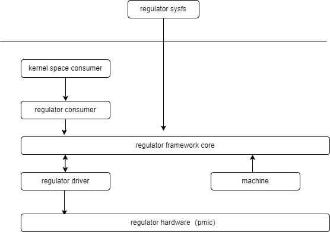

# PMIC

Introduction to the functions and usage of regulator.

## Module Introduction

Regulator literally means "regulator". Devices that can output voltage and current can use this subsystem. Our P1 chip is a PMIC that includes this function. For the Linux kernel, regulator is a software framework designed to provide standard kernel interfaces to control voltage and current.

### Function Introduction

  

1. regulator consumer: Devices powered by the regulator, they consume the power provided by the regulator
2. regulator framework: Provides standard kernel interfaces to control system voltage/current regulators, and provides mechanisms for switching, voltage/current setting, etc.
3. regulator driver: The driver code for the regulator, responsible for registering the device with the framework and communicating with the underlying hardware
4. machine: Mainly configures the properties of each regulator

### Source Code Structure Introduction

```
drivers/regulator/
├── core.c
├── devres.c
├── dummy.c
├── dummy.h
├── fixed.c
├── fixed-helper.c
├── gpio-regulator.c
├── helpers.c
├── internal.h
├── irq_helpers.c
├── Kconfig
├── Makefile
├── of_regulator.c
├── spacemit-regulator.c
```

## Key Features

### Features

| Feature | Description |
| :-----| :----|
| Supports 6 DCDC  | Supports dynamic voltage adjustment/enable/disable |
| Supports 5 ALDO  | Supports voltage adjustment/enable/disable |
| Supports 7 DLDO  | Supports voltage adjustment/enable/disable |

## Configuration Introduction

Mainly includes driver enable configuration and dts configuration

### CONFIG Configuration

```
CONFIG_REGULATOR_SPACEMIT:

 This driver provides support for the voltage regulators on the
 spacemit pmic.

 Symbol: REGULATOR_SPACEMIT [=y]
 Type  : tristate
 Defined at drivers/regulator/Kconfig:1666
  Prompt: Spacemit regulator support
  Depends on: REGULATOR [=y] && MFD_SPACEMIT_PMIC [=y]
  Location: 
   -> Device Drivers
    -> Voltage and Current Regulator Support (REGULATOR [=y])
     -> Spacemit regulator support (REGULATOR_SPACEMIT [=y])
  Selects: REGULATOR_FIXED_VOLTAGE [=y] 
```

### dts Configuration

```
&i2c8 {
        pinctrl-names = "default";
        pinctrl-0 = <&pinctrl_i2c8>;
        status = "okay";

        spm8821@41 {
                compatible = "spacemit,spm8821";
                reg = <0x41>;
                interrupt-parent = <&intc>;
                interrupts = <64>;
                status = "okay";

                vcc_sys-supply = <&vcc4v0_baseboard>;
                dcdc5-supply = <&dcdc_5>;

                regulators {
                        compatible = "pmic,regulator,spm8821";

                        /* buck */
                        dcdc_1: DCDC_REG1 {
                                regulator-name = "dcdc1";
                                regulator-min-microvolt = <500000>;
                                regulator-max-microvolt = <3450000>;
                                regulator-always-on;
                        };

                        dcdc_2: DCDC_REG2 {
                                regulator-name = "dcdc2";
                                regulator-min-microvolt = <500000>;
                                regulator-max-microvolt = <3450000>;
                                regulator-always-on;
                        };

                        dcdc_3: DCDC_REG3 {
                                regulator-name = "dcdc3";
                                regulator-min-microvolt = <500000>;
                                regulator-max-microvolt = <1800000>;
                                regulator-always-on;
                        };

                        dcdc_4: DCDC_REG4 {
                                regulator-name = "dcdc4";
                                regulator-min-microvolt = <500000>;
                                regulator-max-microvolt = <3300000>;
                                regulator-always-on;
                        };

                        dcdc_5: DCDC_REG5 {
                                regulator-name = "dcdc5";
                                regulator-min-microvolt = <500000>;
                                regulator-max-microvolt = <3450000>;
                                regulator-always-on;
                        };

                        dcdc_6: DCDC_REG6 {
                                regulator-name = "dcdc6";
                                regulator-min-microvolt = <500000>;
                                regulator-max-microvolt = <3450000>;
                                regulator-always-on;
                        };

                        /* aldo */
                        ldo_1: LDO_REG1 {
                                regulator-name = "ldo1";
                                regulator-min-microvolt = <500000>;
                                regulator-max-microvolt = <3400000>;
                                regulator-boot-on;
                        };

                        ldo_2: LDO_REG2 {
                                regulator-name = "ldo2";
                                regulator-min-microvolt = <500000>;
                                regulator-max-microvolt = <3400000>;
                        };

                        ldo_3: LDO_REG3 {
                                regulator-name = "ldo3";
                                regulator-min-microvolt = <500000>;
                                regulator-max-microvolt = <3400000>;
                        };

                        ldo_4: LDO_REG4 {
                                regulator-name = "ldo4";
                                regulator-min-microvolt = <500000>;
                                regulator-max-microvolt = <3400000>;
                        };

                        /* dldo */
                        ldo_5: LDO_REG5 {
                                regulator-name = "ldo5";
                                regulator-min-microvolt = <500000>;
                                regulator-max-microvolt = <3400000>;
                                regulator-boot-on;
                        };

                        ldo_6: LDO_REG6 {
                                regulator-name = "ldo6";
                                regulator-min-microvolt = <500000>;
                                regulator-max-microvolt = <3400000>;
                        };

                        ldo_7: LDO_REG7 {
                                regulator-name = "ldo7";
                                regulator-min-microvolt = <500000>;
                                regulator-max-microvolt = <3400000>;
                        };

                        ldo_8: LDO_REG8 {
                                regulator-name = "ldo8";
                                regulator-min-microvolt = <500000>;
                                regulator-max-microvolt = <3400000>;
                                regulator-always-on;
                        };

                        ldo_9: LDO_REG9 {
                                regulator-name = "ldo9";
                                regulator-min-microvolt = <500000>;
                                regulator-max-microvolt = <3400000>;
                        };

                        ldo_10: LDO_REG10 {
                                regulator-name = "ldo10";
                                regulator-min-microvolt = <500000>;
                                regulator-max-microvolt = <3400000>;
                                regulator-always-on;
                        };

                        ldo_11: LDO_REG11 {
                                regulator-name = "ldo11";
                                regulator-min-microvolt = <500000>;
                                regulator-max-microvolt = <3400000>;
                        };

                        sw_1: SWITCH_REG1 {
                                regulator-name = "switch1";
                        };
                };
        };
};
```

## API Description

### API Introduction

```
Please refer to the kernel documentation:
Documentation/power/regulator/consumer.rst
Documentation/power/regulator/machine.rst
Documentation/power/regulator/regulator.rst

```

### demo Example

```
1. Configure dts and reference the regulator you want to use
    &cpu_0 {
        clst0-supply = <&dcdc_1>;
        vin-supply-names = "clst0";
    };

Get the corresponding handle in the code:
        const char *strings;
        struct regulator *regulator;
        err = of_property_read_string_array(cpu_dev->of_node, "vin-supply-names",
                        &strings, 1);
        regulator = devm_regulator_get(cpu_dev, strings);  --> The struct device * passed in must have a corresponding entity
        
 Enable the corresponding regulator in the code:
         regulator_enable(regulator);
 
 Set the voltage of the corresponding regulator in the code:
         regulator_set_voltage(regulator, 95000000, 95000000);
```

## Debug Introduction

## FAQ

## Appendix

### SPL/UBOOT Usage

```
uboot-2022.10$ vi arch/riscv/dts/k1-x_spm8821.dtsi

&i2c8 {
        clock-frequency = <100000>;
        u-boot,dm-spl;
        status = "okay";

        spm8821: pmic@41 {
                compatible = "spacemit,spm8821";
                reg = <0x41>;
                bus = <8>;
                u-boot,dm-spl;

                regulators {
                        /* buck */
                        dcdc_6: DCDC_REG1 {
                                regulator-name = "dcdc1";
                                regulator-min-microvolt = <500000>;
                                regulator-max-microvolt = <3450000>;
                                regulator-init-microvolt = <950000>;
                                regulator-boot-on;
                                u-boot,dm-spl;
                                regulator-state-mem {
                                        regulator-off-in-suspend;
                                };
                        };

                        dcdc_7: DCDC_REG2 {
                                regulator-name = "dcdc2";
                                regulator-min-microvolt = <500000>;
                                regulator-max-microvolt = <3450000>;
                        };

                        dcdc_8: DCDC_REG3 {
                                regulator-name = "dcdc3";
                                regulator-min-microvolt = <500000>;
                                regulator-max-microvolt = <3450000>;
                                regulator-boot-on;
                                u-boot,dm-spl;
                        };

                        dcdc_9: DCDC_REG4 {
                                regulator-name = "dcdc4";
                                regulator-min-microvolt = <500000>;
                                regulator-max-microvolt = <3450000>;
                        };

                        dcdc_10: DCDC_REG5 {
                                regulator-name = "dcdc5";
                                regulator-min-microvolt = <500000>;
                                regulator-max-microvolt = <3450000>;
                        };

                        dcdc_11: DCDC_REG6 {
                                regulator-name = "dcdc6";
                                regulator-min-microvolt = <500000>;
                                regulator-max-microvolt = <3450000>;
                        };

                        /* aldo */
                        ldo_23: LDO_REG1 {
                                regulator-name = "ldo1";
                                regulator-min-microvolt = <500000>;
                                regulator-max-microvolt = <3400000>;
                                regulator-init-microvolt = <3300000>;
                                regulator-boot-on;
                                u-boot,dm-spl;
                        };

                        ldo_24: LDO_REG2 {
                                regulator-name = "ldo2";
                                regulator-min-microvolt = <500000>;
                                regulator-max-microvolt = <3400000>;
                        };

                        ldo_25: LDO_REG3 {
                                regulator-name = "ldo3";
                                regulator-min-microvolt = <500000>;
                                regulator-max-microvolt = <3400000>;
                        };

                        ldo_26: LDO_REG4 {
                                regulator-name = "ldo4";
                                regulator-min-microvolt = <500000>;
                                regulator-max-microvolt = <3400000>;
                        };

                        /* dldo */
                        ldo_27: LDO_REG5 {
                                regulator-name = "ldo5";
                                regulator-min-microvolt = <500000>;
                                regulator-max-microvolt = <3400000>;
                        };

                        ldo_28: LDO_REG6 {
                                regulator-name = "ldo6";
                                regulator-min-microvolt = <500000>;
                                regulator-max-microvolt = <3400000>;
                        };

                        ldo_29: LDO_REG7 {
                                regulator-name = "ldo7";
                                regulator-min-microvolt = <500000>;
                                regulator-max-microvolt = <3400000>;
                        };

                        ldo_30: LDO_REG8 {
                                regulator-name = "ldo8";
                                regulator-min-microvolt = <500000>;
                                regulator-max-microvolt = <3400000>;
                        };

                        ldo_31: LDO_REG9 {
                                regulator-name = "ldo9";
                                regulator-min-microvolt = <500000>;
                                regulator-max-microvolt = <3400000>;
                        };

                        ldo_32: LDO_REG10 {
                                regulator-name = "ldo10";
                                regulator-min-microvolt = <500000>;
                                regulator-max-microvolt = <3400000>;
                        };

                        ldo_33: LDO_REG11 {
                                regulator-name = "ldo11";
                                regulator-min-microvolt = <500000>;
                                regulator-max-microvolt = <3400000>;
                        };

                        sw_2: SWITCH_REG1 {
                                regulator-name = "switch1";
                        };
                };
        };
};
```

#### SPL stage power on and voltage setting method

```c
                        dcdc_6: DCDC_REG1 {
                                regulator-name = "dcdc1";
                                regulator-min-microvolt = <500000>;
                                regulator-max-microvolt = <3450000>;
                                regulator-init-microvolt = <950000>; ---> Add this field to automatically set the power voltage to 0.95v
                                regulator-boot-on; ---> Add this field to automatically turn on the power in the SPL stage
                                u-boot,dm-spl;   ---> This field must be added for SPL to recognize this dts node
                                regulator-state-mem {
                                        regulator-off-in-suspend;
                                };
                        };
```

#### UBOOT stage power on and voltage setting method

There are two ways to set or enable power in the uboot stage. The first is to configure directly in dts

```c
                        dcdc_6: DCDC_REG1 { --> The name parameter passed to regulator_get_by_devname
                                regulator-name = "dcdc1";
                                regulator-min-microvolt = <500000>;
                                regulator-max-microvolt = <3450000>;
                                regulator-init-microvolt = <950000>; ---> Add this field to automatically set the power voltage to 0.95v
                                regulator-boot-on; ---> Add this field to automatically turn on the power in the UBOOT stage
                                regulator-state-mem {
                                        regulator-off-in-suspend;
                                };
                        };
```

Another way is to set it directly in the code:

```c
1. First get the handle of the regulator you want to set or enable
    struct udevice *rdev = NULL;
    char *regulator_name = "DCDC_REG1"  --> This field is the name of the dts node in dts
    ret = regulator_get_by_devname(regulator_name, &rdev);
    
2. Enable a power rail
    regulator_set_enable(&rdev, true);
    
3. Set the voltage of a power rail
    regulator_set_value(&rdev, 1800000);
```
