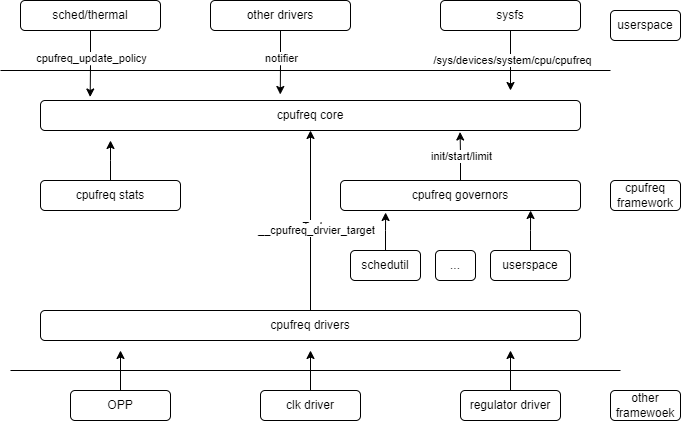

# CPUFREQ

Introduction to the functions and usage of CPUFREQ.

## Module Introduction

The CPUFREQ subsystem is responsible for adjusting the CPU frequency and voltage at runtime, aiming to minimize CPU power consumption while meeting performance requirements.

### Function Introduction



1. cpufreq core is the core module of the cpufreq framework, mainly implementing three types of functions:  
    1.1 Abstracts the common logic interface for frequency and voltage scaling  
    1.2 Provides a unified interface to user space via sysfs, and notifies other drivers of frequency changes via notifier
    1.3 Provides a driver framework for CPU frequency and voltage control  
2. cpufreq governor is responsible for various frequency and voltage scaling policies  
3. cpufreq driver implements platform-specific frequency and voltage scaling mechanisms
4. cpufreq stats is responsible for frequency information and statistics of each frequency point, providing cpufreq-related statistics for each CPU

### Source Code Structure Introduction

The CPU frequency scaling platform driver directory is as follows:

```
drivers/cpufreq/
├── cpufreq.c
├── cpufreq_conservative.c
├── cpufreq-dt.c
├── cpufreq-dt.h
├── cpufreq-dt-platdev.c
├── cpufreq_governor_attr_set.c
├── cpufreq_governor.c
├── cpufreq_governor.h
├── cpufreq_ondemand.c
├── cpufreq_ondemand.h
├── cpufreq_performance.c
├── cpufreq_powersave.c
├── cpufreq_stats.c
├── cpufreq_userspace.c
├── freq_table.c
├── spacemit-cpufreq.c --> platform driver  
```

## Key Features

### Features

| Feature | Description |
| :-----| :----|
| Supports dynamic frequency and voltage scaling |
| Supports frequency boost up to 1.8GHz |

### Performance Parameters

| Supported Frequency Levels | Corresponding Voltage |  
| :-----| :----:|  
| 1600000000HZ | 1.05V |  
| 1228800000HZ | 0.95V |  
| 1000000000HZ | 0.95V |  
| 819000000HZ | 0.95V |  
| 614400000HZ | 0.95V |  

Test method

```
1. Change the policy to userspace mode
echo userspace > /sys/devices/system/cpu/cpufreq/policy0/scaling_governor

2. View the list of supported frequencies
cat /sys/devices/system/cpu/cpufreq/policy0/scaling_available_frequencies
614400 819000 1000000 1228800 1600000

3. Set the CPU frequency
echo 1228800 > /sys/devices/system/cpu/cpufreq/policy0/scaling_setspeed

4. Check if the frequency is set successfully
cat /sys/devices/system/cpu/cpufreq/policy0/scaling_cur_freq

```

## Configuration Introduction

Mainly includes driver enable configuration and dts configuration

### CONFIG Configuration

CPUFREQ configuration is as follows:

```
CONFIG_SPACEMIT_K1X_CPUFREQ:

 This adds the CPUFreq driver support for Freescale QorIQ SoCs
 which are capable of changing the CPU's frequency dynamically.
 
 Symbol: SPACEMIT_K1X_CPUFREQ [=y]
 Type  : tristate
 Defined at drivers/cpufreq/Kconfig:315
 Prompt: CPU frequency scaling driver for Spacemit K1X
 Depends on: CPU_FREQ [=y] && OF [=y] && COMMON_CLK [=y]
 Location:
  -> CPU Power Management
   -> CPU Frequency scaling
    -> CPU Frequency scaling (CPU_FREQ [=y])
     -> CPU frequency scaling driver for Spacemit K1X (SPACEMIT_K1X_CPUFREQ [=y])
 Selects: CPUFREQ_DT [=y] && CPUFREQ_DT_PLATDEV [=y]    
```

### dts Configuration

```
Due to the large size of the dts configuration, please refer to the file:
arch/riscv/boot/dts/spacemit/k1-x_opp_table.dtsi
```

## Debug Introduction

### sysfs

```
The following directory contains all sysfs nodes related to CPUFREQ
/sys/devices/system/cpu/cpufreq/policy0/
affected_cpus
related_cpus
View supported policies
scaling_governor

Node for boost support
boost

View supported frequency points
scaling_available_frequencies

View the maximum frequency supported by software
scaling_max_freq        

View the current frequency of the CPU
cpuinfo_cur_freq

View supported policies
scaling_available_governors   

View the minimum frequency supported by software
scaling_min_freq

Maximum frequency supported by CPU hardware
cpuinfo_max_freq

Frequencies supported by the CPU in boost mode
scaling_boost_frequencies

Interface for setting CPU frequency in userspace mode
scaling_setspeed

Minimum frequency supported by CPU hardware
cpuinfo_min_freq

View the current frequency of the CPU
scaling_cur_freq
cpuinfo_transition_latency

Name of the current CPU frequency scaling driver
scaling_driver

```

## Test Introduction

To test frequency and voltage scaling, you can loop through the test methods described above to verify the correctness of setting different frequencies.

## FAQ
