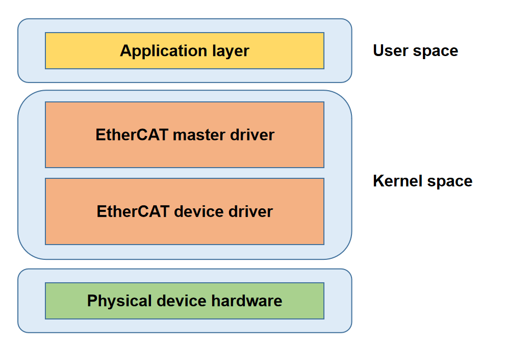

# EtherCAT

Introduction to EtherCAT master functionality and usage.

## Module Introduction

The IGH EtherCAT master is a kernel module for high-performance real-time communication, supporting slave scanning, configuration management, distributed clock synchronization, and more. It can efficiently schedule and manage multiple slave devices and is widely used in industrial automation and other applications with high requirements for real-time performance and reliability.

### Function Introduction

  

The EtherCAT master architecture is shown above and consists of four parts:  
Application Layer: User application, responsible for implementing industrial control logic and interacting with the EtherCAT master driver via interfaces.  
EtherCAT Master Driver Layer: Implements core protocol, monitors bus topology, auto-configures slaves, and synchronizes distributed clocks.  
EtherCAT Device Driver Layer: Consists of real-time NIC drivers, responsible for ECAT data frame transmission and reception.  
Physical Layer: Network hardware devices.

### Source Code Structure Introduction

The EtherCAT master driver code is under drivers/net/ethercat:  

```c
# There are many paired xxx.h + xxx.c files in the code, the former defines data structures and interfaces, the latter implements them

├── device                     # EtherCAT device driver
│   ├── ecdev.h                
│   ├── ec_generic.c           # Generic network device driver
│   ├── ec_k1x_emac.c          # Real-time NIC driver for K1 Ethernet controller
│   ├── ec_k1x_emac.h          
│   ├── Kconfig               
│   └── Makefile
├── include                   
│   ├── config.h               # Global configuration and macros
│   ├── ecrt.h                 # User program interface
│   ├── ectty.h                
│   └── globals.h              # Global variables
├── Kconfig                  
├── Makefile                  
└── master                
    ├── cdev.c                 # EtherCAT character device initialization interface
    ├── cdev.h                 
    ├── coe_emerg_ring.c       # CoE emergency message handling interface
    ├── coe_emerg_ring.h       
    ├── datagram.c             # ECAT datagram construction interface
    ├── datagram.h             
    ├── datagram_pair.c        # ECAT datagram pair construction interface
    ├── datagram_pair.h        
    ├── debug.c                # Debug interface
    ├── debug.h                
    ├── device.c               # NIC device abstraction and management interface
    ├── device.h               
    ├── domain.c               # EtherCAT domain related interface
    ├── domain.h               
    ├── doxygen.c
    ├── eoe_request.c
    ├── eoe_request.h          
    ├── ethernet.c             # Core file for EOE functionality
    ├── ethernet.h             
    ├── flag.c
    ├── flag.h                 
    ├── fmmu_config.c          # FMMU configuration message construction interface
    ├── fmmu_config.h          
    ├── foe.h                  
    ├── foe_request.c          # FoE request handling interface
    ├── foe_request.h          
    ├── fsm_change.c           # State change state machine implementation
    ├── fsm_change.h           
    ├── fsm_coe.c              # CoE protocol state machine implementation
    ├── fsm_coe.h              
    ├── fsm_eoe.c              # EoE protocol state machine implementation
    ├── fsm_eoe.h              
    ├── fsm_foe.c              # FoE protocol state machine implementation
    ├── fsm_foe.h              
    ├── fsm_master.c           # Master state machine implementation
    ├── fsm_master.h           
    ├── fsm_pdo.c              # PDO read/write state machine implementation
    ├── fsm_pdo_entry.c        # PDO entry read/write state machine implementation
    ├── fsm_pdo_entry.h        
    ├── fsm_pdo.h              
    ├── fsm_sii.c              # Slave information interface read/write state machine implementation
    ├── fsm_sii.h              
    ├── fsm_slave.c            # Slave state machine implementation
    ├── fsm_slave_config.c     # Slave configuration state machine implementation
    ├── fsm_slave_config.h     
    ├── fsm_slave.h            
    ├── fsm_slave_scan.c       # Slave scan state machine implementation
    ├── fsm_slave_scan.h       
    ├── fsm_soe.c              # SoE (Servo over EtherCAT) state machine implementation
    ├── fsm_soe.h              
    ├── globals.h              
    ├── ioctl.c                # IOCTL interface for user space interaction
    ├── ioctl.h               
    ├── Kconfig                
    ├── mailbox.c              # ECAT mailbox message interface
    ├── mailbox.h              
    ├── Makefile               
    ├── master.c               # Master module core logic
    ├── master.h               
    ├── module.c               # Master module initialization and cleanup
    ├── pdo.c                  # PDO management interface
    ├── pdo_entry.c            # PDO entry management interface
    ├── pdo_entry.h            
    ├── pdo.h                  
    ├── pdo_list.c             # PDO list management interface
    ├── pdo_list.h             
    ├── reg_request.c          # Slave register read/write request interface 
    ├── reg_request.h          
    ├── rtdm.c                 # RTDM support
    ├── rtdm_details.h         
    ├── rtdm.h                 
    ├── rtdm-ioctl.c           # RTDM IOCTL interface implementation
    ├── rtdm_xenomai_v3.c      # Interface for Xenomai v3 real-time framework
    ├── rt_locks.h             # Real-time lock implementation
    ├── sdo.c                  # SDO management
    ├── sdo_entry.c            # SDO entry management
    ├── sdo_entry.h            
    ├── sdo.h                  
    ├── sdo_request.c          # SDO request
    ├── sdo_request.h          
    ├── slave.c                # Slave state management logic
    ├── slave_config.c         # Slave configuration interface
    ├── slave_config.h         
    ├── slave.h                
    ├── soe_errors.c           # SoE protocol error codes
    ├── soe_request.c          # SoE request related interface
    ├── soe_request.h          
    ├── sync.c                 # Sync manager related interface
    ├── sync_config.c          # Sync manager configuration interface
    ├── sync_config.h          
    ├── sync.h                 
    ├── voe_handler.c          # VOE (Vendor-specific over EtherCAT) request
    └── voe_handler.h          
```

## Key Features

| Feature | Description |
| :-----| :----|
| Automatic Slave Configuration | Supports automatic scanning and configuration of connected slave devices, simplifying network configuration |
| Distributed Clock Synchronization | Achieves \<1 µs precision distributed clock (DC) synchronization |
| Multi-Protocol Support | Supports CoE, SoE, FoE, and other protocols |
| High Real-Time Performance | Supports 1 ms DC cycle, meeting the real-time requirements of most industrial applications |
| Multi-Master Configuration | Supports configuring multiple masters, each managing two network devices: master and backup devices |

## Configuration Introduction

Mainly includes driver CONFIG enable configuration and dts configuration

### CONFIG Configuration

ETHERCAT: If you want to enable EtherCAT service, first configure this option to Y

```c
menuconfig ETHERCAT
        bool "Ethercat native network driver support"
        depends on NET
        default y
        help
          This section contains all the Ethercat drivers.
```

EC_MASTER: Enable master driver

```c
config EC_MASTER
        tristate "Ethercat master driver support"
        depends on ETHERCAT
        default n
        help
          Ethercat master driver support.

```

EC_GENERIC: Enable generic NIC driver  
EC_K1X_EMAC: Enable real-time NIC driver  

```c
config EC_GENERIC
        tristate "Ethercat generic device driver support"
        depends on ETHERCAT
        default n
        help
          generic native ethercat device driver support.

config EC_K1X_EMAC
        tristate "k1x native thercat device driver support"
        depends on ETHERCAT
        default n
        help
          Ethercat generic device driver support.

```

Note: Generally, enabling the real-time NIC driver provides better performance.

### dts Configuration

The options available for configuration in dts include:  

1. run-on-cpu: Bindable CPU options are 1, 2, 3, 4, 5, 6, 7  
2. debug-level: Supported debug-levels are 0, 1, 2  
3. master-count: Supports up to 32 masters
4. ec-devices: Network devices for EtherCAT
5. master-indexes: Master station numbers bound to EtherCAT devices, ranging from 0 to master-count-1  
6. modes: EtherCAT device operating modes, supporting ec_main and ec_backup options

Currently, three configuration modes are supported:  
1. Configure two masters, for example, bind eth0 to master 0 and eth1 to master 1  

```c
ec_master: ethercat_master {
        compatible = "igh,k1x-ec-master";
        run-on-cpu = <1>;         
        debug-level = <0>;
        master-count = <2>;   
        ec-devices = <&eth0>,<&eth1>;
        master-indexes = <0>,<1>;
        modes = "ec_main";
        status = "okay";
};

eth0: ethernet@cac80000 {
        compatible = "spacemit,k1x-ec-emac";
        ...

};

eth1: ethernet@cac81000 {
        compatible = "spacemit,k1x-ec-emac";
        ...

};
```

2. Configure one master, one NIC for EtherCAT, and one NIC for Ethernet, such as using eth0 for EtherCAT

```c
ec_master: ethercat_master {
        compatible = "igh,k1x-ec-master";
        run-on-cpu = <1>;         
        debug-level = <0>;
        master-count = <1>;   
        ec-devices = <&eth0>;
        master-indexes = <0>;
        modes = "ec_main";
        status = "okay";
};

# Here eth0 is used for ethercat
eth0: ethernet@cac80000 {
        compatible = "spacemit,k1x-ec-emac";
        ...

};
```

3. Configure one master, bind two NICs. For example, eth0 for the main device and eth1 for the backup device

```c
ec_master: ethercat_master {
        compatible = "igh,k1x-ec-master";
        run-on-cpu = <1>;         
        debug-level = <0>;
        master-count = <1>;   
        ec-devices = <&eth0>,<&eth1>;
        master-indexes = <0>,<0>;
        modes = "ec_main","ec_backup";
        status = "okay";
};

# Here eth0 is used for ethercat
eth0: ethernet@cac80000 {
        compatible = "spacemit,k1x-ec-emac";
        ...

};

eth1: ethernet@cac81000 {
        compatible = "spacemit,k1x-ec-emac";
        ...

};
```

## Interface Introduction

### API Introduction

Request master instance

```c
ec_master_t *ecrt_request_master(unsigned int master_id);
```

Create process data domain

```c
ec_domain_t *ecrt_master_create_domain(ec_master_t *master);
```

Activate master

```c
int ecrt_master_activate(ec_master_t *master);
```

Synchronize master reference clock

```c
int ecrt_master_sync_reference_clock_to(ec_master_t *master, uint64_t ref_time);
```

Synchronize all slave clocks

```c
void ecrt_master_sync_slave_clocks(ec_master_t *master);
```

Configure slave

```c
ec_slave_config_t *ecrt_master_slave_config(ec_master_t *master, uint16_t alias, uint16_t position, uint32_t vendor_id, uint32_t product_code);

```

Configure slave PDO mapping

```c
int ecrt_slave_config_pdos(ec_slave_config_t *sc, uint16_t sync_index, const ec_sync_info_t *syncs);
```

Register PDO entry to specified data domain

```c
int ecrt_slave_config_reg_pdo_entry(ec_slave_config_t *sc, uint16_t index, uint8_t subindex， ec_domain_t *domain, unsigned int *offset);

```

Configure distributed clock for slave

```c
int ecrt_slave_config_dc(ec_slave_config_t *sc, uint16_t assign_activate, uint32_t sync0_cycle_time, int32_t sync0_shift, uint32_t sync1_cycle_time, int32_t sync1_shift);
```

## Debug Introduction

### sysfs

EtherCAT master information

```c
/sys/class/EtherCAT/EtherCAT0
.
|-- dev
|-- power
|   |-- autosuspend_delay_ms
|   |-- control
|   |-- runtime_active_time
|   |-- runtime_status
|   `-- runtime_suspended_time
|-- subsystem -> ../../../../class/EtherCAT
`-- uevent

```

- dev  
Provides master device number information
- power  
Manages device power status
- subsystem
 Link: Indicates the device belongs to the EtherCAT sub-system
- uevent  
Master device number and device name

## Test Introduction

Testing the EtherCAT master requires slave devices. After the master-slave connection, it will automatically start scanning the slave. After the automatic scanning is successful, the master will be in the PREOP state, waiting for the application program to run.

```c
[  966.525910] k1x_ec_emac cac80000.ethernet ecm0 (uninitialized): Link is Up - 100Mbps/Full - flow control off
[  966.535906] EtherCAT 0: Link state of ecm0 changed to UP.
[  966.552545] EtherCAT 0: 1 slave(s) responding on main device.
[  966.558389] EtherCAT 0: Slave states on main device: INIT.
[  966.564036] EtherCAT 0: Scanning bus.
[  966.739197] EtherCAT 0: Bus scanning completed in 176 ms.
[  966.745275] EtherCAT 0: Using slave 0 as DC reference clock.
[  966.756564] EtherCAT 0: Slave states on main device: PREOP.

```
You can use the official demo (source directory: https://gitlab.com/etherlab.org/ethercat, demo path: examples/) to test the performance of the master. Taking examples/dc_user/main.c as a template, with a 1m dc communication cycle, and two slave devices connected, the test results are as follows:
```c
period         995099 ...    1004890
exec            14500 ...     106835
latency          7227 ...      13169
period         994556 ...    1005557
exec            14625 ...     105543
latency          7409 ...      13805
period         995306 ...    1004974
exec            14458 ...     105127
latency          7269 ...      13205
period         995390 ...    1004807
exec            14583 ...     137586
latency          7284 ...      13893
period         995265 ...    1005516
exec            14792 ...     108710
latency          7460 ...      13658
period         995598 ...    1004557
exec            14458 ...     112502
latency          7299 ...      12821
period         994807 ...    1005056
exec            14459 ...     105085
latency          7428 ...      13340
period         995390 ...    1005016
exec            14792 ...     110502
latency          7230 ...      13237
period         994432 ...    1007265
exec            14959 ...     110668
latency          7199 ...      15479
period         994848 ...    1004682
exec            14709 ...     113544
latency          7630 ...      13930
```
Note:  
period line gives the fluctuation range of the communication cycle per second  
exec line gives the fluctuation range of the master cycle task execution time per second  
latency line gives the fluctuation range of master wake-up error per second   
## FAQ
