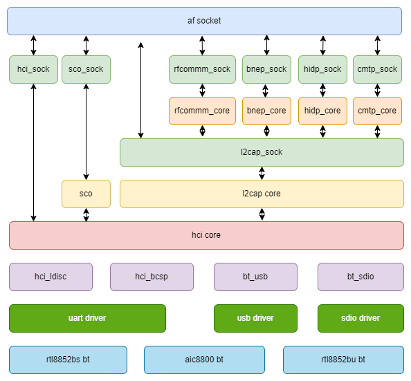

# BT 
Introduction to BT porting and usage.

## Module Introduction
On the K1 platform, BT functionality is mainly implemented via external BT modules, supporting UART, USB, and other interface Bluetooth modules.
### Function Introduction

The BT framework diagram can be divided into the following layers:



### Source Code Structure Introduction

BT-related source code can be divided into the following parts:
1. Bluetooth protocol stack, using bluez as an example, the code is divided into two parts, one in kernel space and one in user space.
2. BT HCI driver, mainly implements the HCI layer.
3. Platform-related part, mainly implements module power supply and enable interfaces, for rfkill driver calls.
4. Interface driver, mainly implements BT data transmission interface functions, such as UART, USB, etc.

BLUEZ protocol stack source code is in the following directory:
```
drivers/net/bluetooth
|-- af_bluetooth.c
|-- af_bluetooth.o
|-- bnep                # Bluetooth Network Encapsulation Protocol
│   |-- bnep.h
│   |-- core.c
│   |-- Kconfig
│   |-- Makefile
│   |-- netdev.c
│   |-- sock.c
|-- hci_codec.c
|-- hci_codec.h
|-- hci_conn.c
|-- hci_core.c          # Hci core implementation
|-- hci_debugfs.c
|-- hci_debugfs.h
|-- hci_event.c
|-- hci_request.c
|-- hci_request.h
|-- hci_sock.c
|-- hci_sync.c
|-- hci_sysfs.c
|-- hidp                # Bluetooth hid implementation
│   |-- core.c
│   |-- hidp.h
│   |-- Kconfig
│   |-- Makefile
│   |-- sock.c
|-- iso.c
|-- Kconfig
|-- l2cap_core.c        # l2cap core implementation
|-- l2cap_sock.c
|-- lib.c
|-- Makefile
|-- mgmt.c              # mgmt bluetooth management implementation
|-- mgmt_config.c
|-- mgmt_config.h
|-- mgmt_util.c
|-- mgmt_util.h
|-- rfcomm              # rfcomm protocol
│   |-- core.c
│   |-- Kconfig
│   |-- Makefile
│   |-- sock.c
│   |-- tty.c
|-- sco.c
|-- selftest.c
|-- selftest.h
|-- smp.c
|-- smp.h
```
HCI driver source code is in the following directory:
```
drivers/bluetooth
|-- btbcm.c             # broadcom vendor implementation
|-- btrtl.c             # realtek vendor implementation
|-- btusb.c             # hci uart implementation
|-- hci_h4.c            # hci h4 implementation
|-- hci_h5.c            # hci h5 implementation
|-- hci_ldisc.c         # bluetooth hci line discipline

```
Platform-related source code:
```
drivers/soc/spacemit/spacemit-rf
|-- spacemit-pwrseq.c   # Common part for WIFI and Bluetooth
|-- spacemit-wlan.c     # WIFI power, gpio and clock related interface implementation
|-- spacemit-bt.c       # BT power, gpio and clock related interface implementation
```

Refer to each interface driver documentation for interface-related source code.

## Key Features
### Platform uart interface features
| Feature | Description |
| :-----| :----|
| Supports 4-wire flow control | Up to 3.6Mbps |
| Supports DMA | Supports DMA transfer mode |

### Module Performance Specifications
| Module Model | Specification |
| :-----| :----|
| rtl8852bs | Supports Bluetooth 5.2 |
|             | Supports Bluetooth 2.0 UART HCI H4/H5 |
| aic8800d80 | Supports Bluetooth 5.3 |
|             | Supports Bluetooth 2.0 UART HCI H4 |

## Configuration Introduction
Mainly includes driver enable configuration and dts configuration
### CONFIG Configuration

Protocol stack configuration
```
Networking support (NET [=y])
        Bluetooth subsystem support (BT [=y])
                Bluetooth Classic (BR/EDR) features (BT_BREDR [=y])
                        RFCOMM protocol support (BT_RFCOMM [=y])
                                RFCOMM TTY support (BT_RFCOMM_TTY [=y])
                        BNEP protocol support (BT_BNEP [=y])
                        HIDP protocol support (BT_HIDP [=y])
                Bluetooth Low Energy (LE) features (BT_LE [=y])
        Export Bluetooth internals in debugfs (BT_DEBUGFS [=y])
```
UART HCI configuration
```
Networking support (NET [=y])
        Bluetooth subsystem support (BT [=y])
                Bluetooth device drivers
                        HCI UART driver (BT_HCIUART [=y])
                                UART (H4) protocol support (BT_HCIUART_H4 [=y])
                        Three-wire UART (H5) protocol support (BT_HCIUART_3WIRE [=y])
                        Realtek protocol support (BT_HCIUART_RTL [=y]) 
```
By default, H4 and H5 are supported, among which Realtek's Bluetooth serial port uses the H5 protocol.

USB HCI configuration
```
Networking support (NET [=y])
        Bluetooth subsystem support (BT [=y])
                Bluetooth device drivers
                        HCI USB driver (BT_HCIBTUSB [=m])
                                Broadcom protocol support (BT_HCIBTUSB_BCM [=y])
                                Realtek protocol support (BT_HCIBTUSB_RTL [=y])  
```
BT_HCIBTUSB_BCM and BT_HCIBTUSB_RTL correspond to the support for Broadcom and Realtek, respectively.

AVRCP configuration
```
Device Drivers
        Input device support
                Generic input layer (needed for keyboard, mouse, ...) (INPUT [=y])
                        Miscellaneous devices (INPUT_MISC [=y])
                                User level driver support (INPUT_UINPUT [=y])
```
If you want to send AVRCP key values and other information to user-space programs through the input device, you need to enable INPUT_UINPUT.

HOGP configuration
```
Device Drivers
        HID bus support (HID_SUPPORT [=y])
                HID bus core support (HID[=y])
                        User-space I/O driver support for HID subsystem (UHID [=y]) 
```
If you want to send HoG's KEY_1, KEY_2, KEY_ESC and other key values to user-space programs through the input device, you need to enable UHID.

Platform configuration
```
Device Drivers
        SOC (System On Chip) specific Drivers
                Spacemit rfkill driver (SPACEMIT_RFKILL [=y])
```
CONFIG_SPACEMIT_RFKILL provides platform-related support for the BT module. By default, this option is Y.

### dts configuration
#### uart configuration

Generally, uart2 is used for Bluetooth, corresponding to uart2, the actual corresponding node is ttyS1.

```
&uart2 {
        pinctrl-names = "default";
        pinctrl-0 = <&pinctrl_uart2>;
        status = "okay";
};
```
#### uart2 pinctrl configuration
The Bluetooth pinctrl configuration is subject to the actual hardware, with flow control enabled by default.
```
pinctrl_uart2: uart2_grp {
        pinctrl-single,pins =<
                K1X_PADCONF(GPIO_21, MUX_MODE1, (EDGE_NONE | PULL_UP | PAD_1V8_DS2))	/* uart2_txd */
                K1X_PADCONF(GPIO_22, MUX_MODE1, (EDGE_NONE | PULL_UP | PAD_1V8_DS2))	/* uart2_rxd */
                K1X_PADCONF(GPIO_23, MUX_MODE1, (EDGE_NONE | PULL_UP | PAD_1V8_DS2))	/* uart2_cts_n */
                K1X_PADCONF(GPIO_24, MUX_MODE1, (EDGE_NONE | PULL_UP | PAD_1V8_DS2))	/* uart2_rts_n */
        >;
};
```

#### Platform part dts configuration

The complete platform solution configuration is as follows:
```
rf_pwrseq: rf-pwrseq {
        compatible = "spacemit,rf-pwrseq";
        //vdd-supply = <&ldo_7>;
        //vdd_voltage = <3300000>;
        io-supply = <&dcdc_3>;
        io_voltage = <1800000>;
        pwr-gpios  = <&gpio 67 0>;
        status = "okay";

        wlan_pwrseq: wlan-pwrseq {
                compatible = "spacemit,wlan-pwrseq";
                regon-gpios = <&gpio 116 0>;
                interrupt-parent = <&pinctrl>;
                interrupts = <268>;
                pinctrl-names = "default";
                pinctrl-0 = <&pinctrl_wlan_wakeup>;
        };

        bt_pwrseq: bt-pwrseq {
                compatible = "spacemit,bt-pwrseq";
                reset-gpios     = <&gpio 63 0>;
        };
};
```

Currently, many modules on the market are WIFI and Bluetooth two-in-one, and the power supply part of WIFI and Bluetooth is often shared. It is recommended to configure the shared part in rf_pwrseq, and only the part that affects Bluetooth in bt_pwrseq.

For a single Bluetooth module, only bt_pwrseq needs to be configured, rf_pwrseq does not need to be configured, but the rf_pwrseq node needs to be enabled.

When turning on the power for Bluetooth, the power and GPIO status of the shared part will be enabled first, and the platform will maintain the corresponding reference count. During shutdown, only when both WIFI and Bluetooth are turned off will the power and GPIO status of the shared part be completely turned off.

rf_pwrseq：
- vdd-supply is used to configure the power supply for the module,具体按实际硬件配置。
- vdd_voltage is used to set the voltage of the module power supply.
- io-supply is used to configure the power supply for the module io,具体按实际硬件配置。
- io_voltage is used to set the voltage of the module io power supply.
- pwr-gpios is the module enable pin, which will be pulled high by default after configuration, and supports the configuration of multiple gpio.
- clock is the clock configuration shared by the module.
- power-on-delay-ms sets the delay after the module is powered on, the default is 100ms.

bt_pwrseq：
- reset-gpios is the enable pin for Bluetooth. When the rfkill corresponding to Bluetooth is enabled, this gpio will be pulled high.
- clock is the clock configuration for Bluetooth.
- power-on-delay-ms sets the delay after Bluetooth is powered on, the default is 10ms.

## Interface Introduction

### UART hciattach

hciattach is a BlueZ initialization tool for UART interface Bluetooth controllers, and USB interface Bluetooth can be ignored.

If it is a Realtek Bluetooth UART, you need to use the rtk_hciattach compiled and generated from the rtk_hciattach source code.

```
rtk_hciattach -n -s 115200 ttyS1 rtk_h5 &
```
If it is AIC8800 Bluetooth UART, use the following command to initialize with hciattach
```
hciattach -s 1500000 /dev/ttyS1 any 1500000 flow nosleep
```

### API Introduction
The platform part encapsulates the BT power on and off in the rfkill subsystem, and the Bluetooth power supply can be directly operated using rfkill.
```
# rfkill list
0: spacemit-bt: Bluetooth
        Soft blocked: no
        Hard blocked: no
1: phy0: Wireless LAN
        Soft blocked: no
        Hard blocked: no
2: hci0: Bluetooth
        Soft blocked: no
        Hard blocked: no

# rfkill block blutooth
# rfkill list
0: spacemit-bt: Bluetooth
        Soft blocked: yes
        Hard blocked: no
1: phy0: Wireless LAN
        Soft blocked: no
        Hard blocked: no
2: hci0: Bluetooth
        Soft blocked: yes
        Hard blocked: no
```
Among them, spacemit-bt is the rfkill device registered by the platform, and hci0 is the rfkill device registered by the Bluetooth protocol stack.

During platform initialization, you only need to actively open the Bluetooth device corresponding to spacemit-bt.
```
cat /sys/class/rfkill/rfkill0/type
bluetooth
cat /sys/class/rfkill/rfkill0/name
spacemit-bt
echo 1 > /sys/class/rfkill/rfkill0/state
```
When operating rfkill, you need to confirm whether the type and name correspond to the Bluetooth device of spacemit-bt.

## Debug Introduction
### sysfs
In sysfs, you can query the status information of the corresponding rfkill.
```
cat /sys/class/rfkill/rfkill0/state
1
```
In sysfs, you can query the information of the corresponding uart.
```
/sys/devices/platform/soc/d4017100.uart
```
### debugfs
In debugfs, you can query the information of the Bluetooth protocol stack related components
```
/sys/kernel/debug/bluetooth# ls
hci0  l2cap  rfcomm  rfcomm_dlc  sco
```
## Test Introduction
Use bluetoothctl to interact with the bluetoothd service

First, make sure the bluetoothd service is running normally, and enter bluetoothctl to access the command line:
```
[bluetooth]# power on
[bluetooth]# Changing power on succeeded
[bluetooth]# scan on
[bluetooth]# SetDiscoveryFilter success
[bluetooth]# Discovery started
[bluetooth]# [CHG] Controller 5C:8A:AE:67:62:04 Discovering: yes
[bluetooth]# [NEW] Device 45:DC:1E:BC:2C:77 45-DC-1E-BC-2C-77
[bluetooth]# [NEW] Device 4C:30:B8:02:7F:7A 4C-30-B8-02-7F-7A
[bluetooth]# [NEW] Device DC:28:67:9A:70:8E DC-28-67-9A-70-8E
[bluetooth]# [NEW] Device 58:FB:F1:17:D4:19 58-FB-F1-17-D4-19
[bluetooth]# [NEW] Device 84:7B:57:FB:20:8D 84-7B-57-FB-20-8D
[bluetooth]# [CHG] Device 84:7B:57:FB:20:8D TxPower: 0x000c (12)
[bluetooth]# [CHG] Device 84:7B:57:FB:20:8D Name: LT-ZHENGHONG
[bluetooth]# [CHG] Device 84:7B:57:FB:20:8D Alias: LT-ZHENGHONG
[bluetooth]# [CHG] Device 84:7B:57:FB:20:8D UUIDs: 0000110c-0000-1000-8000-00805f9b34fb
[bluetooth]# [CHG] Device 84:7B:57:FB:20:8D UUIDs: 0000110a-0000-1000-8000-00805f9b34fb
[bluetooth]# [CHG] Device 84:7B:57:FB:20:8D UUIDs: 0000110e-0000-1000-8000-00805f9b34fb
[bluetooth]# [CHG] Device 84:7B:57:FB:20:8D UUIDs: 0000110b-0000-1000-8000-00805f9b34fb
[bluetooth]# [CHG] Device 84:7B:57:FB:20:8D UUIDs: 0000111f-0000-1000-8000-00805f9b34fb
[bluetooth]# [CHG] Device 84:7B:57:FB:20:8D UUIDs: 0000111e-0000-1000-8000-00805f9b34fb
[bluetooth]#
[bluetooth]# pair 84:7B:57:FB:20:8D
Attempting to pair with 84:7B:57:FB:20:8D
[CHG] Device 84:7B:57:FB:20:8D Connected: yes
[LT-ZHENGHONG]# Request confirmation
[LT-ZHENGHONG]#   1;39m[agent] Confirm passkey 947781 (yes/no): yes
[DEL] Device 58:FB:F1:17:D4:19 58-FB-F1-17-D4-19
[bluetooth]# info 84:7B:57:FB:20:8D
Device 84:7B:57:FB:20:8D (public)
        Name: LT-ZHENGHONG
        Alias: LT-ZHENGHONG
        Class: 0x002a010c (2752780)
        Icon: computer
        Paired: no
        Bonded: no
        Trusted: no
        Blocked: no
        Connected: yes
        LegacyPairing: no
        UUID: A/V Remote Control Target (0000110c-0000-1000-8000-00805f9b34fb)
        UUID: Audio Source              (0000110a-0000-1000-8000-00805f9b34fb)
        UUID: A/V Remote Control        (0000110e-0000-1000-8000-00805f9b34fb)
        UUID: Audio Sink                (0000110b-0000-1000-8000-00805f9b34fb)
        UUID: Handsfree Audio Gateway   (0000111f-0000-1000-8000-00805f9b34fb)
        UUID: Handsfree                 (0000111e-0000-1000-8000-00805f9b34fb)
        RSSI: 0xffffffae (-82)
        TxPower: 0x000c (12)
[LT-ZHENGHONG]# [DEL] Device DC:28:67:9A:70:8E DC-28-67-9A-70-8E
[LT-ZHENGHONG]# [DEL] Device 45:DC:1E:BC:2C:77 45-DC-1E-BC-2C-77
[LT-ZHENGHONG]# [DEL] Device 53:84:3E:02:79:84 53-84-3E-02-79-84
[LT-ZHENGHONG]# [CHG] Device 84:7B:57:FB:20:8D Bonded: yes
[LT-ZHENGHONG]# info 84:7B:57:FB:20:8D
Device 84:7B:57:FB:20:8D (public)
        Name: LT-ZHENGHONG
        Alias: LT-ZHENGHONG
        Class: 0x002a010c (2752780)
        Icon: computer
        Paired: no
        Bonded: yes
        Trusted: no
        Blocked: no
        Connected: yes
        LegacyPairing: no
        UUID: A/V Remote Control Target (0000110c-0000-1000-8000-00805f9b34fb)
        UUID: Audio Source              (0000110a-0000-1000-8000-00805f9b34fb)
        UUID: A/V Remote Control        (0000110e-0000-1000-8000-00805f9b34fb)
        UUID: Audio Sink                (0000110b-0000-1000-8000-00805f9b34fb)
        UUID: Handsfree Audio Gateway   (0000111f-0000-1000-8000-00805f9b34fb)
        UUID: Handsfree                 (0000111e-0000-1000-8000-00805f9b34fb)
        RSSI: 0xffffffae (-82)
        TxPower: 0x000c (12)

```

## FAQ
问题1

现象：hciattach初始化失败。

打印：
```
Realtek Bluetooth :Realtek Bluetooth init uart with init speed:115200, type:HCI UART H5
Realtek Bluetooth :Realtek hciattach version 3.1.4796cb2.20230921-183414
Realtek Bluetooth :Use epoll
Realtek Bluetooth WARN: Writev partially, ret 0
Realtek Bluetooth WARN: OP_H5_SYNC Transmission timeout
Realtek Bluetooth WARN: Writev partial, 0
Realtek Bluetooth WARN: OP_H5_SYNC Transmission timeout
Realtek Bluetooth WARN: Writev partial, 0
Realtek Bluetooth WARN: OP_H5_SYNC Transmission timeout
Realtek Bluetooth WARN: Writev partial, 0
```
解决办法
1. 确认蓝牙的供电是否正常。
