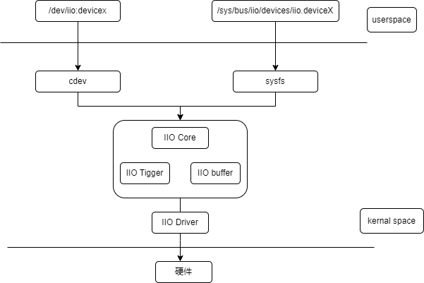

# GPADC
Introduction to the functions and usage of GPADC.

## Module Introduction
IIO is a subsystem in the Linux kernel dedicated to handling data acquisition and processing for industrial control and measurement devices. The IIO subsystem supports many device types, including analog-to-digital converters (ADC), digital-to-analog converters (DAC), accelerometers, gyroscopes, inertial measurement units, and temperature sensors. The gpadc introduced in this chapter is an analog-to-digital converter embedded in our PMIC chip.

### Function Introduction
  

1. iio core: provides the interface between the driver and user space, responsible for device enumeration, registration, and management  
2. IIO device driver: code for controlling and reading specific IIO devices  
3. IIO buffer: memory area for storing data from sensors and other measurement devices  
4. IIO event handling: handles interrupts and events from sensors and other measurement devices

### Source Code Structure Introduction

```
* IIO core
    drivers/iio/industrialio-core.c  
* IIO device driver
    drivers/iio/adc/k1x_adc.c
* IIO buffer
    drivers/iio/industrialio-buffer.c
* IIO event handling
    drivers/iio/industrialio-event.c
```
## Key Features

### Features
| Feature |
| :-----|
| Software supports 6 ADC channels |
| 12bit ADC conversion accuracy, 100Hz~50Khz sampling rate |

## Configuration Introduction
Mainly includes driver enable configuration and dts configuration

### CONFIG Configuration

```
Symbol: SPACEMIT_P1_ADC [=y]
Type  : tristate
Defined at drivers/iio/adc/Kconfig:1444
Prompt: Spacemit P1 adc driver
Depends on: IIO [=y] && MFD_SPACEMIT_PMIC [=y]
Location:
	-> Device Drivers
		-> Industrial I/O support (IIO [=y])
			-> Analog to digital converters
				-> Spacemit P1 adc driver (SPACEMIT_P1_ADC [=y])   
```
### DTS Configuration
Our gpadc is embedded in the pmic, and enabling the gpadc requires configuring two dts points

1. gpadc channel pinctrl configuration
```
pmic_pinctrl: pinctrl {
    compatible = "pmic,pinctrl,spm8821";
    gpio-controller;
    #gpio-cells = <2>;
    spacemit,npins = <6>;

    /* 假如使用channel2 作为adc的输入管脚 */
    gpadc2_pins: gpadc2-pins {
            pins = "PIN2";
            function = "adcin";
    };
};
```

2. adc driver enable configuration
```
ext_adc: adc {
     compatible = "pmic,adc,spm8821";
};

```

## Interface Introduction

### API Introduction
```
struct iio_dev *iio_device_alloc(struct device *parent, int sizeof_priv); --- 申请iio_dev结构体
struct iio_dev *devm_iio_device_alloc(struct device *dev, int sizeof_priv) --- 申请 iio_dev
int iio_device_register(struct iio_dev *indio_dev) -- 注册iio设备
void iio_device_unregister(struct iio_dev *indio_dev) -- 注销iio设备

```

## Debug Introduction
### sysfs
```
cd /sys/bus/iio/devices/iio:device0  --- iio框架目录  
in_voltage2_raw  -- 读取的adc硬件寄存器的值  
in_voltage2_scale  --- 读取的adc的精度  
```
## Testing Introduction
A simple test is conducted by dynamically changing the external sampling voltage, and the software reads the voltage value as follows:
```
cd /sys/bus/iio/devices/iio:device0
cat in_voltage2_raw
cat in_voltage2_scale

得到的两个节点做乘法运算就是得到的采样电压值(单位为mV)

```
## FAQ