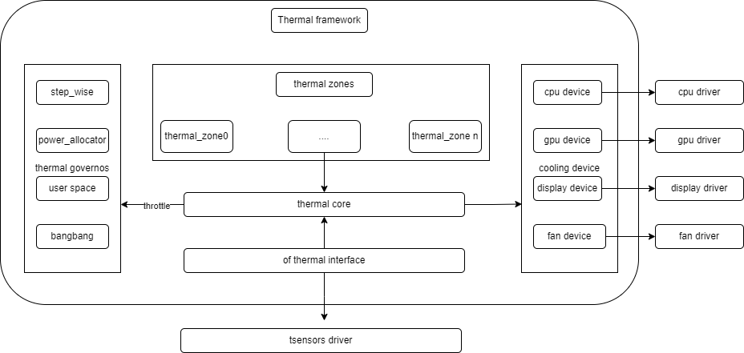

# Thermal

Introduction to the functions and usage of thermal.

## Module Introduction

Thermal specifically refers to a set of driver frameworks for thermal management mechanisms. The Linux thermal framework is a temperature control architecture under Linux, mainly used to solve the increasingly serious heating problems caused by the continuous enhancement of device performance.

### Function Introduction



1. thermal_cooling_device corresponds to the driver that implements cooling measures and is the executor of thermal management  
2. thermal core is the main program of thermal, the driver initialization program, maintains the relationship among thermal_zone, governor, and cooling device, and interacts with user space via sysfs
3. thermal governor is the temperature control algorithm, which solves the problem of how the cooling device selects the cooling state when thermal management occurs.
4. thermal zone device is mainly used to create thermal zone nodes and connect thermal sensors. The thermal_zone node under /sys/class/thermal is generated by dts file configuration
5. thermal sensor is a temperature sensor, mainly providing temperature sensing for thermal

### Source Code Structure Introduction

The CPU frequency scaling platform driver directory is as follows:

```
drivers/thermal/
├── cpufreq_cooling.c
├── cpufreq_cooling.o
├── cpuidle_cooling.c
├── devfreq_cooling.c
├── gov_bang_bang.c
├── gov_fair_share.c
├── gov_power_allocator.c
├── gov_step_wise.c
├── gov_user_space.c
├── k1x-thermal.c    ---> platform driver
├── k1x-thermal.h
├── thermal_core.c
├── thermal_core.h
├── thermal_helpers.c
├── thermal_hwmon.c
├── thermal_hwmon.h
├── thermal_of.c
├── thermal_sysfs.c
```

## Key Features

### Features

| Feature | Description |
| :-----| :----|
| Supports cpu temperature control |
| Supports 115°C over-temperature shutdown |

Test method

```
Use an external temperature gun or run a high-load and variable application to create an environment with variable temperature, and check the thermal and cpufreq nodes to see if cpu temperature adjustment meets expectations  
1. thermal sensor node
    1.1 cat /sys/class/thermal/thermal_zone1/temp  
2. cpu frequency scaling node
    2.1 cat /sys/devices/system/cpu/cpufreq/policy0/scaling_cur_freq
```

## Configuration Introduction

Mainly includes driver enable configuration and dts configuration

### CONFIG Configuration

THERMAL configuration is as follows:

```
CONFIG_K1X_THERMAL:
Enable this option if you want to have support for thermal management
controller present in Spacemit SoCs

 Symbol: K1X_THERMAL [=y]
 Type  : tristate
 Defined at drivers/thermal/Kconfig:450
 Prompt: Spacemit K1X Thermal Support
 Depends on: THERMAL [=y] && OF [=y] && SOC_SPACEMIT [=y]
 Location:
  -> Device Drivers
   -> Thermal drivers (THERMAL [=y])
    -> Spacemit K1X Thermal Support (K1X_THERMAL [=y]) 
```

### dts Configuration

```
&thermal_zones {
        cluster0_thermal {
                polling-delay = <0>;
                polling-delay-passive = <0>;
                thermal-sensors = <&thermal 3>;

                thermal0_trips: trips {
                        cls0_trip0: cls0-trip-point0 {
                                temperature = <75000>;
                                hysteresis = <5000>;
                                type = "passive";
                        };

                        cls0_trip1: cls0-trip-point1 {
                                temperature = <85000>;
                                hysteresis = <5000>;
                                type = "passive";
                        };

                        cls0_trip2: cls0-trip-point2 {
                                temperature = <95000>;
                                hysteresis = <5000>;
                                type = "passive";
                        };

                        cls0_trip3: cls0-trip-point3 {
                                temperature = <105000>;
                                hysteresis = <5000>;
                                type = "passive";
                        };

                        cls0_trip4: cls0-trip-point4 {
                                temperature = <115000>;
                                hysteresis = <5000>;
                                type = "critical";
                        };
                };

                cooling-maps {
                        map0 {
                                trip = <&cls0_trip0>;
                                cooling-device = <&cpu_0 0 0>,
                                                 <&cpu_1 0 0>,
                                                 <&cpu_2 0 0>,
                                                 <&cpu_3 0 0>,
                                                 <&cpu_4 0 0>,
                                                 <&cpu_5 0 0>,
                                                 <&cpu_6 0 0>,
                                                 <&cpu_7 0 0>;
                        };

                        map1 {
                                trip = <&cls0_trip1>;
                                cooling-device = <&cpu_0 1 1>,
                                                 <&cpu_1 1 1>,
                                                 <&cpu_2 1 1>,
                                                 <&cpu_3 1 1>,
                                                 <&cpu_4 1 1>,
                                                 <&cpu_5 1 1>,
                                                 <&cpu_6 1 1>,
                                                 <&cpu_7 1 1>;
                        };

                        map2 {
                                trip = <&cls0_trip2>;
                                cooling-device = <&cpu_0 2 3>,
                                                 <&cpu_1 2 3>,
                                                 <&cpu_2 2 3>,
                                                 <&cpu_3 2 3>,
                                                 <&cpu_4 2 3>,
                                                 <&cpu_5 2 3>,
                                                 <&cpu_6 2 3>,
                                                 <&cpu_7 2 3>;
                        };

                        map3 {
                                trip = <&cls0_trip3>;
                                cooling-device = <&cpu_0 4 5>,
                                                 <&cpu_1 4 5>,
                                                 <&cpu_2 4 5>,
                                                 <&cpu_3 4 5>,
                                                 <&cpu_4 4 5>,
                                                 <&cpu_5 4 5>,
                                                 <&cpu_6 4 5>,
                                                 <&cpu_7 4 5>;
                        };
                };
        };

        cluster1_thermal {
                polling-delay = <0>;
                polling-delay-passive = <0>;
                thermal-sensors = <&thermal 4>;

                thermal1_trips: trips {
                        cls1_trip0: cls1-trip-point0 {
                                temperature = <75000>;
                                hysteresis = <5000>;
                                type = "passive";
                        };

                        cls1_trip1: cls1-trip-point1 {
                                temperature = <85000>;
                                hysteresis = <5000>;
                                type = "passive";
                        };

                        cls1_trip2: cls1-trip-point2 {
                                temperature = <95000>;
                                hysteresis = <5000>;
                                type = "passive";
                        };

                        cls1_trip3: cls1-trip-point3 {
                                temperature = <105000>;
                                hysteresis = <5000>;
                                type = "passive";
                        };

                        cls1_trip4: cls1-trip-point4 {
                                temperature = <115000>;
                                hysteresis = <5000>;
                                type = "critical";
                        };
                };
        };
};

```

## API Description

### API Introduction

Please refer to the documentation under the kernel directory:  
Documentation/driver-api/thermal/

## Debug Introduction

### sysfs

```
Please refer to:
Documentation/driver-api/thermal/sysfs-api.rst
```

## Test Introduction

You can test the thermal driver according to the description of the test method above.

## FAQ
