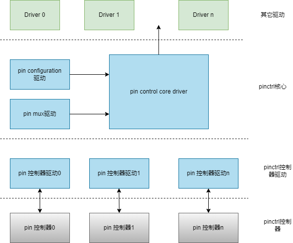

# PINCTRL

Introduction to the functions and usage of PIN.

## Module Introduction

PINCTRL is the controller of the PIN module.

### Function Introduction

  

The Linux pinctrl module consists of two parts: pinctrl core and pin controller driver.  
The pinctrl core mainly has two functions:  

- Provides pinctrl function interfaces for other drivers  
- Provides pin controller device registration and deregistration interfaces  

The main functions of the pinctrl controller driver:  

- Drives the pin controller hardware  
- Implements pin management and configuration

### Source Code Structure Introduction

The controller driver code is under the drivers/pinctrl directory:

```
drivers/pinctrl
|-- pinctrl-single.c
```

## Key Features

| Feature | Description |
| :-----| :----|
| Supports pin multiplexing selection | Supports setting the pin to one of the multiplexed functions |  
| Supports setting pin attributes | Supports setting pin edge detection, pull-up/pull-down, and drive strength |

## Configuration Introduction

Mainly includes driver enable configuration and dts configuration

### CONFIG Configuration

CONFIG_PINCTRL provides support for the pin controller. By default, this option is Y.

```
Device Drivers
        Pin controllers (PINCTRL [=y])
```

CONFIG_PINCTRL_SINGLE provides support for the k1 pinctrl controller. By default, this option is Y.

```
Device Drivers  
        Pin controllers (PINCTRL [=y])
                One-register-per-pin type device tree based pinctrl driver (PINCTRL_SINGLE [=y])
```
## pin Usage Instructions
Introduction to using pin in dts device nodes
### pin Configuration Parameters

Defines pin id, multiplexing function, and attributes.

Detailed definitions are in the kernel directory `include/dt-bindings/pinctrl/k1-x-pinctrl.h`.

#### pin id

That is, the pin number.

K1 pin number range is 1~147, corresponding to macro definitions `GPIO_00 ~ GPIO_147`.

#### pin function

k1 pin supports multiplexing selection.

See the k1 pin multiplexing list [K1 Pin Multiplex](https://developer.spacemit.com/#/documentation?token=CzJlwnDYNigRgDk7qS2cvYHPnkh).

The multiplexing function number of the pin is 0~7, defined as `MUX_MODE0 ~ MUX_MODE7`.

#### pin attributes

Pin attributes include edge detection, pull-up/pull-down, and drive strength.

##### Edge Detection

When using a function pin to wake up the system, set the signal detection method that generates the wake-up event.

Supports the following four modes:

- Edge detection off: `EDGE_NONE`
- Rising edge detection: `EDGE_RISE`
- Falling edge detection: `EDGE_FALL`
- Both rising and falling edge: `EDGE_BOTH`

##### Pull-up/Pull-down

Supports the following three modes:

- Pull-up/pull-down disabled: `PULL_DIS`
- Pull-up: `PULL_UP`
- Pull-down: `PULL_DOWN`

##### Drive Strength

1. pin voltage is 1.8v

Divided into 4 levels, the higher the value, the stronger the drive capability.

- PAD_1V8_DS0
- PAD_1V8_DS1
- PAD_1V8_DS2
- PAD_1V8_DS3

2. pin voltage is 3.3v

Divided into 7 levels, the higher the value, the stronger the drive capability

- PAD_3V_DS0
- PAD_3V_DS1
- PAD_3V_DS2
- PAD_3V_DS3
- PAD_3V_DS4
- PAD_3V_DS5
- PAD_3V_DS6
- PAD_3V_DS7

### pin configuration definition

#### Single pin configuration

Select pin function, set pin edge detection, pull-up/pull-down, and drive strength.

Set using macro K1X_PADCONF, the format is pin_id, mux_mode, pin_config.

For example: Set pin GPIO_00 to gmac0 rxdv function, turn off edge detection, turn off pull-up/pull-down, set drive strength to 2 (1.8v).

See k1 pin function multiplexing list [K1 Pin Multiplex.xls], GPIO_00 needs to be set to gmac0 rxdv function, the function mode needs to be set to 1, that is, MUX_MODE1.

Set as follows:

```c
K1X_PADCONF(GPIO_00,    MUX_MODE1, (EDGE_NONE | PULL_DIS | PAD_1V8_DS2))   /* gmac0_rxdv */
```

#### Define a group of pins

Configure the group of function pins used by the controller (such as gmac, pcie, usb, and emmc).

The default function pin group definition is in the kernel directory `arch/riscv/boot/dts/spacemit/k1-x_pinctrl.dtsi`.

1. Check whether the function pin group is defined in k1-x_pinctrl.dtsi. If it is defined and meets the configuration, use it directly; if it is not defined or the configuration does not meet, proceed to step 2;
2. Set the pin group used by the controller

Take eth0 as an example, assuming the development board eth0 pin group uses GPIO00~GPIO14, GPIO45, and tx needs to enable pull-up.

The default definition of gmac0 pins in k1-x_pinctrl.dtsi

```c
pinctrl_gmac0: gmac0_grp {
        pinctrl-single,pins =<
            K1X_PADCONF(GPIO_00,    MUX_MODE1, (EDGE_NONE | PULL_DIS | PAD_1V8_DS2))   /* gmac0_rxdv */
            K1X_PADCONF(GPIO_01,    MUX_MODE1, (EDGE_NONE | PULL_DIS | PAD_1V8_DS2))   /* gmac0_rx_d0 */
            K1X_PADCONF(GPIO_02,    MUX_MODE1, (EDGE_NONE | PULL_DIS | PAD_1V8_DS2))   /* gmac0_rx_d1 */
            K1X_PADCONF(GPIO_03,    MUX_MODE1, (EDGE_NONE | PULL_DIS | PAD_1V8_DS2))   /* gmac0_rx_clk */
            K1X_PADCONF(GPIO_04,    MUX_MODE1, (EDGE_NONE | PULL_DIS | PAD_1V8_DS2))   /* gmac0_rx_d2 */
            K1X_PADCONF(GPIO_05,    MUX_MODE1, (EDGE_NONE | PULL_DIS | PAD_1V8_DS2))   /* gmac0_rx_d3 */
            K1X_PADCONF(GPIO_06,    MUX_MODE1, (EDGE_NONE | PULL_DIS | PAD_1V8_DS2))   /* gmac0_tx_d0 */
            K1X_PADCONF(GPIO_07,    MUX_MODE1, (EDGE_NONE | PULL_DIS | PAD_1V8_DS2))   /* gmac0_tx_d1 */
            K1X_PADCONF(GPIO_08,    MUX_MODE1, (EDGE_NONE | PULL_DIS | PAD_1V8_DS2))   /* gmac0_tx */
            K1X_PADCONF(GPIO_09,    MUX_MODE1, (EDGE_NONE | PULL_DIS | PAD_1V8_DS2))   /* gmac0_tx_d2 */
            K1X_PADCONF(GPIO_10,    MUX_MODE1, (EDGE_NONE | PULL_DIS | PAD_1V8_DS2))   /* gmac0_tx_d3 */
            K1X_PADCONF(GPIO_11,    MUX_MODE1, (EDGE_NONE | PULL_DIS | PAD_1V8_DS2))   /* gmac0_tx_en */
            K1X_PADCONF(GPIO_12,    MUX_MODE1, (EDGE_NONE | PULL_DIS | PAD_1V8_DS2))   /* gmac0_mdc */
            K1X_PADCONF(GPIO_13,    MUX_MODE1, (EDGE_NONE | PULL_DIS | PAD_1V8_DS2))   /* gmac0_mdio */
            K1X_PADCONF(GPIO_14,    MUX_MODE1, (EDGE_NONE | PULL_DIS | PAD_1V8_DS2))   /* gmac0_int_n */
            K1X_PADCONF(GPIO_45,    MUX_MODE1, (EDGE_NONE | PULL_DIS | PAD_1V8_DS2))   /* gmac0_clk_ref */
        >;
};
```

The pull-up/pull-down function of the tx pin does not meet the requirements, and the default definition is to turn off the pull-up/pull-down. Currently, it is necessary to enable the pull-up.

There are two methods:

1. Scheme dts rewrites the default definition of the pin group
2. Scheme dts adds a group of new pin definitions

The following introduces them respectively.

1. Rewrite the default definition of the pin group

Add the following configuration in the scheme dts file to rewrite the default configuration of gmac0 and set the tx of gmac0 to pull-up.

```c
&pinctrl {
    pinctrl_gmac0: gmac0_grp {
        pinctrl-single,pins =<
            K1X_PADCONF(GPIO_00,    MUX_MODE1, (EDGE_NONE | PULL_DIS | PAD_1V8_DS2))   /* gmac0_rxdv */
            K1X_PADCONF(GPIO_01,    MUX_MODE1, (EDGE_NONE | PULL_DIS | PAD_1V8_DS2))   /* gmac0_rx_d0 */
            K1X_PADCONF(GPIO_02,    MUX_MODE1, (EDGE_NONE | PULL_DIS | PAD_1V8_DS2))   /* gmac0_rx_d1 */
            K1X_PADCONF(GPIO_03,    MUX_MODE1, (EDGE_NONE | PULL_DIS | PAD_1V8_DS2))   /* gmac0_rx_clk */
            K1X_PADCONF(GPIO_04,    MUX_MODE1, (EDGE_NONE | PULL_DIS | PAD_1V8_DS2))   /* gmac0_rx_d2 */
            K1X_PADCONF(GPIO_05,    MUX_MODE1, (EDGE_NONE | PULL_DIS | PAD_1V8_DS2))   /* gmac0_rx_d3 */
            K1X_PADCONF(GPIO_06,    MUX_MODE1, (EDGE_NONE | PULL_PULL | PAD_1V8_DS2))   /* gmac0_tx_d0 */
            K1X_PADCONF(GPIO_07,    MUX_MODE1, (EDGE_NONE | PULL_PULL | PAD_1V8_DS2))   /* gmac0_tx_d1 */
            K1X_PADCONF(GPIO_08,    MUX_MODE1, (EDGE_NONE | PULL_DIS | PAD_1V8_DS2))   /* gmac0_tx */
            K1X_PADCONF(GPIO_09,    MUX_MODE1, (EDGE_NONE | PULL_PULL | PAD_1V8_DS2))   /* gmac0_tx_d2 */
            K1X_PADCONF(GPIO_10,    MUX_MODE1, (EDGE_NONE | PULL_PULL | PAD_1V8_DS2))   /* gmac0_tx_d3 */
            K1X_PADCONF(GPIO_11,    MUX_MODE1, (EDGE_NONE | PULL_DIS | PAD_1V8_DS2))   /* gmac0_tx_en */
            K1X_PADCONF(GPIO_12,    MUX_MODE1, (EDGE_NONE | PULL_DIS | PAD_1V8_DS2))   /* gmac0_mdc */
            K1X_PADCONF(GPIO_13,    MUX_MODE1, (EDGE_NONE | PULL_DIS | PAD_1V8_DS2))   /* gmac0_mdio */
            K1X_PADCONF(GPIO_14,    MUX_MODE1, (EDGE_NONE | PULL_DIS | PAD_1V8_DS2))   /* gmac0_int_n */
            K1X_PADCONF(GPIO_45,    MUX_MODE1, (EDGE_NONE | PULL_DIS | PAD_1V8_DS2))   /* gmac0_clk_ref */
        >;
    };
};
```

2. Redefine the gmac0 pin group

Add the following configuration in the scheme dts file to set the tx of gmac0 to pull-up.

```c
&pinctrl {
    pinctrl_gmac0_1: gmac0_1_grp {
        pinctrl-single,pins =<
            K1X_PADCONF(GPIO_00,    MUX_MODE1, (EDGE_NONE | PULL_DIS | PAD_1V8_DS2))   /* gmac0_rxdv */
            K1X_PADCONF(GPIO_01,    MUX_MODE1, (EDGE_NONE | PULL_DIS | PAD_1V8_DS2))   /* gmac0_rx_d0 */
            K1X_PADCONF(GPIO_02,    MUX_MODE1, (EDGE_NONE | PULL_DIS | PAD_1V8_DS2))   /* gmac0_rx_d1 */
            K1X_PADCONF(GPIO_03,    MUX_MODE1, (EDGE_NONE | PULL_DIS | PAD_1V8_DS2))   /* gmac0_rx_clk */
            K1X_PADCONF(GPIO_04,    MUX_MODE1, (EDGE_NONE | PULL_DIS | PAD_1V8_DS2))   /* gmac0_rx_d2 */
            K1X_PADCONF(GPIO_05,    MUX_MODE1, (EDGE_NONE | PULL_DIS | PAD_1V8_DS2))   /* gmac0_rx_d3 */
            K1X_PADCONF(GPIO_06,    MUX_MODE1, (EDGE_NONE | PULL_PULL | PAD_1V8_DS2))   /* gmac0_tx_d0 */
            K1X_PADCONF(GPIO_07,    MUX_MODE1, (EDGE_NONE | PULL_PULL | PAD_1V8_DS2))   /* gmac0_tx_d1 */
            K1X_PADCONF(GPIO_08,    MUX_MODE1, (EDGE_NONE | PULL_DIS | PAD_1V8_DS2))   /* gmac0_tx */
            K1X_PADCONF(GPIO_09,    MUX_MODE1, (EDGE_NONE | PULL_PULL | PAD_1V8_DS2))   /* gmac0_tx_d2 */
            K1X_PADCONF(GPIO_10,    MUX_MODE1, (EDGE_NONE | PULL_PULL | PAD_1V8_DS2))   /* gmac0_tx_d3 */
            K1X_PADCONF(GPIO_11,    MUX_MODE1, (EDGE_NONE | PULL_DIS | PAD_1V8_DS2))   /* gmac0_tx_en */
            K1X_PADCONF(GPIO_12,    MUX_MODE1, (EDGE_NONE | PULL_DIS | PAD_1V8_DS2))   /* gmac0_mdc */
            K1X_PADCONF(GPIO_13,    MUX_MODE1, (EDGE_NONE | PULL_DIS | PAD_1V8_DS2))   /* gmac0_mdio */
            K1X_PADCONF(GPIO_14,    MUX_MODE1, (EDGE_NONE | PULL_DIS | PAD_1V8_DS2))   /* gmac0_int_n */
            K1X_PADCONF(GPIO_45,    MUX_MODE1, (EDGE_NONE | PULL_DIS | PAD_1V8_DS2))   /* gmac0_clk_ref */
        >;
    };
};
```

### pin Usage Example

eth0 references the pinctrl_gmac0 defined by the scheme rewrite

```c
eth0 {
    pinctrl-names = "default";
    pinctrl-0 = <&pinctrl_gmac0>;
};
```

Or reference the pinctrl_gmac0_1 added by the scheme

```c
eth0 {
    pinctrl-names = "default";
    pinctrl-0 = <&pinctrl_gmac0_1>;
};
```

## Interface Introduction

### API Introduction

Obtain and release device pinctrl handle

```
struct pinctrl *devm_pinctrl_get(struct device *dev);  
```

Release device pinctrl handle

```
void devm_pinctrl_put(struct pinctrl *p);
```

Find pinctrl state
Find the corresponding pin control state in the pin control state holder according to state_name.

```
struct pinctrl_state *pinctrl_lookup_state(struct pinctrl *p,
       const char *name)
```

Set pinctrl state  
Set pinctrl state for device pins.

```
int pinctrl_select_state(struct pinctrl *p, struct pinctrl_state *state)
```

### Demo Example

#### Pins state defined by the kernel

Linux defines four standard pins states: "default", "init", "idle", and "sleep".  
The kernel framework layer will manage them, and the module driver does not need to operate.  

- default: The default state of device pins  
- init:    The initialization state during the device driver probe phase
- sleep:   The pins state when the device is in sleep mode during PM (power management) process, set in .suspend
- idle:    The pins state during runtime suspend, set in pm_runtime_suspend or pm_runtime_idle

For example, if the gmac0 controller uses pins defined as "default", the gmac controller driver does not need to do any operations, and the kernel framework will complete the eth0 pins configuration.
The dts configuration is as follows:

```c
eth0 {
    pinctrl-names = "default";
    pinctrl-0 = <&pinctrl_gmac0_1>;
};
```

#### Custom pins state  

Take the k1 sd card controller as an example, the k1 sd card controller defines three pins states: "default", "fast", and "debug".  
The definition and reference in dts are as follows:

```c
&pinctrl {
    ...
    pinctrl_mmc1: mmc1_grp {
  pinctrl-single,pins = <
   K1X_PADCONF(MMC1_DAT3, MUX_MODE0, (EDGE_NONE | PULL_UP   | PAD_3V_DS4)) /* mmc1_d3 */
   K1X_PADCONF(MMC1_DAT2, MUX_MODE0, (EDGE_NONE | PULL_UP   | PAD_3V_DS4)) /* mmc1_d2 */
   K1X_PADCONF(MMC1_DAT1, MUX_MODE0, (EDGE_NONE | PULL_UP   | PAD_3V_DS4)) /* mmc1_d1 */
   K1X_PADCONF(MMC1_DAT0, MUX_MODE0, (EDGE_NONE | PULL_UP   | PAD_3V_DS4)) /* mmc1_d0 */
   K1X_PADCONF(MMC1_CMD,  MUX_MODE0, (EDGE_NONE | PULL_UP   | PAD_3V_DS4)) /* mmc1_cmd */
   K1X_PADCONF(MMC1_CLK,  MUX_MODE0, (EDGE_NONE | PULL_DOWN | PAD_3V_DS4)) /* mmc1_clk */
  >;
 };

 pinctrl_mmc1_fast: mmc1_fast_grp {
  pinctrl-single,pins = <
   K1X_PADCONF(MMC1_DAT3, MUX_MODE0, (EDGE_NONE | PULL_UP   | PAD_1V8_DS3)) /* mmc1_d3 */
   K1X_PADCONF(MMC1_DAT2, MUX_MODE0, (EDGE_NONE | PULL_UP   | PAD_1V8_DS3)) /* mmc1_d2 */
   K1X_PADCONF(MMC1_DAT1, MUX_MODE0, (EDGE_NONE | PULL_UP   | PAD_1V8_DS3)) /* mmc1_d1 */
   K1X_PADCONF(MMC1_DAT0, MUX_MODE0, (EDGE_NONE | PULL_UP   | PAD_1V8_DS3)) /* mmc1_d0 */
   K1X_PADCONF(MMC1_CMD,  MUX_MODE0, (EDGE_NONE | PULL_UP   | PAD_1V8_DS3)) /* mmc1_cmd */
   K1X_PADCONF(MMC1_CLK,  MUX_MODE0, (EDGE_NONE | PULL_DOWN | PAD_1V8_DS3)) /* mmc1_clk */
  >;
 };

    pinctrl_mmc1_debug: mmc1_debug_grp {
  pinctrl-single,pins = <
   K1X_PADCONF(MMC1_DAT3, MUX_MODE3, (EDGE_NONE | PULL_UP   | PAD_3V_DS4)) /* uart0_txd */
   K1X_PADCONF(MMC1_DAT2, MUX_MODE3, (EDGE_NONE | PULL_UP   | PAD_3V_DS4)) /* uart0_rxd */
   K1X_PADCONF(MMC1_DAT1, MUX_MODE0, (EDGE_NONE | PULL_UP   | PAD_3V_DS4)) /* mmc1_d1 */
   K1X_PADCONF(MMC1_DAT0, MUX_MODE0, (EDGE_NONE | PULL_UP   | PAD_3V_DS4)) /* mmc1_d0 */
   K1X_PADCONF(MMC1_CMD,  MUX_MODE0, (EDGE_NONE | PULL_UP   | PAD_3V_DS4)) /* mmc1_cmd */
   K1X_PADCONF(MMC1_CLK,  MUX_MODE0, (EDGE_NONE | PULL_DOWN | PAD_3V_DS4)) /* mmc1_clk */
  >;
 };
    ...
};

&sdhci0 {
 pinctrl-names = "default","fast","debug";
 pinctrl-0 = <&pinctrl_mmc1>;
 pinctrl-1 = <&pinctrl_mmc1_fast>;
 pinctrl-2 = <&pinctrl_mmc1_debug>;
    ...
};

```

The k1 sd controller driver
sdhci-of-k1x.c manages the above pins

```c
/* Get pinctrl handler */
spacemit->pinctrl = devm_pinctrl_get(&pdev->dev);
...

/* Find and set the pins configuration of fast/default/debug state */
if (spacemit->pinctrl && !IS_ERR(spacemit->pinctrl)) {
        if (clock >= 200000000) {
       spacemit->pin = pinctrl_lookup_state(spacemit->pinctrl, "fast");
       if (IS_ERR(spacemit->pin))
            pr_warn("could not get sdhci fast pinctrl state.\n");
       else
            pinctrl_select_state(spacemit->pinctrl, spacemit->pin);
  } else if (clock == 0) {
       spacemit->pin = pinctrl_lookup_state(spacemit->pinctrl, "debug");
       if (IS_ERR(spacemit->pin))
            pr_debug("could not get sdhci debug pinctrl state. ignore it\n");
       else
            pinctrl_select_state(spacemit->pinctrl, spacemit->pin);
  } else {
       spacemit->pin = pinctrl_lookup_state(spacemit->pinctrl, "default");
       if (IS_ERR(spacemit->pin))
            pr_warn("could not get sdhci default pinctrl state.\n");
       else
            pinctrl_select_state(spacemit->pinctrl, spacemit->pin);
  }
}
...

```

## Debug Introduction

### sysfs

View the current pinctrl control information and pin configuration information of the system

```
/sys/kernel/debug/pinctrl
|-- d401e000.pinctrl-pinctrl-single
|   |-- gpio-ranges
|   |-- pingroups
|   |-- pinmux-functions
|   |-- pinmux-pins
|   |-- pinmux-select
|   `-- pins
|-- pinctrl-devices
|-- pinctrl-handles
|-- pinctrl-maps
`-- spacemit-pinctrl@spm8821
    |-- gpio-ranges
    |-- pinconf-groups
    |-- pinconf-pins
    |-- pingroups
    |-- pinmux-functions
    |-- pinmux-pins
    |-- pinmux-select
    `-- pins
```

d401e000.pinctrl-pinctrl-single  

- d401e000 pinctrl manages the detailed information of the pins. See debugfs documentation for details  

pinctrl-devices

- Information of all pinctrl controllers in the system  

pinctrl-handles/pinctrl-maps  

- Display the information of the requested pin function group in the system

### debugfs

Used to view the current scheme pin configuration information. Including the usage of all pins in the system, which are used for gpio, and which are used for function pins.

```
/sys/kernel/debug/pinctrl/d401e000.pinctrl-pinctrl-single
|-- gpio-ranges         //Configured as gpio
|-- pingroups           //Function pin groups
|-- pinmux-functions
|-- pinmux-pins
|-- pinmux-select      
|-- pins               //Usage of all pins
```

## Test Method  

View the register value corresponding to the pin  
devmem reg_addr

## FAQ


