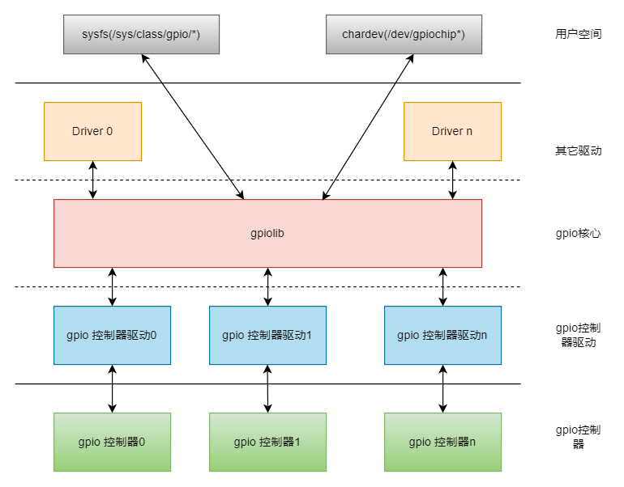

# GPIO
Introduction to the functions and usage of GPIO.
## Module Introduction
GPIO is the controller that manages the gpio module.

### Function Introduction
  

The Linux gpio subsystem driver framework mainly consists of three parts:  
- GPIO controller driver: Interacts with the GPIO controller, initializes and operates the controller  
- gpio lib driver: Provides standard APIs for other modules, such as setting GPIO direction, reading and writing GPIO level state  
- GPIO character device driver: Reports GPIO as character devices to user space, user space can access GPIO through standard file interfaces
### Source Code Structure Introduction
The controller driver code is under the drivers/gpio directory:  
```
|-- gpio-k1x.c  
```
## Key Features
| Feature | Description |
| :-----| :----|
| Supports direction setting | Supports setting GPIO as input or output |
| Supports output high/low level setting | Supports setting GPIO level in output mode |
| Supports gpio interrupt function | Supports rising and falling edge triggered gpio interrupts |
## Configuration Introduction
Mainly includes driver CONFIG enable configuration and dts configuration
### CONFIG Configuration
CONFIG_GPIOLIB provides support for the gpio controller. By default, this option is Y.
```
Device Drivers
        GPIO Support (GPIOLIB [=y])
```
CONFIG_GPIO_K1X provides support for the k1 gpio controller. By default, this option is Y.
```
Device Drivers  
        GPIO Support (GPIOLIB [=y])
                Virtual GPIO drivers  
                        SPACEMIT-K1X GPIO support (GPIO_K1X [=y])
```

## Usage Introduction
The solution's gpio usage is divided into 3 steps.

1. Description of the gpio used in the solution
2. Setting the corresponding pin
3. Usage of gpio

Notes:

1. Pin numbers are defined in the kernel directory: include\dt-bindings\pinctrl\k1-x-pinctrl.h.
2. The same pin configuration means that a group of pins are set to gpio function with the same configuration, i.e., mux mode, pull-up/pull-down, edge detection, and drive strength are the same.

### Solution gpio Description

Used to describe all the gpio used in the solution.

Defined using the linux gpio framework gpio-ranges property. If a segment of gpio corresponds to consecutive pin numbers, it is defined as a group.

Example solution dts file gpio controller definition

```c
&gpio{
        gpio-ranges = <
                &pinctrl 49  GPIO_49  2
                &pinctrl 58  GPIO_58  1
                &pinctrl 63  GPIO_63  5
                &pinctrl 70  PRI_TDI  4
                &pinctrl 74  GPIO_74  1
                &pinctrl 80  GPIO_80  4
                &pinctrl 90  GPIO_90  3
                &pinctrl 96  DVL0     2
                &pinctrl 110 GPIO_110 1
                &pinctrl 114 GPIO_114 3
                &pinctrl 123 GPIO_123 5
        >;
};
```

### gpio pin configuration

Set the pins corresponding to the gpio used in the solution to gpio function and configure (edge detection/pull-up/pull-down/drive strength).

Set using the pinctrl-single,gpio-range property. If there is a segment of consecutive pin numbers with the same configuration, configure as a group.

For pin configuration parameters, refer to [pin configuration parameters](PINCTRL#pin-配置参数).

Example:

```c
&pinctrl {
        pinctrl-single,gpio-range = <
                &range GPIO_49  2 (MUX_MODE0 | EDGE_NONE | PULL_UP   | PAD_3V_DS4)
                &range GPIO_58  1 (MUX_MODE0 | EDGE_NONE | PULL_DOWN | PAD_1V8_DS2)
                &range GPIO_63  2 (MUX_MODE0 | EDGE_NONE | PULL_DOWN | PAD_1V8_DS2)
                &range GPIO_65  1 (MUX_MODE0 | EDGE_NONE | PULL_UP   | PAD_1V8_DS2)
                &range GPIO_66  2 (MUX_MODE0 | EDGE_NONE | PULL_UP   | PAD_3V_DS4)
                &range PRI_TDI  2 (MUX_MODE1 | EDGE_NONE | PULL_UP   | PAD_1V8_DS2)
                &range PRI_TCK  1 (MUX_MODE1 | EDGE_NONE | PULL_DOWN | PAD_1V8_DS2)
                &range PRI_TDO  1 (MUX_MODE1 | EDGE_NONE | PULL_UP   | PAD_1V8_DS2)
                &range GPIO_74  1 (MUX_MODE0 | EDGE_NONE | PULL_UP   | PAD_1V8_DS2)
                &range GPIO_80  1 (MUX_MODE0 | EDGE_NONE | PULL_UP   | PAD_3V_DS4)
                &range GPIO_81  3 (MUX_MODE0 | EDGE_NONE | PULL_UP   | PAD_1V8_DS2)
                &range GPIO_90  1 (MUX_MODE0 | EDGE_NONE | PULL_DOWN | PAD_1V8_DS2)
                &range GPIO_91  2 (MUX_MODE0 | EDGE_NONE | PULL_UP   | PAD_1V8_DS2)
                &range DVL0     2 (MUX_MODE1 | EDGE_NONE | PULL_DOWN | PAD_1V8_DS2)
                &range GPIO_110 1 (MUX_MODE0 | EDGE_NONE | PULL_DOWN | PAD_1V8_DS2)
                &range GPIO_114 1 (MUX_MODE0 | EDGE_NONE | PULL_DOWN | PAD_1V8_DS2)
                &range GPIO_115 1 (MUX_MODE0 | EDGE_NONE | PULL_DOWN | PAD_1V8_DS2)
                &range GPIO_116 1 (MUX_MODE0 | EDGE_NONE | PULL_UP   | PAD_1V8_DS2)
                &range GPIO_123 1 (MUX_MODE0 | EDGE_NONE | PULL_DOWN | PAD_1V8_DS2)
                &range GPIO_124 1 (MUX_MODE0 | EDGE_NONE | PULL_UP   | PAD_1V8_DS2)
                &range GPIO_125 3 (MUX_MODE0 | EDGE_NONE | PULL_DOWN | PAD_1V8_DS2)
        >;
};
```

### gpio Usage

If the solution eth0 uses gpio 110 as the phy reset signal, then eth0 uses gpio 110 as follows.

```c
&eth0 {
    emac,reset-gpio = <&gpio 110 0>;
};
```
## API Introduction

### API Introduction
Request a specified gpio
```
int gpio_request(unsigned gpio, const char *label);
```
Free a requested gpio
```
void gpio_free(unsigned gpio);
```
Set the specified GPIO as input mode
```
int gpio_direction_input(unsigned gpio)
```
Set the specified GPIO as output mode and initial value
```
int gpio_direction_output(unsigned gpio, int value)
```
Set the output value of the specified GPIO
```
void gpio_set_value(unsigned gpio, int value)
```
Get the signal value of the specified GPIO
```
int gpio_get_value(unsigned gpio)
```
Get the interrupt number corresponding to the specified gpio
```
int gpio_to_irq(unsigned gpio)
```
## Debug Introduction
### sysfs
Read and operate GPIO ports
```
/sys/class/gpio
|-- export
|-- gpiochip0 -> ../../devices/gpiochip0/gpio/gpiochip0
|-- gpiochip512 -> ../../devices/platform/soc/d401d800.i2c/i2c-8/8-0041/spacemit-pinctrl@spm8821/gpio/gpiochip512
`-- unexport
```
- export  
Used to notify the system to export the GPIO pin number to be controlled
- unexport  
Used to notify the system to unexport
- gpiochipX  
Detailed information of gpio X
- gpioX/direction  
Direction of gpio X
- gpioX/value  
Port value of gpio X
### debugfs
Displays the gpio controllers in the system and the gpio information they manage.

```
/sys/kernel/debug/gpio
# cat gpio
gpiochip0: GPIOs 0-127, k1x-gpio:
 gpio-63  (                    |reset               ) out lo
 gpio-67  (                    |pwr                 ) out hi
 gpio-80  (                    |cd                  ) in  hi ACTIVE LOW
 gpio-96  (                    |sys-led             ) out lo
 gpio-97  (                    |vbus                ) out hi
 gpio-110 (                    |mdio-reset          ) out hi
 gpio-111 (                    |reset               ) out lo
 gpio-113 (                    |pwdn                ) out lo
 gpio-115 (                    |mdio-reset          ) out hi
 gpio-116 (                    |regon               ) out hi
 gpio-123 (                    |hub                 ) out hi
 gpio-124 (                    |hub                 ) out hi
 gpio-127 (                    |?                   ) out lo

gpiochip1: GPIOs 512-517, parent: platform/spacemit-pinctrl@spm8821, spacemit-pinctrl@spm8821, can sleep:

```
## Test Introduction
Check whether the gpio setting is correct by viewing the register value corresponding to the gpio
```
devmem reg_addr
```
## FAQ