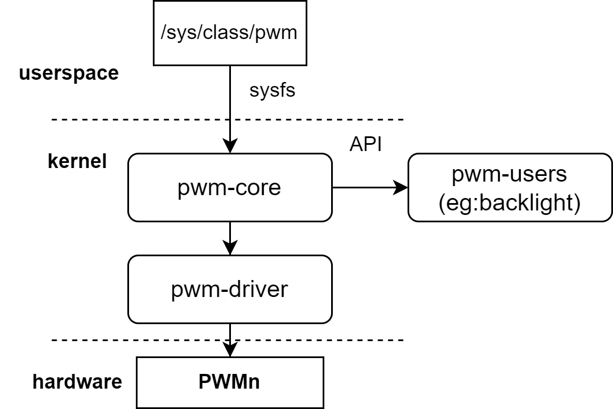

# PWM

Introduction to PWM configuration and debugging methods

## Module Introduction  

The pwm controller is an electronic component that controls the output signal by changing the width of the electrical pulse.  

### Function Introduction  


The kernel provides interfaces through the pwm framework layer so that other modules can request the pwm controller and control the output level of the pwm signal.
For example: kernel fan speed control and backlight brightness can both be controlled by pwm.  

### Source Code Structure Introduction

The pwm controller driver code is under the drivers/pwm directory:  

```
drivers/pwm  
|--core.c            # Kernel pwm framework interface code
|--pwm-sysfs.c       # Kernel pwm framework registration to sysfs code
|--pwm-pxa.c         # k1 pwm driver  
```  

## Key Features  

| Feature |
| :-----|
| Can generate pwm signals from 200HZ to 6.4MHZ |
| k1 platform supports 20 configurable pwm channels |

## Configuration Introduction

Mainly includes driver enable configuration and dts configuration

### CONFIG configuration

CONFIG_PWM
This is to provide support for the kernel platform pwm framework. It should be set to Y when supporting the k1 pwm driver.

```
Symbol: PWM [=y]
Device Drivers
      -> Pulse-Width Modulation (PWM) Support (PWM [=y])
```

After supporting the platform-level pwm framework, configure CONFIG_PWM_PXA to Y to support the k1 pwm driver

```
Symbol: PWM_PXA [=y]
      ->PXA PWM support (PWM_PXA [=y])
```

### dts configuration

Due to the similar usage and configuration methods of the 20 pwm channels, pwm0 is taken as an example here

#### pinctrl

Refer to the configured pwm node in the arch/riscv/boot/dts/spacemit/k1-x_pinctrl.dtsi file of the linux repository, as follows:

```dts
      pinctrl_pwm0_1: pwm0_1_grp {
         pinctrl-single,pins =<
            K1X_PADCONF(GPIO_14, MUX_MODE3, (EDGE_NONE | PULL_UP | PAD_1V8_DS2))    /* pwm0 */
         >;
      };
```

#### dtsi configuration example

Configure the base address and clock reset resources of the pwm controller in the dtsi, normally no changes are required

```dts
1351         pwm0: pwm@d401a000 {
1352             compatible = "spacemit,k1x-pwm";
1353             reg = <0x0 0xd401a000 0x0 0x10>;
1354             #pwm-cells = <1>;
1355             clocks = <&ccu CLK_PWM0>;
1356             resets = <&reset RESET_PWM0>;
1357             k1x,pwm-disable-fd;
1358             status = "disabled";
1359         };
```

#### dts configuration example

The complete dts configuration is as follows

```dts
807 &pwm0 {
808     pinctrl-names = "default";
809     pinctrl-0 = <&pinctrl_pwm0_1>;
810     status = "okay";
811 };
```

## Interface Introduction

### API Introduction

The linux kernel implements the reference and adjustment of pwm for other devices or frameworks such as backlight, led lights, etc.
Commonly used:

```
struct pwm_device *devm_pwm_get(struct device *dev, const char *con_id)
This interface implements the acquisition of pwm resources from the pwm framework
int pwm_apply_state(struct pwm_device *pwm, const struct pwm_state *state)
This interface implements the setting of the pwm state
```

## Debug Introduction

Pwm provides a non-programmable usage method to the user layer through sysfs, which can be tested by connecting the above-mentioned pwm corresponding pin to an adjustable speed fan. The process is as follows
The following is verified based on the bianbu linux system

```sh
# cd /sys/class/pwm/
# ls # Each node represents a led light
pwmchip0  pwmchip1  pwmchip2  pwmchip3  pwmchip4  pwmchip5  pwmchip6

# echo 0 > pwmchip0/export
# ls pwmchip0/pwm0/
capture     enable      polarity    uevent
duty_cycle  period      power

# Set the period of the PWM, in ns, that is, a period of 1KHZ
# echo 1000000 > pwmchip0/pwm0/period 

# Set the PWM duty cycle
# echo 500000 > pwmchip0/pwm0/duty_cycle 

# Enable PWM
# echo 1 > pwmchip0/pwm0/enable 

# Adjust the duty cycle, at this time the fan speed decreases
# echo 50000 > pwmchip0/pwm0/duty_cycle 

# Turn off PWM
# echo 0 > pwmchip0/pwm0/enable 
```

* It should be noted that the available pwmchipx in sysfs are all unused pwms. If the pwm has been申请通过类似pwm_get的接口申请，则该pwm无法通过sysfs配置  

## Test Introduction

The high and low signal levels output by pwm can be adjusted by controlling the duty cycle.  
Actual tests can be conducted using the pwm nodes under sysfs and an adjustable speed pwm fan.

## FAQ
