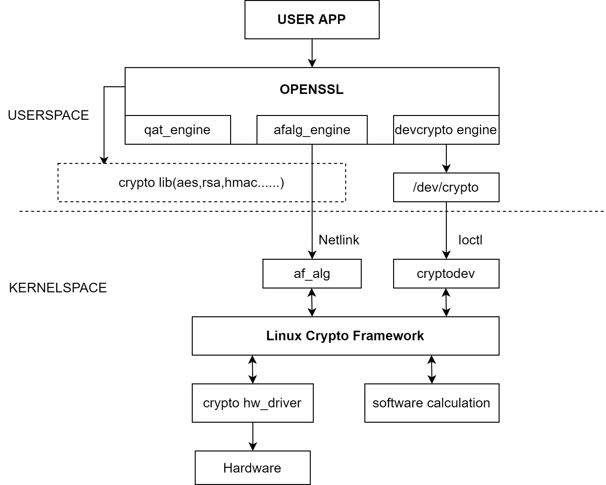

# Crypto-Engine

Introduction to the usage of crypto-engine

## Module Introduction  

The crypto-engine implements hardware encryption algorithms to encrypt plaintext.  

### Function Introduction  


The k1 crypto-engine (also known as ce) implements (ecb/cbc/xts-)aes encryption algorithms in hardware.

### Source Code Structure Introduction

The ce driver code is under drivers/crypto/spacemit:  

```  
drivers/crypto/spacemit
|--spacemit_ce_engine.c            # ce driver code
|--spacemit-ce-glue.c              # encryption algorithms implemented based on ce driver
|--spacemit_engine.h 
```  

The kernel framework layer of crypto is implemented under the kernel crypto path, which is not detailed here.

## Key Features  

### Features

Supports aes encryption algorithms in ecb/cbc/xts modes

### Performance Parameters

Pure hardware performance can reach 500MB/s  
The encryption process implemented by the kernel can reach 280MB/s (for data larger than 128k)

Testing Method:  
openssl speed tool, the maximum data size supported by the openssl tool code is 16k, it can be developed again to change to 128k

```
openssl speed -elapsed -async_jobs 1 -engine afalg -evp aes-128-cbc -multi 1
```

## Configuration Introduction

Mainly including driver enable configuration and dts configuration

### CONFIG Configuration

CONFIG_CRYPTO
This is provided for the kernel platform crypto framework, and should be Y under the support of k1 ce driver

```
CONFIG_CRYPTO=y
CONFIG_SPACEMIT_REE_AES=y
CONFIG_SPACEMIT_REE_ENGINE=y
```

### dts Configuration

The ce has no input and output signals, just configure the clock reset resources in dts

#### dtsi Configuration Example

Configure the base address of the ce controller and the clock reset resources in dtsi, no need to change under normal circumstances

```dts
 spacemit_crypto_engine@d8600000 {
  compatible = "spacemit,crypto_engine";
  spacemit-crypto-engine-0 = <0xd8600000 0x00100000>;
  interrupt-parent = <&intc>;
  interrupts = <113>;
  num-engines = <1>;
  clocks = <&ccu CLK_AES>;
  resets = <&reset RESET_AES>;
  interconnects = <&dram_range5>;
  interconnect-names = "dma-mem";
  status = "okay";
 };
```

## Interface Introduction

### API Introduction

The AES driver mainly implements two APIs for encryption and decryption registered in the crypto framework
Commonly used:

```
Taking cbc as an example
static int cbc_encrypt(struct skcipher_request *req)
This interface implements the hardware cbc mode encryption function of ce
static int cbc_decrypt(struct skcipher_request *req)
This interface implements the hardware cbc mode decryption function of ce
```

## Testing Introduction

First, verify whether the aes algorithm is registered successfully

```
cat /proc/crypto
The result is as follows
name         : xts(aes)
driver       : __driver-xts-aes-spacemit-ce1
module       : kernel
priority     : 500
refcnt       : 1
selftest     : passed
internal     : no
type         : skcipher
async        : yes
blocksize    : 16
min keysize  : 32
max keysize  : 64
ivsize       : 16
chunksize    : 16
walksize     : 16

name         : cbc(aes)
driver       : __driver-cbc-aes-spacemit-ce1
module       : kernel
priority     : 500
refcnt       : 1
selftest     : passed
internal     : no
type         : skcipher
async        : yes
blocksize    : 16
min keysize  : 16
max keysize  : 32
ivsize       : 16
chunksize    : 16
walksize     : 16

name         : ecb(aes)
driver       : __driver-ecb-aes-spacemit-ce1
module       : kernel
priority     : 500
refcnt       : 2
selftest     : passed
internal     : no
type         : skcipher
async        : yes
blocksize    : 16
min keysize  : 16
max keysize  : 32
ivsize       : 16
chunksize    : 16
walksize     : 16
```

The functionality of the encryption algorithm can be tested using the openssl tool, as follows:

```
echo "hello,world" | openssl enc -aes128 -e -a -salt -engine afalg  //Encrypt string
echo "Automatically generated key for encryption" | openssl enc -engine afalg -aes128 -a -d -salt   //Decrypt string
openssl enc -aes128 -e -engine afalg -in data.txt -out encrypt.txt -pass pass:12345678   //Encrypt using a key
openssl enc -aes-cbc -d -engine afalg -in encrypt.txt -out data.txt -pass pass:12345678   //Decrypt using a key
Compare the decrypted string/file with the original data before encryption, if they are the same, the encryption function is normal
```

## FAQ
