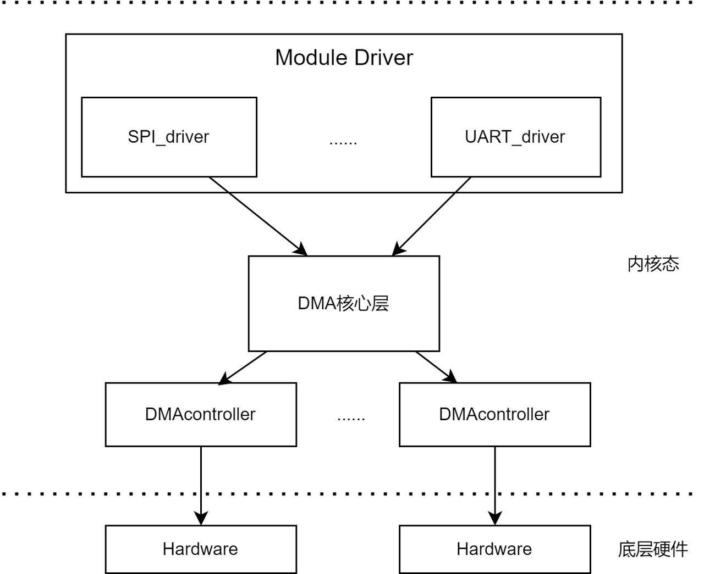

# DMA

Introduction to DMA controller configuration and how dma-slave uses dma

## Module Introduction  

DMA (Direct Memory Access) is a method that allows data transfer between source and destination through hardware without direct CPU control.
This module is the DMA-controller, i.e., DMAmaster, responsible for connecting dma-channels and completing data transfer.

### Function Introduction  


Through the DMA framework and K1 dma controller driver, three transfer directions are implemented: memory to memory, memory to peripheral, and peripheral to memory. It also implements memory copy, scatter-gather transfer, and ring buffer transfer.

### Source Code Structure Introduction

The dma controller driver code is under drivers/dma:  

```  
drivers/dma  
|--dmaengine.c dmaengine.h      # kernel dma framework code
|--dmatest.c         # kernel dma test code
|--mmp_pdma_k1x.c          # k1 dma controller driver  
```  

## Key Features  

### Features

Supports memory to memory, memory to peripheral, and peripheral to memory transfer  
16 channels available  
Burst size supports 8 16 32 64  
Each transfer descriptor supports up to 8191B transfer  

### Performance Parameters

The maximum speed for memory-to-memory data transfer by dma is 220MB/s

Test method: You can use dmatest.c for testing. For details on tool usage, see the debug section.

## Configuration Introduction

Mainly includes driver enable configuration and dts configuration

### CONFIG Configuration

CONFIG_DMADEVICES  
This provides support for the kernel dma framework. If you use the k1 dma driver, it should be Y.

```
Symbol: DMADEVICES [=y]
Device Drivers
      -> DMA Engine support (DMADEVICES [=y])
```

After supporting the platform dma framework, set CONFIG_MMP_PDMA_SPACEMIT_K1X to Y to support the k1 dma controller driver

```
Symbol: MMP_PDMA_SPACEMIT_K1X [=y]
      ->Spacemit mmp_pdma support (MMP_PDMA_SPACEMIT_K1X [=y])
```

### dts Configuration

The usage of dma is to select a channel and specify the source and destination addresses, such as memory to memory, memory to peripheral, etc.
This section introduces the dts configuration to enable the dma controller and the dts configuration for other devices (such as uart) to use dma.

#### dma controller configuration

You can check the linux repo at arch/riscv/boot/dts/spacemit/k1-x.dtsi and refer to the configured dma node as follows:

```dts
    pdma0: pdma@d4000000 {
  compatible = "spacemit,pdma-1.0";
  reg = <0x0 0xd4000000 0x0 0x4000>;
  interrupts = <72>;
  interrupt-parent = <&intc>;
  clocks = <&ccu CLK_DMA>;
  resets = <&reset RESET_DMA>;
  #dma-cells= <2>;
  #dma-channels = <16>;
  max-burst-size = <64>;
  reserved-channels = <15 45>;
  power-domains = <&power K1X_PMU_BUS_PWR_DOMAIN>;
  clk,pm-runtime,no-sleep;
  cpuidle,pm-runtime,sleep;
  interconnects = <&dram_range4>;
  interconnect-names = "dma-mem";
  status = "ok";
 };
```

This node configures the dma clock/reset resources, number of channels, maximum burst size, and reserves channel 15 for the device with handshake number 45.

#### dma-slave usage configuration example

Take uart0 as an example. Add the following properties under the uart0 node. The macros DMA_UART0_RX and DMA_UART0_TX are defined in include/dt-bindings/dma/k1x-dmac.h.

```dts
 dmas = <&pdma0 DMA_UART0_RX 1
   &pdma0 DMA_UART0_TX 1>;
 dma-names = "rx", "tx";
```

## API Description

### API Introduction

The Linux kernel implements interfaces for requesting dma channels, configuring dma transfers, preparing resources, starting transfers, etc.
Commonly used:

```
Request channel
struct dma_chan *dma_request_chan(struct device *dev, const char *name)
Configure channel parameters, such as transfer width, data amount, source/destination address
static inline int dmaengine_slave_config(struct dma_chan *chan,
                                          struct dma_slave_config *config)
The following three interfaces prepare resources before dma transfer starts
dmaengine_prep_dma_memcpy
dmaengine_prep_slave_sg
dmaengine_prep_dma_cyclic
Add descriptor to the transfer task list
static inline dma_cookie_t dmaengine_submit(struct dma_async_tx_descriptor *desc)
Start transfer
static inline void dma_async_issue_pending(struct dma_chan *chan)
Release channel
static inline void dma_release_channel(struct dma_chan *chan)
Stop transfer, e.g. pause during audio playback
static inline int dmaengine_terminate_all(struct dma_chan *chan)
```

## Test Introduction

Since data paths such as memory to device or device to memory require cooperation from peripheral drivers (e.g., uart0 needs to move data from memory to uart tx fifo via dma when sending data, and dma needs uart to control the start), memory-to-memory data path is generally used for testing. You can directly use the kernel's dmatest.c program.

```
echo dma0chan8 > /sys/module/dmatest/parameters/channel  # select an unused channel
echo 1 > /sys/module/dmatest/parameters/iterations  # set the number of transfers, here 1 as an example
echo 4096 > /sys/module/dmatest/parameters/transfer_size # set the transfer data size (no more than 16k)
echo 1 > /sys/module/dmatest/parameters/run   # start transfer
```

First enable the kernel config: CONFIG_DMATEST, then generate new firmware and boot into the kernel

## FAQ
