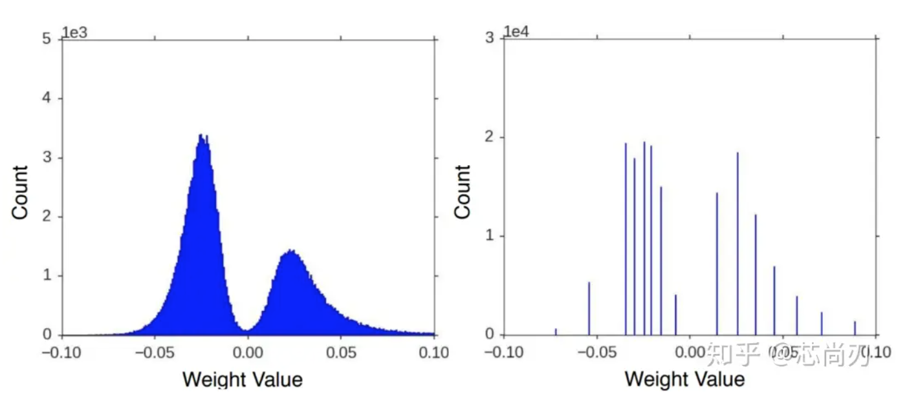

# 在PI One上运行手写数字识别【2】
上文介绍了利用mnist数据集进行模型训练，现在我们来把训练得到的模型转换成tflite便可以在PI One上运行。

注：源码可在 [bit-brick'github](https://github.com/bit-brick/ML_DEMO) 中下载。

## 模型量化
 关于模型量化的知识，参考：[Tensorflow模型量化(Quantization)原理及其实现方法 -
知乎 (zhihu.com)](https://zhuanlan.zhihu.com/p/79744430)

模型量化即以较低的推理精度损失将连续取值的浮点型模型权重近似（通常为int8）为有限多个离散值的过程，它是以更少位数的数据类型用于近似表示32位有限范围浮点型数据的过程，从而达到减少模型尺寸大小、减少模型内存消耗及加快模型推理速度等目标。

## 转换量化模型

把保存下来的模型`mnist_model.h5`用下面的脚本进行转换,转换成为可在PI One 上运行的`mnist_model_quantized.tflite`。
~~~
# convert_to_tflite.py

import tensorflow as tf

import numpy as np
def representative_dataset_gen():
    for _ in range(250):
        yield [np.random.uniform(0.0, 1.0, size=(1, 28, 28, 1)).astype(np.float32)] #需要輸入端大小
        

def convert_model_to_tflite(model_path, output_tflite_path):
    """
    Converts a saved Keras model to TFLite format with post-training quantization.
    
    Args:
        model_path (str): Path to the saved Keras model.
        output_tflite_path (str): Path where the TFLite model will be saved.
    """
    # Load the saved model
    model = tf.keras.models.load_model(model_path)
    
    # Convert the model to TFLite format with post-training quantization
    converter = tf.lite.TFLiteConverter.from_keras_model(model)
    converter.target_spec.supported_ops = [tf.lite.OpsSet.TFLITE_BUILTINS_INT8]
    converter.inference_input_type  = tf.float32
    converter.inference_output_type = tf.float32
    converter.representative_dataset = representative_dataset_gen
    tflite_model = converter.convert()
    
    # Save the TFLite model
    with open(output_tflite_path, 'wb') as f:
        f.write(tflite_model)
        
    print(f"Quantized TFLite model saved at {output_tflite_path}")

# Call the function with your paths
convert_model_to_tflite('mnist_model.h5', 'mnist_model_quantized.tflite')
~~~

## 测试模型
把下面的脚本`predict_tflite.py`放在`mnist_model_quantized.tflite`和`test_images`同级的文件夹下，然后运行`predict_tflite.py`

~~~
import tensorflow as tf
from PIL import Image
import numpy as np
import os

class Predict(object):
    def __init__(self):
        print("Current working directory:", os.getcwd())
        checkpoint_dir = './'
        tflite_model_path = os.path.join(checkpoint_dir, 'mnist_model_quantized.tflite')  # 使用TFLite模型文件

        # 加载TFLite模型，并启用npu加速
        self.interpreter = tf.lite.Interpreter(model_path=tflite_model_path,experimental_delegates=[ tflite.load_delegate("/usr/lib/libvx_delegate.so") ])
        self.interpreter.allocate_tensors()

        # 获取输入输出张量的索引
        self.input_details = self.interpreter.get_input_details()
        self.output_details = self.interpreter.get_output_details()

    def predict(self, image_path):
        # 以黑白方式读取图片
        img = Image.open(image_path).convert('L')
        img = np.reshape(img, (28, 28, 1)) / 255.
        x = np.array([1 - img], dtype=np.float32)  # 确保数据类型匹配

        # 设置TFLite模型的输入张量
        self.interpreter.set_tensor(self.input_details[0]['index'], x)
        # 运行预测
        self.interpreter.invoke()
        # 获取输出张量
        output_data = self.interpreter.get_tensor(self.output_details[0]['index'])

        # 因为x只传入了一张图片，取output_data[0]即可
        # np.argmax()取得最大值的下标，即代表的数字
        print(image_path)
        print(output_data[0])
        print('        -> Predict digit', np.argmax(output_data[0]))

if __name__ == "__main__":
    app = Predict()
    app.predict('./test_images/0.png')
    app.predict('./test_images/1.png')
    app.predict('./test_images/4.png')
~~~
执行结果如下

~~~
 python3 predict_tflite.py 
Current working directory: /home/root/ml/mnist
Vx delegate: allowed_cache_mode set to 0.
Vx delegate: device num set to 0.
Vx delegate: allowed_builtin_code set to 0.
Vx delegate: error_during_init set to 0.
Vx delegate: error_during_prepare set to 0.
Vx delegate: error_during_invoke set to 0.
W [HandleLayoutInfer:281]Op 162: default layout inference pass.
./test_images/0.png
[9.99998033e-01 1.54955798e-10 3.32483268e-08 2.28747174e-10
 7.21547755e-09 2.97328828e-10 9.07767628e-07 8.88619178e-11
 1.11085605e-07 7.94680602e-07]
        -> Predict digit 0
./test_images/1.png
[3.2026843e-08 9.9998003e-01 4.3477826e-08 3.4642383e-10 1.4214998e-05
 6.9245937e-10 1.2963221e-07 4.5330289e-06 8.9890534e-07 7.5559171e-08]
        -> Predict digit 1
./test_images/4.png
[1.4660953e-11 2.9138798e-06 2.1164739e-07 5.3843197e-09 9.9998480e-01
 2.7903857e-09 1.0421110e-09 1.6107944e-07 1.0431833e-07 1.1799651e-05]
        -> Predict digit 4

~~~

可以看到，识别的结果准确。