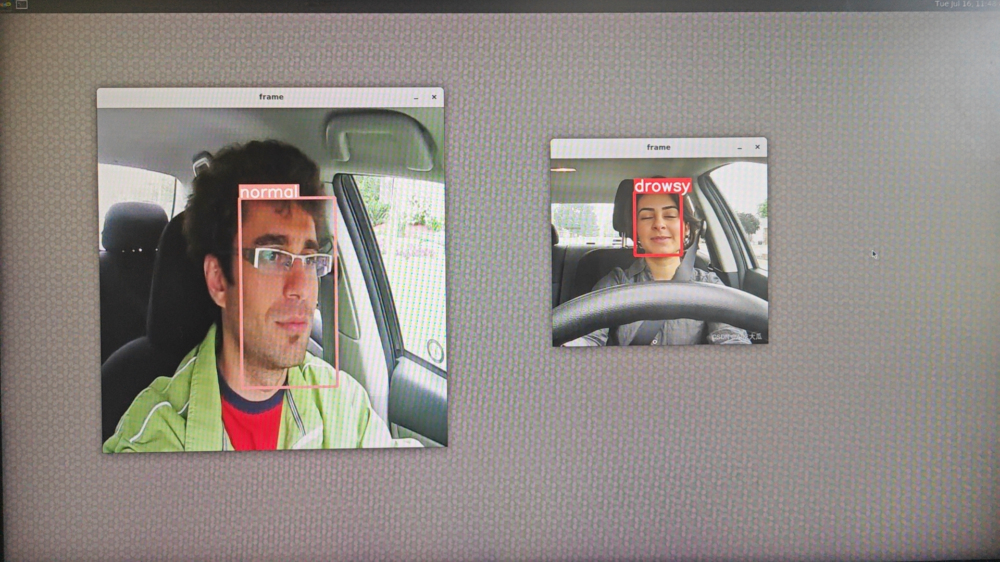

# 快速在 PI One 实现基于 YOLOv5s 疲劳驾驶监控系统 (DMS)

## 一、概述

在当今这个人工智能全面崛起的时代，**计算机视觉(Computer Vision)** 领域经历了一场划时代的变革。过去，我们依赖逐像素的处理技术来解析图像，但现在，这一切都被大数据驱动的 **深度学习(Deep Learning)** 所取代。这种方法利用庞大的数据集来训练所谓的「模型(Model)」，从而实现更为精准和高效的图像识别。在这股浪潮中，生成式 (Generative AI) 人工智能和 ChatGPT 等技术的出现，更是颠覆了我们对于人工智能的想象，智能化的设备不再是遥不可及的梦想，而是触手可及的现实。尤其搭配 NXP i.MX8M Plus 平台，使得边缘计算 (Edge Computing) 结合对象识别 **YOLO** 算法更加高效和普及。

## 二、YOLO技术

YOLO（You Only Look Once）技术应运而生，它是一种革命性的对象检测技术，能够在单次扫描图像的过程中同时识别多个对象，极大地提升了处理速度与准确率。YOLO的应用场景极为广泛，从自动驾驶到安全监控系统，都能见到它的身影。过去，学者和工程师们耗费无数心血研发的复杂系统，如今在 ultralytics 社区的加持下，即可通过一些简单的步骤轻松实现。

## 三、开发环境搭建

开发平台的第一步就是如何建立 NXP 嵌入式系统的开发环境。若不懂此技术的读者可以阅读此 [Getting Start](https://docs.bit-brick.com/docs/pi-one/getting-started/preparation) 来快速部署 **PI One**  开发环境。

## 四、疲劳驾驶监控系统 (DMS) 的构建

本篇文章将使用 Google 的 Colab 云端运算作为训练平台，并搭配 ultralytics 的 YOLOv5 框架与 Roboflow 提供的数据库来快速建置一套疲劳驾驶监控系统 (DMS) 来监视驾驶者是否呈现瞌睡状态，并以 Pi One作为最终的硬件呈现平台。

    


1. **开启 Colab 云端运算平台，并选用 GPU 作为处理核心**。
   
2. **下载 ultralytics 代码 (YOLOv5 框架)**。
   ~~~
    !git clone https://github.com/ultralytics/yolov5 
   ~~~
3. **安装必要套件**。
   ~~~
    %cd yolov5
    %pip install -qr requirements.txt # install dependencies
    %pip install -q roboflow
   ~~~
4. **安装 Roboflow**。
   
   Roboflow 是个线上资料管理平台，具有标记影像资料、数据增强等等功能。
   ~~~
    !pip install roboflow
   ~~~
5. **下载 DataBase**。
   ~~~
    from roboflow import Roboflow
    rf = Roboflow(api_key="********")
    project = rf.workspace("drowsiness-detection-uhhz5").project("drownsy-dectetion-v2")
    version = project.version(5)
    dataset = version.download("yolov5pytorch")
   ~~~
   此步骤，请先到 roboflow 网站的 [drownsy-dectetion-v2](https://universe.roboflow.com/drowsiness-detection-uhhz5/drownsy-dectetion-v2) ，依照下图操作去的相应的 API Key 。
   
6. **训练 AI 模型**。
   
   ~~~
        !python train.py --img 256 --batch 16 --epochs 20 --data {dataset.location}/data.yaml --weights yolov5s.pt --cache
   ~~~
   
7. **验证 AI 模型**。
   ~~~
        !python detect.py --weights /content/yolov5/runs/train/exp/weights/best.pt  \
        --img 256 --conf 0.1 --source {dataset.location}/test/images
   ~~~
   
   

   Note : 请到 /content/yolov5/runs/detect 查看测试结果。 
8. **输出 AI 模型**
   将 Pytorch 模块转换成 Tensorflow Lite 的形式。
   ~~~
        !python export.py --weights /content/yolov5/runs/train/exp/weights/best.pt --img-size 256 --include tflite
   ~~~
   
9.  **输出 AI 模型 (量化整数版)**
    
    将 Tensorflow 转换成 Tensorflow Lite 模组，并且将 权重(weights) 量化成整数形式。
    ~~~
    # Tensorflow to TF Lite  (INT)
    import tensorflow as tf
    import numpy as np
    def representative_dataset_gen(): # 模擬數據集 (已亂隨構成的測試集會影像精準度)
        for _ in range(250):
            yield [np.random.uniform(0.0, 1.0 , size=(1,256,256,3)).astype(np.float32)]

    converter = tf.lite.TFLiteConverter.from_saved_model("/content/yolov5/runs/train/exp/weights/best_saved_model")
    converter.optimizations = [tf.lite.Optimize.DEFAULT]
    converter.target_spec.supported_ops = [tf.lite.OpsSet.TFLITE_BUILTINS_INT8]
    converter.allow_custom_ops = True
    converter.inference_input_type  = tf.float32
    converter.inference_output_type = tf.float32
    converter.representative_dataset = representative_dataset_gen
    tflite_model = converter.convert()
    with tf.io.gfile.GFile("DrownsyDectetion_v2-quant.tflite", 'wb') as f:
    f.write(tflite_model)
    print("Quantization complete! - model.tflite")
    ~~~
    

## 五、在 PI One 平台上运行

最后仅需将模块部署至 PI One，即可实现终端边缘运算应用「疲劳驾驶监控系统 (DMS)」! 下列代码，请于 PI One 平台的系统中操作。

Note: 可在[bit-brick'github](https://github.com/bit-brick/ML_DEMO/tree/main)上快速获取此案例代码
1. 建立项目目录
~~~
mkdir YOLOv5s_DrownsyDection_v2
cd YOLOv5s_DrownsyDection_v2
mkdir model img output
~~~
2. 复制测试图片和模型文件
~~~
cp DrownsyDection_v2-quant.tflite /home/root/YOLOv5s_DrownsyDection_v2/model
cp test.jpg /home/root/YOLOv5s_DrownsyDection_v2/img
~~~
3. 创建 plot.py 和 app.py 脚本
plot.py 包含用于绘制预测结果的辅助函数。
app.py 是应用程序的主脚本，包含模型加载、推理和结果展示的逻辑。

plot.py
~~~
import cv2
import torch
import numpy as np
from PIL import Image, ImageDraw, ImageFont

FONT = 'Arial.ttf' 

class Colors:
    # Ultralytics color palette https://ultralytics.com/
    def __init__(self):
        # hex = matplotlib.colors.TABLEAU_COLORS.values()
        hexs = ('FF3838', 'FF9D97', 'FF701F', 'FFB21D', 'CFD231', '48F90A', '92CC17', '3DDB86', '1A9334', '00D4BB',
                '2C99A8', '00C2FF', '344593', '6473FF', '0018EC', '8438FF', '520085', 'CB38FF', 'FF95C8', 'FF37C7')
        self.palette = [self.hex2rgb(f'#{c}') for c in hexs]
        self.n = len(self.palette)

    def __call__(self, i, bgr=False):
        c = self.palette[int(i) % self.n]
        return (c[2], c[1], c[0]) if bgr else c

    @staticmethod
    def hex2rgb(h):  # rgb order (PIL)
        return tuple(int(h[1 + i:1 + i + 2], 16) for i in (0, 2, 4))

colors = Colors()  # create instance for 'from utils.plots import colors'

def check_pil_font(font=FONT, size=10):
    # Return a PIL TrueType Font, downloading to CONFIG_DIR if necessary
    font = Path(font)
    font = font if font.exists() else (CONFIG_DIR / font.name)
    try:
        return ImageFont.truetype(str(font) if font.exists() else font.name, size)
    except Exception:  # download if missing
        try:
            check_font(font)
            return ImageFont.truetype(str(font), size)
        except TypeError:
            check_requirements('Pillow>=8.4.0')  # known issue https://github.com/ultralytics/yolov5/issues/5374
        except URLError:  # not online
            return ImageFont.load_default()

def is_ascii(s=''):
    # Is string composed of all ASCII (no UTF) characters? (note str().isascii() introduced in python 3.7)
    s = str(s)  # convert list, tuple, None, etc. to str
    return len(s.encode().decode('ascii', 'ignore')) == len(s)

class Annotator:
    # YOLOv5 Annotator for train/val mosaics and jpgs and detect/hub inference annotations
    def __init__(self, im, line_width=None, font_size=None, font='Arial.ttf', pil=False, example='abc'):
        assert im.data.contiguous, 'Image not contiguous. Apply np.ascontiguousarray(im) to Annotator() input images.'
        non_ascii = not is_ascii(example)  # non-latin labels, i.e. asian, arabic, cyrillic
        self.pil = pil or non_ascii
        if self.pil:  # use PIL
            self.im = im if isinstance(im, Image.Image) else Image.fromarray(im)
            self.draw = ImageDraw.Draw(self.im)
            self.font = check_pil_font(font='Arial.Unicode.ttf' if non_ascii else font,
                                       size=font_size or max(round(sum(self.im.size) / 2 * 0.035), 12))
        else:  # use cv2
            self.im = im
        self.lw = line_width or max(round(sum(im.shape) / 2 * 0.003), 2)  # line width

    def box_label(self, box, label='', color=(128, 128, 128), txt_color=(255, 255, 255)):
        # Add one xyxy box to image with label
        if self.pil or not is_ascii(label):
            self.draw.rectangle(box, width=self.lw, outline=color)  # box
            if label:
                w, h = self.font.getsize(label)  # text width, height (WARNING: deprecated) in 9.2.0
                # _, _, w, h = self.font.getbbox(label)  # text width, height (New)
                outside = box[1] - h >= 0  # label fits outside box
                self.draw.rectangle(
                    (box[0], box[1] - h if outside else box[1], box[0] + w + 1,
                     box[1] + 1 if outside else box[1] + h + 1),
                    fill=color,
                )
                # self.draw.text((box[0], box[1]), label, fill=txt_color, font=self.font, anchor='ls')  # for PIL>8.0
                self.draw.text((box[0], box[1] - h if outside else box[1]), label, fill=txt_color, font=self.font)
        else:  # cv2
            p1, p2 = (int(box[0]), int(box[1])), (int(box[2]), int(box[3]))
            cv2.rectangle(self.im, p1, p2, color, thickness=self.lw, lineType=cv2.LINE_AA)
            if label:
                tf = max(self.lw - 1, 1)  # font thickness
                w, h = cv2.getTextSize(label, 0, fontScale=self.lw / 3, thickness=tf)[0]  # text width, height
                outside = p1[1] - h >= 3
                p2 = p1[0] + w, p1[1] - h - 3 if outside else p1[1] + h + 3
                cv2.rectangle(self.im, p1, p2, color, -1, cv2.LINE_AA)  # filled
                cv2.putText(self.im,
                            label, (p1[0], p1[1] - 2 if outside else p1[1] + h + 2),
                            0,
                            self.lw / 3,
                            txt_color,
                            thickness=tf,
                            lineType=cv2.LINE_AA)

    def masks(self, masks, colors, im_gpu, alpha=0.5, retina_masks=False):
        """Plot masks at once.
        Args:
            masks (tensor): predicted masks on cuda, shape: [n, h, w]
            colors (List[List[Int]]): colors for predicted masks, [[r, g, b] * n]
            im_gpu (tensor): img is in cuda, shape: [3, h, w], range: [0, 1]
            alpha (float): mask transparency: 0.0 fully transparent, 1.0 opaque
        """
        if self.pil:
            # convert to numpy first
            self.im = np.asarray(self.im).copy()
        if len(masks) == 0:
            self.im[:] = im_gpu.permute(1, 2, 0).contiguous().cpu().numpy() * 255
        colors = torch.tensor(colors, device=im_gpu.device, dtype=torch.float32) / 255.0
        colors = colors[:, None, None]  # shape(n,1,1,3)
        masks = masks.unsqueeze(3)  # shape(n,h,w,1)
        masks_color = masks * (colors * alpha)  # shape(n,h,w,3)

        inv_alph_masks = (1 - masks * alpha).cumprod(0)  # shape(n,h,w,1)
        mcs = (masks_color * inv_alph_masks).sum(0) * 2  # mask color summand shape(n,h,w,3)

        im_gpu = im_gpu.flip(dims=[0])  # flip channel
        im_gpu = im_gpu.permute(1, 2, 0).contiguous()  # shape(h,w,3)
        im_gpu = im_gpu * inv_alph_masks[-1] + mcs
        im_mask = (im_gpu * 255).byte().cpu().numpy()
        self.im[:] = im_mask if retina_masks else scale_image(im_gpu.shape, im_mask, self.im.shape)
        if self.pil:
            # convert im back to PIL and update draw
            self.fromarray(self.im)

    def rectangle(self, xy, fill=None, outline=None, width=1):
        # Add rectangle to image (PIL-only)
        self.draw.rectangle(xy, fill, outline, width)

    def text(self, xy, text, txt_color=(255, 255, 255), anchor='top'):
        # Add text to image (PIL-only)
        if anchor == 'bottom':  # start y from font bottom
            w, h = self.font.getsize(text)  # text width, height
            xy[1] += 1 - h
        self.draw.text(xy, text, fill=txt_color, font=self.font)

    def fromarray(self, im):
        # Update self.im from a numpy array
        self.im = im if isinstance(im, Image.Image) else Image.fromarray(im)
        self.draw = ImageDraw.Draw(self.im)

    def result(self):
        # Return annotated image as array
        return np.asarray(self.im)

~~~

app.py
~~~
# WPI Confidential Proprietary
#--------------------------------------------------------------------------------------
# Copyright (c) 2021 Freescale Semiconductor
# Copyright 2021 WPI
# All Rights Reserved
##--------------------------------------------------------------------------------------
# * Code Ver : 2.0
# * Code Date: 2023/04/26
# * Author   : Weilly Li
#--------------------------------------------------------------------------------------
# THIS SOFTWARE IS PROVIDED BY WPI-TW "AS IS" AND ANY EXPRESSED OR
# IMPLIED WARRANTIES, INCLUDING, BUT NOT LIMITED TO, THE IMPLIED WARRANTIES
# OF MERCHANTABILITY AND FITNESS FOR A PARTICULAR PURPOSE ARE DISCLAIMED.
# IN NO EVENT SHALL WPI OR ITS CONTRIBUTORS BE LIABLE FOR ANY DIRECT,
# INDIRECT, INCIDENTAL, SPECIAL, EXEMPLARY, OR CONSEQUENTIAL DAMAGES
# (INCLUDING, BUT NOT LIMITED TO, PROCUREMENT OF SUBSTITUTE GOODS OR
# SERVICES; LOSS OF USE, DATA, OR PROFITS; OR BUSINESS INTERRUPTION)
# HOWEVER CAUSED AND ON ANY THEORY OF LIABILITY, WHETHER IN CONTRACT,
# STRICT LIABILITY, OR TORT (INCLUDING NEGLIGENCE OR OTHERWISE) ARISING
# IN ANY WAY OUT OF THE USE OF THIS SOFTWARE, EVEN IF ADVISED OF
# THE POSSIBILITY OF SUCH DAMAGE.
#--------------------------------------------------------------------------------------
# References:
# https://github.com/ultralytics/yolov5
# 


import sys
import cv2
import torch
import torchvision
import time
import argparse
import numpy as np
import tflite_runtime.interpreter as tflite
from plots import Annotator, colors

# V4L2_YUV2_720p = "v4l2src device=/dev/video2 ! video/x-raw,format=YUY2,width=1280,height=720, pixel-aspect-ratio=1/1, framerate=30/1! videoscale!videoconvert ! appsink"
V4L2_YUV2_720p = "/dev/video5"

# --------------------------------------------------------------------------------------------------------------
# API
# --------------------------------------------------------------------------------------------------------------
def InferenceDelegate( model, delegate ):
    if (delegate=="vx") :
        interpreter = tflite.Interpreter(model, experimental_delegates=[ tflite.load_delegate("/usr/lib/libvx_delegate.so") ])
    elif(delegate=="ethosu"):
        interpreter = tflite.Interpreter(model, experimental_delegates=[tflite.load_delegate("/usr/lib/libethosu_delegate.so")])
    elif(delegate=="xnnpack"):
        interpreter = tflite.Interpreter(model)
    else :
        print("ERROR : Deleget Input Fault")
        return 0
    return interpreter

def Label_name(x):
    names = {0:'drowsy', 1:'normal'}
    return names[x]

def xywh2xyxy(x):
    # Convert nx4 boxes from [x, y, w, h] to [x1, y1, x2, y2] where xy1=top-left, xy2=bottom-right
    y = x.clone() if isinstance(x, torch.Tensor) else np.copy(x)
    y[..., 0] = x[..., 0] - x[..., 2] / 2  # top left x
    y[..., 1] = x[..., 1] - x[..., 3] / 2  # top left y
    y[..., 2] = x[..., 0] + x[..., 2] / 2  # bottom right x
    y[..., 3] = x[..., 1] + x[..., 3] / 2  # bottom right y
    return y

def non_max_suppression(
        prediction,
        conf_thres=0.25,
        iou_thres=0.45,
        classes=None,
        agnostic=False,
        multi_label=False,
        labels=(),
        max_det=300,
        nm=0,  # number of masks
):
    """Non-Maximum Suppression (NMS) on inference results to reject overlapping detections

    Returns:
         list of detections, on (n,6) tensor per image [xyxy, conf, cls]
    """

    # Checks
    assert 0 <= conf_thres <= 1, f'Invalid Confidence threshold {conf_thres}, valid values are between 0.0 and 1.0'
    assert 0 <= iou_thres <= 1, f'Invalid IoU {iou_thres}, valid values are between 0.0 and 1.0'
    if isinstance(prediction, (list, tuple)):  # YOLOv5 model in validation model, output = (inference_out, loss_out)
        prediction = prediction[0]  # select only inference output

    device = prediction.device
    mps = 'mps' in device.type  # Apple MPS
    if mps:  # MPS not fully supported yet, convert tensors to CPU before NMS
        prediction = prediction.cpu()
    bs = prediction.shape[0]  # batch size
    nc = prediction.shape[2] - nm - 5  # number of classes
    xc = prediction[..., 4] > conf_thres  # candidates

    # Settings
    # min_wh = 2  # (pixels) minimum box width and height
    max_wh = 7680  # (pixels) maximum box width and height
    max_nms = 30000  # maximum number of boxes into torchvision.ops.nms()
    time_limit = 0.5 + 0.05 * bs  # seconds to quit after
    redundant = True  # require redundant detections
    multi_label &= nc > 1  # multiple labels per box (adds 0.5ms/img)
    merge = False  # use merge-NMS

    t = time.time()
    mi = 5 + nc  # mask start index
    output = [torch.zeros((0, 6 + nm), device=prediction.device)] * bs
    for xi, x in enumerate(prediction):  # image index, image inference
        # Apply constraints
        # x[((x[..., 2:4] < min_wh) | (x[..., 2:4] > max_wh)).any(1), 4] = 0  # width-height
        x = x[xc[xi]]  # confidence

        # Cat apriori labels if autolabelling
        if labels and len(labels[xi]):
            lb = labels[xi]
            v = torch.zeros((len(lb), nc + nm + 5), device=x.device)
            v[:, :4] = lb[:, 1:5]  # box
            v[:, 4] = 1.0  # conf
            v[range(len(lb)), lb[:, 0].long() + 5] = 1.0  # cls
            x = torch.cat((x, v), 0)

        # If none remain process next image
        if not x.shape[0]:
            continue

        # Compute conf
        x[:, 5:] *= x[:, 4:5]  # conf = obj_conf * cls_conf

        # Box/Mask
        box = xywh2xyxy(x[:, :4])  # center_x, center_y, width, height) to (x1, y1, x2, y2)
        mask = x[:, mi:]  # zero columns if no masks

        # Detections matrix nx6 (xyxy, conf, cls)
        if multi_label:
            i, j = (x[:, 5:mi] > conf_thres).nonzero(as_tuple=False).T
            x = torch.cat((box[i], x[i, 5 + j, None], j[:, None].float(), mask[i]), 1)
        else:  # best class only
            conf, j = x[:, 5:mi].max(1, keepdim=True)
            x = torch.cat((box, conf, j.float(), mask), 1)[conf.view(-1) > conf_thres]

        # Filter by class
        if classes is not None:
            x = x[(x[:, 5:6] == torch.tensor(classes, device=x.device)).any(1)]

        # Apply finite constraint
        # if not torch.isfinite(x).all():
        #     x = x[torch.isfinite(x).all(1)]

        # Check shape
        n = x.shape[0]  # number of boxes
        if not n:  # no boxes
            continue
        x = x[x[:, 4].argsort(descending=True)[:max_nms]]  # sort by confidence and remove excess boxes

        # Batched NMS
        c = x[:, 5:6] * (0 if agnostic else max_wh)  # classes
        boxes, scores = x[:, :4] + c, x[:, 4]  # boxes (offset by class), scores
        i = torchvision.ops.nms(boxes, scores, iou_thres)  # NMS
        i = i[:max_det]  # limit detections
        if merge and (1 < n < 3E3):  # Merge NMS (boxes merged using weighted mean)
            # update boxes as boxes(i,4) = weights(i,n) * boxes(n,4)
            iou = box_iou(boxes[i], boxes) > iou_thres  # iou matrix
            weights = iou * scores[None]  # box weights
            x[i, :4] = torch.mm(weights, x[:, :4]).float() / weights.sum(1, keepdim=True)  # merged boxes
            if redundant:
                i = i[iou.sum(1) > 1]  # require redundancy

        output[xi] = x[i]
        if mps:
            output[xi] = output[xi].to(device)
        if (time.time() - t) > time_limit:
            #LOGGER.warning(f'WARNING ⚠️ NMS time limit {time_limit:.3f}s exceeded')
            break  # time limit exceeded

    return output

def clip_boxes(boxes, shape):
    # Clip boxes (xyxy) to image shape (height, width)
    if isinstance(boxes, torch.Tensor):  # faster individually
        boxes[..., 0].clamp_(0, shape[1])  # x1
        boxes[..., 1].clamp_(0, shape[0])  # y1
        boxes[..., 2].clamp_(0, shape[1])  # x2
        boxes[..., 3].clamp_(0, shape[0])  # y2
    else:  # np.array (faster grouped)
        boxes[..., [0, 2]] = boxes[..., [0, 2]].clip(0, shape[1])  # x1, x2
        boxes[..., [1, 3]] = boxes[..., [1, 3]].clip(0, shape[0])  # y1, y2

def scale_boxes(img1_shape, boxes, img0_shape, ratio_pad=None):
    # Rescale boxes (xyxy) from img1_shape to img0_shape
    if ratio_pad is None:  # calculate from img0_shape
        gain = min(img1_shape[0] / img0_shape[0], img1_shape[1] / img0_shape[1])  # gain  = old / new
        pad = (img1_shape[1] - img0_shape[1] * gain) / 2, (img1_shape[0] - img0_shape[0] * gain) / 2  # wh padding
    else:
        gain = ratio_pad[0][0]
        pad = ratio_pad[1]

    boxes[..., [0, 2]] -= pad[0]  # x padding
    boxes[..., [1, 3]] -= pad[1]  # y padding
    boxes[..., :4] /= gain
    clip_boxes(boxes, img0_shape)
    return boxes

def letterbox(im, new_shape=(640, 640), color=(114, 114, 114), auto=True, scaleFill=False, scaleup=True, stride=32):
    # Resize and pad image while meeting stride-multiple constraints
    shape = im.shape[:2]  # current shape [height, width]
    if isinstance(new_shape, int):
        new_shape = (new_shape, new_shape)

    # Scale ratio (new / old)
    r = min(new_shape[0] / shape[0], new_shape[1] / shape[1])
    if not scaleup:  # only scale down, do not scale up (for better val mAP)
        r = min(r, 1.0)

    # Compute padding
    ratio = r, r  # width, height ratios
    new_unpad = int(round(shape[1] * r)), int(round(shape[0] * r))
    dw, dh = new_shape[1] - new_unpad[0], new_shape[0] - new_unpad[1]  # wh padding
    if auto:  # minimum rectangle
        dw, dh = np.mod(dw, stride), np.mod(dh, stride)  # wh padding
    elif scaleFill:  # stretch
        dw, dh = 0.0, 0.0
        new_unpad = (new_shape[1], new_shape[0])
        ratio = new_shape[1] / shape[1], new_shape[0] / shape[0]  # width, height ratios

    dw /= 2  # divide padding into 2 sides
    dh /= 2

    if shape[::-1] != new_unpad:  # resize
        im = cv2.resize(im, new_unpad, interpolation=cv2.INTER_LINEAR)
    top, bottom = int(round(dh - 0.1)), int(round(dh + 0.1))
    left, right = int(round(dw - 0.1)), int(round(dw + 0.1))
    im = cv2.copyMakeBorder(im, top, bottom, left, right, cv2.BORDER_CONSTANT, value=color)  # add border
    return im, ratio, (dw, dh)
# --------------------------------------------------------------------------------------------------------------
# 主程式
# --------------------------------------------------------------------------------------------------------------
def main():

    # 解析外部資訊
    APP_NAME = "YOLOv5s_DrownsyDectetion_v2"
    parser = argparse.ArgumentParser()
    parser.add_argument( '-c' ,"--camera", default="0")
    parser.add_argument( '-d' ,"--display", default="0")
    parser.add_argument("--save", default="1")

    parser.add_argument( '-t', "--time", default="0")
    parser.add_argument('--delegate' , default="vx", help = 'Please Input vx or xnnpack or ethosu')  
    parser.add_argument( '-m', '--model'   , default="model/DrownsyDectetion_v2-quant.tflite", help='File path of .tflite file.')
    parser.add_argument("--test_img", default="img/test2.jpg")
    args = parser.parse_args()

    # 解析解譯器資訊
    interpreter = InferenceDelegate(args.model,args.delegate)
    interpreter.allocate_tensors() 
    input_details  = interpreter.get_input_details()
    output_details = interpreter.get_output_details()
    width    = input_details[0]['shape'][2]
    height   = input_details[0]['shape'][1]
    nChannel = input_details[0]['shape'][3]
    scale, zero_point = input_details[0]['quantization']
    #print(scale)

    # 先行進行暖開機
    if (input_details[0]['dtype']==np.uint8) : 
        interpreter.set_tensor(input_details[0]['index'], np.zeros((1,height,width,nChannel)).astype("uint8") )
    else :
        interpreter.set_tensor(input_details[0]['index'], np.zeros((1,height,width,nChannel)).astype("float32") )
    interpreter.invoke()

    last_frame_time = time.time()

    # 是否啟用攝鏡頭
    if args.camera =="True" or args.camera == "1" :
        cap = cv2.VideoCapture(V4L2_YUV2_720p)
        if(cap.isOpened()==False) :
            print( "Open Camera Failure !!")
            sys.exit()
        else :
            print( "Open Camera Success !!")

    # 迴圈 / 重複推理       
    while(True):
      
      # 視訊/影像資料來源
      if args.camera =="True" or args.camera == "1" :
          ret, frame    = cap.read()
      else : 
          frame         = cv2.imread(args.test_img)

      frame_resized = letterbox(frame, (width,height), stride=32, auto=False)[0]  # padded resize
      #frame_resized = cv2.cvtColor(frame_resized, cv2.COLOR_RGB2GRAY)
      #frame_resized = cv2.cvtColor(frame_resized, cv2.COLOR_GRAY2RGB)
      frame_resized = frame_resized.transpose((2, 0, 1))[::-1]  # HWC to CHW, BGR to RGB
      frame_resized = np.ascontiguousarray(frame_resized)


      if (input_details[0]['dtype']==np.uint8) : 
            frame_resized = (frame_resized/scale) + zero_point
      else :
            frame_resized = (frame_resized/255.0) 
      
      # 設置來源資料至解譯器
      if (input_details[0]['dtype']==np.uint8) :
        input_data = np.expand_dims(frame_resized , axis=0).astype(np.uint8)
      else :
        input_data = np.expand_dims(frame_resized , axis=0).astype(np.float32)  
      input_data = input_data.swapaxes(1,2)
      input_data = input_data.swapaxes(2,3)
      interpreter.set_tensor(input_details[0]['index'], input_data ) 


      # 解譯器進行推理
      interpreter_time_start = time.time()
      interpreter.invoke()
      interpreter_time_end   = time.time()
      if args.time =="True" or args.time == "1" :
          print( APP_NAME + " Inference Time = ", (interpreter_time_end - interpreter_time_start)*1000 , " ms" )
 
   
      # 取得解譯器的預測結果
      y = []
      for output in output_details:
          x = interpreter.get_tensor(output_details[0]['index'])
          #print(x)
          if (input_details[0]['dtype']==np.uint8) : 
             scale, zero_point = output_details[0]['quantization']
             x = (x.astype(np.float32) - zero_point) * scale  # re-scale
          y.append(x)
      #print(y[0])

      y = [x if isinstance(x, np.ndarray) else x.numpy() for x in y]
      y[0][..., :4] *= [width, height, width, height]
      
    
      # 正規化
      pred = non_max_suppression(torch.from_numpy(y[0]), 0.2, 0.4, None, False, max_det=1000)
      pred[0] = pred[0][(pred[0][:, 0] - pred[0][:, 2]).abs() >= 10] # H-Filter 
      pred[0] = pred[0][(pred[0][:, 1] - pred[0][:, 3]).abs() >= 10] # W-Filter
      print(pred)

      # 建立輸出結果 
      for idx, det in enumerate(pred):
        annotator = Annotator(frame, line_width=3)
        if len(det):
            det[:, :4] = scale_boxes([width, height], det[:, :4], frame.shape).round()

        # Add bbox to image
        for *xyxy, conf, cls in reversed(det):
            c = int(cls)  # integer class
            label = Label_name(c)
            annotator.box_label(xyxy, label, color=colors(c, True))

      # update show-out
      frame = annotator.result()

      current_time = time.time()
      fps = 1 / (current_time - last_frame_time)
      last_frame_time = current_time

        # 显示FPS
      font = cv2.FONT_HERSHEY_SIMPLEX
      cv2.putText(frame, f'FPS: {int(fps)}', (10, 30), font, 1, (0, 255, 0), 2, cv2.LINE_AA)
      # 顯示輸出結果
      if args.save == "True" or args.save == "1" :
          cv2.imwrite( "output/" + APP_NAME + "-" + args.test_img.split("/")[-1][:-4] +'_result.jpg', frame.astype("uint8"))
          print("Save Reuslt Image Success , " + APP_NAME + args.test_img.split("/")[-1][:-4] + '_result.jpg')

      if args.display =="True" or args.display == "1" :
          cv2.imshow('frame', frame.astype('uint8'))
          if cv2.waitKey(1) & 0xFF == ord('q'): break

      if (args.display =="False" or args.display == "0") and( args.camera =="False" or args.camera == "0" ) : sys.exit()

    cap.release()
    cv2.destroyAllWindows()

if __name__ == "__main__":
    main()
~~~
4. 运行应用程序
```shell
python3 app.py -c 0 -d 1 --save 0
```
-c 0 表示使用图片作为输入，-c 1 表示使用摄像头。

-d 1 表示开启结果展示。

--save 0 表示不保存结果图片。

Note : 若要更换输入源为摄像头，将代码由 -c 0 改成 -c 1 （ 并且注意设备地址是否正确 ）。

## 六、结语

近年来无数学者、研究员与业者致力于研究物件侦测相关的应用，如今仅需利用简单几个步骤就完成一个简单的『 YOLOv5 物件识别 』，且仅需短短几个小时即可训练出模型，与过去实在天壤之别。如何部署至各个硬件平台端就是『落地的关键指标之一』，本篇文章以『PI One』作为实现边缘运算的装置，并利用所谓的 NPU 来实现模块的加速运算，仅需 22 毫秒 (ms) 即可完成一张物件辨识 ! 并搭配影像串流的技术即可轻松达到 Realtime 的效能 ! 让边缘装置可以最即时掌握与反应实际情况。

## 七、参考文件

- [i.MX 8 Series Applications Processors Multicore ARM Cortex Processors](https://www.nxp.com/products/processors-and-microcontrollers/arm-processors/i-mx-applications-processors/i-mx-8-applications-processors:IMX8-SERIES)
- NXP Document - i.MX Yocto Project User's Guide.pdf
- [Welcome to the Yocto Project Documentation](https://docs.yoctoproject.org/index.html)
- [NXP Document - i.MX Linux Release Note](https://www.nxp.com/docs/en/release-note/IMX_LINUX_RELEASE_NOTES.pdf)
- [NXP Document - i.MX Machine Learning User's Guide](https://www.nxp.com/docs/en/user-guide/IMX-MACHINE-LEARNING-UG.pdf)
- [Roboflow](https://roboflow.com/)
- [Ultralytics](https://github.com/ultralytics)
- https://github.com/tangsanli5201/DeepPCB.git


