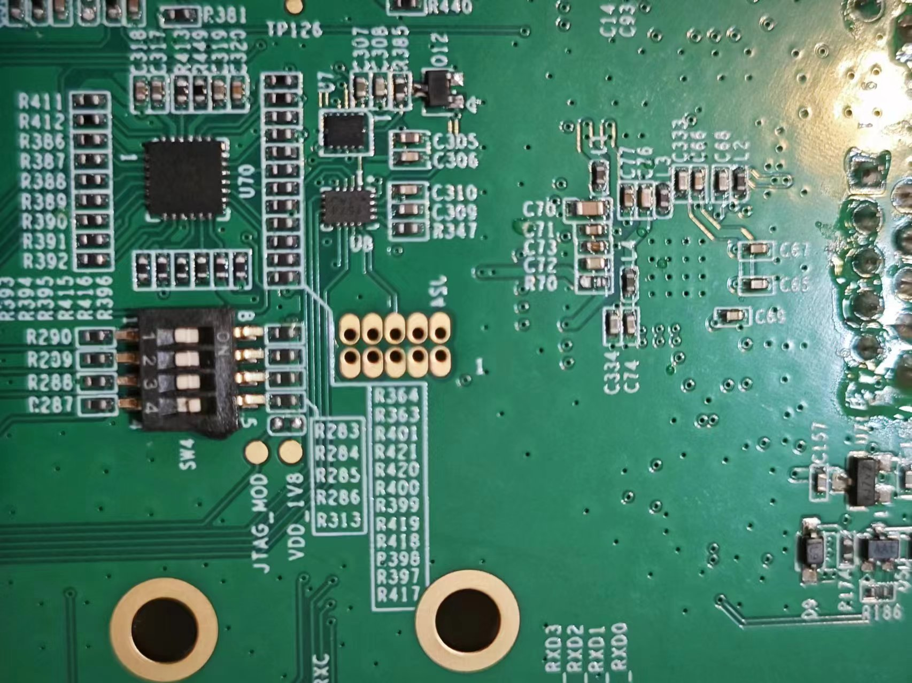
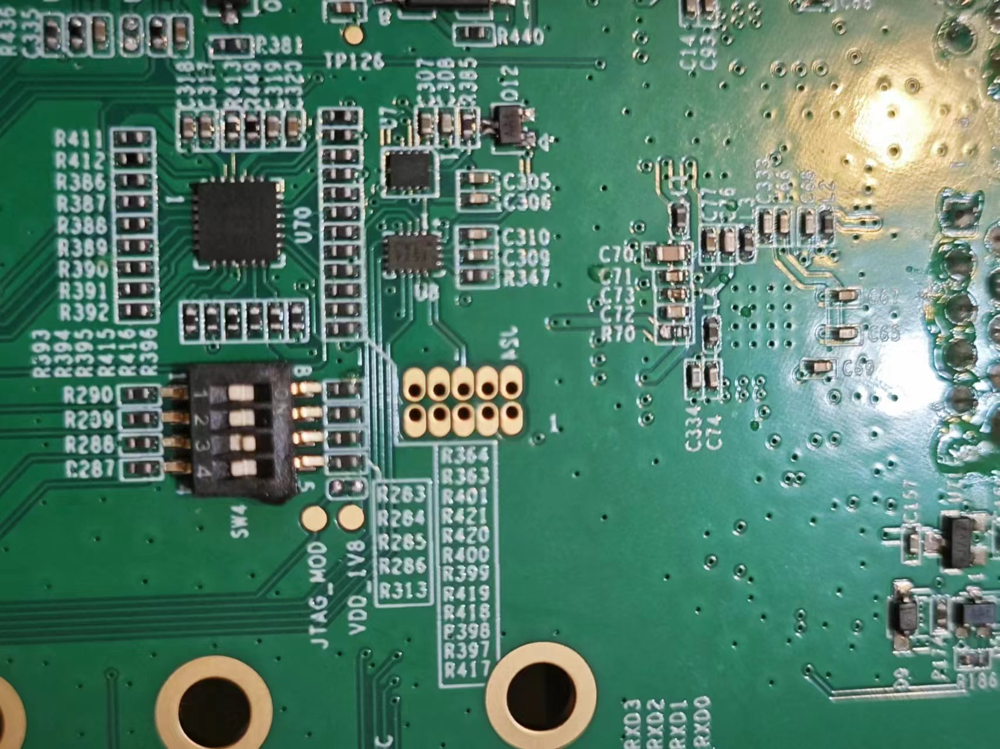

# yocto
A Yocto Project build requires that some packages be installed for the build that are
documented under the Yocto Project. Go to Yocto Project Quick Start and check for the
packages that must be installed for your build machine.

To get the Yocto Project expected behavior in a Linux Host Machine, the packages and
utilities described below must be installed. An important consideration is the hard disk
space required in the host machine. For example, when building on a machine running
Ubuntu, the minimum hard disk space required is about 50 GB. It is recommended that at
least 120 GB is provided, which is enough to compile all backends together. For building
machine learning components, at least 250 GB is recommended.

The recommended minimum Ubuntu version is 20.04 or later. The latest release supports
Chromium v91, which requires an increase to the ulimit (number of open files) to 4098.
Essential Yocto Project host packages are:

## 1.Installation required package
~~~
$ sudo apt-get install gawk wget git-core diffstat unzip texinfo gcc-multilib build-essential chrpath socat cpio python python3 python3-pip python3-pexpect 
xz-utils debianutils iputils-ping python3-git python3-jinja2 libegl1-mesa libsdl1.2-dev 
pylint3 xterm rsync curl zstd pzstd lz4c lz4 libssl-dev
$ sudo locale-gen en_US.UTF-8
~~~

## 2.Setting up the Repo utility
Repo is a tool built on top of Git that makes it easier to manage projects that contain
multiple repositories, which do not need to be on the same server. Repo complements
very well the layered nature of the Yocto Project, making it easier for users to add their
own layers to the BSP.
To install the “repo” utility, perform these steps:
- 2.1.  Create a bin folder in the home directory.
~~~
$ mkdir ~/bin (this step may not be needed if the bin folder
 already exists)
$ curl https://storage.googleapis.com/git-repo-downloads/repo
 > ~/bin/repo
$ chmod a+x ~/bin/repo
~~~
- 2.2 Add the following line to the .bashrc file to ensure that the ~/bin folder is in your
PATH variable.
~~~
export PATH=~/bin:$PATH
~~~

## 3.Yocto Project Setup
First, make sure that Git is set up properly with the commands below:
~~~
$ git config --global user.name "Your Name"
$ git config --global user.email "Your Email"
$ git config --list
~~~
The i.MX Yocto Project BSP Release directory contains a sources directory, which
contains the recipes used to build one or more build directories, and a set of scripts used
to set up the environment.
The recipes used to build the project come from both the community and i.MX. The Yocto
Project layers are downloaded to the sources directory. This sets up the recipes that are
used to build the project.
The following example shows how to download the i.MX Yocto Project Community BSP
recipe layers. For this example, a directory called imx-yocto-bsp is created for the
project. Any name can be used instead of this.
~~~
$ mkdir imx-yocto-bsp
$ cd imx-yocto-bsp
$ repo init -u https://github.com/nxp-imx/imx-manifest -b imx-linux-mickledore -m imx-6.1.22-2.0.0.xml
$ repo sync
~~~

## 4.Building the Project
### 4.1 change uboot
Replace the ``uboot`` bb file before starting the build.
``[your path]/imx-yocto-bsp/sources/meta-imx/meta-bsp/recipes-bsp/u-boot/u-boot-imx_2022.04.bb``

before
~~~

# BEGIN: Changes to u-boot-imx-common_${PV}.inc

LIC_FILES_CHKSUM = "file://Licenses/gpl-2.0.txt;md5=b234ee4d69f5fce4486a80fdaf4a4263"

SRC_URI = "${UBOOT_SRC};branch=${SRCBRANCH}"
UBOOT_SRC ?= "git://github.com/nxp-imx/uboot-imx.git;protocol=https"
SRCBRANCH = "lf_v2022.04"
SRCREV = "181859317bfafef1da79c59a4498650168ad9df6"
LOCALVERSION = "-${SRCBRANCH}"

DEPENDS += "gnutls-native xxd-native"

~~~
after
~~~
# BEGIN: Changes to u-boot-imx-common_${PV}.inc

LIC_FILES_CHKSUM = "file://Licenses/gpl-2.0.txt;md5=b234ee4d69f5fce4486a80fdaf4a4263"

SRC_URI = "${UBOOT_SRC};branch=${SRCBRANCH}"
UBOOT_SRC ?= "git://github.com/bit-brick/uboot-imx.git;protocol=https"
SRCBRANCH = "lf_v2022.04"
SRCREV = "2a29b5972b88343286ceda95b592c2f93a9c8bc4"
LOCALVERSION = "-${SRCBRANCH}"

DEPENDS += "gnutls-native xxd-native"

~~~

### 4.2 change kernel
Modify bb files:
``[your path]/imx-yocto-bsp/sources/meta-imx/meta-bsp/recipes-kernel/linux/linux-imx_5.15.bb
``  
``[your path]/imx-yocto-bsp/sources/meta-imx/meta-bsp/recipes-kernel/linux/linux-imx-headers_5.15.bb``
~~~
SRCBRANCH = "lf-5.15.y"
LOCALVERSION = "-lts-next"
KERNEL_SRC ?= "git://github.com/bit-brick/linux-imx.git;protocol=https;branch=${SRCBRANCH}"
KBRANCH = "${SRCBRANCH}"
SRC_URI = "${KERNEL_SRC}"

SRCREV = "50912be386017c8d2ca7f0c9c0a32fa7ac84a283"

~~~
then run code to build image
~~~
$ DISTRO=fsl-imx-wayland MACHINE=imx8mp-lpddr4-evk source imx-setup-release.sh -b build-wayland
$ bitbake imx-image-full
~~~

when it success, you will see the files in the build-wayland/tmp/deploy/images/imx8mp-lpddr4-evk  directory

## 5.Burn Image to device
### 5.1 Downloading UUU
Download UUU version 1.4.193 or later from https://github.com/NXPmicro/mfgtools/releases.
### 5.2 Using UUU
To use the UUU for  i.MX 8, follow the instructions below:
1. Connect a USB cable from a computer to the USB OTG/TYPE C port on the board.
2. Connect a USB cable from the OTG-to-UART port to the computer for console output.
3. Open a Terminal emulator program. See Section "Basic Terminal Setup" in this document.
4. Set the boot pin to serial download mode mode. See Section "Serial download mode for the Manufacturing Tool" in this 
document.
To use the UUU for i.MX 8ULP EVK, follow the instructions below:
• To burn single-boot image and rootfs to eMMC, run the following command:

Switch the board pins to burn mode ``0 0 0 1``.

~~~
sudo ~/bin/uuu -b emmc_all imx-boot-imx8mpevk-sd.bin-flash_evk imx-image-full-imx8mp-lpddr4-evk.wic.zst
~~~
After burning, switch the board pins to system running mode ``0 0 1 0``, then reset and reboot the system.

You can also directly download the compiled image from the following link:  
[imx-image-full-imx8mp-lpddr4-evk.wic.zst](https://drive.google.com/drive/folders/1DeiQxV0aQYxEGHuIq0V043Mfd73IX5uA?usp=drive_link)

## FAQ
### Q: How to modify the number of threads?
A: Modify the number of threads in the build-dir/conf/local.conf file based on the performance of your computer.

~~~bash
# Choose your desired number of build threads
BB_NUMBER_THREADS ?= "4"

# Set the number of concurrent threads for make command
PARALLEL_MAKE ?= "-j 4"
~~~
### Q: How to modify the size of the tmp partition?
A: Modify the size of the tmp partition in the build-dir/conf/local.conf file based on your requirements.

### Q: How to compile the kernel separately?
A: Run the following commands:

~~~
bitbake -c cleanall virtual/kernel
bitbake virtual/kernel
~~~
### Q: Failure in installing package with apt
A: Add ``[trusted=yes] ``in the source list and use date -e to change the system date.
