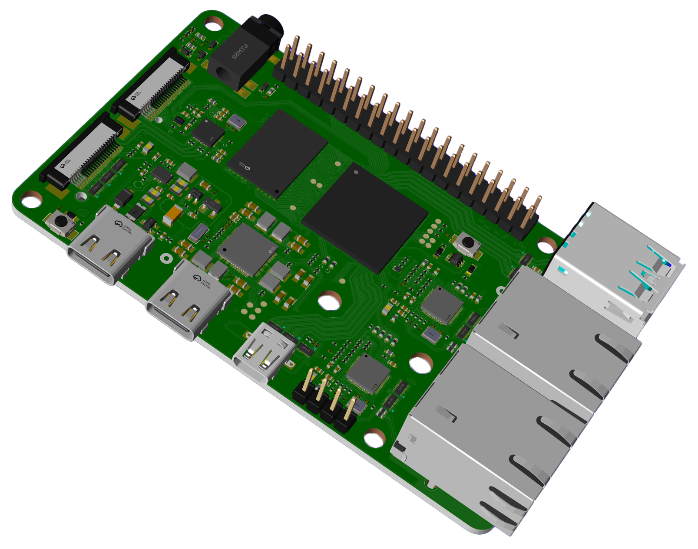
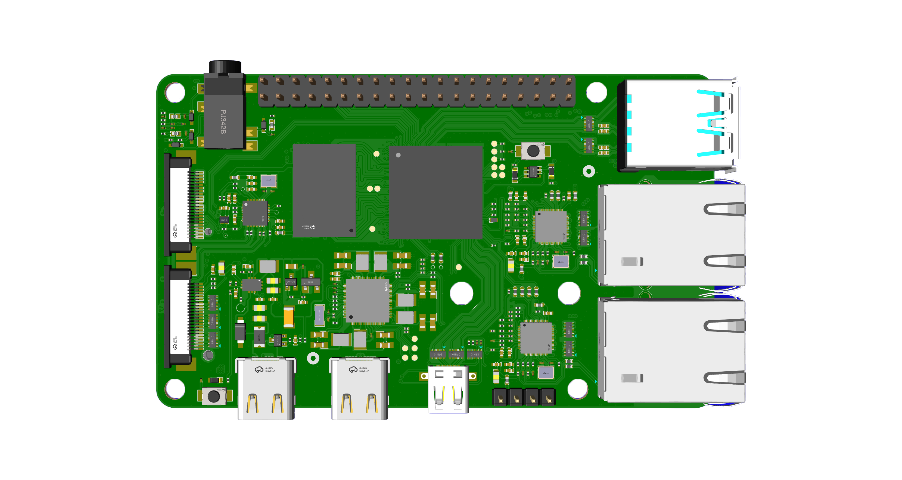
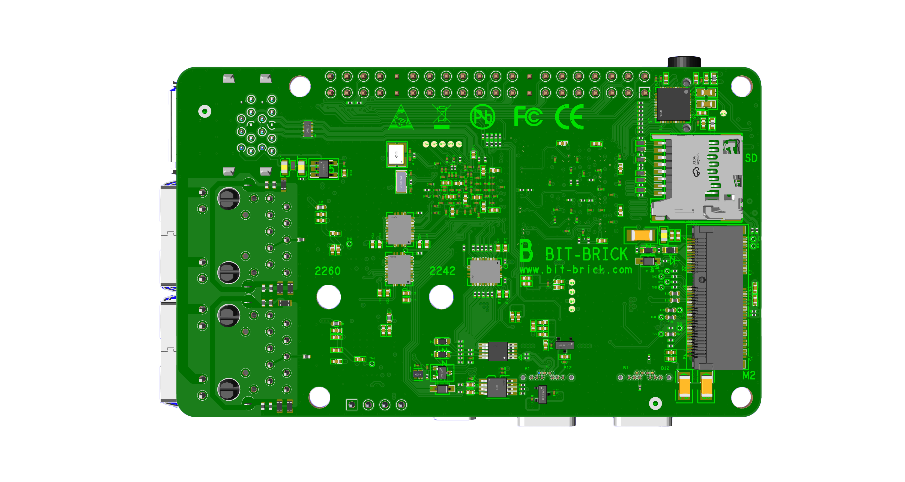

# Bit-Brick PI ONE Hardware Introduction

Published May 2024

## NOTE

BIT-BRICK IS THE TRADEMARK OF BIT BRICK LTD. ANYONE WANT TO USE THIS SHOULD GET THE PERMISSION FROM BIT BRICK COMPANY.

## Overview

Welcome to PI ONE: an interesting single board computer.

## Specification

- **Processor:**
  - Quad Cortex®-A53 processors operation up to 1.6 GHz
  - Cortex®-M7 CPU operating up to 800 MHz
  - Cortex®-A53 MPCore TrustZone® support

- **Features:**
  - GC7000UL GPU, Supports OpenGL ES 1.1, 2.0, 3.0, OpenCL 1.2, Vulkan
  - LPDDR4 SDRAM (2GB and 4GB available)
  - HDMI 2.0a, Resolution up to 3840 x 2160p30
  - 2×USB 3.0 ports
  - microSD card slot
  - 2×Gigabit Ethernet, with PoE+ support (requires separate PoE+ HAT)
  - 2×4-lane MIPI camera/display transceivers
  - PCIe 2.0 x1 interface for fast peripherals
  - Power and reset key support
  - Power LED, and 2 programmable LED support
  - 3.5mm headset interface
  - 5V/5A DC power via USB-C
  - USB to serial support, type C interface
  - 40 pin connector, support CAN/UART/SPI/I2C/PWM/I2S etc.
  - WIFI/Bluetooth OPTIONAL (M.2 slot support SDIO WIFI module)

- **Production lifetime:** PI ONE will remain in mass production until 2035.

- **Compliance:** For a full list of local and regional product approvals, please visit [pip.bit-brick.com](http://pip.bit-brick.com).

## Physical specification

(The physical specification details are not provided in the given content.)