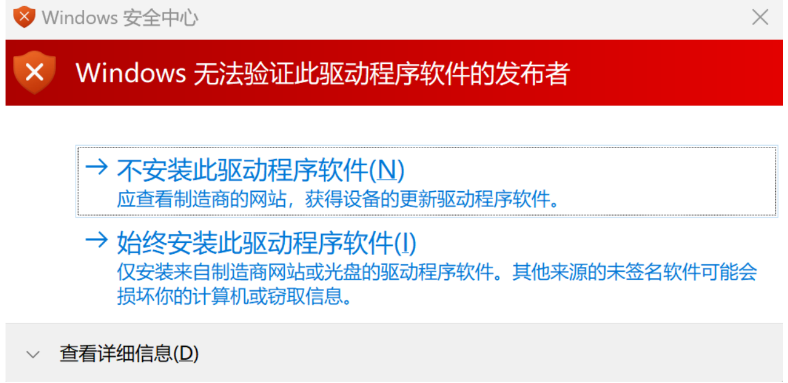
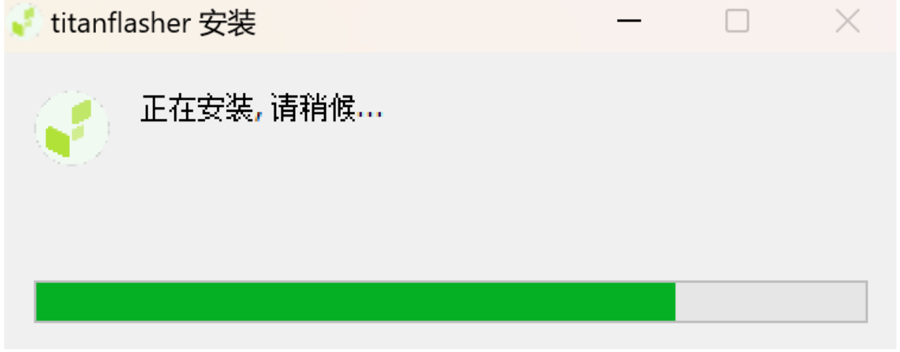
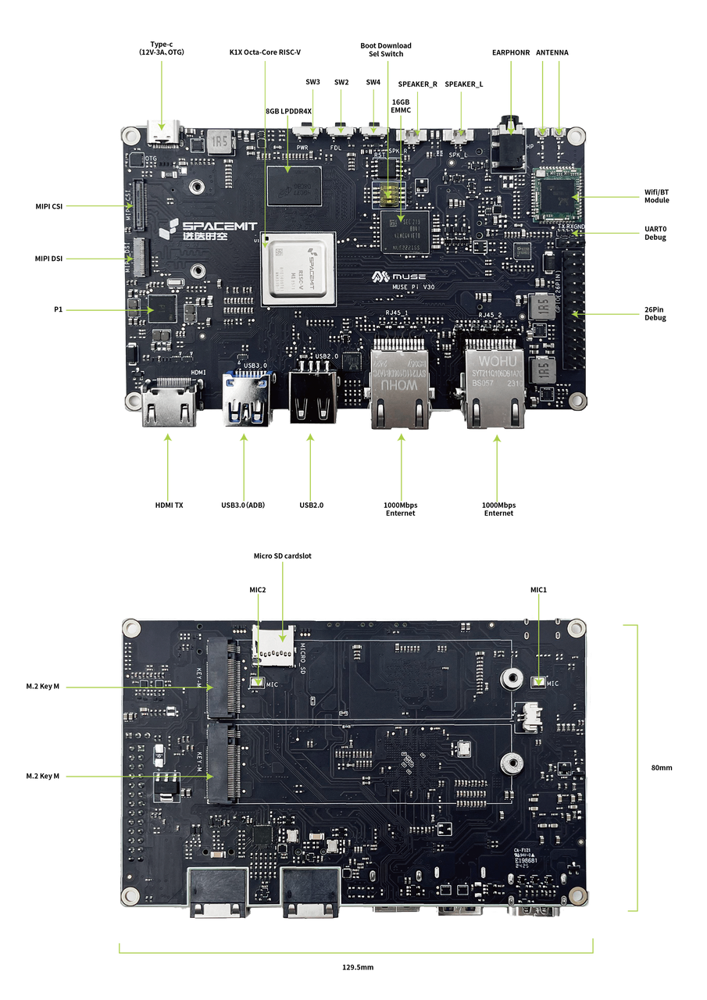
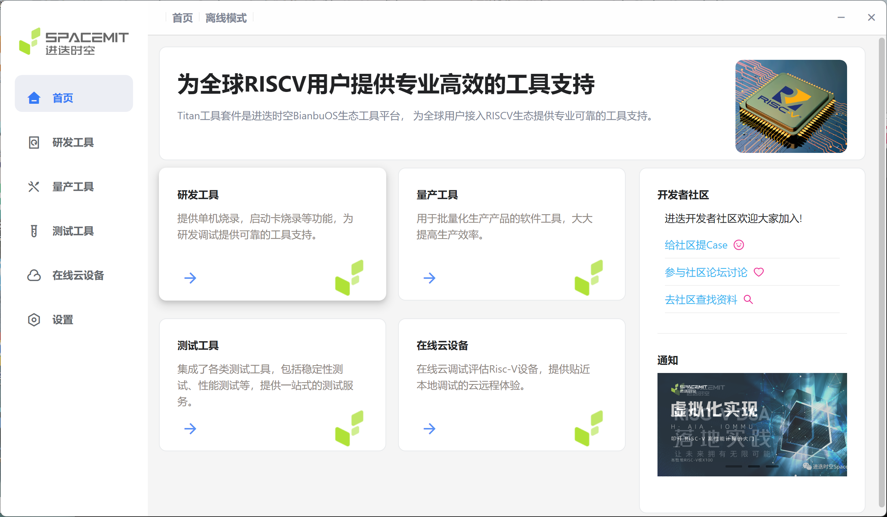
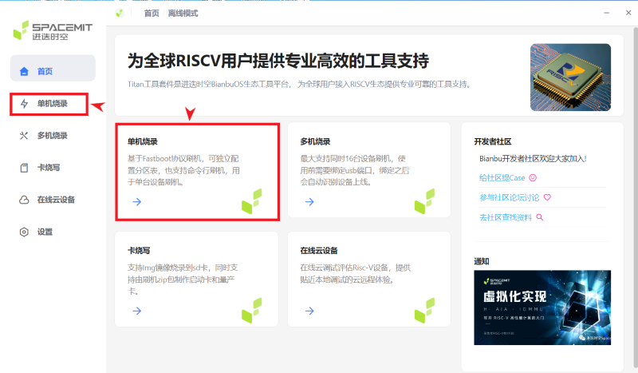
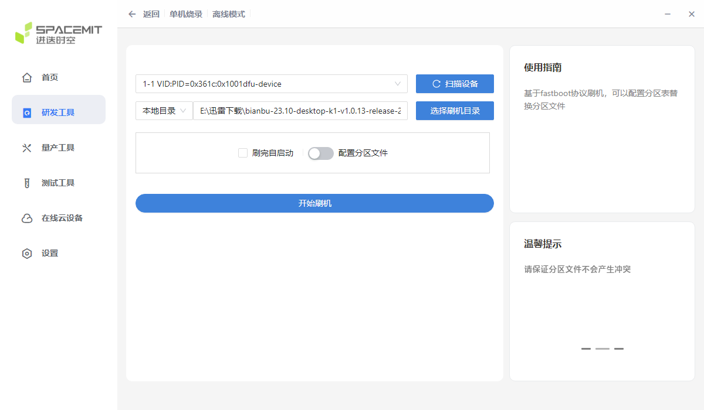
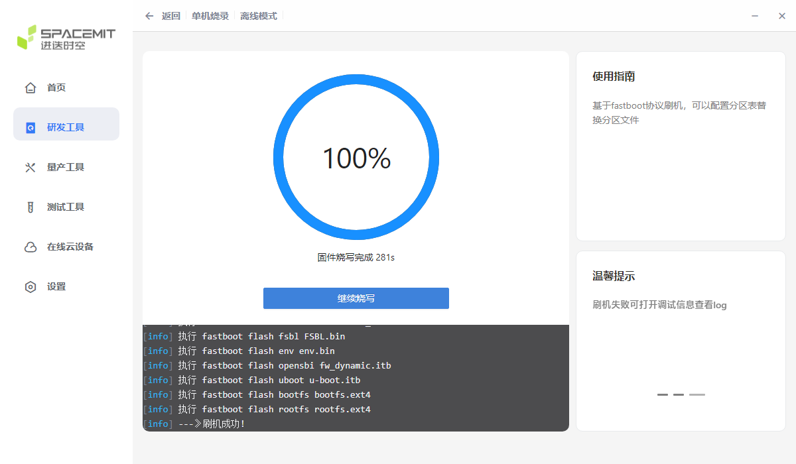

# Install an operating system
Pi one linux 镜像下载地址:  
[Bianbu desktop for eMMC](https://archive.spacemit.com/image/k1/version/bianbu/v1.0.13/bianbu-23.10-desktop-k1-v1.0.13-release-20240816183401.zip)

[Bianbu desktop for SDcard](https://archive.spacemit.com/image/k1/version/bianbu/v1.0.13/bianbu-23.10-desktop-k1-v1.0.13-release-20240816183401.img.zip)


以 .zip 结尾的 zip 固件，适用于 Titan Flasher。

以 img.zip 结尾的固件为 sdcard 固件，解压后可以用 dd 命令或者 balenaEtcher 写入 sdcard。注意此固件不适用于 eMMC。

## 烧录到eMMC
Bianbu 固件 烧录到eMMC需要使用 Titan Flasher 进行刷机
## 1 下载
|资源|平台|ARCH|下载|
|---|---|---|---|
|TITANTOOLS FOR WINDOWS (X86/X64) (INSTALLER)|WINDOWS|X86/X64|[Download](https://cloud.spacemit.com/prod-api/release/download/tools?token=titantools_for_windows_X86_X64)|
|TITANTOOLS FOR LINUX X64 (64 - BIT) (APPIMAGE)|LINUX|X64|[Download](https://cloud.spacemit.com/prod-api/release/download/tools?token=titantools_for_linux_64BIT_APPIMAGE)|

## 2 安装
### 2.1 PC 配置要求
操作系统：Windows 或 Linux
C 盘空间（或 Linux 系统 Home 空间）：> 10GB

### 2.2 windows 安装
以 Windows 11 为例。
1. 下载最新版本的刷机工具 [titantools_for_windows.exe](https://cloud.spacemit.com/prod-api/release/download/tools?token=titantools_for_windows_X86_X64)
2. 双击 titantools_for_windows_last 安装；
3. 如果系统提示你要允许来自未知发布者的此应用对你的设备进行更改吗？，选择是；
4. 如果系统提示 Windows 无法验证此驱动程序软件的发布者，选择始终安装此驱动软件；

5. 直到安装完成。


### 2.3 Linux 上安装
以 Ubuntu 为例。
1. 下载最新版本的刷机工具 titantools_for_linux.AppImage
2. 赋予可执行权限
3. 双击即可开始使用，无需安装
注意：如果启动失败报错：“dlopen()： error loading libfuse.so.2” 可安装 libfuse 依赖:
```
sudo apt install libfuse2
```

## 3 刷机流程
### 3.1 进入刷机模式
**方法一**
设备未上电（开机），按住 DOWNLOAD（FDL） 按键，插上 USB 数据线上电，然后松开按键，即可进入刷机模式。如果担心 USB 供电不足，可以先插火牛，然后松开按键，再插 USB 线。

**方法二**
设备已上电（开机），按住 DOWNLOAD（FDL） 按键，再按 Reset 键，即可进入刷机模式，插上 USB 数据线，即可刷机。



**注意**
请使用 USB 数据线刷机

### 3.2 刷机过程
1. 打开刷机工具，如果系统提示你要允许来自未知发布者的此应用对你的设备进行更改吗？，选择是。

2. 选择研发工具>单机烧录。

3. 点击扫描设备，直到出现 VID:PID 字样，如有多个设备，请选择你要刷机的设备。设备进入下载模式之后才能被扫描到。
4. 点击选择刷机文件，选择固件，然后工具提示 `正在解压文件`，耐心等待刷机完成。
5. 或选择已经解压好的刷机目录

6. 点击开始刷机，启动刷机。

7. 刷机完成，重新上电即可进入系统。 

温馨提示：
1. 请保证分区文件不会产生冲突
2. 刷机失败可打开调试信息查看 log


## 烧录到SD卡
### 使用balenaEtcher烧录镜像的方法
1. 首先准备一张16GB或更大容量的TF卡，TF卡的传输速度必须为class10级或class10级以上，建议使用闪迪等品牌的TF卡

2. 然后使用读卡器把TF卡插入电脑

3. 找到下载下来的Linux操作系统镜像文件压缩包，然后使用解压软件解压，解压后的文件中，以”.wic”结尾的文件就是操作系统的镜像文件，大小一般都在1GB以上

4. 然后下载Linux镜像的烧录软件——balenaEtcher，下载地址为
https://www.balena.io/etcher/

5. 进入balenaEtcher下载页面后，点击绿色的下载按钮会跳到软件下载的地方


6. 然后可以选择下载balenaEtcher的Portable版本的软件，Portable版本无需安装，双击打开就可以使用


7. 如果下载的是需要安装版本的balenaEtcher，请先安装再使用。如果下载的Portable版本balenaEtcher，直接双击打开即可，打开后的balenaEtcher界面如下图所示


8. 使用balenaEtcher烧录Linux镜像的具体步骤如下所示

    - 首先选择要烧录的Linux镜像文件的路径

    - 然后选择TF卡的盘符

    - 最后点击Flash就会开始烧录Linux镜像到TF卡中

    

9. balenaEtcher烧录Linux镜像的过程显示的界面如下图所示，另外进度条显示紫色表示正在烧录Linux镜像到TF卡中

 

10. Linux镜像烧录完后，balenaEtcher默认还会对烧录到TF卡中的镜像进行校验，确保烧录过程没有出问题。如下图所示，显示绿色的进度条就表示镜像已经烧录完成，balenaEtcher正在对烧录完成的镜像进行校验


11. 成功烧录完成后balenaEtcher的显示界面如下图所示，如果显示绿色的指示图标说明镜像烧录成功，此时就可以退出balenaEtcher，然后拔出TF卡插入到开发板的TF卡槽中使用了


