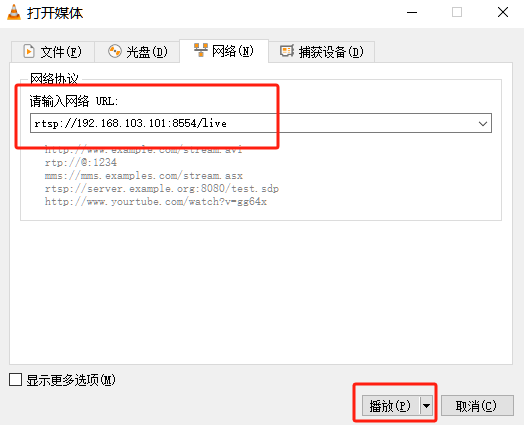

#   Gstreamer Tools and MPP Plugins

This chapter introduces Gstreamer tools and related plugin testing methods.

##  1. Gstreamer Introduction

GStreamer is an open-source multimedia framework used for building audio and video processing applications. It provides rich functionality for handling various media stream formats, including recording, playback, editing, and streaming. Through its plugin architecture, GStreamer supports many codecs and container formats, enabling developers to easily build complex multimedia applications suitable for desktop, embedded systems, and server environments.

##  2. Common Gstreamer Commands

###  2.1. gst-launch-1.0

`gst-launch-1.0` is a command-line tool in the GStreamer framework used for quickly creating and testing multimedia pipelines. It allows users to build data stream pipelines to process audio and video data, perform real-time stream processing, encoding, decoding, transcoding, and other operations. Simple examples are as follows:

```bash
# Use videotestsrc to generate a video and display it using xvimagesink
gst-launch-1.0 videotestsrc ! xvimagesink
```

###  2.2. gst-play-1.0

`gst-play-1.0` is a simple media player tool in GStreamer designed for quickly playing audio and video files. It supports various media formats and can be extended using GStreamer’s plugin architecture. With command-line parameters, users can easily play local files or streaming media, making it ideal for testing and demonstrating multimedia features.

```bash
# Play test.mp4 and display it using xvimagesink
gst-play-1.0 test.mp4 --videosink=xvimagesink
```

###  2.3. gst-inspect-1.0

`gst-inspect-1.0` is a tool in GStreamer used to view available plugins, elements, and their properties. With this tool, users can obtain information about specific plugins, such as supported formats, properties, signals, and features.

```bash
# List all plugins without any parameters
gst-inspect-1.0

# List all information about the xvimagesink plugin
gst-inspect-1.0 xvimagesink
```

##  3. Common Gstreamer Plugins

###  3.1. Source

GStreamer’s Source plugins are used to generate and provide media data streams. They can read audio or video from different data sources, such as files, networks, devices, etc. Common Source plugins include file sources (e.g., `filesrc`), network sources (e.g., `tcpserversrc`), and device sources (e.g., `v4l2src`). These plugins allow developers to flexibly build multimedia pipelines to meet different application needs. By configuring Source plugins, users can easily acquire and process various types of media data.

####  3.1.1. filesrc

Read data from a file, example:

```bash
# Create /tmp/test
echo 666 > /tmp/test

# Read file data to /tmp/test2
gst-launch-1.0 filesrc location=/tmp/test ! filesink location=/tmp/test2

# View
cat /tmp/test2
```

####  3.1.2. videotestsrc

Generate video data, example:

```bash
# Output video in default format
gst-launch-1.0 videotestsrc ! xvimagesink

# Output video in specified format
gst-launch-1.0 videotestsrc ! "video/x-raw,width=1920,height=1080,format=(string)NV12" ! xvimagesink
```

####  3.1.3. v4l2src

Get video data from the camera, example:

```bash
# If the camera number is not specified, the system’s first video device /dev/video0 is used by default
gst-launch-1.0 v4l2src ! video/x-raw,width=1920,height=1080,format=NV12 ! xvimagesink

# To use a specific camera, specify the device property, e.g.,
gst-launch-1.0 v4l2src device=/dev/video0 ! video/x-raw,width=1920,height=1080,format=NV12 ! xvimagesink
```

####  3.1.4. rtspsrc and rtspclientsink

`rtspsrc` and `rtspclientsink` are two different elements in GStreamer used for handling RTSP streams.

- `rtspsrc`: A source element for receiving RTSP streams. It can pull audio and video streams from an RTSP server and pass them to downstream elements in the pipeline for processing.
- `rtspclientsink`: A sink element for sending processed audio and video streams to an RTSP server.

The system does not have the plugin installed by default and requires installation:

```bash
# Install the plugin
sudo apt install gstreamer1.0-rtsp
```

Refer to the streaming and pulling sections of this chapter for specific usage.

###  3.2. Sink

GStreamer’s Sink plugins are used to receive and process media data streams, usually for output to different targets, such as files, audio devices, video displays, etc. Common Sink plugins include file sinks (e.g., `filesink`), audio output (e.g., `alsasink`), and video display (e.g., `ximagesink`). These plugins enable developers to flexibly export media data to the desired format or device, facilitating multimedia playback and recording functions.

####  3.2.1. filesink

Save received data as a file, example:

```bash
# Create /tmp/test
echo 666 > /tmp/test

# Read file data to /tmp/test2
gst-launch-1.0 filesrc location=/tmp/test ! filesink location=/tmp/test2

# View
cat /tmp/test2
```

####  3.2.2. fakesink

Discard all received data, example:

```bash
gst-launch-1.0 filesrc location=/tmp/test ! fakesink
```

####  3.2.3. xvimagesink

Video Sink, receives video and displays it using the X11 interface, example:

```bash
gst-launch-1.0 videotestsrc ! xvimagesink
```

####  3.2.4. kmssink

Video Sink, receives video and displays it using the KMS interface, requiring exclusive hardware decoding layers, example:

```bash
gst-launch-1.0 videotestsrc ! kmssink

# Common commands
connector-id # Specify screen
plane-id # Specify hardware layer
render-rectangle # Specify rendering range
```

####  3.2.5. waylandsink

Video Sink, receives video and displays it using the Wayland interface, example:

```bash
gst-launch-1.0 videotestsrc ! waylandsink
```

####  3.2.6. rkximagesink

Video Sink, receives video and displays it using the DRM interface, implementing zero-copy and other features, with better performance but requiring exclusive hardware decoding layers. Example:

```bash
gst-launch-1.0 videotestsrc ! rkximagesink
```

####  3.2.7. fpsdisplaysink

Video Sink, receives video and calculates frame rate, while forwarding the video to the next Sink for display. Example:

```bash
# Set log level to TRACE(7) to view real-time frame rate, set to DEBUG(5) to only display max/min frame rate
GST_DEBUG=fpsdisplaysink:7 gst-play-1.0 --flags=3 --videosink="fpsdisplaysink \video-sink=xvimagesink signal-fps-measurements=true text-overlay=false \sync=false" test.mp4

# Information output as follows
Press 'k' to see a list of keyboard shortcuts.
Now playing /home/cat/test.mp4
0:00:00.111413754  7044   0x5580fc5d90 DEBUG         fpsdisplaysink fpsdisplaysink.c:440:fps_display_sink_start:<fpsdisplaysink0> Use text-overlay? 0
Redistribute latency...
0:00:02.035048410  7044   0x7f6004e2d0 DEBUG         fpsdisplaysink fpsdisplaysink.c:372:display_current_fps:<fpsdisplaysink0> Updated max-fps to 44.703224
0:00:02.036371046  7044   0x7f6004e2d0 DEBUG         fpsdisplaysink fpsdisplaysink.c:376:display_current_fps:<fpsdisplaysink0> Updated min-fps to 44.703224
0:00:02.037667141  7044   0x7f6004e2d0 LOG           fpsdisplaysink fpsdisplaysink.c:381:display_current_fps:<fpsdisplaysink0> Signaling measurements: fps:44.703224 droprate:0.000000 avg-fps:44.703224
0:00:02.552749637  7044   0x7f6004e2d0 DEBUG         fpsdisplaysink fpsdisplaysink.c:372:display_current_fps:<fpsdisplaysink0> Updated max-fps to 46.356696
0:00:02.554009567  7044   0x7f6004e2d0 LOG           fpsdisplaysink fpsdisplaysink.c:381:display_current_fps:<fpsdisplaysink0> Signaling measurements: fps:46.356696 droprate:0.000000 avg-fps:45.532539
```

##  4. Rockchip MPP Plugins

Based on MPP hardware codec plugins, developed using Gstreamer’s original `GstVideoDecoder` and `GstVideoEncoder` classes.

### Supported Decoding Formats

- JPEG
- MPEG
- VP8
- VP9
- H264
- H265

### Supported Encoding Formats

- JPEG
- H264
- H265
- VP8

Refer to: [docs/cn/Linux/Multimedia/Rockchip_User_Guide_Linux_Gstreamer_CN.pdf](https://pan.baidu.com/s/1E121Hr0UmuABaypravRqKQ?pwd=6suk)

The system has the MPP plugin installed by default:

```bash
# View MPP plugins
gst-inspect-1.0 | grep mpp

# Information output as follows
rockchipmpp:  mpph264enc: Rockchip Mpp H264 Encoder
rockchipmpp:  mpph265enc: Rockchip Mpp H265 Encoder
rockchipmpp:  mppvp8enc: Rockchip Mpp VP8 Encoder
rockchipmpp:  mppjpegenc: Rockchip Mpp JPEG Encoder
rockchipmpp:  mppvideodec: Rockchip's MPP video decoder
rockchipmpp:  mppjpegdec: Rockchip's MPP JPEG image decoder
```

###  4.1. gstmppdec Description

Includes plugins `mppvideodec`, `mppjpegdec`. The following uses `mppvideodec` as an example.

#### Main Property Description

- `rotation`: Rotation angle, default is 0°, options are 0°, 90°, 180°, 270°.
- `width`: Width, default is 0, no scaling.
- `height`: Height, default is 0, no scaling.
- `crop-rectangle`: Cropping, usage is `<x, y, w, h>`, i.e., crop source `<x, y>` as the starting point, and send an image of width and height `w * h` to the next level.
- `arm-afbc`: AFBC compression format, default is off. When enabled, it can reduce DDR bandwidth usage, and decoding efficiency of some chips will significantly improve.
- `format`: Output format, default is 0 “auto”, no format conversion.
- `fast-mode`: Enable MPP Fast Mode, allowing some decoding processes to run in parallel, improving decoding efficiency. Default is enabled.
- `ignore-error`: Ignore MPP decoding errors and forcibly output decoded frames. Default is enabled.

###  4.2. gstmppenc Description

Includes plugins `mpph264enc`, `mppvp8enc`, `mppjpegenc`, etc. The following uses `mpph264enc` as an example.

#### Main Property Description

- `width`: Width, default is 0, no scaling.
- `height`: Height, default is 0, no scaling.
- `rc-mode`: Rate control mode, options are VBR, CBR, and Fixed QP.
- `bps`: Target bitrate, ignored in Fixed QP mode.
- `bps-max`: Maximum bitrate, ignored in Fixed QP mode.
- `bps-min`: Minimum bitrate, ignored in Fixed QP mode.
- `gop`: Group Of Picture, i.e., interval between two I-frames.
- `level`: Represents the `level_idc` parameter in SPS.
- `profile`: Represents the `profile_idc` parameter in SPS.
- `rotation`: Rotate input buffer, options are 0°, 90°, 180°, 270°.

###  4.3. Play Video

```bash
# Get audio playback device
aplay -l

# Play and specify audio device
gst-play-1.0 --flags=3 --videosink="fpsdisplaysink video-sink=xvimagesink signal-fps-measurements=true text-overlay=false sync=false" \
--audiosink="alsasink device=hw:1,0" test.mp4
```

###  4.4. Multi-channel Video Playback

```bash
# Use render-rectangle of xvimagesink to specify different rendering positions
gst-launch-1.0 filesrc location=/home/cat/test.mp4 ! parsebin ! mppvideodec ! \
xvimagesink render-rectangle='<0,0,400,400>' &

gst-launch-1.0 filesrc location=/home/cat/test.mp4 ! parsebin ! mppvideodec ! \
xvimagesink render-rectangle='<0,500,400,400>' &
```

###  4.5. Encoding Preview

Use the `tee` plugin to copy camera-captured data into two streams, one sent to `mpph264enc` for encoding and then to `filesink` for file saving. The other stream is sent to `autovideosink` for display. Note that the `queue` plugin should be added after the `tee` plugin to cache data and prevent freezing.

```bash
# Encoding preview and save video stream to /home/cat/out.h264
gst-launch-1.0 v4l2src ! 'video/x-raw,width=1920,height=1080,format=NV12' ! tee name=tv ! queue ! \
mpph264enc ! 'video/x-h264' ! h264parse ! 'video/x-h264' ! filesink location=/home/cat/out.h264 tv. ! queue ! autovideosink
```

###  4.6. Stream Splitting

Some plugins like `qtdemux` may have multiple Source Pads, such as audio streams, video streams, subtitle streams, etc. You can name the plugin and extract the required stream. For example, naming `qtdemux` as `qt`, then `qt.audio_0` is the first audio stream, and `qt.video_0` is the first video stream, which can be extracted and processed separately. Similarly, it is recommended to add the `queue` plugin after splitting. Different plugin stream naming methods vary, and you can check the naming method using the `gst-inspect` command or directly construct pipelines like `qt. ! queue ! mppvidedec`, and Gstreamer will negotiate the format with downstream plugins.

```bash
gst-launch-1.0 filesrc location=test.mp4 ! qtdemux name=qt qt.audio_0 ! queue ! \
filesink location=audio.bin qt.video_0 ! queue ! filesink location=video.bin
```

##  5. AFBC

AFBC stands for ARM Frame Buffer Compression, a compression format used to save bandwidth. Currently, the `mppvideodec` plugin supports AFBC encoding formats such as H264, H265, VP9, and supports color formats like NV12, NV12 10bit, NV16. Enable it as follows:

```bash
# Enable global AFBC, suitable for cases where mppvideodec cannot be directly operated, such as using gst-play-1.0
export GST_MPP_VIDEODEC_DEFAULT_ARM_AFBC=1

# Enable AFBC individually
gst-launch-1.0 filesrc location=test.mp4 ! parsebin ! mppvideodec arm-afbc=true \
! waylandsink
```

Below is the actual comparison of frame rate differences with and without AFBC enabled:

### Test without AFBC enabled:

```bash
# Get frame rate using fpsdisplaysink
GST_DEBUG=fpsdisplaysink:7 gst-play-1.0 --flags=3 --videosink="fpsdisplaysink \video-sink=xvimagesink signal-fps-measurements=true text-overlay=false  \sync=false" test.mp4

# Information output as follows
Press 'k' to see a list of keyboard shortcuts.
Now playing /home/cat/test.mp4
0:00:00.104522663  1713   0x557e075f90 DEBUG         fpsdisplaysink fpsdisplaysink.c:440:fps_display_sink_start:<fpsdisplaysink0> Use text-overlay? 0
Redistribute latency...
0:00:01.759775739  1713   0x7f7004f6d0 DEBUG         fpsdisplaysink fpsdisplaysink.c:372:display_current_fps:<fpsdisplaysink0> Updated max-fps to 49.268096
0:00:01.760865346  1713   0x7f7004f6d0 DEBUG         fpsdisplaysink fpsdisplaysink.c:376:display_current_fps:<fpsdisplaysink0> Updated min-fps to 49.268096
0:00:01.762249521  1713   0x7f7004f6d0 LOG           fpsdisplaysink fpsdisplaysink.c:381:display_current_fps:<fpsdisplaysink0> Signaling measurements: fps:49.268096 droprate:0.000000 avg-fps:49.268096
0:00:02.268088250  1713   0x7f7004f6d0 DEBUG         fpsdisplaysink fpsdisplaysink.c:376:display_current_fps:<fpsdisplaysink0> Updated min-fps to 45.237944
0:00:02.269162983  1713   0x7f7004f6d0 LOG           fpsdisplaysink fpsdisplaysink.c:381:display_current_fps:<fpsdisplaysink0> Signaling measurements: fps:45.237944 droprate:0.000000 avg-fps:47.251046
0:00:02.822329583  1713   0x7f7004f6d0 LOG           fpsdisplaysink fpsdisplaysink.c:381:display_current_fps:<fpsdisplaysink0> Signaling measurements: fps:46.915589 droprate:0.000000 avg-fps:47.132638
```

It can be seen that without AFBC enabled, the frame rate is between 45-50 frames.

### Test with AFBC enabled:

```bash
# Enable global AFBC
export GST_MPP_VIDEODEC_DEFAULT_ARM_AFBC=1

# Get frame rate using fpsdisplaysink
GST_DEBUG=fpsdisplaysink:7 gst-play-1.0 --flags=3 --videosink="fpsdisplaysink \video-sink=xvimagesink signal-fps-measurements=true text-overlay=false  \sync=false" test.mp4

# Information output as follows
Press 'k' to see a list of keyboard shortcuts.
Now playing /home/cat/test.mp4
0:00:00.104146271  1868   0x55a0d01790 DEBUG         fpsdisplaysink fpsdisplaysink.c:440:fps_display_sink_start:<fpsdisplaysink0> Use text-overlay? 0
Redistribute latency...
0:00:01.670561179  1868   0x7f84044f70 DEBUG         fpsdisplaysink fpsdisplaysink.c:372:display_current_fps:<fpsdisplaysink0> Updated max-fps to 69.251621
0:00:01.671678203  1868   0x7f84044f70 DEBUG         fpsdisplaysink fpsdisplaysink.c:376:display_current_fps:<fpsdisplaysink0> Updated min-fps to 69.251621
0:00:01.673051588  1868   0x7f84044f70 LOG           fpsdisplaysink fpsdisplaysink.c:381:display_current_fps:<fpsdisplaysink0> Signaling measurements: fps:69.251621 droprate:0.000000 avg-fps:69.251621
0:00:02.175685861  1868   0x7f84044f70 DEBUG         fpsdisplaysink fpsdisplaysink.c:372:display_current_fps:<fpsdisplaysink0> Updated max-fps to 69.281343
0:00:02.176746888  1868   0x7f84044f70 LOG           fpsdisplaysink fpsdisplaysink.c:381:display_current_fps:<fpsdisplaysink0> Signaling measurements: fps:69.281343 droprate:0.000000 avg-fps:69.266479
0:00:02.688069779  1868   0x7f84044f70 DEBUG         fpsdisplaysink fpsdisplaysink.c:372:display_current_fps:<fpsdisplaysink0> Updated max-fps to 72.214109
0:00:02.689163762  1868   0x7f84044f70 LOG           fpsdisplaysink fpsdisplaysink.c:381:display_current_fps:<fpsdisplaysink0> Signaling measurements: fps:72.214109 droprate:0.000000 avg-fps:70.258145
0:00:03.193409405  1868   0x7f84044f70 DEBUG         fpsdisplaysink fpsdisplaysink.c:372:display_current_fps:<fpsdisplaysink0> Updated max-fps to 75.213708
0:00:03.194469849  1868   0x7f84044f70 LOG           fpsdisplaysink fpsdisplaysink.c:381:display_current_fps:<fpsdisplaysink0> Signaling measurements: fps:75.213708 droprate:0.000000 avg-fps:71.492593
```

It can be seen that with AFBC enabled, the frame rate is between 69-75 frames.

##  6. Subtitles

Enabling subtitles may cause stuttering. Usually, subtitle synthesis requires extracting part of the image from the video and converting it to RGB, then synthesizing subtitles and converting it back to the source format before sending it for display. This means the decoding time must also consider the subtitle synthesis time, leading to an overall frame rate drop. Using the `gst-play-1.0` command for testing can disable subtitles with `--flags=3`. Subtitles need to be implemented independently of the video layer using frameworks like QT.

##  7. Layer Specification

When using `rkximagesink` or `kmssink`, a hardware layer needs to be exclusively occupied, and the plugin will automatically find a layer for playback. However, the automatically found layer may not meet the requirements, so the layer needs to be manually specified as follows:

```bash
gst-play-1.0 --flags=3 test.mp4 --videosink="kmssink plane-id=117"
```

The ID of the target layer can be confirmed through the `/sys/kernel/debug/dri/0/state` node. You can list all layers using the following command:

```bash
# List all layers
cat /sys/kernel/debug/dri/0/state | grep "plane\["

# Information output as follows
plane[57]: Smart0-win0
plane[73]: Smart1-win0
plane[89]: Esmart1-win0
plane[103]: Esmart0-win0
plane[117]: Cluster0-win0
plane[131]: Cluster1-win0
```

Among them, `plane[xx]` is the `plane-id`. Usually, different layers support different formats, such as Cluster supporting AFBC, but Esmart not supporting AFBC. Specific details can be found in the datasheet or TRM.

##  8. Video Streaming/Pulling

###  8.1. Local Streaming/Pulling

The following tests a USB camera with the interface `device=/dev/video9`. The receiving end command needs to be run first, followed by the server end (note that if using SSH, the `export DISPLAY=:0` environment variable needs to be specified).

```bash
# Board receiving end
gst-launch-1.0 udpsrc port=1234 ! "application/x-rtp, payload=96" ! rtph264depay ! decodebin ! autovideosink sync=false

# Board server end test 1
gst-launch-1.0 v4l2src device=/dev/video9  !  video/x-raw,width=640,height=480,framerate=30/1 ! videoconvert ! video/x-raw,format=UYVY !  mpph264enc ! queue ! h264parse ! rtph264pay ! udpsink host=127.0.0.1 port=1234

# Board server end test 2
gst-launch-1.0 v4l2src device=/dev/video9  ! image/jpeg !  mppjpegdec ! videoconvert ! video/x-raw,height=1080,width=1920,frame=30/1,format=NV12 !  mpph264enc ! queue ! h264parse ! rtph264pay ! udpsink host=127.0.0.1 port=1234
```

**Explanation:**

- Receiving end: The command receives RTP data streams from the specified port (1234) using `udpsrc`, unpacks RTP data using `rtph264depay`, decodes the video stream using `decodebin`, and finally outputs the decoded video to an automatically selected video window (`autovideosink`).
- Server end test 1: Captures raw video streams directly using `v4l2src`, outputs in YUYV format, performs H.264 encoding, and then encapsulates into RTP packets using `rtph264pay`. Finally, the data is pushed to the specified address (`127.0.0.1:1234`) using `udpsink`.
- Server end test 2: Similarly uses `v4l2src`, but the input is JPEG format images, which are decoded and then converted to NV12 format, performs H.264 encoding, and then encapsulates into RTP packets using `rtph264pay`. Finally, the data is pushed to the specified address (`127.0.0.1:1234`) using `udpsink`.

The following tests the OV8858 MIPI camera with the interface `device=/dev/video0`. The receiving end command needs to be run first, followed by the server end (note that if using SSH, the `export DISPLAY=:0` environment variable needs to be specified).

```bash
# Board receiving end
gst-launch-1.0 udpsrc port=1234 ! "application/x-rtp, payload=96" ! rtph264depay ! decodebin ! autovideosink sync=false

# Board server end test 1
gst-launch-1.0 v4l2src device=/dev/video0 ! video/x-raw,width=640,height=480,framerate=23/1 ! videoconvert ! video/x-raw,format=UYVY !  mpph264enc ! queue ! h264parse ! rtph264pay ! udpsink host=127.0.0.1 port=1234

# Board server end test 2
gst-launch-1.0 v4l2src device=/dev/video0 ! video/x-raw,width=1280,height=960,framerate=23/1 ! videoconvert ! video/x-raw,format=NV12 !  mpph264enc ! queue ! h264parse ! rtph264pay ! udpsink host=127.0.0.1 port=1234
```

The above is similar to USB, except that OV8858 does not support outputting JPEG format. Test 1 and Test 2 differ in resolution and format.

###  8.2. RTSP Streaming/Pulling

The system does not have the plugin installed by default and requires installation:

```bash
# Install the plugin
sudo apt install gstreamer1.0-rtsp
```

Before streaming, an RTSP server needs to be started, requiring `mediamtx`.

Visit: [mediamtx](#), download `mediamtx_vx.x.x_linux_arm64v8.tar.gz`.

Transfer `mediamtx_v1.9.1_linux_arm64v8.tar.gz` to the board, extract, and run:

```bash
tar xvf mediamtx_v1.9.1_linux_arm64v8.tar.gz

# Run mediamtx
sudo ./mediamtx &

# Information output as follows
2024/09/18 16:24:54 INF MediaMTX v1.9.1
2024/09/18 16:24:54 INF configuration loaded from /home/cat/mediamtx.yml
2024/09/18 16:24:54 INF [RTSP] listener opened on :8554 (TCP), :8000 (UDP/RTP), :8001 (UDP/RTCP)
2024/09/18 16:24:54 INF [RTMP] listener opened on :1935
2024/09/18 16:24:54 INF [HLS] listener opened on :8888
2024/09/18 16:24:54 INF [WebRTC] listener opened on :8889 (HTTP), :8189 (ICE/UDP)
2024/09/18 16:24:54 INF [SRT] listener opened on :8890 (UDP)
```

Send video streams to the RTSP server, simple example:

The following tests a USB camera with the interface `device=/dev/video9`:

```bash
gst-launch-1.0 v4l2src device=/dev/video9  ! image/jpeg !  mppjpegdec ! videoconvert ! video/x-raw,height=1080,width=1920,frame=30/1,format=NV12 ! tee name=t \
t. ! queue ! videoconvert ! autovideosink \
t. ! videoconvert ! mpph264enc ! queue ! h264parse  ! rtspclientsink location=rtsp://127.0.0.1:8554/live
```

The following tests a MIPI camera with the interface `device=/dev/video0`:

```bash
gst-launch-1.0 v4l2src device=/dev/video0  !  video/x-raw,width=1920,height=1080,framerate=23/1 ! tee name=t \
t. ! queue ! videoconvert ! autovideosink \
t. ! videoconvert ! mpph264enc ! queue ! h264parse  ! rtspclientsink location=rtsp://127.0.0.1:8554/live
```

Retrieve video streams from the RTSP server, simple example:

```bash
# Specify the actual streaming board IP
gst-launch-1.0 rtspsrc location=rtsp://192.168.103.101:8554/live ! rtph264depay ! h264parse ! mppvideodec ! xvimagesink
```

Or use the VLC tool, open the top left corner Media -> Open Network Stream,

<span style={{ 
  display: 'flex', 
  justifyContent: 'center',
  margin: '10px 0'
}}>

</span>

Then enter the RTSP address according to the actual IP of the streaming board.

<span style={{ 
  display: 'flex', 
  justifyContent: 'center',
  margin: '10px 0'
}}>

</span>

If the connection is successful, the camera screen will appear.
