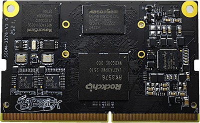
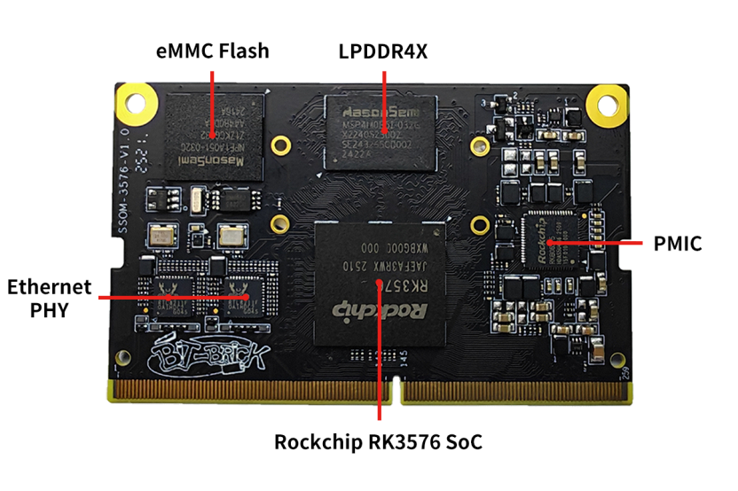
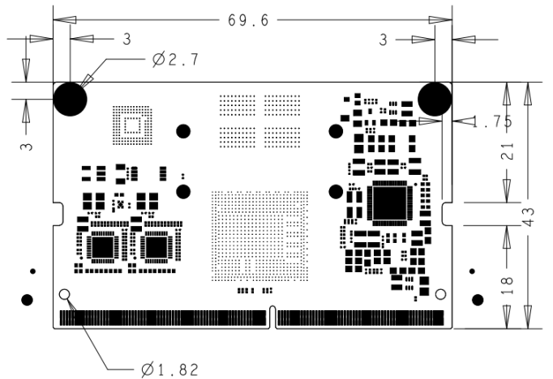

# Product Introduction

 

SSOM-3576 is a high-performance core module developed and designed based on the Rockchip RK3576 processor, suitable for applications such as smart terminals, industrial control, and edge computing.
It integrates a quad-core Cortex-A72 and a quad-core Cortex-A53 CPU, with a maximum frequency of up to 2.2GHz. The integrated ARM Mali-G52 MP4 GPU provides strong capabilities for multitasking and advanced graphics processing. The built-in NPU offers up to 6 TOPS of AI computing power, enabling efficient terminal AI workload inference and supporting applications such as edge computing and intelligent interaction.

The module leads out all functional signals through a 260-pin gold finger connector and features a wealth of high-speed interface signals, including Gigabit Ethernet, PCIe 2.1, USB 3.0, MIPI DSI/CSI, etc., facilitating flexible peripheral expansion and system integration. It supports ultra-high-definition video decoding up to 4K@120fps and multiple display configurations, meeting the needs of a wide range of multimedia and display-centric application scenarios.

With high performance, high stability, and excellent scalability, the SSOM-3576 is suitable for deployment in smart terminals, industrial tablet PCs, AI vision systems, and smart home control centers, providing developers with a stable and efficient embedded hardware platform.

## Functional Block Diagram

## Mechanical Dimensions

