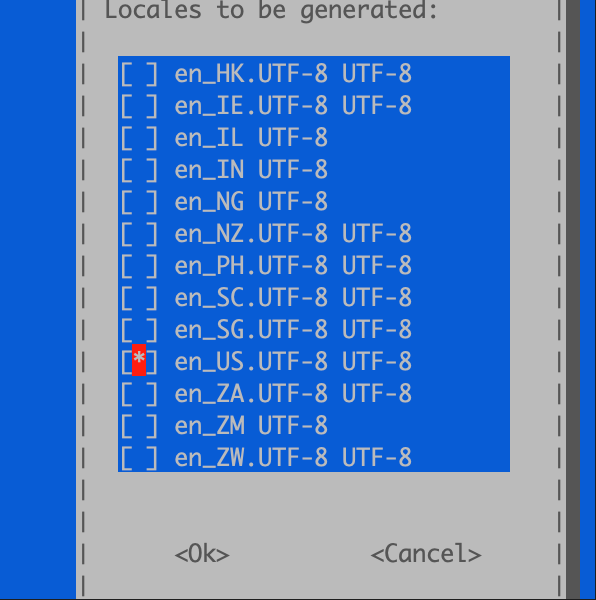

# Switch System Language

In Debian, you can use
```bash
locale
```
to check the current system language environment.   
If you need to switch the system language to English, you can follow these steps:
1. Edit the locale configuration file:
```bash
sudo dpkg-reconfigure locales
```
- Use the space key to select en_US.UTF-8 UTF-8
- (Optional) Deselect zh_CN.UTF-8 UTF-8 and other Chinese options
- Then press Tab → OK, and in the next screen select the default language as: en_US.UTF-8
  


2. Reboot the system

