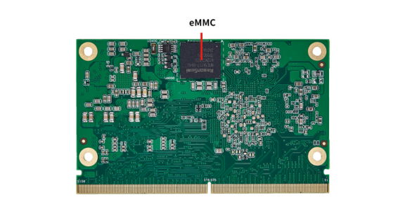

# Product Introduction

  

SSOM-3588是一款基于瑞芯微RK3588处理器开发设计的高性能、高集成度嵌入式计算平台，可提供卓越的计算性能和能效。专为工业控制、边缘计算、智能座舱和安防监控等应用场景设计。
该模块搭载的RK3588 SoC采用8纳米工艺制造，具备异构CPU架构，四核Cortex-A76（主频最高2.4 GHz）和四核Cortex-A55（主频最高1.8 GHz）。集成Mali-G610 MP4 GPU,内嵌2D图形引擎，支持OpenGL ES 1.1/2.0/3.2、OpenCL 2.2和Vulkan 1.2，支持8K视频编解码。内置的NPU提供6 TOPS的AI算力，支持INT4/INT8/INT16/FP16/BF16/TF32等。
SSOM-3588尺寸紧凑，PCIe3.0、USB3.1、HDMI2.1等大部分功能引脚通过金手指连接器引出。支持多屏显示、多路摄像头输入和高速数据传输，能够实现复杂AI和多媒体应用的快速部署。

## 功能框图

  

  

## 规格参数
| 参数          | 描述                                                         |
| ------------- | ------------------------------------------------------------ |
| CPU           | Rockchip RK3588, 四核Cortex-A76 + 四核Cortex-A55 , 主频最高可达2.4GHz |
| GPU           | ARM Mali-G610 MP4 GPU, 支持0penGL ES 1.1, 2.0 and 3.2/0penCL 2.2/Vulkan 1.2 |
| NPU           | 6 TOPS@INT8,支持INT4/INT8/INT16/FP16/BF16/TF32混合运算,支持深度学习框架如TensorFlow, PyTorch, Caffe等 |
| VPU           | 解码: 8K@60fps H.265/VP9/AVS2; 8K@30fps H.264 AVC/MVC; 4K@60fps AV1; 1080P@60fps MPEG-2/MPEG-1/VC-1/VP8编码: 8K@30fps H.265/H.264 |
| RAM           | 4GB/8GB/16GB/32GB LPDDR4X SDRAM                              |
| Flash         | 32GB/64GB/128GB eMMC                                         |
| 视频          | 输出: 1x HDMI2.1(8K@60fps or 4K@120fps); 1x DP1.4(4K@60fps); 2x MIPI-DSI(4K@60fps) 输入: 1x HDIMI-IN(4K@60fps),support HDCP2.3; 4x MIPI-CSI DPHY; 2x MIPI DC PHY |
| 音频          | 2x 8-channel I2S; 2x 2-channel I2S; 2x SPDIF; 2x 8-channel PDM; 1x dual-channel DAC、1x VAD |
| ISP           | 48MP ISP3.0, 支持HDR & 3DNR                                  |
| PCIe          | 3x PCIe3.0(3x 1Lane/1x 2Lane+2x 1Lane); 1x PCIe2.1(1Lane,multiplexed with SATA3.0) |
| Ethernet      | 2 x Gigabit Ethernet                                         |
| USB           | 2x USB3.1 0TG; 1x USB3.1 HOST; 4x USB2.0 HOST                |
| UART          | 10x                                                          |
| SDIO          | 1x                                                           |
| I2C           | 8x                                                           |
| SPI           | 4x                                                           |
| CAN           | 2x                                                           |
| PWM           | 13x                                                          |
| MIPI DSI      | 2x                                                           |
| MIPI CSI      | 2x                                                           |
| SATA          | 1x                                                           |
| 电源          | DC 4V                                                        |
| 工作温度      | -20 ~ 75 °C                                                  |
| 尺寸（长X宽） | 82 X 50 mm                                                   |
| 操作系统      | Linux/Android                                                |

## 引脚定义

| PinNumber | DefaultDefination | Corresponding GPIO | PinNumber | DefaultDefination | Corresponding GPIO |
| ----------------------------- | ------------------------------------- | -------------------------------------- | ----------------------------- | ------------------------------------- | :------------------------------------- |
| P1                            | NC                                    |                                        | S1                            | NC                                    |                                        |
| P2                            | GND                                   |                                        | S2                            | NC                                    |                                        |
| P3                            | MI PI_CSI0_RX_CLK0P                   |                                        | S3                            | GND                                   |                                        |
| P4                            | MI PI_CSI0_RX_CLK0N                   |                                        | S4                            | MI PI_CAM1_CLKOUT                     | GPIO1_B6_u                             |
| P5                            | NC                                    |                                        | S5                            | I2C3_SCL_M0_MI PI                     | GPIO1_C1_z                             |
| P6                            | NC                                    |                                        | S6                            | MI PI_CAM2_CLKOUT                     | GPIO1_B7_u                             |
| P7                            | MI PI_CSI0_RX_D0P                     |                                        | S7                            | I2C3_SDA_M0_MI PI                     | GPIO1_C0_z                             |
| P8                            | MI PI_CSI0_RX_D0N                     |                                        | S8                            | MI PI_CSI1_RX_CLK0P                   |                                        |
| P9                            | GND                                   |                                        | S9                            | MI PI_CSI1_RX_CLK0N                   |                                        |
| P10                           | MI PI_CSI0_RX_D1P                     |                                        | S10                           | GND                                   |                                        |
| P11 | MI PI_CSI0_RX_D1N   |     | S11   | MI PI_CSI1_RX_D0P  |    |
| P12  | GND  |      | S12  | MI PI_CSI1_RX_D0N |      |
| P13  | MI PI_CSI0_RX_D2P       |            | S13  | GND                    |            |
| P14  | MI PI_CSI0_RX_D2N       |            | S14  | MI PI_CSI1_RX_D1P      |            |
| P15  | GND                     |            | S15  | MI PI_CSI1_RX_D1N      |            |
| P16  | MI PI_CSI0_RX_D3P       |            | S16  | GND                    |            |
| P17  | MI PI_CSI0_RX_D3N       |            | S17  | PHY2_MDI0+             |            |
| P18  | GND                     |            | S18  | PHY2_MDI0-             |            |
| P19  | PHY0_MDI3-              |            | S19  | PHY2_LED2/CFG_LDO1     |            |
| P20  | PHY0_MDI3+              |            | S20  | PHY2_MDI1+             |            |
| P21  | PHY0_LED2/CFG_LDO1      |            | S21  | PHY2_MDI1+             |            |
| P22  | PHY0_LED1/CFG_LDO0      |            | S22  | PHY2_LED1/CFG_LDO0     |            |
| P23  | PHY0_MDI2-              |            | S23  | PHY2_MDI2+             |            |
| P24  | PHY0_MDI2+              |            | S24  | PHY2_MDI2-             |            |
| P25  | PHY0_LED0/CFG_EXT       |            | S25  | GND                    |            |
| P26  | PHY0_MDI1-              |            | S26  | PHY2_MDI3+             |            |
| P27  | PHY0_MDI1+              |            | S27  | PHY2_MDI3-             |            |
| P28  | GPIO4_C6_d              | GPIO4_C6_d | S28  | NC                     |            |
| P29  | PHY0_MDI0-              |            | S29  | PCIE30_PORT0_TX0P      |            |
| P30  | PHY0_MDI0+              |            | S30  | PCIE30_PORT0_TX0N      |            |
| P31  | SPI1_CS1_M2             | GPIO1_D5_d | S31  | PHY2_LED0/CFG_EXT      |            |
| P32  | GND                     |            | S32  | PCIE30_PORT0_RX0P      |            |
| P33  | NC                      |            | S33  | PCIE30_PORT0_RX0N      |            |
| P34  | SDMMC0_CMD              | GPIO4_D4_u | S34  | GND                    |            |
| P35  | SDMMC_DET_L             | GPIO0_A4_u | S35  | TYPEC0_SSTX2P          |            |
| P36  | SD_CLK                  | GPIO4_D5_u | S36  | TYPEC0_SSTX2N          |            |
| P37  | SDMMC_PWREN             | GPIO4_B0_d | S37  | TYPEC0_USB20_VBUSDET   |            |
| P38  | GND                     |            | S38  | I2S0_MCLK              | GPIO1_C2_d |
| P39  | SDMMC0_D0               | GPIO4_D0_u | S39  | I2S0_LRCK_TX           | GPIO1_C5_d |
| P40  | SDMMC0_D1               | GPIO4_D1_u | S40  | I2S0_SDO0              | GPIO1_C7_d |
| P41  | SDMMC0_D2               | GPIO4_D2_u | S41  | I2S0_SDI0              | GPIO1_D4_d |
| P42  | SDMMC0_D3               | GPIO4_D3_u | S42  | I2S0_SCLK_TX           | GPIO1_C3_d |
| P43  | SPI1_CS0_M2             | GPIO1_D3_d | S43  | HDMI_RX_SCL_M1         | GPIO3_D2_d |
| P44  | SPI1_CLK_M2             | GPIO1_D2_d | S44  | HDMI_RX_SDA_M1         | GPIO3_D3_d |
| P45  | SPI1_MISO_M2            | GPIO1_D0_d | S45  | HDMI_RX_D0P            |            |
| P46  | SPI1_MOSI_M2            | GPIO1_D1_d | S46  | HDMI_RX_D0N            |            |
| P47  | GND                     |            | S47  | GND                    |            |
| P48  | SATA30_1_TXP            |            | S48  | HDMI_RX_D1P            |            |
| P49  | SATA30_1_TXN            |            | S49  | HDMI_RX_D1N            |            |
| P50  | GND                     |            | S50  | HDMIIRX_HPDOUT_H       | GPIO3_D4_d |
| P51  | SATA30_1_RXP            |            | S51  | HDMI_RX_D2P            |            |
| P52  | SATA30_1_RXN            |            | S52  | HDMI_RX_D2N            |            |
| P53  | GND                     |            | S53  | NC                     |            |
| P54  | SPI0_CS0_M2             | GPIO1_B4_u | S54  | HDMI_RX_CLKP           |            |
| P55  | SPI0_CS1_M2             | GPIO1_B5_u | S55  | HDMI_RX_CLKN           |            |
| P56  | SPI0_CLK_M2             | GPIO1_B3_u | S56  | HDMI_RX_CEC            | GPIO3_D1_d |
| P57  | SPI0_MISO_M2            | GPIO1_B1_u | S57  | HDMIIRX_DET_L          | GPIO1_A4_d |
| P58  | SPI0_MOSI_M2            | GPIO1_B2_u | S58  | NC                     |            |
| P59  | GND                     |            | S59  | TYPEC0_SSRX2P          |            |
| P60  | TYPEC1_OTG_DP           |            | S60  | TYPEC0_SSRX2N          |            |
| P61  | TYPEC1_OTG_DM           |            | S61  | GND                    |            |
| P62  | USB0_EN_OC#             | GPIO4_B1_u | S62  | TYPEC0_SSTX1P          |            |
| P63  | TYPEC1_USB20_VBUSDET    |            | S63  | TYPEC0_SSTX1N          |            |
| P64  | TYPEC1_USB20_OTG_ID     |            | S64  | GND                    |            |
| P65  | USB20_HOST0_DP          |            | S65  | TYPEC0_SSRX1P          |            |
| P66  | USB20_HOST0_DM          |            | S66  | TYPEC0_SSRX1N          |            |
| P67  | USB1_EN_OC#             | GPIO4_B2_u | S67  | GND                    |            |
| P68  | GND                     |            | S68  | TYPEC0_OTG_DP          |            |
| P69  | USB20_HOST1_DP          |            | S69  | TYPEC0_OTG_DM          |            |
| P70  | USB20_HOST1_DM          |            | S70  | GND                    |            |
| P71  | USB2_EN_OC#             | GPIO4_B3_u | S71  | USB30_2_SSTXP          |            |
| P72  | TYPEC0_SBU1             |            | S72  | USB30_2_SSTXN          |            |
| P73  | TYPEC0_SBU2             |            | S73  | GND                    |            |
| P74  | NC                      |            | S74  | USB30_2_SSRXP          |            |
| P75  | PCIE20x1_2_PERSTn_M0_L  | GPIO4_C1_d | S75  | USB30_2_SSRXN          |            |
| P76  | PCIE30x1_1_CLKREQn_M1_L | GPIO4_A0_d | S76  | PCIE30x1_0_PERSTn_M2_L | GPIO4_A5_d |
| P77  | PCIE30x1_0_CLKREQn_M2_L   | GPIO4_A3_d | S77  | PCIE30x1_1_PERSTn_M1_L | GPIO4_A2_d |
| P78  | PCIE20x1_2_CLKREQn_M0_L   | GPIO4_B7_u | S78  | PCIE30_PORT1_RX1P      |            |
| P79  | GND                       |            | S79  | PCIE30_PORT1_RX1N      |            |
| P80  | PCIE30_REFCLKP_SLOT1      |            | S80  | GND                    |            |
| P81  | PCIE30_REFCLKN_SLOT1      |            | S81  | PCIE30_PORT1_TX1P      |            |
| P82  | GND                       |            | S82  | PCIE30_PORT1_TX1N      |            |
| P83  | PCIE20_0_REFCLKP          |            | S83  | GND                    |            |
| P84  | PCIE20_0_REFCLKN          |            | S84  | PCIE30_REFCLKP_SLOT0   |            |
| P85  | GND                       |            | S85  | PCIE30_REFCLKN_SLOT0   |            |
| P86  | PCIE20_0_RXP/SATA30_0_RXP |            | S86  | GND                    |            |
| P87  | PCIE20_0_RXN/SATA30_0_RXN |            | S87  | PCIE30_PORT0_RX1P      |            |
| P88  | GND                       |            | S88  | PCIE30_PORT0_RX1N      |            |
| P89  | PCIE20_0_TXP/SATA30_0_TXP |            | S89  | GND                    |            |
| P90  | PCIE20_0_TXN/SATA30_0_TXN |            | S90  | PCIE30_PORT0_TX1P      |            |
| P91  | GND                       |            | S91  | PCIE30_PORT0_TX1N      |            |
| P92  | HDMI0_TX2P_PORT           |            | S92  | GND                    |            |
| P93  | HDMI0_TX2N_PORT           |            | S93  | DP1_TX0P               |            |
| P94  | GND                       |            | S94  | DP1_TX0N               |            |
| P95  | HDMI0_TX1P_PORT           |            | S95  | NC                     |            |
| P96  | HDMI0_TX1N_PORT           |            | S96  | DP1_TX1P               |            |
| P97  | GND                       |            | S97  | DP1_TX1N               |            |
| P98  | HDMI0_TX0P_PORT           |            | S98  | DP1_HPDIN_M0           | GPIO5_D5_d |
| P99  | HDMI0_TX0N_PORT           |            | S99  | DP1_TX2P               |            |
| P100 | GND                       |            | S100 | DP1_TX2N               |            |
| P101 | HDMI0_TX3P_PORT           |            | S101 | GND                    |            |
| P102 | HDMI0_TX3N_PORT           |            | S102 | DP1_TX3P               |            |
| P103 | GND                       |            | S103 | DP1_TX3P               |            |
| P104 | HDMITX0_HPDIN_M0          | GPIO1_A5_d | S104 | TYPEC0_USB20_OTG_ID    |            |
| P105 | HDMITX0_SCL_M2            | GPIO3_C7_u | S105 | DP1_AUXP               |            |
| P106 | HDMITX0_SDA_M2            | GPIO3_D0_u | S106 | DP1_AUXN               |            |
| P107 | HDMITX0_CEC_M1            | GPIO0_D1_u | S107 | LCD1_BKLT_EN           | GPIO3_C6_u |
| P108 | MI PI_CAM1_PWREN_H        | GPIO1_D6_u | S108 | MI PI_DPHY1_TX_CLKP    |            |
| P109 | MI PI_CAM2_PWREN_H        | GPIO1_D7_u | S109 | MI PI_DPHY1_TX_CLKN    |            |
| P110 | MI PI_CAM1_PDN_L          | GPIO1_A7_u | S110 | GND                    |            |
| P111 | MI PI_CAM2_PDN_L          | GPIO3_B2_d | S111 | MI PI_DPHY1_TX_D0P     |            |
| P112 | HP_DET_L                  | GPIO1_C4_d | S112 | MI PI_DPHY1_TX_D0N     |            |
| P113 | PWM5_M1_FAN               | GPIO0_C6_u | S113 | NC                     |            |
| P114 | GPIO1_B0_u                | GPIO1_B0_u | S114 | MI PI_DPHY1_TX_D1P     |            |
| P115 | GPIO1_A6_d                | GPIO1_A6_d | S115 | MI PI_DPHY1_TX_D1N     |            |
| P116 | GPIO1_C6_d                | GPIO1_C6_d | S116 | LCD1_VDD_EN            |            |
| P117 | PCIE20x1_2_WAKEN_M0_L     | GPIO4_C0_u | S117 | MI PI_DPHY1_TX_D2P     |            |
| P118 | PCIE30x1_1_WAKEN_M1_L     | GPIO4_A1_d | S118 | MI PI_DPHY1_TX_D2N     |            |
| P119 | PCIE30x1_0_WAKEN_M2_L     | GPIO4_A4_d | S119 | GND                    |            |
| P120 | GND                       |            | S120 | MI PI_DPHY1_TX_D3P     |            |
| P121 | PCIE30X4_PERSTn_M0_L      | GPIO4_B6_d | S121 | MI PI_DPHY1_TX_D3N     |            |
| P122 | PCIE30X4_CLKREQn_M0_L     | GPIO4_B4_u | S122 | MI PI_DPHY1_TX_D3N     |            |
| P123 | BOOT_SARADC_IN0           |            | S123 | PCIE30X4_WAKEN_M0_L    | GPIO4_B5_d |
| P124 | HDMI0_TX_SBDP             |            | S124 | GND                    |            |
| P125 | HDMI0_TX_SBDN             |            | S125 | MI PI_DPHY0_TX_D0P     |            |
| P126 | NC                        |            | S126 | MI PI_DPHY0_TX_D0N     |            |
| P127 | RESET_L                   |            | S127 | LCD0_BKLT_EN           | GPIO3_A6_d |
| P128 | PWRON_L                   |            | S128 | MI PI_DPHY0_TX_D1P     |            |
| P129 | UART5_TX_M1               | GPIO3_C4_u | S129 | MI PI_DPHY0_TX_D1N     |            |
| P130 | UART5_RX_M1               | GPIO3_C5_u | S130 | GND                    |            |
| P131 | BT_REG_ON_H               | GPIO0_D2_u | S131 | MI PI_DPHY0_TX_D2P     |            |
| P132 | BT_WAKE_HOST_H            | GPIO0_A0_d | S132 | MI PI_DPHY0_TX_D2N     |            |
| P133 | GND                       |            | S133 | LCD0_VDD_EN            | GPIO2_B4_u |
| P134 | UART7_TX_M1               | GPIO3_C0_d | S134 | MI PI_DPHY0_TX_D3P     |            |
| P135 | UART7_RX_M1               | GPIO3_C1_d | S135 | MI PI_DPHY0_TX_D3N     |            |
| P136 | UART6_TX_M1               | GPIO1_A1_d | S136 | GND                    |            |
| P137 | UART6_RX_M1               | GPIO1_A0_d | S137 | MI PI_DPHY0_TX_D3N     |            |
| P138 | UART6_RTS_M1              | GPIO1_A2_d | S138 | MI PI_DPHY0_TX_CLKN    |            |
| P139 | UART6_CTS_M0              | GPIO1_A3_d | S139 | TP_INT_L               | GPIO2_C5_d |
| P140 | UART2_TX_M0_DEBUG         | GPIO0_B5_d | S140 | HOST_WAKE_BT_H         | GPIO2_C3_d |
| P141 | UART2_RX_M0_DEBUG | GPIO0_B6_d | S141 | LCD0_BKLT_PWM     | GPIO3_B6_d |
| P142 | GND               |            | S142 | GPIO0_D3_d        | GPIO0_D3_d |
| P143 | CAN0_TX_M0        | GPIO0_B7_d | S143 | GND               |            |
| P144 | CAN0_RX_M0        | GPIO0_B8_d | S144 | GPIO0_B2_u        | GPIO0_B2_u |
| P145 | CAN2_TX_M1        | GPIO0_D5_u | S145 | NC                |            |
| P146 | CAN2_RX_M1        | GPIO0_D4_u | S146 | NC                |            |
| P147 | VCC4V0_SYS        |            | S147 | VDD_RTC           |            |
| P148 | VCC4V0_SYS        |            | S148 | SARADC_VIN5_HW_ID |            |
| P149 | VCC4V0_SYS        |            | S149 | NC                |            |
| P150 | VCC4V0_SYS        |            | S150 | SARADC_IN6        |            |
| P151 | VCC4V0_SYS        |            | S151 | SARADC_IN1        |            |
| P152 | VCC4V0_SYS        |            | S152 | SARADC_IN2        |            |
| P153 | VCC4V0_SYS        |            | S153 | SARADC_IN3        |            |
| P154 | VCC4V0_SYS        |            | S154 | NC                |            |
| P155 | VCC4V0_SYS        |            | S155 | NC                |            |
| P156 | VCC4V0_SYS        |            | S156 | SARADC_IN4        |            |
|      |                   |            | S157 | NC                |            |
|      |                   |            | S158 | GND               |            |

## Mechanical Dimensions 

Size:160mm X 140mm

