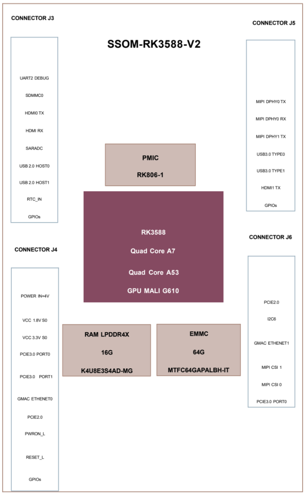
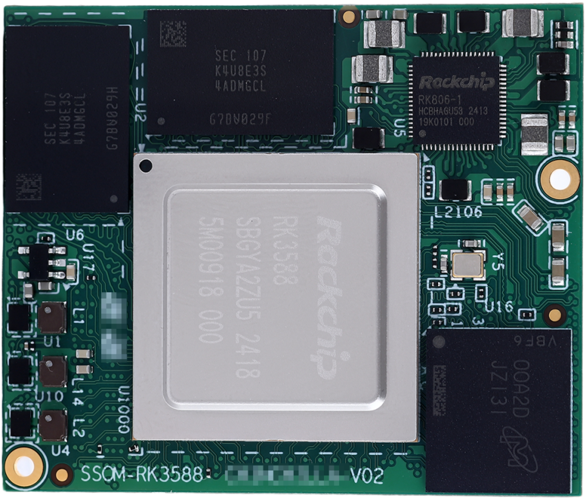
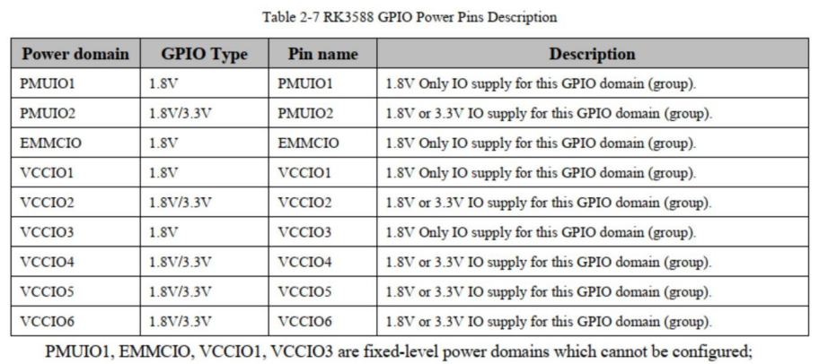
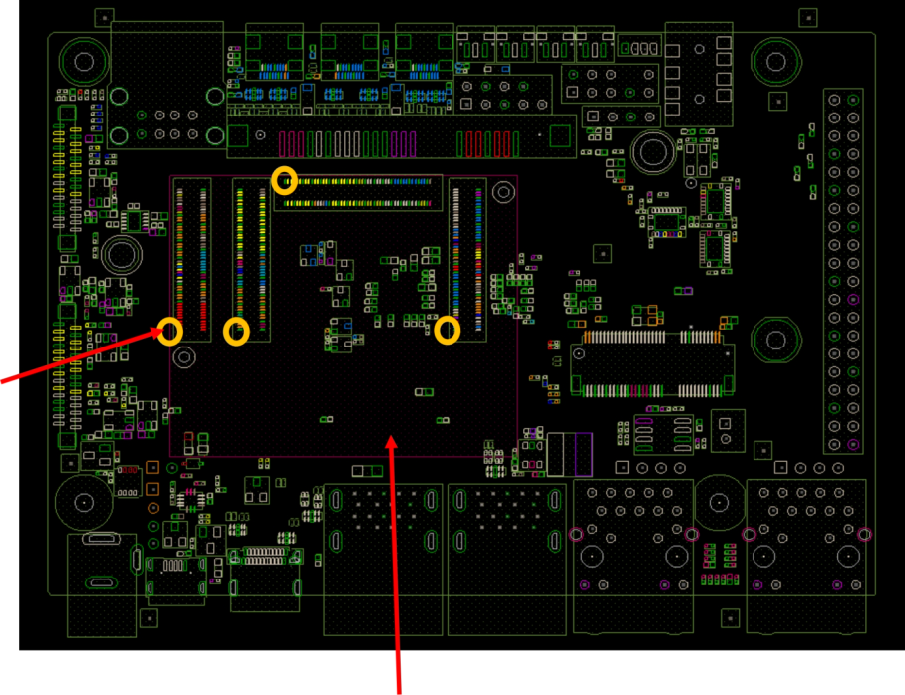

# Bit-Brick SSOM-3588-X2 datasheet

 

0 Release Note

| Revision | Data          | Contents    |
| -------- | ------------- | ----------- |
| V1.0     | June 18, 2025 | First Draft |

## 2. Summary

• The SSOM-RK3588-V2 SoM (System on Module), developed by Bit-Brick, leverages the Rockchip RK3588 SoC, which is grounded in the ARM architecture. This board combines the advanced quad-core ARM Cortex-A76 and quad-core Cortex-A55 CPUs, ensuring a balance between performance and efficiency.

• Additionally, the RK3588 boasts a high-performance 4-channel external memory interface (LPDDR4/LPDDR4X/LPDDR5), designed to meet the high memory bandwidth requirements of applications ranging from graphic post-processing to demanding computational tasks.

• The SoM contains LPDDR4X, eMMC, PMIC and four board-to-board connectors

• Since most of the SoC signals can connected through the board-to-board connectors, most of the Soc’s functions are available.

 

### 2.1 Devices

• Soc: RK3588 of Rockchip.

• 2xLPDDR4X up to 8GB

• eMMC up to 128GB

• PMIC: RK806-1 of Rockchip

 

### 2.2 Features

***• Microprocessor***

- Quad-core Cortex-A76 up to 2.4GHz

- Quad-core Cortex-A55 up to 1.8GHz

- 64KB I-cache 64KB D-cache and 512KB L2 for A76 each core, 32KB I-cache 32KB D-cache and 512KB L2 for A55 each core, 3MB L3 cache

- 6.0 TOPS Neural Process Unit, Embedded 384KB*3 internal buffer

- Mali-G610 MP4 up to 0.8GHz

 

***• Memory Organization***

- LPDDR4X RAM 16GB

- EMMC 64GB

 

***• Boot ROM***

- Supports system code download through USB OTG

• Secure system

- Embedded two cipher engine

- Support key ladder to guarantee key secure

- Support secure OS and data scrambling

- Support OTP

 

***• Video Decoder/Encoder***

- Supports video decoding up to 8K@60fps

- Supports H.264/265 encode up to 8K@30fps

- H.264 HP encoding up to 1080p@100fps

- Picture size up to 8192x8192

 

***• NPU***

- Include Triple NPU core

- Support deep learning frameworks

 

***• Display Subsystem*** 

***Video Output***

- Supports 2-CH HDMI 2.1 TX with ARC, up to 8K@60fps

- Or EDP TX interface up to 4K@60Hz

- HDMI 2.1 support FRL mode

- Supports 4 lanes MIPI DSI up to 4K@60Hz

- Supports 2-CH PD1.4a interface up to 8K@30Hz

- Supports BT-1120 16bit output

 

***Video/Image Input***

- Supports 3-CH MIPI 4lanes CSI interfaces

- Or 4-CH MIPI 2lanes + 1-CH 4lanes CSI interfaces

- Supports HDMI 2.0 RX interface up to 4K@30Hz

- Supports DVP 8/16-bit input

 

***• Audio***

- Three I2S/PCM interfaces

- Support 8-ch TX/RX on I2S0/1

- Support Mic array Up to 8ch PDM/TDM interface

- Two SPDIF output

- Support voice activity detection

 

***• USB/PCIE/SATA3***

- Two USB2.0 OTG/Host and two USB2.0 Host interfaces

- Two USB3.0 OTG/Host or DP interface

- One USB3.0 Host or SATA3 interface.

- One PCIE2.1x1 or SATA3 interface.

- One SATA3 interface.

- One PCIE3.0x2 interface

- Not support USB3.0/USB2.0 OTG SRP, HNP and RSP

- SATA3 support five device each port via PM switch

 

***•*** ***Ethernet***

- Support up to 2-CH 1GB Ethernet

- Support RMII/RGMII PHY interface

 

***• I2C***

- Up to 7-CH I2C

- Support standard mode and fast mode (up to 400kbit/s)

 

***• SDIO / SDMMC***

- Support SDIO 3.0 protocol

- Support SD3.0 card

 

***• SPI***

- Up to four SPI controllers,

- Full-duplex synchronous serial interface

 

***• UART***

- Support up to 10 UARTs

- UART2 with 2 wires for debug

- Embedded two 64byte FIFO

 

***• CAN***

- Support up to three CAN controller

- Support CAN 2.0B protocol

 

***• ADC***

- Up to Two ADC channels

- 12-bit resolution up to 1MS/s sampling rate

- Voltage input range between 0V to 1.8V

 

***• PWM***

- Up to15 PWMs with interrupt-based operation

- Support 32bit time/counter facility

- IR option on PWM3/7/11/15

 

***• Power unit***

- PMIC RK806-1 on board

- 3.3 ~ 4.4V Power input

- 1.8V and 3.3V max 500mA out

### 2.3 SoM Block Diagram

***Figure 1: Shows SSOM-RK3588-V2 block diagram***

### 2.4 Board Pictures

 

***Figure 2: shows the top-side view of the SSOM-RK3588-V2 board***

 

***Figure 3: shows the bottom-side view of the SSOM-RK3588-V2 board***

 

 

## 3 Mechanical Specification

 

### 3.1 Board

• Board dimensions: 47mm x 39.4mm x 4.7mm (dimensional tolerance ±0.10mm)

• Component mounting surface: Maximum height: 2mm (Soc part RK3588)

• Connectors surface P/N: DF40C-100DP-0.4V(51)

• Board thickness: 1.2mm

• 10 layers of immersion gold PCB.

 

### 3.2 Holes For Fixing The Board

• Holes size: Hole diameter: 1.6mm

• Pad outer diameter: 3.175mm

• Holes position

 

***Figure 4: Holes position on top-side***

***All dimension is mm***

 

### 3.3 Connectors Position

 

***Figure 5: Connectors position on bottom-side All dimension is mm***

The SoM board connectors used DF40C-100DP-0.4V(51) and the corresponding carrier board connector is DF40HC(3.0)-100DS-0.4V(58)

These model numbers suggest that these connectors are part of Hirose Electric Co's DF40 series, which are known for their compact size and high reliability in board-to-board connection.

 

### 3.4 Main Components

 ***• Part location***

 

***Figure 6: Parts position on top-side All dimension is mm***

 

***•*** ***Part Height***

U1000: 2mm (Soc part RK3588)

U2, U6: 0.8 to 1mm (RAM LPDDR4X)

U5: 0.9mm (PMIC)

U17: 1.25mm

L1, L2, L4: 1.2mm

L2100, L2102, L2104, L2106, L2108, L2109: 1mm

L2101, L2103, L2105, L2107: 1.2mm

 

 

 

## 4.Connector Pin Function Description

 

***Note: Pin Type Symbol Definitions***

| ***Symbol*** | ***Description*** |
| ---------------- | --------------------- |
| I                | Input                 |
| O                | Output                |
| I/O              | Input/Output          |
| AI               | Analog Input          |
| AO               | Analog Output         |
| AI/O             | Analog Input/Output   |
| PI               | Power Supply          |
| PO               | Power Output          |
| SOM              | System on module      |

 

***Table 1: J3 Connector Interface Pin Definition***

| ***Pin Number*** | ***Signal*** ***Name*** | ***Signal*** ***T******ype*** | ***IO******Voltage*** | ***Main*** ***IC*** | ***IC Pin Number*** | ***IC*** ***P******in*** ***Name***          |
| -------------------- | ------------------------------- | ----------------------------------------- | ----------------------------- | --------------------------- | ----------------------- | ------------------------------------------------------------ |
| 1(J3)                | GND                             | PI                                        | 0V                            |                             |                         |                                                              |
| 2(J3)                | GPIO1_A7                        | I/O                                       | 1.8V                          | RK3588                      | C25                     | PDM1_SDI0_M1/PCIE30X1_1_PERSTN_M2/PWM3 _IR_M3/SPI2_CS0_M0/GPIO1_A7_u |
| 3(J3)                | GPIO1_A6                        | I/O                                       | 1.8V                          | RK3588                      | C24                     | HDMI_TX1_HPD_M0/SPI2_CLK_M0/GPIO1_A6_d                       |
| 4(J3)                | GPIO3_D1                        | I/O                                       | 3.3V                          | RK3588                      | AG23                    | CIF_D13/PCIE20X1_2_PERSTN_M0/HDMI_RX_CE C_M1/UART4_TX_M1/PWM9_M2/SPI0_MISO_M3/ GPIO3_D1_d |
| 5(J3)                | GPIO3_D2                        | I/O                                       | 3.3V                          | RK3588                      | AG25                    | CIF_D14/PCIE30X2_CLKREQN_M2/HDMI_RX_SCL _M1/I2C7_SCL_M2/UART9_RTSN_M2/SPI0_MOSI _M3/GPIO3_D2_d |
| 6(J3)                | GPIO1_D4                        | I/O                                       | 1.8V                          | RK3588                      | D28                     | I2S0_SDI0/GPIO1_D4_d                                         |
| 7(J3)                | GPIO4_B7                        | I/O                                       | 3.3V                          | RK3588                      | AJ28                    | BT1120_D13/PCIE20X1_2_CLKREQN_M1/HDMI_T X0_SCL_M0/I2C5_SDA_M1/SPI3_CLK_M1/GPIO4_ B7_u |
| 8(J3)                | UART2_TX_M0_DEBUG               | I/O                                       | 1.8V                          | RK3588                      | P29                     | I2S1_MCLK_M1/JTAG_TCK_M2/I2C1_SCL_M0/UA RT2_TX_M0/PCIE30X1_1_CLKREQN_M0/GPIO0_B 5_d |
| 9(J3)                | GPIO3_D3                        | I/O                                       | 3.3V                          | RK3588                      | AG24                    | CIF_D15/PCIE30X2_WAKEN_M2/HDMI_RX_SDA_  M1/I2C7_SDA_M2/UART9_CTSN_M2/PWM10_M2/ SPI0_CLK_M3/GPIO3_D3_d |
| 10(J3)               | UART2_RX_M0_DEBUG               | I/O                                       | 1.8V                          | RK3588                      | R29                     | I2S1_SCLK_M1/JTAG_TMS_M2/I2C1_SDA_M0/UA RT2_RX_M0/PCIE30X1_1_WAKEN_M0/GPIO0_B6_ d |
| 11(J3)               | GPIO3_C6                        | I/O                                       | 3.3V                          | RK3588                      | AG26                    | CIF_D10/PCIE30X4_PERSTN_M2/HDMI_TX1_SCL_ M1/SPI3_MISO_M3/GPIO3_C6_u |
| 12(J3)               | GPIO1_A0                        | I/O                                       | 1.8V                          | RK3588                      | A24                     | PCIE30X1_1_CLKREQN_M2/DP0_HPDIN_M2/I2C2 _SDA_M4/UART6_RX_M1/SPI4_MISO_M2/GPIO1_ A0_d |
| 13(J3)               | TYPEC1_OTG_ID                   | I                                         |                               | RK3588                      | AK8                     | TYPEC1_USB20_OTG_ID                                          |
| 14(J3)               | SDMMC0_D0                       | I/O                                       |                               | RK3588                      | AD2                     | SDMMC_D0/PDM1_SDI3_M0/JTAG_TCK_M1/I2C3 _SCL_M4/UART2_TX_M1/PWM8_M1/GPIO4_D0_u |
| 15(J3)               | TYPEC1_USB20_VBUSDET            | I                                         |                               | RK3588                      | AL8                     | TYPEC1_USB20_VBUSDET                                         |
| 16(J3)               | SDMMC0_D1                       | I/O                                       |                               | RK3588                      | AD1                     | SDMMC_D1/PDM1_SDI2_M0/JTAG_TMS_M1/I2C 3_SDA_M4/UART2_RX_M1/PWM9_M1/GPIO4_D1 _u |
| 17(J3)               | GND                             | PI                                        | 0V                            |                             |                         |                                                              |
| 18(J3)               | SDMMC0_D3                       | I/O                                       |                               | RK3588                      | AF1                     | SDMMC_D3/PDM1_SDI0_M0/JTAG_TMS_M0/I2C 8_SDA_M0/UART5_RTSN_M0/PWM10_M1/GPIO4 _D3_u |
| 19(J3)               | HDMI_RX_CLKP                    | AI                                        |                               | RK3588                      | AF6                     | HDMI_RX_CLKP                                                 |
| 20(J3)               | SDMMC0_D2                       | I/O                                       |                               | RK3588                      | AF2                     | SDMMC_D2/PDM1_SDI1_M0/JTAG_TCK_M0/I2C8 _SCL_M0/UART5_CTSN_M0/GPIO4_D2_u |
| 21(J3)               | HDMI_RX_CLKN                    | AI                                        |                               | RK3588                      | AF5                     | HDMI_RX_CLKN                                                 |
| 22(J3)               | SD_CLK                          | I/O                                       |                               | RK3588                      | AE1                     | SDMMC_CLK/PDM1_CLK0_M0/TEST_CLKOUT_M 0/MCU_JTAG_TMS_M0/CAN0_RX_M1/UART5_TX _M0/GPIO4_D5_d |
| 23(J3)               | GND                             | PI                                        | 0V                            |                             |                         |                                                              |
| 24(J3)               | SDMMC0_CMD                      | I/O                                       |                               | RK3588                      | AE2                     | SDMMC_CMD/PDM1_CLK1_M0/MCU_JTAG_TCK_ M0/CAN0_TX_M1/UART5_RX_M0/PWM7_IR_M1/  GPIO4_D4_u |
| 25(J3)               | HDMI_RX_D0N                     | AI                                        |                               | RK3588                      | AG4                     | HDMI_RX_D0N                                                  |
| 26(J3)               | GND                             | PI                                        | 0V                            |                             |                         |                                                              |
| 27(J3)               | HDMI_RX_D0P                     | AI                                        |                               | RK3588                      | AG5                     | HDMI_RX_D0P                                                  |
| 28(J3)               | GPIO1_B2                        | I/O                                       | 1.8V                          | RK3588                      | D26                     | PDM1_SDI3_M1/PCIE30X4_PERSTN_M3/UART4_ RX_M2/SPI0_MOSI_M2/GPIO1_B2_d |
| 29(J3)               | GND                             | PI                                        | 0V                            |                             |                         |                                                              |
| 30(J3)               | GPIO0_C6                        | I/O                                       | 1.8V                          | RK3588                      | T29                     | I2S1_SDI1_M1/NPU_AVS/UART0_RTSN/PWM5_M 1/SPI0_CLK_M0/PCIE30X4_CLKREQN_M0/SATA_ CP_POD/GPIO0_C6_u |
| 31(J3)               | HDMI_RX_D1N                     | AI                                        |                               | RK3588                      | AH5                     | HDMI_RX_D1N                                                  |
| 32(J3)               | GPIO0_C5                        | I/O                                       | 1.8V                          | RK3588                      | P30                     | I2S1_SDI0_M1/GPU_AVS/UART0_TX_M0/I2C4_SC L_M2/DP1_HPDIN_M1/PWM4_M0/PCIE30X1_0_P ERSTN_M0/GPIO0_C5_u |
| 33(J3)               | HDMI_RX_D1P                     | AI                                        |                               | RK3588                      | AH6                     | HDMI_RX_D1P                                                  |
| 34(J3)               | GPIO0_B7                        | I/O                                       | 1.8V                          | RK3588                      | T28                     | I2S1_LRCK_M1/PWM0_M0/I2C2_SCL_M0/CAN0_ TX_M0/SPI0_CS1_M0/PCIE30X1_1_PERSTN_M0/ GPIO0_B7_d |
| 35(J3)               | GND                             | PI                                        | 0V                            |                             |                         |                                                              |
| 36(J3)               | SDMMC_DET/GPIO0_A4_ U           | I/O                                       |                               | RK3588                      | P31                     | SDMMC_DET/GPIO0_A4_u                                         |
| 37(J3)               | HDMI_RX_D2N                     | AI                                        |                               | RK3588                      | AJ4                     | HDMI_RX_D2N                                                  |
| 38(J3)               | GPIO3_C1                        | I/O                                       | 3.3V                          | RK3588                      | Y27                     | GMAC1_PPSCLK/PCIE30X2_BUTTON_RSTN/UART 7_RX_M1/SPI1_CLK_M1/GPIO3_C1_d |
| 39(J3)               | HDMI_RX_D2P                     | AI                                        |                               | RK3588                      | AJ5                     | HDMI_RX_D2P                                                  |
| 40(J3)               | GPIO0_C4                        | I/O                                       | 1.8V                          | RK3588                      | R30                     | PDM0_CLK1_M1/PWM2_M0/UART0_RX_M0/I2C4 _SDA_M2/DP0_HPDIN_M1/PCIE30X1_0_WAKEN_ M0/GPIO0_C4_d |
| 41(J3)               | GND                             | PI                                        | 0V                            |                             |                         |                                                              |
| 42(J3)               | GPIO3_D4                        | I/O                                       | 3.3V                          | RK3588                      | AA27                    | HDMI_TX0_HPD_M1/PCIE30X2_PERSTN_M2/HD  MI_RX_HPDOUT_M1/MCU_JTAG_TCK_M1/UART9 _RX_M2/SPI0_CS0_M3/GPIO3_D4_d |
| 43(J3)               | USB20_HOST0_DP                  | AI/O                                      |                               | RK3588                      | AK6                     | USB20_HOST0_DP                                               |
| 44(J3)               | GPIO3_D5                        | I/O                                       | 3.3V                          | RK3588                      | AB28                    | PCIE30X4_BUTTON_RSTN/DP1_HPDIN_M0/MCU_ JTAG_TMS_M1/UART9_TX_M2/PWM11_IR_M3/S PI0_CS1_M3/GPIO3_D5_d |
| 45(J3)               | USB20_HOST0_DM                  | AI/O                                      |                               | RK3588                      | AL6                     | USB20_HOST0_DM                                               |
| 46(J3)               | GPIO1_B1                        | I/O                                       | 1.8V                          | RK3588                      | D25                     | PDM1_SDI2_M1/PCIE30X4_WAKEN_M3/SPI0_MIS O_M2/GPIO1_B1_d      |
| 47(J3)               | GND                             | PI                                        | 0V                            |                             |                         |                                                              |
| 48(J3)               | GPIO1_B4                        | I/O                                       | 1.8V                          | RK3588                      | E24                     | PDM1_CLK0_M1/PCIE30X1_0_PERSTN_M2/UART 7_RX_M2/SPI0_CS0_M2/GPIO1_B4_u |
| 49(J3)               | USB20_HOST1_DP                  | AI/O                                      |                               | RK3588                      | AL7                     | USB20_HOST1_DP                                               |
| 50(J3)               | GPIO1_B6                        | I/O                                       | 1.8V                          | RK3588                      | E26                     | MIPI_CAMERA1_CLK_M0/SPDIF0_TX_M0/PCIE30 X2_WAKEN_M3/HDMI_RX_HPDOUT_M2/I2C5_SC L_M3/UART1_TX_M1/GPIO1_B6_u |
| 51(J3)               | USB20_HOST1_DM                  | AI/O                                      |                               | RK3588                      | AM7                     | USB20_HOST1_DM                                               |
| 52(J3)               | GPIO1_D7                        | I/O                                       | 1.8V                          | RK3588                      | F25                     | MIPI_CAMERA4_CLK_M0/PCIE30X2_CLKREQN_M 3/HDMI_RX_SDA_M2/I2C8_SDA_M2/UART1_CTS N_M1/PWM15_IR_M3/GPIO1_D7_u |
| 53(J3)               | GND                             | PI                                        | 0V                            |                             |                         |                                                              |
| 54(J3)               | GPIO1_D6                        | I/O                                       | 1.8V                          | RK3588                      | F24                     | MIPI_CAMERA3_CLK_M0/HDMI_RX_SCL_M2/I2C 8_SCL_M2/UART1_RTSN_M1/PWM14_M2/GPIO1 _D6_u |
| 55(J3)               | GPIO1_D0                        | I/O                                       | 1.8V                          | RK3588                      | F26                     | I2S0_SDO1/I2C7_SCL_M0/UART6_TX_M2/SPI1_M ISO_M2/GPIO1_D0_d   |
| 56(J3)               | GPIO1_D2                        | I/O                                       | 1.8V                          | RK3588                      | F28                     | I2S0_SDO3/I2S0_SDI2/PDM0_SDI2_M0/I2C1_SCL _M4/UART4_TX_M0/PWM0_M1/SPI1_CLK_M2/GP IO1_D2_d |
| 57(J3)               | GPIO1_D1                        | I/O                                       | 1.8V                          | RK3588                      | F27                     | I2S0_SDO2/I2S0_SDI3/PDM0_SDI1_M0/I2C7_SDA _M0/UART6_RX_M2/SPI1_MOSI_M2/GPIO1_D1_d |
| 58(J3)               | GPIO1_B5                        | I/O                                       | 1.8V                          | RK3588                      | E25                     | PCIE30X1_0_CLKREQN_M2/UART7_TX_M2/SPI0_ CS1_M2/GPIO1_B5_u    |
| 59(J3)               | GPIO1_D5                        | I/O                                       | 1.8V                          | RK3588                      | G26                     | PDM0_SDI0_M0/SPI1_CS1_M2/GPIO1_D5_d                          |
| 60(J3)               | GPIO1_D3                        | I/O                                       | 1.8V                          | RK3588                      | E28                     | I2S0_SDI1/PDM0_SDI3_M0/I2C1_SDA_M4/UART4 _RX_M0/PWM1_M1/SPI1_CS0_M2/GPIO1_D3_d |
| 61(J3)               | GPIO1_C1                        | I/O                                       | 1.8V                          | RK3588                      | G27                     | I2C3_SCL_M0/UART3_TX_M0/SPI4_MOSI_M0/GPI O1_C1_z             |
| 62(J3)               | GPIO1_C0                        | I/O                                       | 1.8V                          | RK3588                      | G29                     | I2C3_SDA_M0/UART3_RX_M0/SPI4_MISO_M0/GP IO1_C0_z             |
| 63(J3)               | GPIO1_B3                        | I/O                                       | 1.8V                          | RK3588                      | D27                     | PDM1_CLK1_M1/PCIE30X1_0_WAKEN_M2/SATA0 _ACT_LED_M1/UART4_TX_M2/SPI0_CLK_M2/GPI O1_B3_d |
| 64(J3)               | GND                             | PI                                        | 0V                            |                             |                         |                                                              |
| 65(J3)               | GPIO1_C2                        | I/O                                       | 1.8V                          | RK3588                      | F30                     | I2S0_MCLK/I2C6_SDA_M1/UART3_RTSN/PWM3_I R_M2/SPI4_CLK_M0/GPIO1_C2_d |
| 66(J3)               | HDMI0_TX_SBDP/EDP0_T X_AUXP     | AI/O                                      |                               | RK3588                      | AG2                     | HDMI_TX0_SBDP/EDP_TX0_AUXP                                   |
| 67(J3)               | GPIO3_C4                        | I/O                                       | 3.3V                          | RK3588                      | AH26                    | CIF_D8/FSPI_CS0N_M2/PCIE30X4_CLKREQN_M2/ HDMI_TX1_CEC_M2/CAN2_RX_M0/UART5_TX_M 1/SPI3_CS0_M3/GPIO3_C4_u |
| 68(J3)               | HDMI0_TX_SBDN/EDP0_T X_AUXN     | AI/O                                      |                               | RK3588                      | AG1                     | HDMI_TX0_SBDN/EDP_TX0_AUXN                                   |
| 69(J3)               | GPIO3_D0                        | I/O                                       | 3.3V                          | RK3588                      | AH24                    | CIF_D12/PCIE20X1_2_WAKEN_M0/HDMI_TX0_SD A_M2/I2C5_SDA_M0/UART4_RX_M1/PWM8_M2/S PI3_CLK_M3/GPIO3_D0_u |
| 70(J3)               | GND                             | PI                                        | 0V                            |                             |                         |                                                              |
| 71(J3)               | GPIO3_C5                        | I/O                                       | 3.3V                          | RK3588                      | AH25                    | CIF_D9/FSPI_CS1N_M2/PCIE30X4_WAKEN_M2/H DMI_TX1_SDA_M1/CAN2_TX_M0/UART5_RX_M1/ SPI3_CS1_M3/GPIO3_C5_u |
| 72(J3)               | HDMI0_TX3P_PORT/EDP0 _TX_D3P    | AO                                        |                               | RK3588                      | AH3                     | HDMI_TX0_D3P/EDP_TX0_D3P                                     |
| 73(J3)               | SARADC_VIN5_HW_ID               | AI                                        | 1.8V                          | RK3588                      | AK15                    | SARADC_IN5                                                   |
| 74(J3)               | HDMI0_TX3N_PORT/EDP0 _TX_D3N    | AO                                        |                               | RK3588                      | AH2                     | HDMI_TX0_D3N/EDP_TX0_D3N                                     |
| 75(J3)               | GPIO4_B6                        | I/O                                       | 3.3V                          | RK3588                      | AJ27                    | BT1120_D12/PCIE30X4_PERSTN_M1/HDMI_RX_H PDOUT_M0/SATA0_ACT_LED_M0/I2C5_SCL_M1/ PWM13_M1/SPI3_MOSI_M1/GPIO4_B6_d |
| 76(J3)               | GND                             | PI                                        | 0V                            |                             |                         |                                                              |
| 77(J3)               | TYPEC0_OTG_ID                   | I                                         |                               | RK3588                      | AL14                    | TYPEC0_USB20_OTG_ID                                          |
| 78(J3)               | HDMI0_TX0P_PORT/EDP0 _TX_D0P    | AO                                        |                               | RK3588                      | AJ2                     | HDMI_TX0_D0P/EDP_TX0_D0P                                     |
| 79(J3)               | TYPEC0_USB20_VBUSDET            | I                                         |                               | RK3588                      | AM14                    | TYPEC0_USB20_VBUSDET                                         |
| 80(J3)               | HDMI0_TX0N_PORT/EDP0 _TX_D0N    | AO                                        |                               | RK3588                      | AJ1                     | HDMI_TX0_D0N/EDP_TX0_D0N                                     |
| 81(J3)               | RTC_INT_L                       | I/O                                       | 1.8V                          | RK3588                      | L30                     | SPI2_CS1_M2/I2C1_SCL_M1/UART0_RX_M1/GPI O0_B0_z              |
| 82(J3)               | GND                             | PI                                        | 0V                            |                             |                         |                                                              |
| 83(J3)               | GPIO3_C7                        | I/O                                       | 3.3V                          | RK3588                      | AJ24                    | CIF_D11/PCIE20X1_2_CLKREQN_M0/HDMI_TX0_ SCL_M2/I2C5_SCL_M0/SPI3_MOSI_M3/GPIO3_C7 _u |
| 84(J3)               | HDMI0_TX1P_PORT/EDP0 _TX_D1P    | AO                                        |                               | RK3588                      | AK3                     | HDMI_TX0_D1P/EDP_TX0_D1P                                     |
| 85(J3)               | GPIO3_C0                        | I/O                                       | 3.3V                          | RK3588                      | Y29                     | GMAC1_PPSTRIG/I2C3_SDA_M1/UART7_TX_M1/S PI1_MISO_M1/GPIO3_C0_d |
| 86(J3)               | HDMI0_TX1N_PORT/EDP0 _TX_D1N    | AO                                        |                               | RK3588                      | AK2                     | HDMI_TX0_D1N/EDP_TX0_D1N                                     |
| 87(J3)               | BOOT_SARADC_IN0                 | AI                                        | 1.8V                          | RK3588                      | AM16                    | SARADC_IN0_BOOT                                              |
| 88(J3)               | GND                             | PI                                        | 0V                            |                             |                         |                                                              |
| 89(J3)               | SARADC_VIN1_KEY/RECO VERY       | AI                                        | 1.8V                          | RK3588                      | AL16                    | SARADC_IN1                                                   |
| 90(J3)               | HDMI0_TX2P_PORT/EDP0 _TX_D2P    | AO                                        |                               | RK3588                      | AL2                     | HDMI_TX0_D2P/EDP_TX0_D2P                                     |
| 91(J3)               | SARADC_IN3                      | AI                                        | 1.8V                          | RK3588                      | AN17                    | SARADC_IN3                                                   |
| 92(J3)               | HDMI0_TX2N_PORT/EDP0 _TX_D2N    | AO                                        |                               | RK3588                      | AL1                     | HDMI_TX0_D2N/EDP_TX0_D2N                                     |
| 93(J3)               | SARADC_IN2                      | AI                                        | 1.8V                          | RK3588                      | AK16                    | SARADC_IN2                                                   |
| 94(J3)               | GND                             | PI                                        | 0V                            |                             |                         |                                                              |
| 95(J3)               | SARADC_IN6                      | AI                                        | 1.8V                          | RK3588                      | AL17                    | SARADC_IN6                                                   |
| 96(J3)               | HDMI1_TX_SBDN/EDP1_T X_AUXN     | AI/O                                      |                               | RK3588                      | AP2                     | HDMI_TX1_SBDN/EDP_TX1_AUXN                                   |
| 97(J3)               | SARADC_IN7                      | AI                                        | 1.8V                          | RK3588                      | AK17                    | SARADC_IN7                                                   |
| 98(J3)               | HDMI1_TX_SBDP/EDP1_T X_AUXP     | AI/O                                      |                               | RK3588                      | AN2                     | HDMI_TX1_SBDP/EDP_TX1_AUXP                                   |
| 99(J3)               | SARADC_IN4                      | AI                                        | 1.8V                          | RK3588                      | AM17                    | SARADC_IN4                                                   |
| 100(J3)              | GND                             | PI                                        | 0V                            |                             |                         |                                                              |

 

***Table 2: J4 Connector Interface Pin Definition***

| ***Pin******Number*** | ***Signal*** ***Name*** | ***Signal*** ***T******ype*** | ***IO******Voltage*** | ***Main*** ***IC*** | ***IC*** ***P******in***  ***N******umber*** | ***IC*** ***P******in*** ***Name***          |
| ----------------------------- | ------------------------------- | ----------------------------------------- | ----------------------------- | --------------------------- | ------------------------------------------------------------ | ------------------------------------------------------------ |
| 1(J4)                         | VCC4V0_SYS                      | PI                                        | 4.0V                          |                             |                                                              |                                                              |
| 2(J4)                         | VCC4V0_SYS                      | PI                                        | 4.0V                          |                             |                                                              |                                                              |
| 3(J4)                         | VCC4V0_SYS                      | PI                                        | 4.0V                          |                             |                                                              |                                                              |
| 4(J4)                         | VCC4V0_SYS                      | PI                                        | 4.0V                          |                             |                                                              |                                                              |
| 5(J4)                         | VCC4V0_SYS                      | PI                                        | 4.0V                          |                             |                                                              |                                                              |
| 6(J4)                         | VCC4V0_SYS                      | PI                                        | 4.0V                          |                             |                                                              |                                                              |
| 7(J4)                         | VCC4V0_SYS                      | PI                                        | 4.0V                          |                             |                                                              |                                                              |
| 8(J4)                         | VCC4V0_SYS                      | PI                                        | 4.0V                          |                             |                                                              |                                                              |
| 9(J4)                         | VCC4V0_SYS                      | PI                                        | 4.0V                          |                             |                                                              |                                                              |
| 10(J4)                        | VCC4V0_SYS                      | PI                                        | 4.0V                          |                             |                                                              |                                                              |
| 11(J4)                        | VCC4V0_SYS                      | PI                                        | 4.0V                          |                             |                                                              |                                                              |
| 12(J4)                        | VCC4V0_SYS                      | PI                                        | 4.0V                          |                             |                                                              |                                                              |
| 13(J4)                        | VCC4V0_SYS                      | PI                                        | 4.0V                          |                             |                                                              |                                                              |
| 14(J4)                        | VCC4V0_SYS                      | PI                                        | 4.0V                          |                             |                                                              |                                                              |
| 15(J4)                        | VCC4V0_SYS                      | PI                                        | 4.0V                          |                             |                                                              |                                                              |
| 16(J4)                        | VCC4V0_SYS                      | PI                                        | 4.0V                          |                             |                                                              |                                                              |
| 17(J4)                        | VCC4V0_SYS                      | PI                                        | 4.0V                          |                             |                                                              |                                                              |
| 18(J4)                        | VCC4V0_SYS                      | PI                                        | 4.0V                          |                             |                                                              |                                                              |
| 19(J4)                        | VCC4V0_SYS                      | PI                                        | 4.0V                          |                             |                                                              |                                                              |
| 20(J4)                        | VCC4V0_SYS                      | PI                                        | 4.0V                          |                             |                                                              |                                                              |
| 21(J4)                        | GND                             | PI                                        | 0V                            |                             |                                                              |                                                              |
| 22(J4)                        | VCC_1V8_S0                      | PO                                        | 1.8V                          |                             |                                                              |                                                              |
| 23(J4)                        | PCIE30_PORT0_TX1P               | AO                                        |                               | RK3588                      | C33                                                          | PCIE30_PORT0_TX1P                                            |
| 24(J4)                        | VCC_1V8_S0                      | PO                                        | 1.8V                          |                             |                                                              |                                                              |
| 25(J4)                        | PCIE30_PORT0_TX1N               | AO                                        |                               | RK3588                      | C34                                                          | PCIE30_PORT0_TX1N                                            |
| 26(J4)                        | VCC_3V3_S0                      | PO                                        | 3.3V                          |                             |                                                              |                                                              |
| 27(J4)                        | GND                             | PI                                        | 0V                            |                             |                                                              |                                                              |
| 28(J4)                        | VCC_3V3_S0                      | PO                                        | 3.3V                          |                             |                                                              |                                                              |
| 29(J4)                        | PCIE30_PORT0_RX1N               | AI                                        |                               | RK3588                      | F33                                                          | PCIE30_PORT0_RX1N                                            |
| 30(J4)                        | GND                             | PI                                        | 0V                            |                             |                                                              |                                                              |
| 31(J4)                        | PCIE30_PORT0_RX1P               | AI                                        |                               | RK3588                      | F32                                                          | PCIE30_PORT0_RX1P                                            |
| 32(J4)                        | PCIE30_PORT0_RX0N               | AI                                        |                               | RK3588                      | G34                                                          | PCIE30_PORT0_RX0N                                            |
| 33(J4)                        | GND                             | PI                                        | 0V                            |                             |                                                              |                                                              |
| 34(J4)                        | PCIE30_PORT0_RX0P               | AI                                        |                               | RK3588                      | G33                                                          | PCIE30_PORT0_RX0P                                            |
| 35(J4)                        | PMIC_EXT_EN_OUT                 | O                                         | MAX 4V                        |                             |                                                              |                                                              |
| 36(J4)                        | GND                             | PI                                        | 0V                            |                             |                                                              |                                                              |
| 37(J4)                        | GPIO1_A4                        | I/O                                       | 1.8V                          | RK3588                      | B25                                                          | HDMI_TX1_SCL_M2/SPI2_MISO_M0/GPIO1_A4_d                      |
| 38(J4)                        | PCIE20_1_RXN/SATA30_1 _RXN      | AI                                        |                               | RK3588                      | J34                                                          | PCIE20_1_RXN/SATA30_1_RXN                                    |
| 39(J4)                        | GPIO1_A1                        | I/O                                       | 1.8V                          | RK3588                      | A25                                                          | PCIE30X1_1_WAKEN_M2/DP1_HPDIN_M2/SATA1 _ACT_LED_M1/I2C2_SCL_M4/UART6_TX_M1/SPI 4_MOSI_M2/GPIO1_A1_d |
| 40(J4)                        | PCIE20_1_RXP/SATA30_1 _RXP      | AI                                        |                               | RK3588                      | J33                                                          | PCIE20_1_RXP/SATA30_1_RXP                                    |
| 41(J4)                        | GPIO1_B7                        | I/O                                       | 1.8V                          | RK3588                      | E27                                                          | MIPI_CAMERA2_CLK_M0/SPDIF1_TX_M0/PCIE30 X2_PERSTN_M3/HDMI_RX_CEC_M2/SATA2_ACT_ LED_M1/I2C5_SDA_M3/UART1_RX_M1/PWM13_  M2/GPIO1_B7_u |
| 42(J4)                        | GND                             | PI                                        | 0V                            |                             |                                                              |                                                              |
| 43(J4)                        | GPIO1_A2                        | I/O                                       | 1.8V                          | RK3588                      | A26                                                          | VOP_POST_EMPTY/I2C4_SDA_M3/UART6_RTSN_ M1/PWM0_M2/SPI4_CLK_M2/GPIO1_A2_d |
| 44(J4)                        | ETH1_REFCLKO_25M                | I/O                                       |                               | RK3588                      | AH27                                                         | ETH1_REFCLKO_25M/MIPI_CAMERA1_CLK_M1/I2 C4_SCL_M0/GPIO3_A6_d |
| 45(J4)                        | GPIO1_A5                        | I/O                                       | 1.8V                          | RK3588                      | B26                                                          | HDMI_TX0_HPD_M0/SPI2_MOSI_M0/GPIO1_A5_d                      |
| 46(J4)                        | GMAC1_RXD2                      | I/O                                       |                               | RK3588                      | AD27                                                         | GMAC1_RXD2/SDIO_D2_M1/I2S3_LRCK/AUDDSM _LP/FSPI_D2_M2/UART8_TX_M1/SPI4_CLK_M1/G PIO3_A2_u |
| 47(J4)                        | GPIO1_A3                        | I/O                                       | 1.8V                          | RK3588                      | A27                                                          | HDMI_TX1_SDA_M2/I2C4_SCL_M3/UART6_CTSN _M1/PWM1_M2/SPI4_CS0_M2/GPIO1_A3_d |
| 48(J4)                        | GMAC1_RXDV_CRS                  | I/O                                       |                               | RK3588                      | AH29                                                         | GMAC1_RXDV_CRS/MIPI_CAMERA4_CLK_M1/UA RT2_TX_M2/PWM2_M1/GPIO3_B1_d |
| 49(J4)                        | GPIO1_B0                        | I/O                                       | 1.8V                          | RK3588                      | C27                                                          | PDM1_SDI1_M1/PCIE30X4_CLKREQN_M3/SPI2_C S1_M0/GPIO1_B0_u     |
| 50(J4)                        | GMAC1_RXCLK                     | I/O                                       |                               | RK3588                      | AH30                                                         | GMAC1_RXCLK/SDIO_CLK_M1/MIPI_CAMERA0_C LK_M1/FSPI_CLK_M2/I2C4_SDA_M0/UART8_CTS N_M1/GPIO3_A5_d |
| 51(J4)                        | GND                             | PI                                        | 0V                            |                             |                                                              |                                                              |
| 52(J4)                        | GMAC1_RXD3                      | I/O                                       |                               | RK3588                      | AE27                                                         | GMAC1_RXD3/SDIO_D3_M1/I2S3_SDO/AUDDSM_ RN/FSPI_D3_M2/UART8_RX_M1/SPI4_CS0_M1/G PIO3_A3_u |
| 53(J4)                        | PCIE30_PORT1_REFCLKP_ IN        | AI                                        |                               | RK3588                      | A28                                                          | PCIE30_PORT1_REF_CLKP                                        |
| 54(J4)                        | GMAC1_RXD0                      | I/O                                       |                               | RK3588                      | AG29                                                         | GMAC1_RXD0/MIPI_CAMERA2_CLK_M1/PWM8_ M0/GPIO3_A7_u           |
| 55(J4)                        | PCIE30_PORT1_REFCLKN _IN        | AI                                        |                               | RK3588                      | B28                                                          | PCIE30_PORT1_REF_CLKN                                        |
| 56(J4)                        | GMAC1_RXD1                      | I/O                                       |                               | RK3588                      | AG28                                                         | GMAC1_RXD1/MIPI_CAMERA3_CLK_M1/PWM9_ M0/GPIO3_B0_u           |
| 57(J4)                        | GND                             | PI                                        | 0V                            |                             |                                                              |                                                              |
| 58(J4)                        | GND                             | PI                                        | 0V                            |                             |                                                              |                                                              |
| 59(J4)                        | PCIE30_PORT1_TX3N               | AO                                        |                               | RK3588                      | B29                                                          | PCIE30_PORT1_TX1N                                            |
| 60(J4)                        | GPIO1_C6                        | I/O                                       | 1.8V                          | RK3588                      | D29                                                          | PDM0_CLK0_M0/I2C4_SDA_M4/PWM15_IR_M2/G PIO1_C6_d             |
| 61(J4)                        | PCIE30_PORT1_TX3P               | AO                                        |                               | RK3588                      | C29                                                          | PCIE30_PORT1_TX1P                                            |
| 62(J4)                        | GPIO1_C5                        | I/O                                       | 1.8V                          | RK3588                      | D30                                                          | I2S0_LRCK/I2C2_SCL_M3/UART4_RTSN/GPIO1_C 5_d                 |
| 63(J4)                        | GND                             | PI                                        | 0V                            |                             |                                                              |                                                              |
| 64(J4)                        | GPIO1_C3                        | I/O                                       | 1.8V                          | RK3588                      | E31                                                          | I2S0_SCLK/I2C6_SCL_M1/UART3_CTSN/PWM7_I R_M2/SPI4_CS0_M0/GPIO1_C3_d |
| 65(J4)                        | PCIE30_PORT1_TX2N               | AO                                        |                               | RK3588                      | A30                                                          | PCIE30_PORT1_TX0N                                            |
| 66(J4)                        | GPIO1_C4                        | I/O                                       | 1.8V                          | RK3588                      | E30                                                          | PDM0_CLK1_M0/I2C2_SDA_M3/PWM11_IR_M2/S PI4_CS1_M0/GPIO1_C4_d |
| 67(J4)                        | PCIE30_PORT1_TX2P               | AO                                        |                               | RK3588                      | B30                                                          | PCIE30_PORT1_TX0P                                            |
| 68(J4)                        | GPIO1_C7                        | I/O                                       | 1.8V                          | RK3588                      | E29                                                          | I2S0_SDO0/I2C4_SCL_M4/UART4_CTSN/GPIO1_C 7_d                 |
| 69(J4)                        | GND                             | PI                                        | 0V                            |                             |                                                              |                                                              |
| 70(J4)                        | GND                             | PI                                        | 0V                            |                             |                                                              |                                                              |
| 71(J4)                        | PCIE20_2_TXN                    | AO                                        |                               | RK3588                      | H29                                                          | PCIE20_2_TXN/SATA30_2_TXN/USB30_2_SSTXN                      |
| 72(J4)                        | PCIE20_2_RXP                    | AI                                        |                               | RK3588                      | J31                                                          | PCIE20_2_RXP/SATA30_2_RXP/USB30_2_SSRXP                      |
| 73(J4)                        | PCIE20_2_TXP                    | AO                                        |                               | RK3588                      | H30                                                          | PCIE20_2_TXP/SATA30_2_TXP/USB30_2_SSTXP                      |
| 74(J4)                        | PCIE20_2_RXN                    | AI                                        |                               | RK3588                      | J30                                                          | PCIE20_2_RXN/SATA30_2_RXN/USB30_2_SSRXN                      |
| 75(J4)                        | GND                             | PI                                        | 0V                            |                             |                                                              |                                                              |
| 76(J4)                        | GND                             | PI                                        | 0V                            |                             |                                                              |                                                              |
| 77(J4)                        | PCIE20_0_REFCLKP                | AI/O                                      |                               | RK3588                      | L32                                                          | PCIE20_0_REFCLKP                                             |
| 78(J4)                        | GPIO4_A0                        | I/O                                       | 3.3V                          | RK3588                      | AK30                                                         | CIF_D0/BT1120_D0/I2S1_MCLK_M0/PCIE30X1_1_ CLKREQN_M1/UART9_RTSN_M1/SPI0_MISO_M1/ GPIO4_A0_d |
| 79(J4)                        | PCIE20_0_REFCLKN                | AI/O                                      |                               | RK3588                      | L33                                                          | PCIE20_0_REFCLKN                                             |
| 80(J4)                        | GPIO4_A1                        | I/O                                       | 3.3V                          | RK3588                      | AL30                                                         | CIF_D1/BT1120_D1/I2S1_SCLK_M0/PCIE30X1_1_ WAKEN_M1/UART9_CTSN_M1/SPI0_MOSI_M1/GP IO4_A1_d |
| 81(J4)                        | GND                             | PI                                        | 0V                            |                             |                                                              |                                                              |
| 82(J4)                        | GPIO4_A5                        | I/O                                       | 3.3V                          | RK3588                      | AK27                                                         | CIF_D5/BT1120_D5/I2S1_SDI0_M0/PCIE30X1_0_P ERSTN_M1/I2C3_SDA_M2/UART3_TX_M2/SPI2_M OSI_M1/GPIO4_A5_d |
| 83(J4)                        | GPIO2_B4                        | I/O                                       | 1.8V                          | RK3588                      | AB31                                                         | GMAC0_PTP_REFCLK/FSPI_CS0N_M1/HDMI_TX1 _SDA_M0/I2C4_SDA_M1/UART7_RX_M0/GPIO2_B 4_u |
| 84(J4)                        | PWRON_L                         | I                                         |                               |                             |                                                              |                                                              |
| 85(J4)                        | GPIO2_A6                        | I/O                                       | 1.8V                          | RK3588                      | AC32                                                         | GMAC0_RXD2/SDIO_D0_M0/FSPI_D0_M1/UART6 _RX_M0/GPIO2_A6_u     |
| 86(J4)                        | RESET_L                         | I                                         |                               | RK3588                      | M31                                                          | NPOR                                                         |
| 87(J4)                        | GPIO2_A7                        | I/O                                       | 1.8V                          | RK3588                      | AC31                                                         | GMAC0_RXD3/SDIO_D1_M0/FSPI_D1_M1/UART6 _TX_M0/GPIO2_A7_u     |
| 88(J4)                        | GPIO4_A3                        | I/O                                       | 3.3V                          | RK3588                      | AL29                                                         | CIF_D3/BT1120_D3/PCIE30X1_0_CLKREQN_M1/U ART0_TX_M2/GPIO4_A3_d |
| 89(J4)                        | GPIO2_C1                        | I/O                                       | 1.8V                          | RK3588                      | AD32                                                         | GMAC0_RXD0/I2C2_SCL_M1/UART1_CTSN_M0/S PI1_MISO_M0/GPIO2_C1_d |
| 90(J4)                        | GPIO4_A2                        | I/O                                       | 3.3V                          | RK3588                      | AM29                                                         | CIF_D2/BT1120_D2/I2S1_LRCK_M0/PCIE30X1_1_ PERSTN_M1/SPI0_CLK_M1/GPIO4_A2_d |
| 91(J4)                        | GPIO2_C5                        | I/O                                       | 1.8V                          | RK3588                      | AE30                                                         | CLK32K_OUT1/GPIO2_C5_d                                       |
| 92(J4)                        | GPIO4_A4                        | I/O                                       | 3.3V                          | RK3588                      | AL28                                                         | CIF_D4/BT1120_D4/PCIE30X1_0_WAKEN_M1/I2C 3_SCL_M2/UART0_RX_M2/SPI2_MISO_M1/GPIO4 _A4_d |
| 93(J4)                        | GPIO2_C3                        | I/O                                       | 1.8V                          | RK3588                      | AD30                                                         | ETH0_REFCLKO_25M/I2S2_SDI_M0/I2C6_SCL_M 2/SPI1_CS0_M0/GPIO2_C3_d |
| 94(J4)                        | GPIO4_A6                        | I/O                                       | 3.3V                          | RK3588                      | AL27                                                         | CIF_D6/BT1120_D6/I2S1_SDI1_M0/PCIE30X2_CL KREQN_M1/I2C5_SCL_M2/UART3_RX_M2/SPI2_C LK_M1/GPIO4_A6_d |
| 95(J4)                        | GPIO2_B5                        | I/O                                       | 1.8V                          | RK3588                      | AB30                                                         | GMAC0_PPSTRIG/FSPI_CS1N_M1/HDMI_TX1_SC L_M0/I2C4_SCL_M1/UART7_TX_M0/GPIO2_B5_u |
| 96(J4)                        | GPIO4_A7                        | I/O                                       | 3.3V                          | RK3588                      | AM27                                                         | CIF_D7/BT1120_D7/I2S1_SDI2_M0/PCIE30X2_WA KEN_M1/I2C5_SDA_M2/SPI2_CS0_M1/GPIO4_A7 _d |
| 97(J4)                        | GPIO3_B2                        | I/O                                       | 3.3V                          | RK3588                      | AE28                                                         | GMAC1_TXER/I2S2_SDI_M1/UART2_RX_M2/PWM 3_IR_M1/GPIO3_B2_d    |
| 98(J4)                        | GPIO4_B0                        | I/O                                       | 3.3V                          | RK3588                      | AK26                                                         | CIF_CLKIN/BT1120_CLKOUT/I2S1_SDI3_M0/PCIE3 0X2_PERSTN_M1/I2C6_SDA_M3/UART8_TX_M0/  SPI2_CS1_M1/GPIO4_B0_d |
| 99(J4)                        | GPIO4_C5                        | I/O                                       | 3.3V                          | RK3588                      | AB33                                                         | GMAC0_MDIO/I2C0_SCL_M1/UART9_CTSN_M0/P WM6_M2/SPI3_MOSI_M0/GPIO4_C5_d |
| 100(J4)                       | GND                             | PI                                        | 0V                            |                             |                                                              |                                                              |

 

***Table 3: J5 Connector Interface Pin Definition***

| ***Pin******Number*** | ***Signal*** ***Name*** | ***Signal*** ***T******ype*** | ***IO******V******oltage*** | ***Main*** ***IC*** | ***IC*** ***P******in***  ***N******umber*** | ***IC*** ***P******in*** ***Name***          |
| ----------------------------- | ------------------------------- | ----------------------------------------- | --------------------------------------- | --------------------------- | ------------------------------------------------------------ | ------------------------------------------------------------ |
| 1(J5)                         | GND                             | PI                                        | 0V                                      |                             |                                                              |                                                              |
| 2(J5)                         | GND                             | PI                                        | 0V                                      |                             |                                                              |                                                              |
| 3(J5)                         | MIPI_DPHY0_RX_D1P               | AI                                        |                                         | RK3588                      | AN30                                                         | MIPI_DPHY0_RX_D1P/MIPI_CPHY0_RX_TRIO1_A                      |
| 4(J5)                         | MIPI_DPHY0_RX_D2P               | AI                                        |                                         | RK3588                      | AN33                                                         | MIPI_DPHY0_RX_D2P/MIPI_CPHY0_RX_TRIO2_B                      |
| 5(J5)                         | MIPI_DPHY0_RX_D1N               | AI                                        |                                         | RK3588                      | AP30                                                         | MIPI_DPHY0_RX_D1N/MIPI_CPHY0_RX_TRIO0_C                      |
| 6(J5)                         | MIPI_DPHY0_RX_D2N               | AI                                        |                                         | RK3588                      | AP32                                                         | MIPI_DPHY0_RX_D2N/MIPI_CPHY0_RX_Trio2_A                      |
| 7(J5)                         | GND                             | PI                                        | 0V                                      |                             |                                                              |                                                              |
| 8(J5)                         | GND                             | PI                                        | 0V                                      |                             |                                                              |                                                              |
| 9(J5)                         | MIPI_DPHY0_RX_D0P               | AI                                        |                                         | RK3588                      | AN29                                                         | MIPI_DPHY0_RX_D0P/MIPI_CPHY0_RX_TRIO0_B                      |
| 10(J5)                        | MIPI_DPHY0_RX_CLKP              | AI                                        |                                         | RK3588                      | AN32                                                         | MIPI_DPHY0_RX_CLKP/MIPI_CPHY0_RX_TRIO1_ C                    |
| 11(J5)                        | MIPI_DPHY0_RX_D0N               | AI                                        |                                         | RK3588                      | AP29                                                         | MIPI_DPHY0_RX_D0N/MIPI_CPHY0_RX_TRIO0_A                      |
| 12(J5)                        | MIPI_DPHY0_RX_CLKN              | AI                                        |                                         | RK3588                      | AP31                                                         | MIPI_DPHY0_RX_CLKN/MIPI_CPHY0_RX_TRIO1_ B                    |
| 13(J5)                        | GND                             | PI                                        | 0V                                      |                             |                                                              |                                                              |
| 14(J5)                        | GND                             | PI                                        | 0V                                      |                             |                                                              |                                                              |
| 15(J5)                        | MIPI_DPHY0_TX_D2N               | AO                                        |                                         | RK3588                      | AP27                                                         | MIPI_DPHY0_TX_D2N/MIPI_CPHY0_TX_TRIO2_A                      |
| 16(J5)                        | MIPI_DPHY0_TX_D3P               | AO                                        |                                         | RK3588                      | AN28                                                         | MIPI_DPHY0_TX_D3P/NO_USE                                     |
| 17(J5)                        | MIPI_DPHY0_TX_D2P               | AO                                        |                                         | RK3588                      | AN27                                                         | MIPI_DPHY0_TX_D2P/MIPI_CPHY0_TX_TRIO2_B                      |
| 18(J5)                        | MIPI_DPHY0_TX_D3N               | AO                                        |                                         | RK3588                      | AP28                                                         | MIPI_DPHY0_TX_D3N/MIPI_CPHY0_TX_TRIO2_C                      |
| 19(J5)                        | GND                             | PI                                        | 0V                                      |                             |                                                              |                                                              |
| 20(J5)                        | GND                             | PI                                        | 0V                                      |                             |                                                              |                                                              |
| 21(J5)                        | MIPI_DPHY0_TX_CLKP              | AO                                        |                                         | RK3588                      | AN26                                                         | MIPI_DPHY0_TX_CLKP/MIPI_CPHY0_TX_TRIO1_C                     |
| 22(J5)                        | GPIO4_B4                        | GPIO                                      | 3.3V                                    | RK3588                      | AL26                                                         | CIF_CLKOUT/BT1120_D10/I2S1_SDO3_M0/PCIE30 X4_CLKREQN_M1/DP0_HPDIN_M0/SPDIF0_TX_M 1/UART9_TX_M1/PWM11_IR_M1/GPIO4_B4_u |
| 23(J5)                        | MIPI_DPHY0_TX_CLKN              | AO                                        |                                         | RK3588                      | AP26                                                         | MIPI_DPHY0_TX_CLKN/MIPI_CPHY0_TX_TRIO1_ B                    |
| 24(J5)                        | GPIO4_B2                        | GPIO                                      | 3.3V                                    | RK3588                      | AK25                                                         | CIF_HREF/BT1120_D8/I2S1_SDO1_M0/PCIE30X1_ 1_BUTTON_RSTN/I2C7_SCL_M3/UART8_RTSN_M 0/PWM14_M1/SPI0_CS0_M1/CAN1_RX_M1/GPIO4 _B2_u |
| 25(J5)                        | GND                             | PI                                        | 0V                                      |                             |                                                              |                                                              |
| 26(J5)                        | GPIO4_B3                        | GPIO                                      | 3.3V                                    | RK3588                      | AM25                                                         | CIF_VSYNC/BT1120_D9/I2S1_SDO2_M0/PCIE20X1 _2_BUTTON_RSTN/I2C7_SDA_M3/UART8_CTSN_ M0/PWM15_IR_M1/CAN1_TX_M1/GPIO4_B3_u |
| 27(J5)                        | MIPI_DPHY0_TX_D1P               | AO                                        |                                         | RK3588                      | AN25                                                         | MIPI_DPHY0_TX_D1P/MIPI_CPHY0_TX_TRIO1_A                      |
| 28(J5)                        | GPIO4_B1                        | GPIO                                      | 3.3V                                    | RK3588                      | AL24                                                         | MIPI_CAMERA0_CLK_M0/SPDIF1_TX_M1/I2S1_S DO0_M0/PCIE30X1_0_BUTTON_RSTN/SATA2_AC T_LED_M0/I2C6_SCL_M3/UART8_RX_M0/SPI0_C S1_M1/GPIO4_B1_u |
| 29(J5)                        | MIPI_DPHY0_TX_D1N               | AO                                        |                                         | RK3588                      | AP25                                                         | MIPI_DPHY0_TX_D1N/MIPI_CPHY0_TX_TRIO0_C                      |
| 30(J5)                        | GPIO4_C1                        | GPIO                                      | 3.3V                                    | RK3588                      | AK24                                                         | BT1120_D15/SPDIF1_TX_M2/PCIE20X1_2_PERST N_M1/HDMI_TX0_CEC_M0/I2C8_SDA_M3/PWM6_ M1/SPI3_CS1_M1/GPIO4_C1_d |
| 31(J5)                        | GND                             | PI                                        | 0V                                      |                             |                                                              |                                                              |
| 32(J5)                        | GND                             | PI                                        | 0V                                      |                             |                                                              |                                                              |
| 33(J5)                        | MIPI_DPHY0_TX_D0P               | AO                                        |                                         | RK3588                      | AN24                                                         | MIPI_DPHY0_TX_D0P/MIPI_CPHY0_TX_TRIO0_B                      |
| 34(J5)                        | MIPI_DPHY1_TX_D3N               | AO                                        |                                         | RK3588                      | AP22                                                         | MIPI_DPHY1_TX_D3N/MIPI_CPHY1_TX_TRIO2_C                      |
| 35(J5)                        | MIPI_DPHY0_TX_D0N               | AO                                        |                                         | RK3588                      | AP24                                                         | MIPI_DPHY0_TX_D0N/MIPI_CPHY0_TX_TRIO0_A                      |
| 36(J5)                        | MIPI_DPHY1_TX_D3P               | AO                                        |                                         | RK3588                      | AN22                                                         | MIPI_DPHY1_TX_D3P/NO_USE                                     |
| 37(J5)                        | GND                             | PI                                        | 0V                                      |                             |                                                              |                                                              |
| 38(J5)                        | GND                             | PI                                        | 0V                                      |                             |                                                              |                                                              |
| 39(J5)                        | MIPI_DPHY1_TX_D2P               | AO                                        |                                         | RK3588                      | AN21                                                         | MIPI_DPHY1_TX_D2P/MIPI_CPHY1_TX_TRIO2_B                      |
| 40(J5)                        | MIPI_DPHY1_TX_CLKN              | AO                                        |                                         | RK3588                      | AP20                                                         | MIPI_DPHY1_TX_CLKN/MIPI_CPHY1_TX_TRIO1_ B                    |
| 41(J5)                        | MIPI_DPHY1_TX_D2N               | AO                                        |                                         | RK3588                      | AP21                                                         | MIPI_DPHY1_TX_D2N/MIPI_CPHY1_TX_TRIO2_A                      |
| 42(J5)                        | MIPI_DPHY1_TX_CLKP              | AO                                        |                                         | RK3588                      | AN20                                                         | MIPI_DPHY1_TX_CLKP/MIPI_CPHY1_TX_TRIO1_C                     |
| 43(J5)                        | GND                             | PI                                        | 0V                                      |                             |                                                              |                                                              |
| 44(J5)                        | GND                             | PI                                        | 0V                                      |                             |                                                              |                                                              |
| 45(J5)                        | MIPI_DPHY1_TX_D1N               | AO                                        |                                         | RK3588                      | AP19                                                         | MIPI_DPHY1_TX_D1N/MIPI_CPHY1_TX_TRIO0_C                      |
| 46(J5)                        | MIPI_DPHY1_TX_D0N               | AO                                        |                                         | RK3588                      | AP18                                                         | MIPI_DPHY1_TX_D0N/MIPI_CPHY1_TX_TRIO0_A                      |
| 47(J5)                        | MIPI_DPHY1_TX_D1P               | AO                                        |                                         | RK3588                      | AN19                                                         | MIPI_DPHY1_TX_D1P/MIPI_CPHY1_TX_TRIO1_A                      |
| 48(J5)                        | MIPI_DPHY1_TX_D0P               | AO                                        |                                         | RK3588                      | AN18                                                         | MIPI_DPHY1_TX_D0P/MIPI_CPHY1_TX_TRIO0_B                      |
| 49(J5)                        | GND                             | PI                                        | 0V                                      |                             |                                                              |                                                              |
| 50(J5)                        | GND                             | PI                                        | 0V                                      |                             |                                                              |                                                              |
| 51(J5)                        | TYPEC0_SSTX2P/DP0_TX 3P         | AO                                        |                                         | RK3588                      | AP16                                                         | TYPEC0_SSTX2P/DP0_TX3P                                       |
| 52(J5)                        | TYPEC0_SSRX2P/DP0_TX 2P         | AI/O                                      |                                         | RK3588                      | AN15                                                         | TYPEC0_SSRX2P/DP0_TX2P                                       |
| 53(J5)                        | TYPEC0_SSTX2N/DP0_TX 3N         | AO                                        |                                         | RK3588                      | AN16                                                         | TYPEC0_SSTX2N/DP0_TX3N                                       |
| 54(J5)                        | TYPEC0_SSRX2N/DP0_TX 2N         | AI/O                                      |                                         | RK3588                      | AP15                                                         | TYPEC0_SSRX2N/DP0_TX2N                                       |
| 55(J5)                        | GND                             | PI                                        | 0V                                      |                             |                                                              |                                                              |
| 56(J5)                        | GND                             | PI                                        | 0V                                      |                             |                                                              |                                                              |
| 57(J5)                        | TYPEC1_SSRX2P/DP1_TX 2P         | AI/O                                      |                                         | RK3588                      | AN10                                                         | TYPEC1_SSRX2P/DP1_TX2P                                       |
| 58(J5)                        | TYPEC0_SSTX1N/DP0_TX 1N         | AO                                        |                                         | RK3588                      | AN14                                                         | TYPEC0_SSTX1N/DP0_TX1N                                       |
| 59(J5)                        | TYPEC1_SSRX2N/DP1_TX 2N         | AI/O                                      |                                         | RK3588                      | AP10                                                         | TYPEC1_SSRX2N/DP1_TX2N                                       |
| 60(J5)                        | TYPEC0_SSTX1P/DP0_TX 1P         | AO                                        |                                         | RK3588                      | AP14                                                         | TYPEC0_SSTX1P/DP0_TX1P                                       |
| 61(J5)                        | GND                             | PI                                        | 0V                                      |                             |                                                              |                                                              |
| 62(J5)                        | GND                             | PI                                        | 0V                                      |                             |                                                              |                                                              |
| 63(J5)                        | TYPEC1_SSTX1P/DP1_TX 1P         | AO                                        |                                         | RK3588                      | AP9                                                          | TYPEC1_SSTX1P/DP1_TX1P                                       |
| 64(J5)                        | TYPEC0_SSRX1P/DP0_TX 0P         | AI/O                                      |                                         | RK3588                      | AN13                                                         | TYPEC0_SSRX1P/DP0_TX0P                                       |
| 65(J5)                        | TYPEC1_SSTX1N/DP1_TX 1N         | AO                                        |                                         | RK3588                      | AN9                                                          | TYPEC1_SSTX1N/DP1_TX1N                                       |
| 66(J5)                        | TYPEC0_SSRX1N/DP0_TX 0N         | AI/O                                      |                                         | RK3588                      | AP13                                                         | TYPEC0_SSRX1N/DP0_TX0N                                       |
| 67(J5)                        | GND                             | PI                                        | 0V                                      |                             |                                                              |                                                              |
| 68(J5)                        | GND                             | PI                                        | 0V                                      |                             |                                                              |                                                              |
| 69(J5)                        | TYPEC1_SSRX1N/DP1_TX 0N         | AI/O                                      |                                         | RK3588                      | AP8                                                          | TYPEC1_SSRX1N/DP1_TX0N                                       |
| 70(J5)                        | TYPEC1_SSTX2P/DP1_TX 3P         | AO                                        |                                         | RK3588                      | AP11                                                         | TYPEC1_SSTX2P/DP1_TX3P                                       |
| 71(J5)                        | TYPEC1_SSRX1P/DP1_TX 0P         | AI/O                                      |                                         | RK3588                      | AN8                                                          | TYPEC1_SSRX1P/DP1_TX0P                                       |
| 72(J5)                        | TYPEC1_SSTX2N/DP1_TX 3N         | AO                                        |                                         | RK3588                      | AN11                                                         | TYPEC1_SSTX2N/DP1_TX3N                                       |
| 73(J5)                        | GND                             | PI                                        | 0V                                      |                             |                                                              |                                                              |
| 74(J5)                        | GND                             | PI                                        | 0V                                      |                             |                                                              |                                                              |
| 75(J5)                        | HDMI1_TX2P_PORT/EDP1 _TX_D2P    | AO                                        |                                         | RK3588                      | AN6                                                          | HDMI_TX1_D2P/EDP_TX1_D2P                                     |
| 76(J5)                        | TYPEC1_SBU2/DP1_AUXN            | AI/O                                      |                                         | RK3588                      | AM10                                                         | TYPEC1_SBU2/DP1_AUXN                                         |
| 77(J5)                        | HDMI1_TX2N_PORT/EDP1 _TX_D2N    | AO                                        |                                         | RK3588                      | AP6                                                          | HDMI_TX1_D2N/EDP_TX1_D2N                                     |
| 78(J5)                        | TYPEC1_SBU1/DP1_AUXP            | AI/O                                      |                                         | RK3588                      | AL10                                                         | TYPEC1_SBU1/DP1_AUXP                                         |
| 79(J5)                        | GND                             | PI                                        | 0V                                      |                             |                                                              |                                                              |
| 80(J5)                        | GND                             | PI                                        | 0V                                      |                             |                                                              |                                                              |
| 81(J5)                        | HDMI1_TX1P_PORT/EDP1 _TX_D1P    | AO                                        |                                         | RK3588                      | AM5                                                          | HDMI_TX1_D1P/EDP_TX1_D1P                                     |
| 82(J5)                        | TYPEC1_OTG_DM                   | AI/O                                      |                                         | RK3588                      | AL9                                                          | TYPEC1_USB20_OTG_DM                                          |
| 83(J5)                        | HDMI1_TX1N_PORT/EDP1 _TX_D1N    | AO                                        |                                         | RK3588                      | AN5                                                          | HDMI_TX1_D1N/EDP_TX1_D1N                                     |
| 84(J5)                        | TYPEC1_OTG_DP                   | AI/O                                      |                                         | RK3588                      | AK9                                                          | TYPEC1_USB20_OTG_DP                                          |
| 85(J5)                        | GND                             | PI                                        | 0V                                      |                             |                                                              |                                                              |
| 86(J5)                        | GND                             | PI                                        | 0V                                      |                             |                                                              |                                                              |
| 87(J5)                        | HDMI1_TX0P_PORT/EDP1 _TX_D0P    | AO                                        |                                         | RK3588                      | AN4                                                          | HDMI_TX1_D0P/EDP_TX1_D0P                                     |
| 88(J5)                        | TYPEC0_SBU2/DP0_AUXN            | AI/O                                      |                                         | RK3588                      | AM15                                                         | TYPEC0_SBU2/DP0_AUXN                                         |
| 89(J5)                        | HDMI1_TX0N_PORT/EDP1 _TX_D0N    | AO                                        |                                         | RK3588                      | AP4                                                          | HDMI_TX1_D0N/EDP_TX1_D0N                                     |
| 90(J5)                        | TYPEC0_SBU1/DP0_AUXP            | AI/O                                      |                                         | RK3588                      | AL15                                                         | TYPEC0_SBU1/DP0_AUXP                                         |
| 91(J5)                        | GND                             | PI                                        | 0V                                      |                             |                                                              |                                                              |
| 92(J5)                        | GND                             | PI                                        | 0V                                      |                             |                                                              |                                                              |
| 93(J5)                        | HDMI1_TX3P_PORT/EDP1 _TX_D3P    | AO                                        |                                         | RK3588                      | AM3                                                          | HDMI_TX1_D3P/EDP_TX1_D3P                                     |
| 94(J5)                        | TYPEC0_OTG_DP                   | AI/O                                      |                                         | RK3588                      | AL12                                                         | TYPEC0_USB20_OTG_DP                                          |
| 95(J5)                        | HDMI1_TX3N_PORT/EDP1 _TX_D3N    | AO                                        |                                         | RK3588                      | AN3                                                          | HDMI_TX1_D3N/EDP_TX1_D3N                                     |
| 96(J5)                        | TYPEC0_OTG_DM                   | AI/O                                      |                                         | RK3588                      | AM12                                                         | TYPEC0_USB20_OTG_DM                                          |
| 97(J5)                        | GND                             | PI                                        | 0V                                      |                             |                                                              |                                                              |
| 98(J5)                        | GND                             | PI                                        | 0V                                      |                             |                                                              |                                                              |
| 99(J5)                        | GPIO4_B5                        | GPIO                                      | 3.3V                                    | RK3588                      | AJ26                                                         | BT1120_D11/PCIE30X4_WAKEN_M1/HDMI_RX_C EC_M0/SATA1_ACT_LED_M0/UART9_RX_M1/PW M12_M1/SPI3_MISO_M1/GPIO4_B5_d |
| 100(J5)                       | GPIO4_C0                        | GPIO                                      | 3.3V                                    | RK3588                      | AJ25                                                         | BT1120_D14/PCIE20X1_2_WAKEN_M1/HDMI_TX0 _SDA_M0/I2C8_SCL_M3/SPI3_CS0_M1/GPIO4_C0 _u |

 

***Table 4: J6 Connector Interface Pin Definition***

| ***Pin******Number*** | ***Signal*** ***Name*** | ***Signal*** ***T******ype*** | ***IO******V******oltage*** | ***Main*** ***IC*** | ***IC*** ***P******in***  ***N******umber*** | ***IC*** ***P******in*** ***Name***          |
| ----------------------------- | ------------------------------- | ----------------------------------------- | --------------------------------------- | --------------------------- | ------------------------------------------------------------ | ------------------------------------------------------------ |
| 1(J6)                         | GND                             | PI                                        | 0V                                      |                             |                                                              |                                                              |
| 2(J6)                         | GND                             | PI                                        | 0V                                      |                             |                                                              |                                                              |
| 3(J6)                         | PCIE30_PORT0_REFCLKN _IN        | AI                                        |                                         | RK3588                      | E34                                                          | PCIE30_PORT0_REF_CLKN                                        |
| 4(J6)                         | PCIE20_1_REFCLKP                | AI/O                                      |                                         | RK3588                      | H32                                                          | PCIE20_1_REFCLKP                                             |
| 5(J6)                         | PCIE30_PORT0_REFCLKP_ IN        | AI                                        |                                         | RK3588                      | E33                                                          | PCIE30_PORT0_REF_CLKP                                        |
| 6(J6)                         | PCIE20_1_REFCLKN                | AI/O                                      |                                         | RK3588                      | H33                                                          | PCIE20_1_REFCLKN                                             |
| 7(J6)                         | GND                             | PI                                        | 0V                                      |                             |                                                              |                                                              |
| 8(J6)                         | GND                             | PI                                        | 0V                                      |                             |                                                              |                                                              |
| 9(J6)                         | PCIE30_PORT0_TX0P               | AO                                        |                                         | RK3588                      | D32                                                          | PCIE30_PORT0_TX0P                                            |
| 10(J6)                        | PCIE20_1_TXN/SATA30_1 _TXN      | AO                                        |                                         | RK3588                      | K34                                                          | PCIE20_1_TXN/SATA30_1_TXN                                    |
| 11(J6)                        | PCIE30_PORT0_TX0N               | AO                                        |                                         | RK3588                      | D33                                                          | PCIE30_PORT0_TX0N                                            |
| 12(J6)                        | PCIE20_1_TXP/SATA30_1 _TXP      | AO                                        |                                         | RK3588                      | K33                                                          | PCIE20_1_TXP/SATA30_1_TXP                                    |
| 13(J6)                        | GND                             | PI                                        | 0V                                      |                             |                                                              |                                                              |
| 14(J6)                        | GND                             | PI                                        | 0V                                      |                             |                                                              |                                                              |
| 15(J6)                        | PCIE30_PORT1_RX3N               | AI                                        |                                         | RK3588                      | B31                                                          | PCIE30_PORT1_RX1N                                            |
| 16(J6)                        | PCIE20_0_TXP/SATA30_0 _TXP      | AO                                        |                                         | RK3588                      | M34                                                          | PCIE20_0_TXP/SATA30_0_TXP                                    |
| 17(J6)                        | PCIE30_PORT1_RX3P               | AI                                        |                                         | RK3588                      | C31                                                          | PCIE30_PORT1_RX1P                                            |
| 18(J6)                        | PCIE20_0_TXN/SATA30_0 _TXN      | AO                                        |                                         | RK3588                      | M33                                                          | PCIE20_0_TXN/SATA30_0_TXN                                    |
| 19(J6)                        | GND                             | PI                                        | 0V                                      |                             |                                                              |                                                              |
| 20(J6)                        | GND                             | PI                                        | 0V                                      |                             |                                                              |                                                              |
| 21(J6)                        | PCIE30_PORT1_RX2P               | AI                                        |                                         | RK3588                      | B32                                                          | PCIE30_PORT1_RX0P                                            |
| 22(J6)                        | PCIE20_0_RXN/SATA30_0 _RXN      | AI                                        |                                         | RK3588                      | N34                                                          | PCIE20_0_RXN/SATA30_0_RXN                                    |
| 23(J6)                        | PCIE30_PORT1_RX2N               | AI                                        |                                         | RK3588                      | A32                                                          | PCIE30_PORT1_RX0N                                            |
| 24(J6)                        | PCIE20_0_RXP/SATA30_0 _RXP      | AI                                        |                                         | RK3588                      | N33                                                          | PCIE20_0_RXP/SATA30_0_RXP                                    |
| 25(J6)                        | GND                             | PI                                        | 0V                                      |                             |                                                              |                                                              |
| 26(J6)                        | GND                             | PI                                        | 0V                                      |                             |                                                              |                                                              |
| 27(J6)                        | PCIE20_2_REFCLKN                | AI/O                                      |                                         | RK3588                      | G30                                                          | PCIE20_2_REFCLKN                                             |
| 28(J6)                        | GPIO0_C2                        | I/O                                       | 1.8V                                    | RK3588                      | T32                                                          | PMIC_SLEEP4/GPIO0_C2_d                                       |
| 29(J6)                        | PCIE20_2_REFCLKP                | AI/O                                      |                                         | RK3588                      | G31                                                          | PCIE20_2_REFCLKP                                             |
| 30(J6)                        | GPIO0_D3                        | I/O                                       | 1.8V                                    | RK3588                      | U33                                                          | LITCPU_AVS/SPI3_CLK_M2/GPIO0_D3_u                            |
| 31(J6)                        | GND                             | PI                                        | 0V                                      |                             |                                                              |                                                              |
| 32(J6)                        | GPIO0_C0                        | I/O                                       | 1.8V                                    | RK3588                      | T31                                                          | PDM0_CLK0_M1/PWM1_M0/I2C2_SDA_M0/CAN0 _RX_M0/SPI0_MOSI_M0/PCIE30X1_0_CLKREQN_ M0/GPIO0_C0_d |
| 33(J6)                        | GMAC1_MDC                       | I/O                                       |                                         | RK3588                      | Y31                                                          | GMAC1_MDC/MIPI_TE0/I2C8_SCL_M4/UART7_RT SN_M1/PWM14_M0/SPI1_CS0_M1/GPIO3_C2_d |
| 34(J6)                        | I2C6_SDA_M0                     | I/O                                       | 1.8V                                    | RK3588                      | V31                                                          | I2S1_SDI2_M1/PDM0_SDI0_M1/I2C6_SDA_M0/U ART1_RTSN_M2/PWM6_M0/SPI0_MISO_M0/PCIE 30X4_WAKEN_M0/GPIO0_C7_d |
| 35(J6)                        | GMAC1_RSTN_L                    | I/O                                       |                                         | RK3588                      | AA28                                                         | GMAC1_PTP_REF_CLK/HDMI_TX1_HPD_M1/I2C3 _SCL_M1/SPI1_MOSI_M1/GPIO3_B7_d |
| 36(J6)                        | I2C6_SCL_M0                     | I/O                                       | 1.8V                                    | RK3588                      | W31                                                          | I2S1_SDI3_M1/PDM0_SDI1_M1/I2C6_SCL_M0/UA RT1_CTSN_M2/PWM7_IR_M0/SPI3_MISO_M2/PCI E30X4_PERSTN_M0/GPIO0_D0_d |
| 37(J6)                        | GND                             | PI                                        | 0V                                      |                             |                                                              |                                                              |
| 38(J6)                        | GND                             | PI                                        | 0V                                      |                             |                                                              |                                                              |
| 39(J6)                        | GPIO4_C4                        | I/O                                       | 1.8V                                    | RK3588                      | AB34                                                         | GMAC0_MDC/I2C7_SDA_M1/UART9_RTSN_M0/P WM5_M2/SPI3_MISO_M0/GPIO4_C4_d |
| 40(J6)                        | GMAC1_MDIO                      | I/O                                       |                                         | RK3588                      | Y30                                                          | GMAC1_MDIO/MIPI_TE1/I2C8_SDA_M4/UART7_C TSN_M1/PWM15_IR_M0/SPI1_CS1_M1/GPIO3_C3 _d |
| 41(J6)                        | GPIO2_B2                        | I/O                                       | 1.8V                                    | RK3588                      | AC34                                                         | GMAC0_TXD3/SDIO_CMD_M0/I2C3_SCL_M3/GPI O2_B2_u               |
| 42(J6)                        | GMAC1_TXD2                      | I/O                                       |                                         | RK3588                      | AA29                                                         | GMAC1_TXD2/SDIO_D0_M1/I2S3_MCLK/FSPI_D0 _M2/I2C6_SDA_M4/PWM10_M0/SPI4_MISO_M1/ GPIO3_A0_u |
| 43(J6)                        | GPIO2_B1                        | I/O                                       | 1.8V                                    | RK3588                      | AC33                                                         | GMAC0_TXD2/SDIO_D3_M0/FSPI_D3_M1/I2C8_S DA_M1/UART6_CTSN_M0/GPIO2_B1_u |
| 44(J6)                        | GMAC1_TXD3                      | I/O                                       |                                         | RK3588                      | AA30                                                         | GMAC1_TXD3/SDIO_D1_M1/I2S3_SCLK/AUDDSM _LN/FSPI_D1_M2/I2C6_SCL_M4/PWM11_IR_M0/S PI4_MOSI_M1/GPIO3_A1_u |
| 45(J6)                        | GPIO2_C0                        | I/O                                       | 1.8V                                    | RK3588                      | AE34                                                         | GMAC0_TXEN/I2S2_LRCK_M0/I2C2_SDA_M1/UAR T1_RTSN_M0/SPI1_CLK_M0/GPIO2_C0_d |
| 46(J6)                        | GMAC1_TXD0                      | I/O                                       |                                         | RK3588                      | AC28                                                         | GMAC1_TXD0/I2S2_SDO_M1/UART2_RTSN/GPIO3 _B3_u                |
| 47(J6)                        | GPIO2_B6                        | I/O                                       | 1.8V                                    | RK3588                      | AD33                                                         | GMAC0_TXD0/I2S2_MCLK_M0/I2C5_SCL_M4/UA RT1_RX_M0/GPIO2_B6_d  |
| 48(J6)                        | GMAC1_TXD1                      | I/O                                       |                                         | RK3588                      | AC29                                                         | GMAC1_TXD1/I2S2_MCLK_M1/UART2_CTSN/GPI O3_B4_u               |
| 49(J6)                        | GPIO2_B7                        | I/O                                       | 1.8V                                    | RK3588                      | AD34                                                         | GMAC0_TXD1/I2S2_SCLK_M0/I2C5_SDA_M4/UAR T1_TX_M0/GPIO2_B7_d  |
| 50(J6)                        | GMAC1_TXEN                      | I/O                                       |                                         | RK3588                      | AD29                                                         | GMAC1_TXEN/I2S2_SCLK_M1/CAN1_RX_M0/UAR T3_TX_M1/PWM12_M0/GPIO3_B5_u |
| 51(J6)                        | GPIO2_B3                        | I/O                                       | 1.8V                                    | RK3588                      | AE33                                                         | GMAC0_TXCLK/SDIO_CLK_M0/FSPI_CLK_M1/I2C 3_SDA_M3/GPIO2_B3_d  |
| 52(J6)                        | GMAC1_MCLKINOUT                 | I/O                                       |                                         | RK3588                      | AE29                                                         | GMAC1_MCLKINOUT/I2S2_LRCK_M1/CAN1_TX_ M0/UART3_RX_M1/PWM13_M0/GPIO3_B6_d |
| 53(J6)                        | GPIO4_C6                        | I/O                                       | 1.8V                                    | RK3588                      | AF33                                                         | GMAC0_TXER/I2C0_SDA_M1/UART7_CTSN_M0/P WM7_IR_M3/SPI3_CLK_M0/GPIO4_C6_d |
| 54(J6)                        | GMAC1_TXCLK                     | I/O                                       |                                         | RK3588                      | AD28                                                         | GMAC1_TXCLK/SDIO_CMD_M1/I2S3_SDI/AUDDS M_RP/UART8_RTSN_M1/SPI4_CS1_M1/GPIO3_A4 _d |
| 55(J6)                        | GPIO4_C3                        | I/O                                       | 1.8V                                    | RK3588                      | AF34                                                         | GMAC0_MCLKINOUT/I2S2_SDO_M0/I2C7_SCL_M 1/PWM4_M1/SPI3_CS1_M0/GPIO4_C3_d |
| 56(J6)                        | GND                             | PI                                        | 0V                                      |                             |                                                              |                                                              |
| 57(J6)                        | GND                             | PI                                        | 0V                                      |                             |                                                              |                                                              |
| 58(J6)                        | MIPI_CSI1_RX_D0N                | AI                                        |                                         | RK3588                      | AG32                                                         | MIPI_CSI1_D0N                                                |
| 59(J6)                        | MIPI_CSI0_RX_D0P                | AI                                        |                                         | RK3588                      | AG33                                                         | MIPI_CSI0_D0P                                                |
| 60(J6)                        | MIPI_CSI1_RX_D0P                | AI                                        |                                         | RK3588                      | AG31                                                         | MIPI_CSI1_D0P                                                |
| 61(J6)                        | MIPI_CSI0_RX_D0N                | AI                                        |                                         | RK3588                      | AG34                                                         | MIPI_CSI0_D0N                                                |
| 62(J6)                        | GND                             | PI                                        | 0V                                      |                             |                                                              |                                                              |
| 63(J6)                        | GND                             | PI                                        | 0V                                      |                             |                                                              |                                                              |
| 64(J6)                        | MIPI_CSI1_RX_D1N                | AI                                        |                                         | RK3588                      | AH32                                                         | MIPI_CSI1_D1N                                                |
| 65(J6)                        | MIPI_CSI0_RX_D1N                | AI                                        |                                         | RK3588                      | AH34                                                         | MIPI_CSI0_D1N                                                |
| 66(J6)                        | MIPI_CSI1_RX_D1P                | AI                                        |                                         | RK3588                      | AH31                                                         | MIPI_CSI1_D1P                                                |
| 67(J6)                        | MIPI_CSI0_RX_D1P                | AI                                        |                                         | RK3588                      | AH33                                                         | MIPI_CSI0_D1P                                                |
| 68(J6)                        | GND                             | PI                                        | 0V                                      |                             |                                                              |                                                              |
| 69(J6)                        | GND                             | PI                                        | 0V                                      |                             |                                                              |                                                              |
| 70(J6)                        | MIPI_CSI1_RX_CLK0N              | AI                                        |                                         | RK3588                      | AJ32                                                         | MIPI_CSI1_CLK0N                                              |
| 71(J6)                        | MIPI_CSI0_RX_CLK0P              | AI                                        |                                         | RK3588                      | AJ33                                                         | MIPI_CSI0_CLK0P                                              |
| 72(J6)                        | MIPI_CSI1_RX_CLK0P              | AI                                        |                                         | RK3588                      | AJ31                                                         | MIPI_CSI1_CLK0P                                              |
| 73(J6)                        | MIPI_CSI0_RX_CLK0N              | AI                                        |                                         | RK3588                      | AJ34                                                         | MIPI_CSI0_CLK0N                                              |
| 74(J6)                        | GND                             | PI                                        | 0V                                      |                             |                                                              |                                                              |
| 75(J6)                        | GND                             | PI                                        | 0V                                      |                             |                                                              |                                                              |
| 76(J6)                        | MIPI_CSI1_RX_D2N                | AI                                        |                                         | RK3588                      | AK32                                                         | MIPI_CSI1_D2N                                                |
| 77(J6)                        | MIPI_CSI0_RX_D2P                | AI                                        |                                         | RK3588                      | AK33                                                         | MIPI_CSI0_D2P                                                |
| 78(J6)                        | MIPI_CSI1_RX_D2P                | AI                                        |                                         | RK3588                      | AK31                                                         | MIPI_CSI1_D2P                                                |
| 79(J6)                        | MIPI_CSI0_RX_D2N                | AI                                        |                                         | RK3588                      | AK34                                                         | MIPI_CSI0_D2N                                                |
| 80(J6)                        | GND                             | PI                                        | 0V                                      |                             |                                                              |                                                              |
| 81(J6)                        | GND                             | PI                                        | 0V                                      |                             |                                                              |                                                              |
| 82(J6)                        | MIPI_CSI1_RX_D3N                | AI                                        |                                         | RK3588                      | AL32                                                         | MIPI_CSI1_D3N                                                |
| 83(J6)                        | MIPI_CSI0_RX_D3N                | AI                                        |                                         | RK3588                      | AL34                                                         | MIPI_CSI0_D3N                                                |
| 84(J6)                        | MIPI_CSI1_RX_D3P                | AI                                        |                                         | RK3588                      | AL31                                                         | MIPI_CSI1_D3P                                                |
| 85(J6)                        | MIPI_CSI0_RX_D3P                | AI                                        |                                         | RK3588                      | AL33                                                         | MIPI_CSI0_D3P                                                |
| 86(J6)                        | GND                             | PI                                        | 0V                                      |                             |                                                              |                                                              |
| 87(J6)                        | GND                             | PI                                        | 0V                                      |                             |                                                              |                                                              |
| 88(J6)                        | MIPI_CSI1_RX_CLK1N              | AI                                        |                                         | RK3588                      | AM32                                                         | MIPI_CSI1_CLK1N                                              |
| 89(J6)                        | MIPI_CSI0_RX_CLK1P              | AI                                        |                                         | RK3588                      | AM33                                                         | MIPI_CSI0_CLK1P                                              |
| 90(J6)                        | MIPI_CSI1_RX_CLK1P              | AI                                        |                                         | RK3588                      | AM31                                                         | MIPI_CSI1_CLK1P                                              |
| 91(J6)                        | MIPI_CSI0_RX_CLK1N              | AI                                        |                                         | RK3588                      | AM34                                                         | MIPI_CSI0_CLK1N                                              |
| 92(J6)                        | GND                             | PI                                        | 0V                                      |                             |                                                              |                                                              |
| 93(J6)                        | GND                             | PI                                        | 0V                                      |                             |                                                              |                                                              |
| 94(J6)                        | GPIO2_B0                        | I/O                                       | 1.8V                                    | RK3588                      | AE32                                                         | GMAC0_RXCLK/SDIO_D2_M0/FSPI_D2_M1/I2C8_ SCL_M1/UART6_RTSN_M0/GPIO2_B0_u |
| 95(J6)                        | MIPI_DPHY0_RX_D3N               | AI                                        |                                         | RK3588                      | AP33                                                         | MIPI_DPHY0_RX_D3N/MIPI_CPHY0_RX_TRIO2_C                      |
| 96(J6)                        | GPIO4_C2                        | I/O                                       | 1.8V                                    | RK3588                      | AE31                                                         | GMAC0_RXDV_CRS/UART7_RTSN_M0/PWM2_M2 /SPI3_CS0_M0/GPIO4_C2_d |
| 97(J6)                        | MIPI_DPHY0_RX_D3P               | AI                                        |                                         | RK3588                      | AN34                                                         | MIPI_DPHY0_RX_D3P/NO_USE                                     |
| 98(J6)                        | GPIO2_C2                        | I/O                                       | 1.8V                                    | RK3588                      | AD31                                                         | GMAC0_RXD1/I2C6_SDA_M2/UART9_TX_M0/SPI1 _MOSI_M0/GPIO2_C2_d  |
| 99(J6)                        | GND                             | PI                                        | 0V                                      |                             |                                                              |                                                              |
| 100(J6)                       | GPIO2_C4                        | I/O                                       | 1.8V                                    | RK3588                      | AC30                                                         | GMAC0_PPSCLK/TEST_CLKOUT_M1/HDMI_TX1_ CEC_M0/UART9_RX_M0/SPI1_CS1_M0/GPIO2_C4 _d |

 

 

 

 

 

## 5 Connecting Main IC RK3588 To Each Device

 

The main ic RK3588 is connected to 2 IC LPDDR4x, eMMC, PMICs, and board-to-board connector. The connection between main ic RK3588 and each devices on the SoM is shown below.

 

### 5.1 Connection Main Ic RK3588 With 2 IC LPDDR4x

The connection between main ic RK3588 and DDR4X IC1 and IC2 is shown in table 5 and table 6.

 

***Table 5: Relationship between main ic RK3588 with DDR4X ic1***

| ***Net*** ***Name***  | ***RK3588*** ***Pin*** ***Number*** | ***RK3588*** ***Pin*** ***Name*** | ***DDR4X*** ***Pin******Number*** ***IC1*** | ***DDR4X*** ***Pin*** ***Name*** ***IC1*** |
| ----------------------------- | ----------------------------------------------- | --------------------------------------------- | ----------------------------------------------------------- | ---------------------------------------------------------- |
| DDR_CH0_A0_A                  | T7                                              | DDR_CH0_A0_A                                  | H2                                                          | CA0_A                                                      |
| DDR_CH0_A0_B                  | M8                                              | DDR_CH0_A0_B                                  | R2                                                          | CA0_B                                                      |
| DDR_CH0_A1_A                  | T8                                              | DDR_CH0_A1_A                                  | J2                                                          | CA1_A                                                      |
| DDR_CH0_A1_B                  | M5                                              | DDR_CH0_A1_B                                  | P2                                                          | CA1_B                                                      |
| DDR_CH0_A2_A                  | P4                                              | DDR_CH0_A2_A                                  | H9                                                          | CA2_A                                                      |
| DDR_CH0_A2_B                  | N5                                              | DDR_CH0_A2_B                                  | R9                                                          | CA2_B                                                      |
| DDR_CH0_A3_A                  | P5                                              | DDR_CH0_A3_A                                  | H10                                                         | CA3_A                                                      |
| DDR_CH0_A3_B                  | N4                                              | DDR_CH0_A3_B                                  | R10                                                         | CA3_B                                                      |
| DDR_CH0_A4_A                  | R1                                              | DDR_CH0_A4_A                                  | H11                                                         | CA4_A                                                      |
| DDR_CH0_A4_B                  | K1                                              | DDR_CH0_A4_B                                  | R11                                                         | CA4_B                                                      |
| DDR_CH0_A5_A                  | P2                                              | DDR_CH0_A5_A                                  | J11                                                         | CA5_A                                                      |
| DDR_CH0_A5_B                  | L2                                              | DDR_CH0_A5_B                                  | P11                                                         | CA5_B                                                      |
| DDR_CH0_CLKN_A                | N1                                              | DDR_CH0_CKB_A                                 | J9                                                          | CK_C_A                                                     |
| DDR_CH0_CLKN_B                | M1                                              | DDR_CH0_CKB_B                                 | P9                                                          | CK_C_B                                                     |
| DDR_CH0_CLKP_A                | N2                                              | DDR_CH0_CK_A                                  | J8                                                          | CK_T_A                                                     |
| DDR_CH0_CLKP_B                | M2                                              | DDR_CH0_CK_B                                  | P8                                                          | CK_T_B                                                     |
| DDR_CH0_DM0_A                 | Y4                                              | DDR_CH0_DM0_A                                 | C3                                                          | DMI0_A                                                     |
| DDR_CH0_DM0_B                 | G4                                              | DDR_CH0_DM0_B                                 | Y3                                                          | DMI0_B                                                     |
| DDR_CH0_DM1_A                 | AB4                                             | DDR_CH0_DM1_A                                 | C10                                                         | DMI1_A                                                     |
| DDR_CH0_DM1_B                 | E4                                              | DDR_CH0_DM1_B                                 | Y10                                                         | DMI1_B                                                     |
| DDR_CH0_DQ0_A                 | U1                                              | DDR_CH0_DQ0_A                                 | B2                                                          | DQ0_A                                                      |
| DDR_CH0_DQ0_B                 | H1                                              | DDR_CH0_DQ0_B                                 | AA2                                                         | DQ0_B                                                      |
| DDR_CH0_DQ1_A                 | T2                                              | DDR_CH0_DQ1_A                                 | C2                                                          | DQ1_A                                                      |
| DDR_CH0_DQ1_B                 | J2                                              | DDR_CH0_DQ1_B                                 | Y2                                                          | DQ1_B                                                      |
| DDR_CH0_DQ10_A                | AC1                                             | DDR_CH0_DQ10_A                                | E11                                                         | DQ10_A                                                     |
| DDR_CH0_DQ10_B                | C2                                              | DDR_CH0_DQ10_B                                | V11                                                         | DQ10_B                                                     |
| DDR_CH0_DQ11_A                | AC2                                             | DDR_CH0_DQ11_A                                | F11                                                         | DQ11_A                                                     |
| DDR_CH0_DQ11_B                | B1                                              | DDR_CH0_DQ11_B                                | U11                                                         | DQ11_B                                                     |
| DDR_CH0_DQ12_A                | Y1                                              | DDR_CH0_DQ12_A                                | F9                                                          | DQ12_A                                                     |
| DDR_CH0_DQ12_B                | F2                                              | DDR_CH0_DQ12_B                                | U9                                                          | DQ12_B                                                     |
| DDR_CH0_DQ13_A                | Y2                                              | DDR_CH0_DQ13_A                                | E9                                                          | DQ13_A                                                     |
| DDR_CH0_DQ13_B                | E1                                              | DDR_CH0_DQ13_B                                | V9                                                          | DQ13_B                                                     |
| DDR_CH0_DQ14_A                | AA1                                             | DDR_CH0_DQ14_A                                | C9                                                          | DQ14_A                                                     |
| DDR_CH0_DQ14_B                | E2                                              | DDR_CH0_DQ14_B                                | Y9                                                          | DQ14_B                                                     |
| DDR_CH0_DQ15_A                | AA2                                             | DDR_CH0_DQ15_A                                | B9                                                          | DQ15_A                                                     |
| DDR_CH0_DQ15_B                | D1                                              | DDR_CH0_DQ15_B                                | AA9                                                         | DQ15_B                                                     |
| DDR_CH0_DQ2_A                 | T1                                              | DDR_CH0_DQ2_A                                 | E2                                                          | DQ2_A                                                      |
| DDR_CH0_DQ2_B                 | J1                                              | DDR_CH0_DQ2_B                                 | V2                                                          | DQ2_B                                                      |
| DDR_CH0_DQ3_A                 | R2                                              | DDR_CH0_DQ3_A                                 | F2                                                          | DQ3_A                                                      |
| DDR_CH0_DQ3_B                 | K2                                              | DDR_CH0_DQ3_B                                 | U2                                                          | DQ3_B                                                      |
| DDR_CH0_DQ4_A                 | W1                                              | DDR_CH0_DQ4_A                                 | F4                                                          | DQ4_A                                                      |
| DDR_CH0_DQ4_B                 | F1                                              | DDR_CH0_DQ4_B                                 | U4                                                          | DQ4_B                                                      |
| DDR_CH0_DQ5_A                 | V2                                              | DDR_CH0_DQ5_A                                 | E4                                                          | DQ5_A                                                      |
| DDR_CH0_DQ5_B                 | G2                                              | DDR_CH0_DQ5_B                                 | V4                                                          | DQ5_B                                                      |
| DDR_CH0_DQ6_A                 | V1                                              | DDR_CH0_DQ6_A                                 | C4                                                          | DQ6_A                                                      |
| DDR_CH0_DQ6_B                 | G1                                              | DDR_CH0_DQ6_B                                 | Y4                                                          | DQ6_B                                                      |
| DDR_CH0_DQ7_A                 | U2                                              | DDR_CH0_DQ7_A                                 | B4                                                          | DQ7_A                                                      |
| DDR_CH0_DQ7_B                 | H2                                              | DDR_CH0_DQ7_B                                 | AA4                                                         | DQ7_B                                                      |
| DDR_CH0_DQ8_A                 | AB2                                             | DDR_CH0_DQ8_A                                 | B11                                                         | DQ8_A                                                      |
| DDR_CH0_DQ8_B                 | D2                                              | DDR_CH0_DQ8_B                                 | AA11                                                        | DQ8_B                                                      |
| DDR_CH0_DQ9_A                 | AB1                                             | DDR_CH0_DQ9_A                                 | C11                                                         | DQ9_A                                                      |
| DDR_CH0_DQ9_B                 | C1                                              | DDR_CH0_DQ9_B                                 | Y11                                                         | DQ9_B                                                      |
| DDR_CH0_DQS0N_A               | U4                                              | DDR_CH0_DQS0N_A                               | E3                                                          | DQS0_C_A                                                   |
| DDR_CH0_DQS0N_B               | J7                                              | DDR_CH0_DQS0N_B                               | V3                                                          | DQS0_C_B                                                   |
| DDR_CH0_DQS0P_A               | U5                                              | DDR_CH0_DQS0P_A                               | D3                                                          | DQS0_T_A                                                   |
| DDR_CH0_DQS0P_B               | J8                                              | DDR_CH0_DQS0P_B                               | W3                                                          | DQS0_T_B                                                   |
| DDR_CH0_DQS1N_A               | AA4                                             | DDR_CH0_DQS1N_A                               | E10                                                         | DQS1_C_A                                                   |
| DDR_CH0_DQS1N_B               | F4                                              | DDR_CH0_DQS1N_B                               | V10                                                         | DQS1_C_B                                                   |
| DDR_CH0_DQS1P_A               | AA5                                             | DDR_CH0_DQS1P_A                               | D10                                                         | DQS1_T_A                                                   |
| DDR_CH0_DQS1P_B               | F5                                              | DDR_CH0_DQS1P_B                               | W10                                                         | DQS1_T_B                                                   |
| DDR_CH0_LP4/4X_CKE0/LP5_CS0_A | P7                                              | DDR_CH0_LP4/4X_CKE0/LP5_CS0_A                 | J4                                                          | CKE0_A                                                     |
| DDR_CH0_LP4/4X_CKE0/LP5_CS0_B | L5                                              | DDR_CH0_LP4/4X_CKE0/LP5_CS0_B                 | P4                                                          | CKE0_B                                                     |
| DDR_CH0_LP4/4X_CKE1/LP5_CS1_A | N7                                              | DDR_CH0_LP4/4X_CKE1/LP5_CS1_A                 | J5                                                          | CKE1_A                                                     |
| DDR_CH0_LP4/4X_CKE1/LP5_CS1_B | L4                                              | DDR_CH0_LP4/4X_CKE1/LP5_CS1_B                 | P5                                                          | CKE1_B                                                     |
| DDR_CH0_LP4/4X_CS0_A          | R6                                              | DDR_CH0_LP4/4X_CS0_A                          | H4                                                          | CS0_A                                                      |
| DDR_CH0_LP4/4X_CS0_B          | L7                                              | DDR_CH0_LP4/4X_CS0_B                          | R4                                                          | CS0_B                                                      |
| DDR_CH0_LP4/4X_CS1_A          | R7                                              | DDR_CH0_LP4/4X_CS1_A                          | H3                                                          | CS1_A                                                      |
| DDR_CH0_LP4/4X_CS1_B          | L8                                              | DDR_CH0_LP4/4X_CS1_B                          | R3                                                          | CS1_B                                                      |
| DDR_RESET                     | T4                                              | DDR_CH0_RESET_A                               | T11                                                         | RESET_N                                                    |

 

***Table 6: Relationship between main ic RK3588 with DDR4X ic2***

| ***Net*** ***Name***  | ***RK3588*** ***Pin*** ***Number*** | ***RK3588*** ***Pin*** ***Name*** | ***DDR4X*** ***Pin******Number*** ***IC2*** | ***DDR4X*** ***Pin*** ***Name*** ***IC2*** |
| ----------------------------- | ----------------------------------------------- | --------------------------------------------- | ----------------------------------------------------------- | ---------------------------------------------------------- |
| DDR_CH1_A0_C                  | G12                                             | DDR_CH1_A0_C                                  | H2                                                          | CA0_A                                                      |
| DDR_CH1_A0_D                  | H15                                             | DDR_CH1_A0_D                                  | R2                                                          | CA0_B                                                      |
| DDR_CH1_A1_C                  | F12                                             | DDR_CH1_A1_C                                  | J2                                                          | CA1_A                                                      |
| DDR_CH1_A1_D                  | G14                                             | DDR_CH1_A1_D                                  | P2                                                          | CA1_B                                                      |
| DDR_CH1_A2_C                  | E13                                             | DDR_CH1_A2_C                                  | H9                                                          | CA2_A                                                      |
| DDR_CH1_A2_D                  | G13                                             | DDR_CH1_A2_D                                  | R9                                                          | CA2_B                                                      |
| DDR_CH1_A3_C                  | D13                                             | DDR_CH1_A3_C                                  | H10                                                         | CA3_A                                                      |
| DDR_CH1_A3_D                  | E14                                             | DDR_CH1_A3_D                                  | R10                                                         | CA3_B                                                      |
| DDR_CH1_A4_C                  | A10                                             | DDR_CH1_A4_C                                  | H11                                                         | CA4_A                                                      |
| DDR_CH1_A4_D                  | A15                                             | DDR_CH1_A4_D                                  | R11                                                         | CA4_B                                                      |
| DDR_CH1_A5_C                  | B11                                             | DDR_CH1_A5_C                                  | J11                                                         | CA5_A                                                      |
| DDR_CH1_A5_D                  | B14                                             | DDR_CH1_A5_D                                  | P11                                                         | CA5_B                                                      |
| DDR_CH1_CLKN_C                | A12                                             | DDR_CH1_CKB_C                                 | J9                                                          | CK_C_A                                                     |
| DDR_CH1_CLKN_D                | A13                                             | DDR_CH1_CKB_D                                 | P9                                                          | CK_C_B                                                     |
| DDR_CH1_CLKP_C                | B12                                             | DDR_CH1_CK_C                                  | J8                                                          | CK_T_A                                                     |
| DDR_CH1_CLKP_D                | B13                                             | DDR_CH1_CK_D                                  | P8                                                          | CK_T_B                                                     |
| DDR_CH1_DM0_C                 | F8                                              | DDR_CH1_DM0_C                                 | C3                                                          | DMI0_A                                                     |
| DDR_CH1_DM0_D                 | D20                                             | DDR_CH1_DM0_D                                 | Y3                                                          | DMI0_B                                                     |
| DDR_CH1_DM1_C                 | D4                                              | DDR_CH1_DM1_C                                 | C10                                                         | DMI1_A                                                     |
| DDR_CH1_DM1_D                 | D22                                             | DDR_CH1_DM1_D                                 | Y10                                                         | DMI1_B                                                     |
| DDR_CH1_DQ0_C                 | A8                                              | DDR_CH1_DQ0_C                                 | B2                                                          | DQ0_A                                                      |
| DDR_CH1_DQ0_D                 | A17                                             | DDR_CH1_DQ0_D                                 | AA2                                                         | DQ0_B                                                      |
| DDR_CH1_DQ1_C                 | B9                                              | DDR_CH1_DQ1_C                                 | C2                                                          | DQ1_A                                                      |
| DDR_CH1_DQ1_D                 | B16                                             | DDR_CH1_DQ1_D                                 | Y2                                                          | DQ1_B                                                      |
| DDR_CH1_DQ10_C                | A2                                              | DDR_CH1_DQ10_C                                | E11                                                         | DQ10_A                                                     |
| DDR_CH1_DQ10_D                | A23                                             | DDR_CH1_DQ10_D                                | V11                                                         | DQ10_B                                                     |
| DDR_CH1_DQ11_C                | B2                                              | DDR_CH1_DQ11_C                                | F11                                                         | DQ11_A                                                     |
| DDR_CH1_DQ11_D                | B23                                             | DDR_CH1_DQ11_D                                | U11                                                         | DQ11_B                                                     |
| DDR_CH1_DQ12_C                | A5                                              | DDR_CH1_DQ12_C                                | F9                                                          | DQ12_A                                                     |
| DDR_CH1_DQ12_D                | A20                                             | DDR_CH1_DQ12_D                                | U9                                                          | DQ12_B                                                     |
| DDR_CH1_DQ13_C                | B5                                              | DDR_CH1_DQ13_C                                | E9                                                          | DQ13_A                                                     |
| DDR_CH1_DQ13_D                | B20                                             | DDR_CH1_DQ13_D                                | V9                                                          | DQ13_B                                                     |
| DDR_CH1_DQ14_C                | A4                                              | DDR_CH1_DQ14_C                                | C9                                                          | DQ14_A                                                     |
| DDR_CH1_DQ14_D                | A21                                             | DDR_CH1_DQ14_D                                | Y9                                                          | DQ14_B                                                     |
| DDR_CH1_DQ15_C                | B4                                              | DDR_CH1_DQ15_C                                | B9                                                          | DQ15_A                                                     |
| DDR_CH1_DQ15_D                | B21                                             | DDR_CH1_DQ15_D                                | AA9                                                         | DQ15_B                                                     |
| DDR_CH1_DQ2_C                 | A9                                              | DDR_CH1_DQ2_C                                 | E2                                                          | DQ2_A                                                      |
| DDR_CH1_DQ2_D                 | A16                                             | DDR_CH1_DQ2_D                                 | V2                                                          | DQ2_B                                                      |
| DDR_CH1_DQ3_C                 | B10                                             | DDR_CH1_DQ3_C                                 | F2                                                          | DQ3_A                                                      |
| DDR_CH1_DQ3_D                 | B15                                             | DDR_CH1_DQ3_D                                 | U2                                                          | DQ3_B                                                      |
| DDR_CH1_DQ4_C                 | A6                                              | DDR_CH1_DQ4_C                                 | F4                                                          | DQ4_A                                                      |
| DDR_CH1_DQ4_D                 | A19                                             | DDR_CH1_DQ4_D                                 | U4                                                          | DQ4_B                                                      |
| DDR_CH1_DQ5_C                 | B7                                              | DDR_CH1_DQ5_C                                 | E4                                                          | DQ5_A                                                      |
| DDR_CH1_DQ5_D                 | B18                                             | DDR_CH1_DQ5_D                                 | V4                                                          | DQ5_B                                                      |
| DDR_CH1_DQ6_C                 | A7                                              | DDR_CH1_DQ6_C                                 | C4                                                          | DQ6_A                                                      |
| DDR_CH1_DQ6_D                 | A18                                             | DDR_CH1_DQ6_D                                 | Y4                                                          | DQ6_B                                                      |
| DDR_CH1_DQ7_C                 | B8                                              | DDR_CH1_DQ7_C                                 | B4                                                          | DQ7_A                                                      |
| DDR_CH1_DQ7_D                 | B17                                             | DDR_CH1_DQ7_D                                 | AA4                                                         | DQ7_B                                                      |
| DDR_CH1_DQ8_C                 | A3                                              | DDR_CH1_DQ8_C                                 | B11                                                         | DQ8_A                                                      |
| DDR_CH1_DQ8_D                 | A22                                             | DDR_CH1_DQ8_D                                 | AA11                                                        | DQ8_B                                                      |
| DDR_CH1_DQ9_C                 | B3                                              | DDR_CH1_DQ9_C                                 | C11                                                         | DQ9_A                                                      |
| DDR_CH1_DQ9_D                 | B22                                             | DDR_CH1_DQ9_D                                 | Y11                                                         | DQ9_B                                                      |
| DDR_CH1_DQS0N_C               | D9                                              | DDR_CH1_DQS0N_C                               | E3                                                          | DQS0_C_A                                                   |
| DDR_CH1_DQS0N_D               | G16                                             | DDR_CH1_DQS0N_D                               | V3                                                          | DQS0_C_B                                                   |
| DDR_CH1_DQS0P_C               | E9                                              | DDR_CH1_DQS0P_C                               | D3                                                          | DQS0_T_A                                                   |
| DDR_CH1_DQS0P_D               | H16                                             | DDR_CH1_DQS0P_D                               | W3                                                          | DQS0_T_B                                                   |
| DDR_CH1_DQS1N_C               | D5                                              | DDR_CH1_DQS1N_C                               | E10                                                         | DQS1_C_A                                                   |
| DDR_CH1_DQS1N_D               | E21                                             | DDR_CH1_DQS1N_D                               | V10                                                         | DQS1_C_B                                                   |
| DDR_CH1_DQS1P_C               | E5                                              | DDR_CH1_DQS1P_C                               | D10                                                         | DQS1_T_A                                                   |
| DDR_CH1_DQS1P_D               | D21                                             | DDR_CH1_DQS1P_D                               | W10                                                         | DQS1_T_B                                                   |
| DDR_CH1_LP4/4X_CKE0/LP5_CS0_C | D11                                             | DDR_CH1_LP4/4X_CKE0/LP5_CS0_C                 | J4                                                          | CKE0_A                                                     |
| DDR_CH1_LP4/4X_CKE0/LP5_CS0_D | D16                                             | DDR_CH1_LP4/4X_CKE0/LP5_CS0_D                 | P4                                                          | CKE0_B                                                     |
| DDR_CH1_LP4/4X_CKE1/LP5_CS1_C | E11                                             | DDR_CH1_LP4/4X_CKE1/LP5_CS1_C                 | J5                                                          | CKE1_A                                                     |
| DDR_CH1_LP4/4X_CKE1/LP5_CS1_D | E16                                             | DDR_CH1_LP4/4X_CKE1/LP5_CS1_D                 | P5                                                          | CKE1_B                                                     |
| DDR_CH1_LP4/4X_CS0_C          | G11                                             | DDR_CH1_LP4/4X_CS0_C                          | H4                                                          | CS0_A                                                      |
| DDR_CH1_LP4/4X_CS0_D          | E19                                             | DDR_CH1_LP4/4X_CS0_D                          | R4                                                          | CS0_B                                                      |
| DDR_CH1_LP4/4X_CS1_C          | H11                                             | DDR_CH1_LP4/4X_CS1_C                          | H3                                                          | CS1_A                                                      |
| DDR_CH1_LP4/4X_CS1_D          | D19                                             | DDR_CH1_LP4/4X_CS1_D                          | R3                                                          | CS1_B                                                      |
| DDR_RESET                     | T4                                              | DDR_CH0_RESET_A                               | T11                                                         | RESET_N                                                    |

 

### 5.2 Connection Main Ic RK3588 With EMMC

The connection between main ic RK3588 with eMMC IC is shown in table 7

 

***Table 7: Relationship between main ic RK3588 with eMMC***

| ***Net*** ***Name*** | ***RK3588*** ***Pin*** ***Number*** | ***RK3588*** ***Pin*** ***Name***          | ***EMMC*** ***Pin*** ***Number*** | ***E******MMC*** ***Pin*** ***Name*** |
| ---------------------------- | ----------------------------------------------- | ------------------------------------------------------ | --------------------------------------------- | ----------------------------------------------------- |
| EMMC_CLKOUT                  | V34                                             | EMMC_CLKOUT/GPIO2_A1_d                                 | U16.M6                                        | CLK                                                   |
| EMMC_CMD                     | W34                                             | EMMC_CMD/FSPI_CLK_M0/GPIO2_A0_u                        | U16.M5                                        | CMD                                                   |
| EMMC_D0                      | Y33                                             | EMMC_D0/FSPI_D0_M0/GPIO2_D0_u                          | U16.A3                                        | DATA0                                                 |
| EMMC_D1                      | W33                                             | EMMC_D1/FSPI_D1_M0/GPIO2_D1_u                          | U16.A4                                        | DATA1                                                 |
| EMMC_D2                      | V32                                             | EMMC_D2/FSPI_D2_M0/GPIO2_D2_u                          | U16.A5                                        | DATA2                                                 |
| EMMC_D3                      | AA33                                            | EMMC_D3/FSPI_D3_M0/GPIO2_D3_u                          | U16.B2                                        | DATA3                                                 |
| EMMC_D4                      | Y32                                             | EMMC_D4/I2C1_SCL_M3/UART5_RX_M2/GPIO2_D4_u             | U16.B3                                        | DATA4                                                 |
| EMMC_D5                      | AA32                                            | EMMC_D5/I2C1_SDA_M3/UART5_TX_M2/GPIO2_D5_u             | U16.B4                                        | DATA5                                                 |
| EMMC_D6                      | W32                                             | EMMC_D6/FSPI_CS0N_M0/GPIO2_D6_u                        | U16.B5                                        | DATA6                                                 |
| EMMC_D7                      | V33                                             | EMMC_D7/FSPI_CS1N_M0/GPIO2_D7_u                        | U16.B6                                        | DATA7                                                 |
| EMMC_DATA_STROBE             | Y34                                             | EMMC_DATA_STROBE/I2C2_SDA_M2/UART5_CTSN_M1/GPI O2_A2_d | U16.H5                                        | DATASTROBE                                            |
| EMMC_RSTN                    | AA34                                            | EMMC_RSTN/I2C2_SCL_M2/UART5_RTSN_M1/GPIO2_A3_d         | U16.K5                                        | RST_N                                                 |

 

### 5.3 Connection Main Ic RK3588 With PMIC

The connection between main ic RK3588 with PMIC is shown in table 8

 

***Table 8: Relationship between main ic RK3588 with PMIC***

| ***Net*** ***Name*** | ***RK3588*** ***Pin*** ***Number*** | ***RK3588*** ***Pin*** ***Name***           | ***PMIC*** ***Pin*** ***Number*** | ***PMIC*** ***Pin*** ***Name*** |
| ---------------------------- | ----------------------------------------------- | ------------------------------------------------------- | --------------------------------------------- | ------------------------------------------- |
| PMIC_INT_L                   | M30                                             | PMIC_INT_L/GPIO0_A7_u                                   | 19                                            | INT                                         |
| PMIC_SPI_CS                  | K30                                             | SPI2_CS0_M2/I2C1_SDA_M1/PWM5_M0/UART0_TX_M1/GPIO0_ B1_z | 18                                            | (IIC/SPI)CS                                 |
| PMIC_SPI_CLK                 | N31                                             | SPI2_CLK_M2/SDMMC_PWREN/PMU_DEBUG/GPIO0_A5_d            | 17                                            | (SCL)CLK                                    |
| PMIC_SPI_MOSI                | L29                                             | SPI2_MISO_M2/I2C0_SCL_M0/GPIO0_B3_z                     | 15                                            | (SDA)MOSI                                   |
| PMIC_PWR_CTRL2               | T30                                             | PMIC_SLEEP5/GPIO0_C3_d                                  | 61                                            | PWRCTRL2                                    |
| PMIC_PWR_CTRL1               | R32                                             | PMIC_SLEEP1/GPIO0_A2_d                                  | 62                                            | PWRCTRL1                                    |
| RESET_L                      | M31                                             | NPOR                                                    | 40                                            | RESETB                                      |

 

### 5.4 Connection Main Ic RK3588 With Other Devices

The connection between main ic RK3588 with other devices is shown in table 9

 

***Table 9: Relationship between main ic RK3588 with other devices***

| ***Net*** ***Name*** | ***RK3588*** ***Pin*** ***Number*** | ***RK3588*** ***Pin*** ***Name***                | ***Other devices***                     |
| ---------------------------- | ----------------------------------------------- | ------------------------------------------------------------ | ------------------------------------------- |
| CPU_BIG0_VSEL                | R31                                             | PMIC_SLEEP2/GPIO0_A3_d                                       | Control power output power netVDD_CPU_BIG0  |
| CPU_BIG1_VSEL                | W28                                             | PMIC_SLEEP6/PDM0_SDI3_M1/GPIO0_D6_d                          | Control power output power netVDD_CPU_BIG1  |
| I2C0_SCL_M2                  | W30                                             | I2S1_SDO0_M1/CPU_BIG0_AVS/I2C0_SCL_M2/UART0_CTSN/UART1_ TX_M2/HDMI_RX_SDA_M0/SPI0_CS0_M0/PCIE30X2_CLKREQN_M0/H DMI_TX0_CEC_M1/GPIO0_D1_u | Ic PMIC for power net VDD_CPU_BIG0 and BIG1 |
| I2C0_SDA_M2                  | W29                                             | I2S1_SDO1_M1/I2C0_SDA_M2/UART1_RX_M2/HDMI_RX_SCL_M0/SP I3_MOSI_M2/PCIE30X2_WAKEN_M0/HDMI_TX1_CEC_M1/GPIO0_D2_ u |                                             |
| I2C1_SCL_M2                  | V29                                             | I2S1_SDO2_M1/PDM0_SDI2_M1/PWM3_IR_M0/I2C1_SCL_M2/CAN2_ RX_M1/HDMI_TX0_SDA_M1/SPI3_CS0_M2/PCIE30X2_PERSTN_M0/S ATA_CPDET/GPIO0_D4_u | Ic PMIC for power net VDD_NPU               |
| I2C1_SDA_M2                  | V28                                             | I2S1_SDO3_M1/CPU_BIG1_AVS/I2C1_SDA_M2/CAN2_TX_M1/HDMI_T X0_SCL_M1/SPI3_CS1_M2/SATA_MP_SWITCH/GPIO0_D5_u |                                             |
| NPU_VSEL                     | U32                                             | PMIC_SLEEP3/GPIO0_C1_d                                       | Control power output power net VDD_NPU      |
| XIN24M                       | R34                                             | XIN_24M                                                      | crystal oscillator24MHz                     |
| XOUT24M                      | T34                                             | XOUT_24M                                                     |                                             |

 

## 6 Electrical Specifications

 

### 6.1 Power Supply Block Diagram

This Power supply block diagram description points to a scenario involving a power management integrated circuit (PMIC) in a system that includes the RK3588 SoC (System on Chip) and the RK806-1 PMIC.

Here's a more detailed breakdown of how this setup typically functions:

***• Power source from VCC4V_SYS (4V) power supply through the SOM connector.***

***• RK806-1 PMIC is main systems power management unit.***

***• Some other parts PMIC as: RK860-2, RK860-3, SY8089, SGM2576***

 

 

***Figure 6: Power supply block diagram***

 

### 6.2 Total Power Consumption on SoM

***Maximum total power consumption on SOM is about 25.6W in high performance conditions***

| ***The*** ***Extreme*** ***Current of*** ***Core*** ***Module*** | ***Power*** ***Network***                  | ***Voltage******(V)*** | ***Peak*** ***Current******（******A******）*** | ***Peak******Power******(W)*** | ***NOTE*** |
| ------------------------------------------------------------ | -------------------------------------------------- | ------------------------------ | ------------------------------------------------------------ | ------------------------------------------ | -------------- |
| VDD_CPU_BIG0_S0                                              | 0.980                                              | 4.00                           | 3.92                                                         | 2400MHz                                    |                |
| VDD_CPU_BIG1_S0                                              | 0.980                                              | 4.00                           | 3.92                                                         | 2400MHz                                    |                |
| VDD_CPU_LIT_S0                                               | 0.950                                              | 3.00                           | 2.85                                                         | 1800MHz                                    |                |
| VDD_LOG_S0                                                   | 0.750                                              | 2.50                           | 1.88                                                         |                                            |                |
| VDD_GPU_S0                                                   | 0.850                                              | 6.50                           | 5.53                                                         | 1000MHz                                    |                |
| VDD_NPU_S0                                                   | 0.850                                              | 4.00                           | 3.40                                                         | 1000MHz                                    |                |
| VDD_VDENC_S0                                                 | 0.775                                              | 2.50                           | 1.94                                                         | 750MHz                                     |                |
| VDD_DDR_S0                                                   | 0.870                                              | 2.50                           | 2.18                                                         | 2112MHz                                    |                |
|                                                              | ***Total*** ***Peak*** ***Power (W)*** | ***25.60***                |                                                              |                                            |                |

 

 

 

 

 

### 6.3 System Frequency

| ***Name***              | ***Specification*** | ***Remark***  |                |      |      |
| --------------------------- | ----------------------- | ----------------- | -------------- | ---- | ---- |
| ***Smallest***          | ***Typical***       | ***Maximum*** | ***Unit*** |      |      |
| frequency Arm® Cortex®-A76  | -                       | -                 | 2400           | MHz  | -    |
| frequency Arm® Cortex®-A55  | -                       | -                 | 1800           | MHz  |      |
| frequency Arm® Cortex® - M0 | -                       | -                 | -              | -    | -    |

 

### 6.4 Working Environment

| ***Parameter***  | ***Specification*** | ***Remark***  |                |      |      |                  |                  |
| -------------------- | ----------------------- | ----------------- | -------------- | ---- | ---- | ---------------- | ---------------- |
| ***Smallest***   | ***Typical***       | ***Maximum*** | ***Unit*** |      |      |                  |                  |
| Operatingtemperature | working environment     | 0                 | 25             | 80   | ℃    | commercial grade | commercial grade |
| Storage environment  | -40                     | 25                | 125            | ℃    |      |                  |                  |
| Humidity             | working environment     | 10                | -              | 90   | %RH  | No condensation  | No condensation  |

 

### 6.5 Interface Speed

| ***Parameter***        | ***Specification*** | ***Remark***  |                |      |      |
| -------------------------- | ----------------------- | ----------------- | -------------- | ---- | ---- |
| ***Smallest***         | ***Typical***       | ***Maximum*** | ***Unit*** |      |      |
| Serial communication speed | -                       | 115200            | 4M             | bps  | -    |
| SPI Clock frequency        | -                       | -                 | 50             | MHz  | -    |
| I2C Communication speed    | -                       | 100               | 400            | Kbps | -    |
| USB3.0 interface speed     | -                       | -                 | 5              | Gbps | -    |
| USB2.0 interface speed     | -                       | -                 | 480            | Mbps | -    |
| CAN Communication speed    | -                       | -                 | 1              | Mbps | -    |
| PCIe2.1                    | -                       | -                 | 5              | Gbps | -    |
| PCI e3.0                   | -                       | -                 | 8              | Gbps | -    |

 

### 6.6 ESD Characteristic

| ***Parameter***              | ***Specification*** | ***Unit*** | ***Scope*** ***of application*** |                                      |
| -------------------------------- | ----------------------- | -------------- | ---------------------------------------- | ------------------------------------ |
| ***Smallest***               | ***Maximum***       |                |                                          |                                      |
| ESD HBM (ESDA/JEDEC JS-001-2017) | -2000                   | 2000           | V                                        | All pinout signals of the core board |
| ESD CDM (ESDA/JEDEC JS-002-2018) | -250                    | 250            | V                                        | All pinout signals of the core board |

 

## 7 Notes For Carrier Board Design

 

### 7.1 GPIO Power Domain

Voltage level on GPIO input and output depends on power supply for GPIO Power Domain. When design carrier board have to check power supply for GPIO Power Domain on SOM

 

 

***• PMUIO1***

- Voltage supply for PMUIO1_ 1V8 pin N28 is 1.8V.

- GPIO0_A0-A7 and GPIO0_B0-B3 voltage level is 1.8V

 

***• PMUIO2***

- Voltage supply for PMUIO2 pin P28 is 1.8V

- GPIO0_B5-B7, GPIO0_C0-C7, GPIO0_D0-D6 voltage level is 1.8V

 

***• VCCIO1***

- Voltage supply for VCCIO1_ 1V8 pin G20 is 1.8V

- GPIO1_C0-C7, GPIO1_D0-D5 voltage level is 1.8V

 

***• VCCIO2***

- Voltage supply for VCCIO2 pin Y7 is VCCIO_SD_S0= 3.3V

- GPIO4_D0-D5 voltage level is 3.3V

 

***• VCCIO3***

- Voltage supply for VCCIO3 pin Y26 is 1.8V

- GPIO2_A6-A7, GPIO2_B0-B7, GPIO2_C0-C7, GPIO4-C2-C6 voltage level is 1.8V

 

***• VCCIO4***

- Voltage supply for VCCIO4 pin H21 is 1.8V

- GPIO1_A0-A7, GPIO1_B0-B7, GPIO1_D6-D7 voltage level is 1.8V

 

***• VCCIO5***

- Voltage supply for VCCIO4 pin W26 is 3.3V

- GPIO3_A0-A7, GPIO3_B0-B7, GPIO3_C0-C7, GPIO3_D0-D5 voltage level is 3.3V

 

***• VCCIO6***

- Voltage supply for VCCIO6 pin AC26 is 3.3V

- GPIO4_A0-A7, GPIO4_B0-B7, GPIO4_C0-C1 voltage level is 3.3V

 

***• SARADC***

- Voltage supply for SARADC_AVDD_ 1V8 pin AH18 is 1.8V

- SARADC_IN0-IN7 voltage range is 0V-1.8V

 

### 7.2 Boot Mode Config

- On SOM in use boot mode level 7:

- FSPI_M2 → FSPI_M1 → FSPI_M0 → EMMC →SD Card → USB

 

### 7.3 Power Control Signals

***• PWRON_L***

Signals PWRON_L on connector J4 pin 84 allow user on/off or reset main power of system (more detail see data sheet PMIC RK806-1).

- Keep PWRON_L low level 500/20ms would turn on the PMIC

- When the PMIC work in “on” state or “sleep” state, writing register bit `0x76<6>=0` then keep low level PWRON_L for 6/8/10/12S would turn off the PMIC.

- When the PMIC work in “on” state or “sleep” state, writing register bit `0x76<6>=1` then keep low level PWRON_L for 6/8/10/12S would turn off the PMIC.

 

***• RESET_L***

Signals RESET_L on connector J4 pin 86 allow user on/off or reset main power of system (more detail see data sheet PMIC RK806-1).

- When the PMIC work in “on” state or “sleep” state if RESET_L pull down, the PMIC would restart immediately.

 

### 7.4 Recovery System

Signal SARADC_VIN1_KEY/RECOVERY on connector J3 pin89 allow user recovery system.

 

SARADC_VIN1 is pulled up to VCCA_ 1V8_S0 through a 10Kohm pull-up resistor, and the default is high level (1.8V).

 

Under the premise that there is no key action and the system has already burned the firmware, power on and enter the system directly.

 

If the Recovery mode button is in the pressed state (low level) when the system starts, (that is, SARADC_VIN1 remains at low level (0V)), RK3588 enters Loader programming mode.

 

When the PC recognizes the USB device, release the button to restore SARADC_VIN1 to a high level (1.8V), and then the firmware can be programmed.

 

### 7.5 Trace Impedance Recommendation

The following table lists the recommended impedance for high-speed signals on the carrier board.

 

***Table 5. Trace impedance recommendation***

| ***Signal*** ***group***                             | ***Impedance***  | ***PCB*** ***manufacture*** ***tolerance*** ***(±)*** |
| ------------------------------------------------------------ | -------------------- | ------------------------------------------------------------ |
| All single-ended signal, unless specified                    | 50 Ohm single-ended  | 10%                                                          |
| PCIe TX/RX data pair                                         | 85 Ohm differential  | 10%                                                          |
| USB differential signals                                     | 90 Ohm differential  | 10%                                                          |
| Differential signals: including Ethernet, PCIe clocks, HDMI, MIPI (CSI and DSI) | 100 Ohm differential | 10%                                                          |

 

### 7.6 Height limit Zone on Carrier Board at Area SoM Connected.

We recommend to use connector on carrier board is DF40HC(3.0)-100DS-0.4V(58).

 

The connectors have height is 3mm and maximum height components on bottom side of SoM is 1.4mm so that area top side on carrier board where the SOM is connected should keep components limit height is1.5mm.

 

***Note:*** In case designer use connectors on carrier board with lower height. Example designer use P/NDF40HC-100DS-0.4V(58) have height is 1.5mm. Area top side on carrier board where the SOM connected is not allow placement any components because it will conflict with components on SoM (SoM hasmaximum height components on bottom side of SoM is 1.4mm).

 

 

 

 

 

 

 

***Figure 7: Height limit zone on carrier board top side***

 

 

## 8 Trace Length on IC Package and SoM

 

### 8.1 MIPI Signals

| ***Net*** ***Name*** | ***IC*** ***PACKAGE*** ***Pin*** ***N******umber*** | ***Connector*** | ***Length*** ***IC******Package******(MIL)*** | ***Length******SOM*** ***(MIL)*** | ***Total*** ***Length =*** ***IC******Package +*** ***SOM******(MIL)*** |
| ---------------------------- | ------------------------------------------------------------ | ------------------- | ------------------------------------------------------------ | --------------------------------------------- | ------------------------------------------------------------ |
| MIPI_CSI0_RX_CLK0N           | U1000.AJ34                                                   | J6.73               | 521.32                                                       | 222.00                                        | 743.322                                                      |
| MIPI_CSI0_RX_CLK0P           | U1000.AJ33                                                   | J6.71               | 516.70                                                       | 225.95                                        | 742.654                                                      |
| MIPI_CSI0_RX_CLK1N           | U1000.AM34                                                   | J6.91               | 474.51                                                       | 285.70                                        | 760.213                                                      |
| MIPI_CSI0_RX_CLK1P           | U1000.AM33                                                   | J6.89               | 470.38                                                       | 295.39                                        | 765.769                                                      |
| MIPI_CSI0_RX_D0N             | U1000.AG34                                                   | J6.61               | 414.13                                                       | 237.03                                        | 651.159                                                      |
| MIPI_CSI0_RX_D0P             | U1000.AG33                                                   | J6.59               | 425.51                                                       | 228.04                                        | 653.551                                                      |
| MIPI_CSI0_RX_D1N             | U1000.AH34                                                   | J6.65               | 430.32                                                       | 234.18                                        | 664.494                                                      |
| MIPI_CSI0_RX_D1P             | U1000.AH33                                                   | J6.67               | 437.65                                                       | 231.87                                        | 669.518                                                      |
| MIPI_CSI0_RX_D2N             | U1000.AK34                                                   | J6.79               | 496.56                                                       | 231.03                                        | 727.593                                                      |
| MIPI_CSI0_RX_D2P             | U1000.AK33                                                   | J6.77               | 491.33                                                       | 240.99                                        | 732.32                                                       |
| MIPI_CSI0_RX_D3N             | U1000.AL34                                                   | J6.83               | 467.61                                                       | 257.83                                        | 725.437                                                      |
| MIPI_CSI0_RX_D3P             | U1000.AL33                                                   | J6.85               | 464.76                                                       | 265.35                                        | 730.107                                                      |
| MIPI_CSI1_RX_CLK0N           | U1000.AJ32                                                   | J6.70               | 409.64                                                       | 157.31                                        | 566.951                                                      |
| MIPI_CSI1_RX_CLK0P           | U1000.AJ31                                                   | J6.72               | 405.04                                                       | 166.77                                        | 571.815                                                      |
| MIPI_CSI1_RX_CLK1N           | U1000.AM32                                                   | J6.88               | 456.98                                                       | 215.73                                        | 672.712                                                      |
| MIPI_CSI1_RX_CLK1P           | U1000.AM31                                                   | J6.90               | 457.63                                                       | 218.80                                        | 676.429                                                      |
| MIPI_CSI1_RX_D0N             | U1000.AG32                                                   | J6.58               | 379.47                                                       | 173.78                                        | 553.253                                                      |
| MIPI_CSI1_RX_D0P             | U1000.AG31                                                   | J6.60               | 378.21                                                       | 180.45                                        | 558.652                                                      |
| MIPI_CSI1_RX_D1N             | U1000.AH32                                                   | J6.64               | 449.18                                                       | 181.48                                        | 630.66                                                       |
| MIPI_CSI1_RX_D1P             | U1000.AH31                                                   | J6.66               | 470.91                                                       | 162.50                                        | 633.403                                                      |
| MIPI_CSI1_RX_D2N             | U1000.AK32                                                   | J6.76               | 412.01                                                       | 168.55                                        | 580.558                                                      |
| MIPI_CSI1_RX_D2P             | U1000.AK31                                                   | J6.78               | 410.11                                                       | 175.38                                        | 585.489                                                      |
| MIPI_CSI1_RX_D3N             | U1000.AL32                                                   | J6.82               | 398.68                                                       | 182.72                                        | 581.401                                                      |
| MIPI_CSI1_RX_D3P             | U1000.AL31                                                   | J6.84               | 397.02                                                       | 188.20                                        | 585.226                                                      |
| MIPI_DPHY0_RX_CLKN           | U1000.AP31                                                   | J5.12               | 401.82                                                       | 179.10                                        | 580.922                                                      |
| MIPI_DPHY0_RX_CLKP           | U1000.AN32                                                   | J5.10               | 417.26                                                       | 164.32                                        | 581.577                                                      |
| MIPI_DPHY0_RX_D0N            | U1000.AP29                                                   | J5.11               | 363.24                                                       | 228.52                                        | 591.761                                                      |
| MIPI_DPHY0_RX_D0P            | U1000.AN29                                                   | J5.9                | 355.16                                                       | 234.80                                        | 589.96                                                       |
| MIPI_DPHY0_RX_D1N            | U1000.AP30                                                   | J5.5                | 408.95                                                       | 201.62                                        | 610.565                                                      |
| MIPI_DPHY0_RX_D1P            | U1000.AN30                                                   | J5.3                | 372.67                                                       | 234.24                                        | 606.903                                                      |
| MIPI_DPHY0_RX_D2N            | U1000.AP32                                                   | J5.6                | 419.62                                                       | 213.27                                        | 632.886                                                      |
| MIPI_DPHY0_RX_D2P            | U1000.AN33                                                   | J5.4                | 429.97                                                       | 208.01                                        | 637.973                                                      |
| MIPI_DPHY0_RX_D3N            | U1000.AP33                                                   | J6.95               | 474.24                                                       | 301.06                                        | 775.303                                                      |
| MIPI_DPHY0_RX_D3P            | U1000.AN34                                                   | J6.97               | 443.30                                                       | 327.92                                        | 771.217                                                      |
| MIPI_DPHY0_TX_CLKN           | U1000.AP26                                                   | J5.23               | 339.44                                                       | 251.54                                        | 590.98                                                       |
| MIPI_DPHY0_TX_CLKP           | U1000.AN26                                                   | J5.21               | 349.51                                                       | 242.25                                        | 591.752                                                      |
| MIPI_DPHY0_TX_D0N            | U1000.AP24                                                   | J5.35               | 301.30                                                       | 250.46                                        | 551.765                                                      |
| MIPI_DPHY0_TX_D0P            | U1000.AN24                                                   | J5.33               | 273.25                                                       | 279.42                                        | 552.663                                                      |
| MIPI_DPHY0_TX_D1N            | U1000.AP25                                                   | J5.29               | 335.21                                                       | 222.02                                        | 557.231                                                      |
| MIPI_DPHY0_TX_D1P            | U1000.AN25                                                   | J5.27               | 284.86                                                       | 272.63                                        | 557.49                                                       |
| MIPI_DPHY0_TX_D2N            | U1000.AP27                                                   | J5.15               | 335.29                                                       | 229.46                                        | 564.753                                                      |
| MIPI_DPHY0_TX_D2P            | U1000.AN27                                                   | J5.17               | 329.02                                                       | 239.85                                        | 568.863                                                      |
| MIPI_DPHY0_TX_D3N            | U1000.AP28                                                   | J5.18               | 370.56                                                       | 140.43                                        | 510.991                                                      |
| MIPI_DPHY0_TX_D3P            | U1000.AN28                                                   | J5.16               | 351.96                                                       | 154.00                                        | 505.955                                                      |
| MIPI_DPHY1_TX_CLKN           | U1000.AP20                                                   | J5.40               | 282.48                                                       | 108.26                                        | 390.733                                                      |
| MIPI_DPHY1_TX_CLKP           | U1000.AN20                                                   | J5.42               | 272.36                                                       | 124.05                                        | 396.406                                                      |
| MIPI_DPHY1_TX_D0N            | U1000.AP18                                                   | J5.46               | 277.52                                                       | 97.59                                         | 375.108                                                      |
| MIPI_DPHY1_TX_D0P            | U1000.AN18                                                   | J5.48               | 225.90                                                       | 145.37                                        | 371.275                                                      |
| MIPI_DPHY1_TX_D1N            | U1000.AP19                                                   | J5.45               | 290.67                                                       | 222.23                                        | 512.896                                                      |
| MIPI_DPHY1_TX_D1P            | U1000.AN19                                                   | J5.47               | 255.06                                                       | 258.63                                        | 513.693                                                      |
| MIPI_DPHY1_TX_D2N            | U1000.AP21                                                   | J5.41               | 285.74                                                       | 241.88                                        | 527.62                                                       |
| MIPI_DPHY1_TX_D2P            | U1000.AN21                                                   | J5.39               | 275.44                                                       | 254.34                                        | 529.777                                                      |
| MIPI_DPHY1_TX_D3N            | U1000.AP22                                                   | J5.34               | 290.16                                                       | 124.77                                        | 414.936                                                      |
| MIPI_DPHY1_TX_D3P            | U1000.AN22                                                   | J5.36               | 291.77                                                       | 125.73                                        | 417.501                                                      |

 

### 8.2 SDMMC Signals

| ***Net*** ***Name*** | ***IC*** ***PACKAGE******Pin*** ***number*** | ***Connector*** | ***Length*** ***IC******Package******(MIL)*** | ***Length******SOM*** ***(MIL)*** | ***Total*** ***Length =*** ***IC******Package +*** ***SOM******(MIL)*** |
| ---------------------------- | ------------------------------------------------------------ | ------------------- | ------------------------------------------------------------ | --------------------------------------------- | ------------------------------------------------------------ |
| SDMMC0_CMD                   | U1000.AE2                                                    | J3.24               | 330.64                                                       | 498.31                                        | 828.957                                                      |
| SDMMC0_D0                    | U1000.AD2                                                    | J3.14               | 346.61                                                       | 535.68                                        | 882.291                                                      |
| SDMMC0_D1                    | U1000.AD1                                                    | J3.16               | 328.87                                                       | 503.49                                        | 832.358                                                      |
| SDMMC0_D2                    | U1000.AF2                                                    | J3.20               | 364.33                                                       | 616.71                                        | 981.04                                                       |
| SDMMC0_D3                    | U1000.AF1                                                    | J3.18               | 381.91                                                       | 544.47                                        | 926.379                                                      |
| SDMMC_DET/GPIO0_A4_U         | U1000.P31                                                    | J3.36               | 274.69                                                       | 1377.88                                       | 1652.562                                                     |
| SD_CLK                       | U1000.AE1                                                    | J3.22               | 366.00                                                       | 490.41                                        | 856.407                                                      |

 

### 8.3 USB Signals

| ***Net*** ***Name*** | ***IC*** ***PACKAGE******Pin*** ***number*** | ***Connector*** | ***Length*** ***IC******Package******(MIL)*** | ***Length*** ***SOM*** ***(MIL)*** | ***Total*** ***Length =******IC*** ***Package*** ***+*** ***SOM*** ***(MIL)*** |
| ---------------------------- | ------------------------------------------------------------ | ------------------- | ------------------------------------------------------------ | ---------------------------------------------- | ------------------------------------------------------------ |
| TYPEC0_OTG_DM                | U1000.AM12                                                   | J5.96               | 225.04                                                       | 655.55                                         | 880.595                                                      |
| TYPEC0_OTG_DP                | U1000.AL12                                                   | J5.94               | 230.41                                                       | 657.78                                         | 888.189                                                      |
| TYPEC0_OTG_ID                | U1000.AL14                                                   | J3.77               | 230.15                                                       | 600.03                                         | 830.174                                                      |
| TYPEC0_SBU1/DP0_AUXP         | U1000.AL15                                                   | J5.90               | 221.73                                                       | 786.69                                         | 1008.421                                                     |
| TYPEC0_SBU2/DP0_AUXN         | U1000.AM15                                                   | J5.88               | 220.75                                                       | 782.09                                         | 1002.833                                                     |
| TYPEC0_SSRX1N/DP0_TX0N       | U1000.AP13                                                   | J5.66               | 292.31                                                       | 111.93                                         | 404.239                                                      |
| TYPEC0_SSRX1P/DP0_TX0P       | U1000.AN13                                                   | J5.64               | 276.34                                                       | 133.40                                         | 409.741                                                      |
| TYPEC0_SSRX2N/DP0_TX2N       | U1000.AP15                                                   | J5.54               | 290.82                                                       | 120.44                                         | 411.261                                                      |
| TYPEC0_SSRX2P/DP0_TX2P       | U1000.AN15                                                   | J5.52               | 277.47                                                       | 136.46                                         | 413.927                                                      |
| TYPEC0_SSTX1N/DP0_TX1N       | U1000.AN14                                                   | J5.58               | 285.21                                                       | 124.79                                         | 410.002                                                      |
| TYPEC0_SSTX1P/DP0_TX1P       | U1000.AP14                                                   | J5.60               | 275.08                                                       | 131.49                                         | 406.577                                                      |
| TYPEC0_SSTX2N/DP0_TX3N       | U1000.AN16                                                   | J5.53               | 271.10                                                       | 247.84                                         | 518.935                                                      |
| TYPEC0_SSTX2P/DP0_TX3P       | U1000.AP16                                                   | J5.51               | 269.26                                                       | 248.87                                         | 518.133                                                      |
| TYPEC0_USB20_VBUSDET         | U1000.AM14                                                   | J3.79               | 237.42                                                       | 794.48                                         | 1031.909                                                     |
| TYPEC1_OTG_DM                | U1000.AL9                                                    | J5.82               | 206.21                                                       | 233.03                                         | 439.241                                                      |
| TYPEC1_OTG_DP                | U1000.AK9                                                    | J5.84               | 210.43                                                       | 231.46                                         | 441.888                                                      |
| TYPEC1_OTG_ID                | U1000.AK8                                                    | J3.13               | 266.20                                                       | 707.35                                         | 973.555                                                      |
| TYPEC1_SBU1/DP1_AUXP         | U1000.AL10                                                   | J5.78               | 286.57                                                       | 189.48                                         | 476.056                                                      |
| TYPEC1_SBU2/DP1_AUXN         | U1000.AM10                                                   | J5.76               | 264.66                                                       | 206.53                                         | 471.189                                                      |
| TYPEC1_SSRX1N/DP1_TX0N       | U1000.AP8                                                    | J5.69               | 369.18                                                       | 235.82                                         | 605.003                                                      |
| TYPEC1_SSRX1P/DP1_TX0P       | U1000.AN8                                                    | J5.71               | 355.21                                                       | 254.08                                         | 609.295                                                      |
| TYPEC1_SSRX2N/DP1_TX2N       | U1000.AP10                                                   | J5.59               | 331.61                                                       | 269.46                                         | 601.074                                                      |
| TYPEC1_SSRX2P/DP1_TX2P       | U1000.AN10                                                   | J5.57               | 313.06                                                       | 293.71                                         | 606.77                                                       |
| TYPEC1_SSTX1N/DP1_TX1N       | U1000.AN9                                                    | J5.65               | 360.15                                                       | 264.33                                         | 624.48                                                       |
| TYPEC1_SSTX1P/DP1_TX1P       | U1000.AP9                                                    | J5.63               | 356.70                                                       | 273.16                                         | 629.858                                                      |
| TYPEC1_SSTX2N/DP1_TX3N       | U1000.AN11                                                   | J5.72               | 330.60                                                       | 147.97                                         | 478.567                                                      |
| TYPEC1_SSTX2P/DP1_TX3P       | U1000.AP11                                                   | J5.70               | 304.26                                                       | 169.77                                         | 474.028                                                      |
| TYPEC1_USB20_VBUSDET         | U1000.AL8                                                    | J3.15               | 227.94                                                       | 246.09                                         | 474.028                                                      |
| USB20_HOST0_DM               | U1000.AL6                                                    | J3.45               | 292.05                                                       | 456.31                                         | 748.356                                                      |
| USB20_HOST0_DP               | U1000.AK6                                                    | J3.43               | 295.56                                                       | 448.52                                         | 744.085                                                      |
| USB20_HOST1_DM               | U1000.AM7                                                    | J3.51               | 237.59                                                       | 464.70                                         | 702.292                                                      |
| USB20_HOST1_DP               | U1000.AL7                                                    | J3.49               | 219.93                                                       | 477.48                                         | 697.418                                                      |

 

### 8.4 GMAC Signals

| ***Net*** ***Name*** | ***IC*** ***PACKAGE*** ***Pin*** ***number*** | ***Connector*** | ***Length*** ***IC******Package******(MIL)*** | ***Length******SOM*** ***(MIL)*** | ***Total*** ***Length =*** ***IC******Package +*** ***SOM******(MIL)*** |
| ---------------------------- | ------------------------------------------------------------ | ------------------- | ------------------------------------------------------------ | --------------------------------------------- | ------------------------------------------------------------ |
| GMAC1_MDC                    | U1000.Y31                                                    | J6.33               | 323.27                                                       | 492.34                                        | 815.61                                                       |
| GMAC1_RSTN_L                 | U1000.AA28                                                   | J6.35               | 212.03                                                       | 606.12                                        | 818.153                                                      |
| GMAC1_RXCLK                  | U1000.AH30                                                   | J4.50               | 433.36                                                       | 690.40                                        | 1123.76                                                      |
| GMAC1_RXD0                   | U1000.AG29                                                   | J4.54               | 397.51                                                       | 638.60                                        | 1036.107                                                     |
| GMAC1_RXD1                   | U1000.AG28                                                   | J4.56               | 379.69                                                       | 672.12                                        | 1051.809                                                     |
| GMAC1_RXD2                   | U1000.AD27                                                   | J4.46               | 328.88                                                       | 715.99                                        | 1044.869                                                     |
| GMAC1_RXD3                   | U1000.AE27                                                   | J4.52               | 361.14                                                       | 656.99                                        | 1018.129                                                     |
| GMAC1_RXDV_CRS               | U1000.AH29                                                   | J4.48               | 439.53                                                       | 745.86                                        | 1185.39                                                      |
| GMAC1_MCLKINOUT              | U1000.AE29                                                   | J6.52               | 361.13                                                       | 261.89                                        | 623.025                                                      |
| GMAC1_TXCLK                  | U1000.AD28                                                   | J6.54               | 333.39                                                       | 349.01                                        | 682.4                                                        |
| GMAC1_TXD0                   | U1000.AC28                                                   | J6.46               | 296.19                                                       | 232.66                                        | 528.844                                                      |
| GMAC1_TXD1                   | U1000.AC29                                                   | J6.48               | 311.08                                                       | 209.96                                        | 521.045                                                      |
| GMAC1_TXD2                   | U1000.AA29                                                   | J6.42               | 289.05                                                       | 219.70                                        | 508.749                                                      |
| GMAC1_TXD3                   | U1000.AA30                                                   | J6.44               | 264.69                                                       | 183.90                                        | 448.593                                                      |
| GMAC1_TXEN                   | U1000.AD29                                                   | J6.50               | 285.49                                                       | 216.02                                        | 501.507                                                      |
| GMAC1_MDIO                   | U1000.Y30                                                    | J6.40               | 297.36                                                       | 212.66                                        | 510.026                                                      |

 

### 8.5 HDMI Signals

| ***Net*** ***Name*** | ***IC*** ***PACKAGE******Pin*** ***number*** | ***Connector*** | ***Length*** ***IC******Package******(MIL)*** | ***Length*** ***SOM******(MIL)*** | ***Total*** ***Length*** ***=*** ***IC******Package*** ***+*** ***SOM*** ***(MIL)*** |
| ---------------------------- | ------------------------------------------------------------ | ------------------- | ------------------------------------------------------------ | --------------------------------------------- | ------------------------------------------------------------ |
| HDMI0_TX0N_PORT/EDP0_TX_D0N  | U1000.AJ1                                                    | J3.80               | 456.08                                                       | 316.35                                        | 772.422                                                      |
| HDMI0_TX0P_PORT/EDP0_TX_D0P  | U1000.AJ2                                                    | J3.78               | 436.29                                                       | 339.87                                        | 776.164                                                      |
| HDMI0_TX1N_PORT/EDP0_TX_D1N  | U1000.AK2                                                    | J3.86               | 413.66                                                       | 392.50                                        | 806.157                                                      |
| HDMI0_TX1P_PORT/EDP0_TX_D1P  | U1000.AK3                                                    | J3.84               | 422.31                                                       | 389.81                                        | 812.112                                                      |
| HDMI0_TX2N_PORT/EDP0_TX_D2N  | U1000.AL1                                                    | J3.92               | 496.73                                                       | 349.19                                        | 845.926                                                      |
| HDMI0_TX2P_PORT/EDP0_TX_D2P  | U1000.AL2                                                    | J3.90               | 477.79                                                       | 363.91                                        | 841.698                                                      |
| HDMI0_TX3N_PORT/EDP0_TX_D3N  | U1000.AH2                                                    | J3.74               | 348.22                                                       | 371.35                                        | 719.572                                                      |
| HDMI0_TX3P_PORT/EDP0_TX_D3P  | U1000.AH3                                                    | J3.72               | 364.13                                                       | 360.91                                        | 725.043                                                      |
| HDMI0_TX_SBDN/EDP0_TX_AUXN   | U1000.AG1                                                    | J3.68               | 344.43                                                       | 337.09                                        | 681.529                                                      |
| HDMI0_TX_SBDP/EDP0_TX_AUXP   | U1000.AG2                                                    | J3.66               | 331.99                                                       | 355.48                                        | 687.472                                                      |
| HDMI1_TX0N_PORT/EDP1_TX_D0N  | U1000.AP4                                                    | J5.89               | 454.00                                                       | 227.92                                        | 681.926                                                      |
| HDMI1_TX0P_PORT/EDP1_TX_D0P  | U1000.AN4                                                    | J5.87               | 452.41                                                       | 227.35                                        | 679.758                                                      |
| HDMI1_TX1N_PORT/EDP1_TX_D1N  | U1000.AN5                                                    | J5.83               | 401.80                                                       | 292.26                                        | 694.055                                                      |
| HDMI1_TX1P_PORT/EDP1_TX_D1P  | U1000.AM5                                                    | J5.81               | 425.96                                                       | 272.80                                        | 698.764                                                      |
| HDMI1_TX2N_PORT/EDP1_TX_D2N  | U1000.AP6                                                    | J5.77               | 366.57                                                       | 224.66                                        | 591.234                                                      |
| HDMI1_TX2P_PORT/EDP1_TX_D2P  | U1000.AN6                                                    | J5.75               | 347.81                                                       | 249.26                                        | 597.071                                                      |
| HDMI1_TX3N_PORT/EDP1_TX_D3N  | U1000.AN3                                                    | J5.95               | 371.75                                                       | 259.98                                        | 631.722                                                      |
| HDMI1_TX3P_PORT/EDP1_TX_D3P  | U1000.AM3                                                    | J5.93               | 372.16                                                       | 265.00                                        | 637.168                                                      |
| HDMI1_TX_SBDN/EDP1_TX_AUXN   | U1000.AP2                                                    | J3.96               | 429.18                                                       | 420.04                                        | 849.22                                                       |
| HDMI1_TX_SBDP/EDP1_TX_AUXP   | U1000.AN2                                                    | J3.98               | 419.24                                                       | 424.64                                        | 843.878                                                      |
| HDMI_RX_CLKN                 | U1000.AF5                                                    | J3.21               | 243.51                                                       | 482.46                                        | 725.97                                                       |
| HDMI_RX_CLKP                 | U1000.AF6                                                    | J3.19               | 227.26                                                       | 498.89                                        | 726.149                                                      |
| HDMI_RX_D0N                  | U1000.AG4                                                    | J3.25               | 260.15                                                       | 472.10                                        | 732.243                                                      |
| HDMI_RX_D0P                  | U1000.AG5                                                    | J3.27               | 247.86                                                       | 488.92                                        | 736.782                                                      |
| HDMI_RX_D1N                  | U1000.AH5                                                    | J3.31               | 241.06                                                       | 492.03                                        | 733.095                                                      |
| HDMI_RX_D1P                  | U1000.AH6                                                    | J3.33               | 233.49                                                       | 505.48                                        | 738.966                                                      |
| HDMI_RX_D2N                  | U1000.AJ4                                                    | J3.37               | 279.97                                                       | 468.36                                        | 748.331                                                      |
| HDMI_RX_D2P                  | U1000.AJ5                                                    | J3.39               | 288.88                                                       | 464.05                                        | 752.925                                                      |

 

### 8.6 PCIE Signals

| ***Net*** ***Name*** | ***IC*** ***PACKAGE******Pin*** ***number*** | ***Connector*** | ***Length*** ***IC******Package******(MIL)*** | ***Length*** ***SOM******(MIL)*** | ***Total*** ***Length =******IC*** ***Package*** ***+*** ***SOM*** ***(MIL)*** |
| ---------------------------- | ------------------------------------------------------------ | ------------------- | ------------------------------------------------------------ | --------------------------------------------- | ------------------------------------------------------------ |
| PCIE20_0_REFCLKN             | U1000.L33                                                    | J4.79               | 321.04                                                       | 1210.15                                       | 1531.189                                                     |
| PCIE20_0_REFCLKP             | U1000.L32                                                    | J4.77               | 310.38                                                       | 1214.04                                       | 1524.418                                                     |
| PCIE20_0_RXN/SATA30_0_RXN    | U1000.N34                                                    | J6.22               | 345.92                                                       | 118.22                                        | 464.138                                                      |
| PCIE20_0_RXP/SATA30_0_RXP    | U1000.N33                                                    | J6.24               | 335.95                                                       | 133.94                                        | 469.89                                                       |
| PCIE20_0_TXN/SATA30_0_TXN    | U1000.M33                                                    | J6.18               | 370.67                                                       | 122.29                                        | 492.961                                                      |
| PCIE20_0_TXP/SATA30_0_TXP    | U1000.M34                                                    | J6.16               | 367.24                                                       | 131.62                                        | 498.864                                                      |
| PCIE20_1_REFCLKN             | U1000.H33                                                    | J6.6                | 354.94                                                       | 143.98                                        | 498.915                                                      |
| PCIE20_1_REFCLKP             | U1000.H32                                                    | J6.4                | 343.32                                                       | 161.60                                        | 504.918                                                      |
| PCIE20_1_RXN/SATA30_1_RXN    | U1000.J34                                                    | J4.38               | 360.44                                                       | 631.99                                        | 992.424                                                      |
| PCIE20_1_RXP/SATA30_1_RXP    | U1000.J33                                                    | J4.40               | 350.83                                                       | 647.75                                        | 998.583                                                      |
| PCIE20_1_TXN/SATA30_1_TXN    | U1000.K34                                                    | J6.10               | 472.15                                                       | 112.19                                        | 584.332                                                      |
| PCIE20_1_TXP/SATA30_1_TXP    | U1000.K33                                                    | J6.12               | 473.74                                                       | 116.06                                        | 589.798                                                      |
| PCIE20_2_REFCLKN             | U1000.G30                                                    | J6.27               | 356.42                                                       | 524.70                                        | 881.121                                                      |
| PCIE20_2_REFCLKP             | U1000.G31                                                    | J6.29               | 350.91                                                       | 524.28                                        | 875.195                                                      |
| PCIE20_2_RXN                 | U1000.J30                                                    | J4.74               | 324.92                                                       | 975.95                                        | 1300.875                                                     |
| PCIE20_2_RXP                 | U1000.J31                                                    | J4.72               | 337.04                                                       | 960.26                                        | 1297.298                                                     |
| PCIE20_2_TXN                 | U1000.H29                                                    | J4.71               | 296.55                                                       | 1114.69                                       | 1411.234                                                     |
| PCIE20_2_TXP                 | U1000.H30                                                    | J4.73               | 306.36                                                       | 1111.36                                       | 1417.726                                                     |
| PCIE30_PORT0_REFCLKN_IN      | U1000.E34                                                    | J6.3                | 448.12                                                       | 283.12                                        | 731.245                                                      |
| PCIE30_PORT0_REFCLKP_IN      | U1000.E33                                                    | J6.5                | 428.96                                                       | 306.54                                        | 735.505                                                      |
| PCIE30_PORT0_RX0N            | U1000.G34                                                    | J4.32               | 413.48                                                       | 660.06                                        | 1073.541                                                     |
| PCIE30_PORT0_RX0P            | U1000.G33                                                    | J4.34               | 419.37                                                       | 657.55                                        | 1076.918                                                     |
| PCIE30_PORT0_RX1N            | U1000.F33                                                    | J4.29               | 380.75                                                       | 877.94                                        | 1258.689                                                     |
| PCIE30_PORT0_RX1P            | U1000.F32                                                    | J4.31               | 365.87                                                       | 898.38                                        | 1264.258                                                     |
| PCIE30_PORT0_TX0N            | U1000.D33                                                    | J6.11               | 381.59                                                       | 411.81                                        | 793.393                                                      |
| PCIE30_PORT0_TX0P            | U1000.D32                                                    | J6.9                | 380.19                                                       | 418.49                                        | 798.676                                                      |
| PCIE30_PORT0_TX1N            | U1000.C34                                                    | J4.25               | 498.97                                                       | 849.95                                        | 1348.915                                                     |
| PCIE30_PORT0_TX1P            | U1000.C33                                                    | J4.23               | 512.64                                                       | 840.56                                        | 1353.201                                                     |
| PCIE30_PORT1_REFCLKN_IN      | U1000.B28                                                    | J4.55               | 484.95                                                       | 1312.65                                       | 1797.601                                                     |
| PCIE30_PORT1_REFCLKP_IN      | U1000.A28                                                    | J4.53               | 478.71                                                       | 1314.70                                       | 1793.404                                                     |
| PCIE30_PORT1_RX2N            | U1000.A32                                                    | J6.23               | 500.07                                                       | 641.71                                        | 1141.777                                                     |
| PCIE30_PORT1_RX2P            | U1000.B32                                                    | J6.21               | 505.74                                                       | 631.28                                        | 1137.019                                                     |
| PCIE30_PORT1_RX3N            | U1000.B31                                                    | J6.15               | 421.04                                                       | 542.17                                        | 963.208                                                      |
| PCIE30_PORT1_RX3P            | U1000.C31                                                    | J6.17               | 424.70                                                       | 544.09                                        | 968.797                                                      |
| PCIE30_PORT1_TX2N            | U1000.A30                                                    | J4.65               | 424.53                                                       | 1152.74                                       | 1577.269                                                     |
| PCIE30_PORT1_TX2P            | U1000.B30                                                    | J4.67               | 429.53                                                       | 1153.25                                       | 1582.78                                                      |
| PCIE30_PORT1_TX3N            | U1000.B29                                                    | J4.59               | 367.40                                                       | 1200.99                                       | 1568.39                                                      |
| PCIE30_PORT1_TX3P            | U1000.C29                                                    | J4.61               | 374.78                                                       | 1199.04                                       | 1573.817                                                     |

 

 

 

 

 

 

 

 

 

 

 

 

 

 

 

 

 

## 9 Acronyms and Abbreviations 

 

The table below lists and explains the acronyms and abbreviations used in this document.

 

***Table 6.  Acronyms and abbreviation***

| ***Term*** | ***Description***                                        |
| -------------- | ------------------------------------------------------------ |
| BGA            | Ball grid array                                              |
| CAN            | Controller area network                                      |
| Codec          | Coder/decoder                                                |
| CSI-2          | Camera serial interface 2                                    |
| HDMI           | High-Definition Multimedia Interface                         |
| SDMMC          | Digital/ Multi Media Card interface                          |
| DSI            | Display serial interface                                     |
| SARADC         | Successive Approximation Register Analog-to-Digital Converter |
| GPIO           | General-purpose input/output                                 |
| HS             | High-speed                                                   |
| I2C            | Inter-integrated circuit                                     |
| I2S            | Inter-IC sound                                               |
| I3C            | Improved inter-integrated circuit                            |
| MIPI D-PHY     | Mobile Industry Processor Interface Physical Layer           |
| MIPI C-PHY     | Mobile Industry Processor Interface C-PHY                    |
| LDO            | Low dropout regulator                                        |
| LED            | Light-emitting diode                                         |
| MCU            | Microcontroller unit                                         |
| MIPI           | Mobile industry processor interface                          |
| PDM            | Pulse-density modulation                                     |
| PMIC           | Power management integrated circuit                          |
| POR            | Power-on reset                                               |
| RTC            | Real-time clock                                              |
| PWM            | Pulse width modulation                                       |
| PCIE           | Peripheral Component Interconnect Express                    |
| SDK            | Software development kit                                     |
| SMT            | Surface-mount technology                                     |
| UART           | Universal asynchronous receiver/transmitter                  |
| USB            | Universal serial bus                                         |
| uSDHC          | Ultra secured digital host controller                        |

 