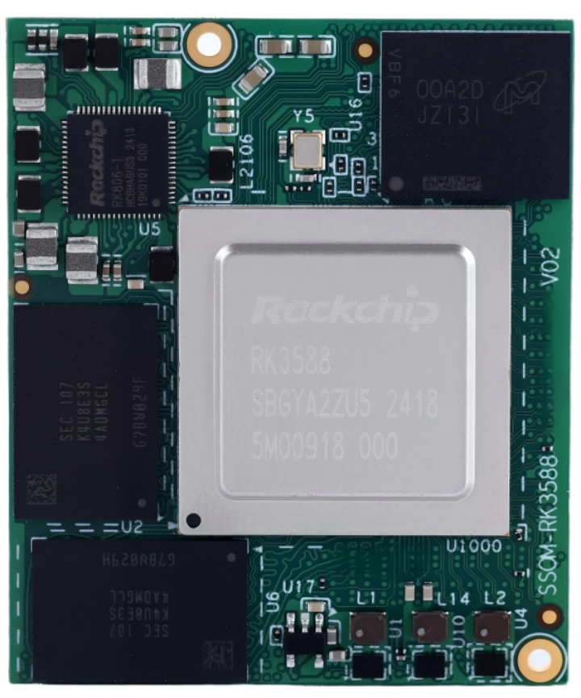
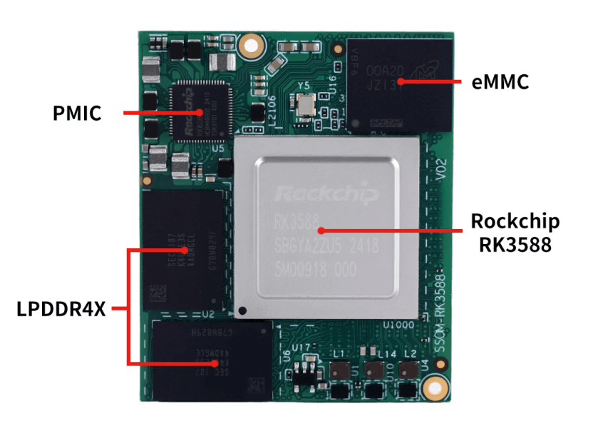
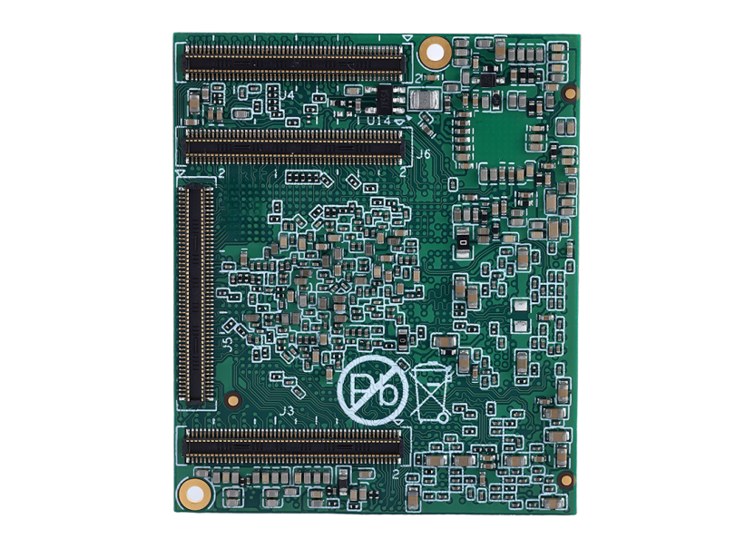
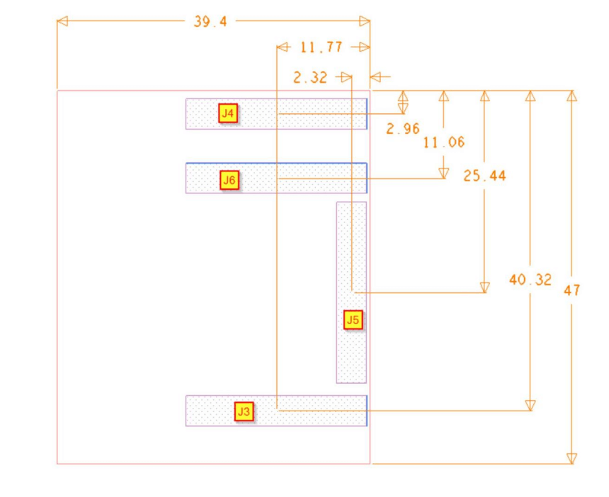
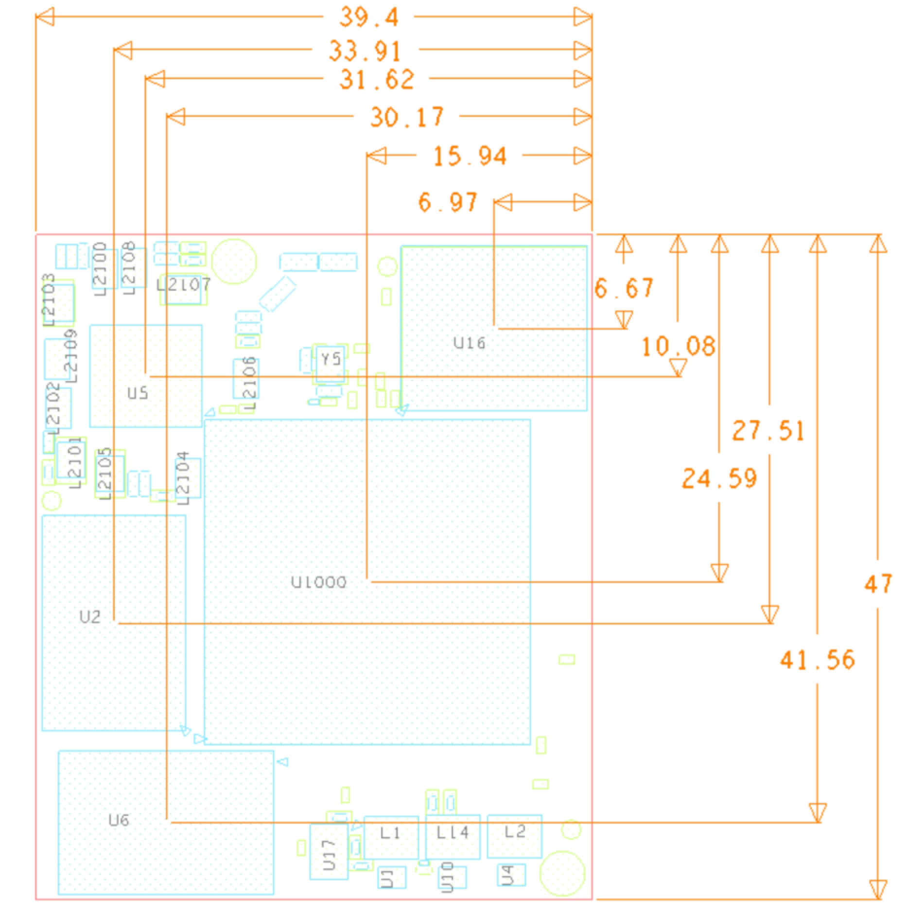
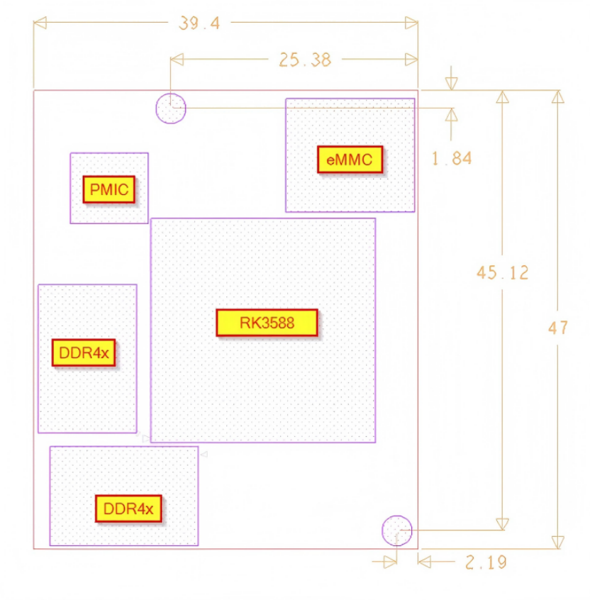

# Product Introduction

SSOM-3588-X2 is a small-sized, high-performance core module developed and designed based on the Rockchip RK3588. It integrates a quad-core Cortex-A76 and a quad-core Cortex-A55 CPU, ensuring a balance between performance and energy efficiency. The RK3588 also features a high-performance four-channel external memory interface (LPDDR4/LPDDR4X/LPDDR5), meeting the large memory bandwidth requirements for applications ranging from image post-processing to demanding computing tasks. It includes LPDDR4X, eMMC, PMIC, and four board-to-board connectors. Since most SoC signals can be transmitted through the board-to-board connectors, most of the SoC's functions can be realized.

The SSOM-3588-X2 measures only 47x39.4mm, making it compact and suitable for solution development in fields with strict size requirements, such as smart terminals, industrial control, machine vision, and edge computing.

## Functional Block Diagram

## 规格参数

### 1 Board

• Board dimensions: 47mm x 39.4mm x 4.7mm (dimensional tolerance ±0.10mm)

• Component mounting surface: Maximum height: 2mm (Soc part RK3588)

• Connectors surface P/N: DF40C-100DP-0.4V(51)

• Board thickness: 1.2mm

• 10 layers of immersion gold PCB.

 

### 2 Holes For Fixing The Board

• Holes size: Hole diameter: 1.6mm

• Pad outer diameter: 3.175mm

• Holes position

 

***Figure 4: Holes position on top-side***

***All dimension is mm***

 

### 3 Connectors Position

 

***Figure 5: Connectors position on bottom-side All dimension is mm***

The SoM board connectors used DF40C-100DP-0.4V(51) and the corresponding carrier board connector is DF40HC(3.0)-100DS-0.4V(58)

These model numbers suggest that these connectors are part of Hirose Electric Co's DF40 series, which are known for their compact size and high reliability in board-to-board connection.

 

### 4 Main Components

 ***• Part location***

 

***Figure 6: Parts position on top-side All dimension is mm***

 

***•*** ***Part Height***

U1000: 2mm (Soc part RK3588)

U2, U6: 0.8 to 1mm (RAM LPDDR4X)

U5: 0.9mm (PMIC)

U17: 1.25mm

L1, L2, L4: 1.2mm

L2100, L2102, L2104, L2106, L2108, L2109: 1mm

L2101, L2103, L2105, L2107: 1.2mm

 

 

## 引脚定义

Note: Pin Type Symbol Definitions

| Symbol | Description |
| ---------------- | --------------------- |
| I                | Input                 |
| O                | Output                |
| I/O              | Input/Output          |
| AI               | Analog Input          |
| AO               | Analog Output         |
| AI/O             | Analog Input/Output   |
| PI               | Power Supply          |
| PO               | Power Output          |
| SOM              | System on module      |

 

### Table 1: J3 Connector Interface Pin Definition

| Pin Number | Signal Name | Signal Type | IOVoltage | Main IC | IC Pin Number | IC Pin Name          |
| -------------------- | ------------------------------- | ----------------------------------------- | ----------------------------- | --------------------------- | ----------------------- | ------------------------------------------------------------ |
| 1(J3)                | GND                             | PI                                        | 0V                            |                             |                         |                                                              |
| 2(J3)                | GPIO1_A7                        | I/O                                       | 1.8V                          | RK3588                      | C25                     | PDM1_SDI0_M1/PCIE30X1_1_PERSTN_M2/PWM3 _IR_M3/SPI2_CS0_M0/GPIO1_A7_u |
| 3(J3)                | GPIO1_A6                        | I/O                                       | 1.8V                          | RK3588                      | C24                     | HDMI_TX1_HPD_M0/SPI2_CLK_M0/GPIO1_A6_d                       |
| 4(J3)                | GPIO3_D1                        | I/O                                       | 3.3V                          | RK3588                      | AG23                    | CIF_D13/PCIE20X1_2_PERSTN_M0/HDMI_RX_CE C_M1/UART4_TX_M1/PWM9_M2/SPI0_MISO_M3/ GPIO3_D1_d |
| 5(J3)                | GPIO3_D2                        | I/O                                       | 3.3V                          | RK3588                      | AG25                    | CIF_D14/PCIE30X2_CLKREQN_M2/HDMI_RX_SCL _M1/I2C7_SCL_M2/UART9_RTSN_M2/SPI0_MOSI _M3/GPIO3_D2_d |
| 6(J3)                | GPIO1_D4                        | I/O                                       | 1.8V                          | RK3588                      | D28                     | I2S0_SDI0/GPIO1_D4_d                                         |
| 7(J3)                | GPIO4_B7                        | I/O                                       | 3.3V                          | RK3588                      | AJ28                    | BT1120_D13/PCIE20X1_2_CLKREQN_M1/HDMI_T X0_SCL_M0/I2C5_SDA_M1/SPI3_CLK_M1/GPIO4_ B7_u |
| 8(J3)                | UART2_TX_M0_DEBUG               | I/O                                       | 1.8V                          | RK3588                      | P29                     | I2S1_MCLK_M1/JTAG_TCK_M2/I2C1_SCL_M0/UA RT2_TX_M0/PCIE30X1_1_CLKREQN_M0/GPIO0_B 5_d |
| 9(J3)                | GPIO3_D3                        | I/O                                       | 3.3V                          | RK3588                      | AG24                    | CIF_D15/PCIE30X2_WAKEN_M2/HDMI_RX_SDA_  M1/I2C7_SDA_M2/UART9_CTSN_M2/PWM10_M2/ SPI0_CLK_M3/GPIO3_D3_d |
| 10(J3)               | UART2_RX_M0_DEBUG               | I/O                                       | 1.8V                          | RK3588                      | R29                     | I2S1_SCLK_M1/JTAG_TMS_M2/I2C1_SDA_M0/UA RT2_RX_M0/PCIE30X1_1_WAKEN_M0/GPIO0_B6_ d |
| 11(J3)               | GPIO3_C6                        | I/O                                       | 3.3V                          | RK3588                      | AG26                    | CIF_D10/PCIE30X4_PERSTN_M2/HDMI_TX1_SCL_ M1/SPI3_MISO_M3/GPIO3_C6_u |
| 12(J3)               | GPIO1_A0                        | I/O                                       | 1.8V                          | RK3588                      | A24                     | PCIE30X1_1_CLKREQN_M2/DP0_HPDIN_M2/I2C2 _SDA_M4/UART6_RX_M1/SPI4_MISO_M2/GPIO1_ A0_d |
| 13(J3)               | TYPEC1_OTG_ID                   | I                                         |                               | RK3588                      | AK8                     | TYPEC1_USB20_OTG_ID                                          |
| 14(J3)               | SDMMC0_D0                       | I/O                                       |                               | RK3588                      | AD2                     | SDMMC_D0/PDM1_SDI3_M0/JTAG_TCK_M1/I2C3 _SCL_M4/UART2_TX_M1/PWM8_M1/GPIO4_D0_u |
| 15(J3)               | TYPEC1_USB20_VBUSDET            | I                                         |                               | RK3588                      | AL8                     | TYPEC1_USB20_VBUSDET                                         |
| 16(J3)               | SDMMC0_D1                       | I/O                                       |                               | RK3588                      | AD1                     | SDMMC_D1/PDM1_SDI2_M0/JTAG_TMS_M1/I2C 3_SDA_M4/UART2_RX_M1/PWM9_M1/GPIO4_D1 _u |
| 17(J3)               | GND                             | PI                                        | 0V                            |                             |                         |                                                              |
| 18(J3)               | SDMMC0_D3                       | I/O                                       |                               | RK3588                      | AF1                     | SDMMC_D3/PDM1_SDI0_M0/JTAG_TMS_M0/I2C 8_SDA_M0/UART5_RTSN_M0/PWM10_M1/GPIO4 _D3_u |
| 19(J3)               | HDMI_RX_CLKP                    | AI                                        |                               | RK3588                      | AF6                     | HDMI_RX_CLKP                                                 |
| 20(J3)               | SDMMC0_D2                       | I/O                                       |                               | RK3588                      | AF2                     | SDMMC_D2/PDM1_SDI1_M0/JTAG_TCK_M0/I2C8 _SCL_M0/UART5_CTSN_M0/GPIO4_D2_u |
| 21(J3)               | HDMI_RX_CLKN                    | AI                                        |                               | RK3588                      | AF5                     | HDMI_RX_CLKN                                                 |
| 22(J3)               | SD_CLK                          | I/O                                       |                               | RK3588                      | AE1                     | SDMMC_CLK/PDM1_CLK0_M0/TEST_CLKOUT_M 0/MCU_JTAG_TMS_M0/CAN0_RX_M1/UART5_TX _M0/GPIO4_D5_d |
| 23(J3)               | GND                             | PI                                        | 0V                            |                             |                         |                                                              |
| 24(J3)               | SDMMC0_CMD                      | I/O                                       |                               | RK3588                      | AE2                     | SDMMC_CMD/PDM1_CLK1_M0/MCU_JTAG_TCK_ M0/CAN0_TX_M1/UART5_RX_M0/PWM7_IR_M1/  GPIO4_D4_u |
| 25(J3)               | HDMI_RX_D0N                     | AI                                        |                               | RK3588                      | AG4                     | HDMI_RX_D0N                                                  |
| 26(J3)               | GND                             | PI                                        | 0V                            |                             |                         |                                                              |
| 27(J3)               | HDMI_RX_D0P                     | AI                                        |                               | RK3588                      | AG5                     | HDMI_RX_D0P                                                  |
| 28(J3)               | GPIO1_B2                        | I/O                                       | 1.8V                          | RK3588                      | D26                     | PDM1_SDI3_M1/PCIE30X4_PERSTN_M3/UART4_ RX_M2/SPI0_MOSI_M2/GPIO1_B2_d |
| 29(J3)               | GND                             | PI                                        | 0V                            |                             |                         |                                                              |
| 30(J3)               | GPIO0_C6                        | I/O                                       | 1.8V                          | RK3588                      | T29                     | I2S1_SDI1_M1/NPU_AVS/UART0_RTSN/PWM5_M 1/SPI0_CLK_M0/PCIE30X4_CLKREQN_M0/SATA_ CP_POD/GPIO0_C6_u |
| 31(J3)               | HDMI_RX_D1N                     | AI                                        |                               | RK3588                      | AH5                     | HDMI_RX_D1N                                                  |
| 32(J3)               | GPIO0_C5                        | I/O                                       | 1.8V                          | RK3588                      | P30                     | I2S1_SDI0_M1/GPU_AVS/UART0_TX_M0/I2C4_SC L_M2/DP1_HPDIN_M1/PWM4_M0/PCIE30X1_0_P ERSTN_M0/GPIO0_C5_u |
| 33(J3)               | HDMI_RX_D1P                     | AI                                        |                               | RK3588                      | AH6                     | HDMI_RX_D1P                                                  |
| 34(J3)               | GPIO0_B7                        | I/O                                       | 1.8V                          | RK3588                      | T28                     | I2S1_LRCK_M1/PWM0_M0/I2C2_SCL_M0/CAN0_ TX_M0/SPI0_CS1_M0/PCIE30X1_1_PERSTN_M0/ GPIO0_B7_d |
| 35(J3)               | GND                             | PI                                        | 0V                            |                             |                         |                                                              |
| 36(J3)               | SDMMC_DET/GPIO0_A4_ U           | I/O                                       |                               | RK3588                      | P31                     | SDMMC_DET/GPIO0_A4_u                                         |
| 37(J3)               | HDMI_RX_D2N                     | AI                                        |                               | RK3588                      | AJ4                     | HDMI_RX_D2N                                                  |
| 38(J3)               | GPIO3_C1                        | I/O                                       | 3.3V                          | RK3588                      | Y27                     | GMAC1_PPSCLK/PCIE30X2_BUTTON_RSTN/UART 7_RX_M1/SPI1_CLK_M1/GPIO3_C1_d |
| 39(J3)               | HDMI_RX_D2P                     | AI                                        |                               | RK3588                      | AJ5                     | HDMI_RX_D2P                                                  |
| 40(J3)               | GPIO0_C4                        | I/O                                       | 1.8V                          | RK3588                      | R30                     | PDM0_CLK1_M1/PWM2_M0/UART0_RX_M0/I2C4 _SDA_M2/DP0_HPDIN_M1/PCIE30X1_0_WAKEN_ M0/GPIO0_C4_d |
| 41(J3)               | GND                             | PI                                        | 0V                            |                             |                         |                                                              |
| 42(J3)               | GPIO3_D4                        | I/O                                       | 3.3V                          | RK3588                      | AA27                    | HDMI_TX0_HPD_M1/PCIE30X2_PERSTN_M2/HD  MI_RX_HPDOUT_M1/MCU_JTAG_TCK_M1/UART9 _RX_M2/SPI0_CS0_M3/GPIO3_D4_d |
| 43(J3)               | USB20_HOST0_DP                  | AI/O                                      |                               | RK3588                      | AK6                     | USB20_HOST0_DP                                               |
| 44(J3)               | GPIO3_D5                        | I/O                                       | 3.3V                          | RK3588                      | AB28                    | PCIE30X4_BUTTON_RSTN/DP1_HPDIN_M0/MCU_ JTAG_TMS_M1/UART9_TX_M2/PWM11_IR_M3/S PI0_CS1_M3/GPIO3_D5_d |
| 45(J3)               | USB20_HOST0_DM                  | AI/O                                      |                               | RK3588                      | AL6                     | USB20_HOST0_DM                                               |
| 46(J3)               | GPIO1_B1                        | I/O                                       | 1.8V                          | RK3588                      | D25                     | PDM1_SDI2_M1/PCIE30X4_WAKEN_M3/SPI0_MIS O_M2/GPIO1_B1_d      |
| 47(J3)               | GND                             | PI                                        | 0V                            |                             |                         |                                                              |
| 48(J3)               | GPIO1_B4                        | I/O                                       | 1.8V                          | RK3588                      | E24                     | PDM1_CLK0_M1/PCIE30X1_0_PERSTN_M2/UART 7_RX_M2/SPI0_CS0_M2/GPIO1_B4_u |
| 49(J3)               | USB20_HOST1_DP                  | AI/O                                      |                               | RK3588                      | AL7                     | USB20_HOST1_DP                                               |
| 50(J3)               | GPIO1_B6                        | I/O                                       | 1.8V                          | RK3588                      | E26                     | MIPI_CAMERA1_CLK_M0/SPDIF0_TX_M0/PCIE30 X2_WAKEN_M3/HDMI_RX_HPDOUT_M2/I2C5_SC L_M3/UART1_TX_M1/GPIO1_B6_u |
| 51(J3)               | USB20_HOST1_DM                  | AI/O                                      |                               | RK3588                      | AM7                     | USB20_HOST1_DM                                               |
| 52(J3)               | GPIO1_D7                        | I/O                                       | 1.8V                          | RK3588                      | F25                     | MIPI_CAMERA4_CLK_M0/PCIE30X2_CLKREQN_M 3/HDMI_RX_SDA_M2/I2C8_SDA_M2/UART1_CTS N_M1/PWM15_IR_M3/GPIO1_D7_u |
| 53(J3)               | GND                             | PI                                        | 0V                            |                             |                         |                                                              |
| 54(J3)               | GPIO1_D6                        | I/O                                       | 1.8V                          | RK3588                      | F24                     | MIPI_CAMERA3_CLK_M0/HDMI_RX_SCL_M2/I2C 8_SCL_M2/UART1_RTSN_M1/PWM14_M2/GPIO1 _D6_u |
| 55(J3)               | GPIO1_D0                        | I/O                                       | 1.8V                          | RK3588                      | F26                     | I2S0_SDO1/I2C7_SCL_M0/UART6_TX_M2/SPI1_M ISO_M2/GPIO1_D0_d   |
| 56(J3)               | GPIO1_D2                        | I/O                                       | 1.8V                          | RK3588                      | F28                     | I2S0_SDO3/I2S0_SDI2/PDM0_SDI2_M0/I2C1_SCL _M4/UART4_TX_M0/PWM0_M1/SPI1_CLK_M2/GP IO1_D2_d |
| 57(J3)               | GPIO1_D1                        | I/O                                       | 1.8V                          | RK3588                      | F27                     | I2S0_SDO2/I2S0_SDI3/PDM0_SDI1_M0/I2C7_SDA _M0/UART6_RX_M2/SPI1_MOSI_M2/GPIO1_D1_d |
| 58(J3)               | GPIO1_B5                        | I/O                                       | 1.8V                          | RK3588                      | E25                     | PCIE30X1_0_CLKREQN_M2/UART7_TX_M2/SPI0_ CS1_M2/GPIO1_B5_u    |
| 59(J3)               | GPIO1_D5                        | I/O                                       | 1.8V                          | RK3588                      | G26                     | PDM0_SDI0_M0/SPI1_CS1_M2/GPIO1_D5_d                          |
| 60(J3)               | GPIO1_D3                        | I/O                                       | 1.8V                          | RK3588                      | E28                     | I2S0_SDI1/PDM0_SDI3_M0/I2C1_SDA_M4/UART4 _RX_M0/PWM1_M1/SPI1_CS0_M2/GPIO1_D3_d |
| 61(J3)               | GPIO1_C1                        | I/O                                       | 1.8V                          | RK3588                      | G27                     | I2C3_SCL_M0/UART3_TX_M0/SPI4_MOSI_M0/GPI O1_C1_z             |
| 62(J3)               | GPIO1_C0                        | I/O                                       | 1.8V                          | RK3588                      | G29                     | I2C3_SDA_M0/UART3_RX_M0/SPI4_MISO_M0/GP IO1_C0_z             |
| 63(J3)               | GPIO1_B3                        | I/O                                       | 1.8V                          | RK3588                      | D27                     | PDM1_CLK1_M1/PCIE30X1_0_WAKEN_M2/SATA0 _ACT_LED_M1/UART4_TX_M2/SPI0_CLK_M2/GPI O1_B3_d |
| 64(J3)               | GND                             | PI                                        | 0V                            |                             |                         |                                                              |
| 65(J3)               | GPIO1_C2                        | I/O                                       | 1.8V                          | RK3588                      | F30                     | I2S0_MCLK/I2C6_SDA_M1/UART3_RTSN/PWM3_I R_M2/SPI4_CLK_M0/GPIO1_C2_d |
| 66(J3)               | HDMI0_TX_SBDP/EDP0_T X_AUXP     | AI/O                                      |                               | RK3588                      | AG2                     | HDMI_TX0_SBDP/EDP_TX0_AUXP                                   |
| 67(J3)               | GPIO3_C4                        | I/O                                       | 3.3V                          | RK3588                      | AH26                    | CIF_D8/FSPI_CS0N_M2/PCIE30X4_CLKREQN_M2/ HDMI_TX1_CEC_M2/CAN2_RX_M0/UART5_TX_M 1/SPI3_CS0_M3/GPIO3_C4_u |
| 68(J3)               | HDMI0_TX_SBDN/EDP0_T X_AUXN     | AI/O                                      |                               | RK3588                      | AG1                     | HDMI_TX0_SBDN/EDP_TX0_AUXN                                   |
| 69(J3)               | GPIO3_D0                        | I/O                                       | 3.3V                          | RK3588                      | AH24                    | CIF_D12/PCIE20X1_2_WAKEN_M0/HDMI_TX0_SD A_M2/I2C5_SDA_M0/UART4_RX_M1/PWM8_M2/S PI3_CLK_M3/GPIO3_D0_u |
| 70(J3)               | GND                             | PI                                        | 0V                            |                             |                         |                                                              |
| 71(J3)               | GPIO3_C5                        | I/O                                       | 3.3V                          | RK3588                      | AH25                    | CIF_D9/FSPI_CS1N_M2/PCIE30X4_WAKEN_M2/H DMI_TX1_SDA_M1/CAN2_TX_M0/UART5_RX_M1/ SPI3_CS1_M3/GPIO3_C5_u |
| 72(J3)               | HDMI0_TX3P_PORT/EDP0 _TX_D3P    | AO                                        |                               | RK3588                      | AH3                     | HDMI_TX0_D3P/EDP_TX0_D3P                                     |
| 73(J3)               | SARADC_VIN5_HW_ID               | AI                                        | 1.8V                          | RK3588                      | AK15                    | SARADC_IN5                                                   |
| 74(J3)               | HDMI0_TX3N_PORT/EDP0 _TX_D3N    | AO                                        |                               | RK3588                      | AH2                     | HDMI_TX0_D3N/EDP_TX0_D3N                                     |
| 75(J3)               | GPIO4_B6                        | I/O                                       | 3.3V                          | RK3588                      | AJ27                    | BT1120_D12/PCIE30X4_PERSTN_M1/HDMI_RX_H PDOUT_M0/SATA0_ACT_LED_M0/I2C5_SCL_M1/ PWM13_M1/SPI3_MOSI_M1/GPIO4_B6_d |
| 76(J3)               | GND                             | PI                                        | 0V                            |                             |                         |                                                              |
| 77(J3)               | TYPEC0_OTG_ID                   | I                                         |                               | RK3588                      | AL14                    | TYPEC0_USB20_OTG_ID                                          |
| 78(J3)               | HDMI0_TX0P_PORT/EDP0 _TX_D0P    | AO                                        |                               | RK3588                      | AJ2                     | HDMI_TX0_D0P/EDP_TX0_D0P                                     |
| 79(J3)               | TYPEC0_USB20_VBUSDET            | I                                         |                               | RK3588                      | AM14                    | TYPEC0_USB20_VBUSDET                                         |
| 80(J3)               | HDMI0_TX0N_PORT/EDP0 _TX_D0N    | AO                                        |                               | RK3588                      | AJ1                     | HDMI_TX0_D0N/EDP_TX0_D0N                                     |
| 81(J3)               | RTC_INT_L                       | I/O                                       | 1.8V                          | RK3588                      | L30                     | SPI2_CS1_M2/I2C1_SCL_M1/UART0_RX_M1/GPI O0_B0_z              |
| 82(J3)               | GND                             | PI                                        | 0V                            |                             |                         |                                                              |
| 83(J3)               | GPIO3_C7                        | I/O                                       | 3.3V                          | RK3588                      | AJ24                    | CIF_D11/PCIE20X1_2_CLKREQN_M0/HDMI_TX0_ SCL_M2/I2C5_SCL_M0/SPI3_MOSI_M3/GPIO3_C7 _u |
| 84(J3)               | HDMI0_TX1P_PORT/EDP0 _TX_D1P    | AO                                        |                               | RK3588                      | AK3                     | HDMI_TX0_D1P/EDP_TX0_D1P                                     |
| 85(J3)               | GPIO3_C0                        | I/O                                       | 3.3V                          | RK3588                      | Y29                     | GMAC1_PPSTRIG/I2C3_SDA_M1/UART7_TX_M1/S PI1_MISO_M1/GPIO3_C0_d |
| 86(J3)               | HDMI0_TX1N_PORT/EDP0 _TX_D1N    | AO                                        |                               | RK3588                      | AK2                     | HDMI_TX0_D1N/EDP_TX0_D1N                                     |
| 87(J3)               | BOOT_SARADC_IN0                 | AI                                        | 1.8V                          | RK3588                      | AM16                    | SARADC_IN0_BOOT                                              |
| 88(J3)               | GND                             | PI                                        | 0V                            |                             |                         |                                                              |
| 89(J3)               | SARADC_VIN1_KEY/RECO VERY       | AI                                        | 1.8V                          | RK3588                      | AL16                    | SARADC_IN1                                                   |
| 90(J3)               | HDMI0_TX2P_PORT/EDP0 _TX_D2P    | AO                                        |                               | RK3588                      | AL2                     | HDMI_TX0_D2P/EDP_TX0_D2P                                     |
| 91(J3)               | SARADC_IN3                      | AI                                        | 1.8V                          | RK3588                      | AN17                    | SARADC_IN3                                                   |
| 92(J3)               | HDMI0_TX2N_PORT/EDP0 _TX_D2N    | AO                                        |                               | RK3588                      | AL1                     | HDMI_TX0_D2N/EDP_TX0_D2N                                     |
| 93(J3)               | SARADC_IN2                      | AI                                        | 1.8V                          | RK3588                      | AK16                    | SARADC_IN2                                                   |
| 94(J3)               | GND                             | PI                                        | 0V                            |                             |                         |                                                              |
| 95(J3)               | SARADC_IN6                      | AI                                        | 1.8V                          | RK3588                      | AL17                    | SARADC_IN6                                                   |
| 96(J3)               | HDMI1_TX_SBDN/EDP1_T X_AUXN     | AI/O                                      |                               | RK3588                      | AP2                     | HDMI_TX1_SBDN/EDP_TX1_AUXN                                   |
| 97(J3)               | SARADC_IN7                      | AI                                        | 1.8V                          | RK3588                      | AK17                    | SARADC_IN7                                                   |
| 98(J3)               | HDMI1_TX_SBDP/EDP1_T X_AUXP     | AI/O                                      |                               | RK3588                      | AN2                     | HDMI_TX1_SBDP/EDP_TX1_AUXP                                   |
| 99(J3)               | SARADC_IN4                      | AI                                        | 1.8V                          | RK3588                      | AM17                    | SARADC_IN4                                                   |
| 100(J3)              | GND                             | PI                                        | 0V                            |                             |                         |                                                              |

 

### Table 2: J4 Connector Interface Pin Definition

| PinNumber | Signal Name | Signal Type | IOVoltage | Main IC | IC Pin  Number | IC Pin Name          |
| ----------------------------- | ------------------------------- | ----------------------------------------- | ----------------------------- | --------------------------- | ------------------------------------------------------------ | ------------------------------------------------------------ |
| 1(J4)                         | VCC4V0_SYS                      | PI                                        | 4.0V                          |                             |                                                              |                                                              |
| 2(J4)                         | VCC4V0_SYS                      | PI                                        | 4.0V                          |                             |                                                              |                                                              |
| 3(J4)                         | VCC4V0_SYS                      | PI                                        | 4.0V                          |                             |                                                              |                                                              |
| 4(J4)                         | VCC4V0_SYS                      | PI                                        | 4.0V                          |                             |                                                              |                                                              |
| 5(J4)                         | VCC4V0_SYS                      | PI                                        | 4.0V                          |                             |                                                              |                                                              |
| 6(J4)                         | VCC4V0_SYS                      | PI                                        | 4.0V                          |                             |                                                              |                                                              |
| 7(J4)                         | VCC4V0_SYS                      | PI                                        | 4.0V                          |                             |                                                              |                                                              |
| 8(J4)                         | VCC4V0_SYS                      | PI                                        | 4.0V                          |                             |                                                              |                                                              |
| 9(J4)                         | VCC4V0_SYS                      | PI                                        | 4.0V                          |                             |                                                              |                                                              |
| 10(J4)                        | VCC4V0_SYS                      | PI                                        | 4.0V                          |                             |                                                              |                                                              |
| 11(J4)                        | VCC4V0_SYS                      | PI                                        | 4.0V                          |                             |                                                              |                                                              |
| 12(J4)                        | VCC4V0_SYS                      | PI                                        | 4.0V                          |                             |                                                              |                                                              |
| 13(J4)                        | VCC4V0_SYS                      | PI                                        | 4.0V                          |                             |                                                              |                                                              |
| 14(J4)                        | VCC4V0_SYS                      | PI                                        | 4.0V                          |                             |                                                              |                                                              |
| 15(J4)                        | VCC4V0_SYS                      | PI                                        | 4.0V                          |                             |                                                              |                                                              |
| 16(J4)                        | VCC4V0_SYS                      | PI                                        | 4.0V                          |                             |                                                              |                                                              |
| 17(J4)                        | VCC4V0_SYS                      | PI                                        | 4.0V                          |                             |                                                              |                                                              |
| 18(J4)                        | VCC4V0_SYS                      | PI                                        | 4.0V                          |                             |                                                              |                                                              |
| 19(J4)                        | VCC4V0_SYS                      | PI                                        | 4.0V                          |                             |                                                              |                                                              |
| 20(J4)                        | VCC4V0_SYS                      | PI                                        | 4.0V                          |                             |                                                              |                                                              |
| 21(J4)                        | GND                             | PI                                        | 0V                            |                             |                                                              |                                                              |
| 22(J4)                        | VCC_1V8_S0                      | PO                                        | 1.8V                          |                             |                                                              |                                                              |
| 23(J4)                        | PCIE30_PORT0_TX1P               | AO                                        |                               | RK3588                      | C33                                                          | PCIE30_PORT0_TX1P                                            |
| 24(J4)                        | VCC_1V8_S0                      | PO                                        | 1.8V                          |                             |                                                              |                                                              |
| 25(J4)                        | PCIE30_PORT0_TX1N               | AO                                        |                               | RK3588                      | C34                                                          | PCIE30_PORT0_TX1N                                            |
| 26(J4)                        | VCC_3V3_S0                      | PO                                        | 3.3V                          |                             |                                                              |                                                              |
| 27(J4)                        | GND                             | PI                                        | 0V                            |                             |                                                              |                                                              |
| 28(J4)                        | VCC_3V3_S0                      | PO                                        | 3.3V                          |                             |                                                              |                                                              |
| 29(J4)                        | PCIE30_PORT0_RX1N               | AI                                        |                               | RK3588                      | F33                                                          | PCIE30_PORT0_RX1N                                            |
| 30(J4)                        | GND                             | PI                                        | 0V                            |                             |                                                              |                                                              |
| 31(J4)                        | PCIE30_PORT0_RX1P               | AI                                        |                               | RK3588                      | F32                                                          | PCIE30_PORT0_RX1P                                            |
| 32(J4)                        | PCIE30_PORT0_RX0N               | AI                                        |                               | RK3588                      | G34                                                          | PCIE30_PORT0_RX0N                                            |
| 33(J4)                        | GND                             | PI                                        | 0V                            |                             |                                                              |                                                              |
| 34(J4)                        | PCIE30_PORT0_RX0P               | AI                                        |                               | RK3588                      | G33                                                          | PCIE30_PORT0_RX0P                                            |
| 35(J4)                        | PMIC_EXT_EN_OUT                 | O                                         | MAX 4V                        |                             |                                                              |                                                              |
| 36(J4)                        | GND                             | PI                                        | 0V                            |                             |                                                              |                                                              |
| 37(J4)                        | GPIO1_A4                        | I/O                                       | 1.8V                          | RK3588                      | B25                                                          | HDMI_TX1_SCL_M2/SPI2_MISO_M0/GPIO1_A4_d                      |
| 38(J4)                        | PCIE20_1_RXN/SATA30_1 _RXN      | AI                                        |                               | RK3588                      | J34                                                          | PCIE20_1_RXN/SATA30_1_RXN                                    |
| 39(J4)                        | GPIO1_A1                        | I/O                                       | 1.8V                          | RK3588                      | A25                                                          | PCIE30X1_1_WAKEN_M2/DP1_HPDIN_M2/SATA1 _ACT_LED_M1/I2C2_SCL_M4/UART6_TX_M1/SPI 4_MOSI_M2/GPIO1_A1_d |
| 40(J4)                        | PCIE20_1_RXP/SATA30_1 _RXP      | AI                                        |                               | RK3588                      | J33                                                          | PCIE20_1_RXP/SATA30_1_RXP                                    |
| 41(J4)                        | GPIO1_B7                        | I/O                                       | 1.8V                          | RK3588                      | E27                                                          | MIPI_CAMERA2_CLK_M0/SPDIF1_TX_M0/PCIE30 X2_PERSTN_M3/HDMI_RX_CEC_M2/SATA2_ACT_ LED_M1/I2C5_SDA_M3/UART1_RX_M1/PWM13_  M2/GPIO1_B7_u |
| 42(J4)                        | GND                             | PI                                        | 0V                            |                             |                                                              |                                                              |
| 43(J4)                        | GPIO1_A2                        | I/O                                       | 1.8V                          | RK3588                      | A26                                                          | VOP_POST_EMPTY/I2C4_SDA_M3/UART6_RTSN_ M1/PWM0_M2/SPI4_CLK_M2/GPIO1_A2_d |
| 44(J4)                        | ETH1_REFCLKO_25M                | I/O                                       |                               | RK3588                      | AH27                                                         | ETH1_REFCLKO_25M/MIPI_CAMERA1_CLK_M1/I2 C4_SCL_M0/GPIO3_A6_d |
| 45(J4)                        | GPIO1_A5                        | I/O                                       | 1.8V                          | RK3588                      | B26                                                          | HDMI_TX0_HPD_M0/SPI2_MOSI_M0/GPIO1_A5_d                      |
| 46(J4)                        | GMAC1_RXD2                      | I/O                                       |                               | RK3588                      | AD27                                                         | GMAC1_RXD2/SDIO_D2_M1/I2S3_LRCK/AUDDSM _LP/FSPI_D2_M2/UART8_TX_M1/SPI4_CLK_M1/G PIO3_A2_u |
| 47(J4)                        | GPIO1_A3                        | I/O                                       | 1.8V                          | RK3588                      | A27                                                          | HDMI_TX1_SDA_M2/I2C4_SCL_M3/UART6_CTSN _M1/PWM1_M2/SPI4_CS0_M2/GPIO1_A3_d |
| 48(J4)                        | GMAC1_RXDV_CRS                  | I/O                                       |                               | RK3588                      | AH29                                                         | GMAC1_RXDV_CRS/MIPI_CAMERA4_CLK_M1/UA RT2_TX_M2/PWM2_M1/GPIO3_B1_d |
| 49(J4)                        | GPIO1_B0                        | I/O                                       | 1.8V                          | RK3588                      | C27                                                          | PDM1_SDI1_M1/PCIE30X4_CLKREQN_M3/SPI2_C S1_M0/GPIO1_B0_u     |
| 50(J4)                        | GMAC1_RXCLK                     | I/O                                       |                               | RK3588                      | AH30                                                         | GMAC1_RXCLK/SDIO_CLK_M1/MIPI_CAMERA0_C LK_M1/FSPI_CLK_M2/I2C4_SDA_M0/UART8_CTS N_M1/GPIO3_A5_d |
| 51(J4)                        | GND                             | PI                                        | 0V                            |                             |                                                              |                                                              |
| 52(J4)                        | GMAC1_RXD3                      | I/O                                       |                               | RK3588                      | AE27                                                         | GMAC1_RXD3/SDIO_D3_M1/I2S3_SDO/AUDDSM_ RN/FSPI_D3_M2/UART8_RX_M1/SPI4_CS0_M1/G PIO3_A3_u |
| 53(J4)                        | PCIE30_PORT1_REFCLKP_ IN        | AI                                        |                               | RK3588                      | A28                                                          | PCIE30_PORT1_REF_CLKP                                        |
| 54(J4)                        | GMAC1_RXD0                      | I/O                                       |                               | RK3588                      | AG29                                                         | GMAC1_RXD0/MIPI_CAMERA2_CLK_M1/PWM8_ M0/GPIO3_A7_u           |
| 55(J4)                        | PCIE30_PORT1_REFCLKN _IN        | AI                                        |                               | RK3588                      | B28                                                          | PCIE30_PORT1_REF_CLKN                                        |
| 56(J4)                        | GMAC1_RXD1                      | I/O                                       |                               | RK3588                      | AG28                                                         | GMAC1_RXD1/MIPI_CAMERA3_CLK_M1/PWM9_ M0/GPIO3_B0_u           |
| 57(J4)                        | GND                             | PI                                        | 0V                            |                             |                                                              |                                                              |
| 58(J4)                        | GND                             | PI                                        | 0V                            |                             |                                                              |                                                              |
| 59(J4)                        | PCIE30_PORT1_TX3N               | AO                                        |                               | RK3588                      | B29                                                          | PCIE30_PORT1_TX1N                                            |
| 60(J4)                        | GPIO1_C6                        | I/O                                       | 1.8V                          | RK3588                      | D29                                                          | PDM0_CLK0_M0/I2C4_SDA_M4/PWM15_IR_M2/G PIO1_C6_d             |
| 61(J4)                        | PCIE30_PORT1_TX3P               | AO                                        |                               | RK3588                      | C29                                                          | PCIE30_PORT1_TX1P                                            |
| 62(J4)                        | GPIO1_C5                        | I/O                                       | 1.8V                          | RK3588                      | D30                                                          | I2S0_LRCK/I2C2_SCL_M3/UART4_RTSN/GPIO1_C 5_d                 |
| 63(J4)                        | GND                             | PI                                        | 0V                            |                             |                                                              |                                                              |
| 64(J4)                        | GPIO1_C3                        | I/O                                       | 1.8V                          | RK3588                      | E31                                                          | I2S0_SCLK/I2C6_SCL_M1/UART3_CTSN/PWM7_I R_M2/SPI4_CS0_M0/GPIO1_C3_d |
| 65(J4)                        | PCIE30_PORT1_TX2N               | AO                                        |                               | RK3588                      | A30                                                          | PCIE30_PORT1_TX0N                                            |
| 66(J4)                        | GPIO1_C4                        | I/O                                       | 1.8V                          | RK3588                      | E30                                                          | PDM0_CLK1_M0/I2C2_SDA_M3/PWM11_IR_M2/S PI4_CS1_M0/GPIO1_C4_d |
| 67(J4)                        | PCIE30_PORT1_TX2P               | AO                                        |                               | RK3588                      | B30                                                          | PCIE30_PORT1_TX0P                                            |
| 68(J4)                        | GPIO1_C7                        | I/O                                       | 1.8V                          | RK3588                      | E29                                                          | I2S0_SDO0/I2C4_SCL_M4/UART4_CTSN/GPIO1_C 7_d                 |
| 69(J4)                        | GND                             | PI                                        | 0V                            |                             |                                                              |                                                              |
| 70(J4)                        | GND                             | PI                                        | 0V                            |                             |                                                              |                                                              |
| 71(J4)                        | PCIE20_2_TXN                    | AO                                        |                               | RK3588                      | H29                                                          | PCIE20_2_TXN/SATA30_2_TXN/USB30_2_SSTXN                      |
| 72(J4)                        | PCIE20_2_RXP                    | AI                                        |                               | RK3588                      | J31                                                          | PCIE20_2_RXP/SATA30_2_RXP/USB30_2_SSRXP                      |
| 73(J4)                        | PCIE20_2_TXP                    | AO                                        |                               | RK3588                      | H30                                                          | PCIE20_2_TXP/SATA30_2_TXP/USB30_2_SSTXP                      |
| 74(J4)                        | PCIE20_2_RXN                    | AI                                        |                               | RK3588                      | J30                                                          | PCIE20_2_RXN/SATA30_2_RXN/USB30_2_SSRXN                      |
| 75(J4)                        | GND                             | PI                                        | 0V                            |                             |                                                              |                                                              |
| 76(J4)                        | GND                             | PI                                        | 0V                            |                             |                                                              |                                                              |
| 77(J4)                        | PCIE20_0_REFCLKP                | AI/O                                      |                               | RK3588                      | L32                                                          | PCIE20_0_REFCLKP                                             |
| 78(J4)                        | GPIO4_A0                        | I/O                                       | 3.3V                          | RK3588                      | AK30                                                         | CIF_D0/BT1120_D0/I2S1_MCLK_M0/PCIE30X1_1_ CLKREQN_M1/UART9_RTSN_M1/SPI0_MISO_M1/ GPIO4_A0_d |
| 79(J4)                        | PCIE20_0_REFCLKN                | AI/O                                      |                               | RK3588                      | L33                                                          | PCIE20_0_REFCLKN                                             |
| 80(J4)                        | GPIO4_A1                        | I/O                                       | 3.3V                          | RK3588                      | AL30                                                         | CIF_D1/BT1120_D1/I2S1_SCLK_M0/PCIE30X1_1_ WAKEN_M1/UART9_CTSN_M1/SPI0_MOSI_M1/GP IO4_A1_d |
| 81(J4)                        | GND                             | PI                                        | 0V                            |                             |                                                              |                                                              |
| 82(J4)                        | GPIO4_A5                        | I/O                                       | 3.3V                          | RK3588                      | AK27                                                         | CIF_D5/BT1120_D5/I2S1_SDI0_M0/PCIE30X1_0_P ERSTN_M1/I2C3_SDA_M2/UART3_TX_M2/SPI2_M OSI_M1/GPIO4_A5_d |
| 83(J4)                        | GPIO2_B4                        | I/O                                       | 1.8V                          | RK3588                      | AB31                                                         | GMAC0_PTP_REFCLK/FSPI_CS0N_M1/HDMI_TX1 _SDA_M0/I2C4_SDA_M1/UART7_RX_M0/GPIO2_B 4_u |
| 84(J4)                        | PWRON_L                         | I                                         |                               |                             |                                                              |                                                              |
| 85(J4)                        | GPIO2_A6                        | I/O                                       | 1.8V                          | RK3588                      | AC32                                                         | GMAC0_RXD2/SDIO_D0_M0/FSPI_D0_M1/UART6 _RX_M0/GPIO2_A6_u     |
| 86(J4)                        | RESET_L                         | I                                         |                               | RK3588                      | M31                                                          | NPOR                                                         |
| 87(J4)                        | GPIO2_A7                        | I/O                                       | 1.8V                          | RK3588                      | AC31                                                         | GMAC0_RXD3/SDIO_D1_M0/FSPI_D1_M1/UART6 _TX_M0/GPIO2_A7_u     |
| 88(J4)                        | GPIO4_A3                        | I/O                                       | 3.3V                          | RK3588                      | AL29                                                         | CIF_D3/BT1120_D3/PCIE30X1_0_CLKREQN_M1/U ART0_TX_M2/GPIO4_A3_d |
| 89(J4)                        | GPIO2_C1                        | I/O                                       | 1.8V                          | RK3588                      | AD32                                                         | GMAC0_RXD0/I2C2_SCL_M1/UART1_CTSN_M0/S PI1_MISO_M0/GPIO2_C1_d |
| 90(J4)                        | GPIO4_A2                        | I/O                                       | 3.3V                          | RK3588                      | AM29                                                         | CIF_D2/BT1120_D2/I2S1_LRCK_M0/PCIE30X1_1_ PERSTN_M1/SPI0_CLK_M1/GPIO4_A2_d |
| 91(J4)                        | GPIO2_C5                        | I/O                                       | 1.8V                          | RK3588                      | AE30                                                         | CLK32K_OUT1/GPIO2_C5_d                                       |
| 92(J4)                        | GPIO4_A4                        | I/O                                       | 3.3V                          | RK3588                      | AL28                                                         | CIF_D4/BT1120_D4/PCIE30X1_0_WAKEN_M1/I2C 3_SCL_M2/UART0_RX_M2/SPI2_MISO_M1/GPIO4 _A4_d |
| 93(J4)                        | GPIO2_C3                        | I/O                                       | 1.8V                          | RK3588                      | AD30                                                         | ETH0_REFCLKO_25M/I2S2_SDI_M0/I2C6_SCL_M 2/SPI1_CS0_M0/GPIO2_C3_d |
| 94(J4)                        | GPIO4_A6                        | I/O                                       | 3.3V                          | RK3588                      | AL27                                                         | CIF_D6/BT1120_D6/I2S1_SDI1_M0/PCIE30X2_CL KREQN_M1/I2C5_SCL_M2/UART3_RX_M2/SPI2_C LK_M1/GPIO4_A6_d |
| 95(J4)                        | GPIO2_B5                        | I/O                                       | 1.8V                          | RK3588                      | AB30                                                         | GMAC0_PPSTRIG/FSPI_CS1N_M1/HDMI_TX1_SC L_M0/I2C4_SCL_M1/UART7_TX_M0/GPIO2_B5_u |
| 96(J4)                        | GPIO4_A7                        | I/O                                       | 3.3V                          | RK3588                      | AM27                                                         | CIF_D7/BT1120_D7/I2S1_SDI2_M0/PCIE30X2_WA KEN_M1/I2C5_SDA_M2/SPI2_CS0_M1/GPIO4_A7 _d |
| 97(J4)                        | GPIO3_B2                        | I/O                                       | 3.3V                          | RK3588                      | AE28                                                         | GMAC1_TXER/I2S2_SDI_M1/UART2_RX_M2/PWM 3_IR_M1/GPIO3_B2_d    |
| 98(J4)                        | GPIO4_B0                        | I/O                                       | 3.3V                          | RK3588                      | AK26                                                         | CIF_CLKIN/BT1120_CLKOUT/I2S1_SDI3_M0/PCIE3 0X2_PERSTN_M1/I2C6_SDA_M3/UART8_TX_M0/  SPI2_CS1_M1/GPIO4_B0_d |
| 99(J4)                        | GPIO4_C5                        | I/O                                       | 3.3V                          | RK3588                      | AB33                                                         | GMAC0_MDIO/I2C0_SCL_M1/UART9_CTSN_M0/P WM6_M2/SPI3_MOSI_M0/GPIO4_C5_d |
| 100(J4)                       | GND                             | PI                                        | 0V                            |                             |                                                              |                                                              |

 

### Table 3: J5 Connector Interface Pin Definition

| PinNumber | Signal Name | Signal Type | IOVoltage | Main IC | IC Pin  Number | IC Pin Name          |
| ----------------------------- | ------------------------------- | ----------------------------------------- | --------------------------------------- | --------------------------- | ------------------------------------------------------------ | ------------------------------------------------------------ |
| 1(J5)                         | GND                             | PI                                        | 0V                                      |                             |                                                              |                                                              |
| 2(J5)                         | GND                             | PI                                        | 0V                                      |                             |                                                              |                                                              |
| 3(J5)                         | MIPI_DPHY0_RX_D1P               | AI                                        |                                         | RK3588                      | AN30                                                         | MIPI_DPHY0_RX_D1P/MIPI_CPHY0_RX_TRIO1_A                      |
| 4(J5)                         | MIPI_DPHY0_RX_D2P               | AI                                        |                                         | RK3588                      | AN33                                                         | MIPI_DPHY0_RX_D2P/MIPI_CPHY0_RX_TRIO2_B                      |
| 5(J5)                         | MIPI_DPHY0_RX_D1N               | AI                                        |                                         | RK3588                      | AP30                                                         | MIPI_DPHY0_RX_D1N/MIPI_CPHY0_RX_TRIO0_C                      |
| 6(J5)                         | MIPI_DPHY0_RX_D2N               | AI                                        |                                         | RK3588                      | AP32                                                         | MIPI_DPHY0_RX_D2N/MIPI_CPHY0_RX_Trio2_A                      |
| 7(J5)                         | GND                             | PI                                        | 0V                                      |                             |                                                              |                                                              |
| 8(J5)                         | GND                             | PI                                        | 0V                                      |                             |                                                              |                                                              |
| 9(J5)                         | MIPI_DPHY0_RX_D0P               | AI                                        |                                         | RK3588                      | AN29                                                         | MIPI_DPHY0_RX_D0P/MIPI_CPHY0_RX_TRIO0_B                      |
| 10(J5)                        | MIPI_DPHY0_RX_CLKP              | AI                                        |                                         | RK3588                      | AN32                                                         | MIPI_DPHY0_RX_CLKP/MIPI_CPHY0_RX_TRIO1_ C                    |
| 11(J5)                        | MIPI_DPHY0_RX_D0N               | AI                                        |                                         | RK3588                      | AP29                                                         | MIPI_DPHY0_RX_D0N/MIPI_CPHY0_RX_TRIO0_A                      |
| 12(J5)                        | MIPI_DPHY0_RX_CLKN              | AI                                        |                                         | RK3588                      | AP31                                                         | MIPI_DPHY0_RX_CLKN/MIPI_CPHY0_RX_TRIO1_ B                    |
| 13(J5)                        | GND                             | PI                                        | 0V                                      |                             |                                                              |                                                              |
| 14(J5)                        | GND                             | PI                                        | 0V                                      |                             |                                                              |                                                              |
| 15(J5)                        | MIPI_DPHY0_TX_D2N               | AO                                        |                                         | RK3588                      | AP27                                                         | MIPI_DPHY0_TX_D2N/MIPI_CPHY0_TX_TRIO2_A                      |
| 16(J5)                        | MIPI_DPHY0_TX_D3P               | AO                                        |                                         | RK3588                      | AN28                                                         | MIPI_DPHY0_TX_D3P/NO_USE                                     |
| 17(J5)                        | MIPI_DPHY0_TX_D2P               | AO                                        |                                         | RK3588                      | AN27                                                         | MIPI_DPHY0_TX_D2P/MIPI_CPHY0_TX_TRIO2_B                      |
| 18(J5)                        | MIPI_DPHY0_TX_D3N               | AO                                        |                                         | RK3588                      | AP28                                                         | MIPI_DPHY0_TX_D3N/MIPI_CPHY0_TX_TRIO2_C                      |
| 19(J5)                        | GND                             | PI                                        | 0V                                      |                             |                                                              |                                                              |
| 20(J5)                        | GND                             | PI                                        | 0V                                      |                             |                                                              |                                                              |
| 21(J5)                        | MIPI_DPHY0_TX_CLKP              | AO                                        |                                         | RK3588                      | AN26                                                         | MIPI_DPHY0_TX_CLKP/MIPI_CPHY0_TX_TRIO1_C                     |
| 22(J5)                        | GPIO4_B4                        | GPIO                                      | 3.3V                                    | RK3588                      | AL26                                                         | CIF_CLKOUT/BT1120_D10/I2S1_SDO3_M0/PCIE30 X4_CLKREQN_M1/DP0_HPDIN_M0/SPDIF0_TX_M 1/UART9_TX_M1/PWM11_IR_M1/GPIO4_B4_u |
| 23(J5)                        | MIPI_DPHY0_TX_CLKN              | AO                                        |                                         | RK3588                      | AP26                                                         | MIPI_DPHY0_TX_CLKN/MIPI_CPHY0_TX_TRIO1_ B                    |
| 24(J5)                        | GPIO4_B2                        | GPIO                                      | 3.3V                                    | RK3588                      | AK25                                                         | CIF_HREF/BT1120_D8/I2S1_SDO1_M0/PCIE30X1_ 1_BUTTON_RSTN/I2C7_SCL_M3/UART8_RTSN_M 0/PWM14_M1/SPI0_CS0_M1/CAN1_RX_M1/GPIO4 _B2_u |
| 25(J5)                        | GND                             | PI                                        | 0V                                      |                             |                                                              |                                                              |
| 26(J5)                        | GPIO4_B3                        | GPIO                                      | 3.3V                                    | RK3588                      | AM25                                                         | CIF_VSYNC/BT1120_D9/I2S1_SDO2_M0/PCIE20X1 _2_BUTTON_RSTN/I2C7_SDA_M3/UART8_CTSN_ M0/PWM15_IR_M1/CAN1_TX_M1/GPIO4_B3_u |
| 27(J5)                        | MIPI_DPHY0_TX_D1P               | AO                                        |                                         | RK3588                      | AN25                                                         | MIPI_DPHY0_TX_D1P/MIPI_CPHY0_TX_TRIO1_A                      |
| 28(J5)                        | GPIO4_B1                        | GPIO                                      | 3.3V                                    | RK3588                      | AL24                                                         | MIPI_CAMERA0_CLK_M0/SPDIF1_TX_M1/I2S1_S DO0_M0/PCIE30X1_0_BUTTON_RSTN/SATA2_AC T_LED_M0/I2C6_SCL_M3/UART8_RX_M0/SPI0_C S1_M1/GPIO4_B1_u |
| 29(J5)                        | MIPI_DPHY0_TX_D1N               | AO                                        |                                         | RK3588                      | AP25                                                         | MIPI_DPHY0_TX_D1N/MIPI_CPHY0_TX_TRIO0_C                      |
| 30(J5)                        | GPIO4_C1                        | GPIO                                      | 3.3V                                    | RK3588                      | AK24                                                         | BT1120_D15/SPDIF1_TX_M2/PCIE20X1_2_PERST N_M1/HDMI_TX0_CEC_M0/I2C8_SDA_M3/PWM6_ M1/SPI3_CS1_M1/GPIO4_C1_d |
| 31(J5)                        | GND                             | PI                                        | 0V                                      |                             |                                                              |                                                              |
| 32(J5)                        | GND                             | PI                                        | 0V                                      |                             |                                                              |                                                              |
| 33(J5)                        | MIPI_DPHY0_TX_D0P               | AO                                        |                                         | RK3588                      | AN24                                                         | MIPI_DPHY0_TX_D0P/MIPI_CPHY0_TX_TRIO0_B                      |
| 34(J5)                        | MIPI_DPHY1_TX_D3N               | AO                                        |                                         | RK3588                      | AP22                                                         | MIPI_DPHY1_TX_D3N/MIPI_CPHY1_TX_TRIO2_C                      |
| 35(J5)                        | MIPI_DPHY0_TX_D0N               | AO                                        |                                         | RK3588                      | AP24                                                         | MIPI_DPHY0_TX_D0N/MIPI_CPHY0_TX_TRIO0_A                      |
| 36(J5)                        | MIPI_DPHY1_TX_D3P               | AO                                        |                                         | RK3588                      | AN22                                                         | MIPI_DPHY1_TX_D3P/NO_USE                                     |
| 37(J5)                        | GND                             | PI                                        | 0V                                      |                             |                                                              |                                                              |
| 38(J5)                        | GND                             | PI                                        | 0V                                      |                             |                                                              |                                                              |
| 39(J5)                        | MIPI_DPHY1_TX_D2P               | AO                                        |                                         | RK3588                      | AN21                                                         | MIPI_DPHY1_TX_D2P/MIPI_CPHY1_TX_TRIO2_B                      |
| 40(J5)                        | MIPI_DPHY1_TX_CLKN              | AO                                        |                                         | RK3588                      | AP20                                                         | MIPI_DPHY1_TX_CLKN/MIPI_CPHY1_TX_TRIO1_ B                    |
| 41(J5)                        | MIPI_DPHY1_TX_D2N               | AO                                        |                                         | RK3588                      | AP21                                                         | MIPI_DPHY1_TX_D2N/MIPI_CPHY1_TX_TRIO2_A                      |
| 42(J5)                        | MIPI_DPHY1_TX_CLKP              | AO                                        |                                         | RK3588                      | AN20                                                         | MIPI_DPHY1_TX_CLKP/MIPI_CPHY1_TX_TRIO1_C                     |
| 43(J5)                        | GND                             | PI                                        | 0V                                      |                             |                                                              |                                                              |
| 44(J5)                        | GND                             | PI                                        | 0V                                      |                             |                                                              |                                                              |
| 45(J5)                        | MIPI_DPHY1_TX_D1N               | AO                                        |                                         | RK3588                      | AP19                                                         | MIPI_DPHY1_TX_D1N/MIPI_CPHY1_TX_TRIO0_C                      |
| 46(J5)                        | MIPI_DPHY1_TX_D0N               | AO                                        |                                         | RK3588                      | AP18                                                         | MIPI_DPHY1_TX_D0N/MIPI_CPHY1_TX_TRIO0_A                      |
| 47(J5)                        | MIPI_DPHY1_TX_D1P               | AO                                        |                                         | RK3588                      | AN19                                                         | MIPI_DPHY1_TX_D1P/MIPI_CPHY1_TX_TRIO1_A                      |
| 48(J5)                        | MIPI_DPHY1_TX_D0P               | AO                                        |                                         | RK3588                      | AN18                                                         | MIPI_DPHY1_TX_D0P/MIPI_CPHY1_TX_TRIO0_B                      |
| 49(J5)                        | GND                             | PI                                        | 0V                                      |                             |                                                              |                                                              |
| 50(J5)                        | GND                             | PI                                        | 0V                                      |                             |                                                              |                                                              |
| 51(J5)                        | TYPEC0_SSTX2P/DP0_TX 3P         | AO                                        |                                         | RK3588                      | AP16                                                         | TYPEC0_SSTX2P/DP0_TX3P                                       |
| 52(J5)                        | TYPEC0_SSRX2P/DP0_TX 2P         | AI/O                                      |                                         | RK3588                      | AN15                                                         | TYPEC0_SSRX2P/DP0_TX2P                                       |
| 53(J5)                        | TYPEC0_SSTX2N/DP0_TX 3N         | AO                                        |                                         | RK3588                      | AN16                                                         | TYPEC0_SSTX2N/DP0_TX3N                                       |
| 54(J5)                        | TYPEC0_SSRX2N/DP0_TX 2N         | AI/O                                      |                                         | RK3588                      | AP15                                                         | TYPEC0_SSRX2N/DP0_TX2N                                       |
| 55(J5)                        | GND                             | PI                                        | 0V                                      |                             |                                                              |                                                              |
| 56(J5)                        | GND                             | PI                                        | 0V                                      |                             |                                                              |                                                              |
| 57(J5)                        | TYPEC1_SSRX2P/DP1_TX 2P         | AI/O                                      |                                         | RK3588                      | AN10                                                         | TYPEC1_SSRX2P/DP1_TX2P                                       |
| 58(J5)                        | TYPEC0_SSTX1N/DP0_TX 1N         | AO                                        |                                         | RK3588                      | AN14                                                         | TYPEC0_SSTX1N/DP0_TX1N                                       |
| 59(J5)                        | TYPEC1_SSRX2N/DP1_TX 2N         | AI/O                                      |                                         | RK3588                      | AP10                                                         | TYPEC1_SSRX2N/DP1_TX2N                                       |
| 60(J5)                        | TYPEC0_SSTX1P/DP0_TX 1P         | AO                                        |                                         | RK3588                      | AP14                                                         | TYPEC0_SSTX1P/DP0_TX1P                                       |
| 61(J5)                        | GND                             | PI                                        | 0V                                      |                             |                                                              |                                                              |
| 62(J5)                        | GND                             | PI                                        | 0V                                      |                             |                                                              |                                                              |
| 63(J5)                        | TYPEC1_SSTX1P/DP1_TX 1P         | AO                                        |                                         | RK3588                      | AP9                                                          | TYPEC1_SSTX1P/DP1_TX1P                                       |
| 64(J5)                        | TYPEC0_SSRX1P/DP0_TX 0P         | AI/O                                      |                                         | RK3588                      | AN13                                                         | TYPEC0_SSRX1P/DP0_TX0P                                       |
| 65(J5)                        | TYPEC1_SSTX1N/DP1_TX 1N         | AO                                        |                                         | RK3588                      | AN9                                                          | TYPEC1_SSTX1N/DP1_TX1N                                       |
| 66(J5)                        | TYPEC0_SSRX1N/DP0_TX 0N         | AI/O                                      |                                         | RK3588                      | AP13                                                         | TYPEC0_SSRX1N/DP0_TX0N                                       |
| 67(J5)                        | GND                             | PI                                        | 0V                                      |                             |                                                              |                                                              |
| 68(J5)                        | GND                             | PI                                        | 0V                                      |                             |                                                              |                                                              |
| 69(J5)                        | TYPEC1_SSRX1N/DP1_TX 0N         | AI/O                                      |                                         | RK3588                      | AP8                                                          | TYPEC1_SSRX1N/DP1_TX0N                                       |
| 70(J5)                        | TYPEC1_SSTX2P/DP1_TX 3P         | AO                                        |                                         | RK3588                      | AP11                                                         | TYPEC1_SSTX2P/DP1_TX3P                                       |
| 71(J5)                        | TYPEC1_SSRX1P/DP1_TX 0P         | AI/O                                      |                                         | RK3588                      | AN8                                                          | TYPEC1_SSRX1P/DP1_TX0P                                       |
| 72(J5)                        | TYPEC1_SSTX2N/DP1_TX 3N         | AO                                        |                                         | RK3588                      | AN11                                                         | TYPEC1_SSTX2N/DP1_TX3N                                       |
| 73(J5)                        | GND                             | PI                                        | 0V                                      |                             |                                                              |                                                              |
| 74(J5)                        | GND                             | PI                                        | 0V                                      |                             |                                                              |                                                              |
| 75(J5)                        | HDMI1_TX2P_PORT/EDP1 _TX_D2P    | AO                                        |                                         | RK3588                      | AN6                                                          | HDMI_TX1_D2P/EDP_TX1_D2P                                     |
| 76(J5)                        | TYPEC1_SBU2/DP1_AUXN            | AI/O                                      |                                         | RK3588                      | AM10                                                         | TYPEC1_SBU2/DP1_AUXN                                         |
| 77(J5)                        | HDMI1_TX2N_PORT/EDP1 _TX_D2N    | AO                                        |                                         | RK3588                      | AP6                                                          | HDMI_TX1_D2N/EDP_TX1_D2N                                     |
| 78(J5)                        | TYPEC1_SBU1/DP1_AUXP            | AI/O                                      |                                         | RK3588                      | AL10                                                         | TYPEC1_SBU1/DP1_AUXP                                         |
| 79(J5)                        | GND                             | PI                                        | 0V                                      |                             |                                                              |                                                              |
| 80(J5)                        | GND                             | PI                                        | 0V                                      |                             |                                                              |                                                              |
| 81(J5)                        | HDMI1_TX1P_PORT/EDP1 _TX_D1P    | AO                                        |                                         | RK3588                      | AM5                                                          | HDMI_TX1_D1P/EDP_TX1_D1P                                     |
| 82(J5)                        | TYPEC1_OTG_DM                   | AI/O                                      |                                         | RK3588                      | AL9                                                          | TYPEC1_USB20_OTG_DM                                          |
| 83(J5)                        | HDMI1_TX1N_PORT/EDP1 _TX_D1N    | AO                                        |                                         | RK3588                      | AN5                                                          | HDMI_TX1_D1N/EDP_TX1_D1N                                     |
| 84(J5)                        | TYPEC1_OTG_DP                   | AI/O                                      |                                         | RK3588                      | AK9                                                          | TYPEC1_USB20_OTG_DP                                          |
| 85(J5)                        | GND                             | PI                                        | 0V                                      |                             |                                                              |                                                              |
| 86(J5)                        | GND                             | PI                                        | 0V                                      |                             |                                                              |                                                              |
| 87(J5)                        | HDMI1_TX0P_PORT/EDP1 _TX_D0P    | AO                                        |                                         | RK3588                      | AN4                                                          | HDMI_TX1_D0P/EDP_TX1_D0P                                     |
| 88(J5)                        | TYPEC0_SBU2/DP0_AUXN            | AI/O                                      |                                         | RK3588                      | AM15                                                         | TYPEC0_SBU2/DP0_AUXN                                         |
| 89(J5)                        | HDMI1_TX0N_PORT/EDP1 _TX_D0N    | AO                                        |                                         | RK3588                      | AP4                                                          | HDMI_TX1_D0N/EDP_TX1_D0N                                     |
| 90(J5)                        | TYPEC0_SBU1/DP0_AUXP            | AI/O                                      |                                         | RK3588                      | AL15                                                         | TYPEC0_SBU1/DP0_AUXP                                         |
| 91(J5)                        | GND                             | PI                                        | 0V                                      |                             |                                                              |                                                              |
| 92(J5)                        | GND                             | PI                                        | 0V                                      |                             |                                                              |                                                              |
| 93(J5)                        | HDMI1_TX3P_PORT/EDP1 _TX_D3P    | AO                                        |                                         | RK3588                      | AM3                                                          | HDMI_TX1_D3P/EDP_TX1_D3P                                     |
| 94(J5)                        | TYPEC0_OTG_DP                   | AI/O                                      |                                         | RK3588                      | AL12                                                         | TYPEC0_USB20_OTG_DP                                          |
| 95(J5)                        | HDMI1_TX3N_PORT/EDP1 _TX_D3N    | AO                                        |                                         | RK3588                      | AN3                                                          | HDMI_TX1_D3N/EDP_TX1_D3N                                     |
| 96(J5)                        | TYPEC0_OTG_DM                   | AI/O                                      |                                         | RK3588                      | AM12                                                         | TYPEC0_USB20_OTG_DM                                          |
| 97(J5)                        | GND                             | PI                                        | 0V                                      |                             |                                                              |                                                              |
| 98(J5)                        | GND                             | PI                                        | 0V                                      |                             |                                                              |                                                              |
| 99(J5)                        | GPIO4_B5                        | GPIO                                      | 3.3V                                    | RK3588                      | AJ26                                                         | BT1120_D11/PCIE30X4_WAKEN_M1/HDMI_RX_C EC_M0/SATA1_ACT_LED_M0/UART9_RX_M1/PW M12_M1/SPI3_MISO_M1/GPIO4_B5_d |
| 100(J5)                       | GPIO4_C0                        | GPIO                                      | 3.3V                                    | RK3588                      | AJ25                                                         | BT1120_D14/PCIE20X1_2_WAKEN_M1/HDMI_TX0 _SDA_M0/I2C8_SCL_M3/SPI3_CS0_M1/GPIO4_C0 _u |

 

### Table 4: J6 Connector Interface Pin Definition

| PinNumber | Signal Name | Signal Type | IOVoltage | Main IC | IC Pin  Number | IC Pin Name          |
| ----------------------------- | ------------------------------- | ----------------------------------------- | --------------------------------------- | --------------------------- | ------------------------------------------------------------ | ------------------------------------------------------------ |
| 1(J6)                         | GND                             | PI                                        | 0V                                      |                             |                                                              |                                                              |
| 2(J6)                         | GND                             | PI                                        | 0V                                      |                             |                                                              |                                                              |
| 3(J6)                         | PCIE30_PORT0_REFCLKN _IN        | AI                                        |                                         | RK3588                      | E34                                                          | PCIE30_PORT0_REF_CLKN                                        |
| 4(J6)                         | PCIE20_1_REFCLKP                | AI/O                                      |                                         | RK3588                      | H32                                                          | PCIE20_1_REFCLKP                                             |
| 5(J6)                         | PCIE30_PORT0_REFCLKP_ IN        | AI                                        |                                         | RK3588                      | E33                                                          | PCIE30_PORT0_REF_CLKP                                        |
| 6(J6)                         | PCIE20_1_REFCLKN                | AI/O                                      |                                         | RK3588                      | H33                                                          | PCIE20_1_REFCLKN                                             |
| 7(J6)                         | GND                             | PI                                        | 0V                                      |                             |                                                              |                                                              |
| 8(J6)                         | GND                             | PI                                        | 0V                                      |                             |                                                              |                                                              |
| 9(J6)                         | PCIE30_PORT0_TX0P               | AO                                        |                                         | RK3588                      | D32                                                          | PCIE30_PORT0_TX0P                                            |
| 10(J6)                        | PCIE20_1_TXN/SATA30_1 _TXN      | AO                                        |                                         | RK3588                      | K34                                                          | PCIE20_1_TXN/SATA30_1_TXN                                    |
| 11(J6)                        | PCIE30_PORT0_TX0N               | AO                                        |                                         | RK3588                      | D33                                                          | PCIE30_PORT0_TX0N                                            |
| 12(J6)                        | PCIE20_1_TXP/SATA30_1 _TXP      | AO                                        |                                         | RK3588                      | K33                                                          | PCIE20_1_TXP/SATA30_1_TXP                                    |
| 13(J6)                        | GND                             | PI                                        | 0V                                      |                             |                                                              |                                                              |
| 14(J6)                        | GND                             | PI                                        | 0V                                      |                             |                                                              |                                                              |
| 15(J6)                        | PCIE30_PORT1_RX3N               | AI                                        |                                         | RK3588                      | B31                                                          | PCIE30_PORT1_RX1N                                            |
| 16(J6)                        | PCIE20_0_TXP/SATA30_0 _TXP      | AO                                        |                                         | RK3588                      | M34                                                          | PCIE20_0_TXP/SATA30_0_TXP                                    |
| 17(J6)                        | PCIE30_PORT1_RX3P               | AI                                        |                                         | RK3588                      | C31                                                          | PCIE30_PORT1_RX1P                                            |
| 18(J6)                        | PCIE20_0_TXN/SATA30_0 _TXN      | AO                                        |                                         | RK3588                      | M33                                                          | PCIE20_0_TXN/SATA30_0_TXN                                    |
| 19(J6)                        | GND                             | PI                                        | 0V                                      |                             |                                                              |                                                              |
| 20(J6)                        | GND                             | PI                                        | 0V                                      |                             |                                                              |                                                              |
| 21(J6)                        | PCIE30_PORT1_RX2P               | AI                                        |                                         | RK3588                      | B32                                                          | PCIE30_PORT1_RX0P                                            |
| 22(J6)                        | PCIE20_0_RXN/SATA30_0 _RXN      | AI                                        |                                         | RK3588                      | N34                                                          | PCIE20_0_RXN/SATA30_0_RXN                                    |
| 23(J6)                        | PCIE30_PORT1_RX2N               | AI                                        |                                         | RK3588                      | A32                                                          | PCIE30_PORT1_RX0N                                            |
| 24(J6)                        | PCIE20_0_RXP/SATA30_0 _RXP      | AI                                        |                                         | RK3588                      | N33                                                          | PCIE20_0_RXP/SATA30_0_RXP                                    |
| 25(J6)                        | GND                             | PI                                        | 0V                                      |                             |                                                              |                                                              |
| 26(J6)                        | GND                             | PI                                        | 0V                                      |                             |                                                              |                                                              |
| 27(J6)                        | PCIE20_2_REFCLKN                | AI/O                                      |                                         | RK3588                      | G30                                                          | PCIE20_2_REFCLKN                                             |
| 28(J6)                        | GPIO0_C2                        | I/O                                       | 1.8V                                    | RK3588                      | T32                                                          | PMIC_SLEEP4/GPIO0_C2_d                                       |
| 29(J6)                        | PCIE20_2_REFCLKP                | AI/O                                      |                                         | RK3588                      | G31                                                          | PCIE20_2_REFCLKP                                             |
| 30(J6)                        | GPIO0_D3                        | I/O                                       | 1.8V                                    | RK3588                      | U33                                                          | LITCPU_AVS/SPI3_CLK_M2/GPIO0_D3_u                            |
| 31(J6)                        | GND                             | PI                                        | 0V                                      |                             |                                                              |                                                              |
| 32(J6)                        | GPIO0_C0                        | I/O                                       | 1.8V                                    | RK3588                      | T31                                                          | PDM0_CLK0_M1/PWM1_M0/I2C2_SDA_M0/CAN0 _RX_M0/SPI0_MOSI_M0/PCIE30X1_0_CLKREQN_ M0/GPIO0_C0_d |
| 33(J6)                        | GMAC1_MDC                       | I/O                                       |                                         | RK3588                      | Y31                                                          | GMAC1_MDC/MIPI_TE0/I2C8_SCL_M4/UART7_RT SN_M1/PWM14_M0/SPI1_CS0_M1/GPIO3_C2_d |
| 34(J6)                        | I2C6_SDA_M0                     | I/O                                       | 1.8V                                    | RK3588                      | V31                                                          | I2S1_SDI2_M1/PDM0_SDI0_M1/I2C6_SDA_M0/U ART1_RTSN_M2/PWM6_M0/SPI0_MISO_M0/PCIE 30X4_WAKEN_M0/GPIO0_C7_d |
| 35(J6)                        | GMAC1_RSTN_L                    | I/O                                       |                                         | RK3588                      | AA28                                                         | GMAC1_PTP_REF_CLK/HDMI_TX1_HPD_M1/I2C3 _SCL_M1/SPI1_MOSI_M1/GPIO3_B7_d |
| 36(J6)                        | I2C6_SCL_M0                     | I/O                                       | 1.8V                                    | RK3588                      | W31                                                          | I2S1_SDI3_M1/PDM0_SDI1_M1/I2C6_SCL_M0/UA RT1_CTSN_M2/PWM7_IR_M0/SPI3_MISO_M2/PCI E30X4_PERSTN_M0/GPIO0_D0_d |
| 37(J6)                        | GND                             | PI                                        | 0V                                      |                             |                                                              |                                                              |
| 38(J6)                        | GND                             | PI                                        | 0V                                      |                             |                                                              |                                                              |
| 39(J6)                        | GPIO4_C4                        | I/O                                       | 1.8V                                    | RK3588                      | AB34                                                         | GMAC0_MDC/I2C7_SDA_M1/UART9_RTSN_M0/P WM5_M2/SPI3_MISO_M0/GPIO4_C4_d |
| 40(J6)                        | GMAC1_MDIO                      | I/O                                       |                                         | RK3588                      | Y30                                                          | GMAC1_MDIO/MIPI_TE1/I2C8_SDA_M4/UART7_C TSN_M1/PWM15_IR_M0/SPI1_CS1_M1/GPIO3_C3 _d |
| 41(J6)                        | GPIO2_B2                        | I/O                                       | 1.8V                                    | RK3588                      | AC34                                                         | GMAC0_TXD3/SDIO_CMD_M0/I2C3_SCL_M3/GPI O2_B2_u               |
| 42(J6)                        | GMAC1_TXD2                      | I/O                                       |                                         | RK3588                      | AA29                                                         | GMAC1_TXD2/SDIO_D0_M1/I2S3_MCLK/FSPI_D0 _M2/I2C6_SDA_M4/PWM10_M0/SPI4_MISO_M1/ GPIO3_A0_u |
| 43(J6)                        | GPIO2_B1                        | I/O                                       | 1.8V                                    | RK3588                      | AC33                                                         | GMAC0_TXD2/SDIO_D3_M0/FSPI_D3_M1/I2C8_S DA_M1/UART6_CTSN_M0/GPIO2_B1_u |
| 44(J6)                        | GMAC1_TXD3                      | I/O                                       |                                         | RK3588                      | AA30                                                         | GMAC1_TXD3/SDIO_D1_M1/I2S3_SCLK/AUDDSM _LN/FSPI_D1_M2/I2C6_SCL_M4/PWM11_IR_M0/S PI4_MOSI_M1/GPIO3_A1_u |
| 45(J6)                        | GPIO2_C0                        | I/O                                       | 1.8V                                    | RK3588                      | AE34                                                         | GMAC0_TXEN/I2S2_LRCK_M0/I2C2_SDA_M1/UAR T1_RTSN_M0/SPI1_CLK_M0/GPIO2_C0_d |
| 46(J6)                        | GMAC1_TXD0                      | I/O                                       |                                         | RK3588                      | AC28                                                         | GMAC1_TXD0/I2S2_SDO_M1/UART2_RTSN/GPIO3 _B3_u                |
| 47(J6)                        | GPIO2_B6                        | I/O                                       | 1.8V                                    | RK3588                      | AD33                                                         | GMAC0_TXD0/I2S2_MCLK_M0/I2C5_SCL_M4/UA RT1_RX_M0/GPIO2_B6_d  |
| 48(J6)                        | GMAC1_TXD1                      | I/O                                       |                                         | RK3588                      | AC29                                                         | GMAC1_TXD1/I2S2_MCLK_M1/UART2_CTSN/GPI O3_B4_u               |
| 49(J6)                        | GPIO2_B7                        | I/O                                       | 1.8V                                    | RK3588                      | AD34                                                         | GMAC0_TXD1/I2S2_SCLK_M0/I2C5_SDA_M4/UAR T1_TX_M0/GPIO2_B7_d  |
| 50(J6)                        | GMAC1_TXEN                      | I/O                                       |                                         | RK3588                      | AD29                                                         | GMAC1_TXEN/I2S2_SCLK_M1/CAN1_RX_M0/UAR T3_TX_M1/PWM12_M0/GPIO3_B5_u |
| 51(J6)                        | GPIO2_B3                        | I/O                                       | 1.8V                                    | RK3588                      | AE33                                                         | GMAC0_TXCLK/SDIO_CLK_M0/FSPI_CLK_M1/I2C 3_SDA_M3/GPIO2_B3_d  |
| 52(J6)                        | GMAC1_MCLKINOUT                 | I/O                                       |                                         | RK3588                      | AE29                                                         | GMAC1_MCLKINOUT/I2S2_LRCK_M1/CAN1_TX_ M0/UART3_RX_M1/PWM13_M0/GPIO3_B6_d |
| 53(J6)                        | GPIO4_C6                        | I/O                                       | 1.8V                                    | RK3588                      | AF33                                                         | GMAC0_TXER/I2C0_SDA_M1/UART7_CTSN_M0/P WM7_IR_M3/SPI3_CLK_M0/GPIO4_C6_d |
| 54(J6)                        | GMAC1_TXCLK                     | I/O                                       |                                         | RK3588                      | AD28                                                         | GMAC1_TXCLK/SDIO_CMD_M1/I2S3_SDI/AUDDS M_RP/UART8_RTSN_M1/SPI4_CS1_M1/GPIO3_A4 _d |
| 55(J6)                        | GPIO4_C3                        | I/O                                       | 1.8V                                    | RK3588                      | AF34                                                         | GMAC0_MCLKINOUT/I2S2_SDO_M0/I2C7_SCL_M 1/PWM4_M1/SPI3_CS1_M0/GPIO4_C3_d |
| 56(J6)                        | GND                             | PI                                        | 0V                                      |                             |                                                              |                                                              |
| 57(J6)                        | GND                             | PI                                        | 0V                                      |                             |                                                              |                                                              |
| 58(J6)                        | MIPI_CSI1_RX_D0N                | AI                                        |                                         | RK3588                      | AG32                                                         | MIPI_CSI1_D0N                                                |
| 59(J6)                        | MIPI_CSI0_RX_D0P                | AI                                        |                                         | RK3588                      | AG33                                                         | MIPI_CSI0_D0P                                                |
| 60(J6)                        | MIPI_CSI1_RX_D0P                | AI                                        |                                         | RK3588                      | AG31                                                         | MIPI_CSI1_D0P                                                |
| 61(J6)                        | MIPI_CSI0_RX_D0N                | AI                                        |                                         | RK3588                      | AG34                                                         | MIPI_CSI0_D0N                                                |
| 62(J6)                        | GND                             | PI                                        | 0V                                      |                             |                                                              |                                                              |
| 63(J6)                        | GND                             | PI                                        | 0V                                      |                             |                                                              |                                                              |
| 64(J6)                        | MIPI_CSI1_RX_D1N                | AI                                        |                                         | RK3588                      | AH32                                                         | MIPI_CSI1_D1N                                                |
| 65(J6)                        | MIPI_CSI0_RX_D1N                | AI                                        |                                         | RK3588                      | AH34                                                         | MIPI_CSI0_D1N                                                |
| 66(J6)                        | MIPI_CSI1_RX_D1P                | AI                                        |                                         | RK3588                      | AH31                                                         | MIPI_CSI1_D1P                                                |
| 67(J6)                        | MIPI_CSI0_RX_D1P                | AI                                        |                                         | RK3588                      | AH33                                                         | MIPI_CSI0_D1P                                                |
| 68(J6)                        | GND                             | PI                                        | 0V                                      |                             |                                                              |                                                              |
| 69(J6)                        | GND                             | PI                                        | 0V                                      |                             |                                                              |                                                              |
| 70(J6)                        | MIPI_CSI1_RX_CLK0N              | AI                                        |                                         | RK3588                      | AJ32                                                         | MIPI_CSI1_CLK0N                                              |
| 71(J6)                        | MIPI_CSI0_RX_CLK0P              | AI                                        |                                         | RK3588                      | AJ33                                                         | MIPI_CSI0_CLK0P                                              |
| 72(J6)                        | MIPI_CSI1_RX_CLK0P              | AI                                        |                                         | RK3588                      | AJ31                                                         | MIPI_CSI1_CLK0P                                              |
| 73(J6)                        | MIPI_CSI0_RX_CLK0N              | AI                                        |                                         | RK3588                      | AJ34                                                         | MIPI_CSI0_CLK0N                                              |
| 74(J6)                        | GND                             | PI                                        | 0V                                      |                             |                                                              |                                                              |
| 75(J6)                        | GND                             | PI                                        | 0V                                      |                             |                                                              |                                                              |
| 76(J6)                        | MIPI_CSI1_RX_D2N                | AI                                        |                                         | RK3588                      | AK32                                                         | MIPI_CSI1_D2N                                                |
| 77(J6)                        | MIPI_CSI0_RX_D2P                | AI                                        |                                         | RK3588                      | AK33                                                         | MIPI_CSI0_D2P                                                |
| 78(J6)                        | MIPI_CSI1_RX_D2P                | AI                                        |                                         | RK3588                      | AK31                                                         | MIPI_CSI1_D2P                                                |
| 79(J6)                        | MIPI_CSI0_RX_D2N                | AI                                        |                                         | RK3588                      | AK34                                                         | MIPI_CSI0_D2N                                                |
| 80(J6)                        | GND                             | PI                                        | 0V                                      |                             |                                                              |                                                              |
| 81(J6)                        | GND                             | PI                                        | 0V                                      |                             |                                                              |                                                              |
| 82(J6)                        | MIPI_CSI1_RX_D3N                | AI                                        |                                         | RK3588                      | AL32                                                         | MIPI_CSI1_D3N                                                |
| 83(J6)                        | MIPI_CSI0_RX_D3N                | AI                                        |                                         | RK3588                      | AL34                                                         | MIPI_CSI0_D3N                                                |
| 84(J6)                        | MIPI_CSI1_RX_D3P                | AI                                        |                                         | RK3588                      | AL31                                                         | MIPI_CSI1_D3P                                                |
| 85(J6)                        | MIPI_CSI0_RX_D3P                | AI                                        |                                         | RK3588                      | AL33                                                         | MIPI_CSI0_D3P                                                |
| 86(J6)                        | GND                             | PI                                        | 0V                                      |                             |                                                              |                                                              |
| 87(J6)                        | GND                             | PI                                        | 0V                                      |                             |                                                              |                                                              |
| 88(J6)                        | MIPI_CSI1_RX_CLK1N              | AI                                        |                                         | RK3588                      | AM32                                                         | MIPI_CSI1_CLK1N                                              |
| 89(J6)                        | MIPI_CSI0_RX_CLK1P              | AI                                        |                                         | RK3588                      | AM33                                                         | MIPI_CSI0_CLK1P                                              |
| 90(J6)                        | MIPI_CSI1_RX_CLK1P              | AI                                        |                                         | RK3588                      | AM31                                                         | MIPI_CSI1_CLK1P                                              |
| 91(J6)                        | MIPI_CSI0_RX_CLK1N              | AI                                        |                                         | RK3588                      | AM34                                                         | MIPI_CSI0_CLK1N                                              |
| 92(J6)                        | GND                             | PI                                        | 0V                                      |                             |                                                              |                                                              |
| 93(J6)                        | GND                             | PI                                        | 0V                                      |                             |                                                              |                                                              |
| 94(J6)                        | GPIO2_B0                        | I/O                                       | 1.8V                                    | RK3588                      | AE32                                                         | GMAC0_RXCLK/SDIO_D2_M0/FSPI_D2_M1/I2C8_ SCL_M1/UART6_RTSN_M0/GPIO2_B0_u |
| 95(J6)                        | MIPI_DPHY0_RX_D3N               | AI                                        |                                         | RK3588                      | AP33                                                         | MIPI_DPHY0_RX_D3N/MIPI_CPHY0_RX_TRIO2_C                      |
| 96(J6)                        | GPIO4_C2                        | I/O                                       | 1.8V                                    | RK3588                      | AE31                                                         | GMAC0_RXDV_CRS/UART7_RTSN_M0/PWM2_M2 /SPI3_CS0_M0/GPIO4_C2_d |
| 97(J6)                        | MIPI_DPHY0_RX_D3P               | AI                                        |                                         | RK3588                      | AN34                                                         | MIPI_DPHY0_RX_D3P/NO_USE                                     |
| 98(J6)                        | GPIO2_C2                        | I/O                                       | 1.8V                                    | RK3588                      | AD31                                                         | GMAC0_RXD1/I2C6_SDA_M2/UART9_TX_M0/SPI1 _MOSI_M0/GPIO2_C2_d  |
| 99(J6)                        | GND                             | PI                                        | 0V                                      |                             |                                                              |                                                              |
| 100(J6)                       | GPIO2_C4                        | I/O                                       | 1.8V                                    | RK3588                      | AC30                                                         | GMAC0_PPSCLK/TEST_CLKOUT_M1/HDMI_TX1_ CEC_M0/UART9_RX_M0/SPI1_CS1_M0/GPIO2_C4 _d |

## Mechanical Dimensions

