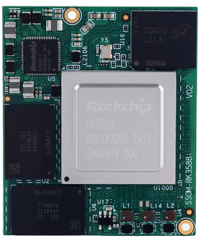

# Product Introduction

SSOM-3588-X2 is a small-sized, high-performance core module developed and designed based on the Rockchip RK3588. It integrates a quad-core Cortex-A76 and a quad-core Cortex-A55 CPU, ensuring a balance between performance and energy efficiency. The RK3588 also features a high-performance four-channel external memory interface (LPDDR4/LPDDR4X/LPDDR5), meeting the large memory bandwidth requirements for applications ranging from image post-processing to demanding computing tasks. It includes LPDDR4X, eMMC, PMIC, and four board-to-board connectors. Since most SoC signals can be transmitted through the board-to-board connectors, most of the SoC's functions can be realized.

The SSOM-3588-X2 measures only 47x39.4mm, making it compact and suitable for solution development in fields with strict size requirements, such as smart terminals, industrial control, machine vision, and edge computing.

## Functional Block Diagram

## Mechanical Dimensions

