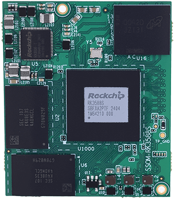
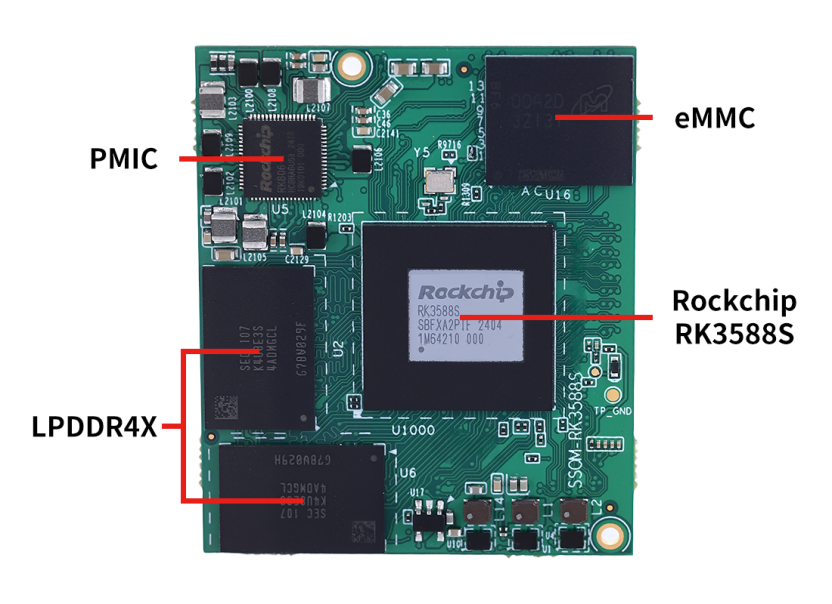
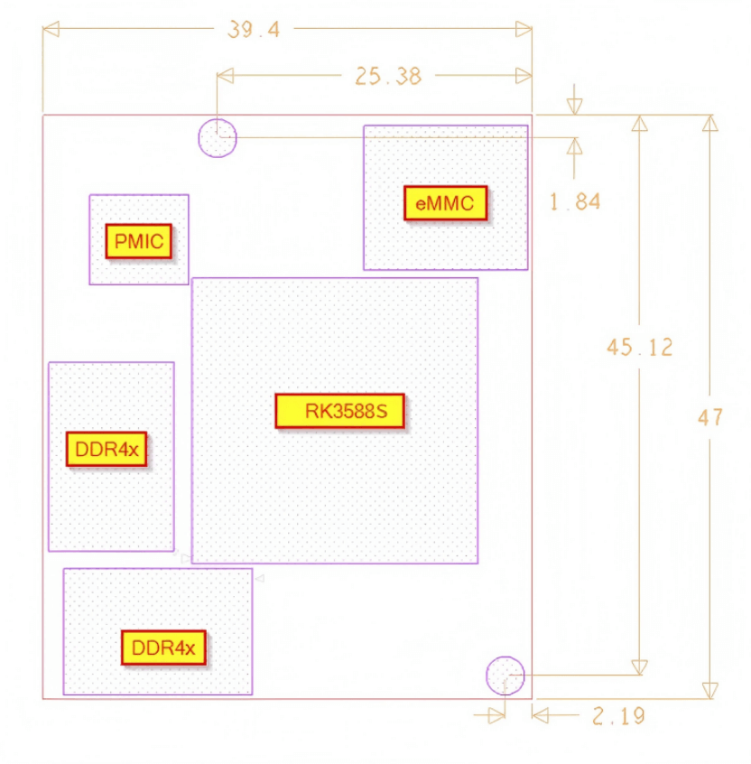

# Product Introduction

SSOM-3588S is a small-sized, high-performance core module developed and designed based on the Rockchip RK3588S processor. It integrates a quad-core Cortex-A76 and a quad-core Cortex-A55 CPU, Mali-G610 MP4 GPU, and an NPU with up to 6 TOPs of computing power. It supports 8K encoding and decoding; equipped with a new generation 48MP image signal processor, supporting HDR, 3DNR, etc. It includes LPDDR4X, eMMC, PMIC, and four board-to-board connectors. Since most SoC signals can be transmitted through the board-to-board connectors, most of the SoC's functions can be realized.

The SSOM-3588S measures only 47x39.4mm, making it compact and suitable for solution development in fields with strict size requirements, such as smart terminals, edge computing, IoT gateways, industrial control tablets, and automotive central control.

## Functional Block Diagram

##  Mechanical Dimensions

