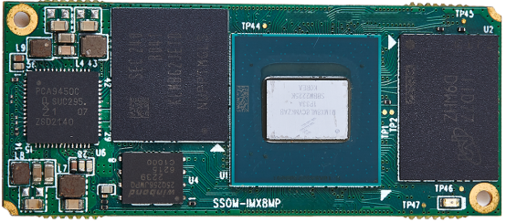

# Product Introduction

SSOM-IMX8MP is an ultra-compact system-on-module based on the NXP i.MX 8M Plus application processor. The module is equipped with LPDDR4 SDRAM, eMMC, NOR Flash, Power Management IC (PMIC), and four board-to-board connectors for connecting peripherals to the i.MX8M Plus. Since most of the SoC (i.MX8M Plus) signals can be connected through the board-to-board connectors, most of the SoC's functions can be realized. Its design is compatible with the NXP development kit (i.MX 8M Plus EVK), enabling the same functional features as the development kit and facilitating compatibility with software provided by NXP。