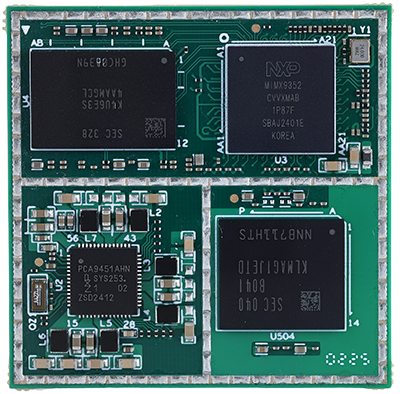
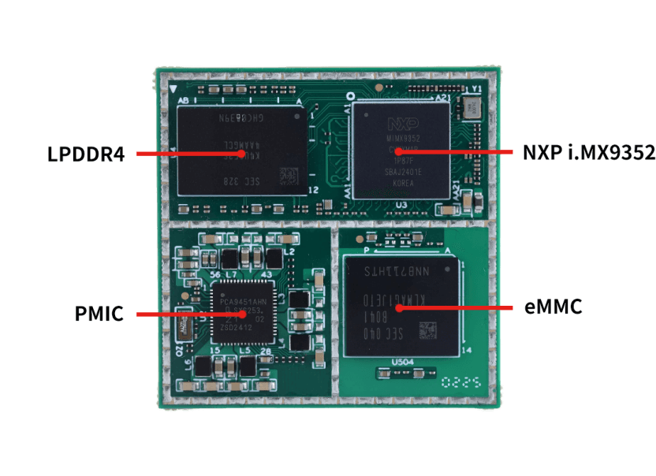
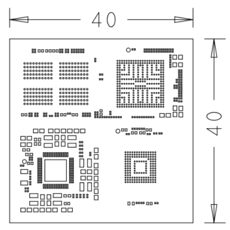

# Product Introduction

SSOM-IMX9352 is a high-performance, low-cost core module developed and designed based on the NXP i.MX9352 processor. It integrates a dual-core Cortex-A55 and Cortex-M33 real-time core, with a maximum frequency of up to 1.7 GHz. Common interfaces such as UART, 2-channel Gigabit Ethernet (one of which supports TSN), USB 2.0, and CANFD are led out. It integrates a 0.5 TOPS NPU (Neural Processing Unit) to accelerate edge machine learning applications.

The SSOM-IMX9352 measures only 40x40mm, making it compact and easy to integrate into various products, providing developers with a high-performance, low-cost solution.

## Functional Block Diagram

## Mechanical Dimensions

