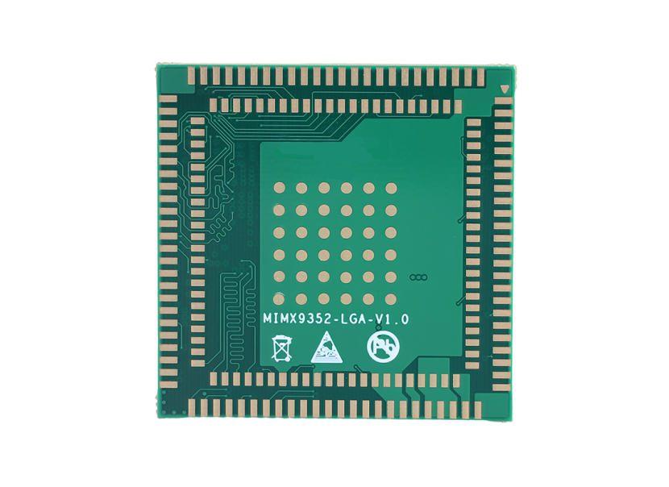

# Product Introduction

 

SSOM-IMX9352 is a high-performance, low-cost core module developed and designed based on the NXP i.MX9352 processor. It integrates a dual-core Cortex-A55 and Cortex-M33 real-time core, with a maximum frequency of up to 1.7 GHz. Common interfaces such as UART, 2-channel Gigabit Ethernet (one of which supports TSN), USB 2.0, and CANFD are led out. It integrates a 0.5 TOPS NPU (Neural Processing Unit) to accelerate edge machine learning applications.

The SSOM-IMX9352 measures only 40x40mm, making it compact and easy to integrate into various products, providing developers with a high-performance, low-cost solution.

## Functional Block Diagram

## 规格参数

| Specifications | Value |
| --------------- | ----- |
| CPU              | NXP i.MX9352, 2x Cortex-A55@1.7GHz + Cortex-M33@250MHz       |
| NPU              | 0.5 TOPS                                                     |
| 视频             | 输出: 1x MIPI-DSI(up to 1920x1200p60); 1x LVDS TX(up to 1366x768p60 or 1280x800p60 ); 输入: 1x MIPI-CSI |
| 音频             | 3x SAI; 1x SPDIF; 1x 24bit PDM                               |
| 以太网           | 2xGigabit Ethernet(1w/TSN)                                   |
| RAM              | 1GB/2GB LPDDR4 SDRAM                                         |
| Flash            | 8GB/16GB eMMC                                                |
| USB              | 2xUSB2.0 OTG                                                 |
| Gigabit Ethernet | 2x                                                           |
| ADC              | 4x                                                           |
| CAN FD           | 1x                                                           |
| MIPI DSI         | 1x                                                           |
| MIPI CSI         | 1x                                                           |
| LVDS             | 1x                                                           |
| UART             | 8x                                                           |
| I2C              | 8x                                                           |
| SAI              | 3x                                                           |
| SDIO             | 1x                                                           |
| SPI              | 8x                                                           |
| JTAG             | 1x                                                           |
| 电源             | DC 5V                                                        |
| 工作温度         | -20 ~ +75 °C                                                 |
| 尺寸（长X宽）    | 40.0 x 40.0mm                                                |
| 操作系统         | Linux                                                        |

## 引脚定义

| 外层引脚 |     |  内层引脚         |               |
| -------- | ------------ | -------- | ------------- |
| 引脚编号 | 引脚定义     | 引脚编号 | 引脚定义      |
| 1        | GND1         | 97       | PDM_CLK       |
| 2        | LVDS_CLK_P   | 98       | PDM_DATAO     |
| 3        | LVDS_CLK_N   | 99       | PDM_DATA1     |
| 4        | GND2         | 100      | GPIO_IO01     |
| 5        | LVDS_TX0_P   | 101      | GPIO_IO00     |
| 6        | LVDS_TX0_N   | 102      | GPIO_IO03     |
| 7        | GND3         | 103      | GPIO_IO02     |
| 8        | LVDS_TX1_P   | 104      | GPI0_IO04     |
| 9        | LVDS_TX1_N   | 105      | GPIO IO05     |
| 10       | GND4         | 106      | GPIO_IO06     |
| 11       | LVDS_TX2_P   | 107      | GPIO_IO07     |
| 12       | LVDS_TX2_N   | 108      | GPIO_IO12     |
| 13       | GND5         | 109      | GPI0_IO13     |
| 14       | LVDS_TX3_P   | 110      | GPI0_IO14     |
| 15       | LVDS_TX3_N   | 111      | GPIO_IO15     |
| 16       | GND6         | 112      | GPIO_IO29     |
| 17       | PMIC_32K_OUT | 113      | PMIC_nINT     |
| 18       | SYS_nRST     | 114      | NC1           |
| 19       | PMIC_SCLL    | 115      | NC2           |
| 20       | PMIC_SDAL    | 116      | NC3           |
| 21       | JTAG_TDO     | 117      | NC4           |
| 22       | JTAG_TDI     | 118      | NC5           |
| 23       | JTAG_TMS     | 119      | VDD1V8_2      |
| 24       | JTAG_TCK     | 120      | VDD5V_4       |
| 25       | GND7         | 121      | VDD5V_5       |
| 26       | VDD1V8_1     | 122      | VDD5V_6       |
| 27       | VDD5V_1      | 123      | VDD3V3_2      |
| 28       | VDD5V_2      | 124      | GND14         |
| 29       | VDD5V_3      | 125      | GND15         |
| 30       | VDD3V3_1     | 126      | GND16         |
| 31       | GND8         | 127      | CLKO04        |
| 32       | GND9         | 128      | CLKO03        |
| 33       | GPIO_IO22    | 129      | CLKO02        |
| 34       | GPIO_IO23    | 130      | CLKO01        |
| 35       | GPIO_IO24    | 131      | GND17         |
| 36       | GPIO_IO28    | 132      | ENET2_MDC     |
| 37       | ENET2_TDO    | 133      | ENET2_MDIO    |
| 38       | ENET2_TD1    | 134      | GND18         |
| 39       | ENET2_TD2    | 135      | SD3_CLK       |
| 40       | ENET2_TD3    | 136      | SD3_CMD       |
| 41       | ENET2_TXC    | 137      | SD3_DATAO     |
| 42       | ENET2_TX_CTL | 138      | SD3_DATA1     |
| 43       | ENET2_RDO    | 139      | SD3_DATA2     |
| 44       | ENET2_RD1    | 140      | SD3_DATA3     |
| 45       | ENET2_RD2    | 141      | ENET1_MDC     |
| 46       | ENET2_RD3    | 142      | ENET1_MDIO    |
| 47       | ENET2_RXC    | 143      | GPIO_IO25     |
| 48       | ENET2_RX_CTL | 144      | GPI0_IO27     |
| 49       | ENET1_RX_CTL | 145      | GPIO_IO16     |
| 50       | ENET1_RXC    | 146      | GPIO_IO19     |
| 51       | ENET1_RD3    | 147      | GPIO_IO20     |
| 52       | ENET1 RD2    | 148      | GPIO_IO26     |
| 53       | ENET1_RD1    | 149      | GPIO_IO17     |
| 54       | ENET1 RDO    | 150      | GPIO_IO08     |
| 55       | ENET1_TX_CTL | 151      | GPIO_IO09     |
| 56       | ENET1_TXC    | 152      | GPIO_IO10     |
| 57       | ENET1 TD3    | 153      | GPIO_IO11     |
| 58       | ENET1 TD2    | 154      | SAI1_RXDO     |
| 59       | ENET1 TD1    | 155      | SAI1_TXDO     |
| 60       | ENET1_TDO    | 156      | SAI1_TXC      |
| 61       | SD2_DATA3    | 157      | SAI1_TXFS     |
| 62       | SD2_DATA2    | 158      | WDOG_B        |
| 63       | SD2_DATA1    | 159      | UART2_TXD     |
| 64       | SD2_DATA0    | 160      | UART2_RXD     |
| 65       | SD2_nRST     | 161      | UART1_RXD     |
| 66       | SD2_CLK      | 162      | UART1_TXD     |
| 67       | SD2 CMD      | 163      | ADC_IN3       |
| 68       | SD2_nCD      | 164      | ADC_IN1       |
| 69       | SD2_VSEL     | 165      | ADC_IN2       |
| 70       | NVCC_SD      | 166      | ADC_INO       |
| 71       | ONOFF        | 167      | PMIC_STBY_REQ |
| 72       | POR_B        | 168      | PMIC_ON_REQ   |
| 73       | GND10        | 169      | CLKIN1        |
| 74       | USB2_DN      | 170      | CLKIN2        |
| 75       | USB2_DP      | 171      | USB1_ID       |
| 76       | GND11        | 172      | USB2_ID       |
| 77       | USB1_DN      | 173      | I2C1_SCL      |
| 78       | USB1_DP      | 174      | I2C1_SDA      |
| 79       | GND12        | 175      | 12C2_SCL      |
| 80       | CSI_CLK_P    | 176      | 12C2_SDA      |
| 81       | CSI_CLK_N    | 177      | USB_PWRON     |
| 82       | CSI_DO_P     | 178      | GND19         |
| 83       | CSI_DO_N     | 179      | TAMPERO       |
| 84       | CSI_D1_P     | 180      | TAMPER1       |
| 85       | CSI_D1_N     | 181      | NVCC_BBSM_1V8 |
| 86       | GND13        | 182      | GPIO_IO21     |
| 87       | DSI_D3_N     | 183      | GPIO_IO18     |
| 88       | DSI_D3_P     | 184      | GND20         |
| 89       | DSI_D2_N     |          |               |
| 90       | DSI_D2_P     |          |               |
| 91       | DSI_D1_N     |          |               |
| 92       | DSI_D1_P     |          |               |
| 93       | DSI_DO_N     |          |               |
| 94       | DSI_DO_P     |          |               |
| 95       | DSI_CLK_N    |          |               |
| 96       | DSI_CLK_P    |          |               |

| 中心引脚 |          |
| -------- | -------- |
| 引脚编号 | 引脚定义 |
| 185      | GND23    |
| 186      | GND24    |
| 187      | GND25    |
| 188      | GND26    |
| 189      | GND27    |
| 190      | GND38    |
| 191      | GND39    |
| 192      | GND40    |
| 193      | GND41    |
| 194      | GND42    |
| 195      | GND43    |
| 196      | GND44    |
| 197      | GND45    |
| 198      | GND46    |
| 199      | GND47    |
| 200      | GND48    |
| 201      | GND49    |
| 202      | GND50    |
| 203      | GND51    |
| 204      | GND52    |
| 205      | GND53    |
| 206      | GND54    |
| 207      | GND55    |
| 208      | GND56    |
| 209      | GND57    |
| 210      | GND58    |
| 211      | GND59    |
| 212      | GND60    |
| 213      | GND61    |
| 214      | GND62    |
| 215      | GND63    |
| 216      | GND64    |
| 217      | GND65    |
| 218      | GND66    |
| 219      | GND67    |
| 220      | GND68    |

## Mechanical Dimensions

