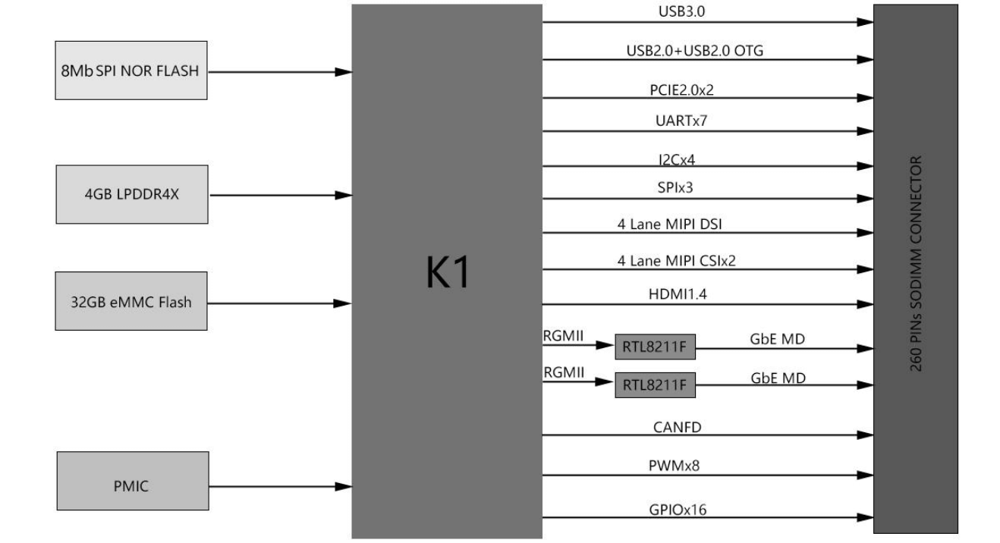
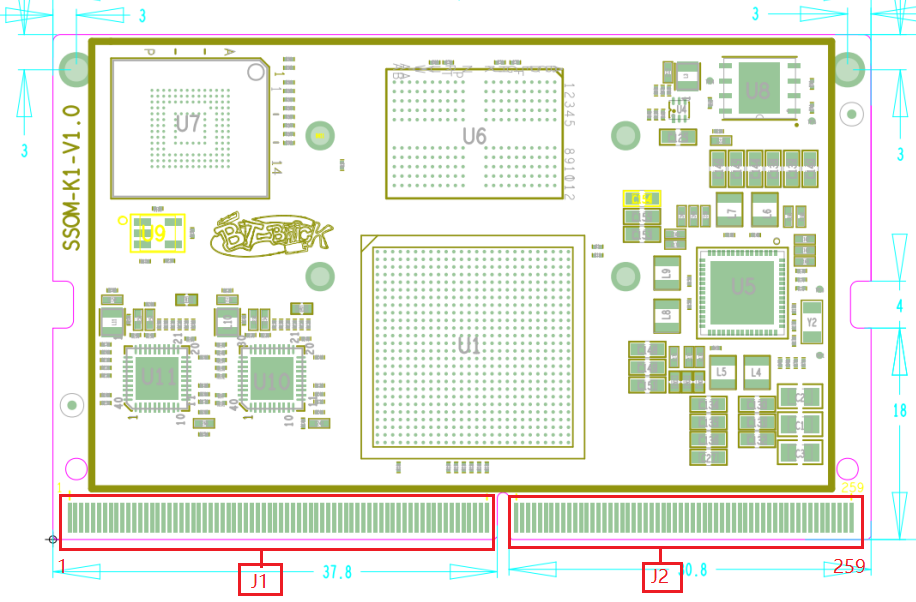
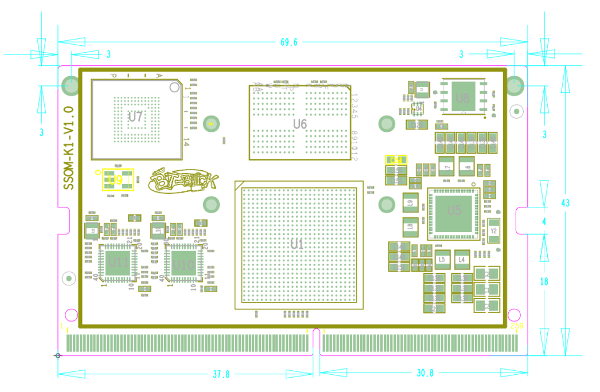

# Product Introduction 

SSOM-K1 is an ultra-compact SoM (System on Module) with SpacemiT K1 System on Chip(SOC).The module integrate with high speed LPDDR4X SDRAM, eMMC, NOR Flash, power monitoring IC (PMIC), and two Ethernet PHY. 

SSOM-K1 provide extensive connectivity options, including USB 2.0, USB 3.0, Gigabit Ethernet, MIPI-CSI, PCI Express, as well as HDMI 
and a 4-lane MIPI-DSI Display interface. These remarkable features position the SOM as an exceptional choice for a wide variety of 
embedded applications. 

Since most of the SoC signals can be connected through the SODIMM connector, most of the SoC functions are available.

## Functional Block Diagram

## 规格参数

| 参数                 | 描述                                                         |
| -------------------- | ------------------------------------------------------------ |
| CPU                   | RISC-V SpacemiT® X60™ Dual-Cluster Octa-core processors, adhere to the RISC-V 64GCVB architecture and RVA22 standard |
| GPU                   | IMG BXE-2-32@819MHz, 32KB SLC, support OpenCL3.0/OpenGL ES 3.2/Vulkan1.3 |
| RAM                   | LPDDR4X SDRAM (2GB/4GB/8GB available)                        |
| Flash                 | eMMC flash ,maximum size up to 64GB                          |
| Graph engine          | IMG BXE-2-32@819MHz, 32KB SLC, support OpenCL3.0/OpenGL ES 3.2/Vulkan1.3 |
| H/W Video Codec       |                                                              |
| HDMI                  | HDMI1.4,support 1920*1080@60fps                              |
| LCD interface         | 1xMIPI 4lanes                                                |
| Chipset               | RTL8211F                                                     |
| Speed                 | 1000Mbit/s                                                   |
| PCIE                  | 2xPCIE 2.0 2 lanes                                           |
| USB                   | 1xUSB3.0,1xUSB2.0,1xUSB2.0 OTG                               |
| Audio                 | 2xI2S                                                        |
| SDIO                  | 2xSDIO                                                       |
| UART                  | 7                                                            |
| I2C                   | 4                                                            |
| SPI                   | 3                                                            |
| CAN                   | 1                                                            |
| Camera interface      | 2xMIPI CSI 4 lanes                                           |
| PWM                   | 8                                                            |
| GPIO                  | 16                                                           |
| Power Supply Voltage  | Fixed 5V DC source                                           |
| Power Consumption     | 2W typical                                                   |
| Operating Temperature | -20 ~ 75 °C                                                  |
| Operating Humidity    | 95% relative humidity, non-condensing                        |
| Dimensions (W x D)    | 69.6 x 43 mm                                                 |
| Operation System  | Bianbu OS/Linux/Open harmony                                 |
| Certifications    | CE/FCC Class B                                               |

## 引脚定义

### J1

| Top |         |Bottom           |                |
| ------------- | ------------------ | --------- | -------------- |
| Pin Number    | Pin Defination     | PinNumber | Pin Defination |
| 1             | GND                | 2         | GND            |
| 3             | PHY1_LED1/CFG_LDO0 | 4         | CSI1_DP0       |
| 5             | PHY1_LED2/CFG_LDO1 | 6         | CSI1_DN0       |
| 7             | GND                | 8         | GND            |
| 9             | PHY1_MDI0+         | 10        | CSI1_CKP       |
| 11            | PHY1_MDI0-         | 12        | CSI1_CKN       |
| 13            | GND                | 14        | GND            |
| 15            | PHY1_MDI1+         | 16        | CSI1_DP1       |
| 17            | PHY1_MDI1-         | 18        | CSI1_DN1       |
| 19            | GND                | 20        | GND            |
| 21            | PHY1_MDI2+         | 22        | CSI1_DP2       |
| 23            | PHY1_MDI2-         | 24        | CSI1_DN2       |
| 25            | GND                | 26        | GND            |
| 27            | PHY1_MDI3+         | 28        | CSI1_DP3       |
| 29            | PHY1_MDI3-         | 30        | CSI1_DN3       |
| 31            | GND                | 32        | GND            |
| 33            | PHY0_LED1/CFG_LDO0 | 34        | CSI3_DP0       |
| 35            | PHY0_LED2/CFG_LDO1 | 36        | CSI3_DN0       |
| 37            | GND                | 38        | GND            |
| 39            | PHY0_MDI0+         | 40        | CSI3_CKP       |
| 41            | PHY0_MDI0-         | 42        | CSI3_CKN       |
| 43            | GND                | 44        | GND            |
| 45            | PHY0_MDI1+         | 46        | CSI3_DP1       |
| 47            | PHY0_MDI1-         | 48        | CSI3_DN1       |
| 49            | GND                | 50        | GND            |
| 51            | PHY0_MDI2+         | 52        | CSI3_DP2       |
| 53            | PHY0_MDI2-         | 54        | CSI3_DN2       |
| 55            | GND                | 56        | GND            |
| 57            | PHY0_MDI3+         | 58        | CSI3_DP3       |
| 59            | PHY0_MDI3-         | 60        | CSI3_DN3       |
| 61            | GND                | 62        | GND            |
| 63            | GMAC0_REF0_CLK_25M | 64        | CSI2_CKP       |
| 65            | GMAC1_REF0_CLK_25M | 66        | CSI2_CKN       |
| 67            | GND                | 68        | GND            |
| 69            | USB3_TXP           | 70        | CSI1_PWDN      |
| 71            | USB3_TXN           | 72        | CSI1_RST       |
| 73            | GND                | 74        | GND            |
| 75            | USB1_DP            | 76        | CSI_I2C0_SCL   |
| 77            | USB1_DN            | 78        | CSI_I2C0_SDA   |
| 79            | GND                | 80        | GND            |
| 81            | USB0_DP            | 82        | CSI3_RST       |
| 83            | USB0_DN            | 84        | CSI3_PWDN      |
| 85            | GND                | 86        | GND            |
| 87            | USB2_DP            | 88        | CSI_MCLK       |
| 89            | USB2_DN            | 90        | USB2_PWREN     |
| 91            | GND                | 92        | GND            |
| 93            | USB3_RXP           | 94        | USB3_PWREN     |
| 95            | USB3_RXN           | 96        | LCD_BL_PWM_1V8 |
| 97            | GND                | 98        | GND            |
| 99            | MIPI_DSI1_D3N      | 100       | AP_I2C6_SCL    |
| 101           | MIPI_DSI1_D3P      | 102       | AP_I2C6_SDA    |
| 103           | GND                | 104       | GND            |
| 105           | MIPI_DSI1_D2N      | 106       | GPIO_74        |
| 107           | MIPI_DSI1_D2P      | 108       | UART5_CTS      |
| 109           | GND                | 110       | UART5_RTS      |
| 111           | MIPI_DSI1_CLKN     | 112       | UART5_TXD      |
| 113           | MIPI_DSI1_CLKP     | 114       | UART5_RXD      |
| 115           | GND                | 116       | PCIEB_CLKREQN  |
| 117           | MIPI_DSI1_D1N      | 118       | PCIEC_PERSTN   |
| 119           | MIPI_DSI1_D1P      | 120       | PCIEB_PERSTN   |
| 121           | GND                | 122       | PCIEB_WAKEN    |
| 123           | MIPI_DSI1_D0N      | 124       | GPIO_92        |
| 125           | MIPI_DSI1_D0P      | 126       | JTAG_SEL       |
| 127           | GND                | 128       | GND            |
| 129           | HDMI_TXCN          | 130       | GPIO_90        |
| 131           | HDMI_TXCP          | 132       | GPIO_91        |
| 133           | GND                | 134       | GND            |
| 135           | HDMI_TX0N          | 136       | HDMI_CEC       |
| 137           | HDMI_TX0P          | 138       | HDMI_HPD       |
| 139           | GND                | 140       | LCD_BL_EN_1V8  |
| 141           | HDMI_TX1N          | 142       | LCD_PWR_EN_1V8 |
| 143           | HDMI_TX1P          | 144       | LCD_RST_1V8    |

### J2

| Top |          |      Bottom     |                  |
| ------------- | ---------------- | --------- | ---------------- |
| PinNumber     | Pin Defination   | PinNumber | Pin Defination   |
| 145           | GND              | 146       | GND              |
| 147           | HDMI_TX2N        | 148       | SD0_DATA1        |
| 149           | HDMI_TX2P        | 150       | SD0_CLK          |
| 151           | GND              | 152       | SD0_DATA3        |
| 153           | PCIEB_RX1N       | 154       | SD0_CD_3V3       |
| 155           | PCIEB_RX1P       | 156       | SD0_DATA2        |
| 157           | GND              | 158       | SD0_CMD          |
| 159           | PCIEB_REFCLK_N   | 160       | SD0_DATA0        |
| 161           | PCIEB_REFCLK_P   | 162       | HDMI_SCL         |
| 163           | GND              | 164       | HDMI_SDA         |
| 165           | PCIEB_RX0N       | 166       | CAN_RX0          |
| 167           | PCIEB_RX0P       | 168       | CAN_TX0          |
| 169           | GND              | 170       | AP_I2C4_SCL_3V3  |
| 171           | PCIEB_TX1N       | 172       | AP_I2C4_SDA_3V3  |
| 173           | PCIEB_TX1P       | 174       | AP_I2C3_SCL_3V3  |
| 175           | GND              | 176       | AP_I2C3_SDA_3V3  |
| 177           | PCIEB_TX0N       | 178       | GND              |
| 179           | PCIEB_TX0P       | 180       | MIPI_LCD_ADC_1V8 |
| 181           | GND              | 182       | GND              |
| 183           | PCIEC_RX1N       | 184       | GPIO_96          |
| 185           | PCIEC_RX1P       | 186       | GPIO_47          |
| 187           | GND              | 188       | GPIO_48          |
| 189           | PCIEC_RX0N       | 190       | GND              |
| 191           | PCIEC_RX0P       | 192       | AP_I2C2_SCL      |
| 193           | GND              | 194       | AP_I2C2_SDA      |
| 195           | PCIEC_TX1N       | 196       | R_I2C0_SCL_3V3   |
| 197           | PCIEC_TX1P       | 198       | R_I2C0_SDA_3V3   |
| 199           | GND              | 200       | GND              |
| 201           | PCIEC_REFCLK_N   | 202       | TP_INT_1V8       |
| 203           | PCIEC_REFCLK_P   | 204       | TP_RST_1V8       |
| 205           | GND              | 206       | GND              |
| 207           | PCIEC_TX0N       | 208       | UART0_RXD        |
| 209           | PCIEC_TX0P       | 210       | UART0_TXD        |
| 211           | GND              | 212       | UART2_CTS        |
| 213           | PCIEC_WAKEN      | 214       | UART2_RTS        |
| 215           | GND              | 216       | UART2_RXD        |
| 217           | PCIEC_CLKREQN    | 218       | UART2_TXD        |
| 219           | GND              | 220       | I2S1_SCLK        |
| 221           | GND              | 222       | I2S1_LRCK        |
| 223           | SDIO2_DATA0      | 224       | I2S1_RXD         |
| 225           | SDIO2_DATA1      | 226       | I2S1_TXD         |
| 227           | SDIO2_DATA2      | 228       | I2S0_TXD         |
| 229           | SDIO2_DATA3      | 230       | I2S0_SCLK        |
| 231           | SDIO2_CMD        | 232       | I2S0_LRCK        |
| 233           | SDIO2_CLK        | 234       | I2S0_SYSCLK      |
| 235           | GND              | 236       | I2S0_RXD         |
| 237           | WL_DIS_N_GPIO116 | 238       | CODEC_IRQ        |
| 239           | WL_REG_ON_GPIO67 | 240       | PA_SHUTDOWN      |
| 241           | AP_WAKE_BT       | 242       | QSPI_DATA3       |
| 243           | BT_RESETN        | 244       | QSPI_DATA2       |
| 245           | WL_WAKE_AP       | 246       | QSPI_DATA1       |
| 247           | BT_WAKE_AP       | 248       | QSPI_DATA0       |
| 249           | SLEEP_OUT        | 250       | SW_PWRON         |
| 251           | RESET_IN_N       | 252       | SW_RST           |
| 253           | VCC5V0_SYS       | 254       | VCC5V0_SYS       |
| 255           | VCC5V0_SYS       | 256       | VCC5V0_SYS       |
| 257           | VCC5V0_SYS       | 258       | VCC5V0_SYS       |
| 259           | VCC5V0_SYS       | 260       | VCC_BAT          |

## Mechanical Dimensions
