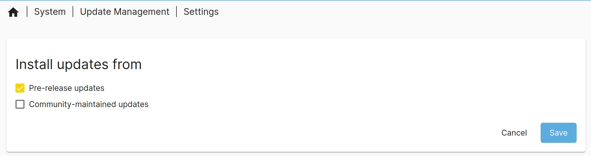
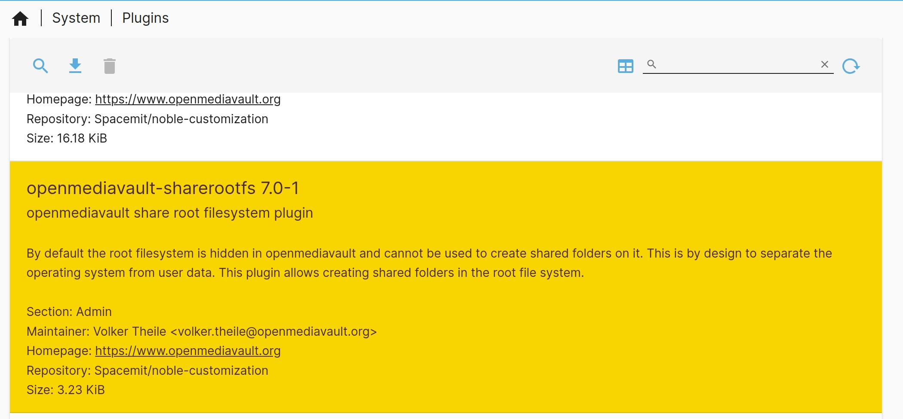
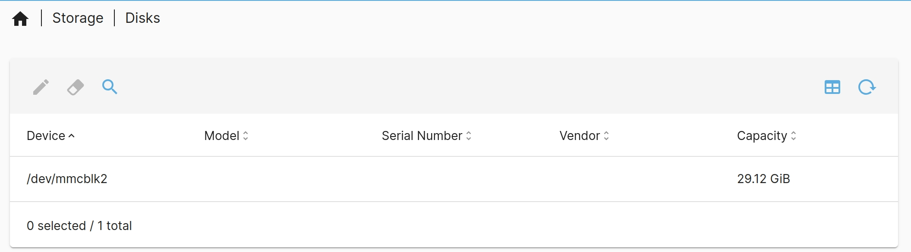

# Essential Configuration

## Apt Update

It is essential to update the software sources (`apt update`) before downloading packages for the first time. Regular updates are also recommended to ensure the system always has the latest software.

- Click "System -> Update Management -> Settings", check "Pre-release updates", click "Save", and  then wait for the update.

  

## Rootfs Mount

Bianbu NAS manages rootfs by the `sharerootfs` plugin. To mount rootfs, first download the `sharerootfs` plugin.

- Click "System -> Plugins", select the `sharerootfs` plugin, and click the download button.

- After downloading the `sharerootfs` plugin, the mount results are shown in "Storage -> Disks".

