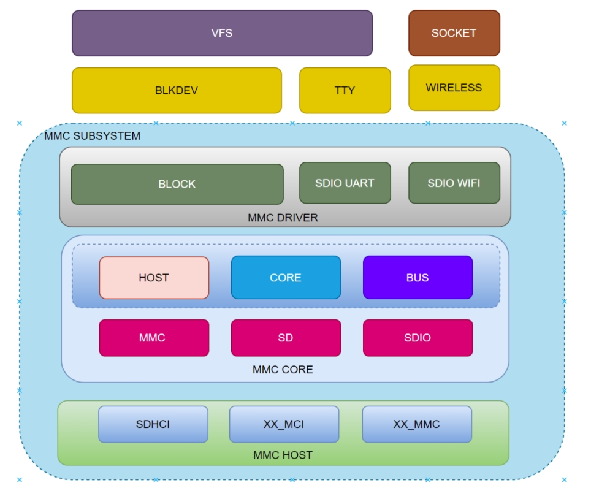

# SDHC

Introduction to the functions and usage of SDHC.

## Module Introduction

SDHC is the controller for MultiMediaCard (MMC) / Secure Digital (SD) / Secure Digital Input Output (SDIO) modules.

### Function Introduction



The MMC framework diagram can be divided into the following layers:  
MMC Host: This is the MMC controller driver layer, responsible for initializing the MMC controller and low-level data transmission and reception operations, directly controlling the underlying registers.  
MMC Core: This is the core layer, responsible for abstracting virtual card devices and providing interfaces for upper layers.  
MMC Block: This is the block device layer, responsible for implementing block device drivers and interfacing with other kernel frameworks (such as block device, TTY, wifi, etc.).  
These hierarchical structures together form the complete framework of the MMC subsystem in the Linux system, ensuring the normal operation and data transmission of MMC devices in the system.

### Source Code Structure Introduction

The controller driver code is under the drivers/mmc/host directory:

```
drivers/mmc/host
|-- sdhci.c          # sdhci standard code
|-- sdhci-pltfm.c    # sdhci platform layer
|-- sdhci-of-k1x.c   # k1 sdhci driver
```

## Key Features

### Features

| Feature | Description |
| :-----| :----|
| Supports eMMC5.1 | Supports eMMC5.1 protocol, including HS400, HS200 |
| Supports sd3.0 | Supports sd3.0 protocol cards, compatible with sd2.0 protocol |
| Supports DMA | Supports DMA data transfer |

### Performance Parameters

| eMMC Model | Sequential Read (MB/s) | Sequential Write (MB/s) | Random Read (MB/s) | Random Write (MB/s) |
| :-----| :----| :----: | :----: |:----: |
| KLMAG1JETD-B041 | 295 | 53.3 | 65.4 | 45.2 |
| FEMDME008G-A8A39 | 304 | 107 | 32.3 | 44 |

Test method

```
fio -name=randread -direct=1 -iodepth=64 -rw=randread -ioengine=libaio -bs=4k -size=1G -numjobs=1 -runtime=1000 -group_reporting -filename=/1
fio -name=randwrite -direct=1 -iodepth=64 -rw=randwrite -ioengine=libaio -bs=4k -size=1G -numjobs=1 -runtime=1000 -group_reporting -filename=/1
fio -name=read -direct=1 -iodepth=64 -rw=read -ioengine=libaio -bs=512k -size=1G -numjobs=1 -runtime=1000 -group_reporting -filename=/1
fio -name=write -direct=1 -iodepth=64 -rw=write -ioengine=libaio -bs=512k -size=1G -numjobs=1 -runtime=1000 -group_reporting -filename=/1
```

***Default configuration HS400 200M***

## Configuration Introduction

Mainly includes driver enable configuration and dts configuration

### CONFIG Configuration

CONFIG_MMC provides support for the MMC bus protocol. By default, this option is Y.

```
Device Drivers
        MMC/SD/SDIO card support (MMC [=y])     
```

CONFIG_MMC_BLOCK provides support for the MMC block device driver for mounting file systems. By default, this option is Y.

```
Device Drivers
 MMC/SD/SDIO card support (MMC [=y])
     HW reset support for eMMC (PWRSEQ_EMMC [=y])
        Simple HW reset support for MMC (PWRSEQ_SIMPLE [=y])
     MMC block device driver (MMC_BLOCK [=y])
```

CONFIG_MMC_SDHCI provides support for the MMC controller driver. By default, this option is Y.

```
Device Drivers
 MMC/SD/SDIO card support (MMC [=y])
     Secure Digital Host Controller Interface support (MMC_SDHCI [=y])
         SDHCI platform and OF driver helper (MMC_SDHCI_PLTFM [=y])
       SDHCI OF support for the Spacemit K1X SDHCI controllers (MMC_SDHCI_OF_K1X [=y])
```

### dts Configuration

#### pinctrl

There are three slots for sdhc: slot1 supports sd/sdio (1/4 bit), slot2 supports sdio/emmc (1/4 bit), and slot3 only supports emmc (1/4/8 bit)。

Generally, slot1 is used for sd, slot2 for sdio, and slot3 for emmc.

Both sd and sdio need to configure the card signal lines' pinctrl to mode0, corresponding to pinctrl_mmc1 and pinctrl_mmc2.

mmc1's pinctrl also has a fast mode, which needs to be switched to pinctrl_mmc1_fast mode when the clock is higher than 100M.

```c
    pinctrl_mmc1: mmc1_grp {
        pinctrl-single,pins = <
            K1X_PADCONF(MMC1_DAT3, MUX_MODE0, (EDGE_NONE | PULL_UP | PAD_3V_DS4))         /* mmc1_d3 */
            K1X_PADCONF(MMC1_DAT2, MUX_MODE0, (EDGE_NONE | PULL_UP | PAD_3V_DS4))         /* mmc1_d2 */
            K1X_PADCONF(MMC1_DAT1, MUX_MODE0, (EDGE_NONE | PULL_UP | PAD_3V_DS4))         /* mmc1_d1 */
            K1X_PADCONF(MMC1_DAT0, MUX_MODE0, (EDGE_NONE | PULL_UP | PAD_3V_DS4))         /* mmc1_d0 */
            K1X_PADCONF(MMC1_CMD,  MUX_MODE0, (EDGE_NONE | PULL_UP | PAD_3V_DS4))         /* mmc1_cmd */
            K1X_PADCONF(MMC1_CLK,  MUX_MODE0, (EDGE_NONE | PULL_DOWN | PAD_3V_DS4))       /* mmc1_clk */
        >;
    };

    pinctrl_mmc1_fast: mmc1_fast_grp {
        pinctrl-single,pins = <
            K1X_PADCONF(MMC1_DAT3, MUX_MODE0, (EDGE_NONE | PULL_UP | PAD_1V8_DS3))         /* mmc1_d3 */
            K1X_PADCONF(MMC1_DAT2, MUX_MODE0, (EDGE_NONE | PULL_UP | PAD_1V8_DS3))         /* mmc1_d2 */
            K1X_PADCONF(MMC1_DAT1, MUX_MODE0, (EDGE_NONE | PULL_UP | PAD_1V8_DS3))         /* mmc1_d1 */
            K1X_PADCONF(MMC1_DAT0, MUX_MODE0, (EDGE_NONE | PULL_UP | PAD_1V8_DS3))         /* mmc1_d0 */
            K1X_PADCONF(MMC1_CMD,  MUX_MODE0, (EDGE_NONE | PULL_UP | PAD_1V8_DS3))         /* mmc1_cmd */
            K1X_PADCONF(MMC1_CLK,  MUX_MODE0, (EDGE_NONE | PULL_DOWN | PAD_1V8_DS3))       /* mmc1_clk */
        >;
    };
```

#### gpio

sd detection is done via gpio, and the card detection gpio needs to be configured according to the actual schematic.

```c
&sdhci0 {
        cd-gpios = <&gpio 80 0>;
        cd-inverted;
};
```

For example, if gpio80 is used for card detection, you also need to configure the pintcl function of gpio80.

```c
&pinctrl {
        pinctrl-single,gpio-range = <
                &range GPIO_80  1 (MUX_MODE0 | EDGE_NONE | PULL_UP   | PAD_3V_DS4)
        >;
};

&gpio{
        gpio-ranges = <
                &pinctrl 80  GPIO_80  4
        >;
};
```

#### Power Configuration

sd and sdio need to configure two power supplies, vmmc-supply and vqmmc-supply, corresponding to card function and io power supply, respectively. vqmmc-supply will dynamically switch power according to the card's operating mode. Hardware design needs to ensure support for both 3.3v and 1.8v.

emmc is guaranteed to have power by design and does not need power configuration.

```c
&sdhci0 {
        vmmc-supply = <&dcdc_4>;
        vqmmc-supply = <&ldo_1>;
};
```

#### tuning Configuration

sd needs tuning in high-speed mode. The tx and rx parameters need to be adjusted for different hardware versions.

#### dts Configuration Example

The complete sd configuration is as follows:

```c
&sdhci0 {
        pinctrl-names = "default","fast";
        pinctrl-0 = <&pinctrl_mmc1>;
        pinctrl-1 = <&pinctrl_mmc1_fast>;
        bus-width = <4>;
        cd-gpios = <&gpio 80 0>;
        cd-inverted;
        vmmc-supply = <&dcdc_4>;
        vqmmc-supply = <&ldo_1>;
        no-mmc;
        no-sdio;
        spacemit,sdh-host-caps-disable = <(
                        MMC_CAP_UHS_SDR12 |
                        MMC_CAP_UHS_SDR25
                        )>;
        spacemit,sdh-quirks = <(
                        SDHCI_QUIRK_BROKEN_CARD_DETECTION |
                        SDHCI_QUIRK_INVERTED_WRITE_PROTECT |
                        SDHCI_QUIRK_BROKEN_TIMEOUT_VAL
                        )>;
        spacemit,sdh-quirks2 = <(
                        SDHCI_QUIRK2_PRESET_VALUE_BROKEN |
                        SDHCI_QUIRK2_BROKEN_PHY_MODULE |
                        SDHCI_QUIRK2_SET_AIB_MMC
                        )>;
        spacemit,aib_mmc1_io_reg = <0xD401E81C>;
        spacemit,apbc_asfar_reg = <0xD4015050>;
        spacemit,apbc_assar_reg = <0xD4015054>;
        spacemit,rx_dline_reg = <0x0>;
        spacemit,tx_dline_reg = <0x0>;
        spacemit,tx_delaycode = <0xA0>;
        spacemit,rx_tuning_limit = <50>;
        spacemit,sdh-freq = <204800000>;
        status = "okay";
};
```

The complete emmc configuration is as follows:

```c
/* eMMC */
&sdhci2 {
        bus-width = <8>;
        non-removable;
        mmc-hs400-1_8v;
        mmc-hs400-enhanced-strobe;
        no-sd;
        no-sdio;
        spacemit,sdh-quirks = <(
                        SDHCI_QUIRK_BROKEN_CARD_DETECTION |
                        SDHCI_QUIRK_BROKEN_TIMEOUT_VAL
                        )>;
        spacemit,sdh-quirks2 = <(
                        SDHCI_QUIRK2_PRESET_VALUE_BROKEN
                        )>;
        spacemit,sdh-freq = <375000000>;
        status = "okay";
};
```

## API Introduction

### API Introduction

The Linux operating system includes an MMC bus driver that implements the MMC bus protocol, an MMC block driver that handles file system read/write calls, and uses the MMC host controller interface driver to send commands to uSDHC.
The k1 mmc controller driver implements interfaces such as init, exit, request, resume, suspend, and set_ios, mainly including:

- The init function sdhci_pltfm_init() initializes the platform hardware and registers the sdhci_k1x_pdata structure
- The exit function spacemit_sdhci_remove() deinitializes the platform hardware and releases allocated memory

### Debug Introduction

#### sysfs

```
sd_card_pmux
This node is used to switch the sd card pin to jtag function, 0 means sd card function, 1 means jtag function.
tx_delaycode
The value of tx_delaycode is specified in the scheme dts by default, and can be dynamically modified through this node under sysfs, which is convenient for debugging and verification.
```

#### debugfs

```
Commonly used to query the working status of mmc, including frequency, bit width, mode, etc.
cat /sys/kernel/debug/mmc0/ios
clock:          204800000 Hz
actual clock:   204800000 Hz
vdd:            21 (3.3 ~ 3.4 V)
bus mode:       2 (push-pull)
chip select:    0 (don't care)
power mode:     2 (on)
bus width:      2 (4 bits)
timing spec:    6 (sd uhs SDR104)
signal voltage: 1 (1.80 V)
driver type:    0 (driver type B)
```

## Test Introduction

MMC/SD and other storage can be tested for performance and functionality using third-party tools, e.g.: fio, bonnie++. Currently, fio tool is integrated on bianbu-linux. You can use fio tool for read/write performance and aging tests.

## FAQ
