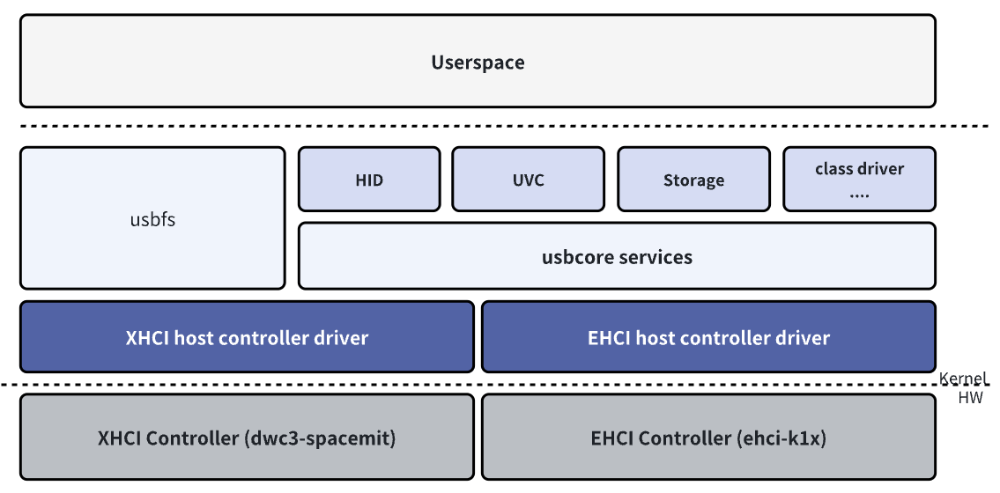
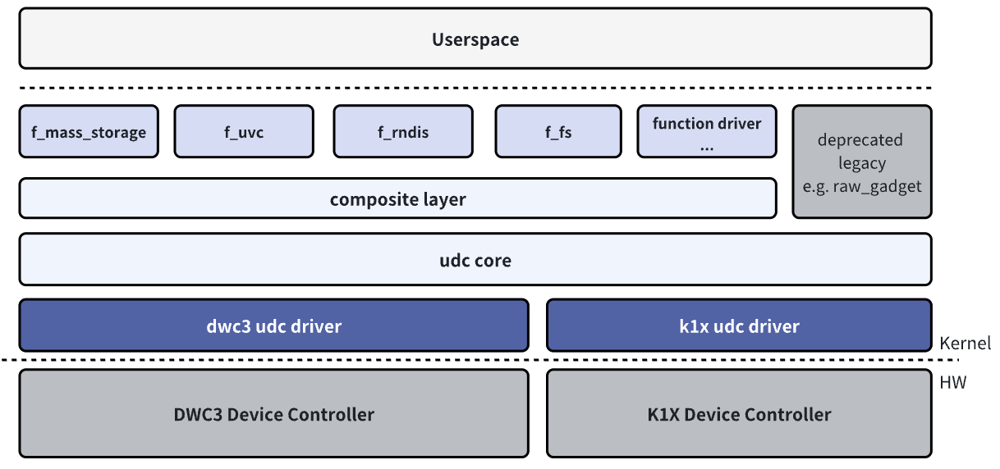

# USB

Introduction to the functions and usage of USB.

## Module Introduction

USB stands for Universal Serial Bus, an emerging data communication method that is gradually replacing other interface standards. It was jointly developed in 1995 by computer and communication companies such as Intel, Compaq, Digital, IBM, Microsoft, NEC, and Northern Telecom, and has gradually become an an industry standard.

K1 has three USB controllers: USB2.0 OTG (USB0), USB2.0 Host (USB1), and USB3.0 DRD (USB2.0 Port as USB2, SuperSpeed Port as USB3).

In Linux, two USB roles are supported: Host mode (for connecting external USB devices) and Device mode (for connecting as a USB device to another host).

### Function Introduction

#### USB Host



The USB Host role driver framework can be divided into the following layers:  

- USB Host Controller Driver: This is the USB controller driver layer, responsible for initializing the controller and performing low-level data transmission and reception.  
- USB Core Services: This is the core layer, responsible for abstracting the USB layers and URB-based transfers, and providing interfaces for upper and lower layers.  
- USB Class Driver: This is the USB device function layer, responsible for implementing USB device drivers and function drivers, interfacing with other kernel frameworks (such as HID, UVC, Storage, etc.).  

#### USB Device



The USB Device role driver framework can be divided into the following layers:  

- USB Device Controller Driver: This is the controller driver layer for the USB Device role, responsible for initializing the controller and performing low-level data transmission and reception.  
- UDC Core: This is the core layer, responsible for abstracting the USB Device layers and usb_request-based transfers, and providing interfaces for upper and lower layers.  
- Composite: Used to combine multiple USB Device functions into one device, supporting user-space configuration via configfs or legacy drivers with hardcoded function combinations.  
- Function Driver: This is the USB Device function layer, responsible for implementing function drivers in USB Device mode, interfacing with other kernel frameworks (such as storage, V4L2, networking, etc.).  

These hierarchical structures together form the framework of the USB subsystem in the Linux system, ensuring the normal operation and data transmission of the USB module system.

### Source Code Structure Introduction

The USB2.0 OTG controller driver code is under the `drivers/usb` directory:

```
drivers/usb
|-- phy/
|   |-- phy-k1x-ci-otg.c      # OTG driver, used to implement the switch between EHCI Host and K1X UDC mode drivers.
|   |-- phy/phy-k1x-ci-usb2.c # PHY driver.
|-- host/
|   |-- ehci-k1x-ci.c         # EHCI Host mode platform driver, needs to be used in conjunction with the EHCI Host driver.
|-- gadget/
    |-- udc/
        |-- k1x_udc_core.c    # Device mode driver.
```

The USB2.0 HOST controller driver code is under the `drivers/usb` directory:

```
drivers/usb
|-- phy/
|    |-- phy-k1x-ci-usb2.c # PHY driver.
|-- host/
    |-- ehci-k1x-ci.c     # EHCI Host mode platform driver, needs to be used in conjunction with the EHCI Host driver.
```

The USB3.0 DRD controller driver code is under the `drivers/usb` directory:

```
drivers/usb
|-- phy/
|   |-- phy-k1x-ci-usb2.c   # USB3.0 USB2.0 PHY driver under the composite port.
|-- phy/
|   |-- spacemit/
|       |-- phy-spacemit-k1x-combphy.c # USB3.0 5Gbps PHY driver.
|-- dwc3/
|   |-- dwc3-spacemit.c    # DWC platform driver, needs to be used in conjunction with the DWC3 driver.
```

Other component code paths are as follows:

```
drivers/
|-- extcon/
|    |-- extcon-k1xci.c   # MicroUSB Pin detection connector driver, needs to be used in conjunction with OTG driver and Extcon driver.
|-- usb
|    |-- misc/
|        |-- spacemit_onboard_hub.c # Helper driver for configuring power supply for onboard USB peripherals.
```

## Key Features

### USB2.0 OTG

#### Features

| Feature | Description |
| :-----| :----|
| OTG Support | Supports switching between Host and Device modes, and supports idpin+vbuspin detection. |
| HS, FS Host/Device Support | High Speed(480Mb/s), Full Speed(12Mb/s) Host/Device modes |
| LS Host Only Support | Low Speed(1.5Mb/s) Host only mode support|
| 16 Host Channel Support| Supports up to 16 Channels for simultaneous transmission|
| 16 IN + 16 OUT Device Endpoints Support| 16KB Tx Buffer, 2KB Rx Buffer|
| Remote Wakeup Support| Supports High Speed, Full Speed, Low Speed Remote Wakeup in Host mode |

#### Performance Parameters

| Test Item | Tx(MB/s) | Rx(MB/s) |
| :-----| :----| :----: |
| USB Flash Drive Speed Test (HIKISEMI S560 256GB) | 32.2 | 32.4 |
| USB Flash Drive Gadget Mode Speed Test | 21.8 | 14.8 |

Test Method

```
# USB Flash Drive Speed Test：
## host:
fio -name=Tx -ioengine=libaio -direct=1 -iodepth=64 -rw=write -bs=512K -size=1024M -numjobs=1 -group_reporting -filename=/dev/sda
fio -name=Rx -ioengine=libaio -direct=1 -iodepth=64 -rw=read -bs=512K -size=1024M -numjobs=1 -group_reporting -filename=/dev/sda

# USB Flash Drive Gadget Mode：
## device:
gadget-setup msc
## pc:
fio -name=DevRx -ioengine=libaio -direct=1 -iodepth=64 -rw=write -bs=512K -size=100M -numjobs=1 -group_reporting -filename=/dev/sda
fio -name=DevTx -ioengine=libaio -direct=1 -iodepth=64 -rw=read -bs=512K -size=100M -numjobs=1 -group_reporting -filename=/dev/sda
```

### USB2.0 Host

#### Features

| Feature | Description |
| :-----| :----|
| HS, FS, LS Host Support | High Speed(480Mb/s), Full Speed(12Mb/s), Low Speed(1.5Mb/s) Host mode support |
| 16 Host Channel Support| Supports up to 16 Channels for simultaneous transmission|
| Remote Wakeup Support| Supports HighSpeed, FullSpeed, LowSpeed Remote Wakeup in Host mode |

#### Performance Parameters

| Test Item | Tx(MB/s) | Rx(MB/s) |
| :-----| :----| :----: |
| USB Flash Drive Speed Test (HIKISEMI S560 256GB) | 32.2 | 32.4 |

Test Method

```
# USB Flash Drive Speed Test：
fio -name=Tx -ioengine=libaio -direct=1 -iodepth=64 -rw=write -bs=512K -size=1024M -numjobs=1 -group_reporting -filename=/dev/sda
fio -name=Rx -ioengine=libaio -direct=1 -iodepth=64 -rw=read -bs=512K -size=1024M -numjobs=1 -group_reporting -filename=/dev/sda
```

### USB3.0 DRD

#### Features

| Feature | Description |
| :-----| :----|
| OTG Support | Supports switching between Host and Device modes |
| SS Host/Device Support | Super Speed(5Gbps/s) Host/Device mode support |
| HS, FS Host/Device Compatibility | High Speed(480Mb/s), Full Speed(12Mb/s) Host/Device mode compatibility |
| LS Host Only Support | Low Speed(1.5Mb/s) Host only mode support|
| 32 Device Endpoints Support| Supports dynamic allocation|
| Low Power Support | USB2.0 Suspend, USB3.0 U1, U2, U3|
| Remote Wakeup Support| Supports SuperSpeed, HighSpeed, FullSpeed, LowSpeed Remote Wakeup in Host mode |

#### Performance Parameters

| Test Item | Tx(MB/s) | Rx(MB/s) |
| :-----| :----| :----: |
| USB Flash Drive Speed Test (HIKISEMI S560 256GB)(SuperSpeed) | 345 | 343 |
| USB Flash Drive Speed Test (HIKISEMI X301 64GB)(HighSpeed) | 27.1 | 30.2 |
| USB Flash Drive Gadget Mode Speed Test(SuperSpeed) | 349 | 328 |

Test Method

```
# USB Flash Drive Speed Test:
fio -name=Tx -ioengine=libaio -direct=1 -iodepth=64 -rw=write -bs=512K -size=1024M -numjobs=1 -group_reporting -filename=/dev/sda
fio -name=Rx -ioengine=libaio -direct=1 -iodepth=64 -rw=read -bs=512K -size=1024M -numjobs=1 -group_reporting -filename=/dev/sda

# USB Flash Drive Gadget Mode Speed Test(SuperSpeed):
## device:
USB_UDC=c0a00000.dwc3 gadget-setup uas:/dev/nvme0n1p1
## pc:
fio -name=DevRx -rw=write -bs=512k -size=5G -numjobs=1 -iodepth=32 -group_reporting -direct=1 -ioengine=libaio -filename=/dev/sda
fio -name=DevTx -rw=read -bs=512k -size=5G -numjobs=1 -iodepth=32 -group_reporting -direct=1 -ioengine=libaio -filename=/dev/sda
```

## Configuration Introduction

Mainly including driver enable configuration and dts configuration

### USB2.0 OTG Configuration Introduction

#### CONFIG Configuration

CONFIG_K1XCI_USB2_PHY provides support for USB2.0 OTG PHY, default is Y.

```
Device Drivers
         -> USB support (USB_SUPPORT [=y])
           -> USB Physical Layer drivers 
             -> K1x ci USB 2.0 PHY Driver (K1XCI_USB2_PHY [=y])
```

CONFIG_USB_K1X_UDC provides support for USB2.0 OTG Device function, default is Y.

```
Device Drivers
         -> USB support (USB_SUPPORT [=y])
           -> USB Gadget Support (USB_GADGET [=y])
             -> USB Peripheral Controller
               -> Spacemit K1X USB2.0 Device Controller (USB_K1X_UDC [=y]) 
```

CONFIG_USB_EHCI_K1X provides support for USB2.0 OTG Host function, default is Y.

```
Device Drivers 
         -> USB support (USB_SUPPORT [=y])
           -> EHCI HCD (USB 2.0) support (USB_EHCI_HCD [=y])
             -> EHCI support for Spacemit k1x USB controller (USB_EHCI_K1X [=y])
```

CONFIG_USB_K1XCI_OTG provides support for USB2.0 OTG role switching, default is Y.

```
Device Drivers 
         -> USB support (USB_SUPPORT [=y])
           -> USB Physical Layer drivers 
             -> Spacemit K1-x USB OTG support (USB_K1XCI_OTG [=y])    
```

CONFIG_EXTCON_USB_K1XCI provides support for USB2.0 OTG ID Pin+Vbus Pin detection connector driver for MicroUSB interface, default is Y.

```
Device Drivers
         -> External Connector Class (extcon) support (EXTCON [=y])
           -> Spacemit K1-x USB extcon support (EXTCON_USB_K1XCI [=y])
```

#### DTS Configuration

USB2.0 OTG supports 4 configuration modes, under normal circumstances, it is configured to **work in Device Only mode**.

If manual switching to Host is supported, it is recommended to configure **work in OTG mode (based on usb-role-switch)** and set the default role to Device.

If automatic dual-role switching is supported (such as Type-C OTG interface), it is recommended to configure **work in OTG mode (based on usb-role-switch)**, and connect to Type-C driver or GPIO detection.

##### Work in Device Only Mode

The device tree node for USB2.0 OTG controller in device mode is `udc`. When working in device mode, the dts configuration is required:

1. disable `ehci` node, `otg` node.
2. enable `usbphy` node.
3. set the `spacemit,udc-mode` property of the udc node to `MV_USB_MODE_UDC` to select device mode.

The dts configuration for this scheme is as follows:

```c
&usbphy {
        status = "okay";
};
&udc {
        spacemit,udc-mode = <MV_USB_MODE_UDC>;
        status = "okay";
};
&ehci { 
        status = "disabled";
};
&otg {
        status = "disabled";
};
```

##### Work in Host Only Mode

The device tree node for USB2.0 OTG controller in host mode is `ehci`. When working in host mode, the dts configuration can be as follows:

1. disable `udc` node, `otg` node.
2. set the `spacemit,udc-mode` property of the `ehci` node to `MV_USB_MODE_HOST` (default value) to select host mode.
3. If the host needs to use GPIO to control the vbus switch, the spacemit_onboard_hub driver can be used for configuration.
4. Optional property `spacemit,reset-on-resume`, used to control whether to reset the controller after the system resumes from sleep.

```c
&usbphy {
        status = "okay";
};
&udc { 
        status = "disabled";
};
&ehci {
        spacemit,reset-on-resume;
        spacemit,udc-mode = <MV_USB_MODE_HOST>;
        status = "okay";
};
&otg {
        status = "disabled";
};
```

##### Work in OTG Mode (based on usb-role-switch)

This configuration mode is suitable for most schemes, and can connect to Type—C role detection, GPIO role detection, support user manual switching, etc.

The `otg` node needs to be configured with the `usb-role-switch` property to enable role-switch support, which is usually applicable to typec connectors, and also supports other GPIO detection, refer to the Linux kernel documentation usb-connector, typec related chapters for specific access methods. After configuration, a node named mv-otg-role-switch will appear under /sys/class/usb_role/.

By enabling the `otg` node and configuring the `role-switch-user-control` property of the `otg` node.

The `otg` node supports configuring `vbus-gpios` to control the vbus during role switching.

The `role-switch-default-mode` property of the `otg` node determines the default role after power-up, optional `host`, `peripheral`.

The `role-switch-user-control` property of the `otg` node determines whether the user can manually control the role switching through sysfs's /sys/class/usb_role/mv-otg-role-switch/role.

```c
&usbphy {
        status = "okay";
};

&otg {
        usb-role-switch;
        role-switch-user-control;
        spacemit,reset-on-resume;
        role-switch-default-mode = "host";
        vbus-gpios = <&gpio 123 0>;
        status = "okay";
        /* Optional
        typec_connector {
             ....
        }
        */
};

&udc {
        spacemit,udc-mode = <MV_USB_MODE_OTG>;
        status = "okay";
};

&ehci {
        spacemit,udc-mode = <MV_USB_MODE_OTG>;
        status = "okay";
};

```

##### Work in OTG Mode (based on K1 EXTCON)

This configuration is only applicable to MicroUSB interfaces, and requires support for VBUS PIN and ID PIN detection OTG automatic role switching schemes.

When working in otg (based on K1 EXTCON) mode, the hardware scheme needs to be designed as follows：  

1. USB_ID0 Pin（INPUT） connected to OTG MicroUSB ID Pin。（ID grounded USB2.0 OTG works as host,  ID floating/high USB2.0 OTG works as device）。
2. VBUS_ON0 Pin （INPUT）connected to OTG MicroUSB VBUS Pin, when VBUS has external output or external input, VBUS_ON0 is high.
3. A Pin needs to be selected and configured as VBUS switch (optional GPIO63 or GPIO127) configured as drive_vbus0_iso function, used to drive the external 5v power supply switch based on whether it is in host mode.
4. Before the drive_vbus0_iso output is high, VBUS_ON0 cannot be high, and MicroUSB cannot supply power externally, to prevent hardware damage.
5. When the USB2.0 OTG Port is switched to device mode, after the port is connected to external vbus power supply, VBUS_ON0 needs to be pulled high.

The dts needs to be configured as follows:

1. Use pinctrl to configure GPIO64 (or GPIO125) as VBUS_ON0 function, configure GPIO65 (or GPIO126) as USB_ID0 function, used to detect otg interface status.
2. Enable `usbphy`, `extcon`, `otg`, `udc`, `ehci` nodes.
3. Set the `spacemit,udc-mode` property of the `udc` node, `ehci` node, and `otg` node in the dts to `MV_USB_MODE_OTG`.
4. In the dts, the `spacemit,extern-attr` configuration of the `udc` node and the `otg` node needs to be configured to support vbus and idpin detection, set as `MV_USB_HAS_VBUS_IDPIN_DETECTION`.

The dts configuration example for the otg node (assuming using pinctrl configuration adopts k1-x_pinctrl.dtsi中的pinctrl_usb0_1 node), refer to k1-x_evb.dts:

```c
&pinctrl{
   pinctrl_usb0_1: usb0_1_grp {
       pinctrl-single,pins =<
               K1X_PADCONF(GPIO_64, MUX_MODE1, (EDGE_NONE | PULL_DOWN | PAD_1V8_DS2)) /* vbus_on0 */
               K1X_PADCONF(GPIO_65, MUX_MODE1, (EDGE_NONE | PULL_UP   | PAD_1V8_DS2)) /* usb_id0 */
               K1X_PADCONF(GPIO_63, MUX_MODE1, (EDGE_NONE | PULL_DOWN | PAD_1V8_DS2)) /* drive_vbus0_iso */ >;
   };
};
&extcon {
        status = "okay";
};
&otg {
        spacemit,udc-mode = <MV_USB_MODE_OTG>;
        spacemit,extern-attr = <MV_USB_HAS_VBUS_IDPIN_DETECTION>;
        pinctrl-names = "default";
        pinctrl-0 = <&pinctrl_usb0_1>;
        status = "okay";
};
&usbphy {
        status = "okay";
};
&udc {
        spacemit,udc-mode = <MV_USB_MODE_OTG>;
        spacemit,extern-attr = <MV_USB_HAS_VBUS_IDPIN_DETECTION>;
        status = "okay";
};
&ehci {
        spacemit,udc-mode = <MV_USB_MODE_OTG>;
        status = "okay";
};
```

##### USB Sleep and Wakeup

K1 USB supports two system sleep strategies, one is reset-resume strategy, which maintains the lowest power consumption for USB, and the other is no-reset strategy.
USB2.0 OTG needs to configure the `spacemit,reset-on-resume` attribute in the `otg` node and `ehci` node to enable reset-resume.

If USB Remote Wakeup is required：  
The `spacemit,reset-on-resume` attribute needs to be disabled for the `ehci` node and `otg` node, and the `wakeup-source` attribute needs to be enabled.
In addition, the system pmu needs to enable the wake-up source for usb wake-up, refer to the following article section.

```c
&otg {
        /*spacemit,reset-on-resume;*/
        wakeup-source;
        .... 其他参数省略，请参照上面的配置
};
&ehci {
        /*spacemit,reset-on-resume;*/
        wakeup-source;
        .... 其他参数省略，请参照上面的配置
};
```

### USB2.0 HOST Configuration Introduction

#### CONFIG Configuration

CONFIG_K1XCI_USB2_PHY provides support for USB2.0 HOST PHY, default is Y.

```
Device Drivers
         -> USB support (USB_SUPPORT [=y])
           -> USB Physical Layer drivers 
             -> K1x ci USB 2.0 PHY Driver (K1XCI_USB2_PHY [=y])
```

CONFIG_USB_EHCI_K1X provides support for USB2.0 HOST Host function, default is Y.

```
Device Drivers 
         -> USB support (USB_SUPPORT [=y])
           -> EHCI HCD (USB 2.0) support (USB_EHCI_HCD [=y])
             -> EHCI support for Spacemit k1x USB controller (USB_EHCI_K1X [=y])
```

#### DTS Configuration

##### Work in Host Only Mode

USB2.0 HOST supports configuration as **work in Host Only mode**.

The device tree node for USB2.0 HOST controller in host mode is `ehci1`. When working in host mode, the dts configuration can be as follows:

1. set the `spacemit,udc-mode` property of the `ehci1` node to `MV_USB_MODE_HOST` (default value) to select host mode.
2. If the host needs to use GPIO to control the vbus switch, the spacemit_onboard_hub driver can be used for configuration.
3. Optional property `spacemit,reset-on-resume`, used to control whether to reset the controller after the system resumes from sleep.

```c
&usbphy1 {
        status = "okay";
};
&ehci1 {
        spacemit,reset-on-resume;
        spacemit,udc-mode = <MV_USB_MODE_HOST>;
        status = "okay";
};
```


##### USB Sleep and Wakeup

K1 USB supports two system sleep strategies, one is reset-resume strategy, which maintains the lowest power consumption for USB, and the other is no-reset strategy.
USB2.0 HOST controller needs to configure the `spacemit,reset-on-resume` attribute in the `ehci1` node to enable reset-resume.

If USB Remote Wakeup is required：  
The `spacemit,reset-on-resume` attribute needs to be disabled for the `ehci1` node, and the `wakeup-source` attribute needs to be enabled.
In addition, the system pmu needs to enable the wake-up source for usb wake-up, refer to the following article section.

```c
&ehci1 {
        /*spacemit,reset-on-resume;*/
        wakeup-source;
        .... 其他参数省略，请参照上面的配置
};
```

### USB3.0 DRD Configuration Introduction

#### CONFIG Configuration

CONFIG_K1XCI_USB2_PHY provides support for USB3.0 DRD USB2.0 Port, default is Y.

```
Device Drivers
         -> USB support (USB_SUPPORT [=y])
           -> USB Physical Layer drivers 
             -> K1x ci USB 2.0 PHY Driver (K1XCI_USB2_PHY [=y])
```

CONFIG_PHY_SPACEMIT_K1X_COMBPHY provides support for USB3.0 DRD SuperSpeed PHY, default is Y.

```
Device Drivers 
         -> PHY Subsystem
           -> Spacemit K1-x USB3&PCIE combo PHY driver (PHY_SPACEMIT_K1X_COMBPHY [=y]) 
```

CONFIG_USB_DWC3_SPACEMIT provides platform support for Spacemit USB3.0 DRD controller driver, this option is Y by default.

```
Device Drivers
         -> USB support (USB_SUPPORT [=y])
           -> DesignWare USB3.0 DRD Core Support (USB_DWC3 [=y])
             -> Spacemit Platforms (USB_DWC3_SPACEMIT [=y])
```

CONFIG_USB_DWC3_DUAL_ROLE provides dual-mode support for USB3.0 DRD controller, this option is Y by default, the actual role can be configured by the device tree.
It can also be configured as single Host mode or single Device mode.

```
Device Drivers
         -> USB support (USB_SUPPORT [=y])
           -> DesignWare USB3.0 DRD Core Support (USB_DWC3 [=y]) 
            -> DWC3 Mode Selection (<choice> [=y])
             -> Dual Role mode (USB_DWC3_DUAL_ROLE [=y]) 
```

#### DTS Configuration

##### Work in Host Only Mode

The device tree node for USB3.0 DRD controller is `usbdrd3`. The corresponding high-speed utmi phy node is `usb2phy`, and the corresponding superspeed pipe phy node is `combphy`. When using USB3.0 DRD controller, these two nodes need to be enabled. The phy nodes have no parameter configuration.

```
&usb2phy {
        status = "okay";
};
&combphy {
        status = "okay";
};
```

Some parameters of the USB3.0 DRD controller are configured through the `dwc3` node, which is a sub-node of the `usbdrd3` node in dts. Some quirk parameters need to be configured as follows:

```c
&usbdrd3 {
        status = "okay";
        dwc3@c0a00000 {
                dr_mode = "host";
                phy_type = "utmi";
                snps,hsphy_interface = "utmi";
                snps,dis_enblslpm_quirk;
                snps,dis_u2_susphy_quirk;
                snps,dis_u3_susphy_quirk;
                snps,dis-del-phy-power-chg-quirk;
                snps,dis-tx-ipgap-linecheck-quirk;
                snps,parkmode-disable-ss-quirk;
        };
};
```

If the host needs to use GPIO to control the vbus switch, the spacemit_onboard_hub driver can be used for configuration.

##### Work in Device Only Mode

The role of the USB3.0 DRD controller is configured by the `dr_mode` attribute of the `dwc3` node, which is a sub-node of the `usbdrd3` node. It can be set to `host`, `peripheral`, or `otg`. When the `dr_mode` attribute is set to `peripheral`, it works in device only mode.

##### Work in DRD Mode

When configuring the `dr_mode` as `otg` mode, the dts node needs to be configured with the `usb-role-switch` boolean property as true. The default role can be configured through the `role-switch-default-mode` string property, with optional values of `host` and `peripheral`.

```c
&usbdrd3 {
dwc3@c0a00000 {
        dr_mode = "otg";
        usb-role-switch;
        .... 其他参数省略，请参照上面的配置
        role-switch-default-mode = "host";
};
};
```

After configuration, a node named c0a00000.dwc3-role-switch will appear under /sys/class/usb_role/. Currently, the dwc3 driver only supports role switching through debugfs:

```c
# Check the current role of the controller：
cat /sys/kernel/debug/usb/c0a00000.dwc3/mode
# Switch to host role：
echo host > /sys/kernel/debug/usb/c0a00000.dwc3/mode
# Switch to device role：
echo device > /sys/kernel/debug/usb/c0a00000.dwc3/mode
```

The above is the configuration description for supporting manual switching of controller roles. If automatic detection of otg is required, additional detection chip drivers need to be configured, refer to the kernel documentation extcon, typec, usb-connector related content.

If the host needs to use GPIO to control the vbus switch, the spacemit_onboard_hub driver can be used for configuration.

For the usage scenarios of usb3.0 device, it is recommended that the role-switch reporting source (such as typec driver) comply with the `USB_ROLE_NONE` status reporting when device disconnect is detected (usually when vbus disconnection is detected, typec detects detach), and enable the `monitor-vbus` attribute for the dts node dwc3@c0a00000,
After configuration, the controller will rely on the `USB_ROLE_NONE` status for disconnection detection and software reset, achieving better compatibility. Refer to the kernel typec documentation for typec reporting, and the following is an example of gpio reporting:

```c
&usbdrd3 {
dwc3@c0a00000 {
        dr_mode = "otg";
        .... 其他参数省略，请参照上面的配置
        monitor-vbus;
        usb-role-switch;
        role-switch-default-mode = "peripheral";
        connector {
                /* Report vbus connection state from MCU */
                compatible = "gpio-usb-b-connector", "usb-b-connector";
                type = "micro";
                label = "Type-C";
                vbus-gpios = <&gpio 78 GPIO_ACTIVE_HIGH>;
        };
};
};
```


##### Work in High-Speed Only Mode / Work with PCIE0
Physically, the USB3.0 DRD controller has two Ports, where the USB2.0 Port is referred to as USB2, and the SuperSpeed Port is referred to as USB3.

The SuperSpeed Port PHY is shared with PCIE0, so when USB3.0 DRD is enabled and SuperSpeed 5Gbps support is needed, PCIE0 cannot be used; only USB2 Port (480Mbps) and PCIE0 can be used together.

For scheme design, it is required to separate the USB2 hardware network and USB3/PCIE0 hardware network,
The dts can be modified as follows:

Remove the phys and phy-names properties of the usbdrd3 node,
Enable the maximum-speed property of the dwc3@c0a00000 node and set it to high-speed,
This will limit the USB3.0 DRD controller to only enable its USB2 Port.

The dts configuration example is as follows：
```c
&usbdrd3 {
        status = "okay";
        ......(其他配置见上文)
        /* Do not init PIPE3 phy for PCIE0 */
        /delete-property/ phys;
        /delete-property/ phy-names;
        dwc3@c0a00000 {
                maximum-speed = "high-speed";  
                ......（其他配置见上文）
        };
};

&pcie0_rc {
        pinctrl-names = "default";
        pinctrl-0 = <&pinctrl_pcie0_2>;
        status = "okay";
};
```


##### USB Sleep and Wakeup

K1 USB supports two system sleep strategies, one is reset-resume strategy, which maintains the lowest power consumption for USB, and the other is no-reset strategy.
USB3.0 DRD controller needs to configure the `reset-on-resume` attribute in the `usbdrd3` node to enable reset-resume.

If USB Remote Wakeup is required：  
The `reset-on-resume` attribute needs to be disabled for the `usbdrd3` node, and the `wakeup-source` attribute needs to be enabled.
In addition, the system pmu needs to enable the wake-up source for usb wake-up, refer to the following article section.

```c
&usbdrd3 {
        /*reset-on-resume;*/
        wakeup-source;
        .... 其他参数省略，请参照上面的配置
};
```

### Other USB Configuration Introduction

#### Other USB CONFIG Configuration

CONFIG_USB provides support for the USB bus protocol, this option is Y by default.

```
Device Drivers
         -> USB support (USB_SUPPORT [=y])    
```

For configurations such as USB flash drives, USB network cards, USB printers, etc., the commonly used options are enabled by default, and will not be listed one by one here.

CONFIG_USB_ROLE_SWITCH provides support for mode switching based on role-switch (such as Type-C interface OTG may use):

```
Device Drivers
       -> USB support (USB_SUPPORT [=y])
           -> USB Role Switch Support (USB_ROLE_SWITCH [=y]) 
```

CONFIG_USB_GADGET provides support for USB Device mode, this option is Y by default.

```
Device Drivers
         -> USB support (USB_SUPPORT [=y])
           -> USB Gadget Support (USB_GADGET [=y])
```

Under CONFIG_USB_GADGET, optional functions that support Configfs configuration, such as RNDIS, are configured according to actual needs, commonly used ones are enabled by default.

```
Device Drivers
         -> USB support (USB_SUPPORT [=y])
           -> USB Gadget Support (USB_GADGET [=y])
             -> USB Gadget functions configurable through configfs (USB_CONFIGFS [=y])
               -> RNDIS (USB_CONFIGFS_RNDIS [=y])
               -> Function filesystem (FunctionFS) (USB_CONFIGFS_F_FS [=y])
               -> USB Webcam function (USB_CONFIGFS_F_UVC [=y])
               -> ....
```

CONFIG_SPACEMIT_ONBOARD_USB_HUB provides support for the helper driver for configuring power supply for onboard USB peripherals.

```
Device Drivers 
        -> USB support (USB_SUPPORT [=y])
          -> Spacemit onboard USB hub support (SPACEMIT_ONBOARD_USB_HUB [=y])
```

#### Other USB DTS Configuration

Currently, it is supported to configure the power-on logic related to USB through the spacemit_onboard_hub driver for automatic configuration at boot, mainly used for onboard VBUS switches and hubs that need to be powered on.
The compatible of the driver is "spacemit,usb3-hub", and it supports configuring two groups of GPIO:

- hub-gpios：Used for powering on the hub.
- vbus-gpios：Used for external vbus power supply.

Supported attributes:
- hub_inter_delay_ms: int, delay between gpio in hub-gpios.
- vbus_inter_delay_ms: int, delay between gpio in vbus-gpios.
- vbus_delay_ms: int, how long after the hub is powered on to turn on vbus.
- suspend_power_on: bool, whether to keep the power on during system sleep. This must be configured if USB Remote Wakeup (such as keyboard and mouse wake-up) is to be supported.
  
DTS configuration example:

```
usb2hub: usb2hub {
        compatible = "spacemit,usb3-hub";
        hub-gpios = <&gpio 74 0>;
        vbus-gpios = <&gpio 91 0 &gpio 92 0>;
        status = "okay";
};
```

### USB Sleep and Wakeup Configuration Introduction

#### Power Design
For scenarios that require low power consumption during sleep, it is recommended to turn off the USB external 5V VBUS power supply during sleep. For schemes that support GPIO control for USB power supply, refer to the configuration instructions for the spacemit_onboard_hub driver in other USB DTS configurations.  

For the following scenarios, USB external 5V VBUS (or onboard USB peripherals power supply) needs to be kept powered on during sleep:
   - Support for USB Remote Wakeup such as USB keyboard and mouse wake-up.
   - Scenarios where the camera video stream needs to be turned on before sleep, and the upper-layer application video stream needs to be restored after waking up. Some cameras do not support recovery if powered off during sleep.
   - For devices that take a long time to initialize after power-up (more than 2s from power-up to response enumeration, such as some 4G modules), it is recommended not to turn off the power supply during sleep to avoid disconnection and reconnection behavior.
   - Other scenarios that require device compatibility and need to use USB to provide power externally.

For the following scenarios, USB module 1.8V power supply (AVDD18_USB, AVDD18_PCIE) needs to be kept powered on during sleep：
   - Support for USB Remote Wakeup such as USB keyboard and mouse wake-up.
   - When `reset-on-resume`/`spacemit,reset-on-resume` is not enabled (see each controller section).
#### CONFIG Configuration
CONFIG_PM_SLEEP needs to be enabled.

#### DTS Configuration
This section describes how to enable the USB wake-up source of the system, and the DTS configuration of each controller, please refer to the relevant sections.
If USB Remote Wakeup such as USB keyboard and mouse wake-up is required to wake up the system from sleep, the `pmu_wakeup5` bool attribute needs to be configured for the `soci
