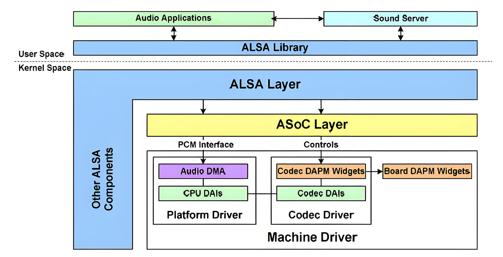

# Audio

Introduction to the functions and usage of Audio.

## Module Introduction

The Audio module includes 2 I2S and 1 HDMIAUDIO.

### Function Introduction



The ALSA audio framework can be divided into the following layers:  

- ALSA Library  
Provides a unified API interface for applications. All APPs only need to call the API provided by alsa-lib to implement playback, recording, and control. There are currently two basic libraries, tinyalsa is a simplified alsa-lib library, mainly used by Android systems.
- ALSA CORE  
The core layer of ALSA, provides logical devices (PCM/CTL/MIDI/TIMER/…) system calls upward, and drives hardware devices (Machine/I2S/DMA/CODEC) downward.
- ASoC Core  
The standard framework of ALSA, the core part of ALSA-driver, provides general methods and data structures for various audio device drivers.
- Hardware driver  
Audio hardware device driver, composed of three main parts: Machine, Platform, Codec. Provides ALSA Driver API and the initialization and workflow of the corresponding audio device, implements specific functional components, which is the part that driver developers need to implement.
**Machine**: Generally refers to a specific board, containing specific peripherals, providing a carrier for CPU and Codec. The Machine driver is almost non-reusable. The Machine driver associates the Platform driver and Codec driver together, specifies which Platform driver to use, which Soc-side dai (digital audio interface) to use, which Codec driver to use, and which dai interface on the Codec to use through snd_soc_dai_link, and also performs some board-specific operations.
**Platform**: Generally refers to a specific SoC platform, which can be understood as a certain Soc, with I2S, AC97 audio interfaces, etc., and internally has clocks and DMA units for audio data transmission. The Platform driver is only related to a specific Soc, implements the audio DMA driver and Soc-side dai interface driver of the Soc, it is only related to the SoC, not the Machine, so we can abstract the Platform, so that the same Soc can be used in different Machines without any modification.
**Codec**: Audio codec, which includes I2S interface, D/A, A/D, Mixer, PA (amplifier), usually contains multiple inputs (Mic, Line-in, I2S, PCM) and multiple outputs (headphones, speakers, earpiece, Line-out), and the Soc can usually control the codec chip via I2C. The Codec driver is only related to the Codec codec driver, not the Soc and Machine. Like Platform, Codec should be implemented as a reusable component, and the same Codec can be used by different Machines.

### Audio Solution Introduction

K1 currently supports two audio sound card solutions  
Solution 1: HDMIAUDIO, supports playback  
Solution 2: I2S0 with an external Codec ES8326B via I2C, supports playback and recording

### Source Code Structure Introduction

I2S/HDMIAUDIO controller driver code is under sound/soc/spacemit:

```
sound/soc/spacemit
├── Kconfig
├── Makefile
├── spacemit-dummy-codec.c    # dummy codec, used with hdmiaudio to create a sound card
├── spacemit-snd-card.c       # sound card driver
├── spacemit-snd-i2s.c        # i2s driver
├── spacemit-snd-i2s.h
├── spacemit-snd-pcm-dma.c    # platform driver, mainly pcm related
├── spacemit-snd-sspa.c       # hdmiaudio driver
├── spacemit-snd-sspa.h
```

Codec ES8326B driver code is under sound/soc/codec:

```
sound/soc/codec
├── es8326.c
├── es8326.h
```

## I2S

### Key Features

  Supports 48000 sample rate, 16bit sample depth, 2 channels  
  Supports playback and recording  
  Supports full duplex  

### Configuration Introduction

Mainly includes driver enable configuration and dts configuration

#### CONFIG Configuration

##### Audio function support

CONFIG_SOUND, CONFIG_SND, CONFIG_SND_SOC provide support for the ALSA audio driver framework. By default, these options are Y.

```
Device Drivers
        Sound card support (SOUND [=y])
                Advanced Linux Sound Architecture (SND [=y])
                        ALSA for SoC audio support (SND_SOC [=y])
```

##### Audio function support

CONFIG_SND_SOC_SPACEMIT, CONFIG_SPACEMIT_CARD, CONFIG_SPACEMIT_PCM provide support for K1 audio functions. By default, these options are Y.

```
Device Drivers
        Sound card support (SOUND [=y])
                Advanced Linux Sound Architecture (SND [=y])
                        ALSA for SoC audio support (SND_SOC [=y])
                                SoC Audio for SPACEMIT System-on-Chip (SND_SOC_SPACEMIT [=y])
                                        Audio Simple Card (SPACEMIT_CARD [=y])
                                        Audio Platform Pcm (SPACEMIT_PCM [=y])
```

##### I2S function support

CONFIG_SPACEMIT_I2S provides support for I2S function. By default, this option is Y.

```
Device Drivers
        Sound card support (SOUND [=y])
                Advanced Linux Sound Architecture (SND [=y])
                        ALSA for SoC audio support (SND_SOC [=y])
                                SoC Audio for SPACEMIT System-on-Chip (SND_SOC_SPACEMIT [=y])
                                        Audio Simple Card (SPACEMIT_CARD [=y])
                                        Audio Platform Pcm (SPACEMIT_PCM [=y])
                                        Audio Cpudai I2S (SPACEMIT_I2S [=y])
```

#### DTS Configuration

##### pinctrl

- i2s0 pinctrl configuration  
There are two sets of pinctrl configurations, configure according to the actual hardware design

```
        pinctrl_sspa0_0: sspa0_0_grp {
                pinctrl-single,pins =<
                        K1X_PADCONF(GPIO_118, MUX_MODE3, (EDGE_NONE | PULL_UP | PAD_1V8_DS0))   /* sspa0_clk */
                        K1X_PADCONF(GPIO_119, MUX_MODE3, (EDGE_NONE | PULL_UP | PAD_1V8_DS0))   /* sspa0_frm */
                        K1X_PADCONF(GPIO_120, MUX_MODE3, (EDGE_NONE | PULL_UP | PAD_1V8_DS0))   /* sspa0_txd */
                        K1X_PADCONF(GPIO_121, MUX_MODE3, (EDGE_NONE | PULL_UP | PAD_1V8_DS0))   /* sspa0_rxd */
                        K1X_PADCONF(GPIO_122, MUX_MODE3, (EDGE_NONE | PULL_UP | PAD_1V8_DS0))   /* sspa0_sysclk */
                >;
        };

        pinctrl_sspa0_1: sspa0_1_grp {
                pinctrl-single,pins =<
                        K1X_PADCONF(GPIO_58,  MUX_MODE2, (EDGE_NONE | PULL_UP | PAD_1V8_DS0))   /* sspa0_sysclk */
                        K1X_PADCONF(GPIO_111, MUX_MODE2, (EDGE_NONE | PULL_UP | PAD_1V8_DS0))   /* sspa0_clk */
                        K1X_PADCONF(GPIO_112, MUX_MODE2, (EDGE_NONE | PULL_UP | PAD_1V8_DS0))   /* sspa0_frm */
                        K1X_PADCONF(GPIO_113, MUX_MODE2, (EDGE_NONE | PULL_UP | PAD_1V8_DS0))   /* sspa0_txd */
                        K1X_PADCONF(GPIO_114, MUX_MODE2, (EDGE_NONE | PULL_UP | PAD_1V8_DS0))   /* sspa0_rxd */
                >;
        }

&i2s0 {
        pinctrl-names = "default";
        pinctrl-0 = <&pinctrl_sspa0_0>;         # use pinctrl_sspa0_0 group
        status = "okay";
};

```

- i2s1 pinctrl configuration  

```
        pinctrl_sspa1: sspa1_grp {
                pinctrl-single,pins =<
                        K1X_PADCONF(GPIO_24, MUX_MODE3, (EDGE_NONE | PULL_UP | PAD_1V8_DS0))    /* sspa1_sysclk */
                        K1X_PADCONF(GPIO_25, MUX_MODE1, (EDGE_NONE | PULL_UP | PAD_1V8_DS0))    /* sspa1_sclk */
                        K1X_PADCONF(GPIO_26, MUX_MODE1, (EDGE_NONE | PULL_UP | PAD_1V8_DS0))    /* sspa1_frm */
                        K1X_PADCONF(GPIO_27, MUX_MODE1, (EDGE_NONE | PULL_UP | PAD_1V8_DS0))    /* sspa1_txd */
                        K1X_PADCONF(GPIO_28, MUX_MODE1, (EDGE_NONE | PULL_UP | PAD_1V8_DS0))    /* sspa1_rxd */
                >;
        };

&i2s1 {
        pinctrl-names = "default";
        pinctrl-0 = <&pinctrl_sspa1>;          # use pinctrl_sspa1 group
        status = "okay";
};

```

#### I2S-Codec Sound Card Configuration

##### Codec Configuration

Take Codec ES8326B as an example for complete sound card configuration

###### Config Configuration

Enable ES8326B configuration

```
Device Drivers│
        Sound card support (SOUND [=y])
                Advanced Linux Sound Architecture (SND [=y])
                        ALSA for SoC audio support (SND_SOC [=y])
                                CODEC drivers
                                        Everest Semi ES8326 CODEC (SND_SOC_ES8326 [=y])
```

###### dts Configuration

- gpio  
Configure according to the actual hardware design. For example, on some K1 development boards, ES8326B uses gpio129 for headphone plug detection and gpio127 to control the board speaker.

```
        es8326: es8326@19{
                interrupt-parent = <&gpio>;
                interrupts = <126 1>;                 # headphone plug detection
                spk-ctl-gpio = <&gpio 127 0>;         # board speaker control gpio
        };

```

###### dts Configuration Example

The complete configuration for Codec ES8236B is as follows:

```
        es8326: es8326@19{
                compatible = "everest,es8326";
                reg = <0x19>;
                #sound-dai-cells = <0>;
                interrupt-parent = <&gpio>;
                interrupts = <126 1>;                 # headphone plug detection
                spk-ctl-gpio = <&gpio 127 0>;         # board speaker control gpio
                everest,mic1-src = [44];              # ADC source configuration
                everest,mic2-src = [66];
                status = "okay";
        };
```

###### mclk Configuration

The mclk of Codec ES8326B is provided by I2S0, configured in the sound card node sound_codec

```

&sound_codec {
        status = "okay";
        simple-audio-card,name = "snd-es8326";
        spacemit,mclk-fs = <64>;                      # configure mclk = 64 * fs, i.e. 3.072MHz
        simple-audio-card,codec {
                sound-dai = <&es8326>;
        };
};

```

Note: spacemit,mclk-fs only supports 64/128/256, i.e. 3.072/6.144/12.288MHz

##### Sound Card Configuration

###### dts Configuration

```
        sound_codec: snd-card@1 {
                compatible = "spacemit,simple-audio-card";
                simple-audio-card,format = "i2s";
                status = "disabled";
                interconnects = <&dram_range4>;
                interconnect-names = "dma-mem";
                spacemit,init-jack;
                simple-audio-card,cpu {                      # cpudai configuration
                        sound-dai = <&i2s0>;
                };
                simple-audio-card,plat {
                        sound-dai = <&i2s0_dma>;             # platform pcm configuration
                };
        };

&sound_codec {
        status = "okay";
        simple-audio-card,name = "snd-es8326";
        spacemit,mclk-fs = <64>;
        simple-audio-card,codec {
                sound-dai = <&es8326>;                       # codecdai configuration
        };
};

```

## HDMIAUDIO

### Key Features

  Supports 48000 sample rate, 16bit sample depth, 2 channels  
  Playback only

### Configuration Introduction

Mainly includes driver enable configuration and dts configuration. Since HDMIAUDIO depends on HDMI display function, make sure HDMI display is supported. Please refer to the corresponding documentation.

#### CONFIG Configuration

##### Audio function support

CONFIG_SOUND, CONFIG_SND, CONFIG_SND_SOC provide support for the ALSA audio driver framework. By default, these options are Y.

```
Device Drivers
        Sound card support (SOUND [=y])
                Advanced Linux Sound Architecture (SND [=y])
                        ALSA for SoC audio support (SND_SOC [=y])
```

##### K1 audio function support

CONFIG_SND_SOC_SPACEMIT, CONFIG_SPACEMIT_CARD, CONFIG_SPACEMIT_PCM provide support for K1 audio functions. By default, these options are Y.

```
Device Drivers
        Sound card support (SOUND [=y])
                Advanced Linux Sound Architecture (SND [=y])
                        ALSA for SoC audio support (SND_SOC [=y])
                                SoC Audio for SPACEMIT System-on-Chip (SND_SOC_SPACEMIT [=y])
                                        Audio Simple Card (SPACEMIT_CARD [=y])
                                        Audio Platform Pcm (SPACEMIT_PCM [=y])
```

##### HDMIAUDIO function support

CONFIG_SPACEMIT_HDMIAUDIO, CONFIG_SPACEMIT_DUMMYCODEC provide support for HDMIAUDIO function. By default, these options are Y.

```
Device Drivers
        Sound card support (SOUND [=y])
                Advanced Linux Sound Architecture (SND [=y])
                        ALSA for SoC audio support (SND_SOC [=y])
                                SoC Audio for SPACEMIT System-on-Chip (SND_SOC_SPACEMIT [=y])
                                        Audio Simple Card (SPACEMIT_CARD [=y])
                                        Audio Platform Pcm (SPACEMIT_PCM [=y])
                                        Audio Cpudai HDMI Audio (SPACEMIT_HDMIAUDIO [=y])
                                        Audio CodecDai Dummy Codec (SPACEMIT_DUMMYCODEC [=y]) 
```

#### DTS Configuration

```
&hdmiaudio {
        status = "okay";
};
```

#### HDMIAUDIO Sound Card Configuration

##### dts Configuration

```

        sound_hdmi: snd-card@0 {
                compatible = "spacemit,simple-audio-card";
                simple-audio-card,name = "snd-hdmi";
                status = "disabled";
                interconnects = <&dram_range4>;
                interconnect-names = "dma-mem";
                simple-audio-card,plat {                        # platform pcm configuration
                        sound-dai = <&hdmi_dma>;
                };
                simple-audio-card,codec {                       # codecdai configuration
                        sound-dai = <&dummy_codec>;
                };
        };

&sound_hdmi {
        status = "okay";
        simple-audio-card,cpu {
                sound-dai = <&hdmiaudio>;                       # cpudai configuration
        };
};

```

## API Introduction

### API Introduction

Please refer to the relevant official Linux documentation.

## Debug Introduction

You can debug through the nodes under /proc/asound/

- View sound card devices

```
root:/# cat /proc/asound/pcm
00-00: SSPA2-dummy_codec dummy_codec-0 :  : playback 1
01-00: i2s-dai0-ES8326 HiFi ES8326 HiFi-0 :  : playback 1 : capture 1
root:/#
```

- View sound card status and other information

```
root:/# cat /proc/asound/card1/pcm0p/sub0/status
state: RUNNING
owner_pid   : 3767
trigger_time: 224110.719883196
tstamp      : 224164.735391138
delay       : 2048
avail       : 2048
avail_max   : 2048
-----
hw_ptr      : 2592768
appl_ptr    : 2594816
root:/# cat /proc/asound/card1/pcm0p/sub0/status
state: RUNNING
owner_pid   : 3767
trigger_time: 224110.719883196
tstamp      : 224166.975406348
delay       : 3072
avail       : 1024
avail_max   : 2048
-----
hw_ptr      : 2700288
appl_ptr    : 2703360
root:/# cat /proc/asound/card1/pcm0p/sub0/hw_params
access: RW_INTERLEAVED
format: S16_LE
subformat: STD
channels: 2
rate: 48000 (48000/1)
period_size: 1024
buffer_size: 4096
root:/# 
```

## Test Introduction

Audio functions can be tested using alsa-utils/tinyalsa tools. Currently, the alsa-utils tool is integrated on bianbu-linux.

### Playback Test

- View playback devices

```
// aplay -l to view playback devices, you can see two playback devices
root:/# aplay -l
**** PLAYBACK hardware device list ****
card 0: sndhdmi [snd-hdmi], device 0: SSPA2-dummy_codec dummy_codec-0 []
  Subdevices: 1/1
  Subdevice #0: subdevice #0
card 1: sndes8326 [snd-es8326], device 0: i2s-dai0-ES8326 HiFi ES8326 HiFi-0 []
  Subdevices: 1/1
  Subdevice #0: subdevice #0
root:/#
// hdmiaudio playback device, cardid is 0, deviceid is 0
// I2S-Codec playback device, cardid is 1, deviceid is 0
```

- Playback test  
Select the device for playback, specify by cardid and deviceid

```
// Select hdmiaudio sound card for playback
aplay -Dhw:0,0 -r 48000 -f S16_LE --period-size=480 --buffer-size=1920 xxx.way
// Select I2S-Codec sound card for playback
aplay -Dhw:1,0 -r 48000 -f S16_LE --periopd-size=1024 --buffer-size=4096 xxx.way

```

### Recording Test

- View capture devices

```
// arecord -l to view playback devices, you can see one recording device
root@spacemit-k1-x-deb1-board:~# arecord -1
****
CAPTURE hardware device list
****
card 1: sndes8326 [snd-es8326], device 0: i2s-daai0-ES8326 HiFi ES8326 HiFi-@
Subdevices:1/1
Subdevice #0: subdevice #0
root@spacemit-k1-x-deb1-board:~#
// I2S-Codec recording device, cardid is 1, deviceid is 0
```

- Recording test  
Select the device for recording, specify by cardid and deviceid

```
// Select I2S-Codec sound card for recording
arecord -Dhw:1,0 -r 48000 -c 2 -f S16_LE --period-size=1024 --buffer-size=4096 xxx.wav
```

## FAQ
