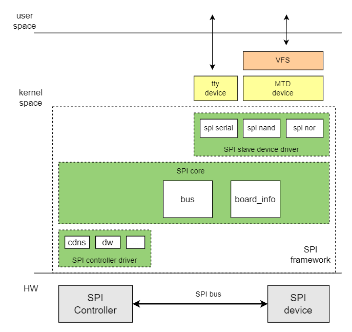

# SPI

Introduction to the functions and usage of SPI.

## Module Introduction

SPI is a serial interface bus (spi) between soc and peripherals, only supporting 1x mode. SPI has master and slave modes, usually connecting one master device and one or more slave devices. The master selects a slave device for communication and completes data exchange. The master provides the clock, and read/write operations are initiated by the master. k1 spi currently only supports master mode.

### Function Introduction

  

The Linux spi driver framework is divided into three parts: spi core, spi controller driver, and spi device driver.  
The main functions of spi core:

- spi bus and spi_master class registration  
- spi controller addition and removal  
- spi device addition and removal  
- spi device driver registration and deregistration  

spi controller driver:

- spi master controller driver, operates the spi master controller

spi device driver

- spi device driver

### Source Code Structure Introduction

The controller driver code is under drivers/spi:  

```
|-- spi-k1x.c              # k1 spi driver
```

## Key Features

### Features

| Feature | Description |
| :-----| :----|
| Communication Protocol | Supports SSP/SPI/MicroWire/PSP protocols |
| Communication Frequency | Supports up to 53MHz, down to 6.3kbps |
| Communication Multiplier | x1 | 
| Supported Peripherals | Supports spi-nor and spi-nand | 

### Performance Parameters

#### Communication Frequency

Supported communication frequencies are 51.2M/25.6M/12.8M/6.4M/3.2M/1.6M/200k/1M

#### Communication Multiplier

Supports x1 communication multiplier.

Test Method  
You can use an oscilloscope or logic analyzer to test the frequency of the sck signal.

## Configuration Introduction

Mainly includes driver enable configuration and dts configuration

### CONFIG Configuration

CONFIG_SPI provides support for the SPI bus protocol, this option is set to Y by default
```
Device Drivers
        SPI support (SPI [=y])
```

CONFIG_SPI_K1X provides support for the K1 spi controller driver, this option is set to Y by default
```
Device Drivers
        SPI support (SPI [=y])
                K1X SPI Controller (SPI_K1X [=y])

```

### dts Configuration

#### pinctrl

Refer to the schematic diagram to find the pin group used by spi. Refer to the pinctrl section to determine the pin group used by spi.

Assuming spi3 can directly use the pinctrl_ssp3_0 group defined in k1-x_pinctrl.dtsi.

#### spi Device Configuration

You need to confirm the spi device type and the communication frequency between spi and the spi device.

##### Device Type

Confirm the type of spi device connected under spi, whether it is spi-nor or spi-nand.

##### Communication Frequency

The maximum communication rate between the spi controller and the spi device.  

##### Communication Multiplier

Supports x1 communication multiplier.

##### spi Device dts

Taking spi nor as an example, using the maximum communication frequency of 26MHz, with x1 communication for both sending and receiving.

#### dts Example
```c
&spi3 {
        pinctrl-names = "default";
        pinctrl-0 = <&pinctrl_ssp3_0>;
        k1x,ssp-disable-dma;
        status = "okay";
        k1x,ssp-clock-rate = <25600000>;

        flash@0 {
                compatible = "jedec,spi-nor";
                reg = <0>;
                spi-max-frequency = <25600000>;
                m25p,fast-read;
                broken-flash-reset;
                status = "okay";
        };
};
```

## Interface Introduction

### API Introduction

Device driver registration and deregistration

```
int __spi_register_driver(struct module *owner, struct spi_driver *sdrv);  
void spi_unregister_driver(struct spi_driver *sdrv);
```

Data transmission API

- Initialize spi_message

```
void spi_message_init(struct spi_message *m);
```

- Add spi_transfer to the transfer list of spi_message

```
void spi_message_add_tail(struct spi_transfer *t, struct spi_message *m);
```

- Write data

```
int spi_write(struct spi_device *spi, const void *buf, size_t len);
```

- Read data

```
int spi_read(struct spi_device *spi, void *buf, size_t len);
```

- Synchronous transmission of spi_message

```
int spi_sync(struct spi_device *spi, struct spi_message *message);
```

## Debug Introduction

### sysfs

View the system spi bus device and driver information
/sys/bus/spi

```
|-- devices                 // Devices on the spi bus
|-- drivers                 // Device drivers registered on the spi bus
|-- drivers_autoprobe
|-- drivers_probe
`-- uevent
```

### debugfs

Used to view spi device information in the system
/sys/kernel/debug/spi-nor/spi3.0

## Test Introduction

### spi-nand/nor Read and Write Speed Test

Enable CONFIG_MTD_TESTS

```
Device Drivers
         Memory Technology Device (MTD) support (MTD [=y])
                MTD tests support (DANGEROUS) (MTD_TESTS [=m])   
```

Test Command

```
insmod mtd_speedtest.ko dev=0   # 0 indicates the mtd device number of spi-nand/nor
```

## FAQ
