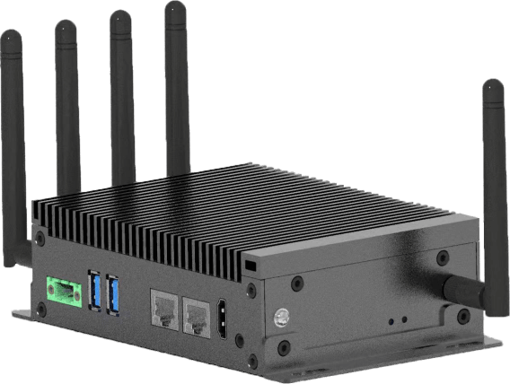
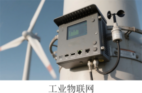
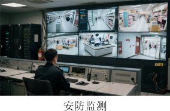
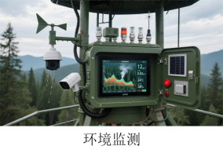
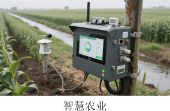

# EPC1000 边缘计算盒子

EPC1000边缘计算盒是一款极具性价比的边缘计算设备，基于国产Spacemit K1 RISC-V应用处理器设计，集成八核RISC-V X60 AI CPU，主频1.8GHz，CPU融合2.0 Tops AI算力，支持4K视频编解码。采用紧凑型工业设计，一体化结构，体积小巧，功能强大，具备高性能、低功耗、国产化等优势特色。

EPC1000边缘计算盒具有丰富的功能接口，拥有双千兆以太网口、4个USB3.0，1个3.5mm耳机接口，2路带隔离的RS485，2路带隔离的RS232，4路带隔离的DI，4路带隔离的DO，1路带隔离的CAN，支持4G/5G，支持北斗导航定位，支持Micro SD卡扩展，支持NVMe固态硬盘扩展。可通过HDMI和MIPI DSI与显示设备连接，实现视频输出；可外接摄像头，实现人脸识别、属性检测等。

凭借丰富的接口和强大的功能，可广泛应用于工业物联网边缘控制、智慧交通边缘终端、智慧农业边缘监测与控制、安防监测边缘分析节点、车载移动边缘计算终端、环境监测与应急终端以及智慧商显与边缘交互终端等领域。

## 应用场景

## 规格参数

| 处理器   | CPU          | 八核RISC-V X60 AI CPU，主频最高1.8GHz，遵循RISC-V 64GCVB架构和RVA22标准 |
| :------------ | ------------ | ------------------------------------------------------------ |
|          | GPU          | IMG BXE-2-32@819MHz, 32KB SLC，支持OpenCL3.0/OpenGL ES 3.2/Vulkan1.3 |
|          | VPU          | 视频解码：4K@60fps（H.265/H.264/VP8/VP9/MPEG4/MPEG2）视频编码：4K@30fps（H.265/H.264/VP8/VP9） |
|          | AI算力       | 2.0TOPS                                                      |
| 存储器   | 运行内存     | 4GB/8GB LPDDR4X                                              |
|          | 存储内存     | 32GB/64GB eMMC 5.1支持1x Micro SD卡扩展支持1x 2280 NVMe固态硬盘扩展 |
| I/O      | 以太网       | 2x 千兆以太网口                                              |
|          | USB          | 4x USB3.0                                                    |
|          | 视频输出     | 1x HDMI接口,最高支持1080P@60fps输出1x MIPI DSI接口，最高支持1080P@60fps输出 |
|          | 音频输出     | 1x 3.5mm耳机接口                                             |
|          | CAN          | 1x 带隔离的CAN                                               |
|          | RS485        | 2x 带隔离的RS485                                             |
|          | RS232        | 2x 带隔离的RS232                                             |
|          | DI           | 4x 带隔离的DI                                                |
|          | DO           | 4x 带隔离的DO，可以设置默认输出电平                          |
|          | Micro SD卡槽 | 1x                                                           |
|          | Sim卡槽      | 1x，支持4G/5G                                                |
|          | 调试         | 1x USB-C调试口                                               |
|          | 风扇         | 1x 3Pin风扇接口                                              |
|          | RTC          | 支持内部RTC                                                  |
|          | 天线         | 5x 天线接口，其中4根是4G/5G天线，1根是GPS/BDS天线            |
| 按键     |              | 1x Reset键、1x Recover键、1x Power键                         |
| 指示灯   |              | 1x电源指示灯，1x状态指示灯                                   |
| 常规参数 | 电源         | DC 9V~36V                                                    |
|          | 工作温度     | -20 ~ +75 °C                                                 |
|          | 工作湿度     | 95%相对湿度，无冷凝                                          |
|          | 尺寸         | 164.0x100.0x45.0mm                                           |
| 操作系统 |              | Bianbu Linux/Open Harmony                                    |

## 产品六视图

